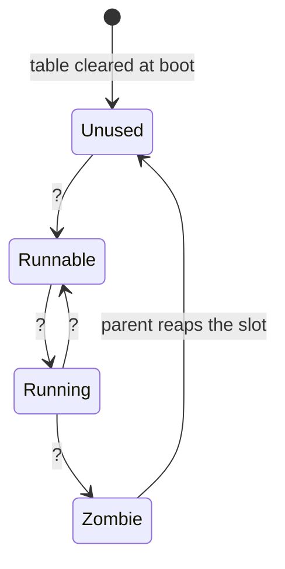
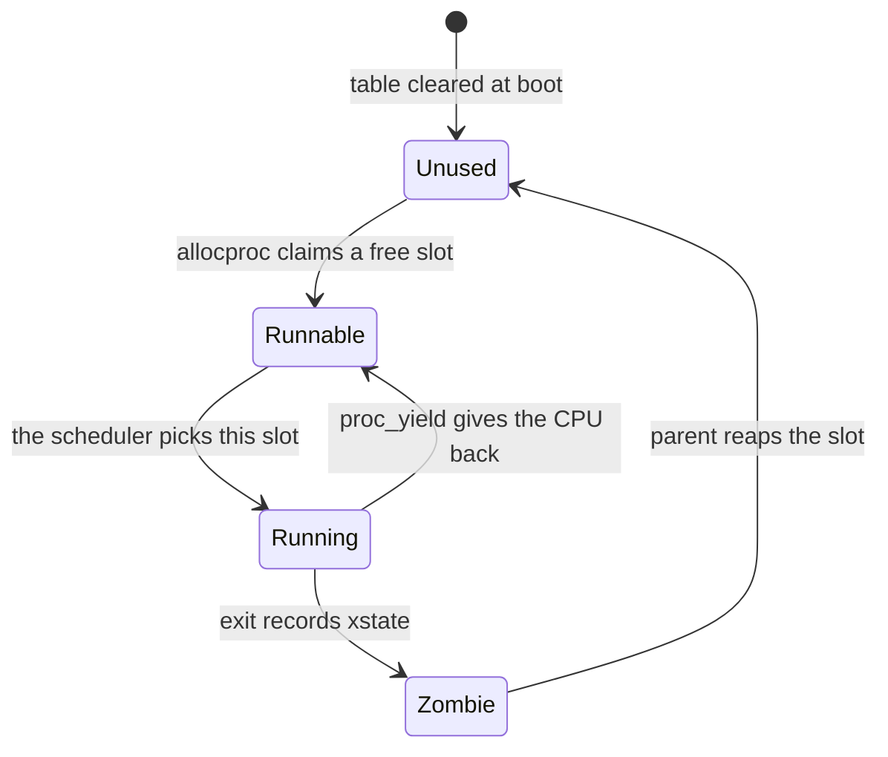

# Practice Set 1

**Distributed:** Tuesday, October 6 · **Worked and reviewed in class:**
Thursday, October 8 · **Prepares for:** Midterm 1, Tuesday, October 13.

This is the one piece of CS 326 work that happens outside the room, and it is
deliberately **pencil and paper, not programming** — nothing to write, run, or
submit. That is what makes it compatible with the
[Integrity Policy](../guides/integrity-policy.md): the no-homework rule protects
the rv6 exercises, and a problem about Sv39 bit positions puts none at risk.

**It is ungraded — but Thursday's review assumes you attempted it.** We work
these at the board, and the session is worth little if you are seeing the
questions for the first time.

**Work it the way you will sit the exam.** On paper, closed book, one reference
open: the [Cheatsheet](../guides/cheatsheet.md), which you may print. No laptop,
no QEMU, no calculator — every number here falls out of shifts and masks. The
point is finding out *which* of these you cannot do without a compiler checking
you. See [Exam Prep](../guides/exam-prep.md) for the three question shapes;
each is labelled below.

Scope: all of Module 1, plus kernel exercises `ex00`–`ex04`.

---

## Part A — Rust semantics

### Problem 1: What survives a move

**(Trace it.)** For each numbered line, say whether it compiles. If it does
not, name the binding that was moved and where. Assume `Vec` is available.

```rust
let pages: Vec<usize> = vec![0x8004_1000, 0x8004_5000];
let count = pages.len();          // 1
let taken = pages;                // 2
let again = pages.len();          // 3
let n = count;                    // 4
let m = count;                    // 5

fn consume(v: Vec<usize>) -> usize { v.len() }
let k = consume(taken);           // 6
let j = consume(taken);           // 7
```

<details>
<summary>Click to reveal solution</summary>

| Line | Compiles? | Why |
|---|---|---|
| 1 | yes | `len` takes `&self`; a borrow is not a move |
| 2 | yes | ownership of the heap buffer moves from `pages` to `taken` |
| 3 | **no** | `pages` was moved on line 2 — `error[E0382]: borrow of moved value` |
| 4 | yes | `count` is a `usize`, which is `Copy` |
| 5 | yes | copying does not consume the original, so it can be copied again |
| 6 | yes | passing by value moves `taken` into the parameter `v` |
| 7 | **no** | `taken` was moved on line 6 |

The rule in one sentence: **a non-`Copy` value has exactly one owner, and
assignment or passing by value transfers it.** A `Vec` owns a heap buffer, so
two bindings would mean two drops — a double free. A `usize` owns nothing, so
the bits are just copied.

The common wrong answer is that line 3 is fine "because `len` only reads it,"
which confuses what the method does with whether the value still exists. This
is the discipline `freeproc` upholds by hand — one owner of the page table,
freed once — except that there the compiler is not watching, because the table
is a `static mut` reached through raw pointers.

</details>

### Problem 2: Find the borrow error

**(Explain it.)** This will not compile. Say which rule it breaks, quote the
two conflicting borrows, and fix it without cloning and without `unsafe`.

```rust
fn install(entries: &mut [usize], src: usize, dst: usize) {
    let from = &entries[src];
    let slot = &mut entries[dst];
    *slot = *from | 1;
}
```

<details>
<summary>Click to reveal solution</summary>

The aliasing rule: **at any moment you may have either any number of `&T`, or
exactly one `&mut T`, never both.** Line 2 takes a shared borrow of `entries`;
line 3 takes a mutable borrow of the same slice while the first is still live
(it is used on line 4). `error[E0502]: cannot borrow *entries as mutable
because it is also borrowed as immutable`.

The fix is to end the shared borrow before the mutable one begins, by copying
out the value — which is free, because `usize` is `Copy`:

```rust
fn install(entries: &mut [usize], src: usize, dst: usize) {
    let from = entries[src];      // a usize, not a reference
    entries[dst] = from | 1;
}
```

What the compiler is protecting you from is not hypothetical: if `src == dst`
the original reads and writes one slot through two paths — harmless here, a
real bug in a walk where `from` is re-read after `slot` is written.

The common wrong answer is `entries[src].clone()`. It compiles, but `clone` on
a `Copy` type is a copy with extra syllables, and reaching for it hides that
you never needed a reference at all.

</details>

### Problem 3: `Option`, `Result`, and exhaustive `match`

**(Explain it.)** `walkaddr` signals "not mapped" by returning physical address
`0`; `mappages` signals failure with `Result<(), ()>`.

(a) Why can `walkaddr` get away with `0` as a sentinel, and what would
`Option<usize>` buy?

(b) `ProcState` has five variants. A student writes:

```rust
match p.state {
    ProcState::Unused => 0,
    ProcState::Runnable => 1,
    ProcState::Running => 2,
    _ => 3,
}
```

What does the `_` arm cost them, concretely, when a sixth state is added?

(c) The process table is `[Proc; NPROC]`, a fixed array of 64. Give two
reasons a kernel prefers this to a `Vec<Proc>`.

<details>
<summary>Click to reveal solution</summary>

**(a)** RAM starts at `KERNBASE = 0x8000_0000`, so no page the allocator hands
out lies at `0`: the value is *unrepresentable* as a success and can safely
mean failure. `Option<usize>` would put that in the type — `None` cannot be
mistaken for an address, and the compiler would force every caller to handle
it, where today a caller can forget the `if pa == 0` check. rv6 keeps the
sentinel because it is copying xv6's C.

**(b)** The `_` arm makes the `match` compile forever. Add a sixth state and
every exhaustive `match` becomes a compile error pointing at the line to update
— that is the feature — but this one silently classifies it as `3`.
Exhaustiveness is worth something only if you refuse to opt out.

**(c)** First, **there is no heap to grow into**: `Vec` needs an allocator, and
the allocator is something the kernel provides. Second, **predictability** —
64 × 40 bytes = 2,560 bytes of `.bss` fixed at compile time, no allocation on
any path that creates a process, and a knowable limit instead of an
out-of-memory failure at an awkward moment. The cost is exactly that limit:
`allocproc` returns null at 64.

</details>

---

## Part B — The numbers the kernel runs on

### Problem 4: Hex, binary, and overflow

**(Decode it.)** No calculator.

(a) Write `0xB7` in binary, and say which of `V`, `R`, `W`, `X`, `U` a PTE
with those low bits would have set (`V`=1, `R`=2, `W`=4, `X`=8, `U`=16).

(b) `let x: u8 = 200; let y = x + 100;` — what happens in a debug build, and
what happens in a release build?

(c) Give the values of `x.wrapping_add(100)` and `x.checked_add(100)`.

(d) `0x8004_2000` is how far above `KERNBASE`, in bytes and in pages?

<details>
<summary>Click to reveal solution</summary>

**(a)** `0xB` = `1011`, `0x7` = `0111`, so `0xB7` = `0b1011_0111` = 183. Low
five bits `1_0111`: `V` set, `R` set, `W` set, `X` **clear**, `U` set — so
`V | R | W | U`, a writable, non-executable user page. (Bits 5 and 7 are also
set, `G` and `D`; rv6 never sets them.)

**(b)** 300 does not fit in a `u8` (max 255). **Debug**: the overflow check is
compiled in and the program **panics** — `attempt to add with overflow`.
**Release**: the check is compiled out and the value **wraps** to 300 − 256 =
**44**. Same source, two behaviours, and you ship the release profile.

**(c)** `wrapping_add(100)` = **44** in both profiles — the intentional version
of the release behaviour. `checked_add(100)` = **`None`**, since it returns
`Option<u8>`.

**(d)** `0x8004_2000 − 0x8000_0000 = 0x4_2000` = 270,336 bytes. Dividing by
`PGSIZE` is a shift: `0x4_2000 >> 12 = 0x42` = **66 pages**. Dropping three hex
digits *is* dividing by 4096 — do that, never long division.

</details>

### Problem 5: Alignment, and where free memory starts

**(Trace it.)** The linker places the `end` symbol at `0x8002_9C10`.
`PGSIZE = 0x1000`, `PHYSTOP = 0x8800_0000`.

```rust
fn pgroundup(addr: usize) -> usize { (addr + PGSIZE - 1) & !(PGSIZE - 1) }
```

(a) Compute `pgroundup(end)` and `pgrounddown(end)`, showing both steps.

(b) `free_range` loops `while p + PGSIZE <= stop`. Give the first and last
physical addresses passed to `kfree`, and the number of pages the loop builds.

(c) Sanity-check (b) against the size of RAM.

(d) Why does this `pgroundup` idiom require `PGSIZE` to be a power of two?

<details>
<summary>Click to reveal solution</summary>

**(a)**

```text
pgroundup(0x8002_9C10) = (0x8002_9C10 + 0xFFF) & !0xFFF
                       =  0x8002_AC0F & 0xFFFF_F000
                       =  0x8002_A000
pgrounddown(0x8002_9C10) = 0x8002_9C10 & !0xFFF = 0x8002_9000
```

**(b)** The first `kfree` is at `0x8002_A000`. The loop stops when a *whole*
page no longer fits below `PHYSTOP`, so the last page freed starts at
`0x8800_0000 − 0x1000 = 0x87FF_F000`.

```text
(0x8800_0000 − 0x8002_A000) >> 12 = 0x07FD_6000 >> 12 = 0x7FD6 = 32,726 pages
```

**(c)** RAM is 128 MiB = `0x0800_0000` bytes = `0x8000` pages = 32,768. The
kernel image occupies `0x8002_A000 − 0x8000_0000 = 0x2_A000` = `0x2A` = 42, and
32,768 − 42 = 32,726. The two agree — compute every answer twice, from opposite
ends.

**(d)** `!(PGSIZE − 1)` is a clean low-bit mask only when `PGSIZE − 1` is a run
of 1s — that is, when `PGSIZE` is a power of two. The other half matters too:
adding `PGSIZE − 1` can never push an already-aligned address past its own
boundary, so aligned addresses are fixed points —
`pgroundup(0x8002_A000) = 0x8002_A000`.

The common wrong answer to (b) is `0x8800_0000`. Read the loop condition:
freeing a page that starts at `PHYSTOP` would hand out memory that does not
exist.

</details>

---

## Part C — RISC-V and the calling convention

### Problem 6: Trace a byte-summing routine

**(Trace it.)** Memory at `0x8004_0000` holds the bytes `10 20 F0`, and the
routine is called as `sum_bytes(0x8004_0000, 3)`.

```asm
.globl sum_bytes
sum_bytes:                 # a0 = ptr, a1 = n  ->  a0 = sum
    li   t1, 0
1:                         # A
    lb   t0, 0(a0)
    add  t1, t1, t0
    addi a0, a0, 1
    addi a1, a1, -1
    bnez a1, 1b            # B
    mv   a0, t1
    ret                    # C
```

(a) Give `a0`, `a1`, `t0`, `t1` at A on the first iteration, at B on each of
the three iterations, and at C.

(b) What does the function return?

(c) The routine never touches `ra` or `sp`, and has no prologue. Why is that
legal?

<details>
<summary>Click to reveal solution</summary>

**(a)** The trap is `lb`: it **sign-extends**. `0xF0` has its top bit set, so
it loads as `0xFFFF_FFFF_FFFF_FFF0` = −16.

| Point | `a0` | `a1` | `t0` | `t1` |
|---|---|---|---|---|
| A (iter 1) | `0x8004_0000` | 3 | — | 0 |
| B (iter 1) | `0x8004_0001` | 2 | `0x10` | `0x10` |
| B (iter 2) | `0x8004_0002` | 1 | `0x20` | `0x30` |
| B (iter 3) | `0x8004_0003` | 0 | `0xFF..FF F0` | `0x20` |
| C | `0x20` | 0 | `0xFF..FF F0` | `0x20` |

**(b)** `0x20` = **32**. Arithmetic: 16 + 32 + (−16) = 32.

The common wrong answer is `0x120` = 288, the bytes summed as unsigned — what
`lbu` would give, and what almost everyone writes first. `lb`/`lh`/`lw`
sign-extend; `lbu`/`lhu`/`lwu` zero-extend. A byte you meant as *data* is
loaded with `lbu`.

**(c)** Every register it uses — `a0`, `a1`, `t0`, `t1` — is **caller-saved**,
so the caller has already spilled anything it cared about in them. A leaf
function that stays inside those owes nobody a prologue, an epilogue, or a
frame, and `ret` jumps to the `ra` it was called with, untouched.

</details>

### Problem 7: The routine that clobbers `s0`

**(Explain it.)** A classmate rewrites the loop above using `s0` as the
accumulator instead of `t1`, changing nothing else. Their unit test passes, but
called from a larger Rust function the kernel produces wrong results somewhere
else entirely.

(a) What exactly did they break?

(b) Why did the unit test pass?

(c) Give the two instructions to add at the top and the two at the bottom that
make it correct, and say what happens to `sp`.

<details>
<summary>Click to reveal solution</summary>

**(a)** `s0`–`s11` and `sp` are **callee-saved**: a function that uses one must
restore it. Theirs writes `s0` and returns. The Rust caller had a live value
there — its frame pointer, or a variable the compiler kept across the call
precisely *because* `s0` survives calls — and resumes with garbage, so the
corruption surfaces arbitrarily far from its cause.

**(b)** The test calls it from a tiny wrapper with nothing live in `s0`. The
bug is not "does it compute the right sum" — it does — but "does it honour the
contract", and a test that checks only the return value cannot see that.

**(c)**

```asm
    addi sp, sp, -16       # make room (16, not 8: sp stays 16-byte aligned)
    sd   s0, 0(sp)         # save the caller's s0
    ...
    ld   s0, 0(sp)         # restore it
    addi sp, sp, 16        # give the room back
    ret
```

`sp` must be back to its entry value at `ret` — `sp` is itself callee-saved —
and stay 16-byte aligned throughout, which is why the frame is 16 bytes for one
8-byte register. The same contract is why `swtch` saves exactly `ra`, `sp`, and
`s0`–`s11`, the 14 callee-saved registers and only those: the convention has
already guaranteed nothing else was worth preserving.

</details>

---

## Part D — Bare metal and boot

### Problem 8: `no_std` and volatile

**(Explain it.)** For each, one or two sentences.

(a) Which of these still work under `#![no_std]`: `Option`, `Result`, slices,
iterators, `Vec`, `String`, `Box`, `println!`, `PanicInfo`?

(b) Why does `#![no_std]` force you to write a `#[panic_handler]`, and why is
its return type `!`?

(c) `uart::putc` is `write_volatile(UART0 as *mut u8, c)`. Rewrite it with a
plain `*p = c` and say precisely what the optimiser is allowed to do.

(d) Creating a raw pointer is safe; dereferencing one is `unsafe`. Why is that
split the right place to draw the line?

<details>
<summary>Click to reveal solution</summary>

**(a)** `core` keeps `Option`, `Result`, slices, iterators, and `PanicInfo` —
none need an OS. Gone are `Vec`, `String`, and `Box` (a heap allocator) and
`println!` (stdout, which is a file, which is an OS service). `Vec` and `Box`
return later via `alloc`, once *we* have written the allocator `alloc` needs.

**(b)** `std` supplies the panic handler; without it nothing defines what
"panic" means, and the compiler demands exactly one function that does. The
never type `!` promises it does not return — honest, since there is no caller
to go back to and no way to unwind. rv6 spins.

**(c)** `unsafe { *(UART0 as *mut u8) = c; }` writes a byte to `0x1000_0000`
and never reads it back, so the optimiser may conclude the write is dead and
**delete it**, or merge or reorder several such writes. For memory that is
correct; for a device register the write *is* the effect, and the order of the
writes is the order of the characters. `write_volatile` says: this access has a
side effect you cannot see — perform it exactly once, exactly here.

**(d)** The address arithmetic is inert: `0x1000_0000 as *mut u8` computes a
number and corrupts nothing. The dereference is where a claim about the world
is made — that the address is mapped, aligned, and not illegally aliased — so
putting `unsafe` there confines the audit to the lines that claim something.
Note what `unsafe` does *not* do: it disables neither borrow checking nor type
checking. It adds one power, dereferencing raw pointers (plus calling
`unsafe fn`s, reading `static mut`s, and `extern` calls).

</details>

### Problem 9: From reset to `kmain`

**(Order it.)** The linker gives this symbol table, and `STACK_SIZE` is
`4096 * 4`.

```text
  0x8000_0000   _entry
  0x8000_0018   start
  0x8000_1A2C   kmain
  0x8002_5000   STACK0
  0x8002_9C10   end
```

(a) Put these in order and name the constraint that fixes each position:
`call start` · QEMU loads the kernel ELF · `add sp, sp, t0` ·
the machine jumps to `0x8000_0000` · `la sp, STACK0` · `li t0, 0x4000`.

(b) What is `sp` when `start` begins?

(c) `_entry` carries `#[link_section = ".entry"]`. What in `kernel.ld` makes
that matter, and what breaks without it?

(d) Why must `sp` be set before `call start`, and not inside `start`?

(e) The stack occupies `0x8002_5000`–`0x8002_9000`, which is *below* `end`.
Why is that essential, given Problem 5?

<details>
<summary>Click to reveal solution</summary>

**(a)**

| # | Step | What forces its position |
|---|---|---|
| 1 | QEMU loads the kernel ELF | `-bios none`: no firmware, no bootloader — QEMU places the image at the link address |
| 2 | the machine jumps to `0x8000_0000` | the RAM base on `virt`, and the reset PC |
| 3 | `la sp, STACK0` | first instruction of `_entry`; nothing may use a stack before it |
| 4 | `li t0, 0x4000` | `STACK_SIZE`; `t0` is caller-saved scratch |
| 5 | `add sp, sp, t0` | stacks grow **down**, so `sp` must start at the *top* |
| 6 | `call start` | only now is there a stack for Rust to build a frame on |

Steps 3 and 4 are interchangeable — `t0` and `sp` are independent until step 5
— but nothing may move after step 6.

**(b)** `sp = 0x8002_5000 + 0x4000 = 0x8002_9000`.

**(c)** `kernel.ld` sets the location counter to `0x80000000` and opens `.text`
with `*(.entry)` before `*(.text .text.*)`, putting `_entry`'s first
instruction *exactly* at the address the machine jumps to. Without the
attribute `_entry` lands wherever the linker likes, and the machine jumps into
whatever sorted first — with `sp` still garbage.

**(d)** `call` is harmless; it writes a register. But `start` is compiled Rust,
and its first instructions are a prologue: `addi sp, sp, -N` then
`sd ra, (sp)`. With reset garbage in `sp` that store goes to an arbitrary
address. You cannot fix `sp` from inside a function whose prologue has already
used it — which is the whole reason the trampoline is hand-written assembly.

**(e)** `kalloc::init` starts the free list at `pgroundup(end) = 0x8002_A000`
and never hands out anything below it. `STACK0` is an ordinary `.bss` object
inside the kernel image, so the boot stack is excluded automatically. Placed
above `end`, it would be handed out — the page the kernel is running on.

</details>

---

## Part E — Physical memory and Sv39

### Problem 10: Complete the free list

**(Trace it.)** The free list starts in this state:

```text
  FREELIST ──▶ [ 0x8004_5000 ]──▶ [ 0x8004_1000 ]──▶ [ 0x8004_9000 ]──▶ null
```

```rust
let a = kalloc();   // (i)
let b = kalloc();   // (ii)
kfree(a);
let c = kalloc();   // (iii)
kfree(b);
kfree(c);
let d = kalloc();   // (iv)
```

(a) Give the addresses returned at (i)–(iv).

(b) Redraw the final list, filling in the boxes:

```text
  FREELIST ──▶ [ ________ ]──▶ [ ________ ]──▶ null
```

(c) After the last line, what is stored in the first 8 bytes of the page `d`
points at, and why does that not matter?

<details>
<summary>Click to reveal solution</summary>

`kfree` pushes onto the front and `kalloc` pops from the front — a **LIFO
stack**, not a queue.

| Step | Returns | List afterwards |
|---|---|---|
| `a = kalloc()` | `0x8004_5000` | `41000 → 49000` |
| `b = kalloc()` | `0x8004_1000` | `49000` |
| `kfree(a)` | — | `45000 → 49000` |
| `c = kalloc()` | `0x8004_5000` | `49000` |
| `kfree(b)` | — | `41000 → 49000` |
| `kfree(c)` | — | `45000 → 41000 → 49000` |
| `d = kalloc()` | `0x8004_5000` | `41000 → 49000` |

**(a)** (i) `0x8004_5000` (ii) `0x8004_1000` (iii) `0x8004_5000`
(iv) `0x8004_5000` — three of the four are the same page, because the most
recently freed page is always the next allocated.

**(b)**

```text
  FREELIST ──▶ [ 0x8004_1000 ]──▶ [ 0x8004_9000 ]──▶ null
```

**(c)** The first 8 bytes of `0x8004_5000` still hold `0x8004_1000` — the
`next` pointer written by `kfree(c)`, which `kalloc` read but never erased.
Safe *only* because the list is intrusive: the pointer lives inside the page it
describes, so once the page leaves the list nothing reads those bytes again.
It is also why `create_pagetable` calls `write_bytes(pt, 0, PGSIZE)` — `kalloc`
does not zero, and a page table full of stale pointers with bit 0 set would be
a catastrophe.

The common wrong answer is a queue: (i) `45000`, (ii) `41000`, (iii) `49000`.
That is what a list with a tail pointer would do, and it is not what
`FREELIST = r` does.

</details>

### Problem 11: Encode and decode a PTE

**(Decode it.)** `Pte::new(pa, flags)` is `Pte(((pa >> 12) << 10) | flags)`,
and `Pte::pa()` is `(self.0 >> 10) << 12`.

(a) Build the leaf PTE for physical page `0x8009_C000` with `R | W | V`. Show
each shift.

(b) Decode `0x2002_701F`: flags, PPN, physical address, and a one-line verdict.
Would rv6 ever build it?

(c) Decode `0x2002_7001`. It has the same PPN. What is it?

(d) Why do the `>> 12` and the `<< 10` not cancel?

<details>
<summary>Click to reveal solution</summary>

**(a)** Flags = `2 | 4 | 1` = `7`.

```text
0x8009_C000 >> 12  = 0x8_009C            (the PPN)
0x8_009C   << 10   = 0x2002_7000
             | 7   = 0x2002_7007
```

Shifting by 10 on paper: shift left two hex digits (`<< 8`), then double twice.
`0x8009C` → `0x8009C00` → `0x2002_7000`.

**(b)** Flags = `0x2002_701F & 0x3FF` = `0x01F` = `0b1_1111` = `V|R|W|X|U`.
PPN = `0x2002_701F >> 10` = `0x8_009C`, physical address `0x8009_C000`.
Verdict: a user page that is **writable and executable** at once. rv6 never
builds one — `load_segment` maps text `R|X|U`, `map_user_stack` maps the stack
`R|W|U`. W and X together is the classic W⊕X violation: a program that can
write its own code can be made to run anything.

**(c)** Flags = `1` = `V` only, with `R`, `W`, `X` all clear. That is **not a
leaf** — it is an interior entry pointing at the next-level page table, which
happens to sit at `0x8009_C000`. This one bit pattern is how the hardware
distinguishes "go deeper" from "you have arrived", and it is why the walk
terminates.

**(d)** They are not inverses: `>> 12` throws away the offset bits to leave a
page *number*, and `<< 10` parks that number at bit 10, leaving bits 9:0 for
the flags. The net shift is `>> 2`, and those two spare bits are why a 44-bit
PPN and 10 flags fit in one 64-bit word. A PTE holds a page number, never an
address.

</details>

### Problem 12: Translate an address by hand *(the hard one)*

**(Decode it.)** This one is harder than anything else here, deliberately: it
is the shape of the longest question on the midterm. Do not skip ahead.

`satp` holds `0x8000_0000_0008_0040`. Dumping the reachable tables gives only
these non-zero entries:

```text
  table at 0x8004_0000:   [255] = 0x2001_1401
  table at 0x8004_5000:   [511] = 0x2001_1C01
  table at 0x8004_7000:   [510] = 0x2001_4407
                          [511] = 0x2001_240B
```

`px(level, va) = (va >> (12 + 9 * level)) & 0x1FF`.

(a) From `satp`, give the paging mode and the physical address of the root
table.

(b) Translate virtual address `0x3F_FFFF_E2A8` to a physical address. Show
VPN[2], VPN[1], VPN[0] and the offset.

(c) Name the two pages that entries `[510]` and `[511]` of the last table map,
using the constants in `memlayout.rs`.

(d) `walkaddr(root, 0x3F_FFFF_E2A8)` returns `0`, yet the MMU translates the
address perfectly. Explain.

(e) How many physical pages does this page table occupy?

<details>
<summary>Click to reveal solution</summary>

**(a)** Mode is bits 63:60 = `0x8` = **8 = Sv39**. The root PPN is the low 44
bits = `0x8_0040`, so the root table is at `0x8_0040 << 12` = **`0x8004_0000`**
— matching the first table in the dump.

**(b)** Split the address. `0x3F_FFFF_E2A8` is `TRAPFRAME + 0x2A8`:

| Field | Bits | Value |
|---|---|---|
| VPN[2] | 38:30 | `(va >> 30) & 0x1FF` = **255** |
| VPN[1] | 29:21 | `(va >> 21) & 0x1FF` = **511** |
| VPN[0] | 20:12 | `(va >> 12) & 0x1FF` = **510** |
| offset | 11:0 | **`0x2A8`** |

Getting VPN[0] right is where people lose the question. `va >> 12` =
`0x3FF_FFFE`; mask the low 9 bits: `0xFFE & 0x1FF` = `0x1FE` = **510**, not
511. The address is one page *below* the top of the space.

Now walk:

```text
root  0x8004_0000, entry [255] = 0x2001_1401
      flags 0x401 & 0x3FF = 0x001 = V only  -> a branch
      PPN = 0x2001_1401 >> 10 = 0x8_0045    -> next table 0x8004_5000

level-1 0x8004_5000, entry [511] = 0x2001_1C01
      flags = 0x001 = V only                -> a branch
      PPN = 0x8_0047                        -> next table 0x8004_7000

level-0 0x8004_7000, entry [510] = 0x2001_4407
      flags = 0x407 & 0x3FF = 0x007 = V|R|W -> a LEAF
      PPN = 0x2001_4407 >> 10 = 0x8_0051    -> frame 0x8005_1000
```

Physical address = frame + offset = `0x8005_1000 + 0x2A8` = **`0x8005_12A8`**.

**(c)** `TRAMPOLINE = MAXVA − PGSIZE = 0x3F_FFFF_F000` is index 511;
`TRAPFRAME = TRAMPOLINE − PGSIZE = 0x3F_FFFF_E000` is index 510. Entry `[511]`
= `0x2001_240B` has flags `0xB` = `V|R|X` — code, not writable, not user: the
trampoline. Entry `[510]` is `V|R|W` — data, not executable, not user: the
trapframe. The permissions alone identify them.

**(d)** `walkaddr` is not the hardware. After walking it checks
`(*pte).flags() & PTE_U == 0` and returns `0` when the user bit is clear. The
trapframe leaf is `V|R|W` with **no `U`**, deliberately: it is mapped in the
user's page table but must be untouchable from user mode. So `walkaddr` — whose
job is validating addresses a *user program* handed the kernel — correctly
refuses it, while the MMU, running in supervisor mode, translates it on every
trap. "Mapped" and "reachable by the user" are different questions, and this
PTE is where they differ.

**(e)** Three: the root, the level-1 table, and the level-0 table
(`0x8004_0000`, `0x8004_5000`, `0x8004_7000`). The frames they point at,
`0x8005_1000` and `0x8004_9000`, are mapped data, not part of the tree. Twelve
KiB of tables to map two pages — the price of a sparse tree, and the reason
mappings sharing a 2 MiB neighbourhood are effectively free.

</details>

---

## Part F — Processes

### Problem 13: Complete the state machine

**(Order it.)** Here is the `ProcState` lifecycle with four edges left blank.



(a) Label the four `?` edges with the operation that performs each.

(b) `Sleeping` is one of the five variants but appears nowhere in the diagram.
Why, and what would rv6 need in order to use it?

(c) For each, legal or not, and why: `Zombie → Running` ·
`Unused → Running` · `Running → Unused`.

<details>
<summary>Click to reveal solution</summary>

**(a)**



**(b)** Nothing in rv6 ever writes `ProcState::Sleeping` — the variant is
declared and never assigned. Using it needs a `sleep(chan)` that parks a
process on a wait channel and a `wakeup(chan)` that returns every sleeper on
that channel to `Runnable`. rv6 gets the same effect with yield-and-retry:
correct, but a waiting process is rescheduled repeatedly only to find it still
has nothing to do.

**(c)**

- **`Zombie → Running`: never.** A zombie has exited and switched away for
  good, and its address space may already be freed. Running one would execute a
  process whose memory belongs to somebody else.
- **`Unused → Running`: no.** `allocproc` produces `Runnable`; only the
  scheduler promotes `Runnable → Running`. The intermediate state matters — a
  fresh process has no initialised context yet, so it is not safe to switch into
  until something finishes building it. xv6 makes this explicit with a sixth
  state, `USED`: "slot claimed, process not yet built".
- **`Running → Unused`: only via teardown.** The normal path is
  `Running → Zombie → Unused`, so the exit status survives long enough to be
  collected. A kernel-wide teardown that frees every non-`Unused` slot jumps
  directly — the exception, not the rule.

</details>

### Problem 14: `allocproc` runs out of memory

**(Find the bug.)** The reference `allocproc` from exercise 04. It passes all
six checks.

```rust
pub unsafe fn allocproc() -> *mut Proc {
    for i in 0..NPROC {
        let p = ptr::addr_of_mut!(PROCS[i]);
        if (*p).state == ProcState::Unused {
            (*p).pid = alloc_pid();
            (*p).state = ProcState::Runnable;
            (*p).pagetable = create_pagetable();
            if (*p).pagetable.is_null() {
                return ptr::null_mut();
            }
            return p;
        }
    }
    ptr::null_mut()
}
```

(a) Describe the exact state of slot `i` when `create_pagetable` returns null.

(b) What does the *next* call to `allocproc` do, and what does the scheduler
eventually do?

(c) Why does the exercise-04 test never catch this?

(d) The exercise-22 kernel replaces the early return with `freeproc(p);
return ptr::null_mut();`. Say why that is the fix that generalises, rather
than just setting `state = Unused`.

<details>
<summary>Click to reveal solution</summary>

**(a)** The slot is left **`Runnable` with a null page table**, holding a
freshly consumed pid — to every other part of the kernel, an ordinary process
that is ready to run.

**(b)** The next `allocproc` scans for `state == Unused`, skips slot `i`, and
the slot is lost for the rest of the boot. Worse, the scheduler finds a
`Runnable` process and tries to run it — switching to a zero-filled context or
dereferencing a null `pagetable`. An allocation failure has been converted into
a crash somewhere else.

**(c)** The test allocates 64 processes out of 32,726 free pages, so
`create_pagetable` never fails and the branch never executes. That is the
ordinary condition of error paths in systems code: the branch you cannot easily
provoke is the branch that is wrong, and reading it is the only way to test it.

**(d)** Setting `state = Unused` is enough *in exercise 04*, where the page
table is the only thing a `Proc` owns and it is null on this path. It stops
being enough the moment `allocproc` acquires several resources — a page table,
a trapframe page, a kernel stack, three console fds — because failure can then
strike after some have succeeded. `freeproc` tolerates a half-built process
(every field may still be null or zero), so one call unwinds however far
construction got. **Write one teardown function, make it tolerate partial
state, and call it from every failure path.** Inline cleanup is how the third
resource gets leaked.

</details>

---

## After you have worked it

Read the solutions only afterwards. A worked answer feels like learning and
mostly is not — the value is in the twenty minutes you spent stuck. Bring your
wrong answers on Thursday; they are more useful to the room than the right ones.

If a problem exposed a gap, reread the matching guide —
[Rust for Systems](../guides/rust-for-systems.md),
[Unsafe Rust and no_std](../guides/rust-unsafe-nostd.md),
[RISC-V](../guides/riscv.md), [The Memory Map](../guides/memory-map.md),
[Sv39 Paging](../guides/sv39-paging.md),
[rv6 Architecture](../guides/rv6-architecture.md) — then reread your own
`kalloc.rs`, `vm.rs`, and `proc.rs`. You recover code you wrote faster than
anything you merely read.
