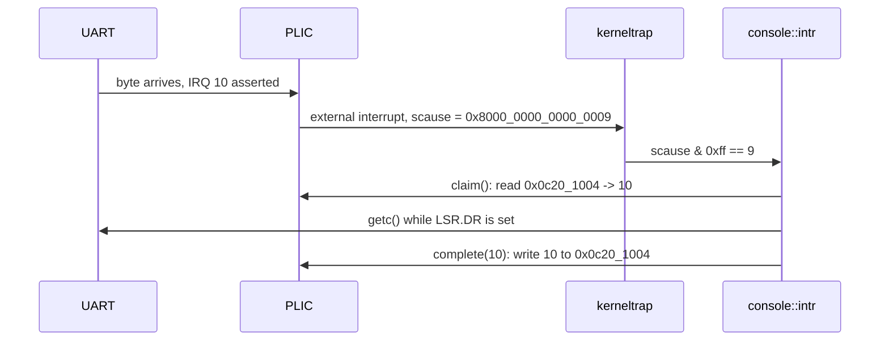

# Practice Set 2

**Handed out Tuesday, November 10 · Solutions posted Tuesday, November 17 ·
Preparation for [Midterm 2](midterm-2.md), Thursday, November 19.**

This set is **ungraded**, and it is the one piece of work in this course you do
outside of class. The November 17 lecture doubles as the review: attempt these
before it and arrive with specific questions.

**Do it on paper, with no computer** — that is the exam condition: closed book,
by hand, one permitted reference, the [Cheatsheet](../guides/cheatsheet.md),
printed. Wanting to run something in QEMU is the signal you do not yet
understand it; write the prediction down first.

Each problem is labeled with its shape — **Trace it**, **Decode it**,
**Order it**, **Explain it** — the same four the exam uses. Problem 8 is
genuinely hard; budget twenty minutes.

---

## Part A — Context switching and scheduling

### Problem 1: A yield, end to end

**(Trace it.)** Process `p` calls `proc_yield(p)`, which calls
`swtch(&p.context, &SCHED_CTX)`. Assume `p.kstack == 0x8022_1000`, and that `sp`
is `0x8022_1FE0` when `swtch` is entered.

```text
     process p (kernel side)                  swtch (assembly)
     ----------------------                   ----------------
  proc_yield(p)
    p.state = Runnable
    swtch(&p.context, &SCHED_CTX) ── A ──►  sd ra, 0(a0) … sd s11, 104(a0)
                                                          ── B ──
                                            ld ra, 0(a1) … ld s11, 104(a1)
                                                          ── C ──
                                            ret ──────────────► ??? (D)
```

Give `a0`, `a1`, `ra`, `sp` at A, B, C, and say where the `ret` at D lands. Then:
the scheduler later calls `swtch(&SCHED_CTX, &p.context)`. Where does *that*
`ret` land, and with what `sp`?

<details>
<summary>Click to reveal solution</summary>

| Point | `a0` | `a1` | `ra` | `sp` |
|---|---|---|---|---|
| A | `&p.context` | `&SCHED_CTX` | into `proc_yield`, after the `call` | `0x8022_1FE0` |
| B | unchanged | unchanged | unchanged | unchanged |
| C | unchanged | unchanged | `SCHED_CTX.ra` | `SCHED_CTX.sp` |

`swtch` never modifies `a0` or `a1`; it only dereferences them. Between A and B
nothing about the live CPU changes — 14 words have been *stored to memory*, that
is all. Offsets run 0 to 104 because `s11` is field 13, `13 × 8 = 104`; the
struct is `14 × 8 = 112` bytes.

**D.** The `ret` jumps to `SCHED_CTX.ra`: the instruction inside `scheduler`
after *its* call to `swtch`. A function returns to a caller it never had, and it
works only because `sp` moved with it, onto the stack where the scheduler's
frame lives.

**The second switch** loads `p.context.ra`, written at point A, so that `ret`
lands inside `proc_yield` with `sp = 0x8022_1FE0` and `p` continues as if nothing
happened. Every transition in rv6 is this **double switch**: process → scheduler
→ process, never process → process; the common wrong answer, "the `ret` returns
to `proc_yield`", is true only of that second one.

</details>

### Problem 2: Fourteen registers, and not one more

**(Explain it.)** `Context` has 14 fields: `ra`, `sp`, `s0`–`s11`. RISC-V has 32
general-purpose registers.

(a) Why save no `t` or `a` register — where do those values go? (b) `ra` is
*caller*-saved in the ABI, yet `swtch` saves it. Why? (c) What breaks if you
delete `#[repr(C)]`?

<details>
<summary>Click to reveal solution</summary>

**(a)** Before `swtch`'s first instruction runs, the compiler has already
spilled every caller-saved register it cared about onto the caller's stack,
reachable through `sp` — which *is* one of the 14. Restore `sp` and they come
back for free.

**(b)** `ra` is not preserved here, it is the **resume point**: `swtch` ends in
`ret`, which jumps to `ra`, so loading `ra` from the new context is *how* control
moves. It is the program counter in disguise — which is why `init_context` and
`ready` set it to an entry function, letting a brand-new context "return" into
code it has never run.

**(c)** The assembly hardcodes offsets (`ra` 0, `sp` 8, `s0` 16), and Rust may
reorder fields freely — the compiler could put `s7` where the assembly expects
`sp`, and `swtch` would load a saved `s7` into the stack pointer. No compile
error and no clean crash: a jump to garbage on the first switch.

</details>

### Problem 3: Round robin against the alternatives

**(Trace it, then Order it.)** `RoundRobin::pick_next` scans
`(0..n).map(|off| (self.next + off) % n).find(|&i| states[i] == Runnable)`, and
sets `self.next = (chosen + 1) % n`.

(a) Three processes runnable at t = 0 needing 8, 4, 2 ticks; quantum 2; scan
order P1, P2, P3. Give completion times and average turnaround, and compare with
shortest-job-first. (b) A fourth slot holds a `Sleeping` process. Does round
robin starve it, and is that the same thing as unfairness? (c) rv6 has timer
interrupts but a cooperative scheduler. What one change makes it preemptive, and
why was it left out?

<details>
<summary>Click to reveal solution</summary>

**(a)**

```text
 t: 0---2---4---6---8--10------14
    P1  P2  P3  P1  P2  P1 (alone)
```

0–2 P1 (6 left); 2–4 P2 (2 left); 4–6 P3 done at **6**; 6–8 P1 (4 left); 8–10 P2
done at **10**; 10–14 P1 is the only `Runnable` slot, so `pick_next` returns it
again and it finishes at **14** — the quantum expires at 12 but there is nobody
to switch to.

All arrived at 0, so turnaround = completion: (14 + 10 + 6)/3 = **10 ticks**;
response 0, 2, 4 → average 2. SJF runs P3, P2, P1: completions 2, 6, 14, average
22/3 ≈ **7.33**. SJF wins turnaround (optimal for a batch arriving together);
round robin wins response, at 6 dispatches to SJF's 3.

**(b)** No. `pick_next` skips it because it is not `Runnable`, so it is not being
*passed over* at all. Starvation means a **runnable** process whose selection can
be deferred without bound, and round robin's rotating cursor makes that
impossible: one full scan gives every runnable slot a turn. SJF starves long jobs
whenever short ones keep arriving.

**(c)** One line in the timer branch: call `proc_yield` on a tick instead of
counting it. It was left out because cooperative scheduling is **deterministic**
— a wrong `pick_next` gives a wrong *order*, not a heisenbug once in fifty runs.

</details>

---

## Part B — Concurrency and semaphores

### Problem 4: The lock that is not a lock

**(Explain it — find the bug.)**

```rust
pub fn lock(&self) -> SpinLockGuard<'_, T> {
    while self.locked.load(Ordering::Acquire) {
        core::hint::spin_loop();
    }
    self.locked.store(true, Ordering::Release);
    SpinLockGuard { lock: self }
}
```

(a) Give an interleaving that breaks mutual exclusion. (b) rv6 uses
`compare_exchange(false, true, Acquire, Relaxed)`. What does test-and-set do
differently, and why might you still want it?

<details>
<summary>Click to reveal solution</summary>

**(a)** The read and the write are two instructions, and another CPU fits
between them:

```text
   CPU A                     CPU B                  locked
   ----------------------    -------------------    ------
   load  -> false                                   false
                             load  -> false         false
   store true                                       true
                             store true             true
   returns a guard           returns a guard        <- BOTH hold it
```

Both hand out `&mut T` to the same data — exercise 37k's `busy`-flag race in
atomic clothing. An `AtomicBool` does not help if you use it with two separate
operations.

**(b)** Test-and-set is an unconditional atomic swap — write `true`, return the
old value — so it always writes, and every spinner keeps stealing the cache line
(hence *test*-and-test-and-set: spin on a plain load, then try the atomic). CAS
writes only when it sees what it expected and reports what it saw, so it
generalizes past booleans: "increment unless someone changed it" is a CAS loop,
impossible with TAS. The `Acquire` on success pairs with the previous holder's
`Release` in `unlock`, making their writes visible to you.

</details>

### Problem 5: Two ways to deadlock a single CPU

**(Explain it.)** (a) Suppose `console::intr` and `console::try_getc` shared a
spinlock. On one hart, construct the deadlock. (b) State the rule this implies,
and why disabling interrupts while holding a spinlock enforces it. (c) One path
takes `FS` then `PROCS`, another `PROCS` then `FS`. Show the deadlock, the
standard fix, and how rv6 sidesteps (a) without any lock at all.

<details>
<summary>Click to reveal solution</summary>

**(a)** `try_getc` takes the lock; before it releases, a UART interrupt arrives.
The hardware jumps to `kernelvec` → `kerneltrap` → `console::intr`, which spins
on the same lock — forever, since only the interrupted `try_getc` can release it
and it cannot resume until the handler returns. Structural, not a matter of
waiting longer.

**(b)** **A lock an interrupt handler may take must never be held with
interrupts enabled.** Disabling them for the critical section means the handler
cannot run *between* acquire and release, so it can never find the lock held by
the code it interrupted.

**(c)**

```text
   CPU A                    CPU B
   lock(FS)     ok          lock(PROCS)  ok
   lock(PROCS)  spins  <->  lock(FS)     spins
```

Hold-and-wait plus a circular wait. The fix is a **global lock order** — always
`FS` before `PROCS` — because a cycle is impossible if every edge points the same
way. rv6 sidesteps (a) differently: `BUF`/`HEAD`/`TAIL` are a single-producer,
single-consumer ring buffer, so the handler only advances `TAIL` and the reader
only `HEAD`. Removing the need for a lock beats ordering one.

</details>

### Problem 6: Semaphores, and the wakeup that got away

**(Trace it, then Explain it.)** A bounded buffer of `N = 3` uses `empty` (3),
`full` (0), `mutex` (1). Producer: `P(empty); P(mutex); …put…; V(mutex); V(full)`.
Consumer: `P(full); P(mutex); …take…; V(mutex); V(empty)`.

(a) Trace `empty` and `full` through produce, produce, consume, produce, produce,
produce. What invariant holds after each completed operation? (b) A producer
swaps its first two lines to `P(mutex); P(empty)`. Show the deadlock, and give
the rule. (c) Explain the **lost wakeup** problem, and why rv6's `try_wait`
cannot suffer it.

<details>
<summary>Click to reveal solution</summary>

**(a)**

| Operation | `empty` | `full` | sum |
|---|---|---|---|
| start | 3 | 0 | 3 |
| produce | 2 | 1 | 3 |
| produce | 1 | 2 | 3 |
| consume | 2 | 1 | 3 |
| produce | 1 | 2 | 3 |
| produce | 0 | 3 | 3 |
| produce | blocks on `P(empty)` | 3 | — |

The invariant is `empty + full == N`: every slot is free or occupied, never both
and never neither. The two semaphores are one counter read from opposite ends,
each blocking a different party; `mutex` protects the indices, not the occupancy.

**(b)** The producer holds `mutex` and blocks on `P(empty)` because the buffer is
full; a consumer passes `P(full)` and blocks on `P(mutex)`. Each waits for what
only the other can supply. **Take the counting semaphore before the mutex**:
never wait a long time while holding a lock others need to make progress.

**(c)** A blocking `wait` naively reads "if the count is 0, sleep." Between the
test and the sleep another thread can `post` and call wake-up — but nobody is
asleep yet, so the wake-up is discarded and the first thread sleeps forever with
a permit sitting right there. The fix is making check-and-sleep atomic with
respect to `post`: xv6's `sleep(chan, lk)` releases the lock only after marking
the process `Sleeping`. rv6's `try_wait` never sleeps, so it has no window — a
deferral, not a solution.

</details>

---

## Part C — Virtual memory and the MMU

### Problem 7: Decode a `satp`

**(Decode it.)** (a) The kernel root table is at physical `0x8021_5000`. Compute
what `make_satp` writes. (b) A debugger shows `satp == 0x8000_0000_0008_0215`.
What mode, and where is the root table?

<details>
<summary>Click to reveal solution</summary>

**(a)** `make_satp(root) = SATP_SV39 | (root >> 12)`:

```text
  root       = 0x8021_5000
  root >> 12 = 0x8_0215                 (drop three hex digits = 12 bits)
  8 << 60    = 0x8000_0000_0000_0000
  satp       = 0x8000_0000_0008_0215
```

**(b)** MODE (63:60) = `0x8` = **Sv39, on**; ASID (59:44) = 0; PPN (43:0) =
`0x8_0215`, so the root table is at `0x8_0215 << 12` = **`0x8021_5000`** — append
three zero digits. MODE `0` means paging off.

**The classic error** is forgetting the `>> 12`: `0x8000_0000_8021_5000` still
fits the 44-bit PPN field, so nothing complains and the MMU looks for the root
table about 8 TiB up, far past `PHYSTOP`. The kernel dies with no message — which
is why exercise 39k checks `make_satp` *before* switching the MMU on.

</details>

### Problem 8: A full Sv39 walk, by hand — **this is the hard one**

**(Decode it.)** A user page table, dumped. Entries not shown are zero.

```text
  L2 root table @ PA 0x8021_5000
      [  0] = 0x2008_5801
      [255] = 0x2008_6001

  table @ PA 0x8021_6000                table @ PA 0x8021_8000
      [  0] = 0x2008_5C01                   [511] = 0x2008_6401

  table @ PA 0x8021_7000                table @ PA 0x8021_9000
      [  2] = 0x21D9_501B                   [510] = 0x2008_6C07
                                            [511] = 0x2008_680B
```

(a) Split VA `0x0000_0000_0000_2ABC` into VPN[2], VPN[1], VPN[0], offset, and
translate it. (b) Translate `TRAMPOLINE` = `0x3F_FFFF_F000`. (c) Give the
permissions of both leaves and say which user mode may touch. (d) The process
loads from `0x0000_0000_0000_5000`. What happens, and what is in `scause`?

<details>
<summary>Click to reveal solution</summary>

Two rules: `px(level, va) = (va >> (12 + level*9)) & 0x1ff`, and
`pa = (pte >> 10) << 12` — by hand, **multiply the PTE by 4, then zero the last
three hex digits**.

**(a)**

```text
  VPN[2] = (0x2ABC >> 30) & 0x1ff = 0
  VPN[1] = (0x2ABC >> 21) & 0x1ff = 0
  VPN[0] = (0x2ABC >> 12) & 0x1ff = 2
  offset = 0x2ABC & 0xFFF         = 0xABC

  root @ 0x8021_5000 [0] = 0x2008_5801   x4 = 0x8021_6004 -> table @ 0x8021_6000
  L1   @ 0x8021_6000 [0] = 0x2008_5C01   x4 = 0x8021_7004 -> table @ 0x8021_7000
  L0   @ 0x8021_7000 [2] = 0x21D9_501B   x4 = 0x8765_406C -> frame @ 0x8765_4000
  PA = 0x8765_4000 + 0xABC = 0x8765_4ABC
```

**Cheap check:** the last three hex digits of the virtual and physical address
must match (`ABC`) — the offset is never translated.

**(b)**

```text
  VPN[2] = (0x3F_FFFF_F000 >> 30) & 0x1ff = 0xFF  = 255
  VPN[1] = (0x3F_FFFF_F000 >> 21) & 0x1ff = 0x1FF = 511
  VPN[0] = (0x3F_FFFF_F000 >> 12) & 0x1ff = 0x1FF = 511

  root [255] = 0x2008_6001  x4 = 0x8021_8004 -> table @ 0x8021_8000
  L1   [511] = 0x2008_6401  x4 = 0x8021_9004 -> table @ 0x8021_9000
  L0   [511] = 0x2008_680B  x4 = 0x8021_A02C -> frame @ 0x8021_A000
  PA = 0x8021_A000
```

**(c)** `flags = pte & 0x3ff`. `0x21D9_501B` → `0x1B` = V | R | X | U (bits 0, 1,
3, 4): user code — readable, executable, not writable — and **user mode may
touch it**. `0x2008_680B` → `0x0B` = V | R | X, **no U**: mapped in the user's
table but off-limits to user mode, and it needs no `U` because by the time the
first trampoline instruction is fetched the trap has already raised the privilege
level to S.

**(d)** VPN[0] = 5, and the L0 table has nothing there, so `PTE_V` is clear. The
MMU raises a **load page fault**: `scause = 13` (`0xD`), top bit clear because a
fault is an exception, `stval = 0x5000`. It reaches `usertrap`, matches neither
`scause == 8` nor the interrupt branch, and kills the process.

**Common wrong answers.** Indexing the root with VPN[0] — the walk starts at the
*most* significant index. And using `pte >> 12` for the frame: the PPN starts at
bit 10, and two bits off scales the frame number by four.

</details>

### Problem 9: Turning it on without falling off

**(Explain it, with arithmetic.)** (a) State the bootstrap paradox in a sentence
and say how identity mapping resolves it. (b) Is `sfence.vma` required (i) after
`csrw satp` in `kvminithart`; (ii) after `mappages` builds the kernel table with
the MMU still off; (iii) around `uservec`'s `csrw satp`? (c) How many page-table
pages does the `KERNBASE..PHYSTOP` identity map cost?

<details>
<summary>Click to reveal solution</summary>

**(a)** The instant translation is enabled, the next instruction fetch is itself
a translated access — so if the page holding the running code is unmapped, the
CPU faults before the kernel can react. Identity mapping (`va == pa`) makes
translation transparent: the PC, `sp`, and every live pointer keep meaning what
they did a cycle earlier.

**(b)** (i) **Required**: you just changed which table is in force and the TLB
may hold entries from the old regime, so `csrw satp` + `sfence.vma zero, zero`
(all address spaces, all addresses) is the canonical pair. (ii) **Not required**:
translation is off, nothing is cached, and no access has gone through these
entries — which is why rv6 builds the whole table before writing `satp`.
(iii) **Required on both sides.** `uservec` switches tables mid-instruction-
stream: the fence before ensures no user translation is in flight, the one after
that the next fetch resolves under the kernel table.

**(c)**

```text
  (PHYSTOP - KERNBASE)/PGSIZE = 0x0800_0000 / 0x1000 = 0x8000 = 32,768 leaves
  32,768 / 512 entries per table                     =     64 L0 tables
  KERNBASE >> 30 = 2, (PHYSTOP-1) >> 30 = 2  -> all under root[2]: 1 L1 table
  total = 64 + 1 + 1 root = 66 pages = 270,336 bytes ~ 264 KiB
```

A quarter of a megabyte of tables to describe 128 MiB, entirely to say "every
address maps to itself." That is the waste **megapages** remove — a leaf at level
1 maps 2 MiB in one entry — and rv6 skips them to keep `walk` one shape.

</details>

---

## Part D — Traps, timers, and devices

### Problem 10: What just happened?

**(Decode it.)** For each `scause`: interrupt or exception, the cause, what rv6
does, and whether the handler must advance `sepc` by 4.

| # | `scause` | | # | `scause` |
|---|---|---|---|---|
| 1 | `0x0000_0000_0000_0008` | | 4 | `0x0000_0000_0000_0003` |
| 2 | `0x8000_0000_0000_0001` | | 5 | `0x0000_0000_0000_000F` |
| 3 | `0x8000_0000_0000_0009` | | 6 | `0x0000_0000_0000_0002` |

<details>
<summary>Click to reveal solution</summary>

rv6 computes `scause >> 63` (1 = interrupt) and `scause & 0xff` (the code).

| # | Kind | Code | Meaning | rv6 | `+4`? |
|---|---|---|---|---|---|
| 1 | exception | 8 | ecall from U-mode | every syscall; `usertrap` dispatches on `a7` | **yes** |
| 2 | interrupt | 1 | supervisor software | the forwarded timer tick; clear `sip.SSIP` | no |
| 3 | interrupt | 9 | supervisor external | a device via the PLIC → `console::intr` | no |
| 4 | exception | 3 | breakpoint (`ebreak`) | the exercise 43k trap test | **yes** |
| 5 | exception | 15 | store page fault | bad user write: kill the process | no |
| 6 | exception | 2 | illegal instruction | user code touching a CSR: kill it | no |

**The `+4` rule.** For a trap caused by deliberately executing an instruction —
`ecall`, `ebreak` — `sepc` points **at** that instruction, which has done its
job; returning without advancing re-executes it forever (exercise 43k fails as a
timeout, not a crash). For an **interrupt**, `sepc` points at an instruction that
has *not* run, so `+4` skips real work; for a **fault**, at the instruction that
failed, which a kernel able to fix the mapping would retry.

</details>

### Problem 11: The handoff and the handshake

**(Order it.)** (a) `start.rs` does six jobs before `mret`, in eight CSR writes.
Name them and say what breaks if each is omitted. (b) Order the PLIC steps for
one keystroke, giving the register address rv6 touches at each, and say what
goes wrong if `complete` is skipped.

<details>
<summary>Click to reveal solution</summary>

**(a)**

| CSR write(s) | Job | If omitted |
|---|---|---|
| `mstatus.MPP = 0b01` | `mret` lands in S-mode | the kernel runs on in M-mode, where `satp` is ignored |
| `mepc = kmain` | where `mret` jumps | `mret` jumps to whatever `mepc` held |
| `satp = 0` | paging off for now | a stale `satp` translates the first S-mode fetch through a table that does not exist |
| `medeleg`, `mideleg` = `0xffff` | deliver traps to S-mode | every trap goes to `mtvec` — which is `timervec` — so an `ecall` is handled by the timer vector |
| `pmpaddr0`, `pmpcfg0` | give S-mode all of physical memory | S-mode is denied every address; the instruction after `mret` faults |
| `mcounteren = 0xffffffff` | let S-mode read `time` | reading `time` traps as an illegal instruction (`scause = 2`) |

Two jobs are pairs, which is why six need eight writes. Without delegation,
machine mode owns every trap and an S-mode kernel is impossible.

**(b)**



From `PLIC = 0x0c00_0000`:

```text
  priority, IRQ 10   PLIC + 10*4      = 0x0c00_0028   write 1 (0 = disabled)
  S-mode enable      PLIC + 0x2080    = 0x0c00_2080   write 1<<10 = 0x400
  S-mode threshold   PLIC + 0x20_1000 = 0x0c20_1000   write 0
  claim / complete   PLIC + 0x20_1004 = 0x0c20_1004   read = claim, write = done
```

Claim and complete are the **same register**: reading asks "which device?",
writing the IRQ back says "done." **Skip `complete` and everything works for
exactly one keystroke** — the PLIC believes IRQ 10 is still being serviced and
never delivers it again. No error, no fault; the console goes deaf.

</details>

---

## Part E — Filesystem and user mode

### Problem 12: What `unlink` really removes

**(Trace it, then Explain it.)** rv6 has `NINODE = 64` inodes; `ROOT` is 1.

```text
  inode 1  Dir    entries: "docs" -> 4,  "hello" -> 2
  inode 2  File   size 5     data "hello"
  inode 4  Dir    entries: "notes" -> 7, "todo" -> 9
  inode 7  File   size 12    data "meet at 3pm\n"
  inode 9  File   size 0
  (inodes 3, 5, 6, 8, 10..63 are Free)
```

(a) Resolve `/docs/notes`, naming the call at each step. (b) `unlink(4, "notes")`
runs. State everything that changes, including which inode a new file in `/`
would get next. (c) In Unix, `unlink` removes a *name*, not a file. What does rv6
do differently, and what breaks if you add hard links without changing anything
else?

<details>
<summary>Click to reveal solution</summary>

**(a)**

```text
  start at ROOT = 1
  dirlookup(1, "docs")  -> scans inode 1's 16 slots, matches -> 4
  dirlookup(4, "notes") -> scans inode 4's slots,    matches -> 7
```

`dirlookup` tests `e.used && e.len == name.len() && e.name[..e.len] == name`:
names live in a fixed `[u8; 14]`, so only the stored length separates `"no"` from
`"notes"`.

**(b)** Two things, unconditionally: the slot in inode 4 is marked
`used = false` (the *name* is gone), and `inodes[7] = Inode::new()` — kind
`Free`, size 0, data zeroed (the *file* is gone). `dirlookup(4, "notes")` now
returns `NotFound`.

A new file in `/` then gets **inode 3**, not 7: `alloc` scans
`for i in ROOT..NINODE` and takes the lowest `Free` slot, and nothing reserves a
just-freed inode.

**(c)** A Unix inode carries a **link count**. A directory entry is one
reference; `unlink` removes the entry and decrements the count, and the blocks go
only at zero. That is what makes hard links possible: two names, one inode, one
set of bytes. rv6 has no link count, so `unlink` conflates the two steps — add
hard links and the first `rm` of *any* name detonates the file for every other
name, since surviving entries point at an inode reset to `Free` that `alloc` may
already have reused. **The name lives in the directory, the file lives in the
inode**, and anything that pretends otherwise breaks the moment the mapping is
not one-to-one.

</details>

### Problem 13: The trampoline, and why it is where it is

**(Order it and Explain it.)** (a) Complete the user address space — both
kernel-only virtual addresses and every permission field.

```text
   virtual address     what lives there              perms
   ---------------     ---------------------------   ---------
   0x__________        TRAMPOLINE: uservec/userret   _ _
   0x__________        TRAPFRAME: saved registers    _ _
        ...                  (unmapped)
   0x0001_1000         <- initial user sp
   0x0001_0000         the stack page                _ _ _
        ...                  (unmapped guard gap)
   0x0000_0000 ..      the program image             _ _ _
```

(b) Why must the trampoline sit at the **same** virtual address in the kernel's
table and every user table? Name the exact instruction that would fail.
(c) The trapframe holds 31 user registers plus five other fields. Name them and
say who writes each.

<details>
<summary>Click to reveal solution</summary>

**(a)**

```text
   0x3F_FFFF_F000      TRAMPOLINE: uservec/userret   R X       (no U)
   0x3F_FFFF_E000      TRAPFRAME: saved registers    R W       (no U)
        ...                  (unmapped)
   0x0001_1000         <- initial user sp
   0x0001_0000         the stack page                R W U
        ...                  (unmapped guard gap)
   0x0000_0000 ..      the program image             R X U
```

`TRAMPOLINE = MAXVA - PGSIZE = (1 << 38) - 0x1000 = 0x3F_FFFF_F000`, and the
trapframe is one page below. The guard gap is deliberate: run off the end of your
memory and you take a clean fault instead of eating your stack.

**(b)** Entering or leaving user mode means writing `satp` mid-instruction-
stream. The instruction that fails is the **fetch of the instruction after
`csrw satp, t1`**: the PC does not change when `satp` does, so it is still the
trampoline's virtual address, now resolved through the *other* table. Mapped
elsewhere, the CPU fetches garbage; unmapped, it faults on its way to the trap
handler. A page at the identical VA in both tables is the only ground you can
stand on across that write — which is why `kvmmake` copies the trampoline onto a
page of its own.

**(c)** The five fields at offsets 0–32 are notes the kernel leaves for the
trampoline, which runs before any kernel Rust and cannot look anything up. (The
fifth, `kernel_hartid` at 32, is unused in rv6; it keeps the xv6 layout.)

| Off | Field | Written by | Why it is needed |
|---|---|---|---|
| 0 | `kernel_satp` | `usertrapret` | the table to install on the way in |
| 8 | `kernel_sp` | `usertrapret` (`p.kstack + PGSIZE`) | a stack it can trust; the user's `sp` may point anywhere |
| 16 | `kernel_trap` | `usertrapret` | where to jump once the kernel table is live |
| 24 | `epc` | `usertrap` from `sepc`, written back by `usertrapret` | where the user resumes |

The trapframe is mapped **R W with no `PTE_U`** for the obvious reason: it holds
the kernel's `satp` and kernel stack pointer, and a user program able to write
those two would own the machine.

</details>

---

## After you have tried these

Compare answers with someone before the solutions go up: explaining a wrong answer out loud
finds the misunderstanding faster than rereading a solution. If a whole part felt
shaky, reread the source rather than the notes — `swtch.rs` and `usermode.rs`
hold most of what this set asks about. See
[Exam Prep](../guides/exam-prep.md) for studying a kernel on paper,
[Sv39 Paging](../guides/sv39-paging.md) for worked translations, and
[rv6 Architecture](../guides/rv6-architecture.md) for the trap paths in full.
