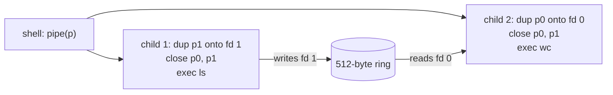

# Practice Set 3

**Distributed:** Friday, December 4 · **Solutions posted:** Tuesday,
December 8 · **Prepares for:** the [Final Exam](final.md), December 11–17.

This set is **ungraded**, but the final review that closes L26 on December 8
assumes you have attempted it — we work the problems, we do not derive them
from scratch.

**Do it on paper, with no computer.** That is the exam condition: closed book,
by hand, with one permitted reference, the printed
[Cheatsheet](../guides/cheatsheet.md). Every solution shows its arithmetic.

Cumulative, weighted toward `49k`–`53k`; pipes appear at the design level
only. Each problem is labeled with its shape:
**trace it**, **decode it**, or **order it / explain it**.

---

## Part A · exec and address-space construction

### Problem 1: The order of exec (order it)

`exec_into` (`exec.rs`) does six things, listed out of order. Put them in the
only correct order, and say what breaks if you violate (i) `c` before `a`,
(ii) `e` before `f`, (iii) `b` before the next return to user mode.

```text
  a. free_user_pagetable(old)
  b. (*tf).epc = USER_CODE; (*tf).sp = built.sp; (*tf).a0 = built.argc
  c. let built = build_addrspace((*p).trapframe as usize, name, args)?
  d. return Ok(built.argc)
  e. let old = (*p).pagetable
  f. (*p).pagetable = built.pagetable
```

<details>
<summary>Click to reveal solution</summary>

Order: **c, e, f, b, a, d.**

**(i)** `?` on `c` returns `Err` without touching the caller, so a failed exec
leaves the old program running — what `execfail` tests. Free first, and a mere
lookup failure leaves the process with no memory and nothing to return to.

**(ii)** After `f` the only pointer to the old root table is gone, so every
physical page of the old image and stack leaks.

**(iii)** The process resumes through `userret`, which reloads every register
from the trapframe and `sret`s to `sepc`, taken from `tf.epc`. A stale `epc`
jumps into whatever byte of the *new* image sits at the old address.

**Why `a` is safe:** a syscall runs on the **kernel** page table, so the old
user table is merely data; and `free_pt` frees only `PTE_U` leaves, so the
trampoline and trapframe pages survive to be returned through.

**Common wrong answer:** putting `a` right after `e`. It happens to work, but
one allocation failure inside `build_addrspace` then destroys the process.

</details>

### Problem 2: argv on the new stack (trace it)

The shell runs `echo hi`, so `push_argv` gets `name = "echo"`, `args = ["hi"]`.
`USER_STACK_TOP = 0x1_1000`; strings are rounded with `sp &= !7`, the pointer
array with `sp &= !15`. Give `argc` and `sp` after each push, then fill the four
`????` boxes.

```text
  0x1_1000  +--------------------------+  USER_STACK_TOP
     ????   |  "echo\0"   (5 bytes)    |
     ????   |  "hi\0"     (3 bytes)    |
            +--------------------------+
     ????   |  argv[0] = ????          |
            |  argv[1] = 0x0001_0FF0   |
            |  argv[2] = 0x0000_0000   |
            +--------------------------+  <- sp, and a1
```

<details>
<summary>Click to reveal solution</summary>

`argc = 1 + args.len() = 2` — `argv[0]` is the program name, which `exec` adds.

```text
  start                sp = 0x1_1000
  push "echo" (4+1=5)  0x1_1000 - 5 = 0x1_0FFB
                       &!7:  0xFFB = 1111_1111_1011 -> clear low 3 bits
                       sp = 0x1_0FF8        uargv[0] = 0x1_0FF8
  push "hi"   (2+1=3)  0x1_0FF8 - 3 = 0x1_0FF5
                       &!7:  0xFF5 -> 0xFF0
                       sp = 0x1_0FF0        uargv[1] = 0x1_0FF0
  push the array       argc + 1 = 3 pointers = 24 bytes = 0x18
                       0x1_0FF0 - 0x18 = 0x1_0FD8
                       &!15: 0xFD8 = ...1101_1000 -> clear low 4 bits
                       sp = 0x1_0FD0
```

Boxes: `0x1_0FF8`, `0x1_0FF0`, `0x1_0FD0`, `argv[0] = 0x0001_0FF8`. So
`tf.a0 = 2`, `tf.a1 = tf.sp = 0x1_0FD0`, `tf.epc = 0`.

Two alignments because the array is what `sp` finally holds, and the ABI wants
`sp` 16-byte aligned. Every stored pointer is a *user* address: `push_argv`
writes with `copyout`, so `argv[1]` names where the string lives in the
program's world, not the physical page the kernel wrote through.

**Common wrong answer:** `argc = 1`, from counting `args` only. Then `echo`
prints nothing: its loop starts at `i = 1` and immediately hits `i >= argc`.

</details>

### Problem 3: Decode the new address space (decode it)

Decode each entry — physical address, flags, leaf or interior, which page — and
`satp`. Then: `echo` stores a byte to `0x0`. What happens?

```text
  A. 0x0000_0000_2008_101B      C. 0x0000_0000_2008_0C07
  B. 0x0000_0000_2008_1417      D. 0x0000_0000_2008_1801
  satp = 0x8000_0000_0008_0202
```

<details>
<summary>Click to reveal solution</summary>

`pa = (pte >> 10) << 12`, `flags = pte & 0x3ff`; leaf iff any of R/W/X is set.

```text
  A  flags 0x01B = 0b0001_1011 = V|R|X|U   leaf
     >>10 = 0x8_0204 ; <<12 = 0x8020_4000  -> user CODE page, VA 0x0
  B  flags 0x017 = 0b0001_0111 = V|R|W|U   leaf
     >>10 = 0x8_0205 ; <<12 = 0x8020_5000  -> user STACK page, VA 0x1_0000
  C  flags 0x007 = 0b0000_0111 = V|R|W     leaf, no U
     >>10 = 0x8_0203 ; <<12 = 0x8020_3000  -> TRAPFRAME, 0x3F_FFFF_E000
  D  flags 0x001 = V only, R=W=X=0         INTERIOR: a next-level table
     >>10 = 0x8_0206 ; <<12 = 0x8020_6000
  satp  MODE = 0x8000...0202 >> 60 = 8 = Sv39
        root PPN = 0x8_0202 ; root table at 0x8_0202 << 12 = 0x8020_2000
```

Check A forward: `0x80204 << 8 = 0x8020400`, `<< 2 = 0x20081000`, `| 0x1B`. ✓

**The store to `0x0`:** `U` is set, so the page is reachable from user mode,
but `W` is clear: a **store page fault**, `scause = 15`. `usertrap` falls to its
else branch, sets `FAULTED`, and calls `exit_current(-1)`; the scheduler reports
`RunOutcome::Faulted(15)`.

**Common wrong answer:** "nothing, it's the program's own memory." Ownership is
not permission: `load_segment` maps code `R|X|U` deliberately.

</details>

---

## Part B · File descriptors

### Problem 4: Two tables, one offset (trace it)

The arrangement the final asks about; rv6 simplifies it (Problem 5) and has no
`dup`, so read this as the *design*. An fd indexes the **per-process fd table**;
each entry points into the **system-wide open-file table**, which holds the
offset, the mode, and a **reference count**. `dup` and `fork` make new
*pointers* to an existing entry. Give both fd tables and `F`'s count and offset
at each mark, then say what the two writes produce.

```text
   fd = open("log", O_CREATE|O_WRONLY);   // (1)
   dup(fd);                               // (2)
   pid = fork();                          // (3)
   if (pid) close(fd);                    // (4), parent only
   // parent then writes 5 bytes, child writes 3 bytes, both through F
```

<details>
<summary>Click to reveal solution</summary>

`O_CREATE | O_WRONLY = 0x200 | 0x001 = 0x201`, so `F` is write-only, `off = 0`.

```text
  (1) lowest free fd = 3
      parent: 3 -> F                          F: count 1, off 0
  (2) dup -> fd 4, the SAME F
      parent: 3 -> F  4 -> F                  F: count 2, off 0
  (3) fork copies the table: every pointer duplicated, every count bumped
      parent: 3 -> F  4 -> F
      child:  3 -> F  4 -> F                  F: count 4, off 0
  (4) parent close(3)
      parent:         4 -> F
      child:  3 -> F  4 -> F                  F: count 3, off 0
```

`close` tears the entry down only at count **0**; three descriptors still name
`F`, so nothing is freed.

**The writes.** Both reach the same `F` and share `off`: 5 bytes at 0..5, then
3 at 5..8. The file is 8 bytes, neither write clobbered, whichever order the
scheduler picks. A count and not a boolean, because pipe EOF is "the write end's
count hit zero" (Problem 11).

**Common wrong answer:** count 2 after `fork`, from thinking fork *shares* the
table. It copies it: one new pointer per open fd, so the count doubles.

</details>

### Problem 5: Where the offset lives (explain it)

(a) Why does `off` live in the open-file table, not the per-process fd table?
Give the one-line consequence for `cmd >> log`. (b) rv6 diverges: `File` is
`Copy`, stored **by value** in `Proc::ofile`, and `sys_fork` does
`(*child).ofile = (*parent).ofile;`. What does Problem 4's experiment produce on
rv6, and why?

<details>
<summary>Click to reveal solution</summary>

**(a)** Because the offset must be shared between descriptors *derived* from
one another and private between descriptors opened independently. Two separate
`open("log")` calls make two entries and two offsets — they are unrelated. `dup`
and `fork` name the *same* stream, coherent only if they advance one cursor. So
for `cmd >> log` the child's writes advance the offset the shell's descriptor
sees: every write appends.

**(b)** The rv6 child gets its own **copy** of the 16-entry array, each `off`
included. Both start at 0: the parent's 5 bytes go to 0..5, and the child's 3
bytes *also* start at 0 and overwrite the first three. The file is 5 bytes, and
its contents depend on scheduling order. Likewise
`(*p).ofile[fd] = File::none()` in one process cannot affect the other, so there
is no count to keep and nothing to tear down.

That holds only while no two descriptors share a stream — the assumption pipes
and redirection break. Adding pipes forces the xv6 arrangement: `ofile` becomes
an array of pointers to refcounted objects.

**Common wrong answer:** "the offset is per-process." It is per *open file
description*, which is neither per-process nor per-fd — the whole point of
having two tables.

</details>

### Problem 6: Find the bug (explain it)

`oslings run 50k_file_descriptors` reports a **timeout** on the `cat` step. Find
the bug, explain the mechanism, and name a second bug in the same excerpt.

```rust
let file = match getfile(p, fd) {
    Some(f) if f.writable => f,
    _ => return -1,
};
// ... FileKind::Inode arm:
let n = match FS.lock().read_at(file.inum, file.off, &mut kbuf[..want]) {
    Ok(n) => n,
    Err(_) => return -1,
};
if n > 0 && vm::copyout((*p).pagetable, buf, &kbuf[..n]).is_err() {
    return -1;
}
n as isize
```

<details>
<summary>Click to reveal solution</summary>

**Bug 1 — the offset is never advanced.** The missing line is
`(*p).ofile[fd].off += n;` before the return.

`file` is a **copy** of the stored `File` (`File` is `Copy`), so the cursor
must be written back through `(*p).ofile[fd]`. Without it `file.off` is 0 on
every call, every `read` returns the same first chunk, and `read` never returns
0. `cat`'s "read, write, repeat until 0" loop never terminates and the watchdog
fires at ~3 s. A timeout rather than wrong bytes is the clue.

**Bug 2 — the wrong permission.** `f.writable` should be `f.readable`: a file
opened `O_RDONLY` has `readable = true, writable = false`, so this guard rejects
exactly the reads that should succeed. `cat` treats the `-1` as "stop"
(`blez a0`), so that bug alone gives silent empty output rather than a hang.

**Common wrong answer:** "`kbuf` is too small." Short reads are legal — the
caller loops, and `cat` asks for only 64 bytes at a time.

</details>

---

## Part C · fork, exit, and wait

### Problem 7: What the child gets (trace it)

Fill in the child's value for each field immediately after `sys_fork`, and mark
it **fresh**, a **copy**, or **shared**. Then: where does the *parent's* `a0`
get set to the child's pid?

Fields: `pid`, `pagetable`, the pages behind VA `0x0`, the `trapframe` page,
`trapframe.epc`, `trapframe.a0`, `kstack`, `ofile`, `context.ra`.

<details>
<summary>Click to reveal solution</summary>

| Field | Child's value | which |
|---|---|---|
| `pid` | next `NEXTPID` | **fresh** (`alloc_pid`) |
| `pagetable` | new root table | **fresh** (`create_pagetable`) |
| pages behind VA `0x0` | new physical pages, identical bytes | **copy** (`uvmcopy`) |
| `trapframe` (page) | a new `kalloc` page | **fresh** |
| `trapframe.epc` | the parent's | **copy** |
| `trapframe.a0` | `0` | **fresh** — overwritten after the copy |
| `kstack` | a new page | **fresh** |
| `ofile` | the parent's array, by value | **copy** |
| `context.ra` | `forkret` | **fresh** (`ready`) |

The one genuinely **shared** page is the trampoline: `proc_pagetable` maps
`vm::trampoline_page()` into every table at the same VA. `uvmcopy` copies only
`PTE_U` leaves, same VA and flags, so the child sees an identical address space
with different physics.

**The parent's `a0`** is *not* set in `sys_fork`, which merely returns
`(*child).pid`. `usertrap` then does `(*tf).a0 = ret` on the parent's trapframe,
and `userret` loads it into the register. The child is never in `usertrap` for
this call, so `sys_fork` plants `0` in the child's trapframe by hand — that one
assignment is the whole "returns twice" trick.

**Common wrong answer:** "the child resumes at the start of the program." It
resumes at the instruction *after* the `ecall`: `epc` was copied, and `usertrap`
had already advanced it by 4.

</details>

### Problem 8: Three processes (trace it)

`forks2` forks child A (exits 3), then child B (exits 4), then waits twice and
exits with the sum. The parent is pid 4, so A is 5 and B is 6. Give every
process's `ProcState` at each mark, and the parent's exit status.

```text
  A: both forks have returned in the parent; wait #1 not yet called
  B: the parent is inside wait #1; no child has exited
  C: child A has called exit(3); the scheduler has control
  D: both waits have returned
```

<details>
<summary>Click to reveal solution</summary>

```text
     mark    pid 4 (parent)   pid 5 (A)    pid 6 (B)
      A      Running          Runnable     Runnable
      B      Runnable         Runnable     Runnable
      C      Runnable         Zombie(3)    Runnable
      D      Running          Unused       Unused
```

**A.** rv6's scheduler is **cooperative**: nothing preempts the parent, which
runs straight through both `fork`s. Neither child has executed an instruction.

**B.** `sys_wait` scans all `NPROC` slots, finds no Zombie child, confirms
`has_children`, and calls `proc_yield`, which marks the parent `Runnable` and
`swtch`es to the scheduler. Not `Sleeping`: rv6's wait blocks by yielding and
re-scanning, not on a channel.

**C.** `exit_current(3)` sets `xstate = 3` and `state = Zombie` and `swtch`es
away for good; the slot survives so the status can be collected, and `pick_next`
never picks a Zombie.

**D.** Each `sys_wait` finds the Zombie, `copyout`s `xstate` as four
little-endian bytes to the address in `a0`, then `freeproc`s the slot. Status:
`0 + 3 = 3`, then `3 + 4 = 7`, so `RunOutcome::Exited(7)`.

**Common wrong answer:** `Sleeping` at B, or "A runs immediately at the fork."
Both import preemptive-kernel habits; rv6 has a timer but does not preempt.

</details>

### Problem 9: Zombies, reaping, and orphans (explain it)

(a) Why does `exit` leave a Zombie instead of freeing the slot? (b) In real Unix,
what happens to a child whose parent exits first, and who cleans it up? (c) What
does rv6 do instead, and what latent bug lurks in rv6's `parent` field?

<details>
<summary>Click to reveal solution</summary>

**(a)** The exit status must outlive the process that produced it, so the slot
persists until someone reads it. Both alternatives are worse: discard the status
and `wait` reports nothing; block `exit` until the parent waits and you deadlock
whenever a parent exits without waiting. A zombie is a bounded leak with a
defined collector.

**(b)** The child is **reparented** to `init` (pid 1), which loops calling
`wait`, so an orphaned zombie is reaped instead of holding a slot forever. That
is the real reason init exists: root of the process tree, reaper of last resort.

**(c)** rv6 has neither. When the root process finishes, the scheduler's `done`
calls `cleanup_except(root)`, which `freeproc`s every slot that is not `Unused`
— orphans and leftover zombies alike. It works because every run is bounded by
one root process.

The latent bug: `Proc::parent` is a raw `*mut Proc` into the fixed `PROCS`
array, and `has_children` compares those pointers. Once a parent is `freeproc`ed,
`allocproc` can hand its slot to an unrelated process — and a surviving child's
stale pointer now aims at that one, which would find itself with a child it
never forked. A correct implementation stores the parent's **pid** (never
reused), or reparents to init at exit as xv6 does.

</details>

---

## Part D · Composition: fork + exec, and pipes

### Problem 10: Why two calls (explain it)

Unix could have offered one call, `spawn(path, argv)`. It offers `fork` and
`exec`. What does the split make possible that `spawn` would not? Name the
specific window, two things a shell does inside it, and the
[Cheatsheet](../guides/cheatsheet.md) line that makes it work.

<details>
<summary>Click to reveal solution</summary>

The window is **between `fork` returning 0 and the child's `ecall` to
`exec`**: there the child is an ordinary process running the parent's code with
the parent's descriptors, so it can adjust *its own* state using only syscalls
that already exist.

1. **Redirection.** For `cmd > out` the child opens `out`, `dup2`s it onto fd 1,
   closes the extra fd, then execs. `cmd` needs no knowledge of redirection.
2. **Pipeline wiring.** For `a | b` the child dups its pipe end onto fd 0 or 1
   and closes both raw pipe fds before exec'ing (Problem 11).

The cheatsheet line: *"Open fds survive `exec`, which is how a redirected stdout
persists."* `exec` replaces memory and never touches `ofile` — that is what
turns "arrange your descriptors, then become the program" into a mechanism.

Each half is independently useful: `forks2` forks without exec'ing, `execself`
execs without forking. The cost of one `spawn` is that every adjustment becomes
a parameter — which is what happened: `posix_spawn` takes a *file-actions
array*, a list of the opens, dups, and closes you would otherwise just write.

**Common wrong answer:** "fork is for concurrency, exec is for performance."
Copying an address space to discard it microseconds later is the *expensive*
choice; copy-on-write exists to hide that cost. The split buys expressiveness.

</details>

### Problem 11: Pipes — the hard one (explain it)

**This is the hardest problem in the set.** rv6 has no pipes; the exam asks
about the design, which is xv6's:

```rust
const PIPESIZE: usize = 512;
struct Pipe {
    data: [u8; PIPESIZE],
    nread: u32,      // total bytes ever read
    nwrite: u32,     // total bytes ever written
    readopen: bool,  // some fd still refers to the read end
    writeopen: bool, // some fd still refers to the write end
}
```

(a) Give the empty and full conditions and where byte `nwrite` is stored.
(b) State the **exact** condition under which `read` returns 0. (c) For `ls | wc`,
list every `close` the shell must perform, and say precisely what happens if it
forgets its own copy of the write end.



<details>
<summary>Click to reveal solution</summary>

**(a)** The counters are monotonic totals, never reset; the ring position is
the total modulo the buffer size.

```text
  empty:  nread == nwrite
  full:   nwrite == nread + PIPESIZE          (512 bytes outstanding)
  byte nwrite lives at data[nwrite % PIPESIZE]
```

Totals rather than head/tail indices remove the ambiguity in which a full ring
and an empty ring look identical. A writer on a full pipe sleeps until a reader
consumes — or fails if `readopen` is false: the broken-pipe case. A reader on an
empty pipe sleeps until a writer produces *or the write end goes*.

**(b)** `read` returns 0 exactly when

```text
  nread == nwrite   AND   writeopen == false
```

— empty **and** the write end's reference count has fallen to zero, so no
future write is possible. Empty alone is not EOF but "wait"; write-end-closed
alone is not EOF either, since buffered bytes must be delivered first.

**(c)** Each `fork` copies both ends, so with two children **six** descriptors
name the pipe.

```text
  child 1 (ls):  dup p1 onto fd 1;  close p0;  close p1
  child 2 (wc):  dup p0 onto fd 0;  close p1;  close p0
  shell:         close p0;  close p1;   then wait twice
```

**If the shell forgets `close(p[1])`:** `ls` exits and its descriptors close,
but the shell still holds a write end, so `writeopen` stays true and `wc`'s
final `read` sees an empty buffer with a live writer. It **sleeps forever**,
while the shell blocks in `wait` for `wc`. The pipeline hangs silently, and
nothing in `ls` or `wc` is wrong. This is a reference-counting bug: EOF is
defined by a count, so every stray copy of the descriptor postpones it.

**Common wrong answer:** "read returns 0 when the writer exits." Exiting matters
only because it closes descriptors — and only *that process's* copies.

</details>

---

## Part E · Cumulative retrieval (Modules 1 and 2)

### Problem 12: A cause, a fence, and two translations (decode it)

(a) For each `scause` — `0x0000_0000_0000_0008`, `0x8000_0000_0000_0009`,
`0x0000_0000_0000_000D` — give interrupt or exception, which one, which rv6
handler, and whether `sepc` must advance by 4.

(b) `exec_into` installs a whole new page table and never executes
`sfence.vma`. Why is that not a stale-TLB bug?

(c) Split `0x0001_0FD0` (the `sp` from Problem 2) and
`TRAPFRAME = 0x3F_FFFF_E000` into `VPN[2]`, `VPN[1]`, `VPN[0]`, offset. Explain
the trapframe's `VPN[2]`, and say why the trampoline must sit at the *same* VA
in the kernel's table and in every user table.

<details>
<summary>Click to reveal solution</summary>

**(a)** rv6 tests `scause >> 63` for interrupt-vs-exception, `scause & 0xff` for
the code.

```text
  0x...0008   bit 63 = 0 -> EXCEPTION, code 8 = ecall from U-mode.
              usertrap's `scause == 8` branch -> syscall::dispatch.
              MUST advance: (*tf).epc += 4, or the ecall re-executes forever.
  0x8...0009  bit 63 = 1 -> INTERRUPT, code 9 = supervisor external, a device
              via the PLIC -> console::intr() (from usertrap in user mode, or
              kernelvec -> kerneltrap inside a syscall that enabled interrupts).
              MUST NOT advance: sepc is the interrupted instruction.
  0x...000D   bit 63 = 0 -> EXCEPTION, code 13 = load page fault.
              usertrap's else branch: FAULTED, exit_current(-1) ->
              RunOutcome::Faulted(13). Advancing would be meaningless.
```

The rule: exceptions raised *by* an instruction that must not be retried advance
`sepc`; interrupts and faults do not.

**(b)** The flush happens on the way out, in the trampoline:
`sfence.vma zero, zero` / `csrw satp, a0` / `sfence.vma zero, zero`. A process
cannot reach user mode except through `userret`, so the new `satp` is always
installed between fences. `exec_into` only writes a field of a `Proc`; the CPU
still translates through the *kernel* table until `usertrapret` computes
`make_satp`. The common wrong answer — "the MMU notices" — is false: the TLB is
not coherent with memory writes, which is why `kvminithart` also pairs
`csrw satp` with a fence.

**(c)** `px(level, va) = (va >> (12 + level*9)) & 0x1ff`.

```text
  va = 0x1_0FD0        offset 0xFD0   VPN[0] = 16   VPN[1] = 0   VPN[2] = 0
  va = 0x3F_FFFF_E000  offset 0
     VPN[0] = 0x3F_FFFFE & 0x1FF = 0x1FE = 510
     VPN[1] = 0x1_FFFF  & 0x1FF = 0x1FF = 511
     VPN[2] = (va >> 30) & 0x1FF = 255
```

`VPN[0] = 16` is not a coincidence:
`USER_STACK = MAX_PROG_PAGES * PGSIZE = 16 * 4096 = 0x1_0000`, so the stack is
page 16 and the image holds pages 0–15; anything smaller leaves the entries
between unmapped, and that gap is the guard region.

`VPN[2] = 255`, not 511, because `MAXVA = 1 << 38` — one bit short of Sv39's 39
— so rv6 lives in the lower half of the root table and no address needs sign
extension. The trampoline one page up is entry 511 of the same level-0 table.

The trampoline must be mapped identically in both tables because `uservec`
executes `csrw satp, t1` and the *very next instruction* must still be
fetchable; the PC does not change across `csrw`. **Common wrong answer:** "so
the kernel can find it" — the kernel could find it anywhere; the constraint is
on the instruction *fetch* straddling the `satp` write.

</details>

---

## Part F · The long question

### Problem 13: `$ echo hi`, end to end (trace it)

**This is the hard one, and it is the shape of the long question on the final.**
`sh` is at its prompt. You type `echo hi` and press Enter. Narrate everything
from the first keypress to the reappearance of the `$ ` prompt, naming at each
stage which component acts and which CSR or data structure is involved. Give
yourself twenty minutes on paper before revealing.

<details>
<summary>Click to reveal solution</summary>

**1 — the keypress.** `sh` is blocked in `read(0, cursor, 1)`; `sys_read`, for
a `Console` fd, called `trap::intr_on()` then `console::getc()`, spinning on
`wfi`. The UART receives `'e'` and raises IRQ 10; the PLIC delivers a supervisor
external interrupt. `stvec` points at `kernelvec` -> `kerneltrap`:
`scause >> 63 == 1`, `scause & 0xff == 9` -> `console::intr()` ->
`plic::claim()` = 10 -> `uart::getc()` drains the byte into the 256-byte ring
buffer -> `plic::complete(10)`, without which it re-fires forever.

**2 — back to the shell.** `try_getc` pops the byte, `sys_read` `copyout`s it
and returns 1. `usertrap` stores `tf.a0 = 1`; `usertrapret` sets `sepc` from
`tf.epc`, clears `sstatus.SPP`, sets `SPIE`, and jumps to `userret`: `satp`
switched between two `sfence.vma`s, 31 registers reloaded, `sret`.

**3 — line assembly.** `sh` echoes the byte with `write(1, ...)`
and loops — for `c h o ␣ h i`. On `'\n'` it stores a NUL and splits the line in
place: spaces become NULs, `argv[0] = "echo"`, `argv[1] = "hi"`,
`argv[2] = NULL`, `argc = 2`. `argv[0]` is not `"exit"`, so it proceeds.

**4 — fork.** `a7 = 1`, `ecall`. `sys_fork` calls `allocproc`, then
`proc_pagetable` (trampoline `R|X`, the child's own trapframe `R|W`), then
`uvmcopy`, which copies every `PTE_U` leaf — the shell's image and stack pages —
into fresh physical pages at the same VAs. It copies the parent's trapframe,
sets the child's `a0 = 0`, copies `ofile`, records `parent`, and calls `ready`
(`context.ra = forkret`).

**5 — the parent blocks.** `usertrap` plants the child pid in the parent's
`tf.a0`; `bnez a0` sends the shell to `wait(0)`. `sys_wait` finds no Zombie,
confirms `has_children`, and calls `proc_yield` -> `swtch` to the scheduler.

**6 — the child runs.** `pick_next` selects it and `swtch`es in. Because
`context.ra = forkret`, the `ret` inside `swtch` lands in `forkret` ->
`usertrapret` -> `userret` -> `sret`. The child resumes at the instruction
*after* its `ecall`, with `a0 = 0`, and falls into the exec branch.

**7 — exec.** `a7 = 7`, `ecall`. `sys_exec` `copyinstr`s `"echo"`, then
`fetch_argv` walks the user's pointer array with `copyin` and `copyinstr`s each
string into the static `ARGV_STORE` — static, not stack, because a kernel stack
is one page. It drops `argv[0]` (exec re-adds it) and calls
`exec_into(p, "echo", ["hi"])`.

**8 — the new address space.** `build_addrspace`: `lookup("echo")`; a fresh
zeroed root table; `TRAMPOLINE` `R|X` and `TRAPFRAME` `R|W`, neither with `U`;
`load_segment` copies the image at VA 0 as `R|X|U` and issues `fence.i`;
`map_user_stack` maps one `R|W|U` page at `0x1_0000`; `push_argv` returns
`argc = 2`, `sp = argv = 0x1_0FD0` (Problem 2). Then the swap: save `old`,
install the new table, set `tf.epc = 0`, `tf.sp`, `tf.a0`, `tf.a1`, and
`free_user_pagetable(old)` — safe because we run on the kernel page table.
`usertrapret` recomputes `make_satp`; `userret` `sret`s to PC 0 in U-mode.

**9 — the output.** `echo` reads `a0 = 2`, `a1 = 0x1_0FD0`, loads
`argv[1] = 0x1_0FF0`, measures 2 bytes, and calls `write(1, 0x1_0FF0, 2)`.
`sys_write` sees fd 1 is `Console` and writable, `copyin`s into a kernel buffer,
and `emit`s through `uart::putc`. A second `write` sends `"\n"`. **`hi` appears.**

**10 — exit.** `a0 = 0`, `a7 = 2`, `ecall` -> `exit_current(0)`: `xstate = 0`,
`state = Zombie`, `swtch` to the scheduler, never to return.

**11 — reaping.** The scheduler picks the root (`sh`), and the `swtch` resumes
it *inside* `proc_yield`, which returns into `sys_wait`'s loop. The scan finds
the Zombie; `status_addr` is 0, so nothing is copied out; `freeproc` returns the
trapframe page, the kernel stack, and the user page table — freeing `echo`'s
image and stack pages, dropping the trampoline mapping without freeing the page
— and marks the slot `Unused`. `sys_wait` returns the pid, and the shell writes
`"$ "` and blocks in `read` — back at step 1.

**One thing per layer:** hardware sets `sepc`/`scause`/`sstatus` and jumps to
`stvec`; the trampoline swaps `satp` because it is mapped at the same VA in both
tables; `usertrap` adds 4 to `epc` and dispatches on `a7`; `fork` copies memory
and plants `a0 = 0`; `exec` builds before it destroys; `exit` leaves a Zombie;
`wait` reaps it.

</details>

---

## After you have tried it

Bring your paper on **December 8**. Then reread
[rv6 Architecture](../guides/rv6-architecture.md), redraw the fork and exec paths
from memory, and check your constants against the
[Cheatsheet](../guides/cheatsheet.md). Working these with a classmate is
encouraged and within the [Integrity Policy](../guides/integrity-policy.md);
nothing here is submitted.
