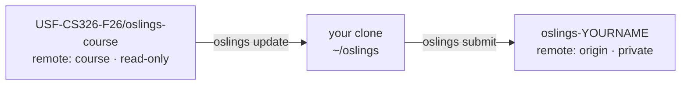

# Development Environment Setup

This page is the reference for getting a CS 326 machine working: `rustup`, the
bare-metal RISC-V target, QEMU, your private repository, and the `oslings`
command. You will work through it once during [Setup](../assignments/setup.md)
on Thursday, August 27, and then come back to it whenever `oslings doctor` turns red
or a build stops working. It covers macOS, Linux, and Windows via WSL2. If you
are already set up and want to know what the commands *do*, read
[Using OSlings](oslings-usage.md) and [Git and Submission](git-and-submission.md)
instead.

## What gets installed, and when you actually need it

| Piece | Provides | First needed |
|---|---|---|
| `rustup` + stable Rust | `cargo`, `rustc`, `cargo test` | Aug 27 (`00r`) |
| `riscv64gc-unknown-none-elf` on **stable** | cross-compiling `asmlab/` and `commands/` | `20a`, Oct 1 |
| Nightly toolchain | the `rv6` kernel (`rv6/rust-toolchain.toml` pins it) | `21r`/`30k`, Oct 2 |
| `riscv64gc-unknown-none-elf` on **nightly** | kernel `core` for the bare-metal target | `21r`/`30k` |
| `rust-src`, `llvm-tools` | `oslings doctor` requires them; rust-analyzer and ELF inspection use them | `21r`/`30k` |
| `qemu-system-riscv64` | booting every `mode = "qemu"` exercise | `20a`, Oct 1 |
| `git` + a GitHub account | your private repo, `oslings update`, `oslings submit` | Aug 27 |

Two things on this list are commonly gotten wrong.

**The course uses only `qemu-system-riscv64`.** That is the *system* emulator: it
emulates a whole machine, and we boot our own kernel on it with no firmware
underneath. It is **not** `qemu-riscv64`, the Linux user-mode emulator that runs
RISC-V Linux binaries on an x86 Linux host. `qemu-riscv64` does not exist on
macOS at all, and it is useless here even where it does exist, because we never
produce a Linux binary. If a tutorial you found online tells you to install
`qemu-user` or `qemu-user-static`, it is solving a different problem.

**There is no C cross-toolchain.** You do not need `riscv64-unknown-elf-gcc`,
`riscv64-linux-gnu-binutils`, or a Homebrew tap that builds one for an hour. The
`riscv64gc-unknown-none-elf` target links with `rust-lld`, which ships inside
every rustup toolchain. This is stated in the comment at the top of
`asmlab/rust-toolchain.toml`, and it is why setup on macOS is a two-command job.

## Platform notes before you begin

| Platform | Notes |
|---|---|
| **macOS** (Intel or Apple Silicon) | Run `xcode-select --install` for `git`. Install [Homebrew](https://brew.sh) if you do not have it, and make sure `/opt/homebrew/bin` is on your `PATH`. Everything else is identical to Linux. |
| **Linux** (Debian/Ubuntu, Fedora, Arch) | Install `git`, `curl`, and a linker (`build-essential` or equivalent) from your package manager first. |
| **Windows** | **Native Windows will not work.** Install WSL2 and do all of your work inside Ubuntu. |

For Windows, in an Administrator PowerShell:

```bash
wsl --install
```

Reboot, open the **Ubuntu** app, and follow the Linux instructions from inside
it. One rule matters more than the rest: **clone the repo into your WSL home
directory (`~`), never into `/mnt/c`.** Cargo on the `/mnt/c` bridge is
catastrophically slow — a two-second build becomes a two-minute build — and file
watching (`oslings watch`) does not see edits reliably across the boundary.

## 1. Install rustup

Same command on macOS, Linux, and WSL2:

```bash
curl --proto '=https' --tlsv1.2 -sSf https://sh.rustup.rs | sh
```

Accept the default installation. Then **restart your terminal**, or:

```bash
source "$HOME/.cargo/env"
```

That step puts `~/.cargo/bin` on your `PATH`. Skipping it is the single most
common reason for `command not found: cargo` five minutes later — and, once
`oslings` is installed there too, for `command not found: oslings`. Verify:

```bash
rustc --version
cargo --version
```

`setup.sh` refuses to run without `rustup` and prints this same command
(`setup.sh:17-22`). It deliberately does not install `rustup` for you, because
the installer is interactive.

## 2. Install QEMU

Pick the line for your package manager. These are exactly the commands
`setup.sh` chooses between at `setup.sh:40-48`:

| Platform | Command | Package |
|---|---|---|
| macOS (Homebrew) | `brew install qemu` | `qemu` |
| Debian / Ubuntu / WSL2 | `sudo apt-get update && sudo apt-get install -y qemu-system-misc` | `qemu-system-misc` |
| Fedora / RHEL | `sudo dnf install -y qemu-system-riscv` | `qemu-system-riscv` |
| Arch | `sudo pacman -S --needed qemu-system-riscv` | `qemu-system-riscv` |

On Debian and Ubuntu the RISC-V system emulator lives in `qemu-system-misc`, not
in `qemu` or `qemu-system` — that naming trips up nearly everyone. On macOS the
Homebrew `qemu` formula is one large bottle containing every architecture; the
download is a few hundred megabytes and there is no smaller option.

You can skip this step: `setup.sh` detects a missing `qemu-system-riscv64`,
picks the right command for your machine, and offers to run it for you
(`setup.sh:37-71`). Verify afterwards:

```bash
qemu-system-riscv64 --version
```

Any QEMU from the last several years is fine. We use only the `virt` machine,
one hart, 128 MiB, no firmware.

## 3. Accept your two invitations

You keep **one private repository for the entire semester**, and you do not
create it — the instructor does, in the class organization, already seeded and
already shared with the TA. Every line you write ends up there, and it is what
we read to grade you.

Two invitations reach the GitHub account you named on the sign-up form. Both
must be accepted, and they are separate things:

| Invitation | Repo | Your access | Why you need it |
|---|---|---|---|
| Yours | `USF-CS326-F26/oslings-<your-github-username>` | write | `oslings submit` pushes here; we grade it |
| Course | `USF-CS326-F26/oslings-course` | read | `oslings update` fetches releases from here |

Accept the second at
<https://github.com/USF-CS326-F26/oslings-course/invitations>. Skipping it is
the most common way to be stuck on setup day: the course repo is private, so
without it `git fetch course` is refused and `oslings update` reports

```text
could not fetch the course repo (git@github.com:USF-CS326-F26/oslings-course.git).
```

A **404** on either invitation link means you are signed in to GitHub as a
different account than the one on the roster. An invitation is bound to one
account; sign out, sign back in as that one, and reopen the link.

The name `oslings-<your-github-username>` is not cosmetic — batch grading finds
your repository by deriving the name from your GitHub username. Since the
instructor creates it, you cannot get this wrong, but it is why the sign-up form
asked for your exact username.

## 4. Clone your own repository

```bash
git clone git@github.com:USF-CS326-F26/oslings-<your-github-username>.git oslings
cd oslings
```

or, without an SSH key, the HTTPS form:

```bash
git clone https://github.com/USF-CS326-F26/oslings-<your-github-username>.git oslings
```

Your repo arrives already seeded from the course repo, sharing its history —
that shared base is what lets `oslings update` merge releases into it later.

**Do not clone `oslings-course`.** Your clone is attached to it as a read-only
second remote in §6, which is a different thing. Work committed in a clone of
the course repo can never be pushed anywhere you own, so `oslings init-repo`
refuses to run there rather than let you discover it at the end of a session.
Exercises are released into the course repo at the start of the session they
belong to — an unreleased exercise genuinely does not exist in any commit you
can fetch, so there is nothing to read ahead.

## 5. Run `./setup.sh`

```bash
./setup.sh
```

It is safe to re-run at any time; every step is idempotent. In order, it:

1. **Checks for `rustup`** and exits with the install command if it is missing
   (`setup.sh:17-22`).
2. **Installs the nightly toolchain**: `rustup toolchain install nightly
   --profile minimal` (`setup.sh:25`). Minimal means no docs and no
   `rust-analyzer` component — a much smaller download than the default profile.
3. **Adds the RISC-V target to nightly**: `rustup target add
   riscv64gc-unknown-none-elf --toolchain nightly` (`setup.sh:26`).
4. **Adds `rust-src` and `llvm-tools` to nightly** (`setup.sh:27`).
   `llvm-tools` gives you `llvm-objdump`, `llvm-nm`, and `llvm-readelf` inside
   the toolchain sysroot for looking at your kernel ELF; `rust-src` is what
   rust-analyzer needs to give you completions in `no_std` code.
5. **Adds the same RISC-V target to the default (stable) toolchain**:
   `rustup target add riscv64gc-unknown-none-elf` (`setup.sh:35`). This is the
   step people delete when they are cleaning things up, and it breaks `20a` and
   `oslings ship`. The assembly bridge in `asmlab/` and the user commands in
   `commands/` both build on stable, on purpose, so that a broken nightly
   install can never block the Rust and command exercises (`00r`–`13c`).
6. **Checks for QEMU**, and offers to install it via your package manager
   (`setup.sh:37-71`). In a non-interactive shell it only prints the command.
7. **Builds and installs the `oslings` command**: `cargo install --path
   oslings-cli` (`setup.sh:74`).
8. **Runs `oslings doctor`** (`setup.sh:77`).
9. **Attaches your clone to the course repo**, by calling `oslings init-repo`
   with no argument — the course URL travels in `info.toml`, so there is
   nothing for you to type or paste.
10. **Runs `oslings update`**, pulling every exercise released so far. Without
    this a fresh clone holds no exercises at all and `oslings` has nothing to
    show you. If it fails here, it is nearly always the course-repo invitation
    from §3: accept it, then run `oslings update` yourself.

Note what it does **not** do: it does not install `rustup`, and it will not
`sudo` anything without asking.

## 6. `oslings init-repo` and the two-remote model

`setup.sh` runs this for you. If you need it directly, it takes **no
argument**:

```bash
oslings init-repo
```

Your clone is already your own repo, so `origin` is correct from the moment you
cloned. All this does is *add* the second remote: it reads `[meta] course_url`
from `info.toml` and adds it as `course` (`sync.rs`, `cmd_init_repo`). It also
sets that remote's *push* URL to a deliberately invalid `no-push://…` sentinel,
so a stray `git push course` fails locally with a reason instead of trying to
publish your work into the repo everyone reads.

The optional URL argument is the **course** repo's URL, used only if your
`info.toml` somehow lacks it. It is not your repository's URL — passing that
makes `origin` and `course` the same repo, which the command refuses.

The result is two remotes with two jobs:



Confirm it worked:

```bash
git remote -v
```

You must see both `course` and `origin`, with `origin` pointing at *your*
repository. If `origin` points at `oslings-course` you cloned the wrong repo:
start again from §4 with a clone of your own. `init-repo` is idempotent —
re-running it just resets the `course` URL.

## 7. `oslings doctor`

```bash
oslings doctor
```

Six checks, each printed as `[ ok ]` or `[MISS]` with the exact fix command
(`cmd_class_grade()` in `main.rs`). It exits non-zero if anything is missing.

| Check | What it actually runs | Fix it prints |
|---|---|---|
| `rustup installed` | `rustup --version` | install Rust from `https://rustup.rs` |
| `nightly toolchain` | `rustup toolchain list` contains `nightly` | `rustup toolchain install nightly` |
| `riscv64gc-unknown-none-elf target` | `rustup target list --installed --toolchain nightly` | `rustup target add riscv64gc-unknown-none-elf --toolchain nightly` |
| `rust-src component` | `rustup component list --installed --toolchain nightly` | `rustup component add rust-src --toolchain nightly` |
| `llvm-tools component` | same component list | `rustup component add llvm-tools --toolchain nightly` |
| `qemu-system-riscv64` | `qemu-system-riscv64 --version` | `sudo apt install qemu-system-misc` / `brew install qemu` |

One honest gap: `doctor` checks the RISC-V target only on **nightly**. It does
not check the stable toolchain, so a machine can show six green lines and still
fail `20a` with a linker error. If that happens, run `setup.sh:35` by hand:

```bash
rustup target add riscv64gc-unknown-none-elf
rustup target list --installed | grep riscv
```

## Troubleshooting, keyed on what `doctor` reports

| `doctor` says | Cause | Fix |
|---|---|---|
| `oslings: command not found` (before any output) | `~/.cargo/bin` is not on `PATH` | `source "$HOME/.cargo/env"`, then restart the terminal |
| `[MISS] rustup installed` | rustup not installed, or a distro-packaged `rustc` shadows it | Install from `https://rustup.rs`; remove `apt`/`brew` Rust packages first |
| `[MISS] nightly toolchain` | first run, or an interrupted download | `rustup toolchain install nightly --profile minimal` |
| `[MISS] riscv64gc-unknown-none-elf target` | target added to stable only | `rustup target add riscv64gc-unknown-none-elf --toolchain nightly` |
| `[MISS] rust-src component` | nightly installed with `--profile minimal` and no components | `rustup component add rust-src --toolchain nightly` |
| `[MISS] llvm-tools component` | same | `rustup component add llvm-tools --toolchain nightly` |
| `[MISS] qemu-system-riscv64` on Ubuntu | installed `qemu` instead of `qemu-system-misc` | `sudo apt-get install -y qemu-system-misc` |
| `[MISS] qemu-system-riscv64` on macOS | Homebrew not on `PATH` | `export PATH=/opt/homebrew/bin:$PATH` in `~/.zprofile`, new terminal |
| `[MISS] qemu-system-riscv64` but `qemu-riscv64` exists | installed the linux-user emulator | Install the *system* package; `qemu-riscv64` is never used in this course |
| All six `[ ok ]`, but `20a` fails to link | RISC-V target missing on **stable** | `rustup target add riscv64gc-unknown-none-elf` |
| All six `[ ok ]`, but everything is slow on Windows | repo lives under `/mnt/c` | Re-clone into your WSL home directory |

Failures `doctor` cannot see:

| Symptom | Fix |
|---|---|
| `oslings update` says `could not fetch the course repo` / git says `could not read from remote repository` | You have not accepted the **course repo** invitation (§3). It is separate from the one for your own repo. Accept it at <https://github.com/USF-CS326-F26/oslings-course/invitations>, then re-run. A 404 on that page means you are signed in as a different GitHub account. |
| `oslings` says `no exercises have been released yet` | A fresh clone holds no exercises until you pull them. Run `oslings update`. |
| `warmup/src` is empty, or `warmup/src/lib.rs` does not exist | It is not shipped in the repo — `oslings` creates it from the exercise's skeleton when you open the app. Run `oslings update` if you have not, then `oslings`. (Before **0.3.4** this happened only on the first test run, so on an older CLI, run `oslings run` once.) |
| You edited `exercises/<name>/skeleton/…` and nothing changed | Nothing builds from `exercises/`. Your work goes in the staging directory — `warmup/src/lib.rs` for the Rust exercises. Restore the skeleton with `git checkout -- exercises/`. |
| `oslings update` says a course file has uncommitted changes | You edited a file the course owns (`exercises/`, `info.toml`, `oslings-cli`, `setup.sh`, `SETUP.md`, `README.md` — see `git.rs`). Run the `git checkout` command it prints, then update again. Your own work under `rv6/src`, `warmup/src`, `commands/src/bin`, `asmlab/src`, `my-work/`, and `submissions/` is never touched. |
| `oslings submit` fails to push | Check `git remote -v`. `origin` must be your own `oslings-<username>` repo; if it is the course repo you cloned the wrong one (§4). If `origin` is right, you have not accepted your repo's invitation. |
| `git clone` over SSH fails | Use the HTTPS URL, or add an SSH key at `https://github.com/settings/keys` |
| A newly released exercise did not appear | It may not be released yet; otherwise check your network and re-run `oslings update` |
| QEMU starts but the exercise reports a timeout | Your kernel hung. That is a bug in your code, not in setup — see [QEMU and GDB](qemu-gdb.md) |
| QEMU will not exit | `Ctrl-A` then `x`. `Ctrl-C` goes to the guest, not to QEMU |

## Why the first build is slow

The one-time cost is real, and it lands in three places:

| Step | Roughly | Why |
|---|---|---|
| `rustup toolchain install nightly` | a few minutes | A full compiler download |
| `rustup target add riscv64gc-unknown-none-elf` | seconds | Downloads a **precompiled** `core` and `compiler_builtins` for the target |
| `cargo install --path oslings-cli` | several minutes | Compiles the CLI and its ~110 dependencies (`clap`, `crossterm`, `termimad`, `notify`, `serde`, `toml`) in release mode |
| First `cargo build` inside `rv6/` or `asmlab/` | seconds | Both crates have zero dependencies |

The last row is the good news, and it is worth knowing precisely: `rustup target
add` fetches an already-built `core` for `riscv64gc-unknown-none-elf`, so
nothing recompiles the standard library from source on your machine. Once
`setup.sh` has finished, a kernel edit-build-boot cycle is a couple of seconds
end to end. If a build ever takes minutes after setup day, something is wrong —
usually a `/mnt/c` path on WSL, or `cargo` re-resolving because you deleted
`target/`.

## Timeline: what you can defer

Weeks 1 through 5 are `00r`–`08r` in the host `warmup` crate and the Unix
command exercises `10c`–`13c` (plus the extra-credit `14c`) in `commands/`.
Every one of those is `mode = "test"` in `info.toml`: plain `std` Rust, on
stable, graded by `cargo test` on your own laptop. No nightly. No QEMU. No
kernel.

That is deliberate. A broken emulator install is a **background task for five
weeks, not a blocker** — flag it to the TA, keep doing exercises, and sort it
out in an exercise session.

| Date | Exercises | Needs |
|---|---|---|
| Aug 27 – Sep 25 | `00r`–`13c` (Rust and command exercises) | stable Rust only |
| **Thu Oct 1** | `20a_asm_bridge` | **stable + RISC-V target + QEMU** |
| Oct 2 onward | `21r`, kernel `30k`–`48k` | nightly + RISC-V target + QEMU |
| Dec 3 onward | `49k`–`53k`, `oslings ship` | same, plus the stable RISC-V target for `commands/` |

**October 1 is the hard deadline.** `20a_asm_bridge` is `mode = "qemu"` in
`info.toml`: it builds `asmlab/` for `riscv64gc-unknown-none-elf` and boots it
bare-metal on the same harness every kernel exercise uses. There is no
host-side fallback, and nothing after that date works without QEMU either.

## Checking it by hand

If you want to confirm the toolchain independently of `oslings`, this is exactly
what the harness does (`run_with_timeout()` in `runner.rs`):

```bash
cd asmlab
cargo build
qemu-system-riscv64 -machine virt -bios none -m 128M -smp 1 \
  -nographic -serial mon:stdio \
  -kernel target/riscv64gc-unknown-none-elf/debug/asmlab
```

The flags are fixed for the whole course. `-bios none` is the interesting one:
it tells QEMU to load *no* firmware, so your ELF is the first code the machine
runs, at `0x8000_0000`. `-serial mon:stdio` multiplexes the guest's UART and the
QEMU monitor onto your terminal, which is why `Ctrl-A x` is the way out. Both
`rv6/.cargo/config.toml` and `asmlab/.cargo/config.toml` set this same command
as their cargo `runner`, so `cargo run` inside either crate boots it too. See
[QEMU and GDB](qemu-gdb.md) for the debugging flags and
[Memory Map](memory-map.md) for what lives where in that 128 MiB.

## The three commands you will use every session

```bash
oslings update      # receive today's exercise
oslings             # read the lesson, write the code, watch the test go green
oslings submit      # commit and push, pass or fail
```

`update` first is not a nicety: an exercise that has not been fetched does not
exist on your machine, and on a fresh clone nothing exists until you run it.

`oslings update` also reinstalls the CLI automatically if the course repo
shipped a new version of it (`sync.rs`, `cmd_update`), so you rarely need to run
`cargo install --path oslings-cli --force` yourself.

Submit at the end of every session even when the test is still red: what is
committed by the end of the session is what earns credit, and it is what you
pick up from next time.
