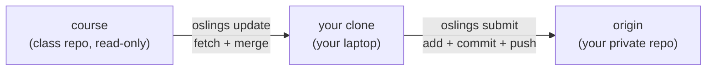

# Git and Submission

This page explains how released exercises get from the course repo onto your
laptop, and how your work gets from your laptop into a repo your TA and
professor can read. You will want it the first time `oslings update` refuses to
run, and any time you are unsure whether what you typed today was actually
saved. First-time setup lives in [Dev Setup](dev-setup.md); this is the
reference for what those commands do underneath.

## Two remotes, one clone

You have **one** clone of **one** repository on your machine, with two remotes
attached to it. Everything else follows from that.

| Remote | Points at | Your access | Used by |
|---|---|---|---|
| `course` | the class repo | read only (fetch) | `oslings update` |
| `origin` | your private `oslings-<your-github-username>` repo | read and write | `oslings submit` |



`oslings init-repo <url>` builds this arrangement, and you run it once. It
renames the clone's existing `origin` to `course`, adds your repo URL as the new
`origin`, and pushes your current branch with `-u` so it tracks (`sync.rs:50`).
Re-running it with a different URL is safe: it uses `remote set-url` when
`origin` already exists (`sync.rs:59`). If your URL does not contain
`oslings-`, it warns you — batch grading finds your repo by name.

Note what is *not* here: no per-exercise repo, no branch per exercise, no pull
request. Exercises are gated by **absence** — one that has not been released
exists in no commit you can fetch, so there is nothing to read ahead to.

## What `oslings update` does

`oslings update` is a fetch and a merge, with two safety checks in front of it
(`sync.rs:86`). In order:

1. **Dirty check.** Any uncommitted change — modified, staged, *or untracked* —
   under a course-owned path aborts the command before anything is fetched
   (`sync.rs:97`, `git.rs:78`).
2. **Fetch.** `git fetch course`. Nothing in your working tree changes yet.
3. **Divergence check.** `git diff --name-only course/main...HEAD` filtered to
   course-owned paths (`git.rs:88`). This catches edits you already *committed*
   to course files — the only thing a merge can conflict on.
4. **Merge.** `git merge --no-edit course/main` (`sync.rs:129`). Deliberately
   **not** `--ff-only`.
5. **Report.** It diffs `info.toml` before and after and prints the exercise
   names that are new (`sync.rs:15`). No new blocks means
   `Already up to date — no new exercises.`
6. **Self-update.** If the merge touched `oslings-cli/`, it re-runs
   `cargo install --path oslings-cli --force` for you (`sync.rs:146`).

`oslings update --from <remote-or-path>` pulls from somewhere other than
`course`, which you will only use if an instructor tells you to.

### Why there is a merge commit every time

Between two updates you make your own commits (every `oslings submit` is one),
so your branch moves ahead while `course/main` moves ahead too. Two branches
that both moved cannot fast-forward; git has to join them, and that join *is*
the merge commit. Your history correctly looks like this:

```text
* 4f1c2ab  Merge remote-tracking branch 'course/main'
|\
| * 9b0e771  release: ex07_scheduler        <- from course
* | 2d4a8e0  ex06_context_switch: submit (passing)   <- yours
* | 77c1d90  ex06_context_switch: submit (in progress)
|/
* 1a9f004  Merge remote-tracking branch 'course/main'
```

A merge commit per release is normal, harmless, and expected — not a mistake,
and not something to rebase away. The merge is safe precisely because the two
sides never write to the same files; see the ownership table below.

## What `oslings submit` commits

`oslings submit` stages exactly these paths, skipping any that do not exist
(`sync.rs:183`):

| Path | What it holds |
|---|---|
| `my-work/` | your archived work, one directory per exercise |
| `submissions/` | snapshots taken when an exercise passed, plus `oslings-meta.toml` |
| `.oslings/state.toml` | which exercise you are on, what you have passed, hints used, test runs |
| `rv6/src` | the kernel you are building |
| `warmup/src` | the Module 1 Rust exercises |

It then commits with the message `<exercise>: submit (passing)` or
`<exercise>: submit (in progress)` depending on whether that exercise is in your
completed list (`sync.rs:32`), and runs `git push origin HEAD`. If nothing is
staged it prints `Nothing new to submit.` and stops — no empty commits.

Two things worth knowing:

- **Submit at the end of every session, red or green.** All work happens in
  class, so this push is the record that you were here and working, and it is
  where you resume next time.
- **`commands/src/bin` and `asmlab/src` are not in that list.** Work there
  reaches your repo when OSlings archives it into `my-work/<exercise>/`, which
  happens whenever you move off the exercise (`model.rs:711`). To push an
  in-progress command file *before* moving on, stage it yourself first:
  `git add commands/src/bin` and then `oslings submit` — submit commits whatever
  is already in the index.

Ignored on purpose, so do not go looking for them in your repo: `target/`,
every `Cargo.lock` except the CLI's, `.oslings/config.toml`, and the
`oslings ship` output (`rv6/src/userbin/`, `rv6/src/userbin.rs`). Command
*sources* are committed; built images are not — see
[ulib and Commands](ulib-and-commands.md).

## Who owns which files

The whole design rests on the two sides never touching the same files.

| Course-owned (guarded) | Student-owned |
|---|---|
| `exercises/` | `rv6/src` |
| `info.toml` | `warmup/src` |
| `oslings-cli/` | `commands/src/bin` |
| `setup.sh`, `SETUP.md`, `README.md` | `asmlab/src` |
| | `my-work/`, `submissions/`, `.oslings/state.toml` |

The guarded list is literally `COURSE_PATHS` in `git.rs:15`; the staging
directories are in `model.rs:598`. Everything else — the crate manifests
(`rv6/Cargo.toml`, `warmup/Cargo.toml`, `commands/Cargo.toml`, `ulib/`), the
linker scripts (`rv6/kernel.ld`, `commands/user.ld`), `rust-toolchain.toml` — is
course-maintained but **not** guarded. Editing those will not stop `update` from
starting, but if a later release changes the same file you get a real merge
conflict at step 4, which is much less pleasant than the guard. Treat them as
read-only.

## When `update` refuses

This is the one failure mode worth understanding, and it has two forms.

### "these course files have uncommitted changes"

You edited or created a file under a course-owned path and have not committed
it. Common causes: a scratch note dropped in `exercises/`, hand-editing
`info.toml`, an editor reformatting a file you had open. The error prints the
exact fix:

```bash
git checkout -- exercises/ex07_scheduler/README.md
oslings update
```

**Caveat the message does not spell out:** `git checkout --` restores *tracked*
files only. If the offending path is a file you created, `git checkout` will
error with `did not match any file(s) known to git` — move it out of the repo
(or delete it) instead:

```bash
mv exercises/ex07_scheduler/notes.txt ~/Desktop/notes.txt
```

### "you have committed changes to course files"

Same cause, but the edit is already in a commit, so discarding the working copy
is not enough. Restore the course version from the upstream ref and commit that
restoration:

```bash
git checkout course/main -- info.toml
git commit -m "restore course files"
oslings update
```

Your own work is never at risk in either case: both guards run *before* the
merge and neither touches `rv6/src`, `warmup/src`, `my-work/`, or
`submissions/`. If the merge fails anyway, `oslings` tells you to stop — do
that, and ask a TA rather than experimenting with `git reset`.

## Git for people who have not used it much

You can pass this course knowing five ideas.

- **Commit** — a saved snapshot of the whole project with a message attached.
  Snapshots are cheap and permanent; nothing in a commit is lost.
- **Working tree** — the files as they are right now on disk. Changes here are
  *not* saved until a commit.
- **Staging area (index)** — what `git add` puts files into; `git commit` saves
  exactly what is staged. `oslings submit` does both for you.
- **Remote** — a copy of the repository living on GitHub. `push` sends your
  commits there; `fetch` brings theirs down.
- **Merge** — joining two lines of history. Normal here, once per release.

Useful, and safe to run any time:

| Command | Tells you |
|---|---|
| `git status` | what has changed and what is staged |
| `git log --oneline --graph -20` | your recent history, merges and all |
| `git remote -v` | that `origin` is yours and `course` is the class repo |
| `git diff` | the exact lines you changed since your last commit |

Avoid `git reset --hard`, `git rebase`, `git push --force`, and `git checkout
<branch>` unless a TA is watching — those are the commands that can actually
destroy work, and none of them are needed in this course. Everything else is
recoverable.

Two habits close every loop: `oslings update` at the start of a session,
`oslings submit` at the end of it. See [Using OSlings](oslings-usage.md) for the
rest of the CLI and the [Integrity Policy](integrity-policy.md) for what your
commit history may contain.
