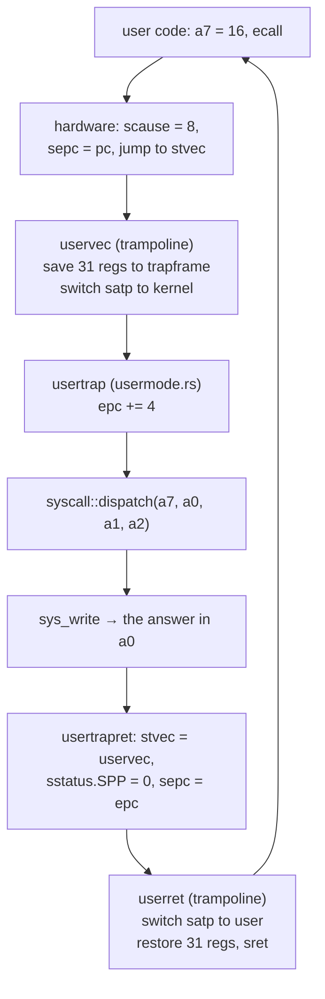

# Key Concepts

This is the vocabulary index for CS 326: every term the course uses, defined
once, in the order the kernel builds them. Open it mid-exercise when a README
says "the trapframe" and you want three sentences rather than a chapter, and
read it straight through before a midterm — with [Exam Prep](exam-prep.md) it
is half of the revision spine. Every entry ends with a **Where** line naming the
exercise, the lecture, and the file, so you can go from a word to the code in
one hop. All file references are to the reference kernel,
`exercises/52k_userland/solution/` (in your tree once `53k` is released).

---

## Privilege and the trap machinery

RISC-V has three privilege levels and exactly one way to move between them: a
trap. Everything in this section is a piece of that one mechanism.

### kernel

The program that owns the machine: it starts at reset, controls the MMU, the
timer, and the devices, and is the only code allowed to run privileged
instructions. rv6's kernel is the whole `rv6` crate — one binary, running in
supervisor mode after boot.

**Where:** `30k`–`52k`, all of it · L01, L10 · `main.rs` (`kmain`)

### privilege level

RISC-V's three modes: **machine (M)**, **supervisor (S)**, **user (U)**, most
to least privileged. Each has its own CSRs (`mstatus`/`sstatus`,
`mepc`/`sepc`), and each has instructions and registers the level below cannot
touch. rv6 uses all three: M only during boot and in the timer vector, S for
the kernel, U for programs.

**Where:** `43k`, `48k` · L18, L22 · `start.rs` (`MSTATUS_MPP_SUPERVISOR`)

### user mode

The unprivileged level programs run in. A user program cannot write CSRs, turn
off paging, or reach kernel memory — the last of those is enforced by one bit
in the page table, `PTE_U` (`vm.rs`). Take that bit away and the same load
instruction that worked a moment ago becomes a page fault.

**Where:** `48k` · L22, L23 · `vm.rs`, `usertrap()` in `usermode.rs` (`SPP = 0`)

### trap

Any forced transfer of control into the kernel. The hardware saves the
interrupted `pc` in `sepc`, writes a reason code into `scause`, and jumps to the
address in `stvec`; the kernel handles it and returns with `sret`, which
restores `pc` from `sepc`. Traps come in two flavors — exceptions and
interrupts.

**Where:** `43k` · L18 · `trap.rs` (`kerneltrap`), `usermode.rs`

### exception

A **synchronous** trap: something the current instruction did — an illegal
instruction, a touch of an unmapped page, or a deliberate `ecall`/`ebreak`. The
defining property is that it is caused by, and reproducible from, the
instruction at `sepc`.

**Where:** `43k` (breakpoint), `48k` (`ecall`) · L18 · `trap.rs`

### interrupt

An **asynchronous** trap: a device or the timer raised a line while unrelated
code was running. The interrupted instruction did nothing wrong and resumes
exactly as it was. Bit 63 of `scause` tells the two apart — 1 for interrupt,
0 for exception.

**Where:** `44k` (timer), `45k` (UART) · L18, L19 · `trap.rs`

The causes rv6 actually handles:

| `scause` | Kind | Meaning | Handled at |
|---|---|---|---|
| bit 63 + `1` | interrupt | supervisor software — the forwarded timer tick | `trap.rs`, `usermode.rs` |
| bit 63 + `9` | interrupt | supervisor external — a device, via the PLIC | `trap.rs` → `console::intr()` |
| `3` | exception | breakpoint (`ebreak`) | `trap.rs` |
| `8` | exception | environment call from U-mode (`ecall`) | `usermode.rs` |
| `2`, `12`, `13`, `15` | exception | illegal instruction, page faults | `usermode.rs` — kills the process |

### system call

The interface a user program uses to ask the kernel for something it cannot do
itself. In rv6 the convention is xv6's: the call number goes in `a7`, up to
three arguments in `a0`–`a2`, and the return value comes back in `a0`. Nine
calls exist: `fork`, `exit`, `wait`, `read`, `exec`, `getpid`, `open`, `write`,
`close`.

**Where:** `48k`, `50k`–`52k` · L23 · `syscall.rs` (numbers),
`syscall.rs` (`dispatch`)

### `ecall`

The instruction that makes a system call. It raises an exception —
`scause == 8` from user mode — and that is the whole mechanism: no magic, just
a deliberately triggered trap. `usertrap` adds 4 to the saved `epc` before
returning, so the program resumes at the instruction *after* the `ecall`
instead of executing it forever.

**Where:** `48k` · L23 · `finish()` (`usermode.rs`)

### trampoline

A single page of assembly (`uservec` and `userret`) mapped at the same virtual
address, `TRAMPOLINE` = `0x3F_FFFF_F000`, in the kernel's page table *and*
every user page table. It has to be, because it is executing at the moment
`satp` changes: after `csrw satp`, the very next instruction fetch uses the new
page table, and only a page mapped identically in both survives that.

**Where:** `48k` · L22 · `usermode.rs`, copied to its own page in
`kvmmake()` (`vm.rs`)

### trapframe

The per-process page, at `TRAPFRAME` = `0x3F_FFFF_E000`, where `uservec` parks
all 31 user registers on every trap, plus four values the trampoline needs to
find the kernel again (`kernel_satp`, `kernel_sp`, `kernel_trap`, and `epc`).
36 fields, 288 bytes. It is why `sscratch` holds the trapframe address while
user code runs: the kernel needs somewhere to spill a register before it has
any registers free.

**Where:** `48k` · L22 · `Trapframe` (`usermode.rs`) (layout), `Proc` (`proc.rs`) (the field)

The whole round trip, for one system call:

---

## Processes and scheduling

### process

One running program plus everything the kernel keeps on its behalf: an address
space, saved registers, a kernel stack, open files, a pid, a state. "Program" is
a file; "process" is a program in motion. rv6 has room for 64 (`NPROC`) in a
fixed array — kernels avoid growable structures on core paths.

**Where:** `34k` · L13 · `proc.rs`, `param.rs`

### PCB (process control block)

The kernel's record for one process — `struct Proc` in rv6: state, pid, page
table root, saved `Context`, trapframe pointer, kernel-stack page, open-file
table, parent pointer, exit status. When a textbook says "the OS stores the
process in the PCB," this struct is the PCB.

**Where:** `34k` · L13 · `proc.rs`

### process state

Which of five things a process is currently doing: `Unused` (a free table
slot), `Runnable` (wants the CPU), `Running` (has it), `Sleeping` (waiting for
something), `Zombie` (finished, not yet reaped). The scheduler only ever picks
`Runnable` slots, and `wait` only ever reaps `Zombie` ones.

**Where:** `34k`, `36k`, `51k` · L13 · `proc.rs`

### context switch

Swapping the CPU from one execution context to another by saving one set of
registers and loading another. rv6's `swtch` saves only 14 registers — `ra`,
`sp`, and `s0`–`s11` — because it is an ordinary function call, and the RISC-V
calling convention already says the caller must not expect `t`/`a` registers to
survive one.

**Where:** `35k` · L14 · `swtch` (`swtch.rs`) — the `extern` declaration and the `global_asm!` (the
assembly)

### scheduler

The loop that picks a `Runnable` process, `swtch`-es into it, and gets control
back when it yields or exits. rv6 separates **mechanism** (`swtch`) from
**policy** (which process): the loop lives in `scheduler()` (`usermode.rs`), the choice in
`sched.rs`, and you can replace one without touching the other.

**Where:** `36k`, `51k` · L14 · `scheduler()` (`usermode.rs`), `sched.rs`

### round robin

The simplest fair policy: keep the processes in a circle, give each `Runnable`
one a turn, wrap around, repeat. The state it needs is a single index — where
to resume scanning — which is why `RoundRobin` is one `usize`. Fairness here
means no process starves, not that turns are equal in length.

**Where:** `36k` · L14 · `sched.rs` (`pick_next`)

### preemption

Taking the CPU back from a process that did not ask to give it up, by
scheduling on a timer interrupt. The opposite is **cooperative** scheduling: the
process loses the CPU only when it calls into the kernel and yields. rv6 builds
the whole preemptive mechanism in `44k` and then does not use it — `usertrap`'s
tick branch clears the pending bit and returns (`usermode.rs`) rather than
rescheduling. rv6 schedules cooperatively, inside `wait` and `exit`.

**Where:** `44k` (the mechanism), `36k`/`51k` (the cooperative reality) ·
L14, L18 · `usermode.rs` (`proc_yield`)

### quantum

The slice of time a preemptive scheduler gives a process before the timer takes
the CPU back — a policy number, not a hardware one. rv6 programs the next tick
by writing `mtime + INTERVAL` into `mtimecmp` with `INTERVAL = 1_000_000` ticks
of the 10 MHz clock, about 0.1 s. Since rv6 does not reschedule on a tick, that
sets the tick rate rather than a real quantum.

**Where:** `44k` · L14, L18 · `start.rs`, `timerinit()` (`start.rs`)

---

## Concurrency

One hart, so most of this is about interrupts interleaving with kernel code
rather than two CPUs colliding — but the failure modes and the fixes are the
same ones a multicore kernel needs.

### race condition

Two pieces of code touching the same data at overlapping times, where the
result depends on which one got there first. The classic shape is a
read-modify-write: both read `false`, both write `true`, both believe they won.
Nothing in the source looks wrong; the bug is in the interleaving.

**Where:** `37k` · L15 · `37k_spinlocks/README.md`

### atomicity

The property of an operation that no other observer can see it half-done. The
one rv6 depends on is **compare-and-exchange**: "if this is still `false`, make
it `true`," decided and applied by the hardware in one indivisible step.
Exactly one caller can win the `false → true` transition, and that is all
mutual exclusion actually needs.

**Where:** `37k` · L15 · `SpinLock::lock()` (`spinlock.rs`)

### spinlock

A lock whose waiters busy-wait — spin retrying the atomic — rather than
sleeping. Cheap when contention is short, ruinous when it is long. rv6's
`SpinLock<T>` wraps the data it protects in an `UnsafeCell`, so the only way to
reach the data is to hold the lock; `unsafe impl Sync` is the promise that makes
it shareable.

**Where:** `37k` · L15 · `spinlock.rs`

### RAII guard

A value whose destructor releases a resource, so the compiler releases it for
you at the end of the scope. `SpinLock::lock` returns a `SpinLockGuard` that
`Deref`s to the data and unlocks in `Drop` (`spinlock.rs`) — you cannot
forget, and an early `return` cannot skip it. `drop(guard)` releases early, as
the shell does before touching the filesystem again.

**Where:** `37k` · L15 · `spinlock.rs`, used at `Shell::cmd_cd()` (`shell.rs`)

### deadlock

A cycle of waiting that never breaks: everyone holds something someone else
needs. The rv6-sized version is single-threaded — take a spinlock, then take an
interrupt whose handler takes the same lock, and the CPU spins forever. Real
kernels avoid it by disabling interrupts while a lock is held and never
sleeping with one; rv6's lock deliberately does neither, and says so.

**Where:** `37k` (the caveat), `51k` (the detector) · L15 ·
`37k_spinlocks/README.md:110`, `scheduler()` (`usermode.rs`)

### semaphore

A counter with two atomic operations: **wait** (take a permit, block if there
are none) and **post** (give one back). It generalizes the lock — one permit
*is* a mutex — and is how you count a bounded resource. rv6's is a
`SpinLock<i64>` with a non-blocking `try_wait`: there is no sleep queue, so a
caller that finds zero permits decides for itself what to do.

**Where:** `38k` · L15 · `Semaphore` (`semaphore.rs`)

---

## Memory

The largest cluster in the course, and the one where precise words matter most.
See [Memory Map](memory-map.md) for the addresses and
[Sv39 Paging](sv39-paging.md) for the translation walk in detail.

### physical address

An address the hardware wires up: RAM at `0x8000_0000`–`0x8800_0000`, the UART
at `0x1000_0000`, the PLIC at `0x0c00_0000`. Fixed by the QEMU `virt` board,
identical for every program, and the only kind of address that exists before
the MMU is switched on.

**Where:** `31k`, `32k` · L10, L11 · `memlayout.rs`

### virtual address

An address a program uses, which the MMU translates to a physical one. Under
Sv39 there are 39 usable bits; rv6 stops one bit short at `MAXVA = 1 << 38` so
it never has to deal with sign-extended high addresses. After `39k`, "address"
without a qualifier is ambiguous — always say which.

**Where:** `33k`, `39k` · L12, L16 · `memlayout.rs`

### address space

The complete set of valid virtual addresses for one context, defined by one
page table. rv6 has the kernel's (nearly identity, built once by `kvmmake`) and
one per process (program image at 0, stack at `0x1_0000`, trapframe and
trampoline at the top). Two processes can both use address `0x0` and mean
different memory — that is the whole point.

**Where:** `39k`, `48k`, `49k` · L16, L22 · `memlayout.rs` (the layout
comment)

### page

The fixed-size unit the MMU translates: 4096 bytes on RISC-V, `PGSIZE` in rv6.
Everything about virtual memory is quantised to it — mappings, permissions,
allocations, and faults. A page table is itself exactly one page: 512 entries
of 8 bytes.

**Where:** `32k`, `33k` · L11, L12 · `memlayout.rs`

### page frame

A page-sized, page-aligned slot of *physical* memory. "Page" is the unit of the
virtual side, "frame" the unit of the physical side; a mapping is a pairing of
one page with one frame. The page allocator hands out frames.

**Where:** `32k` · L11 · `kalloc.rs`

### page table

The tree the MMU walks to translate an address. Sv39 uses three levels of 512
entries each; the nine bits at position `12 + level * 9` of the virtual address
index one level. `walk` descends it, allocating missing interior pages when
asked to; `mappages` calls `walk` once per page and writes the leaf.

**Where:** `33k` · L12 · `walk` and `mappages` (`vm.rs`)

### PTE (page table entry)

One 64-bit entry: a physical page number in bits 10–53, flags in bits 0–9. rv6
uses five — `V` (valid, bit 0), `R`, `W`, `X` (bits 1–3), and `U` (bit 4,
user-accessible). A leaf has at least one of `R`/`W`/`X`; an entry with only `V`
set is an interior node. That test is how the teardown and copy walks tell
leaves from branches.

**Where:** `33k` · L12 · `PTE_V` and the other flag bits, and `Pte` (`vm.rs`)

### MMU

The hardware that does the translation, switched on by writing `satp`. rv6's
`satp` value is mode `8` (Sv39) in the top four bits plus the root page table's
physical page number: `SATP_SV39 | (root >> 12)`. The instant that write
retires, every address the CPU issues is virtual — including the one it is
about to fetch the next instruction from.

**Where:** `39k` · L16 · `vm.rs` (`kvminithart`)

### TLB

The MMU's cache of recent translations. It is not coherent with the page tables
in memory: change a mapping and the stale entry survives. `sfence.vma zero,
zero` flushes all of it, which is why it follows every `satp` write — in
`kvminithart`, and on both sides of each `satp` switch in the trampoline. A
mapping bug that "only happens the second time" is usually a missing fence.

**Where:** `39k`, `48k` · L16 · `vm.rs`, `usermode.rs`

### identity mapping

A mapping where the virtual address equals the physical address. rv6's kernel
page table is almost entirely this: the UART page, the test finisher page, 4 MiB
of PLIC, and all of RAM from `KERNBASE` to `PHYSTOP`, each mapped to itself.
That is what makes turning the MMU on survivable — `pc` and `sp` mean the same
thing one instruction later. None of it carries `PTE_U`.

**Where:** `39k` · L16 · `kvminithart()` (`vm.rs`)

### allocator

The kernel's source of memory. rv6 has two layers: `kalloc` hands out whole
physical page frames (this is the real one), and `kheap` implements Rust's
`GlobalAlloc` on top of it. `kalloc::init` frees everything from the linker
symbol `end` up to `PHYSTOP`, which is why the kernel's own image is never
handed out.

**Where:** `32k` · L11 · `kalloc.rs`

### free list

The data structure behind `kalloc`: a singly linked LIFO stack of free pages
where the `next` pointer is stored *in the free page itself*. Zero bookkeeping
overhead, because a page you are not using is free storage. It also means
`kfree` cannot validate anything — free the same page twice and you get a
list that loops back on itself.

**Where:** `32k` · L11 · `kalloc.rs` (`Run`), `kalloc.rs`

### heap

Memory for objects whose size or lifetime is not known at compile time — `Box`,
`Vec`, `String`, `Arc`. In a `no_std` kernel none of it exists until you register
a `#[global_allocator]`. rv6's serves every allocation from one whole 4 KiB page,
so a 16-byte `Arc` costs 4096 bytes and anything larger fails. The shell's
`Vec<(String, usize)>` runs on it.

**Where:** `38k` · L15 · `impl GlobalAlloc for KernelHeap` (`kheap.rs`), `ALLOCATOR` (`kheap.rs`)

---

## Devices

### MMIO (memory-mapped I/O)

Talking to a device by loading and storing at reserved physical addresses
instead of using special instructions. `0x1000_0000` is not memory — a store
there transmits a byte. This is why the kernel page table has to map the device
pages before the MMU comes on: otherwise the first `uart::puts` after the
`satp` write faults.

**Where:** `21r`, `31k`, `41k` · L09, L17 · `memlayout.rs`, `uart.rs`

### `volatile`

The marker that says "this access has a side effect — do not optimize it
away, do not reorder it, do not fold two of them into one." Ordinary memory
does not need it; device registers always do, because reading `LSR` twice can
legitimately give two different answers. In Rust it is a property of the
access, not the type: `core::ptr::read_volatile` / `write_volatile`.

**Where:** `21r`, `41k` · L09, L17 · `reg_read()` (`uart.rs`)

### polling

Asking a device repeatedly whether it is ready, in a loop. `uart::putc` spins
on the `THRE` bit until the transmitter is empty and then writes the byte —
three lines, no interrupt controller, no state. It wastes CPU while it waits,
which is fine for output during boot and unacceptable for keyboard input.

**Where:** `41k` · L17 · `getc()` (`uart.rs`)

### device driver

The kernel code that knows one device's register layout and turns it into an
interface the rest of the kernel can use. `uart.rs` is the whole of rv6's: six
register offsets, two status bits, `init`/`putc`/`getc`. Everything above it
says "print a byte" without knowing what an NS16550A is.

**Where:** `41k` · L17 · `uart.rs`

### UART

The serial port — the console. On QEMU `virt` it is an NS16550A at
`0x1000_0000`, and with `-nographic -serial mon:stdio` its output is your
terminal. Its registers are one byte apart:

| Offset | Read | Write | rv6 uses |
|---|---|---|---|
| 0 | `RBR` — received byte | `THR` — byte to transmit | `getc`, `putc` |
| 1 | — | `IER` — interrupt enable | `0x00` polled, `0x01` for RX interrupts |
| 2 | — | `FCR` — FIFO control | `0x07` (enable + clear both FIFOs) |
| 3 | — | `LCR` — line control | `0x03` (8N1) |
| 4 | — | `MCR` — modem control | bit 4 = loopback, for the `41k` test |
| 5 | `LSR` — line status | — | bit 0 `DR` = byte waiting, bit 5 `THRE` = ok to send |

**Where:** `31k`, `41k`, `45k` · L17, L19 · `uart.rs`

### PLIC

The Platform-Level Interrupt Controller: the traffic cop that collects device
interrupt lines and delivers one to a hart. Using it takes four steps — give
the source a non-zero priority, enable it for this hart's supervisor context,
set the threshold to accept it, and then on each interrupt `claim` it (which
returns the source number) and `complete` it. The UART is source 10.

**Where:** `45k` · L19 · `UART0_IRQ` and `init()` (`plic.rs`)

### CLINT

The Core-Local Interruptor: the timer. `mtime` at `0x0200_BFF8` counts up at
10 MHz; when it reaches `mtimecmp` (hart 0's is at `0x0200_4000`) a machine
timer interrupt fires. It speaks *only* machine mode, which is why rv6 keeps a
tiny M-mode handler, `timervec`, that reschedules the next tick and then
forwards it to supervisor mode as a software interrupt.

**Where:** `44k` · L18 · `CLINT_MTIME` and `timervec` (`start.rs`)

---

## Files

### inode

The kernel's record of a file's *contents and metadata*, independent of any
name. rv6's is deliberately tiny: a kind (`Free`/`File`/`Dir`), a size, 128
bytes of data, and 16 directory slots, all in a fixed array of 64 living in
RAM. The number of an inode — its index — is its identity; inode 1 is the root
directory.

**Where:** `40k` · L17, L21 · `Inode` and `ROOT` (`fs.rs`)

### directory

An inode whose contents are a list of (name, inode number) pairs. That is the
entire idea: names live in directories, not in files, and looking up a name
means scanning a directory for a matching entry. rv6 allows 16 entries of at
most 14 characters each.

**Where:** `40k`, `46k` · L17, L21 · `fs.rs` (`DirEnt`), `fs.rs`
(`dirlookup`)

### path resolution

Turning a path into an inode number by walking it one component at a time:
start at a directory, look up the first name, use the result as the next
directory, repeat. rv6 splits this in two, which is worth knowing before you
hunt a bug: the shell keeps a current directory as a stack of `(name, inum)`
components and resolves single names against it, while the `open` system call
resolves in the root directory only — so user programs see a flat namespace.

**Where:** `46k`, `50k` · L20, L21 · `shell.rs`, `capture` (`syscall.rs`)

### file descriptor

A small integer a process uses to name something it has open — an index into
its own table, nothing more, so fd 3 in one process and fd 3 in another are
unrelated. Every process starts with 0, 1, and 2 open on the console, the
convention that lets a program `write` to fd 1 without asking what it is.

**Where:** `50k` · L24 · `NOFILE` (`file.rs`), `proc.rs` (`ofile`)

### open file table

The per-process array the descriptors index: `ofile[16]` in the PCB. Each entry
records what is open (console or inode), which inode, whether it is readable and
writable, and — the important one — the current **offset**. That offset is what
makes an fd more than a one-shot read: it remembers where the last read stopped,
so successive reads walk the file.

**Where:** `50k` · L24 · `File` (`file.rs`), `syscall.rs` (`fdalloc`)

---

## The Unix process API

### `fork`

Create a near-exact copy of the calling process and return **twice**: the
child's pid to the parent, `0` to the child. rv6 allocates a process, copies the
parent's user pages with `uvmcopy`, copies the trapframe so the child resumes at
the same instruction, then overwrites the child's `a0` with 0. The child
inherits the open-file table and records its parent.

**Where:** `51k` · L24 · `sys_fork()` (`syscall.rs`), `vm.rs` (`uvmcopy`)

### `exec`

Replace the calling process's memory with a different program, keeping its pid
and its open files. On success **it does not return** — the instruction after
the call was in the memory that was just freed. rv6 builds the whole new
address space first and only then swaps it in, so a failed `exec` leaves the
old program running and returns -1.

**Where:** `49k` (as a kernel function), `52k` (as a system call) · L25 ·
`exec.rs` (`exec_into`)

### `wait`

Block until one of this process's children has exited, then reap it: free its
slot, and copy its exit status out to the parent if it asked for one. Returns
the child's pid, or -1 if there were no children to wait for. rv6's blocks by
calling `proc_yield` in a loop and rescanning the table each time it is
scheduled again.

**Where:** `51k` · L24 · `sys_wait()` (`syscall.rs`)

### zombie

A process that has exited but whose slot the kernel still holds, because its
exit status has not been collected yet. `exit_current` records the status, sets
the state to `Zombie`, and `swtch`-es away for good — the scheduler never
switches back into one. `wait` is what finally frees it. Zombies are not a bug;
a parent that never waits is.

**Where:** `51k` · L24 · `usermode.rs`, `ProcState` (`proc.rs`)

### `init`

On a real Unix, the first user process (pid 1): started directly by the kernel,
it starts the shell and adopts orphaned children so someone is always left to
reap them. rv6 has no `init` — `kmain` calls the kernel-mode shell directly
(`main.rs`), `run sh` starts the user-mode shell from there, and orphans are
freed wholesale by `cleanup_except`.

**Where:** conceptually `52k`; not implemented · L01, L25 · `main.rs`,
`usermode.rs`

### shell

An ordinary program that reads a line, splits it into a command and arguments,
and runs it — usually `fork`, then `exec` in the child, then `wait` in the
parent. rv6 has two: the kernel-mode REPL of `46k`/`47k` (`rv6$`, calling
kernel functions directly), and `sh` from `52k`, an unprivileged user program
that reaches the kernel only through system calls. Getting from the first to the
second is the arc of the course.

**Where:** `46k`, `47k`, `52k` · L20, L25 · `run()` (`shell.rs`), `exec.rs`

### pipe

A bounded in-kernel buffer with a read end and a write end, each a file
descriptor, so one program's output becomes another's input. The hard part is
the blocking rules: a reader on an empty pipe waits for a writer, a writer on a
full one waits for the reader, and a read on an empty pipe whose writers have
all closed returns 0 — end of file. rv6 has no pipes in the core course; they
are extra credit (pipes, design-only).

**Where:** extra credit `55k` · L26 · not in the reference kernel

---

## Pairs that get confused

Most exam mistakes are here rather than in the definitions above.

| These two | The distinction |
|---|---|
| exception vs interrupt | Both are traps. An exception is synchronous, caused by the current instruction; an interrupt is asynchronous. `scause` bit 63 says which. |
| trap vs context switch | A trap changes privilege level within one process; a context switch changes which process runs, at one privilege level. `ecall` does the first, `swtch` the second. |
| trapframe vs `Context` | The trapframe holds 31 registers of a *user* process across a trap. The `Context` holds 14 callee-saved registers of a *kernel* thread across `swtch`. |
| page vs page frame | Page = the virtual-side unit, frame = the physical-side slot. A mapping pairs one with one. |
| virtual vs physical address | Identical until `satp` is written, different after — mixing them up produces bugs that appear only once paging is on. |
| `PTE_V` vs `PTE_U` | `V` says the entry is usable at all; `U` says user mode may use it. The kernel's mappings are valid but not user-accessible — that is the wall. |
| file descriptor vs inode | The fd is a per-process integer with an offset. The inode is the kernel-wide file. Two fds can share one inode at different offsets. |
| `fork` vs `exec` | `fork` makes another process running the same program; `exec` makes the same process run another program. A command needs both, in that order. |
| spinlock vs semaphore | A spinlock is binary and busy-waits; a semaphore counts and normally blocks. One permit is a mutex. |
| polling vs interrupts | Polling asks repeatedly and burns CPU; an interrupt costs a trap. rv6 polls output (`41k`), interrupts on input (`45k`). |
| preemptive vs cooperative | Preemptive: the timer takes the CPU. Cooperative: the process gives it up. rv6 has the timer but schedules cooperatively. |
| kernel vs user mode | A hardware distinction, not a Rust or `unsafe` one: enforced by the privilege level and the `U` bit, crossed only by a trap. |

---

## Where to go next

- Addresses and the linker script: [Memory Map](memory-map.md)
- The translation walk: [Sv39 Paging](sv39-paging.md)
- How the modules fit together: [rv6 Architecture](rv6-architecture.md)
- Registers and CSRs: [RISC-V](riscv.md)
- One-page recall sheet: [Cheatsheet](cheatsheet.md)
- What each exam covers: [Exam Prep](exam-prep.md)
