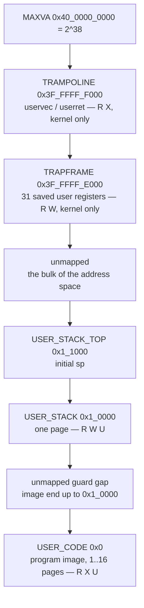

# The Memory Map

This page is the address reference for rv6. When you are staring at a constant
like `0x3F_FFFF_F000` in `memlayout.rs`, or wondering why your page allocator
handed out a page that was already holding your kernel's `.bss`, or why QEMU
jumped to your `_entry` and not somewhere else, the answer is here. You will
need it in exercise 31k (boot), exercise 32k (the allocator), exercise 33k
(paging), and again in exercise 48k when user address spaces appear. Everything
below is taken from the reference kernel's `memlayout.rs`
(`exercises/52k_userland/solution/`),
`rv6/kernel.ld`, and QEMU itself.

## Two maps, not one

rv6 lives in two different address spaces and you have to keep them apart:

- **Physical addresses** are what the `virt` board wires up: RAM at one range,
  devices at others. Fixed by the board, identical for every program.
- **Virtual addresses** are what the MMU translates, once you turn on Sv39 in
  exercise 33k. The kernel's virtual map is nearly identity; each user process
  gets its own, starting at 0.

Before exercise 33k there is only the physical map. After it, "address" always
needs a qualifier. See [Sv39 Paging](sv39-paging.md) for how the translation
itself works.

## The QEMU `virt` physical map

These are the addresses the board actually presents. The last column marks what
rv6 uses.

| Physical range | Device | rv6 |
|---|---|---|
| `0x0000_1000` – `0x0000_ffff` | boot ROM (`mrom`): the reset vector | jumped *from* |
| `0x0010_0000` – `0x0010_0fff` | SiFive test finisher | `TEST_FINISHER`, `testdev.rs` |
| `0x0010_1000` | goldfish RTC | unused |
| `0x0200_0000` – `0x0200_3fff` | CLINT software-interrupt registers | unused |
| `0x0200_4000` – `0x0200_bfff` | CLINT timer: `mtime` (`+0xBFF8`), `mtimecmp` (`+0x4000`) | `start.rs:17`, `start.rs:18` |
| `0x0c00_0000` – `0x0c5f_ffff` | PLIC | `PLIC`, `plic.rs` |
| `0x1000_0000` | NS16550A UART | `UART0`, `uart.rs` |
| `0x1000_1000` – `0x1000_8fff` | eight virtio-mmio slots | unused |
| `0x2000_0000` – `0x23ff_ffff` | pflash | unused |
| `0x3000_0000` – `0x3fff_ffff` | PCIe ECAM | unused |
| `0x8000_0000` – `0x87ff_ffff` | RAM (`-m 128M`) | the kernel and everything it allocates |

Two conventions worth pinning down. The **CLINT** base in `start.rs` is written
`0x0200_0000`, with `mtimecmp` for hart 0 at `+0x4000` and `mtime` at `+0xBFF8`
— those land inside the timer block above. The **PLIC** is 6 MiB wide on the
board, but `PLIC_SIZE` in `memlayout.rs:27` is `0x40_0000` (4 MiB), which
comfortably covers every register `plic.rs` touches (the highest is
`PLIC + 0x20_1004`).

You do not have to take this table on faith. From the QEMU monitor:

```bash
printf 'info mtree -f\nquit\n' | qemu-system-riscv64 -machine virt \
  -bios none -m 128M -smp 1 -nographic -monitor stdio -serial null -S
```

## Why `0x8000_0000`, and what `-bios none` buys you

A RISC-V hart on the `virt` board resets with `pc = 0x1000`, inside the boot
ROM. That ROM holds six instructions, and you can disassemble them yourself
(`x/10i 0x1000` in the monitor):

```asm
0x1000:  auipc  t0, 0
0x1004:  addi   a2, t0, 40
0x1008:  csrr   a0, mhartid
0x100c:  ld     a1, 32(t0)     # a1 = device tree address
0x1010:  ld     t0, 24(t0)     # t0 = 0x8000_0000
0x1014:  jr     t0
```

That is the whole boot process. Normally the address in `t0` would be OpenSBI's
firmware entry point; OpenSBI would then load a bootloader, which would load
Linux. **`-bios none` deletes all of those layers** — QEMU loads the `-kernel`
ELF straight into RAM and points the reset vector at `0x8000_0000`, the base of
RAM. So the kernel is not "loaded at" `0x8000_0000` by choice so much as by
obligation: that is the address the ROM jumps to, and everything below it is
device space, not memory.

Consequences you inherit: the kernel starts in **machine mode**, there is no
SBI to call, and nothing has set up a stack. `entry.rs` fixes the last of those
before any Rust runs. See [rv6 Architecture](rv6-architecture.md) for the boot
chain past that point.

## `kernel.ld`, line by line

The linker script is 20 lines of substance and every one of them matters.

```text
OUTPUT_ARCH( "riscv" )
ENTRY( _entry )            /* kernel.ld:12 */

SECTIONS {
  . = 0x80000000;          /* kernel.ld:16 */

  .text : {
    *(.entry)              /* kernel.ld:19 */
    *(.text .text.*)
    . = ALIGN(0x1000);
    PROVIDE(etext = .);    /* kernel.ld:22 */
  }
  .rodata : { . = ALIGN(16); *(.srodata .srodata.*) *(.rodata .rodata.*) }
  .data   : { . = ALIGN(16); *(.sdata .sdata.*)     *(.data .data.*) }
  .bss    : { . = ALIGN(16); *(.sbss .sbss.*)       *(.bss .bss.*) }

  PROVIDE(end = .);        /* kernel.ld:43 */
}
```

**`ENTRY(_entry)`** writes `_entry`'s address into the ELF header's entry field.
It is documentation for a debugger more than a command to QEMU: with `-kernel`,
QEMU loads the ELF's segments and the ROM jumps to `0x8000_0000` regardless. The
two agree only because of the next trick.

**`. = 0x80000000`** sets the location counter. Every section that follows is
assigned addresses starting there.

**`*(.entry)` first.** This is the trick. `entry.rs` marks `_entry` with
`#[link_section = ".entry"]`, and the script places that input section at the
very front of `.text`. Nothing else claims `.entry`, so `_entry` lands at
exactly `0x8000_0000` — the address the ROM jumps to. Without it, the linker
would order functions however it liked and the first instruction executed would
be some arbitrary Rust function with a broken `sp`. This is also why the failure
mode of a bad exercise 31k is a silent timeout rather than an error.

**`PROVIDE(etext = .)`** names the end of the text section, page-aligned. `etext`
is the boundary you would use to map code read-execute and everything above it
read-write; rv6's `kvmmake` currently maps all of RAM `R|W|X` and does not
reference it. `PROVIDE` only emits a symbol if something asks for one, so if you
run `nm` on the kernel today you will not find `etext` at all. That is not a
bug — it appears the moment you write code that uses it.

**`PROVIDE(end = .)`** is the important one. It sits after `.bss`, so it is the
first address past every byte the kernel image occupies. Note that the script
names only four output sections; the linker places anything else (`.eh_frame`,
for instance) on its own, so do not assume `end` equals `.bss` start plus `.bss`
size in every build.

## What the allocator does with `end`

`kalloc.rs` declares `end` as an external symbol and treats everything from
there to `PHYSTOP` as free:

```rust
extern "C" {
    static end: u8;
}

pub unsafe fn init() {
    let start = &end as *const u8 as usize;
    free_range(start, PHYSTOP);          // kalloc.rs:23
}
```

`free_range` rounds up to a page boundary and pushes every whole page onto a
free list. This is the entire reason `end` exists: it is the runtime answer to
"where does my kernel stop and spare memory begin," and it moves every time you
add code. Hardcoding a number there works until the day it does not.

In one debug build of the exercise-22 kernel, those symbols came out as:

| Symbol / section | Address | Note |
|---|---|---|
| `_entry` | `0x8000_0000` | first instruction |
| `.text` | `0x8000_0000`, `0x1_0000` bytes | `etext` would be `0x8001_0000` |
| `trampoline` | `0x8000_6000` | copied to its own page by `kvmmake` |
| `.rodata` | `0x8001_0000` | |
| `.data` | `0x8001_9200` | 8 bytes |
| `.bss` | `0x8001_9208`, `0x1_7540` bytes | includes `STACK0` at `0x8001_9210` |
| `end` | `0x8003_0748` | allocator starts at `0x8003_1000` |

That leaves 32,719 free pages (just under 128 MiB) for `kalloc`. Your numbers
will differ — that is the point.

```text
physical memory
  0x8800_0000  PHYSTOP  (KERNBASE + 128 MiB)
       ^
       |       free pages -> kalloc's free list
       |       (page tables, trapframes, kernel stacks, user pages)
       |
  0x8003_1000  first free page (pgroundup of `end`)
  0x8003_0748  end       <- PROVIDE(end = .) in kernel.ld:43
       |       .bss  (includes STACK0, the boot stack)
       |       .data
       |       .rodata
       |       .text (etext at its top)
  0x8000_0000  KERNBASE = _entry = where the ROM jumps
       .
       .       device space: PLIC, CLINT, UART, test finisher
  0x0000_1000  boot ROM reset vector
```

## The kernel's virtual address space

`vm.rs:125` (`kvmmake`) builds it, and it is deliberately boring — an identity
map plus one exception:

| Virtual range | Maps to | Perms | Source |
|---|---|---|---|
| `0x1000_0000` (1 page) | itself | `R W` | `vm.rs:132` |
| `0x0010_0000` (1 page) | itself | `R W` | `vm.rs:135` |
| `0x0c00_0000` (4 MiB) | itself | `R W` | `vm.rs:138` |
| `0x8000_0000` – `0x8800_0000` | itself | `R W X` | `vm.rs:141` |
| `TRAMPOLINE` (1 page) | a fresh page holding a copy of `uservec`/`userret` | `R X` | `vm.rs:169` |

Identity mapping means a physical address and a kernel virtual address are the
same number, so kernel pointers keep working the instant `satp` is written. The
CLINT is absent on purpose: only machine-mode code touches it, and machine-mode
accesses bypass `satp` entirely.

## A user address space, top down

Every process gets its own page table. Read it from the top:

| Virtual address | Contents | Permissions |
|---|---|---|
| `0x40_0000_0000` | `MAXVA` — one past the last usable address | — |
| `0x3F_FFFF_F000` | `TRAMPOLINE`: `uservec` / `userret` | `R X` (no `U`) |
| `0x3F_FFFF_E000` | `TRAPFRAME`: this process's 31 saved user registers | `R W` (no `U`) |
| `0x0001_1000` | `USER_STACK_TOP` — initial `sp` | — |
| `0x0001_0000` | `USER_STACK` — the one stack page | `R W U` |
| `0x0000_0000` | `USER_CODE` — program image, 1 to 16 pages | `R X U` |

```text
  0x40_0000_0000  MAXVA  (1 << 38)
  0x3F_FFFF_F000  TRAMPOLINE   [R X ]  shared by every address space
  0x3F_FFFF_E000  TRAPFRAME    [R W ]  one per process
                  ~~~~~~~~~~~~~~~~~~~~ ~256 GiB unmapped ~~~~~~~~~~~~~~~
  0x0001_1000     USER_STACK_TOP -> initial sp, argv/argc pushed below it
  0x0001_0000     USER_STACK   [R W U]  one page, grows down
                  ~~~~~~ unmapped gap (guard) ~~~~~~
  0x0000_1000     end of a one-page program image
  0x0000_0000     USER_CODE    [R X U]  image, up to MAX_PROG_PAGES = 16
```



Four things about this layout trip people up.

**`MAXVA` is `1 << 38`, not `1 << 39`.** Sv39 has 39 address bits, but bit 38 is
the sign bit: any address with it set must be sign-extended into all the upper
bits or the hardware faults. Stopping one bit short (`memlayout.rs:49`) means no
address rv6 constructs is ever a candidate for that mistake.

**The trampoline is mapped at the same virtual address in *every* page table.**
That is not an aesthetic choice. `uservec` switches `satp` mid-instruction
stream; the instruction after the switch must still be mapped, and the only way
to guarantee that is for the page to live at an identical address in both tables
(`vm.rs:153`).

**`TRAMPOLINE` and `TRAPFRAME` have no `PTE_U` bit.** They are in the user's
page table, but user mode cannot touch them — that single bit is the wall
(`vm.rs:23`). `free_pt` uses the same bit to decide what a process owns:
`PTE_U` leaves get freed, non-`U` leaves get unmapped only (`vm.rs:363`).

**The guard is a gap, not a page.** `USER_STACK` is fixed at
`MAX_PROG_PAGES * PGSIZE` = `0x1_0000` (`memlayout.rs:72`), above the largest
image rv6 will load. A one-page program therefore leaves 15 unmapped pages
between its code and its stack, so running off the end of either faults cleanly
instead of corrupting the other. Be honest about the edge case: a program that
actually uses all 16 pages has *no* gap, and its last code page sits directly
below the stack.

**Address 0 is a valid, mapped, executable address.** `USER_CODE` is `0x0`
(`memlayout.rs:61`), so a null pointer dereference in an rv6 user program reads
its own first instruction rather than faulting. That is a real difference from
Linux and it will surprise you at least once.

## Constants, in one place

All from `memlayout.rs`.

| Constant | Value | Line |
|---|---|---|
| `PGSIZE` | `4096` | 7 |
| `KERNBASE` | `0x8000_0000` | 10 |
| `PHYSTOP` | `0x8800_0000` | 13 |
| `UART0` | `0x1000_0000` | 17 |
| `TEST_FINISHER` | `0x0010_0000` | 21 |
| `PLIC` | `0x0c00_0000` | 26 |
| `PLIC_SIZE` | `0x0040_0000` | 27 |
| `MAXVA` | `0x40_0000_0000` | 49 |
| `TRAMPOLINE` | `0x3F_FFFF_F000` | 53 |
| `TRAPFRAME` | `0x3F_FFFF_E000` | 57 |
| `USER_CODE` | `0x0` | 61 |
| `MAX_PROG_PAGES` | `16` | 65 |
| `USER_STACK` | `0x0001_0000` | 72 |
| `USER_STACK_TOP` | `0x0001_1000` | 75 |

Two stacks are *not* in that table because they are allocated, not fixed:
`STACK0` in `entry.rs` is a 16 KiB boot stack living in `.bss`, and each process
gets a one-page kernel stack from `kalloc` (`proc.rs:118`), with `kernel_sp` set
to `kstack + PGSIZE` (`usermode.rs:450`).

To watch any of this at runtime, see [QEMU and GDB](qemu-gdb.md).
