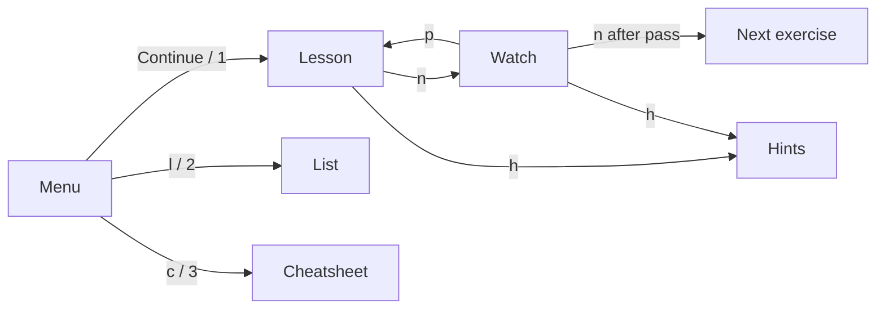

# Using OSlings

OSlings is the CLI you will spend every lab session inside. It hands you one
exercise at a time, re-runs that exercise's test every time you save, archives
your work so nothing is lost when you move around, and pushes it to your own
repo when the session ends. This page is the reference: what each command does,
what each key does, what the three test modes actually check, and which
directories hold what. Read [Dev Setup](dev-setup.md) first if `oslings doctor`
is not yet all green.

## Two ways to drive it

Running `oslings` with no subcommand opens the full-screen app. Every action in
that app also exists as a subcommand, so you can script it, run it over ssh, or
keep it in a second terminal pane. Both talk to the same state file
(`.oslings/state.toml`) and the same test harness, so mixing them is fine.

## The full-screen app



The menu has five items, and `1`–`5` jump straight to them: **Continue** (into
the exercise you are on), **Exercise list**, **Cheatsheet**, **How OSlings
works**, **Quit** (`tui.rs:920`).

**Lesson** renders that exercise's `README.md` — the concept, the code you are
being handed, and the task. **Watch** is where you live: it runs the test once
on entry, then re-runs it on every save, showing the compiler or QEMU output
inline. A progress bar sits at the bottom of every page.

### Keys

These work everywhere (`tui.rs:547`):

| Key | Action |
|---|---|
| `q`, `Ctrl-C` | Quit |
| `m` | Back to the menu |
| `l` | Open the exercise list |
| `c` | Open the cheatsheet |
| `↑`/`↓` or `k`/`j` | Scroll one line |
| `PgUp`/`PgDn` or `Space` | Scroll one page |
| `Esc` | Back (to the menu, or out of an overlay) |

Page-specific keys:

| Page | Key | Action |
|---|---|---|
| Menu | `↑`/`↓`, `Enter`, `1`–`5` | Move, select, jump |
| Lesson | `n` | Start: run the test and watch for saves |
| Lesson / Watch | `h` | Open hints (the first is revealed on open) |
| Watch | `p` | Back to the lesson |
| Watch | `n` | Advance — **only after the test passes** |
| Watch | `r` | Reset this exercise to its pristine skeleton and re-run |
| Hints | `h` | Reveal the next hint |
| Hints / List / Cheatsheet | `p` | Back to the page you came from |
| List | `↑`/`↓`, `Enter` | Move, open the selected exercise |

The footer of each page always spells out its own keys, so you never have to
remember this table (`tui.rs:729`).

## Subcommands

| Command | What it does |
|---|---|
| `oslings update` | Merge newly released exercises from the `course` remote |
| `oslings run [ex]` | Run one exercise's test once (defaults to current) |
| `oslings watch` | Headless watch-on-save for the current exercise |
| `oslings hint [ex]` | Reveal the next hint; `--all`, `--reset` |
| `oslings list` | Every exercise in order, with `✓` and test mode |
| `oslings lesson [ex]` | Render the lesson in the terminal |
| `oslings goto [ex]` | Move the current pointer (no argument = next) |
| `oslings reset [ex]` | Re-stage the pristine skeleton |
| `oslings solution [ex]` | Reference solution — locked until you pass |
| `oslings progress [--export]` | Completion view; `--export` writes CSV |
| `oslings submit [ex]` | Commit your work and push it to your repo |
| `oslings doctor` | Check rustup, nightly, target, components, QEMU |
| `oslings ship [names]` | Build your Module 1 commands into your kernel |
| `oslings cheatsheet` | Print the course cheatsheet |
| `oslings difficulty [level]` | Show or set the guidance level |
| `oslings init-repo <url>` | One-time: point this clone at your own repo |

Any `[ex]` argument accepts a full name or a numeric prefix — `oslings run 03`
finds `03_paging` (`model.rs:623`).

### The ones with surprises in them

`update` merges `course/main` into your branch. It refuses to run if you have
edited course-owned files (`exercises/`, `info.toml`, `oslings-cli/`,
`setup.sh`, `SETUP.md`, `README.md` — `git.rs:15`) and tells you exactly which
ones and how to restore them. Your own work is never touched. If the merge
brought a new CLI version, `update` reinstalls `oslings` for you
(`sync.rs:146`). An exercise that has not been released yet exists in **no
commit you can fetch**, so `update` is the only way to get it.

`submit` stages `my-work/`, `submissions/`, `.oslings/state.toml`, `rv6/src`,
and `warmup/src`, commits with a message like `03_paging: submit (passing)`, and
pushes to `origin` (`sync.rs:167`). Run it at the end of **every** session,
passing or not — there is no homework, so the push is the only record that you
were there and working, and it is your resume point next week. See
[Git and Submission](git-and-submission.md).

`solution` refuses until `state.completed` contains that exercise
(`main.rs:894`). This is not a lock you should try to pick; see the
[Integrity Policy](integrity-policy.md).

`progress --export` prints a CSV with one row per exercise, including the
difficulty you solved it at, hints used, elapsed time, and how many harness runs
it took, read from `submissions/<ex>/oslings-meta.toml`.

## The three test modes

`oslings list` prints each exercise's mode in parentheses. They are genuinely
different checks, and knowing which one you are under tells you what "passing"
even means.

| Mode | What runs | Passes when | Timeout |
|---|---|---|---|
| `test` | `cargo test` on your own machine, host target, stable Rust | output has `test result: ok` and no `FAILED` | 60 s |
| `build` | `cargo build` in `rv6/` for `riscv64gc-unknown-none-elf` | the kernel compiles | none |
| `qemu` | that build, then boot the ELF in QEMU | serial output contains `OSLINGS:PASS` | 10 s |

`test` is Module 1: the `r00`–`r09` Rust exercises in the `warmup` crate and the
`c00`–`c04` command labs in the `commands` crate. Plain `std` Rust, no nightly,
no QEMU, no cross-toolchain — which is why week 1 works while your bare-metal
setup is still being fixed. Tests run with `--test-threads=1` so failure
ordering is stable (`runner.rs:65`). A 60-second overrun is reported as an
infinite loop, not a slow machine (`runner.rs:18`).

`build` covers exactly one exercise, `00_rust_kernel_basics`: getting `no_std`,
the panic handler, and `no_main` right is the whole task, so compiling *is* the
test.

`qemu` covers `a00_asm_bridge` and every kernel exercise from `01_boot` on. The
harness runs:

```bash
qemu-system-riscv64 -machine virt -bios none -m 128M -smp 1 \
  -nographic -serial mon:stdio -kernel <elf>
```

exactly as in `runner.rs:242`, then greps the captured serial text. Three
distinct failures, and the message tells you which:

| Symptom | Meaning |
|---|---|
| `OSLINGS:FAIL` on the console | The kernel booted; your self-check said no |
| Timed out without either marker | The kernel faulted before reaching its exit path — suspect the stack, the linker script, or an early trap |
| Exited without either marker | It powered off before printing — usually a wrong `main`/`kmain` path |

Note the tool this course uses: **`qemu-system-riscv64`**, the full-system
emulator. `qemu-riscv64` (Linux user-mode emulation) is a different program, is
not what we run, and does not exist on macOS. Bare-metal RISC-V also needs no C
cross-compiler; `rust-lld` ships with rustup. See [QEMU and GDB](qemu-gdb.md).

Part 2 exercises build with `--features harness` (`runner.rs:179`), which swaps
the interactive OS for a boot self-check. That is why `cd rv6 && cargo run`
drops you into the real shell while `oslings run` prints a pass marker: same
kernel, different feature.

## Where your code lives

Each exercise is staged into the crate it belongs to, and that is the directory
you edit:

| Exercises | Crate | Staged into |
|---|---|---|
| `r00`–`r09` | `warmup` | `warmup/src/lib.rs` |
| `c00`–`c04` | `commands` | `commands/src/bin/<name>.rs` |
| `a00_asm_bridge` | `asmlab` | `asmlab/src` |
| `00_rust_kernel_basics` – `22_userland` | `rv6` | `rv6/src` |

`oslings watch` and the TUI watch all four roots at once (`model.rs:597`), so
crossing from Module 1 into the kernel mid-session keeps working without a
restart. The kernel is **cumulative**: each exercise's skeleton already contains
everything you finished earlier, plus fresh `IMPLEMENT` markers. Module 1 is
not — each exercise replaces its one staged file wholesale.

## `my-work/` versus `submissions/`

Two archives, easy to confuse, and they answer different questions.

| | `my-work/` | `submissions/` |
|---|---|---|
| Written | before **any** overwrite of a staging directory | only when an exercise passes |
| Contains | every file present, including scratch modules you added | just that exercise's declared files, plus `oslings-meta.toml` |
| Holds | your latest attempt, pass or fail | your passing solution |
| Used for | resuming an exercise you left | re-grading |

`archive_work` (`model.rs:712`) copies everything in the staging directory —
not only the files `info.toml` lists — because losing a scratch module you wrote
is exactly the bug it exists to prevent. `record_pass` (`model.rs:893`) then
snapshots the passing files separately, with metadata: when you passed, at what
difficulty, how many hints, how many runs. Grading re-runs the real harness
against `submissions/`, rebuilding and rebooting the snapshot from scratch, so
editing `state.toml` changes nothing.

## `goto` is lossless in both directions

Every overwrite of a staging directory goes through one function,
`stage_exercise` (`model.rs:740`), which archives the exercise you are leaving
before staging the one you are entering. Then, when you arrive, if
`my-work/<target>/` already exists, it restores **that** rather than the
skeleton.

So `oslings goto 05` from a half-finished `03_paging` archives your `03` work
and gives you `05`; `oslings goto 03` afterwards archives `05` and hands `03`
back exactly as you left it. Jump around freely.

## `reset` deliberately does not restore your archive

`oslings reset` (and `r` on the Watch page) is the one exception. It stages
`StageSource::Fresh` — always the pristine skeleton, never the archive —
because restoring the archive would hand you back the very code you are trying
to escape (`model.rs:704`, `main.rs:874`).

It still archives first. Nothing is destroyed at the moment you reset: your
pre-reset tree lands in `my-work/<ex>/`. But be precise about what that
guarantees. `my-work/<ex>/` is a **single snapshot per exercise, overwritten by
the next archive of that exercise**. Reset, then navigate away, and the archive
becomes the pristine skeleton you were sitting on. If a particular attempt
matters, `oslings submit` before you reset — git history is the durable record,
`my-work/` is not.

## Difficulty

Difficulty controls how much guidance a skeleton carries and how many hints you
may reveal. It never changes whether a test passes: only *comment* lines are
trimmed, never code (`model.rs:134`).

| Level | Skeleton | Hints available |
|---|---|---|
| `guided` | full step-by-step `IMPLEMENT` comments | all 3 |
| `standard` | the one-line task, detailed steps stripped | 2 |
| `challenge` | a bare `TODO` marker | 1 |

**This course ships `standard`.** You get the task line and two hints; the third
hint, which is close to a walkthrough, is not released into the course repo at
all. If `oslings difficulty` reports "(locked by the course)", local overrides
and `OSLINGS_DIFFICULTY` are ignored (`model.rs:161`). Changing difficulty
affects each exercise as it is staged, so a change only reaches the exercise you
are on if you `reset` it — which discards your edits.

## `oslings ship`

The Module 3 payoff. `ship` compiles the commands you wrote in Module 1 for the
kernel target and embeds them in your own OS.

```bash
oslings ship                # every command in commands/src/bin/
oslings ship echo grep      # just these
oslings ship --list         # what is currently embedded
oslings ship --clean        # remove all embedded programs
```

Each command is built with `cargo build --release --target
riscv64gc-unknown-none-elf --bin <name>` against `commands/user.ld`, then
flattened from ELF into the raw image rv6's `exec` copies into a fresh address
space: loadable segments laid at their linked addresses, `.bss` zero-filled
(`ship.rs:42`). The images go to `rv6/src/userbin/<name>.bin` and a generated
`rv6/src/userbin.rs` lists them — do not hand-edit that file. Then:

```bash
cd rv6 && cargo run
rv6$ run echo hello world
```

Three constraints, each with its own error message. The image must load at
virtual address 0, `_start` must be the first byte (rv6's flat loader jumps
there, so `#[link_section = ".text.start"]` has to stay on it), and the whole
image must fit in 16 pages — 65 536 bytes (`ship.rs:27`). See
[ulib and Commands](ulib-and-commands.md).

## `oslings doctor`

Six checks, each with the exact fix command printed beside it: rustup, a
nightly toolchain, the `riscv64gc-unknown-none-elf` target, the `rust-src` and
`llvm-tools` components, and `qemu-system-riscv64` (`main.rs:536`). It exits
non-zero if anything is missing, so it works in a script. Run it before you ask
for help with a build failure — it answers most of them.
