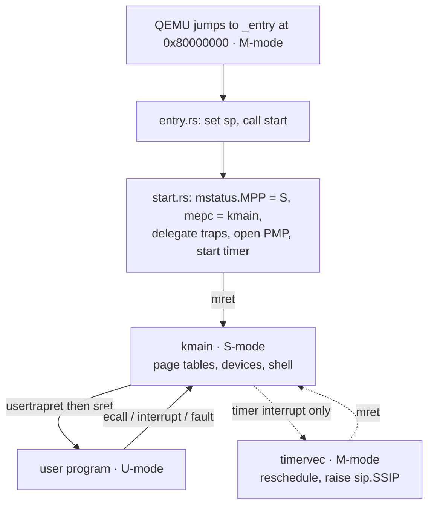

# RISC-V Reference

This is the RV64 lookup page for CS 326. It covers the registers, the calling
convention, the handful of instructions rv6 actually uses, the three privilege
modes, and every control and status register the kernel touches. You will need
it in `a00_asm_bridge` (your first assembly), in `ex05` (context switch), in
`ex13`–`ex15` (traps, interrupts, console), and constantly in `ex18`–`ex22`
(user mode, exec, fork). It is a reference, not a tutorial: open it when you
hit a specific `csrw` or an `scause` value you do not recognise, find the row,
close it again. Every constant and line number below was read out of the
reference kernel in `rv6/src/`, not remembered.

## The machine

| Property | Value |
|---|---|
| Target triple | `riscv64gc-unknown-none-elf` |
| Base ISA | RV64I — 64-bit registers, 64-bit addresses |
| Extensions in `gc` | M (multiply), A (atomics), F/D (float), C (compressed 16-bit encodings), Zicsr, Zifencei |
| Board | QEMU `virt`, `-m 128M`, `-smp 1` (one hart) |
| Firmware | none (`-bios none`) — QEMU jumps straight into your kernel |
| Entry | `0x8000_0000` in machine mode |

The emulator is always `qemu-system-riscv64`. It is *not* `qemu-riscv64`,
which is Linux user-mode emulation, does not exist on macOS, and cannot boot a
kernel. There is also no C cross-toolchain to install: `rust-lld` ships with
rustup and links the whole kernel. See [Dev Setup](dev-setup.md).

Single hart matters more than it sounds. Every "which CPU am I on" problem in
xv6 disappears; `tp` is unused, there is one kernel stack at boot, and the
scheduler is one loop.

## Registers

RV64 has 32 general-purpose registers, `x0`–`x31`, each 64 bits wide. Nobody
writes `x14`; the ABI names are what appear in real code, and they are what the
assembler, the disassembler, and GDB print.

| Register | ABI name | Role | Saved by |
|---|---|---|---|
| `x0` | `zero` | Hardwired 0. Writes are discarded. | — |
| `x1` | `ra` | Return address; `ret` jumps here | Caller |
| `x2` | `sp` | Stack pointer | Callee |
| `x3` | `gp` | Global pointer | — |
| `x4` | `tp` | Thread pointer (unused in rv6) | — |
| `x5`–`x7` | `t0`–`t2` | Temporaries | Caller |
| `x8` | `s0` / `fp` | Saved register / frame pointer | Callee |
| `x9` | `s1` | Saved register | Callee |
| `x10`–`x11` | `a0`–`a1` | Arguments **and** return values | Caller |
| `x12`–`x17` | `a2`–`a7` | Arguments | Caller |
| `x18`–`x27` | `s2`–`s11` | Saved registers | Callee |
| `x28`–`x31` | `t3`–`t6` | Temporaries | Caller |

### The caller/callee split

- **Caller-saved** — `ra`, `t0`–`t6`, `a0`–`a7`. A function you call is free to
  clobber these. If you still need one after a `call`, spill it first.
- **Callee-saved** — `sp`, `s0`–`s11`. A function you call must hand these back
  unchanged. If it wants `s3`, it saves and restores `s3` itself.

This split is not academic; it is why three different structures in rv6 have
three different sizes:

| Structure | What it saves | Why |
|---|---|---|
| `Context` (`swtch.rs:7`) | `ra`, `sp`, `s0`–`s11` — 14 registers, 112 bytes | A context switch happens *inside* a function call, so the caller already spilled anything caller-saved it cared about |
| `kernelvec` frame (`trap.rs:91`) | `ra`, `t0`–`t2`, `a0`–`a7`, `t3`–`t6` — 16 registers, 128 bytes | A trap is not a call. But `kerneltrap` is ordinary Rust, so the compiler preserves the `s` registers for us |
| `Trapframe` (`usermode.rs:34`) | all 31 general-purpose registers plus `epc` and four kernel fields | A user process is resumed later, possibly on a different pass through the scheduler. Nothing may be lost |

If you can explain why `swtch` saves 14 registers and `uservec` saves 31, you
understand the calling convention.

## Calling convention

| Rule | Detail |
|---|---|
| Integer arguments | `a0`, `a1`, `a2`, …, `a7` — first eight, in order |
| Extra arguments | Pushed on the stack (rv6 never needs this) |
| Return value | `a0` (a second one in `a1`, unused here) |
| Return address | `ra`, set by `call`, jumped to by `ret` |
| Stack | Grows **down**; `sp` must be 16-byte aligned at every call |
| System calls | Number in `a7`, arguments in `a0`–`a2`, result back in `a0` |

`extern "C"` on the Rust side means exactly this convention. From
`a00_asm_bridge`:

```rust
extern "C" {
    pub fn add3(a: u64, b: u64, c: u64) -> u64;
}
```

```asm
.globl add3
add3:
    add  a0, a0, a1
    add  a0, a0, a2
    ret
```

Rust cannot check that declaration against the assembly — there is nothing to
check it against. **The signature is a promise.** Get the argument count or the
width wrong and nothing complains; you simply read garbage out of `a2`. This is
why every `extern "C"` call is `unsafe`.

The system-call convention is the same idea one privilege level down. A user
program in `exec.rs` writes to the console like this:

```asm
    la   a1, hello_msg
    li   a2, 21              # length
    li   a0, 1               # fd 1 = console
    li   a7, 16              # SYS_WRITE
    ecall
```

and the kernel picks the pieces back out of the trapframe
(`usermode.rs:402`): `dispatch((*tf).a7, (*tf).a0, (*tf).a1, (*tf).a2)`, with
the result stored back into `(*tf).a0`.

## Instruction quick reference

rv6 uses a small fraction of RV64GC by hand — the compiler emits the rest. This
is the whole hand-written vocabulary.

| Instruction | Meaning |
|---|---|
| `add rd, rs1, rs2` | `rd = rs1 + rs2`, wrapping silently (no overflow trap) |
| `addi rd, rs1, imm` | `rd = rs1 + imm`, `imm` in −2048..2047 |
| `li rd, imm` | Load an immediate constant into `rd` |
| `la rd, sym` | Load the *address* of symbol `sym` |
| `lb rd, off(rs1)` | Load one **b**yte from `rs1 + off`, sign-extended |
| `sb rs2, off(rs1)` | Store the low byte of `rs2` to `rs1 + off` |
| `ld rd, off(rs1)` | Load a 64-bit **d**oubleword |
| `sd rs2, off(rs1)` | Store a 64-bit doubleword |
| `beqz rs, label` | Branch if `rs == 0` |
| `bnez rs, label` | Branch if `rs != 0` |
| `j label` | Unconditional jump |
| `call sym` | Call `sym`, setting `ra` to the following instruction |
| `ret` | Return — jumps to the address in `ra` |
| `csrr rd, csr` | Read a CSR into `rd` |
| `csrw csr, rs` | Write `rs` into a CSR |
| `csrs csr, rs` | Set the bits of `rs` in a CSR (read-modify-write, atomic) |
| `csrrw rd, csr, rs` | Swap: `rd` gets the old value, the CSR gets `rs` |
| `ecall` | Trap into the next privilege level up (system call) |
| `sret` | Return from a supervisor trap: jump to `sepc`, restore the mode in `sstatus.SPP` |
| `mret` | Return from a machine trap: jump to `mepc`, restore the mode in `mstatus.MPP` |
| `wfi` | Wait for interrupt — idle the hart until something arrives |
| `sfence.vma rs1, rs2` | Flush address-translation caches (TLB). `sfence.vma zero, zero` flushes everything |

Several of these are **pseudo-instructions** the assembler expands: `li` becomes
one or two real instructions, `la` becomes `auipc` + `addi`, `ret` is
`jalr zero, 0(ra)`, `beqz rs, L` is `beq rs, zero, L`, `csrr rd, csr` is
`csrrs rd, csr, zero`, and `csrw csr, rs` is `csrrw zero, csr, rs`. Disassembly
in GDB sometimes shows the expansion instead of what you typed — that is not a
bug. See [QEMU and GDB](qemu-gdb.md).

Two more appear in the kernel but not in the list above. `fence.i` (`vm.rs:168`,
`vm.rs:232`) tells the CPU that memory it is about to *execute* was just
*written* — rv6 needs it after copying the trampoline and after loading a user
program image. And `mv rd, rs` is a pseudo-instruction for `addi rd, rs, 0`,
which shows up all over the user programs in `exec.rs`.

### Loads, stores, and offsets

Memory is byte-addressed. The `off(rs1)` form computes `rs1 + off` as the
address, with `off` a signed 12-bit constant baked into the instruction — it
cannot be a register. This is why every save/restore sequence in rv6 looks like
a column of constants:

```asm
    sd ra,   0(sp)
    sd t0,   8(sp)
    sd t1,  16(sp)
```

Those offsets have to match a `#[repr(C)]` struct on the Rust side exactly. The
`Trapframe` in `usermode.rs:34` documents its offsets in comments for precisely
this reason: `a0` lives at 112, `a7` at 168, `epc` at 24. If you add a field in
the middle, every offset in `uservec` and `userret` moves and the kernel breaks
in a way no compiler will warn you about.

## Local numeric labels

Assembly has no scoping, so a label named `loop` can only exist once per
program. Numeric labels solve this: `1:`, `2:`, … can be defined as many times
as you like, and references say which *direction* to look.

- `1b` — the nearest `1:` **b**ackward. Loops.
- `2f` — the nearest `2:` **f**orward. Skipping ahead.

From the `bytecopy` solution in `a00_asm_bridge`:

```asm
bytecopy:
    beqz a2, 2f              # n == 0: nothing to do, skip the loop
1:
    lb   t0, 0(a1)
    sb   t0, 0(a0)
    addi a0, a0, 1
    addi a1, a1, 1
    addi a2, a2, -1
    bnez a2, 1b              # loop while bytes remain
2:
    ret
```

Read `2f` as "forward to the exit" and `1b` as "back to the top". The zero
check comes *first* on purpose: a loop that copies before testing copies one
byte when asked to copy none, which is the classic `memcpy` bug.

You will also see ordinary named labels in rv6 — the user programs in `exec.rs`
use `cat_loop`, `echo_nl`, and so on, because they are long enough that numbers
would be unreadable. Use numeric labels for short local loops and names for
anything you would have to scroll to find.

## Assembly inside Rust

Two macros, both from `core::arch`:

- `global_asm!` emits assembly at module level. Anything you `.globl` becomes a
  real linker symbol, which you then declare in an `extern "C"` block. This is
  how `swtch`, `kernelvec`, `trampoline`, and `timervec` are written.
- `asm!` inlines assembly into a function, with operands. `in(reg) x` hands a
  value to the assembler's choice of register, `out(reg) x` takes one back, and
  `out("t0") _` says "this clobbers `t0`, do not keep anything there".

```rust
let scause: usize;
asm!("csrr {}, scause", out(reg) scause);
asm!("csrs sie, {}", in(reg) 1usize << 1);
```

Use raw strings (`r#"…"#`) for multi-line blocks so the assembler sees
backslashes untouched. Any `asm!` that changes control flow and never comes back
needs `options(noreturn)` — `start.rs:54` ends with `asm!("mret", options(noreturn))`.

More on the Rust side of this in [Unsafe Rust and no_std](rust-unsafe-nostd.md).

## Privilege modes

RISC-V defines three modes. rv6 uses all three, in this order.

| Mode | Who runs there | May do |
|---|---|---|
| **M** (machine) | `entry.rs`, `start.rs`, `timervec` | Everything: all CSRs, all physical memory, physical memory protection, the CLINT timer. The mode QEMU starts in |
| **S** (supervisor) | the rv6 kernel | `s*` CSRs, page tables via `satp`, take delegated traps, execute `sret`, `sfence.vma`, `wfi`. Cannot touch `m*` CSRs |
| **U** (user) | shell commands, `sh`, everything under `ex18`+ | Ordinary instructions only. **No** CSR access at all, no `satp`, no privileged instructions. Its only way to reach the kernel is `ecall` or a fault |

The boot path walks down the ladder and stays there:



Two things about this diagram surprise people. First, after boot the kernel
never returns to machine mode voluntarily — the only M-mode code that runs again
is `timervec`, and only because the CLINT timer is a machine-mode device.
Second, `mret` and `sret` are the *only* ways to move down a level. There is no
"enter user mode" instruction; you set up the return state and return into it.

## Control and status registers

CSRs are a separate 4096-entry address space, reachable only through the `csr*`
instructions. The name prefix says which mode owns it: `m*` is machine-only,
`s*` is readable and writable from supervisor mode and above.

| CSR | Mode | What rv6 uses it for |
|---|---|---|
| `mstatus` | M | `start.rs:27` sets `MPP` (bits 12:11) to `01` so the following `mret` lands in supervisor mode |
| `mepc` | M | `start.rs:34` loads the address of `kmain`; `mret` jumps there |
| `mtvec` | M | `start.rs:71` points it at `timervec`, the machine-mode timer handler |
| `medeleg` | M | `start.rs:40` writes `0xffff` — delegate exception causes 0–15 to supervisor mode, so the kernel handles them directly instead of bouncing through M |
| `mideleg` | M | `start.rs:40` writes `0xffff` — the same for interrupts |
| `mscratch` | M | `start.rs:68` points it at `TIMER_SCRATCH`, a 5-word save area. `timervec` swaps it into `a0` so it has a scratch register without touching anyone's state |
| `mie` | M | `start.rs:74` sets bit 7 (`MTIE`) to enable the machine timer interrupt |
| `mcounteren` | M | `start.rs:47` writes `0xffffffff` so supervisor mode may read the `time` and `cycle` counters |
| `pmpaddr0` | M | `start.rs:43` writes `0x3fffffffffffff` — the top of the region PMP entry 0 covers, i.e. all of physical memory |
| `pmpcfg0` | M | `start.rs:44` writes `0xf` = R \| W \| X \| TOR, granting supervisor mode full access to that region. Without this, S-mode faults on its first load |
| `satp` | S | The page table register: mode + root PPN. Zeroed in M-mode (`start.rs:37`), then set for real by `kvminithart` (`vm.rs:179`), and swapped on every user-mode entry and exit inside the trampoline |
| `stvec` | S | The supervisor trap vector. `trap.rs:35` points it at `kernelvec`; `usertrapret` repoints it at the trampoline's `uservec` (`usermode.rs:445`) before returning to user mode, and `usertrap` puts it back (`usermode.rs:387`) |
| `sepc` | S | Where the trap happened. Read at `trap.rs:51` and `usermode.rs:396`, written to resume elsewhere: `+4` to step over an `ebreak` (`trap.rs:77`) or over an `ecall` (`usermode.rs:401`) |
| `scause` | S | Why the trap happened. Read at `trap.rs:50` and `usermode.rs:390`. See the decode table below |
| `sstatus` | S | Supervisor status. `SIE` (bit 1) is the global interrupt enable (`trap.rs:41`); `SPP` (bit 8) and `SPIE` (bit 5) set up what `sret` returns into (`usermode.rs:455`) |
| `sie` | S | Which supervisor interrupts are enabled: bit 1 `SSIE` for the forwarded timer tick (`trap.rs:40`), bit 9 `SEIE` for device interrupts via the PLIC (`console.rs:63`) |
| `sip` | S | Which supervisor interrupts are pending. `timervec` *sets* bit 1 (`start.rs:100`) to forward a tick; the handler clears it (`trap.rs:63`, `usermode.rs:415`) so it does not refire forever |
| `sscratch` | S | Holds the trapframe address while user code runs. `uservec` starts with `csrrw a0, sscratch, a0` (`usermode.rs:94`) — one instruction that gets a usable register *and* saves the user's `a0` |
| `stval` | S | Set by hardware to the faulting address on a page fault or misaligned access. **rv6 never reads it.** It is still worth knowing about: when a user program dies with `scause` 13 or 15 and you want to know *which* address it touched, `stval` in GDB is the answer |
| `time` | S (read-only) | A free-running counter, 10 MHz on QEMU `virt`. Used by the exercise 22 test harness watchdog (`usermode.rs:232`) and by exercise 14 |

### Bit fields worth memorising

| Field | Location | Meaning |
|---|---|---|
| `mstatus.MPP` | bits 12:11 | Mode `mret` returns to: `00` = U, `01` = S, `11` = M |
| `mie.MTIE` | bit 7 | Machine timer interrupt enable |
| `sstatus.SIE` | bit 1 | Supervisor interrupts globally enabled |
| `sstatus.SPIE` | bit 5 | The `SIE` value to restore on `sret` |
| `sstatus.SPP` | bit 8 | Mode `sret` returns to: `0` = user, `1` = supervisor |
| `sie.SSIE` / `sip.SSIP` | bit 1 | Supervisor **software** interrupt — rv6's timer tick |
| `sie.STIE` / `sip.STIP` | bit 5 | Supervisor timer interrupt — rv6 does not use this |
| `sie.SEIE` / `sip.SEIP` | bit 9 | Supervisor **external** interrupt — the UART, via the PLIC |
| `satp.MODE` | bits 63:60 | `0` = paging off, `8` = Sv39 (`vm.rs:104`: `SATP_SV39 = 8 << 60`) |
| `satp.PPN` | bits 43:0 | Physical page number of the root page table — the address shifted right by 12 (`vm.rs:107`) |

`mstatus` and `sstatus` are the same physical register seen through two windows;
S-mode simply cannot see the machine-only fields. That is why `SIE` and `SPP`
sit at odd-looking bit positions — they are carved out of the machine layout.

An interrupt only fires when three conditions hold at once: its bit is set in
`sie`, its bit is set in `sip`, and `sstatus.SIE` is 1 (or the hart is in user
mode, where supervisor interrupts are always enabled). Forgetting the third is
the single most common "my timer never fires" bug in `ex14`.

## Decoding `scause`

The top bit (bit 63) says which kind of trap it was: `1` = interrupt,
`0` = exception. The remaining bits are the cause code. rv6 tests it exactly
that way (`trap.rs:55`):

```rust
if (scause >> 63) == 1 {
    match scause & 0xff { … }   // an interrupt
} else {
    if scause == 3 { … }        // an exception
}
```

**Interrupts** — bit 63 set:

| Code | Name | rv6 |
|---|---|---|
| 1 | Supervisor software interrupt | **Used.** The timer tick, forwarded from `timervec` |
| 5 | Supervisor timer interrupt | Not used — the CLINT timer is machine-mode only, so rv6 forwards it as cause 1 instead |
| 9 | Supervisor external interrupt | **Used.** A device; `console::intr()` asks the PLIC which one |

**Exceptions** — bit 63 clear:

| Code | Name | rv6 |
|---|---|---|
| 0 | Instruction address misaligned | Fault → process killed |
| 1 | Instruction access fault | Fault → process killed |
| 2 | Illegal instruction | Fault. A user program executing `csrr` lands here |
| 3 | Breakpoint (`ebreak`) | **Used.** Exercise 13 counts these and steps `sepc` past the instruction |
| 4 | Load address misaligned | Fault |
| 5 | Load access fault | Fault |
| 6 | Store/AMO address misaligned | Fault |
| 7 | Store/AMO access fault | Fault |
| 8 | Environment call from U-mode | **Used.** This is a system call: `usermode.rs:399` |
| 9 | Environment call from S-mode | Not used — rv6's kernel never `ecall`s |
| 11 | Environment call from M-mode | Not delegable; never seen in S-mode |
| 12 | Instruction page fault | Fault. A jump into unmapped memory |
| 13 | Load page fault | Fault. The usual result of a bad user pointer |
| 15 | Store/AMO page fault | Fault. Writing to a read-only or unmapped page |

Codes 1 and 9 mean completely different things depending on bit 63 — "supervisor
software interrupt" versus "instruction access fault", "supervisor external
interrupt" versus "ecall from S-mode". If you drop the top-bit test you get a
handler that treats a page fault as a timer tick, and the symptom (a process
that silently spins) looks nothing like the cause. Test the top bit first,
always.

When a user process faults, `usertrap` records the code and kills it
(`usermode.rs:430`), and the run comes back as `RunOutcome::Faulted(scause)`.
The shell prints `run: the program faulted` (`shell.rs:296`); the test harness
prints the raw number. Look it up here.

## What the hardware does on a trap — and what it does not

On a trap to supervisor mode the CPU does exactly four things:

1. writes the cause into `scause`,
2. writes the address of the faulting or trapping instruction into `sepc`,
3. copies `sstatus.SIE` into `SPIE`, clears `SIE`, and records the previous mode
   in `SPP`,
4. jumps to the address in `stvec`.

It does **not** save a single general-purpose register, and it does **not**
switch stacks or page tables. Everything else is software. That is the whole
reason `kernelvec` and `uservec` exist.

```text
  trap from the KERNEL                     trap from USER MODE
  --------------------                     -------------------
  hardware: scause, sepc, -> stvec         hardware: scause, sepc, -> stvec
      |                                        |   (stvec = trampoline uservec)
      v                                        v
  kernelvec  (trap.rs:90)                  uservec  (usermode.rs:93)
    save 16 caller-saved regs to sp          csrrw a0, sscratch, a0
    call kerneltrap                          save all 31 regs into the trapframe
    restore                                  load kernel sp, satp, usertrap addr
    sret  -> resume at sepc                  csrw satp -> kernel page table
                                             jr t0  -> usertrap (usermode.rs:385)
                                                |
                                             handle it (syscall / tick / fault)
                                                |
                                             usertrapret (usermode.rs:440)
                                               stvec = uservec, sstatus.SPP = 0
                                               sepc = saved user pc
                                               jump to userret in the trampoline
                                                |
                                             userret: csrw satp -> user table
                                               restore 31 regs, sret -> user code
```

The asymmetry is real and worth sitting with. A kernel trap can use the current
stack and the current page table, so its handler is fifteen lines. A user trap
cannot use either — the user page table does not map the kernel — so it needs a
page mapped at the same virtual address in *both* address spaces (the
trampoline) to survive the moment when `satp` changes underneath the program
counter. That is what `TRAMPOLINE` at `MAXVA - PGSIZE` is for; see
[Sv39 Paging](sv39-paging.md) and [Memory Map](memory-map.md).

Note the `sfence.vma zero, zero` on both sides of every `csrw satp`
(`usermode.rs:133`, `usermode.rs:140`). Changing `satp` does not by itself
invalidate cached translations; without the fence the CPU may keep using stale
entries from the address space you just left.

## Common failure modes

| Symptom | Likely cause |
|---|---|
| Kernel faults immediately after `mret` | `pmpaddr0`/`pmpcfg0` not set, so S-mode has no access to physical memory |
| Timer never ticks | `sstatus.SIE` never set, or `sie.SSIE` never set, or `mie.MTIE` never set |
| Timer ticks once, then hangs | The handler did not clear `sip.SSIP`, so the same interrupt refires forever |
| `ecall` returns to itself, looping | `sepc` was not advanced by 4 before `sret` |
| A user program reads garbage arguments | Trapframe offsets in `uservec` no longer match the `#[repr(C)]` struct |
| Everything works until paging is on | A missing `sfence.vma`, or a page not mapped in both page tables |
| `illegal instruction` in a user program | User mode touched a CSR — U-mode has no CSR access whatsoever |

## Where the assembly lives in rv6

| File | Assembly in it |
|---|---|
| `entry.rs` | `_entry`: sets `sp`, `call start`. The first instructions QEMU runs |
| `start.rs` | machine-mode CSR setup; `timervec`, the M-mode timer handler |
| `swtch.rs` | `swtch`: the 14-register context switch |
| `trap.rs` | `kernelvec`: save 16 registers, `call kerneltrap`, restore, `sret` |
| `usermode.rs` | `trampoline` / `uservec` / `userret`: the user-kernel border crossing |
| `vm.rs` | `csrw satp`, `sfence.vma`, `fence.i` |
| `console.rs` | `wfi` in the blocking read loop |
| `exec.rs` | the user programs themselves, written in raw RV64 assembly |

Read them in that order at least once. Together they are about 250 lines — the
entire part of rv6 that Rust cannot express, and the part that makes the rest of
the kernel possible.

## See also

- [rv6 Architecture](rv6-architecture.md) — how these pieces fit into the kernel
- [Sv39 Paging](sv39-paging.md) — the `satp` format and page table walks
- [Memory Map](memory-map.md) — physical addresses of RAM, UART, PLIC, CLINT
- [QEMU and GDB](qemu-gdb.md) — reading registers and CSRs from a live kernel
- [Cheatsheet](cheatsheet.md) — the one-page condensed version
