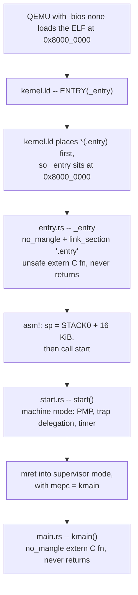

# Unsafe Rust and no_std

This is the page to reread before every Module 2 exercise. Once you cross into
`30k`, the compiler stops being able to prove your code correct: you are
talking to hardware at fixed physical addresses, building page tables out of
raw memory, and handing registers to assembly. Everything on this page is the
vocabulary you need for that — raw pointers, what `unsafe` actually means,
volatile MMIO, `static mut`, `UnsafeCell`, `Send`/`Sync`, `#[repr(C)]`, and the
`no_std` skeleton that makes a Rust binary bootable. Every example is real code
from the rv6 reference kernel, cited by file and by the item it lives in. For the safe-Rust
material that Module 1 covers, see [Rust for Systems](rust-for-systems.md).

## What `unsafe` does

`unsafe` unlocks exactly five operations. That list is the whole feature. It is
not a mode, not a flag, and not an escape hatch from the rest of the language.

| # | Operation | Where you meet it in rv6 |
|---|-----------|--------------------------|
| 1 | Dereference a raw pointer | `(*pte).is_valid()` — `vm.rs` |
| 2 | Call an `unsafe fn` or an `extern` function | `kalloc::kalloc()` — `vm.rs`; `swtch(...)` — `swtch.rs` |
| 3 | Read or write a `static mut` | `FREELIST = r;` — `kalloc.rs` |
| 4 | Implement an `unsafe trait` | `unsafe impl<T: Send> Sync for SpinLock<T>` — `spinlock.rs` |
| 5 | Access a `union` field | (rv6 does not use unions) |

## What `unsafe` does **not** do

This is the part students get wrong, so it gets its own table. Read it twice.

| It does NOT | Consequence |
|-------------|-------------|
| Disable the borrow checker | `cannot borrow as mutable more than once` still fires inside an `unsafe` block. Aliasing rules are unchanged. |
| Disable lifetimes | A reference that outlives its data is still a compile error. |
| Disable type checking | You still need `as` casts; there is no implicit conversion. |
| Turn off bounds checks | `v[i]` still panics on overflow. Use `get_unchecked` (itself `unsafe`) if you truly mean to skip it. |
| Make undefined behavior legal | It makes UB *possible*. The compiler simply stops stopping you. |
| Mean "this code is dangerous" | It means "I have checked the thing the compiler cannot check." |

`unsafe` is a **promise you make to the compiler**, and the compiler believes
you unconditionally. `unsafe fn` and `unsafe {}` are two halves of that
promise:

- `unsafe fn foo()` — *"calling me has a precondition you must satisfy."*
  `vm::walk` (`vm.rs`) is unsafe because it will happily dereference
  whatever you pass as `table`.
- `unsafe { ... }` — *"I have satisfied it."*

rv6 uses edition 2021, where the body of an `unsafe fn` is *implicitly* one big
unsafe block. That is why `kfree` (`kalloc.rs`) dereferences `r` with no
inner `unsafe { }`. Edition 2024 removes that implicit block, so newer code you
read elsewhere will have `unsafe { }` nested inside `unsafe fn`.

## Raw pointers

A raw pointer is an address and nothing else. A reference is an address plus a
set of promises the compiler enforces.

| | `&T` / `&mut T` | `*const T` / `*mut T` |
|---|---|---|
| Guaranteed non-null | yes | no |
| Guaranteed aligned | yes | no |
| Guaranteed to point at a live `T` | yes | no |
| Aliasing enforced | yes (`&mut` is unique) | no |
| Has a lifetime | yes | no |
| Can be created in safe code | yes | **yes** |
| Can be *dereferenced* in safe code | yes | no |

Note the second-to-last row: making a raw pointer is safe, because a number is
harmless. Only dereferencing needs `unsafe`.

### Making one

```rust
let p = 0x1000_0000 as *mut u8;        // from an integer (uart.rs)
let q = pa as *mut Run;                // cast one pointer type to another (kalloc.rs)
let r = slice.as_ptr();                // from a slice (vm.rs)
let s = ptr::addr_of_mut!(PROCS[i]);   // from a place, without a reference (proc.rs)
let n: *mut Run = ptr::null_mut();     // the null pointer (kalloc.rs)
```

`ptr::null_mut()` (and `ptr::null()`) is how you spell "no pointer". It is a
`const fn`, so it works in a `const fn` initializer — which is why
`Proc::new()` can build a whole process control block at compile time
(`proc.rs`). Test with `.is_null()` (`walk()` (`vm.rs`), `kalloc.rs`); rv6's
`kalloc` returns null on out-of-memory rather than `Option`, matching the C
convention that the assembly and the page-table code expect.

### Dereferencing

```rust
let pte = table.add(px(level, va));   // vm.rs — just arithmetic, safe
if (*pte).is_valid() { ... }          // vm.rs — the deref needs unsafe
*pte = Pte::new(page as usize, PTE_V); // vm.rs — so does the write
```

`(*p).field` is the standard spelling; Rust has no `->`. Auto-deref does not
apply to raw pointers, so `p.field` is a compile error and `p.method()` only
works for the inherent pointer methods (`add`, `is_null`, `read`, `write`).

### Pointer arithmetic with `.add()`

```rust
table.add(px(level, va))              // vm.rs
image.as_ptr().add(off)               // vm.rs
src.add(k)                            // vm.rs
```

| Method | Offset units | Signed? | Notes |
|--------|--------------|---------|-------|
| `.add(n)` | elements of `T` | no (forward only) | the one you want 95% of the time |
| `.sub(n)` | elements of `T` | no (backward only) | |
| `.offset(n)` | elements of `T` | yes (`isize`) | |
| `.byte_add(n)` | bytes | no | when `T` isn't `u8` and you mean bytes |
| `.wrapping_add(n)` | elements of `T` | no | no UB on overflow, but the result is nearly useless to deref |

**`.add(n)` scales by `size_of::<T>()`.** `table.add(1)` on a `*mut Pte` moves
8 bytes, not 1. This is the single most common pointer-arithmetic bug in the
paging exercises: `px()` (`vm.rs`) returns an *index* 0..511, and
`table.add(index)` is correct precisely because the scaling happens for you.

The result must stay inside the same allocation (one page, for rv6). Walking
off the end of a page and dereferencing is UB even if the address happens to be
mapped.

## Volatile access and MMIO

A device register is not memory. Reading it can have side effects; its value
can change with no store anywhere in your program. The optimizer does not know
that. Given the ordinary load in a polling loop:

```rust
pub fn putc(c: u8) {
    while !tx_ready() {}          // uart.rs
    unsafe { reg_write(THR, c) }
}
```

LLVM is entitled to reason: *nothing in this loop writes to `LSR`, so its value
cannot change, so hoist the load out and either spin forever or skip the loop
entirely.* Both outcomes are legal and both are catastrophic. The same applies
in reverse to writes: two stores to the same address with no intervening read
look redundant, so one gets deleted.

`read_volatile` and `write_volatile` tell the compiler: this access is
observable, do not remove it, do not duplicate it, do not reorder it past
another volatile access, do not merge it with a neighbor.

```rust
unsafe fn reg_read(off: usize) -> u8 {
    read_volatile((UART0 + off) as *const u8)      // uart.rs
}
unsafe fn reg_write(off: usize, val: u8) {
    write_volatile((UART0 + off) as *mut u8, val); // uart.rs
}
```

Every MMIO touch in rv6 goes through them: the PLIC (`init()` in `plic.rs`), the
SiFive test finisher (`exit_success()` in `testdev.rs`), and the CLINT timer
(`timerinit()` in `start.rs`). **MMIO written without `volatile` is not a subtle bug — it
is a program that means nothing**, because the compiler is free to delete the
entire conversation with the device.

What volatile does **not** give you:

- **Atomicity.** A volatile `u64` write is one instruction on RV64, but that is
  the ISA's doing, not volatile's.
- **Ordering with respect to normal memory.** Volatile accesses are ordered
  against each other, not against ordinary loads and stores.
- **Synchronization between harts.** Use `core::sync::atomic` for that
  (`spinlock.rs`). Volatile is not a substitute for a fence.
- **Permission to be unaligned or null.** Both pointers must still be valid and
  aligned for `T`.

## Bulk memory: `copy_nonoverlapping` and `write_bytes`

| Function | C equivalent | Signature |
|----------|--------------|-----------|
| `ptr::copy_nonoverlapping(src, dst, n)` | `memcpy` | `n` is a count of `T`, **not bytes** |
| `ptr::copy(src, dst, n)` | `memmove` | overlap allowed |
| `ptr::write_bytes(dst, val, n)` | `memset` | `n` is a count of `T` |

```rust
ptr::write_bytes(page, 0, PGSIZE);                     // vm.rs  — zero a fresh page
ptr::copy_nonoverlapping(src as *const u8, tramp, len); // vm.rs — copy the trampoline
ptr::copy_nonoverlapping(image.as_ptr().add(off), page, n); // vm.rs — load a program page
ptr::copy_nonoverlapping(pte.pa() as *const u8, dst, PGSIZE); // vm.rs — fork's page copy
```

Two traps:

1. **The argument order is `(src, dst, count)` — the reverse of C's
   `memcpy(dst, src, n)`.** Getting it backwards compiles cleanly and destroys
   your source data.
2. `_nonoverlapping` is a *precondition you are promising*, not a check. If the
   ranges can overlap, use `ptr::copy`.

Both are `const`-generic over `T` and both require properly aligned, valid
pointers for the full range. `copyout`/`copyin` (`vm.rs`)
split their copies at page boundaries precisely because a user's virtual range
is only contiguous *one page at a time* in physical memory.

## `static mut` and `addr_of!`

A `static mut` is a global with no synchronization and no borrow tracking:

```rust
static mut FREELIST: *mut Run = ptr::null_mut();   // kalloc.rs
static mut PROCS: [Proc; NPROC] = [const { Proc::new() }; NPROC]; // proc.rs
static mut STACK0: [u8; STACK_SIZE] = [0; STACK_SIZE];  // entry.rs
```

Reading or writing one requires `unsafe`, which is rule 3. The subtler problem
is **taking a reference to one**. `&mut FREELIST` produces a `&'static mut`
with a lifetime that outlives every possible checker, and nothing prevents a
second one existing at the same time — two live `&mut` to the same place is
instant UB, and the compiler cannot see it. Modern rustc warns via the
`static_mut_refs` lint (a hard error in edition 2024).

`ptr::addr_of!` and `ptr::addr_of_mut!` give you the **address without ever
materializing a reference**:

```rust
use core::ptr::{addr_of, addr_of_mut};

static mut BUF: [u8; BUF_LEN] = [0; BUF_LEN];   // console.rs
static mut TAIL: usize = 0;                     // console.rs

let tail = *addr_of!(TAIL);                     // console.rs — read
*addr_of_mut!(BUF[tail % BUF_LEN]) = b;         // console.rs — write one element
*addr_of_mut!(TAIL) = tail.wrapping_add(1);     // console.rs
```

The macro expands to a raw pointer to the place. You dereference it once,
immediately, and never keep it around. `proc_at` (`proc.rs`) exists for
exactly this reason — it hands other modules a `*mut Proc` into the process
table so nobody is tempted to write `&mut PROCS[i]`. When a reference really is
needed, the code goes through a raw pointer deliberately:

```rust
let store = &mut *core::ptr::addr_of_mut!(ARGV_STORE);   // syscall.rs
```

That still creates a `&mut`; the difference is that it is written where a human
can see and audit the uniqueness claim.

Rust 1.82 stabilized `&raw const PLACE` and `&raw mut PLACE` as native syntax
for the same thing. `addr_of!`/`addr_of_mut!` remain and are what rv6 uses;
treat the two spellings as synonyms when you read other kernels.

Note that `static mut` scalars can also be touched directly — `FREELIST = r;`
at `kfree()` (`kalloc.rs`) is a place assignment, not a reference — but routing
*everything* through `addr_of!` costs nothing and removes the need to reason
about which expressions autoref.

## `UnsafeCell`

Rust's core aliasing rule is: if you hold a `&T`, the `T` will not change
underneath you. `UnsafeCell<T>` is the one and only compiler-recognized opt-out.
It is the primitive under `Cell`, `RefCell`, `Mutex`, and the atomics — nothing
else can legally mutate through a shared reference.

```rust
pub struct SpinLock<T> {
    locked: AtomicBool,
    data: UnsafeCell<T>,        // spinlock.rs
}
```

`UnsafeCell::get(&self) -> *mut T` is a *safe* call that hands out a `*mut T`
from a `&self`. Using the result is where the promise lives:

```rust
fn deref(&self) -> &T { unsafe { &*self.lock.data.get() } }          // spinlock.rs
fn deref_mut(&mut self) -> &mut T { unsafe { &mut *self.lock.data.get() } } // spinlock.rs
```

The unsafe claim here is *"the `AtomicBool` guarantees only one guard exists at
a time."* That claim is what makes `SpinLock` a sound safe abstraction: callers
of `FS.lock()` (`fs.rs`) write ordinary safe Rust.

## `Send` and `Sync`

Two marker traits, automatically derived, that describe thread behavior:

| Trait | Meaning | Auto-derived when |
|-------|---------|-------------------|
| `Send` | the value may be **moved** to another thread | every field is `Send` |
| `Sync` | `&T` may be **shared** with another thread (equivalently, `&T: Send`) | every field is `Sync` |

Raw pointers are neither. Any struct containing a `*mut T` therefore loses
both, which is why `Proc` (`proc.rs`, holding `*mut Pte` and `*mut
Trapframe`) is not `Send`. A `static` must be `Sync` — that rule is what stops
you from writing `static X: RefCell<u32>` and racing on it.

`SpinLock` restores it with an explicit claim:

```rust
unsafe impl<T: Send> Sync for SpinLock<T> {}   // spinlock.rs
```

Read it as: *"a `&SpinLock<T>` is safe to share across threads, because the
lock serializes every access."* The `T: Send` bound is not decoration — the
lock hands a `&mut T` to whichever thread wins, so `T` must be legal to move
there.

rv6 runs single-hart (`-smp 1`), so there is no true parallelism. `Sync` is
still required by the type system, and interrupts are a real form of
concurrency: `console::push` (`console.rs`) runs from the trap handler and
`try_getc` (`console.rs`) runs from the kernel's main flow. The separate
head/tail design is what makes that lock-free pair safe on one CPU — see the
comment at `console.rs`.

## `#[repr(C)]` and `#[repr(transparent)]`

Rust's default layout (`repr(Rust)`) is **deliberately unspecified**. The
compiler reorders fields, usually sorting by alignment to minimize padding, and
it is allowed to change that between compilations. Assembly does not negotiate:

```asm
sd ra,  0(a0)     # swtch.rs
sd sp,  8(a0)
sd s0,  16(a0)
```

`swtch` hard-codes offset 0 for `ra`, 8 for `sp`, 16 for `s0`. If the compiler
reordered `Context`, the context switch would restore garbage into `sp` and the
kernel would jump into nowhere. `#[repr(C)]` (`swtch.rs`) pins the layout to
C's rules: fields in declaration order, each at its natural alignment, padding
inserted only as needed.

| Struct | Attribute | Why |
|--------|-----------|-----|
| `Context` (`swtch.rs`) | `#[repr(C)]` | `swtch`'s `sd`/`ld` offsets 0–104 |
| `Trapframe` (`usermode.rs`) | `#[repr(C)]` | the trampoline's offsets 0–280, listed in the field comments |
| `Run` (`kalloc.rs`) | `#[repr(C)]` | overlaid on a free physical page by a cast |
| `Pte` (`vm.rs`) | `#[repr(transparent)]` | must be *exactly* a `usize`, so `*mut Pte` can point at real page-table memory |

`#[repr(transparent)]` is the stronger, narrower guarantee: a single-field
struct with the identical size, alignment, and ABI as that field. It buys you
the newtype (`Pte::pa()`, `Pte::flags()`) with zero layout risk.

Rule of thumb: **if assembly, hardware, or another language will read the
bytes, it needs `#[repr(C)]`.**

## `core`, `alloc`, and `std`

| Crate | Requires | Gives you | In rv6 |
|-------|----------|-----------|--------|
| `core` | nothing | `Option`, `Result`, slices, `str`, iterators, `ptr`, `mem`, `cell`, `sync::atomic`, `arch::asm`, `fmt` traits | always available |
| `alloc` | a `#[global_allocator]` | `Box`, `Vec`, `String`, `Rc`, `Arc`, `BTreeMap`, `format!` | after `kheap.rs` |
| `std` | an operating system | everything above plus `std::io`, `std::fs`, `std::thread`, `HashMap`, `println!` | never — you *are* the OS |

Almost everything you learned in Module 1 lives in `core`. `Option` is
`core::option::Option`; `std` merely re-exports it. What you genuinely lose is
anything needing an OS: files, threads, time, `println!`, and `HashMap` (it
needs OS entropy for its hash seed; `BTreeMap` in `alloc` does not).

`alloc` is not in the prelude, so it must be named explicitly:

```rust
extern crate alloc;      // main.rs
```

That line only works because `kheap.rs` registers an allocator:

```rust
unsafe impl GlobalAlloc for KernelHeap { ... }   // kheap.rs
#[global_allocator]
static ALLOCATOR: KernelHeap = KernelHeap;       // kheap.rs
```

`GlobalAlloc` is an unsafe trait (rule 4) because the whole language trusts it
to return correctly aligned, non-overlapping, live memory. rv6's version
answers every request with one whole 4 KiB page from `kalloc` — wasteful, but
real.

## The `no_std` skeleton

```rust
#![no_std]      // main.rs
#![no_main]     // main.rs
```

| Item | What it does | Without it |
|------|--------------|------------|
| `#![no_std]` | don't link `std`; the prelude becomes `core`'s | `error: can't find crate for std` on a bare-metal target |
| `#![no_main]` | no Rust `main` shim, no C runtime startup | rustc emits a `main` that calls into libc, which does not exist |
| `#[panic_handler]` | your `fn(&PanicInfo) -> !` | `error: #[panic_handler] function required, but not found` |
| `panic = "abort"` (Cargo.toml) | no unwinder | `language item required, but not found: eh_personality` |
| `#[no_mangle]` | keep the symbol name verbatim | assembly and the linker cannot find `kmain`, `_entry`, `start` |
| `extern "C"` | the RISC-V C ABI (args in `a0`–`a7`, return in `a0`, `s0`–`s11` callee-saved) | Rust's ABI is unspecified; assembly cannot call it |

The panic handler is a hard requirement — every `Option::unwrap` and array
index needs somewhere to land. rv6's reports the failure and powers off:

```rust
#[panic_handler]                              // main.rs
fn panic(_info: &PanicInfo) -> ! {
    uart::puts("OSLINGS:FAIL (panic)\n");
    testdev::exit_failure(1);
}
```

Exactly one per binary. It cannot return, and it cannot itself panic.

### How control actually reaches your Rust



Every attribute in that chain is load-bearing. Drop `#[no_mangle]` from
`_entry` and the linker script's `ENTRY(_entry)` finds nothing. Drop
`#[link_section = ".entry"]` and `_entry` lands somewhere in the middle of
`.text` instead of at the reset address. See [rv6 Architecture](rv6-architecture.md)
for the rest of the boot path.

## `extern "C"` blocks

An `extern "C" { ... }` block *declares* something defined elsewhere — assembly,
or the linker itself. Nothing is generated; you are telling rustc a name exists
and promising the signature is right. Calls into it are unsafe (rule 2).

**Functions defined in `global_asm!`:**

```rust
extern "C" {
    pub fn swtch(old: *mut Context, new: *mut Context);   // swtch.rs
}
extern "C" {
    fn trampoline();     // usermode.rs
    fn uservec();
    fn userret();
    fn trampoline_end();
}
```

`trampoline` and `trampoline_end` are never *called* — they are declared as
functions purely so their addresses can be taken, which is how `kvmmake`
measures the trampoline's length (`vm.rs`) before copying it to its own
page.

**Symbols defined by the linker script:**

```rust
extern "C" {
    static end: u8;              // kalloc.rs, from PROVIDE(end = .) at kernel.ld
}
let start = &end as *const u8 as usize;   // kalloc.rs
```

For a linker symbol, **the address is the value**. `end` has no meaningful
contents; `&end as *const u8 as usize` is the whole point, and it tells `kalloc`
where the kernel image stops and free RAM begins.

## `asm!` and `global_asm!`

| | `asm!` | `global_asm!` |
|---|---|---|
| Where | inside a function body | module level |
| Operands | `in(reg)`, `out(reg)`, `inout`, `sym`, `const` | `sym` and `const` only |
| Register allocation | rustc picks and tracks registers | you own every register |
| Use for | one or two instructions, CSR access | whole routines with their own labels |

```rust
asm!("csrw satp, {}", in(reg) satp);          // vm.rs
asm!("sfence.vma zero, zero");                // vm.rs
asm!("fence.i");                              // vm.rs, 232
asm!("csrs sie, {}", in(reg) 1usize << 9);    // console.rs
asm!("li t0, 0xf", "csrw pmpcfg0, t0", out("t0") _);  // start.rs
```

Two idioms worth memorizing:

- `out("t0") _` (`start.rs, 40, 43, 44, 47`) declares "this instruction
  destroys `t0`" without wanting the value. Omit it and rustc may be keeping
  something live there.
- `options(noreturn)` (`_entry()` (`entry.rs`), `start.rs`) promises control never
  comes back — required when the asm ends in `mret`, `j`, or a `call` that
  never returns.

`global_asm!` assembles a whole file's worth of text into the crate. rv6 uses
it for `swtch` (`swtch.rs`), the user/kernel trampoline (`usermode.rs`),
the machine-mode timer vector `timervec` (`start.rs`), and even the embedded
user programs (`exec.rs`, whose `prog_*_start`/`prog_*_end` labels are read
back through `extern "C"` statics at `exec.rs`). Inside it you write real
assembler directives — `.globl`, `.align 4`, `.asciz` — because it *is* an
assembly file.

Escaping matters: use a raw string (`r#"..."#`) so `\n` and `{}` survive.
Braces are format placeholders in `asm!`, so a literal brace must be doubled.

## Symptoms and their causes

| Symptom | Cause |
|---------|-------|
| `error[E0133]: ... requires unsafe function or block` | one of the five operations, outside `unsafe` |
| `cannot borrow ... as mutable more than once` inside `unsafe` | `unsafe` never turns off the borrow checker |
| `warning: creating a shared reference to mutable static` | `&STATIC` — use `addr_of!`/`addr_of_mut!` |
| `error: can't find crate for 'std'` | missing `#![no_std]`, or building for the host by mistake |
| `#[panic_handler] function required, but not found` | no panic handler in the crate graph |
| `language item required, but not found: eh_personality` | missing `panic = "abort"` in the profile |
| `memory allocation of N bytes failed` at boot | `alloc` used before `kalloc::init()`, or a request larger than a page (`kheap.rs`) |
| Kernel hangs in a polling loop that "obviously" terminates | a non-volatile MMIO read hoisted out of the loop |
| Registers restored as garbage after a context switch | struct missing `#[repr(C)]` |
| `*mut T cannot be shared between threads safely` | a `static` whose type is not `Sync` |
| Store fault at a plausible-looking address | `.add()` scaled by the wrong element type |

To inspect any of these on a live kernel, see [QEMU and GDB](qemu-gdb.md).

## Before you write `unsafe`

1. Name the promise. If you cannot say in one sentence what the compiler is
   trusting you about, you do not yet know whether it is true.
2. Make the block as small as the operation. An `unsafe` block around fifty
   lines hides which line is the risky one.
3. Prefer `addr_of!` over `&` for statics, and `*mut T` over `&mut T` when the
   uniqueness claim is not genuinely provable.
4. If it touches a device, it is `read_volatile`/`write_volatile`. No
   exceptions.
5. If assembly or hardware will read the bytes, it is `#[repr(C)]`.
