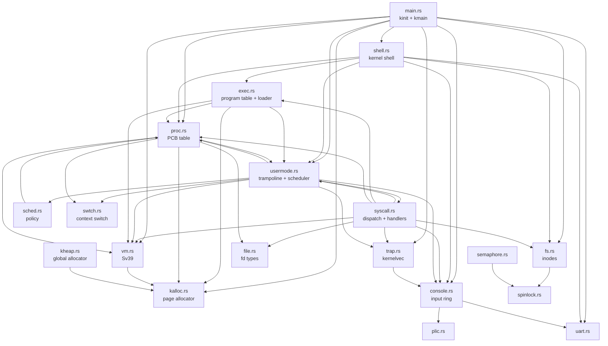
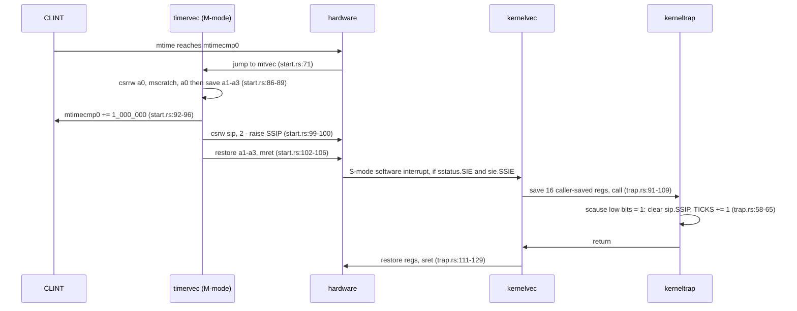
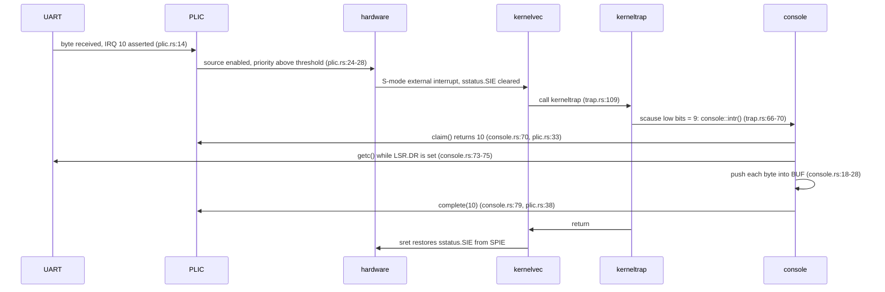
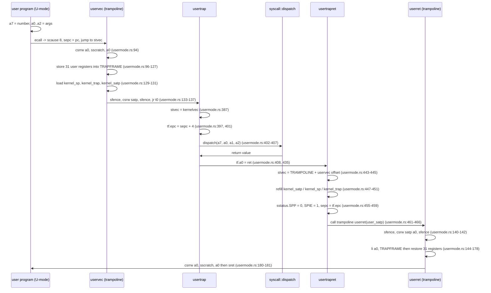

# The rv6 Kernel Architecture

This is the map of the reference kernel you are handed from `46k_shell` on:
twenty-four source files, about 4,400 lines. Nineteen of them you already
built in `30k`–`45k`; the other five — `shell.rs`, `syscall.rs`,
`usermode.rs`, `exec.rs`, `file.rs` — are the ones `46k`–`52k` fill in. Open
this page when you need to know *which file owns a thing*: who allocates a
page, where a trap lands, what runs before what at boot, which lock protects
the filesystem. Then go read that file.

Every constant and line number below was read out of the finished `52k`
reference kernel (`exercises/52k_userland/solution/`, in your tree once `53k`
is released), which is what `oslings` stages into `rv6/src` for the last
exercises. The kernel is cumulative, so an
earlier exercise has a shorter version of the same file and your line numbers
will be smaller than the ones cited here — the structure is identical.

## Every file in the kernel

| File | What it owns | Introduced | Grown in |
|---|---|---|---|
| `main.rs` | `kmain`, the boot order in `kinit` (`main.rs:87`), the panic handler (`main.rs:282`), the module list | `30k` | `42k` (real boot), every exercise after |
| `entry.rs` | `_entry` — the first instruction QEMU executes, the 16 KiB boot stack `STACK0` (`entry.rs:14`) | `31k` | `43k` (calls `start` instead of `kmain`) |
| `start.rs` | Machine-mode setup: drop to S-mode via `mret`, delegate traps, open PMP, and the CLINT timer plus `timervec` (`start.rs:84`) | `43k` | `44k` (the timer, 45 → 108 lines) |
| `trap.rs` | S-mode trap vector `kernelvec` (`trap.rs:90`), `kerneltrap` (`trap.rs:46`), `stvec` setup, `intr_on` | `43k` | `44k` (timer ticks), `45k` (external interrupts) |
| `usermode.rs` | The trampoline (`uservec`/`userret`), the `Trapframe` layout, `usertrap`/`usertrapret`, the scheduler loop, `proc_yield`, `exit_current` | `48k` | `51k` (scheduler replaces one-process `run`) |
| `syscall.rs` | Syscall numbers, `dispatch` (`syscall.rs:33`), and every handler: fork, exit, wait, exec, getpid, read, write, open, close | `48k` | `50k` (fds), `51k` (fork/wait), `52k` (exec) |
| `exec.rs` | The program table (12 hand-written user binaries), the loader `build_addrspace`, `push_argv`, and `exec_into` | `49k` | `51k`, `52k` (`sh`, `exec` as a syscall; 345 → 843 lines) |
| `vm.rs` | Sv39: PTE flags, `walk`, `mappages`, the kernel page table `kvmmake`, user loading/teardown, `copyin`/`copyout`/`copyinstr`, `uvmcopy` | `33k` | `39k`, `48k`, `49k`, `51k` (90 → 419 lines) |
| `kalloc.rs` | The physical page allocator: one free list of 4 KiB pages from `end` to `PHYSTOP` | `32k` | — |
| `kheap.rs` | `#[global_allocator]` — one page per allocation, so `Box`/`Vec`/`Arc` work | `38k` | — |
| `proc.rs` | `Proc` (the PCB), the fixed `PROCS` table, `allocproc`, `freeproc`, `proc_pagetable`, `has_children` | `34k` | `48k`, `50k` (`ofile`), `51k` (`parent`, `xstate`) |
| `sched.rs` | The scheduling *policy* only: the `Scheduler` trait and `RoundRobin::pick_next` (`sched.rs:20`) | `36k` | — |
| `swtch.rs` | `Context` (14 callee-saved registers) and the `swtch` assembly that swaps them | `35k` | — |
| `spinlock.rs` | `SpinLock<T>` + RAII `SpinLockGuard`, built on `AtomicBool::compare_exchange` | `37k` | — |
| `semaphore.rs` | A counting semaphore over a `SpinLock<i64>` | `38k` | — |
| `fs.rs` | The in-memory filesystem: 64 inodes, 16 directory entries each, 128 bytes per file, and the global `FS` lock (`fs.rs:277`) | `40k` | `47k` (`unlink`, `for_each_entry`), `50k` (`read_at`/`write_at`/`truncate`) |
| `file.rs` | The open-file abstraction: `File`, `FileKind`, `NOFILE = 16`, and the `O_*` flags | `50k` | — |
| `shell.rs` | The **kernel** shell (`rv6$`): `pwd`, `ls`, `cd`, `mkdir`, `touch`, `cat`, `rm`, `rmdir`, `echo`, `run`, `progs` | `46k` | `47k` (file commands), `49k` (`run`, `progs`) |
| `console.rs` | Interrupt-driven input: a 256-byte ring buffer, the blocking `getc` (`console.rs:47`), and `intr` (`console.rs:68`) | `45k` | — |
| `uart.rs` | The polled NS16550A driver: register offsets, `putc`, `getc`, `puts`, `enable_rx_interrupt` | `31k` | `41k` (full driver, 33 → 65 lines) |
| `plic.rs` | The interrupt controller: enable a source, set the threshold, `claim`, `complete` | `45k` | — |
| `testdev.rs` | The SiFive test finisher at `0x10_0000` — how the kernel powers QEMU off with a pass/fail status | `31k` | — |
| `memlayout.rs` | Every address constant: `PGSIZE`, `KERNBASE`, `PHYSTOP`, `UART0`, `PLIC`, `MAXVA`, `TRAMPOLINE`, `TRAPFRAME`, `USER_STACK` | `32k` | `45k` (PLIC), `48k`–`49k` (user layout, 19 → 75 lines) |
| `param.rs` | `NPROC = 64`. That is the entire file | `34k` | — |

Three files are pure assembly wearing a Rust coat: `entry.rs`, `swtch.rs`, and
the `global_asm!` blocks in `start.rs`, `trap.rs`, `usermode.rs`, and `exec.rs`.
See [RISC-V](riscv.md) for what each of those blocks does instruction by
instruction.

## How the modules depend on each other



`memlayout.rs`, `param.rs`, and `testdev.rs` are left out of the diagram: they
are leaves that half the kernel reads and nothing depends on in an interesting
way.

Two cycles in that graph are real, and neither is a mistake — Rust modules
inside one crate may refer to each other freely:

- **`proc.rs` ↔ `usermode.rs`.** `Proc` holds a `*mut Trapframe`, and
  `Trapframe` is defined in `usermode.rs:34`; meanwhile the scheduler in
  `usermode.rs:285-288` walks `proc::proc_at(i)`. The type lives next to the
  assembly that fills it in, which is the right place for it.
- **`syscall.rs` ↔ `usermode.rs`.** `usertrap` calls `syscall::dispatch`
  (`usermode.rs:402`); every handler calls `usermode::curproc()` to find out who
  is asking (`syscall.rs:94`, `syscall.rs:142`, `syscall.rs:470`).

The one-way edges matter more than the cycles. `vm.rs` depends on `kalloc.rs`
and never the other way round: page tables are built out of physical pages, and
the physical allocator knows nothing about paging. `sched.rs` depends only on
`proc::ProcState` — the policy sees an array of states and returns an index
(`sched.rs:20`), which is exactly why the round-robin you wrote for `36k` on
the host still compiles into the kernel unchanged.

## The boot sequence

Every step below is forced into its position by something. That is what makes
boot order the hardest part of `42k`: there is essentially one correct
sequence, and most wrong ones fail silently.

1. **QEMU jumps to `_entry` at `0x8000_0000`, in machine mode.**
   *Constraint:* with `-bios none` there is no firmware, so the first
   instruction of the ELF must sit at the RAM base. `kernel.ld` does this by
   putting `*(.entry)` first in `.text` and naming `_entry` as `ENTRY`;
   `entry.rs:17` marks `_entry` with `#[link_section = ".entry"]`.

2. **`_entry` sets `sp` to the top of `STACK0` (`entry.rs:19-23`).**
   *Constraint:* the very next instruction is `call start`, and no Rust function
   can run without a stack. `STACK0` is `4096 * 4` = 16 KiB (`entry.rs:11`).
   This is the kernel's only stack until processes exist.

3. **`start` sets `mstatus.MPP = 01` (supervisor) (`start.rs:28-31`).**
   *Constraint:* `mret` reads `MPP` to decide which mode to return to. Leave it
   at its reset value and `mret` puts you back in machine mode, where `satp` is
   ignored and paging silently does nothing.

4. **`mepc` ← `kmain` (`start.rs:34`), `satp` ← 0 (`start.rs:37`).**
   *Constraint:* `mret` jumps to `mepc`. Paging must be off at this point
   because no page table exists yet; `kmain` turns the MMU on later, from inside
   supervisor mode.

5. **Delegate traps: `medeleg` and `mideleg` ← `0xffff` (`start.rs:40`).**
   *Constraint:* this must happen before any trap can occur. Undelegated traps
   vector to `mtvec` in machine mode — which, two steps later, points at
   `timervec`, a handler that expects a timer interrupt and nothing else.

6. **Open physical memory to S-mode: `pmpaddr0` ← `0x3fffffffffffff`,
   `pmpcfg0` ← `0xf` (`start.rs:43-44`).**
   *Constraint:* before `mret`. Physical memory protection defaults to
   "supervisor mode gets nothing", so without this the kernel's first load after
   `mret` is an access fault, before it can print anything to say so.

7. **`mcounteren` ← `0xffffffff` (`start.rs:47`).**
   *Constraint:* before S-mode reads the `time` CSR — which `44k` does directly
   and the `52k` harness watchdog does at `usermode.rs:232`.

8. **`timerinit` (`start.rs:59-75`): read `mtime`, set `mtimecmp0` one interval
   ahead, fill `TIMER_SCRATCH`, point `mtvec` at `timervec`, set `mie.MTIE`.**
   *Constraint:* strictly in that order. `timervec` dereferences `mscratch`
   (`start.rs:86`), so the scratch area must be populated first; `mtvec` must be
   valid before `MTIE` is set, or the first tick vectors into whatever `mtvec`
   held at reset. The interval is `1_000_000` ticks of the 10 MHz counter —
   roughly 0.1 s (`start.rs:19`).

9. **`mret` (`start.rs:54`) → `kmain`, now in supervisor mode.**
   *Constraint:* this is the only way down a privilege level. There is no
   "enter supervisor mode" instruction.

10. **`uart::init()` (`main.rs:88`).**
    *Constraint:* first in `kinit`, because everything after it may want to
    print, including the panic handler (`main.rs:282`). It needs nothing itself:
    paging is off, so the MMIO registers at `UART0` are reachable directly.

11. **`kalloc::init()` (`main.rs:89` → `kalloc.rs:21`).**
    *Constraint:* before anything allocates. It frees every page from the linker
    symbol `end` up to `PHYSTOP` (`kalloc.rs:22-23`); `end` is defined by
    `PROVIDE(end = .)` at the bottom of `kernel.ld`, which is what keeps the
    allocator from handing out pages that hold the kernel image.

12. **`vm::kvminithart(vm::kvmmake())` (`main.rs:90`).**
    *Constraint:* after the allocator, because `kvmmake` calls `kalloc` for the
    root table and every level below it (`vm.rs:126`, `vm.rs:62`). `kvmmake`
    must map the kernel identity — `KERNBASE..PHYSTOP` at `vm.rs:141-151` —
    before `kvminithart` writes `satp` (`vm.rs:179`), because the instruction
    *after* that `csrw` is fetched through the new page table. Same reason the
    UART page is mapped (`vm.rs:132`): otherwise the kernel goes mute the
    instant paging comes on.

13. **`proc::init()` (`main.rs:91` → `proc.rs:74`).**
    *Constraint:* before the first `allocproc`. It only clears the `PROCS` array
    and resets `NEXTPID`, so it is cheap, but a stale `state` in one slot means
    that slot is never handed out again.

14. **`trap::init()` (`main.rs:92` → `trap.rs:33`).**
    *Constraint:* `stvec` must hold a valid *virtual* address, so this belongs
    after paging is on; and it must be done before interrupts are enabled, which
    is why it comes before the console.

15. **`fs::FS.lock().init()` (`main.rs:93` → `fs.rs:79`).**
    *Constraint:* before any path is resolved. It marks inode 1 (`ROOT`) as a
    directory; without it, `dirlookup` on the root returns `NotADirectory` and
    every file command fails identically.

16. **Print the banner (`main.rs:102-104`).** From here the two build modes
    diverge: with `--features harness`, `kmain` runs a self-check and calls
    `testdev::exit_success()` (`main.rs:106-114`); without it, the interactive
    kernel boots.

17. **`console::init()` (`main.rs:119` → `console.rs:58`): re-init the UART,
    enable its receive interrupt, configure the PLIC, set `sie.SEIE`.**
    *Constraint:* after `kvmmake`, because `plic::init` writes MMIO at
    `PLIC + 0x2080` and `PLIC + 0x20_1000` (`plic.rs:17-28`) and the PLIC's
    4 MiB window is only mapped at `vm.rs:138`. Also after `trap::init`, or the
    first keystroke traps through an uninitialized `stvec`.

18. **`trap::intr_on()` (`main.rs:120` → `trap.rs:39-42`): `sie.SSIE`, then
    `sstatus.SIE`.**
    *Constraint:* dead last. Enabling interrupts is a promise that a handler and
    a vector exist; every earlier step is part of keeping that promise.

19. **`shell::run()` (`main.rs:123` → `shell.rs:343`) — the read-eval-print loop
    that never returns.**

## Address spaces

rv6 runs two kinds of page table: one kernel table, built once by `kvmmake`, and
one table per process. Both are Sv39, both map the trampoline at the same
virtual address, and that overlap is the whole trick behind entering and leaving
user mode. See [Sv39 Paging](sv39-paging.md) for the walk itself and
[Memory Map](memory-map.md) for the physical side.

### The kernel address space (`vm.rs:125-175`)

```text
 virtual = physical, except for the trampoline

 0x3F_FFFF_F000  TRAMPOLINE ──────────────┐  R X      one page, a COPY of the
                 (MAXVA - PGSIZE)         │           trampoline code
        ...      unmapped                 │
 0x8800_0000     PHYSTOP ─────────────────┤
                 all of RAM               │  R W X    identity mapped:
                 (kernel image, page      │           128 MiB, KERNBASE..PHYSTOP
                  tables, kstacks,        │
                  trapframes, user pages) │
 0x8000_0000     KERNBASE ────────────────┤
        ...      unmapped                 │
 0x1000_0000     UART0 ───────────────────┤  R W      one page of MMIO
        ...      unmapped                 │
 0x0C40_0000     PLIC end ────────────────┤
 0x0C00_0000     PLIC ────────────────────┤  R W      4 MiB (PLIC_SIZE)
        ...      unmapped                 │
 0x0010_0000     TEST_FINISHER ───────────┘  R W      one page of MMIO
```

Four things about this map are worth knowing before you debug with it:

- **RAM is mapped `R|W|X` in one shot** (`vm.rs:141-151`). The kernel's own text
  is writable and its data is executable. A production kernel would map `.text`
  read-execute and the rest read-write; rv6 does not, and that is a real (if
  deliberate) weakness rather than a subtlety.
- **The CLINT is not mapped at all.** The timer registers at `0x0200_0000`
  (`start.rs:17-18`) are touched only by `start` and by `timervec`, both of
  which run in machine mode, where address translation is off entirely.
- **Kernel stacks and trapframes live inside the identity map.** `allocproc`
  gets them from `kalloc` (`proc.rs:117-118`), so the kernel reaches them by
  raw pointer with no extra mapping. There is no guard page below a kernel
  stack: overflowing one 4 KiB page silently corrupts the page beneath it. That
  is exactly why the exec argument scratch buffer is a `static` and not a local
  (`syscall.rs:191-200`).
- **The trampoline is a copy.** `kvmmake` allocates a fresh page, copies the
  bytes between `trampoline` and `trampoline_end` onto it, runs `fence.i`, and
  maps *that page* at `TRAMPOLINE` (`vm.rs:158-172`). The physical address is
  remembered in `TRAMP_PAGE` so every user page table can map the identical page
  (`vm.rs:121`, `proc.rs:164`).

### A user address space (`memlayout.rs:29-75`, `exec.rs:671-687`)

```text
 0x3F_FFFF_F000  TRAMPOLINE   uservec / userret     R X     (no U bit)
 0x3F_FFFF_E000  TRAPFRAME    this proc's 288-byte  R W     (no U bit)
                              register save area
        ...      unmapped  (a very large hole)
 0x0001_1000     USER_STACK_TOP  <- initial sp
 0x0001_0000     USER_STACK   one stack page        R W U
        ...      unmapped  (guard gap, up to 15 pages wide)
 0x0000_0000     USER_CODE    the program image,    R X U
                              1..16 pages
```

| Constant | Value | Defined at |
|---|---|---|
| `PGSIZE` | 4096 | `memlayout.rs:7` |
| `MAXVA` | `1 << 38` = `0x40_0000_0000` | `memlayout.rs:49` |
| `TRAMPOLINE` | `MAXVA - PGSIZE` = `0x3F_FFFF_F000` | `memlayout.rs:53` |
| `TRAPFRAME` | `TRAMPOLINE - PGSIZE` = `0x3F_FFFF_E000` | `memlayout.rs:57` |
| `USER_CODE` | `0x0` | `memlayout.rs:61` |
| `MAX_PROG_PAGES` | 16 | `memlayout.rs:65` |
| `USER_STACK` | `16 * PGSIZE` = `0x1_0000` | `memlayout.rs:72` |
| `USER_STACK_TOP` | `0x1_1000` | `memlayout.rs:75` |

The stack sits at a *fixed* address above the largest image rv6 will load, so a
small program leaves an unmapped gap between its last code page and its stack.
That gap is deliberate: running off the end of your data hits a page fault the
kernel turns into a clean `Faulted` (`usermode.rs:428-433`) instead of quietly
scribbling on your own stack.

The trampoline and trapframe pages carry no `PTE_U` bit, and that single bit is
the entire protection story. User mode cannot read them; `walkaddr` refuses to translate
any address whose PTE lacks `PTE_U` (`vm.rs:257`), so a user program cannot get
at them indirectly by passing the kernel a clever pointer either. Every
`copyin`/`copyout`/`copyinstr` goes through `walkaddr`, so that one check
(`vm.rs:252-261`) is where "the kernel does not trust user pointers" actually
lives.

## The three trap paths

Every entry into the kernel is one of these three. Learn to tell them apart by
`scause`: bit 63 set means interrupt, and then the low bits say which; bit 63
clear means exception, and `8` means `ecall` from user mode.

### Path 1: the machine-mode timer interrupt

The timer is a machine-mode device, so its interrupt cannot be delegated to the
kernel directly. `timervec` catches it in M-mode, rearms it, and *forwards* it
to S-mode as a software interrupt — a hop that exists purely because the CLINT
speaks only machine mode.



Two failure modes fall straight out of the diagram. If the handler does not
clear `sip.SSIP` (`trap.rs:62-63`), the interrupt is still pending the moment
`sret` re-enables interrupts and the kernel loops in the handler forever. And if
the tick arrives while a *user* process is running, it does not reach
`kerneltrap` at all: `stvec` points at `uservec` then, so the same forwarded
interrupt is handled by the identical code at `usermode.rs:409-424`.

### Path 2: an S-mode device interrupt



The reader is on the other side of a lock-free ring buffer. `console::getc`
(`console.rs:47-54`) spins on `try_getc`, and when the buffer is empty it
executes `wfi` — the only place the kernel ever sleeps. `BUF`, `HEAD`, and
`TAIL` (`console.rs:13-15`) need no lock because there is exactly one producer
(the interrupt handler) and one consumer, on one hart. If you take a spinlock
in `console::intr` you have written a deadlock: the interrupted code may already
hold it, and on a single hart nothing will ever release it.

Forgetting `plic::complete` (`console.rs:78-80`) is the classic bug here.
Everything works for exactly one keystroke; after that the PLIC believes the
interrupt is still being serviced and never delivers another.

### Path 3: the user syscall round trip

This is the path worth being able to draw from memory. It is the only one that
changes `satp` mid-flight, which is why the trampoline exists at all.



Read that first instruction again: `csrrw a0, sscratch, a0`. In one instruction
it gets a usable register *and* saves the user's `a0`, because `usertrapret`
parked the trapframe's address in `sscratch` on the way out. The mirror image on
the return side (`usermode.rs:180`) puts the user's `a0` back and restores
`sscratch` for next time.

The four kernel fields at the front of the trapframe are what make the crossing
possible at all — the kernel's own state, stored somewhere reachable from user
mode:

| Offset | Field | Written by | Read by |
|---|---|---|---|
| 0 | `kernel_satp` | `usertrapret` (`usermode.rs:449`) | `uservec` (`usermode.rs:131`) |
| 8 | `kernel_sp` | `usertrapret` (`usermode.rs:450`) | `uservec` (`usermode.rs:129`) |
| 16 | `kernel_trap` | `usertrapret` (`usermode.rs:451`) | `uservec` (`usermode.rs:130`) |
| 24 | `epc` | `usertrap` (`usermode.rs:397`) | `usertrapret` (`usermode.rs:459`) |

And here is the reason the trampoline is a separate page mapped at the same
address in both worlds: between `csrw satp` and the instruction after it, the
program counter keeps counting. If that page were mapped only in the kernel's
table, the CPU would fetch the next instruction through the user table and fault
instantly. Mapping one page at one identical virtual address in every table is
what makes the swap survivable. Note the `sfence.vma zero, zero` on both sides
of each `csrw satp` (`usermode.rs:133-135`, `usermode.rs:140-142`): changing
`satp` does not by itself flush cached translations.

Three details students routinely get wrong:

- **`epc += 4` (`usermode.rs:401`).** `sepc` points at the `ecall` itself. Skip
  the increment and the process re-executes the syscall forever.
- **The return value goes in the trapframe, not a register** (`usermode.rs:408`).
  `userret` restores `a0` from `TRAPFRAME + 112` much later.
- **`stvec` moves twice per trap.** It points at `uservec` while user code runs
  and at `kernelvec` while kernel code runs (`usermode.rs:387`,
  `usermode.rs:445`). A trap taken in the kernel must not run `uservec`, which
  would try to save registers into a trapframe that is no longer mapped.

## The system call table

`a7` holds the number, `a0`–`a2` the arguments, `a0` the return value. The
numbers are xv6's, unchanged, so xv6 documentation and rv6 agree
(`syscall.rs:12`). `dispatch` (`syscall.rs:33`) is one `match`; an unknown
number returns -1 rather than killing the process.

| # | Call | Handler | Added in |
|---|---|---|---|
| 1 | `fork()` → child pid / 0 | `syscall.rs:92` | `51k` |
| 2 | `exit(status)` → never returns | `syscall.rs:119` | `48k` |
| 3 | `wait(&status)` → pid | `syscall.rs:141` | `51k` |
| 5 | `read(fd, buf, len)` → bytes | `syscall.rs:468` | `50k` |
| 7 | `exec(path, argv)` → argc / -1 | `syscall.rs:237` | `52k` |
| 11 | `getpid()` → pid | `syscall.rs:171` | `48k` |
| 15 | `open(path, flags)` → fd | `syscall.rs:380` | `50k` |
| 16 | `write(fd, buf, len)` → bytes | `syscall.rs:517` | `48k` |
| 21 | `close(fd)` → 0 | `syscall.rs:567` | `50k` |

Only three arguments cross the boundary: `usertrap` reads `a0`, `a1`, `a2` out
of the trapframe and nothing more (`usermode.rs:402-407`). That is a real
limit, not an oversight — no rv6 syscall needs a fourth argument, and stopping
at three keeps the dispatch signature honest.

Two handlers deserve a second look. `sys_exit` (`syscall.rs:119`) returns `!` —
it never comes back, because `exit_current` switches to the scheduler and the
scheduler never switches into a `Zombie`. And `sys_exec` (`syscall.rs:237`)
returns `argc` on *success*, but "returning" means the process resumes as a
different program entirely, with `argc` waiting in `a0` exactly where
`main(argc, argv)` expects it.

## Processes, switching, and scheduling

`swtch` and the trampoline both save registers, which makes them easy to
confuse. They do unrelated jobs:

| | `swtch` (`swtch.rs:49`) | trampoline (`usermode.rs:92`) |
|---|---|---|
| Crosses | kernel thread → kernel thread | user mode ↔ kernel mode |
| Saves | 14 callee-saved registers into `Context` | all 31 registers into `Trapframe` |
| Changes `satp`? | No | Yes, both directions |
| Called by | `scheduler`, `proc_yield`, `exit_current` | hardware, via `stvec` |

The full lifecycle of a user process:

1. `exec::exec` (`exec.rs:619`) calls `proc::allocproc` (`proc.rs:107`), which
   claims an `Unused` slot and gives it a pid, an empty page table, a zeroed
   trapframe page, a one-page kernel stack, and fds 0/1/2 on the console
   (`proc.rs:128-130`).
2. `build_process` (`exec.rs:694`) builds the address space, points
   `tf.epc` at `USER_CODE`, sets `tf.sp`, `tf.a0 = argc`, `tf.a1 = argv`
   (`exec.rs:703-706`), and calls `usermode::ready` (`usermode.rs:245`), which
   sets `context.ra = forkret` and `context.sp = kstack + PGSIZE`.
3. `usermode::run` (`usermode.rs:254`) enables `sie.SSIE` and enters the
   scheduler loop (`usermode.rs:278`), which snapshots every slot's state, asks
   `RoundRobin::pick_next` for an index (`sched.rs:20`), sets `CURPROC`, and
   `swtch`es in (`usermode.rs:297`).
4. Because `context.ra` was `forkret`, the process "returns" into
   `forkret` (`usermode.rs:356`) on its own kernel stack, which calls
   `usertrapret` and drops into user mode at instruction zero of the image.
5. Thereafter the process leaves the CPU in exactly two ways: `proc_yield`
   (`usermode.rs:363`), which stays `Runnable` — this is how `wait` blocks
   (`syscall.rs:165`) — or `exit_current` (`usermode.rs:371`), which records
   `xstate`, marks the slot `Zombie`, and switches away for good.
6. A parent's `wait` finds the `Zombie` child, copies its status out with
   `copyout`, and calls `freeproc` (`syscall.rs:147-154`). Anything still alive
   when the root process exits is swept up by `cleanup_except`
   (`usermode.rs:344`).

`fork` (`syscall.rs:92`) is `allocproc` + `proc_pagetable` + `uvmcopy` + a
trapframe copy with `a0` forced to 0. The copy is eager — every user page is
duplicated at `vm.rs:403-407`. There is no copy-on-write in rv6, which is worth
saying out loud, because "fork is expensive" is a fact about this kernel and not
about Unix in general.

`exec_into` (`exec.rs:753`) is the mirror: build a *new* address space from the
same trapframe page, install it, repoint the trapframe at the new program, and
free the old page table. It works only because a syscall runs on the kernel page
table — the kernel is not executing out of the memory it is freeing
(`exec.rs:744-748`). Build the new space *before* touching the old one and a
failed exec leaves the caller running, which is exactly what `sh` depends on
when you mistype a command (`exec.rs:446-453`).

### Two shells

`rv6` has two, and confusing them wastes an afternoon:

| | Kernel shell | User shell |
|---|---|---|
| Prompt | `rv6$ ` | `$ ` |
| Lives in | `shell.rs:343`, S-mode Rust | `exec.rs:354-466`, U-mode assembly |
| Runs a command by | calling into the kernel directly | `fork` + `exec` + `wait` (`exec.rs:437-458`) |
| Started by | `kmain` (`main.rs:123`) | typing `run sh` at `rv6$` |

The kernel shell can call `FS.lock()` because it *is* the kernel. The user shell
has no privileges at all; it reaches the kernel through `ecall` and has no
other way to affect anything.

### The program table

rv6 loads flat binaries, not ELF, and has no user-space build step of its own,
so every built-in program is hand-written RISC-V assembly living in `.rodata`
between a pair of `prog_NAME_start` / `prog_NAME_end` symbols
(`exec.rs:80-561`). `programs()`
turns each pair into a `&'static [u8]` slice (`exec.rs:574`); `lookup`
(`exec.rs:594`) finds one by name; `load_segment` (`vm.rs:196`) copies it, page
by page, to virtual address 0. The images are position-independent flat
binaries: no ELF header, no relocation, no linker involved at load time.

| Program | What it does | Source |
|---|---|---|
| `hello` | writes a fixed message, exits with `getpid() + 41` | `exec.rs:88` |
| `args` | `exit(argc)` — the smallest possible argument test | `exec.rs:110` |
| `echo` | writes `argv[1..]` space-separated | `exec.rs:122` |
| `big` | `exit(99)` padded past 4 KiB, so the loader must map two pages | `exec.rs:173` |
| `cat` | `open` + `read`/`write` loop to EOF + `close` | `exec.rs:188` |
| `create` | creates a file with `O_CREATE\|O_WRONLY` and writes a line | `exec.rs:229` |
| `forktest` | one child; parent waits and exits with the child's status + 10 | `exec.rs:263` |
| `forks2` | two children (3 and 4); parent reaps both and exits 7 | `exec.rs:306` |
| `sh` | the user-mode shell: prompt, read, split, fork, exec, wait | `exec.rs:354` |
| `execself` | execs `args x` over itself; must not return | `exec.rs:474` |
| `exectest` | fork, child execs `echo hi`, parent exits 42 | `exec.rs:503` |
| `execfail` | execs a missing program, checks `exec` returned -1, exits 7 | `exec.rs:542` |

Type `progs` at the `rv6$` prompt to print this list from the running kernel
(`shell.rs:303`). In `52k`'s final step, `oslings ship` replaces several of
these with the commands you wrote in Module 1 — see
[ulib and Commands](ulib-and-commands.md).

## Locks, and the ordering rules

rv6 has exactly one global lock, so lock *ordering* in the classical sense is
trivially satisfied — you cannot invert an order with one lock. What the kernel
has instead is a set of rules about when it is safe to hold that lock.

| Lock | Protects | Taken by |
|---|---|---|
| `FS: SpinLock<FileSystem>` (`fs.rs:277`) | all 64 inodes and every directory entry | `syscall.rs:393`, `syscall.rs:498`, `syscall.rs:551`, `main.rs:93`, and every `shell.rs` file command |
| `Semaphore.count: SpinLock<i64>` (`semaphore.rs:6`) | one counter | `semaphore.rs:17`, `semaphore.rs:27` — used by `38k`'s tests, not on any kernel path |

The rules that matter:

1. **Never hold the `FS` guard across a context switch.** `proc_yield` and
   `exit_current` hand the CPU to another process that may want `FS`; on one
   hart it would spin forever with no one able to release. No handler does this
   today — check yours if you add one.
2. **Never hold it across `console::getc`.** That call blocks in `wfi`
   (`console.rs:52`) until a key is pressed. The same reasoning as above, but
   with a human in the loop.
3. **Never take a lock in an interrupt handler.** `console::intr`
   (`console.rs:68`) takes none, by design; the ring buffer is single-producer,
   single-consumer instead.
4. **Drop the guard before copying to user memory.** `sys_open` drops it
   explicitly at `syscall.rs:411` before calling `fdalloc`. `sys_read` relies on
   a subtler Rust rule: `match FS.lock().read_at(..)` (`syscall.rs:498`) keeps
   the temporary guard alive until the end of the whole `match` statement, and
   the `copyout` at `syscall.rs:502` sits *after* it. If you move that `copyout`
   inside the match arm, you are suddenly holding the filesystem lock while
   walking a user page table. It will still work — until it does not.

The interrupt-enable state is really a second, invisible lock. `sstatus.SIE`
is cleared by hardware on every trap entry and restored by `sret`, so kernel
code runs with interrupts off unless it says otherwise. That is why `sys_read`
calls `trap::intr_on()` before blocking on the console (`syscall.rs:487-488`) —
without it, the keystroke that would end the read can never be delivered — and
why it does so at that one syscall rather than globally, keeping deeper call
chains like `exec` on a quiet, shallow kernel stack.

## Two builds of the same kernel

The same source compiles two different kernels, and knowing which one you are
looking at explains most "but it works when I run it" confusion.

| | `oslings` (`--features harness`) | `cargo run` |
|---|---|---|
| After the banner | `exec_self_check` (`main.rs:179`), then `OSLINGS:PASS`/`FAIL` | `console::init`, `intr_on`, `shell::run` (`main.rs:118-123`) |
| Ends by | `testdev::exit_success()` — QEMU exits 0 (`main.rs:113`) | never; Ctrl-A X to quit |
| Console writes go to | a 256-byte capture buffer the checks inspect (`syscall.rs:581-588`) | the UART |
| Interrupts | `sstatus.SIE` stays off in the kernel; user mode still gets ticks via `SPIE` (`usermode.rs:262-265`) | on from boot (`main.rs:120`) |
| Watchdogs | ~3 s of the `time` CSR (`usermode.rs:221`) and 50 user ticks (`usermode.rs:226`) | none |

So a process that spins forever shows up as `TimedOut` under `oslings` and as a
genuinely hung QEMU under `cargo run`. When a self-check fails and you cannot
tell why, run the same kernel interactively with `cargo run` and drive it by
hand from the `rv6$` prompt.

## Where to look when X breaks

| Symptom | Look here first |
|---|---|
| QEMU starts, no output, no error | `kernel.ld` `ENTRY(_entry)` and the `.entry` section; `entry.rs:19-23` (is `sp` set?) |
| Faults immediately after `mret` | `start.rs:43-44` (PMP) and `start.rs:29-31` (`MPP`) |
| Banner prints, then silence forever | `vm.rs:132` (UART page) or `vm.rs:141-151` (kernel identity map) |
| Dies the instant `satp` is written | `vm.rs:177-181` — missing `sfence.vma`, or the mapping that covers the next instruction |
| `kalloc` returns null on the first call | `kalloc.rs:21-24`, and whether `end` is really the end of the image |
| Timer never ticks | `start.rs:74` (`mie.MTIE`), `trap.rs:40-41` (`sie.SSIE` + `sstatus.SIE`) |
| One tick, then the kernel freezes | `trap.rs:62-63` — `sip.SSIP` never cleared |
| Keystrokes ignored entirely | `console.rs:60-63` (`enable_rx_interrupt`, `plic::init`, `sie.SEIE`), `plic.rs:22-29` |
| Exactly one keystroke works | `console.rs:78-80` — `plic::complete` not called |
| `ecall` repeats the same instruction forever | `usermode.rs:401` — `epc += 4` |
| User program faults at its very first instruction | `exec.rs:703` (`epc = USER_CODE`), `vm.rs:196-233` (`PTE_R\|PTE_X\|PTE_U`, `fence.i`) |
| User program faults on its first store | `vm.rs:239-246` (stack page) or `exec.rs:704` (`tf.sp`) |
| `argc`/`argv` are garbage in a user program | `exec.rs:781-836` (`push_argv`) and `exec.rs:705-706` |
| `write(1, ..)` returns -1 | `proc.rs:128-130` (console fds) and `syscall.rs:520-523` (`writable`) |
| `read` returns the same bytes over and over | `syscall.rs:505` — the offset is never advanced |
| Reading a file returns -1 but `cat` works in the kernel shell | `fs.rs:231-244` vs `fs.rs:97-107` — `read_at` is offset-based, `read` is not |
| `fork`'s child restarts the program from the top | `syscall.rs:105-106` — trapframe copy, then `a0 = 0` |
| `fork` returns the same value to both | `syscall.rs:106` and `usermode.rs:408` |
| `wait` never returns | `syscall.rs:147` (parent + `Zombie` test), `proc.rs:176` (`has_children`) |
| `exec` returns to the old program on success | `exec.rs:756-761` — page table and trapframe not repointed |
| `exec` works once, then the process faults | `exec.rs:762` — freeing the wrong page table, or freeing before the swap |
| `run: gave up waiting` (`TimedOut`) | `usermode.rs:300-307` — nothing `Runnable` and the root is not a `Zombie` |
| "out of processes" after a few runs | `proc.rs:139` (`freeproc`), `usermode.rs:344-351` (`cleanup_except`) |
| Everything hangs after you type at the `$ ` prompt | `syscall.rs:487-488` — interrupts not re-enabled before the blocking read |
| Random corruption in deep call chains | `proc.rs:118` — the kernel stack is one page with no guard; see `syscall.rs:191-200` |
| `OSLINGS:FAIL (panic)` with no other output | `main.rs:281-285`; run `cargo run` instead of the harness to see the interactive path |

When the table is not enough, `oslings` can attach GDB to a running kernel:
breakpoints on `usertrap`, `kerneltrap`, and `swtch` answer most "where did it
go?" questions in one step. See [QEMU and GDB](qemu-gdb.md).

## See also

- [RISC-V](riscv.md) — registers, CSRs, `scause` decoding, every assembly block in rv6
- [Sv39 Paging](sv39-paging.md) — page table walks, PTE bits, `satp`
- [Memory Map](memory-map.md) — the physical addresses this page maps
- [Unsafe Rust and `no_std`](rust-unsafe-nostd.md) — why `static mut`, raw pointers, and `#[repr(C)]` are everywhere above
- [QEMU and GDB](qemu-gdb.md) — inspecting a live kernel
- [Key Concepts](key-concepts.md) — the vocabulary, if a term above was new
