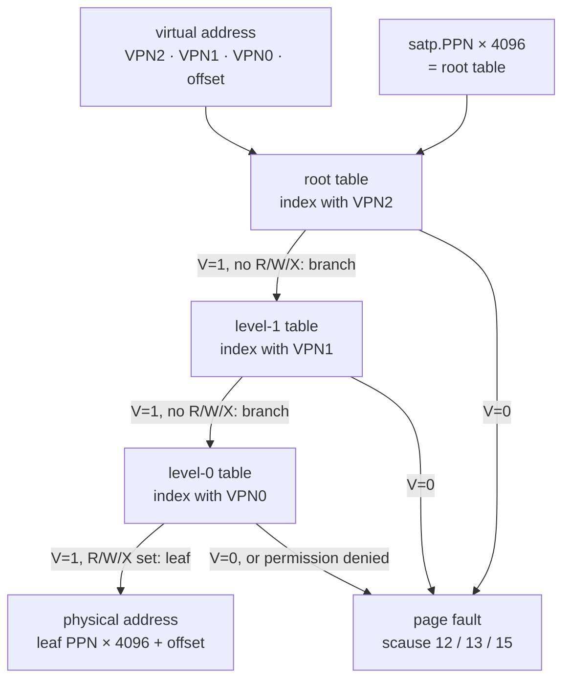

# Sv39 Paging

This is the reference for address translation on RISC-V, the thing your kernel
does several million times a second and that you will be asked to do by hand on
paper. You need it for `33k_paging` (where you build the page table), for
`39k_virtual_memory` (where you turn the MMU on), and for every exercise from
`48k_user_mode` onward (where a wrong permission bit is the difference between a
working program and a page fault). The last third of the page is five fully
worked translations; if you are studying for an exam, do those with a pencil
before you read the explanations. Related pages: [Memory Map](memory-map.md) for
where things live, [RISC-V](riscv.md) for the instruction set and CSRs, and
[rv6 Architecture](rv6-architecture.md) for how the pieces fit together.

## The three problems virtual memory solves

Every memory access a CPU makes — instruction fetch, load, store — goes through
the MMU, which rewrites the address using a table the kernel builds. That
indirection buys three separate things, and it is worth keeping them apart,
because exam questions usually target exactly one.

| Problem | Without translation | How Sv39 fixes it | In rv6 |
|---|---|---|---|
| **Isolation** | Any program can read or write any byte of RAM, including another program's and the kernel's. | Each process gets its own page table; an address that is not mapped in *your* table simply does not exist for you. | `p.pagetable` per process (`proc.rs:30`); `satp` is reloaded on every switch into user mode (`usermode.rs:141`) |
| **Relocation** | Programs must be compiled or patched for whatever physical address happens to be free. | Virtual addresses are independent of physical ones, so every program can be linked at the same address. | Every rv6 user program is loaded at virtual address 0 (`USER_CODE`, `memlayout.rs:61`), wherever `kalloc` happened to find pages |
| **Protection** | Nothing stops a program from writing its own code, or executing its stack, or touching a device register. | Each mapping carries R/W/X/U permission bits, checked in hardware on every access. | Code pages are `R+X+U`, the stack is `R+W+U` (`vm.rs:228`, `vm.rs:245`), and the UART is mapped without `U` (`vm.rs:132`) |

The unit of all of this is the **page**: 4096 bytes (`PGSIZE`, `memlayout.rs:7`).
Translation never touches the low 12 bits of an address; it only answers the
question "which physical page does this virtual page live on?"

## Constants you need for a translation

| Name | Value | Meaning |
|---|---|---|
| `PGSIZE` | `0x1000` (4096) | bytes per page, and the size of one page table |
| entries per table | 512 | 4096 / 8 bytes per PTE = 512 = 2⁹ |
| `KERNBASE` | `0x8000_0000` | where RAM starts on QEMU `virt` |
| `PHYSTOP` | `0x8800_0000` | one past the end of RAM (`-m 128M`) |
| `UART0` | `0x1000_0000` | serial port MMIO |
| `PLIC` | `0x0c00_0000` | interrupt controller MMIO, 4 MiB |
| `MAXVA` | `1 << 38` | one past the highest VA rv6 will use |
| `TRAMPOLINE` | `0x3F_FFFF_F000` | `MAXVA - PGSIZE`, top page of *every* address space |
| `TRAPFRAME` | `0x3F_FFFF_E000` | the page below it, one per process |
| `USER_CODE` | `0x0` | where a user image is loaded |
| `USER_STACK` | `0x1_0000` | the user stack page (16 pages above the image) |

All from `memlayout.rs`; see [Memory Map](memory-map.md) for the full picture.

## Splitting a virtual address

Sv39 means **39 significant virtual address bits**: 27 bits of virtual page
number, split into three 9-bit indices, plus a 12-bit offset.

```text
 63          39 38      30 29      21 20      12 11         0
+--------------+----------+----------+----------+------------+
|  must equal  |  VPN[2]  |  VPN[1]  |  VPN[0]  |   offset   |
|    bit 38    |  9 bits  |  9 bits  |  9 bits  |  12 bits   |
+--------------+----------+----------+----------+------------+
```

| Field | Bits | Extract with | Selects |
|---|---|---|---|
| VPN[2] | 38:30 | `(va >> 30) & 0x1ff` | an entry in the **root** table; each covers 1 GiB |
| VPN[1] | 29:21 | `(va >> 21) & 0x1ff` | an entry in a level-1 table; each covers 2 MiB |
| VPN[0] | 20:12 | `(va >> 12) & 0x1ff` | an entry in a level-0 table; each covers 4 KiB |
| offset | 11:0 | `va & 0xfff` | a byte within the page; **never translated** |

rv6 does all three with one function (`vm.rs:44-46`):

```rust
const fn px(level: usize, va: usize) -> usize {
    (va >> (12 + level * 9)) & 0x1ff
}
```

Bits 63:39 are not free real estate: the hardware requires every one of them to
be a copy of bit 38, exactly like sign extension on a 39-bit signed number. rv6
sidesteps the issue by capping addresses at `MAXVA = 1 << 38`
(`memlayout.rs:45-49`), so bit 38 is always 0 and so are the top 25. That is why
`TRAMPOLINE` is `0x3F_FFFF_F000` and not `0xFFFF_FFFF_FFFF_F000`.

## The physical address

Physical addresses in Sv39 are **56 bits**, wider than the virtual ones. That is
not a typo — a 39-bit virtual space can be a window onto much more RAM.

```text
 55                30 29      21 20      12 11         0
+--------------------+----------+----------+------------+
|       PPN[2]       |  PPN[1]  |  PPN[0]  |   offset   |
|      26 bits       |  9 bits  |  9 bits  |  12 bits   |
+--------------------+----------+----------+------------+
```

The 44-bit physical page number (PPN[2:0] together) comes out of the leaf PTE;
the 12-bit offset is copied straight from the virtual address. On the `virt`
machine every physical address fits in 32 bits, so the upper PPN bits are always
zero in practice.

## The page-table entry

A PTE is one 64-bit word. rv6 wraps it in a newtype (`vm.rs:25-42`) but it is
just an integer.

| Bits | Field | Meaning |
|---|---|---|
| 63 | N | `Svnapot` contiguous mapping — unused here, must be 0 |
| 62:61 | PBMT | `Svpbmt` memory type — unused here, must be 0 |
| 60:54 | reserved | must be 0 |
| 53:28 | PPN[2] | top 26 bits of the physical page number |
| 27:19 | PPN[1] | middle 9 bits |
| 18:10 | PPN[0] | low 9 bits |
| 9:8 | RSW | reserved for supervisor software; hardware ignores it |
| 7 | **D** | dirty: this page has been written since D was last cleared |
| 6 | **A** | accessed: this page has been read, written, or fetched |
| 5 | **G** | global: mapping is present in every address space |
| 4 | **U** | user mode may access this page |
| 3 | **X** | executable |
| 2 | **W** | writable |
| 1 | **R** | readable |
| 0 | **V** | valid: if 0, the whole entry is garbage and the walk faults |

The PPN starts at **bit 10**, not bit 12, which is the single most common source
of arithmetic errors. Building an entry means dropping the offset bits and
shifting into place; reading it back means the reverse (`vm.rs:29-42`):

```rust
pub const fn new(pa: usize, flags: usize) -> Pte { Pte(((pa >> 12) << 10) | flags) }
pub const fn pa(self) -> usize { (self.0 >> 10) << 12 }
pub const fn flags(self) -> usize { self.0 & 0x3ff }
```

`(pa >> 12) << 10` is *not* the same as `pa >> 2`: the first also clears the low
12 bits of `pa`, so a physical address that is not page-aligned is silently
rounded down rather than corrupting the flags. `flags()` masks the low **ten**
bits, so it returns D A G U X W R V plus the two RSW bits.

Notes that matter in practice:

- **R=0, W=1 is illegal.** Write-without-read is a reserved encoding; the
  hardware treats such a PTE as invalid.
- **rv6 defines only five flags** — `PTE_V`, `PTE_R`, `PTE_W`, `PTE_X`, `PTE_U`
  (`vm.rs:17-23`). It never sets A, D, or G.
- **A and D still work anyway**, because QEMU updates them itself during the
  walk. Hardware without that update feature faults the first time a page with
  A=0 is touched and expects the kernel to set the bit in its trap handler; rv6
  has no such code. That is a real portability hole, not a simplification.
- **`fence.i` is not a TLB operation.** It appears in `vm.rs:168` and `vm.rs:232`
  because the kernel just *wrote instructions* into memory and the instruction
  fetch path needs flushing. Different cache, different problem.

## Leaf or branch

The hardware decides whether an entry ends the walk by looking at R, W, and X —
not at the level it is on.

| V | R/W/X | Meaning |
|---|---|---|
| 0 | — | invalid: the walk stops and raises a page fault |
| 1 | all zero | **branch**: PPN is the physical address of the next-level table |
| 1 | any set | **leaf**: PPN is the physical page being mapped, and the walk ends |

rv6 relies on this in both directions: `walk` builds interior nodes with
`Pte::new(page, PTE_V)` and nothing else (`vm.rs:67`), and the teardown and fork
paths recover the structure with `flags() & (PTE_R | PTE_W | PTE_X) != 0`
(`vm.rs:358`, `vm.rs:398`).

A leaf at level 1 or level 2 is legal in the architecture: it maps a **2 MiB
megapage** or a **1 GiB gigapage**, with the corresponding low PPN fields
required to be zero. rv6 never creates one — and `walk` (`vm.rs:52-73`) would
mishandle one if it met it, because it checks only `V` and would follow a
level-2 leaf's PPN as though it were a table address. That is safe only because
rv6 is the sole builder of these tables, and it is exactly the kind of
assumption an exam question likes to poke at.

## The walk



Three memory reads per translation, before the access you actually wanted: that
is the cost the TLB exists to hide.

rv6's software version does the same descent and stops one entry short, handing
back a pointer to the level-0 entry so the caller can fill it in (`vm.rs:52-73`):

```rust
pub unsafe fn walk(mut table: *mut Pte, va: usize, alloc: bool) -> *mut Pte {
    let mut level = 2;
    while level > 0 {
        let pte = table.add(px(level, va));
        if (*pte).is_valid() {
            table = (*pte).pa() as *mut Pte;
        } else {
            if !alloc { return ptr::null_mut(); }
            let page = kalloc::kalloc();
            // ... zero it, then:
            *pte = Pte::new(page as usize, PTE_V);
            table = page as *mut Pte;
        }
        level -= 1;
    }
    table.add(px(0, va))
}
```

Two things to notice: the loop runs for levels 2 and 1 only, returning the
level-0 entry rather than following it, and in `alloc` mode a missing interior
table is created on the spot — which is why mapping one page at a fresh virtual
address can cost three physical pages. `mappages` (`vm.rs:75-98`) is a loop
around `walk` that page-aligns the range, ends at `pgrounddown(va + size - 1)`,
and stores `Pte::new(pa, perm | PTE_V)` for each page: the `V` bit is added for
you, R/W/X/U are not.

## The satp register

`satp` (Supervisor Address Translation and Protection) is what makes a page
table *the* page table.

```text
 63    60 59              44 43                              0
+--------+------------------+---------------------------------+
|  MODE  |       ASID       |     PPN of the root table       |
| 4 bits |     16 bits      |            44 bits              |
+--------+------------------+---------------------------------+
```

| MODE | Meaning |
|---|---|
| 0 | Bare — no translation, virtual address = physical address |
| 8 | **Sv39** — three levels, what we use |
| 9 | Sv48 — four levels |
| 10 | Sv57 — five levels |

The PPN field holds the root table's physical address **shifted right by 12**,
not the address itself. rv6 builds the value in one line (`vm.rs:104-108`):

```rust
pub const SATP_SV39: usize = 8 << 60;
pub fn make_satp(root: *mut Pte) -> usize { SATP_SV39 | ((root as usize) >> 12) }
```

rv6 always leaves ASID at 0. A nonzero ASID lets the hardware tag TLB entries by
address space and keep several alive at once, so a process switch need not throw
everything away — an optimization we skip.

Installing a table is two instructions (`vm.rs:177-181`):

```rust
asm!("csrw satp, {}", in(reg) satp);
asm!("sfence.vma zero, zero");
```

The moment that `csrw` retires, translation is on and *the next instruction
fetch is translated*. That is why `kvmmake` identity-maps all of RAM: the
program counter, the stack pointer and every pointer the kernel is holding keep
working only because they translate to themselves.

## sfence.vma and the TLB

The **TLB** (Translation Lookaside Buffer) caches recent VA→PA translations so
the hardware can skip the three-read walk. It is not coherent with memory: if
you change a PTE, the TLB does not notice. `sfence.vma` is how you tell it.

| Form | Effect |
|---|---|
| `sfence.vma zero, zero` | flush everything (all addresses, all ASIDs) |
| `sfence.vma rs1, zero` | flush translations for the one virtual address in `rs1` |
| `sfence.vma zero, rs2` | flush everything belonging to the ASID in `rs2` |

It is also an ordering barrier: it guarantees that page-table stores you issued
*before* it are visible to walks that happen *after* it. That is why rv6 brackets
every `satp` write with one on each side (`usermode.rs:133-135` and
`usermode.rs:140-142`):

```asm
sfence.vma zero, zero
csrw satp, t1
sfence.vma zero, zero
```

The one before makes the new table's contents visible to the walker; the one
after discards translations cached for the old address space. Note that
`mappages` itself never issues an `sfence` — rv6 gets away with that because a
page table is always fully built *before* it is loaded into `satp`, and user
tables are modified while the kernel is running on the kernel's table. Change
that invariant (add lazy allocation, say) and you must add the flush; a stale
TLB entry is a bug that reproduces once an hour and looks like cosmic rays.

## Five worked translations

### The kernel page table on a fresh boot

You can predict every physical address here, because the allocator is
deterministic. `kalloc::init` frees pages from the end of the kernel image
upward to `PHYSTOP`, pushing each onto the head of a free list
(`kalloc.rs:26-32`), and `kalloc` pops the head (`kalloc.rs:40-46`). So the
**first** allocation is the **highest** page in RAM, `0x87FF_F000`, and each
subsequent one is 4096 lower. `kinit` calls `kalloc::init` and then `kvmmake`
with nothing in between (`main.rs:87-94`), so the tables land like this:

| Alloc | Physical page | Role |
|---|---|---|
| 1 | `0x87FF_F000` | **root** table |
| 2 | `0x87FF_E000` | level-1 table for VPN[2]=0 (the device gigabyte) |
| 3 | `0x87FF_D000` | level-0 table for the UART (VPN[1]=128) |
| 4 | `0x87FF_C000` | level-0 table for the test finisher (VPN[1]=0) |
| 5-6 | `0x87FF_B000`, `0x87FF_A000` | level-0 tables for the PLIC's 4 MiB (VPN[1]=96, 97) |
| 7 | `0x87FF_9000` | level-1 table for VPN[2]=2 (all of RAM) |
| 8-71 | `0x87FF_8000` … `0x87FB_9000` | 64 level-0 tables, one per 2 MiB of the 128 MiB identity map |
| 72 | `0x87FB_8000` | the trampoline's own code page |
| 73-74 | `0x87FB_7000`, `0x87FB_6000` | level-1 and level-0 tables for `TRAMPOLINE` |

The satp value that turns this on is
`(8 << 60) | (0x87FF_F000 >> 12)` = **`0x8000_0000_0008_7FFF`**.

### 1. Kernel text, `0x8020_1000`

Split it. `0x8020_1000` = 2³¹ + 2²¹ + 2¹², which makes the arithmetic clean:

```text
VPN[2] = (0x80201000 >> 30) & 0x1ff = 2
VPN[1] = (0x80201000 >> 21) & 0x1ff = 1025 & 0x1ff = 1
VPN[0] = (0x80201000 >> 12) & 0x1ff = 524801 & 0x1ff = 1
offset =  0x80201000 & 0xfff        = 0x000
```

Now walk, reading one 8-byte entry per level:

| Step | Table | Index | Entry read | Decoded |
|---|---|---|---|---|
| L2 | `0x87FF_F000` | 2 → byte offset 16 | `0x0000_0000_21FF_E401` | PPN → `0x87FF_9000`, flags `0b00_0000_0001` = V only → **branch** |
| L1 | `0x87FF_9000` | 1 → byte offset 8 | `0x0000_0000_21FF_DC01` | PPN → `0x87FF_7000`, V only → **branch** |
| L0 | `0x87FF_7000` | 1 → byte offset 8 | `0x0000_0000_2008_040F` | PPN → `0x8020_1000`, flags `0xF` = V+R+W+X → **leaf** |

Result: `0x8020_1000 | offset 0x000` = **`0x8020_1000`**. Identity, as promised
by `mappages(root, KERNBASE, PHYSTOP - KERNBASE, KERNBASE, ...)` at `vm.rs:141`.
Check the leaf by hand: `(0x8020_1000 >> 12) << 10 = 0x8020_1 << 10 =
0x2008_0400`, plus flags `0xF` = `0x2008_040F`. No `U` bit, so a user program
that reaches this address gets a fault instead of the kernel's code.

### 2. The UART, `0x1000_0000`

```text
VPN[2] = (0x10000000 >> 30) & 0x1ff = 0
VPN[1] = (0x10000000 >> 21) & 0x1ff = 128
VPN[0] = (0x10000000 >> 12) & 0x1ff = 65536 & 0x1ff = 0
offset = 0x000
```

Root entry 0 → `0x87FF_E000`; entry 128 there → `0x87FF_D000`; entry 0 there is
the leaf **`0x0400_0007`**. Run that backwards, which is the direction exams
usually ask for:

```text
pa    = (0x04000007 >> 10) << 12 = 0x10000 << 12 = 0x1000_0000
flags =  0x04000007 & 0x3ff      = 0x007 = V | R | W
```

Readable, writable, **not executable**, **not user**. Exactly right for a device
register: nobody should fetch instructions from a UART, and no user program
should be able to print by writing to it directly (`vm.rs:132`).

### 3. A user code address, `0x0000_1234`

Now switch page tables. Suppose `exec` built a process whose root table is at
`0x87FA_F000`, with a level-1 table at `0x87FA_E000`, a level-0 table at
`0x87FA_D000`, and the program's first page loaded at physical `0x87FA_C000`.

```text
VPN[2] = 0        VPN[1] = 0        VPN[0] = 1        offset = 0x234
```

| Step | Table | Index | Entry | Decoded |
|---|---|---|---|---|
| L2 | `0x87FA_F000` | 0 | `0x21FE_B801` | → `0x87FA_E000`, V → branch |
| L1 | `0x87FA_E000` | 0 | `0x21FE_B401` | → `0x87FA_D000`, V → branch |
| L0 | `0x87FA_D000` | 1 | `0x21FE_B01B` | → `0x87FA_C000`, flags `0x1B` = V+R+X+U → leaf |

Result: `0x87FA_C000 + 0x234` = **`0x87FA_C234`**. Two things are worth saying
out loud. Virtual address 0 is a perfectly ordinary address in a user address
space here (`memlayout.rs:61`) — there is no NULL page, so a null-pointer
dereference in an rv6 user program reads your own code. And the flags are
`R+X+U` with no `W` (`vm.rs:228`): a program cannot rewrite its own
instructions.

### 4. The user stack, `0x0001_0FF0`

Same process, same table. The stack page was allocated separately at
`0x87FA_B000` and mapped at `USER_STACK = 0x1_0000` (`vm.rs:239-246`).

```text
VPN[2] = (0x10FF0 >> 30) & 0x1ff = 0
VPN[1] = (0x10FF0 >> 21) & 0x1ff = 0
VPN[0] = (0x10FF0 >> 12) & 0x1ff = 16
offset =  0x10FF0 & 0xfff        = 0xFF0
```

VPN[2] and VPN[1] are both 0 again, so the walk reuses the **same two tables**
as the code page and lands in the same level-0 table `0x87FA_D000` — at index
16 instead of index 1. Everything below 2 MiB of virtual address space shares
one level-0 table; that is what "each level-1 entry covers 2 MiB" means in
practice.

Entry 16 is `0x21FE_AC17`: PPN → `0x87FA_B000`, flags `0x17` = V+R+W+U. Result:
`0x87FA_B000 + 0xFF0` = **`0x87FA_BFF0`** — which is `USER_STACK_TOP - 16`, i.e.
the top of a freshly started program's stack. No `X` bit, so an attacker who
gets data onto the stack still cannot execute it.

Between index 1 (code) and index 16 (stack) the entries are zero. That gap is
deliberate (`memlayout.rs:67-72`): running off the end of the image faults
instead of quietly landing in the stack.

### 5. The trampoline, `0x3F_FFFF_F000`

The most instructive address in the kernel, because it is mapped at the *same
virtual address* in every page table.

```text
0x3FFFFFF000 = 2^38 - 4096
VPN[2] = (0x3FFFFFF000 >> 30) & 0x1ff = 255
VPN[1] = (0x3FFFFFF000 >> 21) & 0x1ff = 511
VPN[0] = (0x3FFFFFF000 >> 12) & 0x1ff = 511
offset = 0x000
```

In this process's table, root entry 255 is `0x21FE_A801` → `0x87FA_A000`; entry
511 there is `0x21FE_A401` → `0x87FA_9000`; entry 511 there is the leaf
**`0x21FE_E00B`** → PPN `0x87FB_8000`, flags `0xB` = V+R+X. Result:
**`0x87FB_8000`**.

That is the *same physical page* the kernel's own table maps at this same
virtual address (allocation 72 above; `proc.rs:164` maps
`vm::trampoline_page()` into every new process). It has to be: the trampoline
executes the `csrw satp` that swaps address spaces, and the instruction *after*
that write is fetched through the new table, so if the code sat at different
virtual addresses in the two tables the program counter would land in nothing.
Note the flags — `0xB`, no `U`. User mode cannot execute the trampoline; the
trap hardware, which enters it while still in supervisor mode, can.

## When the walk fails

Take virtual address `0x0000_5000` in the process from examples 3 and 4, whose
image is two pages long. VPN[2]=0 and VPN[1]=0 lead to level-0 table
`0x87FA_D000` as before, but entry 5 there is `0x0000_0000_0000_0000` — V=0.
The walk stops immediately and the hardware raises a page fault with the
faulting virtual address in `stval`.

| `scause` | Exception |
|---|---|
| 12 | Instruction page fault (a fetch failed) |
| 13 | Load page fault (a read failed) |
| 15 | Store/AMO page fault (a write failed) |

Permission failures raise the same three exceptions: a store to an `R+X` page is
a store page fault, and a user-mode access to a page without `U` faults as
whichever kind the access was. That last case is the entire wall between user
and kernel, enforced by one bit.

The kernel's software walks perform the same checks by hand. `walkaddr`
(`vm.rs:252-261`) rejects addresses at or above `MAXVA`, a null result from
`walk`, an invalid PTE, and — critically — any PTE without `PTE_U`, so a user
program cannot hand the kernel a kernel address and have `copyin`/`copyout`
dereference it on its behalf.

## Doing a translation by hand

1. Write the virtual address in hex, then peel off the low three hex digits:
   that is the offset, and it is also the low three hex digits of the answer.
2. Shift right 12, 21, 30 and mask with `0x1ff` for VPN[0], VPN[1], VPN[2].
   (Writing the address in binary once and slicing it 9-9-9-12 is usually faster
   than three divisions.)
3. Root table address = `satp.PPN << 12` = `(satp & 0xFFF_FFFF_FFFF) * 4096`.
4. At each level, the entry you want is at `table + index * 8`.
5. For each entry: V=0 → fault, stop. R/W/X all zero → next table is
   `(pte >> 10) << 12`, descend. Any of R/W/X set → leaf, and the answer is
   `((pte >> 10) << 12) | offset`.
6. Check the flags against the access: writing needs W, fetching needs X, and
   user mode needs U.

Three sanity checks catch most errors: a table address always ends in `000`, a
branch PTE's low ten bits are always `0x001`, and if your answer's last three hex
digits differ from the input's you lost the offset.

## Where each piece lives in rv6

| Function | Location | What it does |
|---|---|---|
| `Pte::new` / `pa` / `flags` | `vm.rs:29-42` | pack and unpack an entry |
| `px` | `vm.rs:44-46` | extract VPN[level] |
| `walk` | `vm.rs:52-73` | descend to the level-0 entry, allocating tables if asked |
| `mappages` | `vm.rs:75-98` | install `size` bytes of mappings, one page at a time |
| `make_satp` | `vm.rs:106-108` | build the `satp` value for a root table |
| `kvmmake` | `vm.rs:125-175` | build the kernel's identity map plus the trampoline |
| `kvminithart` | `vm.rs:177-181` | write `satp`, then `sfence.vma` |
| `load_segment` | `vm.rs:196-234` | map a program image at `USER_CODE` with R+X+U |
| `map_user_stack` | `vm.rs:239-246` | one page at `USER_STACK` with R+W+U |
| `walkaddr` | `vm.rs:252-261` | translate a *user* VA safely, returning 0 on any problem |
| `copyin` / `copyout` / `copyinstr` | `vm.rs:268-342` | move bytes across the user/kernel boundary, one page at a time |
| `free_pt` | `vm.rs:354-374` | recursive teardown; the model of leaf-vs-branch logic |
| `copy_level` | `vm.rs:389-419` | `fork`'s deep copy, rebuilding each VA as it descends |

## Mistakes that cost points

- **Shifting by 12 instead of 10** when building or reading a PTE. The PPN
  starts at bit 10.
- **Forgetting the offset.** Translation replaces the page number only.
- **Assuming level 0 is the root.** VPN[2] indexes the root; the levels count
  *down* as you descend, which is why `walk`'s loop runs `level = 2, 1`.
- **Setting R/W/X on an interior entry.** That turns a branch into a superpage
  leaf, and the walk stops early — two levels early at the root, one at level 1.
- **Omitting `PTE_U`** on a user mapping. The program faults on its very first
  instruction fetch, which looks like a broken loader but is a permission bug.
- **Setting `PTE_U` on a kernel mapping.** No fault, no symptom, no isolation.
- **Changing a live page table without `sfence.vma`.** Works until it doesn't.

For practice, `33k_paging`'s self-check reports which check failed rather than
just failing, so a wrong shift shows up precisely; [Exam Prep](exam-prep.md) has
more.
