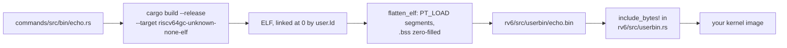

# ulib and the Command Set

This page is the reference for `ulib`, the tiny I/O façade the five Module 1
command labs (`c00_echo` through `c04_grep`) are written against, and for
`oslings ship`, the step in Module 3 that takes those same source files and
runs them on the kernel you built. Open it when you are mid-lab and need the
exact function signature, when the compiler is refusing something you would
normally reach for (`Vec`, `format!`, `println!`), or when `oslings ship`
rejects your image. Everything below is read out of `ulib/src/`,
`commands/`, `oslings-cli/src/ship.rs`, and the reference kernel in
`exercises/22_userland/solution/`.

## The one-sentence version

`ulib` exists so that the `echo.rs` you write in week 4 on your laptop is the
**same file, unedited**, that runs on your own operating system in December.
It does that by putting one seam — five system calls and a couple of helpers —
between your program and whatever is underneath it, and by having two private
backends behind that seam.

| Backend | Target | Underneath | Source |
|---|---|---|---|
| host | `aarch64-apple-darwin`, `x86_64-unknown-linux-gnu`, … | `std`, real Unix fds | `ulib/src/sys/host.rs` |
| rv6 | `riscv64gc-unknown-none-elf` | `ecall` into your kernel | `ulib/src/sys/rv6.rs` |

Your command file contains **no `#[cfg]` attributes at all**. The entire
two-target ceremony is two lines, taken verbatim from
`commands/src/bin/echo.rs:18` and `:22`:

```rust
#![cfg_attr(target_os = "none", no_std, no_main)]

ulib::main!(run);
```

## Backend selection: the target, not a feature

Selection happens in `ulib/src/sys/mod.rs:4-12` and is a single condition:

```rust
#[cfg(target_os = "none")]
mod rv6;
#[cfg(not(target_os = "none"))]
mod host;
```

`target_os` is *derived from the target triple you pass to cargo*. It cannot
disagree with what you are actually building. A cargo feature can: nothing
stops you from `cargo build --features rv6` on macOS, and the failure mode is
not a clear error but a wall of link errors about missing `std` symbols and a
duplicate `#[panic_handler]`. The same reasoning drives
`ulib/src/lib.rs:19` — `#![cfg_attr(target_os = "none", no_std)]` — and
`commands/.cargo/config.toml`, which deliberately sets **no** default
`[build] target`, so plain `cargo test` builds for your laptop and needs no
cross-toolchain. The RISC-V target is opt-in and is passed explicitly by
`oslings ship`.

## The complete API surface

That is the whole of it. If it is not in these tables, `ulib` does not have it.

| Item | Signature (`ulib/src/lib.rs`) | Notes |
|---|---|---|
| `Fd` | `type Fd = i32;` | `lib.rs:38` |
| `STDIN` / `STDOUT` / `STDERR` | `0` / `1` / `2` | `lib.rs:40-42` |
| `Error` | `struct Error(pub i32)` | `lib.rs:55`; rv6 answers every failure with `-1`, so there is nothing richer to report |
| `read` | `fn read(fd, &mut [u8]) -> Result<usize, Error>` | `lib.rs:104`; `Ok(0)` is EOF, a short read is normal |
| `write` | `fn write(fd, &[u8]) -> Result<usize, Error>` | `lib.rs:114`; may write fewer bytes than asked |
| `write_all` | `fn write_all(fd, &[u8]) -> Result<(), Error>` | `lib.rs:154`; loops over short writes — use this one |
| `open` | `fn open(&[u8], u32) -> Result<Fd, Error>` | `lib.rs:125`; adds the NUL terminator for you |
| `close` | `fn close(fd) -> Result<(), Error>` | `lib.rs:134` |
| `exit` | `fn exit(i32) -> !` | `lib.rs:144` |
| `print` / `eprint` | `fn print(&str)` | `lib.rs:167`, `:172`; ignore errors |
| `write_usize` | `fn write_usize(fd, n, width) -> Result<(), Error>` | `lib.rs:181`; decimal, right-aligned — this is your `printf("%8d")` |

Open flags are the same bits xv6 and rv6's `file.rs` use (`lib.rs:45-49`):

| Flag | Value |
|---|---|
| `O_RDONLY` | `0x000` |
| `O_WRONLY` | `0x001` |
| `O_RDWR` | `0x002` |
| `O_CREATE` | `0x200` |
| `O_TRUNC` | `0x400` |

**`Args`** (`lib.rs:63`) is the command line, built for you by `main!`.
Arguments are `&[u8]`, not `&str`, because that is literally what `exec`
pushes onto the new program's stack — forcing `&str` would put a UTF-8
validation table in every image. `len()` is `argc` (including `argv[0]`),
`get(i) -> Option<&[u8]>`, `str(i) -> Option<&str>` for the cases where you
want text, and `prog()` for `argv[0]`.

**`Lines`** (`ulib/src/lines.rs`) is a line iterator that never allocates:
`Lines::new(fd, &mut buf)` borrows *your* buffer and is the only storage it
has. `next_line() -> Option<&[u8]>` returns each line without its `\n`. If a
line is longer than the buffer it hands back what it has and sets
`truncated()`. It is given, not implemented by you — without it, `grep` turns
into a lab about ring buffers instead of a lab about matching.

Note what is **absent**: no `fork`, `exec`, `wait`, `getpid`, `dup`, `mkdir`,
`unlink`, no seeking, no directory reading. Your kernel grows some of those
(`syscall.rs:21-29`), but a Module 1 command never calls them.

## `ulib::main!` — what it expands to

`ulib/src/entry.rs:13` is a two-armed macro:

| Target | Expansion | Detail |
|---|---|---|
| host | `fn main()` | collects the real `args_os()` as bytes, calls `run`, `process::exit`s the returned code (`entry.rs:15-21`) |
| rv6 | `#[no_mangle] extern "C" fn _start(argc, argv) -> !` | rebuilds `Args` from the raw stack, then `ulib::exit(run(args))` (`entry.rs:29-39`) |

The rv6 arm also carries `#[link_section = ".text.start"]`. That is not
decoration. rv6's current loader is a **flat** loader: it copies the image to
`USER_CODE` and jumps to the first byte, with no ELF entry point to read
(`exec.rs` header). `commands/user.ld` places `*(.text.start)` first for the
same reason. Remove either one and the linker is free to order some other
function first, and your program jumps into the middle of itself.

`argv_slices` (`ulib/src/sys/rv6.rs:80`) walks `argc` pointers to
NUL-terminated strings and measures each with a byte loop, capped at
`MAX_ARGS = 8` (`rv6.rs:98`) to match the kernel's own `MAXARG`
(`exec.rs:612`).

## The rv6 backend: one `ecall` per call

Every `ulib` function on rv6 is a single `ecall`. The convention is not
invented here; it is what `dispatch` in your kernel reads out of the trapframe
(`usermode.rs:399-408`):

| Register | Meaning |
|---|---|
| `a7` | system call number |
| `a0`, `a1`, `a2` | arguments |
| `a0` | return value, written back by the kernel |

```rust
asm!("ecall", in("a7") n, inlateout("a0") a0 => ret, in("a1") a1, in("a2") a2);
```

That is `ecall3` at `ulib/src/sys/rv6.rs:21`. It deliberately uses the
conservative default `asm!` options — no `nomem`, no `nostack` — because the
kernel's trap path can touch memory on your behalf.

| Call | `a7` | `a0` | `a1` | `a2` |
|---|---|---|---|---|
| `exit(status)` | 2 | status | — | — |
| `read(fd, buf, len)` | 5 | fd | buf ptr | len |
| `open(path, flags)` | 15 | path ptr | flags | — |
| `write(fd, buf, len)` | 16 | fd | buf ptr | len |
| `close(fd)` | 21 | fd | — | — |

The numbers match `exercises/22_userland/solution/syscall.rs:21-29`, which
match xv6's. Two details worth knowing: `sys_open` (`rv6.rs:41`) copies your
path into a fixed `[u8; MAX_PATH + 1]` scratch buffer to NUL-terminate it,
which is why `MAX_PATH` is a hard 63 (`lib.rs:150`) — and why the kernel's own
`exec` caps a program name at 32 (`syscall.rs:179`). And `rv6.rs:66` holds the
one `#[panic_handler]` in the entire linked image: it writes `panic\n` to fd 2
and exits `-1`. No file you write ever has to contain one.

## The host backend and the test harness

On the host, fds really are Unix fds — `host.rs:33-79` wraps them in a
`ManuallyDrop<File>` so a write does not close the descriptor. But when a
capture is active, writes are diverted into a buffer instead
(`host.rs:16-31`, a `thread_local!` so tests still run in parallel).

That is the whole trick behind `ulib::testing`: the harness calls your `run`
function **directly**, in-process. No subprocess, no `dyn Write` parameter
threaded through your command, no test-only code path. The source under test
is byte-identical to the source that runs on rv6.

| Function (`ulib/src/testing.rs`) | Use |
|---|---|
| `run(&["echo", "a"], run)` | argv only (`testing.rs:28`) |
| `run_with_stdin(argv, b"...", run)` | feeds fd 0 (`testing.rs:33`) |
| `run_with_files(argv, &[("f.txt", b"...")], run)` | in-memory files your program may `open` (`testing.rs:38`) |

You get back `Output { code, stdout, stderr }`, with `.out()` and `.err()`
returning `&str` for readable assertions. Fds 0/1/2 are reserved in the
capture table so your first `open` returns 3, exactly as on rv6
(`testing.rs:60`). Be aware of one honest limitation: under capture, `write`
to anything other than fd 1 or 2 returns `-1` (`host.rs:38`). The harness can
give a command files to *read*, not files to write.

## Portability rules a command must follow

These are not stylistic preferences. On `riscv64gc-unknown-none-elf` there is
**no user-side allocator at all** — rv6 has no `sbrk`, no `mmap`, no `brk`,
and `ulib` declares no `#[global_allocator]`. A program's entire memory is its
image plus one 4 KiB stack page.

| Do not use | Why | Use instead |
|---|---|---|
| `std::*` | the target has no `std` | `core` only |
| `Vec`, `String`, `Box`, `HashMap` | no allocator exists | `[u8; N]`, `[T; N]` |
| `format!`, `to_string()` | allocation | `write_usize`, byte slices |
| `println!`, `write!`, `core::fmt` | `core::fmt` drags in 12–18 KiB of machinery | `write_all`, `print`, `write_usize` |
| growable buffers | nothing to grow into | fixed buffers you declare and own |

Look at what the real commands do: `cat.rs:23` and `wc.rs:34` declare
`let mut buf = [0u8; 512];`, `head.rs:40` and `grep.rs:45` use
`[0u8; 1024]`. The whole program's memory footprint is visible in one line —
which is the same discipline the kernel itself follows.

`commands/Cargo.toml` backs this up with a release profile of
`opt-level = "s"`, `lto = true`, `codegen-units = 1`, `panic = "abort"`,
`strip = "symbols"`.

## `oslings ship`

```bash
oslings ship                  # every command in commands/src/bin/
oslings ship echo grep        # just these
oslings ship --list           # what is embedded now
oslings ship --clean          # remove all embedded programs
```



The kernel cannot read ELF, so `ship.rs:42 flatten_elf` does the loading work
ahead of time: it walks the program headers, copies every `PT_LOAD` segment to
the address the linker chose, and leaves the `memsz`-beyond-`filesz` tail as
zeros — that tail is `.bss`. It is about eighty lines of hand-rolled ELF
parsing precisely so that no student needs binutils installed. Then it writes
`rv6/src/userbin/<name>.bin` and regenerates `rv6/src/userbin.rs`, a table of
`(name, &'static [u8])` built with `include_bytes!` (`ship.rs:169`). That
generated module is how your own programs enter the name lookup your `exec`
does (`exec.rs:594`). Do not hand-edit it; the next ship overwrites it.

Three checks will stop you, all in `flatten_elf`:

| Check | Message | Usual cause |
|---|---|---|
| lowest `vaddr` must be 0 | *image starts at …, but rv6 loads at 0* | `user.ld` edited or not passed |
| `e_entry` must be 0 | *entry point is …, not 0* | `#[link_section = ".text.start"]` lost, or `.text.start` no longer first in `user.ld` |
| image ≤ 65536 bytes | *rv6 maps only 65536 (16 pages)* | you pulled in `core::fmt` |

## The budget, and what a command actually costs

```text
0x0001_1000  initial sp; push_argv lays argv strings just below
0x0001_0000  the stack page -- exactly ONE page, 4 KiB
             unmapped gap: a program that overruns its image faults here
0x0000_0000  the flat image, 1..16 pages -> 64 KiB maximum
```

Those constants are `USER_STACK_TOP`, `USER_STACK`, `MAX_PROG_PAGES` and
`USER_CODE` at `memlayout.rs:61-75`; the 64 KiB cap is mirrored as
`MAX_IMAGE` in `ship.rs:27`. The gap between image and stack is a feature: a
runaway program takes a page fault instead of quietly corrupting its own
stack.

Measured flat-image sizes for the reference solutions, built exactly as
`oslings ship` builds them:

| Command | Flat image | Fraction of the 64 KiB budget |
|---|---|---|
| `echo` | 384 B | 0.6 % |
| `cat` | 1256 B | 1.9 % |
| `wc` | 1821 B | 2.8 % |
| `head` | 2713 B | 4.1 % |
| `grep` | 2854 B | 4.4 % |

All five together are under 9 KiB. That is what the no-allocator, no-`fmt`
discipline buys: one `println!` would roughly quintuple the largest of them.
The tighter constraint in practice is the **stack**, not the image — 4 KiB
total, shared between your locals, your `Lines` buffer, and the argv strings
`push_argv` copies in (`exec.rs:781`, capped at 8 arguments of 32 bytes). A
`[0u8; 1024]` buffer is already a quarter of your stack; a `[0u8; 8192]` one
is a fault.

Once shipped, rebuild and boot: `cd rv6 && cargo run`, then at the prompt
`run echo hello world`. See [Using OSlings](oslings-usage.md) for the
surrounding workflow, [rv6 Architecture](rv6-architecture.md) for how `exec`
and the shell fit together, [The Memory Map](memory-map.md) for the address
space, and [Unsafe Rust and no_std](rust-unsafe-nostd.md) for what `no_std`
takes away in general.
