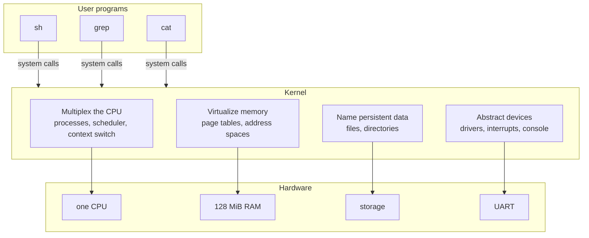
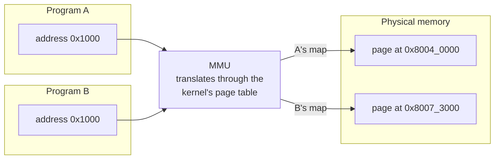
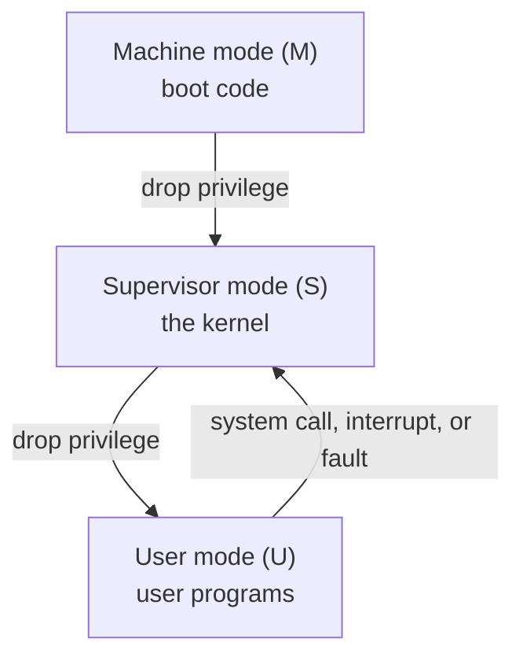

# Week 1 · Building an Operating System, and Your First Rust

> **Thu Aug 27** `00r_hello_rust` · **Fri Aug 28** `01r_control_flow`
>
> Taught Tue Aug 25. **Essentials** is what Thursday and Friday assume.
> **Going deeper** is optional and is not on the exam.

[Slides](01-cs326-2026-08-25-building-an-os-and-first-rust-slides.html){ .md-button }
[Thursday prep](../prep/01-cs326-2026-08-27-prep-setup-and-hello-rust.md){ .md-button }
[Friday prep](../prep/01-cs326-2026-08-28-prep-control-flow.md){ .md-button }

## This week { #this-week }

In `31k` your kernel describes the machine in hex constants, and in `32k` it
rounds addresses to page boundaries without running off the top of memory.
Both are written in a language most of you meet this week.

Tuesday opens the course: what an operating system is, how the semester builds
one, and how a session runs. Thursday is the setup session, from a bare laptop
to a first `oslings submit`, and then `00r`, your first Rust. Friday's `01r`
makes code choose, repeat, and do arithmetic at the edge of a number. Midterm 1,
Thu Oct 15, covers this week's Rust; [For the exam](#exam) adds the parts the
exercises skip.

By Friday night your toolchain works and two exercises are submitted.

---

## The course { #course }

*Tuesday's lecture as taught on Aug 25: what an operating system is, and how
this course runs. That week, the Rust in [Essentials](#essentials) was a
separate reading.*

### 1. What an Operating System Is { #course-os }

Ask ten people what an operating system is and you get ten lists: Linux, macOS,
Windows, Android. That is a list of examples, not a definition, and it is useless
for building one. A better definition asks what must be true for two programs to
run on one computer without either knowing the other exists.

A bare computer offers exactly one of everything: one instruction stream, one
span of memory, one disk, one serial port. Add a second program and every
singular resource must be shared — invisibly, since your editor must not be
written differently because a compiler happens to be running. The operating
system maintains that illusion, through four jobs.



#### 1.1 Multiplex the CPU { #course-cpu }

One CPU, many programs. The kernel runs one for a few milliseconds, takes the
CPU away, and gives it to another, fast enough that a human sees all of them
running at once. A **process** is the kernel's record of one running program:
registers, memory, open files, state. A **context switch** saves one process's
registers and restores another's — the one place in the course where we drop
into assembly, because saving *every* register is something only assembly can
say. A **scheduler** picks who runs next.

The forcible part matters: a program that never yields must still be
interrupted, and only hardware can do that — a **timer interrupt**, arriving
whether or not the program consents. That is why preemptive multitasking needs
hardware and cooperative multitasking does not.

> **Key distinction:** *concurrency* is many things in progress at once;
> *parallelism* is many things executing at the same instant. rv6 runs on one
> emulated CPU, so it gives concurrency without parallelism. Every hard problem
> in this course — races, locks, deadlock — appears with one CPU; more CPUs make
> them more frequent, not more possible.

#### 1.2 Virtualize Memory { #course-memory }

There is one physical memory and its addresses are real. If two programs both
use address `0x1000`, and `0x1000` names one physical location, they corrupt
each other — and they cannot be asked to coordinate, because the point is that
they do not know about each other.

The fix is hardware plus a map the kernel maintains. An **MMU** (memory
management unit) sits between the CPU and memory and rewrites every address the
CPU issues. Program addresses are **virtual**; the MMU translates them to
**physical** ones through a table the kernel builds, in 4096-byte **pages**.



Each program gets its own map, so the same virtual address lands on different
physical pages, and an address with no entry cannot be reached at all. One bit
in each entry says whether user code may touch that page; pages without it
belong to the kernel and are invisible to programs. That single bit is the wall
between a program and the kernel — it is why a wild pointer in `grep` kills
`grep` rather than the machine. You build the map in `33k` and switch it on in
`39k`.

#### 1.3 Name Persistent Data { #course-data }

Memory is addresses; a disk is numbered blocks. Neither is a name a human can
use. The third job imposes files and directories on undifferentiated storage, so
a program can say `/notes.txt` instead of "block 4,192".

```text
    what programs see                       what the storage offers

    /
    ├── notes.txt      "the cat sat"        block 0  block 1  block 2  block 3
    └── bin/                                block 4  block 5  block 6  block 7
        ├── grep                            block 8  block 9  ...
        └── cat
```

A **file** is a sequence of bytes under a name. A **directory** is a file whose
contents are names pointing at other files. The kernel keeps the map from names
to bytes. rv6's filesystem lives in RAM — files do not survive a reboot — a
deliberate scope cut, since surviving power loss needs a block driver, a cache,
and a log. You build it in `40k`.

#### 1.4 Abstract Devices { #course-devices }

The last job is to talk to hardware and then hide it. A serial port is not a
stream of bytes; it is a handful of registers at a fixed physical address, and
sending a character means waiting for a status bit and then storing to one of
them. Every `println!` you have ever written bottoms out there.

The kernel hides it: `read` and `write` work on a keyboard, a file, and a pipe
alike because the kernel puts one interface — the **file descriptor** — over
hardware that has nothing in common. You write the console driver in `45k` and
the file-descriptor layer in `50k`. Everything else in a kernel — traps, locks,
system calls, `fork`, `exec` — serves one of these four jobs.

### 2. The Machine Underneath { #course-machine }

#### 2.1 RISC-V and QEMU { #course-riscv }

rv6 targets **RISC-V**, the open instruction set you met in CS 315, in its
64-bit form, and runs on **QEMU**'s `virt` machine, a computer that exists only
in software. You have built the small version of this idea: the emulator you
wrote in CS 315 executed RISC-V instructions in C. QEMU is the same idea at full
fidelity — a whole machine with a timer, an interrupt controller, a serial port,
and 128 MiB of RAM, all at fixed addresses in one address space
([Memory Map](../guides/memory-map.md)). It is not a compromise: an emulated
machine can be stopped mid-instruction and inspected in ways no physical board
permits, and your kernel is a real RISC-V executable that would boot on silicon.

> **Key distinction:** RAM and devices share one address space. One address is
> memory; another is a serial port pretending to be memory, and storing a byte
> there transmits it. This is **memory-mapped I/O**, and it is why a wild
> pointer in a kernel can do things a wild pointer in an application cannot.

#### 2.2 Three Privilege Modes { #course-modes }

Most of your programming life has happened in one mode: running a program on
top of an operating system. The machine has more than one. RISC-V defines three
privilege levels, and the kernel's authority rests on them.

| Mode | Who runs here | Can do |
|---|---|---|
| **Machine (M)** | firmware — which, for us, is rv6's own boot code | everything, untranslated |
| **Supervisor (S)** | the kernel | the MMU, traps, devices |
| **User (U)** | `sh`, `grep`, `cat` — your programs | ordinary instructions, only its own pages |



The ladder has one rule. Privilege **decreases** only by an explicit
instruction that more-privileged code chooses to execute, and **increases**
only by a *trap* — an event that lands the CPU in the kernel's code, at the
kernel's chosen address. No instruction a user program can execute makes it
privileged. When a program wants something only the kernel can do, it *asks*,
with a **system call**, which is a deliberate trap. The kernel is the gatekeeper
for the hardware and the privileged instructions, and the hardware enforces it.

**Why M is its own rung.** It is tempting to read the ladder as one authority
getting weaker three times, with M as "the kernel, only more so." That is not
what M is for. S-mode is where you write an operating system; M-mode is where
you make one particular piece of silicon look like the abstract RISC-V machine
that operating system was written against. Four things follow, and each is a
reason S-mode cannot simply absorb the job:

- **M is the only mode the specification requires.** S and U are optional. A
  microcontroller with no MMU implements M alone and is a conforming RISC-V
  core. Every hart leaves reset *in* M-mode, with translation off. So M is not
  a layer stacked above the kernel — it is the floor, and S and U are carved
  out beneath it. That is why `mstatus`, `mtvec` and `mepc` are the originals
  and `sstatus`, `stvec` and `sepc` are a restricted view of the same machine,
  for a mode that might not exist.
- **M-mode is not translated.** `satp` governs S and U; an M-mode fetch or load
  goes straight to a physical address. "The kernel proper" is therefore, by
  definition, the code running under a page table it installed for itself — and
  somebody has to run *before* that page table exists. (M-mode can still write
  `satp`. Clearing it, to be sure paging is off, is one of the first things
  rv6's `start.rs` does. M-mode simply is not subject to it.)
- **M can constrain S — the kernel is not the top of the trust stack.**
  Physical Memory Protection registers are M-mode-only, and they gate which
  physical addresses S and U may touch at all, whatever page tables the kernel
  writes. And *every* trap goes to M by default; `medeleg` and `mideleg` are
  how M hands specific exceptions and interrupts down. Your kernel receives
  page faults because the firmware chose to delegate them.
- **M hides the differences between chips**, so one kernel binary runs on many
  boards. It can trap an illegal instruction and emulate it — a misaligned
  access this core does not do in hardware, a missing floating-point unit, a
  silicon erratum — and it owns the parts that are genuinely board-specific:
  the timer comparator, interrupts between harts, powering the machine off.

> **Key distinction:** S-mode is privileged with respect to *processes*; M-mode
> is privileged with respect to the *board*. The kernel's job is isolating
> programs from one another. Firmware's job is isolating the kernel from the
> particular hardware — hiding its quirks, and containing its mistakes.

Usually that second job belongs to a separate program: on real hardware, and
under QEMU's default firmware, OpenSBI boots in M-mode and `mret`s into the
kernel in S-mode, which afterwards asks for a timer or starts another hart by
executing `ecall` — the same instruction your user programs use to enter the
kernel, one rung up. We run QEMU with `-bios none`, so there is no such
program: rv6 *is* the firmware, loaded at `0x8000_0000`. That is why the kernel
stays in machine mode for most of the semester and only steps down in `43k`,
where `start.rs` sets `mstatus.MPP` to supervisor, puts `kmain` in `mepc`,
clears `satp`, delegates the traps, opens a PMP window over all of physical
memory, starts the timer, and executes `mret`.

This is an orientation pass; [Week 11](11-cs326-2026-11-03-filesystems-boot-order-and-traps.md#43k-modes) does the mechanism.

### 3. The Semester: rv6 End to End { #course-semester }

Read this once now; it will make more sense in October.


**Module 1 — Rust, commands, and two bridges (Aug 27 – Oct 2).** Nothing
boots. Nine Rust exercises (`00r`–`08r`) go from `let` bindings to `Result`;
four command exercises (`10c`–`13c`) build `echo`, `cat`, `wc`, and `grep`
against a small I/O library called `ulib`; then two bridges to bare metal, one
in RISC-V assembly (`20a`) and one in `unsafe` Rust (`21r`). Everything runs on
your laptop under `cargo test`, except `20a`, the first thing to run in QEMU.
You should not fight the borrow checker *and* the hardware at once.

**Module 2 — the kernel (Oct 2 – Dec 4).** From an empty crate that compiles
(`30k`) to a shell running in user mode that launches the commands you wrote in
Module 1 (`52k`, `53k`). The chain is not reorderable: a stack before any Rust
runs, an allocator before page tables (which are made of pages), a supervisor
kernel before anything can trap into it, traps before a system call means
anything. Two steps are abrupt and each is a single instruction — turning the
MMU on in `39k`, and the moment in `43k` when the kernel gives up machine mode.

> **Key distinction:** you write the shell twice. First inside the kernel
> (`46k`), which is easy because kernel code calls the filesystem directly.
> Then as an ordinary user program with no privileges (`52k`), talking to the
> kernel only through system calls. The kernel shell is a *feature of the
> kernel*; the user shell is a *program the kernel runs*. Everything hard about
> operating systems lives in the gap between those two sentences.

Midterm 1 is Thursday, October 15; Midterm 2 is Thursday, November 19; the final
is Tuesday, December 8, in class on the last day of the term. There is no exam
during finals week.

### 4. Why Rust — and Why `unsafe` Exists { #course-rust }

xv6, the MIT teaching kernel this course descends from, is written in C. So is
Linux. The burden of proof is on Rust, and the honest argument is narrower than
the marketing.

#### 4.1 The bugs a kernel actually has { #course-bugs }

Kernel C bugs cluster into a few shapes: use a pointer after the memory was
freed; write past a buffer; read a value another CPU is halfway through writing;
free the same page twice. In application code the OS catches these and kills the
process; in kernel code there is nothing beneath you. A use-after-free in the
page allocator does not crash — it silently hands the same page to two
processes, and the symptom appears ten minutes later somewhere unrelated.

Rust's ownership and borrowing rules make most of that class a **compile
error**: each value has one owner; when the owner goes out of scope the value is
gone; you may have many shared references or one mutable reference, never both.
All at compile time, at zero runtime cost — next week's subject, and the
[Rust for Systems guide](../guides/rust-for-systems.md).

#### 4.2 An operating system is special { #course-special }

Rust's rules assume a world beneath your program: an allocator that hands out
memory, a runtime that set up your stack, an operating system that makes
addresses mean something. A kernel *is* that world. It executes privileged
instructions that change what the machine does. It decides, explicitly, which
virtual addresses map to which physical pages, and writes that into hardware.
It builds its own allocator, because there is no one else to ask. Every one of
those acts is, by definition, something the compiler cannot check.

Rust's answer is not to relax its rules but to give you one mechanism for
stepping outside them: `unsafe`. Inside a block marked `unsafe` you may do what
a kernel must — dereference an address the hardware told you about, write a
device register, treat a fresh page as a list node — and *you* take
responsibility for its correctness. Everywhere else the full guarantees hold.
So the dangerous part of the kernel is small and labeled instead of being the
whole program, and when something corrupts memory, the places that could have
done it are a searchable list. That is the argument: not that Rust makes kernel
programming safe, but that it makes the unsafe part *small* — and you will see
exactly where the line is drawn, because you will draw it.

### 5. What You Bring from CS 315 { #course-cs315 }

More of this course rests on CS 315 than it looks like on day one. You wrote C,
with pointers; Rust's ownership rules are the same pointers with the discipline
made explicit and checked by the compiler, and when the borrow checker complains
in week two it is usually describing a bug you have already written in C. You
learned the RISC-V calling convention — which registers a function must save and
which it may clobber; the context switch in `35k` is that convention written out
as a dozen stores and loads. You treated addresses as numbers and wrote an
emulator that fetched and decoded; page tables are addresses with structure
imposed on them, and QEMU is your emulator grown up, running the kernel you
build. Expect to review, not to remember: the RISC-V guide and the cheatsheet
keep what you need one page away, and each lecture reintroduces a piece where
the kernel needs it.

### 6. How the Course Runs { #course-runs }

rv6 is modeled on xv6 and on Octox, a Rust xv6 for RISC-V. Both are public,
therefore both are in the training data of every large language model, and any
model will emit a working page-table walk instantly. So the course is arranged
so that the question does not arise: **every line of code for this course is
written in class.**

**Tuesday** is lecture, ending with a short walk-through of the *Prep* page for
Thursday's exercise. **Thursday** (1h45) and **Friday** (1h30) are exercise
sessions: you work the day's exercise in the room, on the classroom network,
with the instructor and TA present. Before each session, read its **Prep**
page, linked from the schedule — what you will build, which lecture sections
and guides to reread, and a mental model, without the exercise itself. The
better prepared you are, the sooner you finish; that preparation is what your
time outside class is for.

The first time you bring a laptop you sign it in to the classroom network —
join **cs326**, open <http://signin.cs326>, sign in with your USF Google
account. Once per laptop, and after that the network recognizes it. See
[The Classroom Network](../guides/classroom-network.md). Then the rhythm of
every session is three commands:

```bash
oslings update      # receive the exercise this session releases
oslings             # read the lesson, write the code, watch the test
oslings submit      # commit and push before you leave, passed or not
```

What is committed by the end of the session is what earns credit:

| | Score |
|---|---|
| The exercise's test is green in class | 100% |
| Finished at a make-up session (office hours, on the class network) | 75% |
| Substantial progress submitted in class | 50% |
| Nothing submitted | 0% |

An unfinished exercise can be completed only at a make-up session — office
hours with the instructor or TA, connected to the classroom network — before
the next session begins. Each exercise comes with two hints; the third, the
answer, is never released. The reference solution arrives with the *next*
exercise, once the make-up window has closed, so you can compare it with what
you wrote.

A session's rules: no Internet beyond what `oslings` and `cargo` need, and no
AI assistant — what you have is the lecture notes, the guides, `oslings hint`,
the compiler, and the two of us. **Outside a session, use AI freely to learn**:
explain a concept, walk through code you are reading, decode a compiler error.
Do not hand your code to a classmate, in either direction. The test is whether
you can explain what you submitted; the TA or instructor may ask.

Exercises are 50% of the grade (Module 1 20%, Module 2 30%); the two midterms
are 15% each and the final 20%; extra-credit exercises, small and released on
the relevant day, add up to 3%. Exams are on paper, closed book, with the
cheatsheet as the one permitted reference, and they ask you to trace and
explain, not to recall. There is no version of this course where copying in
September helps in December.

### 7. The Payoff { #course-payoff }

In week 5 you write `grep`, on your laptop, under `cargo test` (`13c`, Friday,
September 25). It does substring search and exits 0 when something matched, 1
when nothing did, 2 on error. On December 4 that same source file — not a port,
the same file — runs on the kernel you finished (`53k`). The seam is `ulib`,
whose two backends are selected by the target you compile for:

```text
   commands/src/bin/grep.rs           <- one file, written in week 5
              |
            ulib
         /         \
   host backend    rv6 backend
   (std: read,     (system calls into
    write)          YOUR kernel)
        |               |
   your laptop      your kernel
   cargo test       53k, December 4
```

So `grep foo notes.txt`, typed at a `$` prompt, in a shell that is a user
process (`52k`), on a kernel that boots itself into supervisor mode, allocates
its own pages, builds its own page tables, schedules its own processes, and
services its own interrupts — every layer of which you wrote — is what this
course is for.

That is fifteen weeks away. Thursday's job is smaller: get the toolchain
working and push one commit ([Setup](../assignments/setup.md)). If something
breaks, the people who can fix it are in the room.

---

## Essentials { #essentials }

### Thursday · `00r` Hello, Rust { #thu-00r }

Most of Thursday goes to the [Setup](../assignments/setup.md) checklist, and
the rest to `00r_hello_rust`: your first constants and functions, in the
notation `31k` uses for the kernel's memory map.

#### Bindings, `mut`, and `const` { #00r-bindings }

Each `let` makes a **binding**, a name tied to a value. The tie holds for the
rest of the scope unless the `let` itself says `mut`:

```rust
let sectors = 2048;       // fixed from here on
let mut written = 0;      // declared to change
written += 512;
```

Read `let mut` as "this name will be assigned again". Drop the `mut` and the
last line fails with ``error[E0384]: cannot assign twice to immutable variable
`written` ``. So each `mut` in a function marks a value that changes.

A **`const`** is a value fixed at compile time, and it always states its type:

```rust
const SECTOR: usize = 512;
```

Leave out `: usize` and the compiler stops at ``error: missing type for `const`
item``. rv6 names every device address this way, in capitals.

#### Integers name their width { #00r-widths }

Rust has no plain `int`. In a type's name the letter gives the sign, `u` or
`i`, and the number the width in bits; `usize` and `isize` take their width
from the machine. A kernel takes the width the hardware uses:

```rust
let ch: u8 = b'A';            // the byte for 'A', 0x41
let now: u64 = 10_000_000;    // one second of QEMU's 10 MHz clock
let index: usize = 3;
```

Read `usize` as "as wide as an address": 64 bits here, and rv6's type for
every address, size and index. Rust never mixes widths for you: `now + ch`
fails with `error[E0308]`, "expected `u64`, found `u8`". Choose badly and the
machine notices: a `u32` counting that clock runs out in about seven minutes.
Integer `/` drops the remainder: `5000 / 512` is 9, and `%` gives the 392 left
over.

#### Hex, and the underscore { #00r-hex }

Hardware manuals write numbers in **hexadecimal**, base 16. Sixteen is 2⁴, so
every hex digit stands for its own group of four bits and converts on sight:

```text
   0x   A    5    3    C
      1010 0101 0011 1100      = 42,300 in decimal
```

Read `0x` as "hex follows" and `0b` as "binary follows": `0b1010_0101` is
`0xA5`. Underscores are for the reader, and the compiler throws them away, so
`0x0200BFF8` and `0x0200_BFF8` compile to the same constant. On this site hex
is split every four digits and decimal every three, so `10_000_000` is visibly
ten million.

#### Functions, and the semicolon that bites { #00r-tail }

A signature infers nothing: every parameter has a type, and so does the
result after `->`. The body is a block, and a block evaluates to its final
expression, the **tail expression**:

```rust
fn seconds_to_ticks(s: u64) -> u64 {
    s * 10_000_000
}
```

Read the last line as "the answer": no `return`, and no semicolon. A semicolon
makes an expression a **statement**, which runs and discards its value. Put one
after `s * 10_000_000` and the block's value becomes `()`, the **unit type**,
"no value":

```text
error[E0308]: mismatched types
1 | fn seconds_to_ticks(s: u64) -> u64 {
  |    ----------------            ^^^ expected `u64`, found `()`
  |    |
  |    implicitly returns `()` as its body has no tail or `return` expression
2 |     s * 10_000_000;
  |                   - help: remove this semicolon to return this value
```

The `help:` line names the fix. Keep `return` for leaving before the last
line.

> **The one thing to get right:** `E0308`, "expected `u64`, found `()`", on a
> body that looks right. A trailing semicolon made the answer a statement, so
> the block produced nothing. When the found type is `()`, read the last line
> first.

#### Red, then green { #00r-tests }

`oslings run 00r_hello_rust` is `cargo test` on your laptop. A failed
`assert_eq!` prints both sides:

```text
assertion `left == right` failed
  left: 1000000
 right: 10000000
```

Read `left` as the first argument, usually your code's answer, and `right` as
the expected value: here one zero is missing.

### Friday · `01r` Control flow and overflow { #fri-01r }

From `32k` on your kernel computes with addresses, and one wrapped sum hands
out memory that does not exist. `01r_control_flow` practices choosing, looping
and overflowing where the damage stops at a red test.

#### `if` is an expression { #01r-if }

In Rust `if` produces a value, so it can sit on the right side of a `let`. The
exit status of `grep` (`13c`) becomes a word like this:

```rust
let word = if status == 0 {
    "matched"
} else if status == 1 {
    "no match"
} else {
    "error"
};
```

Read each branch's last expression as the value of the whole `if`, which is
why Rust needs no `? :`. The other rules follow from "it is a value", and
there is no truthiness:

| Break the rule | `rustc` says |
|---|---|
| A number as the condition: `if status { … }` | `E0308`, ``expected `bool`, found `i32` `` |
| Branches of different types | `E0308`, `` `if` and `else` have incompatible types `` |
| A value, but no `else` | `E0317`, `` `if` may be missing an `else` clause `` |

#### Three loops, and half-open ranges { #01r-loops }

Rust's three loops differ in what stops them:

| Loop | It stops when |
|---|---|
| `loop { … }` | a `break` inside it runs |
| `while c { … }` | `c` is false at the top of a pass |
| `for x in a..b { … }` | the range runs out |

Read `0..8` as **half-open**: 0 is in and 8 is out, so `for reg in 0..8` visits
the UART's eight registers. `0..8` and `8..16` meet with no gap and no overlap,
which is why rv6 writes memory as ranges; `0..=8` takes the 8 too.

A `loop` can hand back a value, through `break`:

```rust
let mut n = 100;
let first = loop {
    n += 1;
    if n % 7 == 0 {
        break n;           // this becomes the loop's value
    }
};                         // first == 105
```

A `while` can end because its test failed, with no `break` to supply a value,
so `break n` there is `error[E0571]`.

#### Overflow: debug panics, release wraps { #01r-overflow }

A `u8` holds 0 to 255, so `250 + 10` has no `u8` answer. What happens depends
on the build:

```rust
fn bump(level: u8) -> u8 {
    level + 10
}
// bump(250): debug panics, release returns 4
```

`cargo test`, and so `oslings run`, compiles a **debug build**: every `+`, `-`
and `*` is range-checked, and the first to fail stops the program with
`attempt to add with overflow`. Add `--release` for a **release build**: the
checks are left out so hot loops stay fast, and the result **wraps**:
260 − 256 = 4. Subtraction counts too: 0 − 1 in a `usize` is `attempt to
subtract with overflow`. It is one bug either way; only debug reports it.

#### Say what you mean { #01r-explicit }

You choose what overflow means, one operation at a time, with three families
of methods. For `250u8` and `10`:

| Method | Result | The design it states |
|---|---|---|
| `wrapping_add` | `4` | "count modulo 256", like a sequence number |
| `checked_add` | `None` | "there may be no answer", for the caller to handle |
| `saturating_add` | `255` | "stop at the edge", like a volume knob |

Swap `add` for `sub` or `mul` and the same prefixes apply, on every integer
type. The edge has a name: `u8::MAX` is 255, and `usize::MAX` is 2⁶⁴ − 1 here.

> **The one thing to get right:** a test dies with `attempt to add with
> overflow`, not a failed assertion, and only for inputs near the type's
> maximum. The check guards every intermediate sum, so a formula can overflow
> on its way to an answer that fits. That operation needs one of the three
> methods, or a proof.

#### `Option`, in two arms { #01r-option }

`to_digit` has no answer for `'x'`, so it returns an **`Option<u32>`**:
`Some(7)` for `'7'`, `None` for `'x'`. **`match`** gets the number out, one arm
for each shape:

```rust
fn digit_or_zero(c: char) -> u32 {
    match c.to_digit(10) {
        Some(d) => d,
        None => 0,          // not a digit: count it as zero
    }
}
```

Read `Some(d) => d` as "there is a digit; call it `d` and answer with it". The
arm that runs is the value of the `match`, and so of the function. Delete the
`None` arm and the build stops at ``error[E0004]: non-exhaustive patterns:
`None` not covered``: `None` is a shape of the type, not a null, so forgetting
it fails the build, not the program. `250u8.checked_add(10)` is `None` too.

To build one, end each path in `Some(…)` or `None`, as in
`if secs == 0 { None } else { Some(bytes / secs) }`.

### For the exam { #exam }

*Not needed on Thursday or Friday. On Midterm 1.*

**Octal, and four spellings of one number** · *Midterm 1.* `0o` starts an
octal literal, three bits per digit. Its one common use is Unix permissions:
`0o755` is `111 101 101`, read as `rwx r-x r-x` for owner, group and others.
`493`, `0x1ED`, `0o755` and `0b1_1110_1101` are one value.
{ #exam-octal }

**`as` truncates** · *Midterm 1.* Rust converts between integer types only
when you ask, and `as` is the blunt way to ask. Widening is exact: `7u8 as u64`
is 7. Narrowing keeps the low bits and drops the rest, silently:
`0x1234_5678u32 as u8` is `0x78`, and `300u16 as u8` is 44. Between signed and
unsigned the bits stay and their meaning changes: `200u8 as i8` is −56, and
`-1i32 as u32` is `0xFFFF_FFFF`.
{ #exam-as }

**Hex by hand** · *Midterm 1.* Convert one digit at a time, four bits each:
`0xC6` is `1100_0110`, 198. Each trailing hex zero is four clear low bits, so
`0x8003_7000`, ending in three, is a multiple of 4096 (4 KiB-aligned), while
`0x8003_7010` is only 16-byte aligned. Distances work digit by digit too:
`0x8003_7000 − 0x8001_0000` is `0x2_7000` bytes, and dropping three hex digits
divides by 4096, so that is `0x27` = 39 pages. [Problem 4](#problem-4) has this
shape.
{ #exam-hex }

**Overflow in both builds** · *Midterm 1.* If a `u8` named `x` holds 150 at
run time, `x + 120` is 270, which does not fit. A debug build panics with
`attempt to add with overflow`; a release build wraps to 270 − 256 = 14.
`x.wrapping_add(120)` is 14 in both, `x.checked_add(120)` is `None`, and
`x.saturating_add(120)` is 255.
[Problem 2](#problem-2) has this shape.
{ #exam-overflow }

---

## Going deeper { #deeper }

*Optional. Nothing here is needed on Thursday or Friday, and nothing here is on
the exam.*

### Shadowing, and the default C got backwards { #deeper-mut }

A second `let` with the same name is not an assignment. It makes a new binding
that hides the first:

```rust
let len = 512;
let len = len * 2;      // a new binding named len: 1024
```

Read the second line as "from here on, `len` means this". Nothing was mutated,
so no `mut` is needed, and the new binding may even have a different type.
Rust code uses shadowing to convert a value in stages without inventing names
like `len2`.

C has the opposite default: every variable is mutable unless you write `const`,
and few programmers bother, so the compiler learns nothing. Rust's default pays
off in week 2, where the borrow checker must know which bindings can change.

### Literals have types too { #deeper-literals }

An integer literal with nothing else to go on is an `i32`. So
`let big = 3_000_000_000;` does not compile: "literal out of range for `i32`",
with the help "consider using the type `u32` instead". A suffix pins the type
on the spot: `3_000_000_000u64`, `42u8`, `1usize`.

The compiler also evaluates constant arithmetic, and it sees through simple
bindings. Both `255u8 + 1` and `let x: u8 = 200; x + 100` are rejected at
compile time: "this arithmetic operation will overflow". That is why the
overflow examples on this page take their inputs as parameters: the question
reaches run time only when the value does. Paper questions such as Practice
Set 1 Problem 4(b) still write it as a `let`: answer as if the value arrived
at run time, so debug panics and release wraps.

### Reading `rustc` { #deeper-errors }

Every error code has a long explanation: `rustc --explain E0308` prints the
mistake as a small program, and then its fix. The line starting `-->` gives the
file, line and column, and a `help:` line is often the fix itself.

Errors cascade. One missing type can produce five messages, all of them true
and four of them consequences. Fix the first, rebuild, and the list often
shrinks by more than one. Warnings deserve a glance too: "unused variable" is
often the value you meant to return.

### Why debug and release disagree { #deeper-release }

Rust settled this in RFC 560, before Rust 1.0 shipped in 2015. Checking every
addition costs a compare and a branch, which matters in a tight loop such as a
page-table walk. The compromise checks where you hunt bugs and drops the checks
where you measure speed.

The price is that "it passes in debug" means only that the inputs you tried
did not overflow. You can keep the checks in an optimized build, a real option
for a kernel under development:

```text
# Cargo.toml
[profile.release]
overflow-checks = true
```

The bug class even has a number, CWE-190, "Integer Overflow or Wraparound",
because it keeps appearing in real kernels. The classic is an allocation size
that wraps small: the allocation succeeds, and the copy that follows writes far
past its end.

### Wrapping on purpose { #deeper-wrapping }

Some counters are meant to wrap. A ring buffer, such as the console's input
queue in `45k`, keeps two counters that only ever go up, `head` and `tail`, and
indexes the buffer with them modulo its size. Their difference is the number of
bytes waiting, and it stays right across the wrap if you ask for wrapping
arithmetic:

```rust
let head: u8 = 250;                     // oldest byte, not yet wrapped
let tail: u8 = 4;                       // newest, already past 255
let queued = tail.wrapping_sub(head);   // 10
```

Read `wrapping_sub` as subtraction modulo 256: 4 − 250 = −246, and
−246 + 256 = 10. With counters that arrive at run time, plain `tail - head`
panics in a debug build; with the constants above in view, `rustc` rejects it
before anything runs. Here the wrap is a technique, not an accident, and
`wrapping_sub` is how the code says so.

### A loop that never ends has a type { #deeper-never }

A `loop` with no `break` never produces a value, and Rust has a type for
exactly that: `!`, the **never type**. A function that returns `!` promises
that control never comes back:

```rust
fn pick(ok: bool) -> u32 {
    if ok { 7 } else { loop {} }    // a loop with no break has type !
}
fn quit(code: i32) -> ! {
    std::process::exit(code)        // the process ends; nothing comes back
}
```

Read `-> !` as "does not return", which is stronger than "returns nothing".
Because a `!` expression never yields a value, it fits in any branch, so the
`if` in `pick` is still a `u32`. rv6's `kmain` is declared `-> !` too: once
the kernel runs, there is no caller to go back to
([week 6](06-cs326-2026-09-29-below-rust-assembly-unsafe-and-no-std.md#30k-skeleton)).

### Practice problems { #problems }

#### Problem 1: What does the compiler say? { #problem-1 }

Each function fails to compile. Name the error and give the smallest fix.

```rust
// (a)
fn kib(n: usize) -> usize { n * 1024; }
// (b)
fn sign(x: i32) -> i32 { if x < 0 { -1; } else { 1 } }
// (c)
fn is_odd(n: u32) -> bool { if n % 2 { true } else { false } }
// (d)
fn total(bytes: u64, extra: u32) -> u64 { bytes + extra }
// (e)
fn laps() -> u32 { let n = 0; for _ in 0..3 { n += 1; } n }
```

<details markdown="1">
<summary>Click to reveal solution</summary>

- **(a)** `error[E0308]: mismatched types`, expected `usize`, found `()`. The
  semicolon leaves the body with no tail expression. **Delete the `;`.**
- **(b)** `E0308` again, inside a branch: `{ -1; }` has type `()`, and the
  function promises an `i32`. **Delete the `;` after `-1`.**
- **(c)** `E0308`, expected `bool`, found `u32`: a number is not a condition.
  **Write `n % 2 == 1`**, and drop the `if` as well: the comparison is already
  the `bool`.
- **(d)** `E0308`, expected `u64`, found `u32`, plus `E0277`,
  ``cannot add `u32` to `u64` ``. Rust never widens for you.
  **Write `bytes + extra as u64`**: widening is exact.
- **(e)** ``error[E0384]: cannot assign twice to immutable variable `n` ``.
  **Write `let mut n = 0;`.**

</details>

#### Problem 2: Debug or release? { #problem-2 }

For each expression, give its value in a release build and its behavior in a
debug build. The values arrive at run time, as the arguments of a call
`f(180, 100, u32::MAX)`:

```rust
fn f(a: u8, b: u8, m: u32) { … }
// (1) a + b                (5) b - a
// (2) a.wrapping_add(b)    (6) b.saturating_sub(a)
// (3) a.checked_add(b)     (7) m + 1
// (4) a * 2                (8) (a as u16) + (b as u16)
```

<details markdown="1">
<summary>Click to reveal solution</summary>

| | Debug | Release | Why |
|---|---|---|---|
| (1) | panics: `attempt to add with overflow` | `24` | 280 − 256 |
| (2) | `24` | `24` | the wrap, asked for |
| (3) | `None` | `None` | its type is `Option<u8>` |
| (4) | panics: `attempt to multiply with overflow` | `104` | 360 − 256 |
| (5) | panics: `attempt to subtract with overflow` | `176` | −80 + 256 |
| (6) | `0` | `0` | clamped at the bottom |
| (7) | panics: `attempt to add with overflow` | `0` | `u32::MAX` wraps to zero |
| (8) | `280` | `280` | `u16` holds it: no overflow at all |

Rows 1, 4, 5 and 7 are the same bug in both columns; only the debug column
says so. Row 8 is often the best fix: widen first, and overflow cannot happen.
Written as `let` bindings of those constants instead, rows 1, 4, 5 and 7 would
not even compile ([Literals have types too](#deeper-literals)).

</details>

#### Problem 3: Why `loop`? { #problem-3 }

```rust
fn digits(mut n: u64) -> u32 {
    let mut count = 0;
    loop {
        count += 1;
        n /= 10;
        if n == 0 {
            break count;
        }
    }
}
```

(a) Trace `digits(4096)`: give `count` and `n` after each pass. (b) What is
`digits(0)`? (c) A classmate tidies the body into
`while n > 0 { n /= 10; count += 1; } count`. Which input now gives a
different answer, and why? (d) What does `mut n` in the parameter list mean?

<details markdown="1">
<summary>Click to reveal solution</summary>

**(a)**

| Pass | `count` | `n` after `/= 10` | Break? |
|---|---|---|---|
| 1 | 1 | 409 | no |
| 2 | 2 | 40 | no |
| 3 | 3 | 4 | no |
| 4 | 4 | 0 | yes: the loop's value is 4 |

**(b)** 1. The body runs once before the test, and 0 has one digit.

**(c)** `digits(0)` becomes 0. The `while` tests before the first pass, so the
body never runs. A `loop` with its test at the bottom is how Rust writes a
do-while, and here the "at least once" is the whole point.

**(d)** The parameter is a local binding the function may reassign. The
caller's value was copied in, so the caller's variable does not change.

</details>

#### Problem 4: Hex by hand { #problem-4 }

No calculator.

(a) Write `0x5C` in binary and in decimal.

(b) A file has mode `0o640`. Write it in binary, and say who may read it and
who may write it.

(c) Which of `0x8020_3000`, `0x8020_3010` and `0x8020_3008` are 4 KiB-aligned?
Which are 16-byte aligned?

(d) How far above `0x8010_0000` is `0x8012_C000`, in bytes and in 4 KiB pages?

(e) What is `0x8012_C0A4u64 as u8`?

<details markdown="1">
<summary>Click to reveal solution</summary>

**(a)** `5` is `0101` and `C` is `1100`, so `0b0101_1100`: 64 + 16 + 8 + 4 =
**92**.

**(b)** Each octal digit is three bits: `110 100 000`, or `rw- r-- ---`. The
owner may read and write, the group may only read, and others get nothing.

**(c)** Only `0x8020_3000` has its low twelve bits clear (its last three hex
digits are all 0), so only it is 4 KiB-aligned.
`0x8020_3000` and `0x8020_3010` end in a zero, so both are 16-byte aligned.
`0x8020_3008` is only 8-byte aligned.

**(d)** `0x8012_C000 − 0x8010_0000 = 0x2_C000` = 2 × 65,536 + 12 × 4,096 =
**180,224 bytes**. Drop three hex digits to divide by 4096: `0x2C` = **44
pages**.

**(e)** `as u8` keeps the low byte: `0xA4`, which is **164**.

</details>

#### Problem 5: An average that overflows { #problem-5 }

```rust
fn midpoint(lo: u8, hi: u8) -> u8 {
    (lo + hi) / 2
}
```

(a) What does `midpoint(200, 250)` do in a debug build, and in a release
build? (b) The true answer, 225, fits in a `u8`. Why does it still go wrong?
(c) Rewrite the body so that it cannot overflow when `lo <= hi`, without a
wider type.

<details markdown="1">
<summary>Click to reveal solution</summary>

**(a)** Debug: a panic, `attempt to add with overflow`. Release: 450 wraps to
194, and 194 / 2 is **97**, a midpoint below both inputs.

**(b)** The intermediate `lo + hi` is 450, which does not fit, even though the
result would. The overflow check runs on every operation, not only on the
answer.

**(c)** `lo + (hi - lo) / 2`. With `lo <= hi`, `hi - lo` cannot go below zero,
and `lo` plus at most `hi - lo` is at most `hi`, which fits. `midpoint(200,
250)` is now 225. Widening also works: `((lo as u16 + hi as u16) / 2) as u8`.
The same bug sat in Java's standard binary search for about nine years before
it was found in 2006.

</details>

---

## Key terms { #terms }

| Term | Meaning | Where you use it |
|---|---|---|
| Binding | A name for a value; immutable unless declared `let mut` | `00r`, every exercise |
| `const` | A value fixed at compile time; its type is required | `00r`, `31k` |
| `usize` | Unsigned and as wide as an address: 64 bits here | `01r`, `32k`, `33k` |
| Hex literal | `0x…`; each digit stands for four bits | `00r`, every trace |
| Tail expression | A block's last expression, with no semicolon: its value | `00r` onward |
| Unit type `()` | "No value": what a statement leaves behind | every `E0308` |
| Half-open range | `a..b` includes `a` and excludes `b` | `01r`, `32k` |
| `break` with a value | How a `loop` produces a value (a `while` or `for` cannot) | `01r` |
| Integer overflow | A result outside the type: debug panics, release wraps | `01r`, `32k` |
| `wrapping_` / `checked_` / `saturating_` | Overflow on purpose: wrap, `None`, or clamp | `01r`, `14c`, `45k` |
| `Option<T>` | `Some(value)` or `None`, in place of null | `01r`, `05r`, `36k` |
| `match` | One arm per shape, and every shape covered | `01r`, `05r` |

## Further reading { #reading }

- [Setup](../assignments/setup.md): Thursday's session, from toolchain to first
  submit. [Dev Setup](../guides/dev-setup.md#7-oslings-doctor),
  [Using OSlings](../guides/oslings-usage.md#the-three-test-modes) and
  [Git and Submission](../guides/git-and-submission.md#what-oslings-submit-commits).
- [Syllabus](../syllabus.md): grading, deadlines and the integrity policy.
  [The Classroom Network](../guides/classroom-network.md#signing-in-once-per-laptop).
- [rv6 Architecture](../guides/rv6-architecture.md) and the
  [exercise list](../assignments/exercises.md): the semester, file by file.
- [Rust for Systems](../guides/rust-for-systems.md#the-map): which Module 1
  exercise each kernel exercise leans on, and
  [`Option<T>`](../guides/rust-for-systems.md#optiont) in rv6.
- [Cheatsheet](../guides/cheatsheet.md#constants-you-must-not-misremember), the
  one reference allowed in exams; [Exam Prep](../guides/exam-prep.md#shape-2-decode-the-bits);
  [Key Concepts](../guides/key-concepts.md);
  [Memory Map](../guides/memory-map.md#the-qemu-virt-physical-map).
- Optional practice, outside class: [Rustlings](https://github.com/rust-lang/rustlings)
  and [100 Exercises To Learn Rust](https://rust-exercises.com/100-exercises/).
- *The Rust Programming Language*,
  [chapter 3](https://doc.rust-lang.org/book/ch03-00-common-programming-concepts.html)
  and chapter 4.
- [RFC 560, *Integer Overflow*](https://rust-lang.github.io/rfcs/0560-integer-overflow.html),
  and [CWE-190](https://cwe.mitre.org/data/definitions/190.html).
- Cox, Kaashoek and Morris,
  [*xv6: a simple, Unix-like teaching operating system*](https://pdos.csail.mit.edu/6.828/2023/xv6/book-riscv-rev3.pdf).
  Chapter 1 is the best short statement of the four jobs.
- [Octox](https://github.com/o8vm/octox), an xv6-inspired Unix-like OS in Rust
  and rv6's structural reference.
- *The RISC-V Instruction Set Manual, Volume II: Privileged Architecture*, §2
  (<https://riscv.org/technical/specifications/>), and Ritchie and Thompson,
  "The UNIX Time-Sharing System" (1974), sixteen pages.
