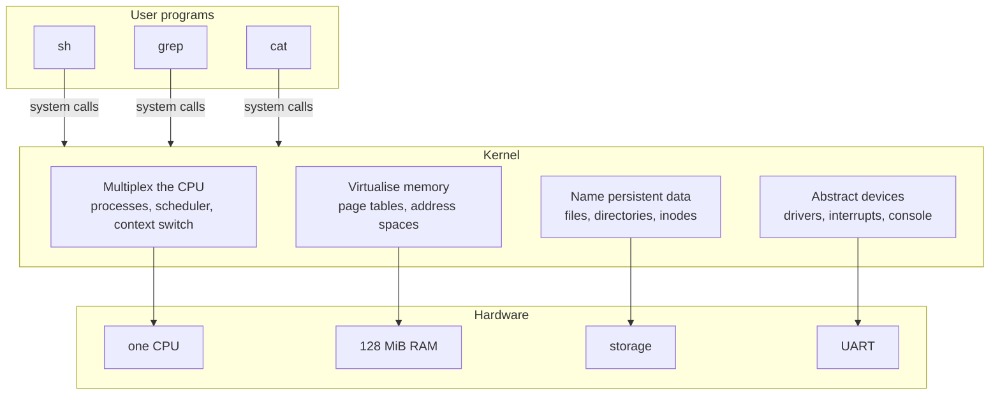
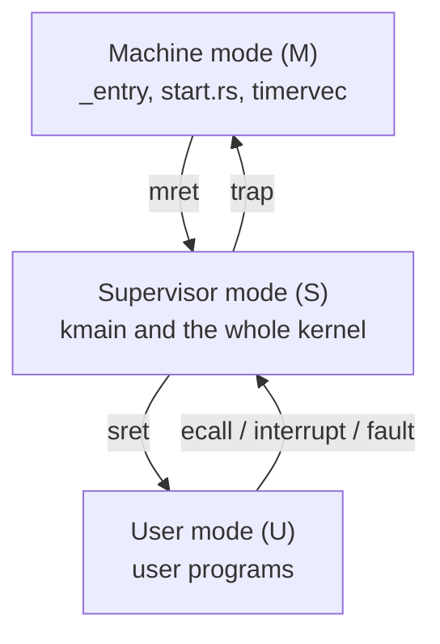

# Building an Operating System

## Overview

This is the first session of a course whose deliverable is an operating system.
Not a report about one, not a simulation: `rv6`, a small Unix-like kernel for
64-bit RISC-V, written in Rust, which by December boots on an emulated machine
and runs a shell in user mode. We do three things. First, define what an
operating system *is* by the four jobs it does — multiplex the CPU, virtualise
memory, name persistent data, abstract devices — every one of which you implement
rather than read about. Second, walk the rv6 arc end to end, from an empty crate
that merely compiles to a shell running user programs, so the semester's shape is
visible on day one. Third, cover the machinery: why Rust, how OSlings releases
and collects your work, and why all programming happens in the room. Then you
start [Lab 00 — Setup](../assignments/lab00-setup.md).

## Learning Objectives

- **Define** an operating system by the four jobs it performs rather than by a
  list of products.
- **Map** each job onto the rv6 subsystem and exercise that implements it.
- **Distinguish** RISC-V's machine, supervisor, and user privilege modes, and
  state which parts of rv6 run in each.
- **Order** the semester's kernel milestones and explain why each is blocked by
  the one before it.
- **Explain** the memory-safety argument for a kernel in Rust, and state what
  `unsafe` does and does not promise.
- **Describe** the OSlings release-and-submit model, and why an unfinished
  exercise cannot cascade.
- **Calculate** page counts and address ranges from the `virt` memory layout.

## Prerequisites

- Comfort with a Unix shell: `cd`, `ls`, editing a file, running a command.
- Programming experience in *some* language. **No prior Rust is assumed**; the
  language is taught in context starting Thursday.
- **No prior operating-systems knowledge is assumed.** Every term is defined
  where it first appears.
- A laptop running macOS, Linux, or WSL2, and a GitHub account — see the
  [Dev Setup guide](../guides/dev-setup.md).
- The [syllabus](../syllabus.md), especially grading and integrity, and the
  [Using OSlings guide](../guides/oslings-usage.md), skimmed.

---

## 1. What an Operating System Is

Ask ten people what an operating system is and you get ten lists: Linux, macOS,
Windows, Android. That is a list of examples, not a definition, and it is useless
for building one. A better definition asks what must be true for two programs to
run on one computer without either knowing the other exists.

A bare computer offers exactly one of everything: one instruction stream, one
span of physical memory, one disk, one serial port, and a program written for it
owns all of that. Add a second program and every singular resource must be
shared — invisibly, since your editor must not be written differently because a
compiler happens to be running. The operating system maintains that illusion,
through four jobs.



### 1.1 Multiplex the CPU

There is one CPU and many programs that would like to run. The kernel runs one
for a few milliseconds, takes the CPU away, and gives it to another, fast enough
that a human perceives all of them as running at once. Three mechanisms are
required. A **process** is the kernel's record of one running program: registers,
memory, open files, state. A **context switch** saves one process's registers and
restores another's — it cannot be written in Rust at all, because Rust gives you
no way to say "save every register", so it is the one place the course drops into
assembly. A **scheduler** picks who runs next.

The forcible part matters: a program that never yields must still be interrupted,
and only hardware can do that — a **timer interrupt**, arriving whether or not
the running program consents. That is why preemptive multitasking needs hardware
support and cooperative multitasking does not.

> **Key distinction:** *concurrency* is many things in progress at once;
> *parallelism* is many things executing at the same instant. rv6 runs on one
> emulated CPU, so it gives concurrency without parallelism. Every hard problem
> in this course — races, locks, deadlock — appears with one CPU; more CPUs make
> them more frequent, not more possible.

### 1.2 Virtualise Memory

There is one physical memory and its addresses are real: RAM occupies
`0x8000_0000` to `0x8800_0000` (`memlayout.rs:10`, `:13`). If two programs both
use address `0x1000`, and `0x1000` names one physical location, they corrupt each
other.

The fix is hardware. An **MMU** (memory management unit) sits between the CPU and
memory and rewrites every address the CPU issues. Program addresses are
**virtual**; the MMU translates them to **physical** ones through a table the
kernel builds, in fixed-size chunks called **pages** — 4096 bytes on RISC-V
(`memlayout.rs:7`). That table is a tree of pages, and one entry in it, a **page
table entry** (PTE), packs a physical page number with permission bits:

```rust
pub const PTE_V: usize = 1 << 0;  // valid
pub const PTE_R: usize = 1 << 1;  // readable
pub const PTE_W: usize = 1 << 2;  // writable
pub const PTE_X: usize = 1 << 3;  // executable
pub const PTE_U: usize = 1 << 4;  // reachable from user mode

impl Pte {
    pub const fn new(pa: usize, flags: usize) -> Pte {
        Pte(((pa >> 12) << 10) | flags)
    }
}
```

That is `vm.rs:17`–`:32`. Five bits and a shift. `PTE_U` — one bit — is the whole
wall between a user program and the kernel: a page without it is invisible to
user code, and touching it faults. You build the tree in `ex03` and turn the MMU
on in `ex09` ([Sv39 Paging](../guides/sv39-paging.md)).

Something must hand out physical pages first: the **page allocator**, 46 lines,
whose trick is where the course stops being ordinary programming:

```rust
pub unsafe fn kfree(pa: *mut u8) {
    let r = pa as *mut Run;
    (*r).next = FREELIST;
    FREELIST = r;
}
```

`kalloc.rs:34`. The free list has no storage of its own: each free page stores
the pointer to the next *inside itself*. There is nowhere else to put it, because
the allocator is what you would have had to ask for memory.

### 1.3 Name Persistent Data

Memory is addresses; a disk is numbered blocks. Neither is a name a human can
use. The third job imposes directories and files on undifferentiated storage, so
a program can say `/notes.txt` instead of "block 4,192". The core abstraction is
the **inode**: one file's kind, size, and contents, under a number. A
**directory** is a file whose contents are (name, inode number) pairs:

```rust
pub struct Inode {
    kind: InodeKind,      // Free, File, or Dir
    size: usize,
    data: [u8; FILESIZE],
    entries: [DirEnt; NDIRENT],
}
```

`fs.rs:50`. rv6's filesystem lives in RAM, so files do not survive a reboot — a
scope cut, since surviving power loss needs a block driver, a buffer cache, and a
log. Everything *above* the storage layer is yours to write, in `ex10`, `ex20`.

### 1.4 Abstract Devices

The last job is to talk to hardware and then hide it. A serial port is not a
stream of bytes; it is registers at fixed physical addresses. rv6's UART sits at
`0x1000_0000` (`memlayout.rs:17`); its driver is 71 lines. Sending a byte means
waiting for a status bit, then storing:

```rust
pub fn putc(c: u8) {
    while !tx_ready() {}
    unsafe { reg_write(THR, c) }
}
```

`uart.rs:48`. Every `println!` you have ever written bottoms out in something
like this. `read` and `write` work on a keyboard, a file, and a pipe alike
because the kernel puts one interface — the **file descriptor** — over
non-uniform hardware.

### 1.5 Where You Build Them

| Job | rv6 source | Exercises |
|---|---|---|
| Multiplex the CPU | `proc.rs`, `swtch.rs`, `sched.rs` | `ex04`–`ex06`, `ex21` |
| Virtualise memory | `kalloc.rs`, `vm.rs` | `ex02`, `ex03`, `ex09` |
| Name persistent data | `fs.rs`, `file.rs` | `ex10`, `ex17`, `ex20` |
| Abstract devices | `uart.rs`, `plic.rs`, `console.rs` | `ex11`, `ex14`, `ex15` |

Everything else — traps, locks, system calls, `fork`, `exec` — serves one of
these four.

---

## 2. The Machine Underneath

### 2.1 RISC-V and QEMU

rv6 targets **RISC-V**, an open instruction set architecture, in its 64-bit form.
The target triple is `riscv64gc-unknown-none-elf`: 64-bit RISC-V, general and
compressed extensions, no vendor, and — the important part — **no operating
system**. `unknown-none` means nothing is beneath you.

We run on **QEMU**'s `virt` machine, a board that exists only in software. Not a
compromise: an emulated machine can be stopped mid-instruction and inspected in
ways no physical board permits ([QEMU and GDB](../guides/qemu-gdb.md)), and your
kernel is a real RISC-V ELF that would boot on silicon. Its address space is
flat, with hardware nailed to fixed addresses:

```text
  0x0000_0000  +-------------------------------+
               |  boot ROM, test finisher      |  0x0010_0000  power off
  0x0200_0000  |  CLINT   — timer, soft irq    |
  0x0c00_0000  |  PLIC    — device interrupts  |
  0x1000_0000  |  UART0   — the serial console |
               |            ...                |
  0x8000_0000  +-------------------------------+  <- KERNBASE: RAM starts,
               |  the kernel is loaded here    |     and _entry runs here
               |  128 MiB of RAM               |
  0x8800_0000  +-------------------------------+  <- PHYSTOP
```

Those constants are `memlayout.rs:10`–`:27`, and the linker script sets
`. = 0x80000000` (`kernel.ld:16`) so the kernel's first byte lands where QEMU
jumps ([Memory Map](../guides/memory-map.md)).

> **Key distinction:** RAM and devices share one address space. `0x8000_0000` is
> memory; `0x1000_0000` is a serial port pretending to be memory, and storing a
> byte there transmits it. This is **memory-mapped I/O**, and it is why a wild
> pointer in a kernel can do things a wild pointer in an application cannot.

### 2.2 Three Privilege Modes

RISC-V defines three privilege levels. This is an orientation pass; L18 does the
mechanism, and the [RISC-V guide](../guides/riscv.md) has the registers.

| Mode | Who runs here | Can do |
|---|---|---|
| **Machine (M)** | firmware, and a few dozen lines of rv6 | everything; no address translation |
| **Supervisor (S)** | the kernel | the MMU, traps, devices |
| **User (U)** | `sh`, `grep`, `cat` | ordinary instructions, only its own mapped pages |



The transitions are single instructions. `start.rs` sets a two-bit field in
`mstatus` to say "return to supervisor", points `mepc` at `kmain`, and executes
`mret` (`start.rs:30`, `:54`) — the moment rv6 stops being all-powerful. On the
way down it also delegates traps to supervisor mode (`start.rs:40`) and opens
physical memory to it (`:43`), or the new kernel could not work.

Going the other way, a user program requests a service with `ecall`, which
deliberately raises an exception; the kernel catches it, reads the request number
from `a7`, dispatches, and returns with `sret`. rv6's entire system call table is
nine numbers, and they are xv6's (`syscall.rs:21`–`:29`): `fork` 1, `exit` 2,
`wait` 3, `read` 5, `exec` 7, `getpid` 11, `open` 15, `write` 16, `close` 21.
Linux has around 350; the difference is surface area, not principle.

The ladder answers a question that otherwise seems circular: if the kernel
controls user programs, what controls the kernel? The hardware does, plus a
smaller, more privileged layer beneath. Only the bottom rung is unguarded — which
is why it is a few dozen lines.

---

## 3. The Semester: rv6 End to End

Read this once now; it will make more sense in October, which is why it is here
in August.

```mermaid
flowchart LR
    R["Module 1\nRust + Unix commands\nr00-r09, c00-c04, a00"]
    E0["ex00 no_std\na crate that compiles"]
    E1["ex01 boot\na kernel that prints"]
    E2["ex02 kalloc\na page allocator"]
    E3["ex03 paging\nSv39 page tables"]
    E4["ex04-06 processes\nPCB, swtch, scheduler"]
    E7["ex07-08 locks\nspinlock, semaphore, heap"]
    E9["ex09-12 boot to life\nMMU on, fs, uart, cargo run"]
    E13["ex13-15 traps\nM to S, timer, console"]
    E16["ex16-17 shell\na kernel-mode REPL"]
    E18["ex18-21 user mode\ntrampoline, exec, fd, fork"]
    E22["ex22 userland\na shell in user mode"]
    R --> E0 --> E1 --> E2 --> E3 --> E4 --> E7 --> E9 --> E13 --> E16 --> E18 --> E22
```



Nothing in that chain is reorderable: a stack before any Rust runs, an allocator
before page tables (which are made of pages), a complete kernel page table before
`satp` can be written, a supervisor kernel before anything can trap into it,
traps before `ecall` means anything. Three things are worth saying out loud.

**Module 1 comes first for a reason.** Weeks 1–4 boot nothing: ten Rust exercises
(`r00`–`r09`) go from `let` bindings to raw pointers, five command labs
(`c00`–`c04`) build `echo`, `cat`, `wc`, `head`, and `grep` against a small I/O
library called `ulib`, and one assembly exercise (`a00`) introduces the RISC-V
registers and calling convention — all under `cargo test`. You should not fight
the borrow checker *and* the hardware at once.

**Two steps are abrupt, and both are one instruction.** `ex09` writes `satp` and
every address in flight changes meaning; `ex13` executes `mret` and the kernel
stops being all-powerful.

**You write the shell twice.** First inside the kernel (`ex16`), which is easy
because kernel code calls the filesystem directly. Then as an ordinary user
program with no privileges, talking to the kernel only through `ecall` (`ex22`) —
needing the trampoline, the trapframe, `fork`, `exec`, `wait`, and descriptors.

> **Key distinction:** the kernel shell is a *feature of the kernel*. The user
> shell is a *program the kernel runs*. Everything hard about operating systems
> lives in the gap between those two sentences.

---

## 4. Why Rust

xv6, the MIT teaching kernel this course descends from, is written in C. So is
Linux. The burden of proof is on Rust, and the honest argument is narrower than
the marketing.

### 4.1 The bugs a kernel actually has

Kernel C bugs cluster into a few shapes: use a pointer after the memory was
freed; write past a buffer; read a value another CPU is halfway through writing;
free the same page twice. In application code the OS catches these and kills the
process; in kernel code there is nothing beneath you. A use-after-free in the
page allocator does not crash — it silently hands the same physical page to two
processes, and the symptom appears ten minutes later somewhere unrelated.

Rust's ownership and borrowing rules make most of that class a **compile error**.
Each value has one owner; when the owner goes out of scope the value is gone; you
may have many shared references or one mutable reference, never both. All at
compile time, at zero runtime cost — L03's subject, and the
[Rust for Systems guide](../guides/rust-for-systems.md) covers it.

### 4.2 The `unsafe` argument, with numbers

A kernel must do things the rules forbid: dereference an address the hardware
told you about, write a UART register, treat a fresh page as a list node. Rust's
answer is not to relax the rules but to make you mark where you step outside.

What `unsafe` means is often misstated. It does not disable the borrow checker,
does not turn off type checking, and does not mean "trust me". It means **"the
compiler cannot verify this one; I have checked it."** Its value is that it is
*greppable*: when the kernel corrupts memory, the places that could have done it
are the `unsafe` blocks — a searchable list, not the whole program.

The claim is usually 90/10. Here is the measurement on the reference rv6 (24
modules, ~3,100 lines of code, 101 occurrences of the keyword):

| Module | Lines | `unsafe` occurrences |
|---|---|---|
| `fs.rs` — the filesystem | 277 | 0 |
| `shell.rs` — the shell | 373 | 1 |
| `sched.rs` — scheduling policy | 30 | 0 |
| `vm.rs` — page tables | 419 | 15 |
| `uart.rs` — the device driver | 71 | 9 |

Six of the twenty-four modules contain not one occurrence. The filesystem — a
real subsystem with paths, directories, and error handling — is ordinary safe
Rust, and the unsafety concentrates where you would predict. That is the
argument. Not that Rust makes kernel programming safe, but that it makes the
unsafe part *small and labelled* instead of coextensive with the program.

### 4.3 What Rust does not fix

- A logic error in your page table is a valid Rust program that maps the wrong
  page. The borrow checker has no opinion.
- Deadlock is memory-safe. Two threads politely waiting forever violate no rule.
- Races between the kernel and *hardware* are outside the model entirely.
- `unsafe` code you got wrong is exactly as dangerous as C.

Rust removes one historically dominant category of bug and leaves every
conceptual difficulty of operating systems intact — and those difficulties are
the actual subject of the course.

---

## 5. How the Course Runs

### 5.1 OSlings, and three commands per session

Exercises arrive through **OSlings**, a command-line tool in the style of
Rustlings. Each has the same rhythm — *Learn*, *Understand*, *Implement* (fill in
`IMPLEMENT` markers until the test is green) — and a real test: some pass when
the kernel compiles for `riscv64gc-unknown-none-elf`, others when it boots in
QEMU and prints `OSLINGS:PASS` on the serial console (`main.rs:109`). Grading
re-runs that test against your committed snapshot on a rebuilt kernel, so editing
local state does not produce a pass.

```bash
oslings update      # receive the exercise this session releases
oslings             # read the lesson, write the code, watch the test
oslings submit      # commit and push, pass or fail
```

The last is the habit to build. There is no homework, so that commit is the only
record that you were in the room, and attendance is computed from it. A submitted
but unfinished exercise earns substantial credit; one never submitted earns
nothing. The two-remote model is in
[Git and Submission](../guides/git-and-submission.md).

### 5.2 Nothing cascades

**Every exercise starts from the reference completed code for all previous
exercises.** If you do not finish `ex04`, `ex05` still opens on a working process
table; if you miss a week, the next Tuesday begins from a kernel that boots. Your
own work is never lost either — it is archived under `my-work/`, and
`oslings goto <exercise>` restores it. Two lines run in parallel all semester:
the reference kernel each exercise opens on, and your own version of every
exercise, kept on disk beside it.

A missed exercise costs you that exercise. It cannot cost you the semester. The
lowest two scores in each module are dropped automatically — illness, interviews,
and the session where the toolchain refused all come out of that one budget.

### 5.3 Why the work happens in the room

rv6 is modeled on xv6 and on Octox, a Rust xv6 for RISC-V. Both are public on
GitHub, therefore both are in the training data of every large language model,
and any model will emit a working `walk()` or `swtch` instantly with a plausible
explanation attached. Pretending otherwise would be silly, so the course is
arranged so the question does not arise:

- **Exercises are released at the start of the session that works them.** An
  unreleased exercise is not date-locked or permission-gated; it exists in no
  commit you can fetch. Nothing to pre-solve, because nothing is there.
- **You work it in the room, on your keyboard**, with the instructor and TA
  present.
- **During a session there is no Internet and no AI assistant.** The lab network
  reaches GitHub and the package registry, because `oslings` and `cargo` need
  them, and nothing else. What you have is the lecture notes, the guides,
  `oslings hint`, the compiler, and the two of us.
- **Outside a session, use AI freely to learn** — explain a concept, walk
  through code you are reading, decode a compiler error, generate practice
  problems. That is where your preparation should happen and it is encouraged.
- **Do not hand your code to a classmate**, in either direction, including
  "just to look at".

The test is whether you can explain what you submitted; the TA may ask
([Integrity Policy](../guides/integrity-policy.md)). The deeper reason is not
enforcement: the exams are on paper, closed book, and ask you to trace registers
through a context switch and decode a PTE by hand. There is no version of this
course where copying in September helps in December.

---

## 6. The Payoff

In week 4 you write `grep`, on your laptop, under `cargo test`. It is 106 lines
(`commands/src/bin/grep.rs`), does substring search, and exits 0 when something
matched, 1 when nothing did, 2 on error — a Unix command's exit status is part of
its output. In December that same source file — not a port of it, the same file —
runs on the kernel you finished. The seam is `ulib`, whose two backends are
selected by the target triple rather than a feature flag:

```text
   commands/src/bin/grep.rs           <- one file, written in week 4
              |
            ulib
         /         \
   host backend    rv6 backend
   (std: read,     (ecall: your
    write)          syscalls)
        |               |
   your laptop      YOUR KERNEL
   cargo test       ex22, December
```

`ulib/src/lib.rs:19` chooses with `#[cfg(target_os = "none")]`, derived from the
triple you pass to cargo, so the choice cannot disagree with what you are
building ([ulib and Commands](../guides/ulib-and-commands.md)).

So `grep foo notes.txt`, typed at a `$` prompt, in a shell that is a user
process, `fork`ed and `exec`ed by another user process, on a kernel that boots
itself into supervisor mode, allocates its own pages, builds its own page tables,
schedules its own processes, and services its own interrupts — every layer of
which you wrote — is what this course is for.

That is fifteen weeks away. Today's job is smaller: get the toolchain working
and push one commit, in [Lab 00 — Setup](../assignments/lab00-setup.md). If
something breaks, the people who can fix it are in the room.

---

## Key Concepts

| Concept | Definition | Example |
|---|---|---|
| **Kernel** | The part of an OS that runs privileged, with direct hardware access | rv6 is a kernel; `sh` is not |
| **Process** | The kernel's record of one running program | `struct Proc`, `proc.rs:27` |
| **Context switch** | Saving one process's registers and restoring another's | `swtch`, in assembly, `ex05` |
| **Scheduler** | The policy choosing which runnable process runs next | `RoundRobin::pick_next`, `sched.rs:20` |
| **Page** | The fixed-size unit of memory management | 4096 bytes; `memlayout.rs:7` |
| **Page table entry** | A 64-bit word: a physical page number plus permission bits | `Pte::new(pa, PTE_R)`, `vm.rs:30` |
| **Privilege mode** | The hardware's current authority level: M, S, or U | `mret` drops M to S, `start.rs:54` |
| **Trap** | Any forced transfer of control into the kernel | Exception, interrupt, or `ecall`; `trap.rs:46` |
| **System call** | A user program's request for a kernel service, via `ecall` | `SYS_WRITE = 16`, `syscall.rs:28` |
| **`unsafe`** | A marker: the compiler cannot verify this, and you have | `unsafe { reg_write(THR, c) }`, `uart.rs:50` |
| **Inode** | The record describing one file: kind, size, contents | `struct Inode`, `fs.rs:50` |
| **File descriptor** | A small integer the kernel maps to an open file | `STDOUT = 1`, `ulib/src/lib.rs:41` |

---

## Practice Problems

### Problem 1: Classify the behaviour

Name which of the four OS jobs is responsible for each behaviour, and which rv6
module implements it.

```text
 1. Two copies of grep run at once and neither notices the other.
 2. A program writes to address 0x0 and is killed; the machine keeps running.
 3. cat notes.txt finds the bytes it wrote a minute ago, under that name.
 4. A keystroke appears on screen, and the reading program does not know a
    UART exists.
 5. A program that calls no kernel function is taken off the CPU after 0.1 s.
```

<details>
<summary>Click to reveal solution</summary>

1. **Multiplex the CPU** — two `Proc` entries chosen in turn by the scheduler
   (`proc.rs`, `sched.rs`).

2. **Virtualise memory** — `0x0` has no valid PTE in that address space, so the
   MMU raises a page fault, arriving as a trap, and the kernel kills that process
   only (`vm.rs`, via `trap.rs`). The fault is survivable because the *hardware*
   noticed, not the program.

3. **Name persistent data** — the path resolves through a directory's `DirEnt`
   array to an inode number, and the inode holds the bytes (`fs.rs`). In rv6
   "persistent" stops at reboot; the filesystem is in RAM.

4. **Abstract devices** — `uart.rs` knows the Line Status Register, `console.rs`
   turns bytes into a stream, `file.rs` makes it look like `read(0, ...)`.

5. **Multiplex the CPU, via abstract devices** — the timer is hardware
   (`start.rs:59`, via the CLINT). It fires whatever the program is doing, and
   the handler can force a reschedule: preemptive, not cooperative.

</details>

### Problem 2: Trace the privilege mode

The machine has just been reset. Give the CPU's privilege mode immediately
*after* each event, and name what caused any change.

```text
 (a) QEMU jumps to _entry at 0x8000_0000
 (b) _entry executes `call start`
 (c) start executes `csrw mepc, t0` with t0 = &kmain
 (d) start executes `mret`
 (e) kmain writes satp and executes sfence.vma
 (f) the kernel executes `sret` to launch a user program
 (g) the user program executes `ecall`
 (h) the timer fires while the user program is running
```

<details>
<summary>Click to reveal solution</summary>

| | Mode after | Cause |
|---|---|---|
| (a) | **Machine (M)** | Reset begins in the most privileged mode. |
| (b) | **M** | No change — only trap and return-from-trap instructions change privilege. |
| (c) | **M** | No change — a CSR write sets up a *future* transition. |
| (d) | **Supervisor (S)** | `mret` returns to the mode in `mstatus.MPP`, set to supervisor at `start.rs:30`, at the address in `mepc`. |
| (e) | **S** | No change — the MMU changes what addresses *mean*, not who you are. |
| (f) | **User (U)** | `sret` returns to the mode in `sstatus.SPP`. Symmetric with `mret`, one rung lower. |
| (g) | **S** | `ecall` raises an exception, delegated to S by `medeleg` (`start.rs:40`). The *program* did not become privileged; it asked, and the kernel's code runs. |
| (h) | **M**, then **S** | `timervec` runs in M (`start.rs:84`), reschedules the tick, and raises a supervisor software interrupt; `kerneltrap` then runs in S. |

The pattern: privilege *decreases* only by explicit instruction (`mret`, `sret`)
and *increases* only by trap. That asymmetry is the entire security model.

</details>

### Problem 3: What the compiler rejects

A page-allocator bug, written twice. In C:

```c
void *p = kalloc();
kfree(p);
memset(p, 0, 4096);     /* line 3 */
```

The nearest Rust equivalent, using an owning type:

```rust
let page: Box<[u8; 4096]> = Box::new([0; 4096]);
drop(page);
page[0] = 1;            // line 3
```

(a) What is the bug called? (b) Which line does the Rust compiler reject, and
why? (c) Why does the C version usually appear to work? (d) rv6's real `kfree`
takes a `*mut u8` (`kalloc.rs:34`), which the borrow checker does *not* track.
Does that make the Rust argument worthless?

<details>
<summary>Click to reveal solution</summary>

**(a)** A **use-after-free**: memory returned to the allocator, then written
through the stale pointer.

**(b)** Line 3. `drop(page)` **moves** `page` into `drop`, which consumes it;
after a move the binding is dead. The compiler reports *"borrow of moved value:
`page`"* and points at the `drop` as the move site — a compile error, not a lint
and not a runtime check.

**(c)** `kfree` writes only the first 8 bytes of the page (the `next` pointer),
so zeroing corrupts exactly one pointer in a structure nobody reads until the
*next* `kalloc`. The symptom surfaces later, in a different subsystem, under
different load — the shape of a kernel memory bug: silent at the scene, loud
somewhere unrelated.

**(d)** No, but the argument must be stated correctly. Ownership does not apply
to raw pointers, so `kalloc`/`kfree` are `unsafe fn` and get no protection. What
you gain is a *boundary*: the 277 lines of `fs.rs` and 373 of `shell.rs` above
the allocator contain, between them, exactly one `unsafe`. In C every line above
the allocator is a suspect when the free list is corrupt; in Rust the suspects
are the `unsafe` blocks. Rust does not make `kalloc.rs` safe — it makes
`kalloc.rs` the *only* thing you must audit.

</details>

### Problem 4: Order the semester

These milestones are shuffled. Put them in the only order in which each is
possible, then justify the three orderings named below.

```text
  A. build the kernel's page table and write satp (MMU on)
  B. write a page allocator (kalloc)
  C. switch from machine mode to supervisor mode
  D. print a character to the UART
  E. context-switch between two processes
  F. run a program in user mode
  G. set up a stack in assembly and call Rust
```

Justify: (i) B before A, (ii) G before D, (iii) C before F.

<details>
<summary>Click to reveal solution</summary>

The order is **G → D → B → C → A → E → F**. (C could come earlier — rv6 defers it
to `ex13` — but it must precede A wherever the MMU is meant to have real effect,
and must precede F absolutely.)

**(i) B before A.** An Sv39 page table is a tree whose nodes are 4096-byte pages,
and `walk` allocates an interior node the moment it finds an invalid entry:

```rust
let page = kalloc::kalloc();          // vm.rs:62
ptr::write_bytes(page, 0, PGSIZE);
*pte = Pte::new(page as usize, PTE_V);
```

You cannot build the structure that manages memory before you can obtain a page
of memory. The allocator is beneath the page table, not beside it.

**(ii) G before D.** `uart::puts` is a Rust function, and every Rust function
needs a valid stack pointer for its prologue; at reset `sp` holds whatever was
there. So the first work after reset is assembly pointing `sp` at real memory —
`entry.rs:19`–`:23` does that and nothing else before `call start`. Printing is
not the first thing a kernel does; having somewhere to put a return address is.

**(iii) C before F.** User mode is entered with `sret`, a supervisor instruction;
nothing in machine mode drops two rungs at once. And `ecall` from user mode must
be delegated to supervisor mode (`start.rs:40` writes `medeleg`), which only
machine mode can arrange. Each step is blocked by whatever provides its
substrate: stack before code, memory before structures over memory, privilege
before the thing that must be less privileged.

</details>

### Problem 5: Sizing the allocator

RAM runs from `KERNBASE = 0x8000_0000` to `PHYSTOP = KERNBASE + 128 MiB`, with
`PGSIZE = 4096`.

(a) What is `PHYSTOP` in hex? (b) How many pages does the region contain?
(c) `kalloc::init` starts at the linker symbol `end` rather than `KERNBASE`
(`kalloc.rs:22`). Why? (d) If the kernel image occupies 76 KiB, how many pages
does `free_range` add? (e) How many bytes of *additional* memory does the free
list itself consume? (f) The process table has 64 slots (`param.rs:7`). If each
process needs one code page, one stack page, one trapframe, one kernel stack, and
three page-table pages, do 64 fit?

<details>
<summary>Click to reveal solution</summary>

**(a)** 128 MiB = `0x800_0000`, so `PHYSTOP = 0x8000_0000 + 0x0800_0000 =`
**`0x8800_0000`**.

**(b)** `0x0800_0000 / 0x1000 = 0x8000 =` **32,768 pages**.

**(c)** Because the kernel's own image — code, rodata, `.bss`, including the
16 KiB boot stack — is loaded at `0x8000_0000` and is still there. `end`
(`kernel.ld:43`) is one past the kernel's last byte; freeing below it would put
the kernel's own instructions on the free list, and the first `kalloc` would hand
out the code that is executing.

**(d)** 76 KiB = 19 pages exactly, so `end` = `0x8001_3000`, already
page-aligned: 32,768 − 19 = **32,749 pages**. At 76.5 KiB, `pgroundup`
(`kalloc.rs:17`) would round up to 32,748 — the partial page is dropped, never
split.

**(e) Zero.** `Run` is a single `*mut Run` (`kalloc.rs:6`) and `kfree` writes it
into the first 8 bytes *of the page being freed*. A list with separate node
storage would need somewhere to allocate those nodes, and the only allocator
available is the one being built.

**(f)** 7 pages each; 64 × 7 = 448 pages = 1.75 MiB against 32,749 available —
**comfortably**, about 1.4% of RAM. The cap of 64 is for predictability, not
capacity: a fixed-size array on the core path means process creation cannot fail
in a new way under pressure.

</details>

---

## Further Reading

**Course materials**

- [Lab 00 — Setup](../assignments/lab00-setup.md) — the exercise this session unlocks
- [Syllabus](../syllabus.md) — grading, drops, and the integrity policy in full
- [Dev Setup](../guides/dev-setup.md) — toolchain, QEMU, troubleshooting
- [Using OSlings](../guides/oslings-usage.md) — the app, hints, `goto`, difficulty
- [Git and Submission](../guides/git-and-submission.md) — the two-remote model
- [rv6 Architecture](../guides/rv6-architecture.md) — every module and how they fit
- [Exercise list](../assignments/exercises.md) — all 38 exercises with their sessions
- [Key Concepts](../guides/key-concepts.md), [Cheatsheet](../guides/cheatsheet.md) — the cheatsheet is the one reference permitted in exams

**External**

- Cox, Kaashoek, and Morris, *xv6: a simple, Unix-like teaching operating system*
  (MIT). Chapter 1 is the best short statement of the four jobs.
  <https://pdos.csail.mit.edu/6.828/2023/xv6/book-riscv-rev3.pdf>
- Octox — an xv6-inspired Unix-like OS in Rust, rv6's structural reference.
  <https://github.com/o8vm/octox>
- *The RISC-V Instruction Set Manual, Volume II: Privileged Architecture*, §2.
  <https://riscv.org/technical/specifications/>
- *The Rust Programming Language*, chapters 3–4, for §4's ownership material.
  <https://doc.rust-lang.org/book/>
- Ritchie and Thompson, "The UNIX Time-Sharing System" (1974) — sixteen pages.

---

## Summary

1. **An operating system is defined by four jobs, not a product list.**
   Multiplex the CPU, virtualise memory, name persistent data, abstract devices.
   Every abstraction you have used is one of those four wearing a name.

2. **You implement all four.** Page allocator `ex02`, page tables `ex03`,
   processes and scheduler `ex04`–`ex06`, filesystem `ex10`, driver `ex11`.

3. **Three privilege modes, and the ladder is the security model.** Privilege
   drops by explicit instruction (`mret`, `sret`) and rises only by trap. There
   is nothing a user program can execute that simply makes it privileged.

4. **The semester has a forced dependency order.** Stack before Rust code,
   allocator before page tables, supervisor mode before user mode, traps before
   system calls.

5. **Rust is chosen because it makes the unsafe part small and labelled.** Six of
   rv6's twenty-four modules contain no `unsafe` at all, including the 277-line
   filesystem. `unsafe` marks what the compiler could not verify; it does not
   disable it.

6. **Rust fixes memory safety and nothing else.** Deadlock, wrong mappings, and
   races with hardware are all valid Rust — and they are the actual subject of
   the course.

7. **All work happens in class, and nothing cascades.** Exercises are released at
   the session that works them, so there is nothing to pre-solve, and each opens
   on the reference kernel, so a missed exercise costs that exercise and nothing
   more. Run `oslings submit` every session, red or green.

8. **The destination is concrete.** The `grep` you write in week 4 is the same
   source file that runs, unmodified, on the kernel you finish in week 15 —
   through your shell, on your processes, over your file descriptors.
