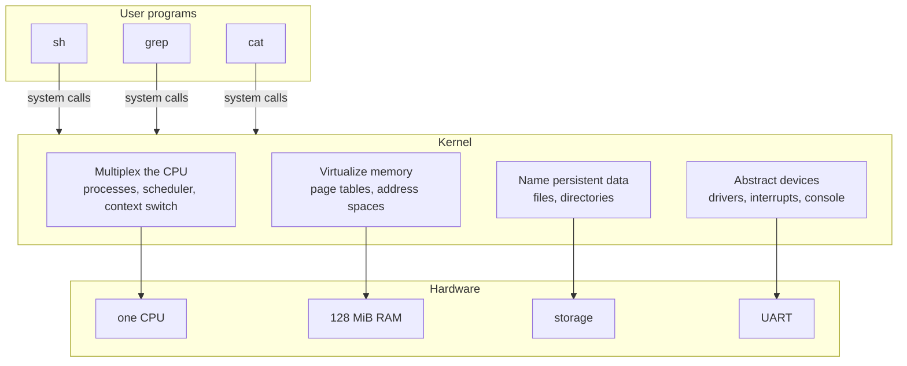
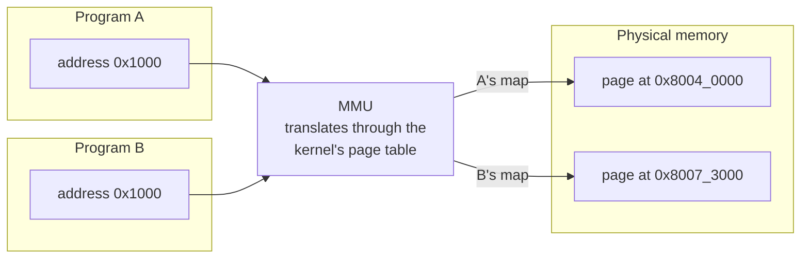
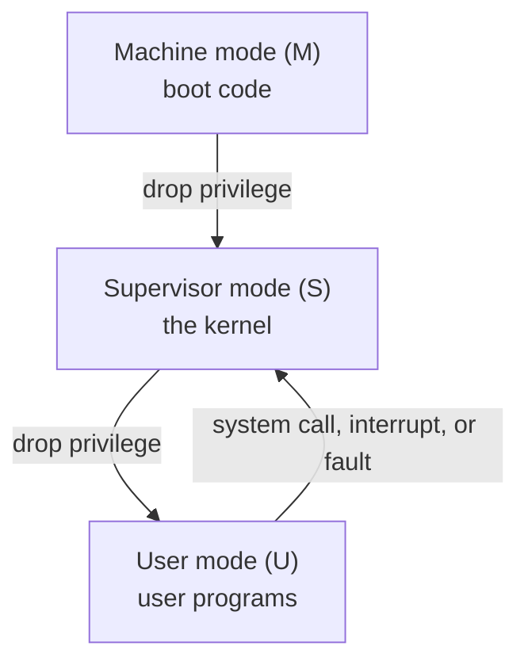

# Building an Operating System

## Overview

This is the first session of a course whose deliverable is an operating system.
Not a report about one, not a simulation: `rv6`, a small Unix-like kernel for
64-bit RISC-V, written in Rust, which by December boots on an emulated machine
and runs a shell in user mode — and the programs that shell runs are programs
you wrote in September. Today defines what an operating system *is* by the four
jobs it does — multiplex the CPU, virtualize memory, name persistent data,
abstract devices — every one of which you build rather than read about; walks
the semester end to end; makes the case for Rust and for why a kernel needs a
way to step outside Rust's rules; and explains how this course runs: Tuesday is
lecture, Thursday and Friday are exercise sessions where every line of code is
written in the room. There is no coding today. Thursday is the
[setup session](../assignments/setup.md); bring a laptop.

## Learning Objectives

- **Define** an operating system by the four jobs it performs rather than by a
  list of products.
- **Map** each job onto the part of rv6 you will build.
- **Distinguish** RISC-V's three privilege modes at a high level, and state why
  a user program cannot make itself privileged.
- **Order** the semester's two modules, and say why the kernel must be built in
  a fixed sequence.
- **Explain** why a kernel needs a mechanism like `unsafe` and why Rust is
  still the right choice for one.
- **Describe** how a session runs — prep, in-class exercise, submit — and what
  to do before Thursday.

## Prerequisites

- **CS 315 Computer Architecture:** C, RISC-V assembly, a RISC-V emulator in C.
  You are expected to *review* that material as it comes up, not to have it
  memorized. **No Rust and no operating-systems knowledge is assumed.**
- Comfort with a Unix shell: `cd`, `ls`, editing a file, running a command.
- A laptop running macOS, Linux, or WSL2, and a GitHub account — see
  [Dev Setup](../guides/dev-setup.md).
- The [syllabus](../syllabus.md), skimmed, especially grading and integrity.

---

## 1. What an Operating System Is

Ask ten people what an operating system is and you get ten lists: Linux, macOS,
Windows, Android. That is a list of examples, not a definition, and it is useless
for building one. A better definition asks what must be true for two programs to
run on one computer without either knowing the other exists.

A bare computer offers exactly one of everything: one instruction stream, one
span of memory, one disk, one serial port. Add a second program and every
singular resource must be shared — invisibly, since your editor must not be
written differently because a compiler happens to be running. The operating
system maintains that illusion, through four jobs.



### 1.1 Multiplex the CPU

One CPU, many programs. The kernel runs one for a few milliseconds, takes the
CPU away, and gives it to another, fast enough that a human sees all of them
running at once. A **process** is the kernel's record of one running program:
registers, memory, open files, state. A **context switch** saves one process's
registers and restores another's — the one place in the course where we drop
into assembly, because saving *every* register is something only assembly can
say. A **scheduler** picks who runs next.

The forcible part matters: a program that never yields must still be
interrupted, and only hardware can do that — a **timer interrupt**, arriving
whether or not the program consents. That is why preemptive multitasking needs
hardware and cooperative multitasking does not.

> **Key distinction:** *concurrency* is many things in progress at once;
> *parallelism* is many things executing at the same instant. rv6 runs on one
> emulated CPU, so it gives concurrency without parallelism. Every hard problem
> in this course — races, locks, deadlock — appears with one CPU; more CPUs make
> them more frequent, not more possible.

### 1.2 Virtualize Memory

There is one physical memory and its addresses are real. If two programs both
use address `0x1000`, and `0x1000` names one physical location, they corrupt
each other — and they cannot be asked to coordinate, because the point is that
they do not know about each other.

The fix is hardware plus a map the kernel maintains. An **MMU** (memory
management unit) sits between the CPU and memory and rewrites every address the
CPU issues. Program addresses are **virtual**; the MMU translates them to
**physical** ones through a table the kernel builds, in 4096-byte **pages**.



Each program gets its own map, so the same virtual address lands on different
physical pages, and an address with no entry cannot be reached at all. One bit
in each entry says whether user code may touch that page; pages without it
belong to the kernel and are invisible to programs. That single bit is the wall
between a program and the kernel — it is why a wild pointer in `grep` kills
`grep` rather than the machine. You build the map in `33k` and switch it on in
`39k`.

### 1.3 Name Persistent Data

Memory is addresses; a disk is numbered blocks. Neither is a name a human can
use. The third job imposes files and directories on undifferentiated storage, so
a program can say `/notes.txt` instead of "block 4,192".

```text
    what programs see                       what the storage offers

    /
    ├── notes.txt      "the cat sat"        block 0  block 1  block 2  block 3
    └── bin/                                block 4  block 5  block 6  block 7
        ├── grep                            block 8  block 9  ...
        └── cat
```

A **file** is a sequence of bytes under a name. A **directory** is a file whose
contents are names pointing at other files. The kernel keeps the map from names
to bytes. rv6's filesystem lives in RAM — files do not survive a reboot — a
deliberate scope cut, since surviving power loss needs a block driver, a cache,
and a log. You build it in `40k`.

### 1.4 Abstract Devices

The last job is to talk to hardware and then hide it. A serial port is not a
stream of bytes; it is a handful of registers at a fixed physical address, and
sending a character means waiting for a status bit and then storing to one of
them. Every `println!` you have ever written bottoms out there.

The kernel hides it: `read` and `write` work on a keyboard, a file, and a pipe
alike because the kernel puts one interface — the **file descriptor** — over
hardware that has nothing in common. You write the console driver in `45k` and
the file-descriptor layer in `50k`. Everything else in a kernel — traps, locks,
system calls, `fork`, `exec` — serves one of these four jobs.

---

## 2. The Machine Underneath

### 2.1 RISC-V and QEMU

rv6 targets **RISC-V**, the open instruction set you met in CS 315, in its
64-bit form, and runs on **QEMU**'s `virt` machine, a computer that exists only
in software. You have built the small version of this idea: the emulator you
wrote in CS 315 executed RISC-V instructions in C. QEMU is the same idea at full
fidelity — a whole machine with a timer, an interrupt controller, a serial port,
and 128 MiB of RAM, all at fixed addresses in one address space
([Memory Map](../guides/memory-map.md)). It is not a compromise: an emulated
machine can be stopped mid-instruction and inspected in ways no physical board
permits, and your kernel is a real RISC-V executable that would boot on silicon.

> **Key distinction:** RAM and devices share one address space. One address is
> memory; another is a serial port pretending to be memory, and storing a byte
> there transmits it. This is **memory-mapped I/O**, and it is why a wild
> pointer in a kernel can do things a wild pointer in an application cannot.

### 2.2 Three Privilege Modes

Most of your programming life has happened in one mode: running a program on
top of an operating system. The machine has more than one. RISC-V defines three
privilege levels, and the kernel's authority rests on them.

| Mode | Who runs here | Can do |
|---|---|---|
| **Machine (M)** | firmware, and a few lines of rv6 at boot | everything |
| **Supervisor (S)** | the kernel | the MMU, traps, devices |
| **User (U)** | `sh`, `grep`, `cat` — your programs | ordinary instructions, only its own pages |



The ladder has one rule. Privilege **decreases** only by an explicit
instruction that more-privileged code chooses to execute, and **increases**
only by a *trap* — an event that lands the CPU in the kernel's code, at the
kernel's chosen address. No instruction a user program can execute makes it
privileged. When a program wants something only the kernel can do, it *asks*,
with a **system call**, which is a deliberate trap. The kernel is the gatekeeper
for the hardware and the privileged instructions, and the hardware enforces it.
This is an orientation pass; L18 does the mechanism.

---

## 3. The Semester: rv6 End to End

Read this once now; it will make more sense in October.

```mermaid
flowchart LR
    R["Module 1\nRust, commands, bridges\n00r-21r"]
    E0["30k\na crate that compiles"]
    E1["31k boot\na kernel that prints"]
    E2["32k\na page allocator"]
    E3["33k\npage tables"]
    E4["34k-36k\nprocesses, switch,\nscheduler"]
    E7["37k-38k\nlocks"]
    E9["39k\nMMU on"]
    E10["40k-42k\nfiles, boot to life"]
    E13["43k-45k\ntraps, timer, console"]
    E16["46k\nkernel shell"]
    E18["48k\nuser mode"]
    E19["49k-53k\nexec, fds, fork,\nuser shell, your commands"]
    R --> E0 --> E1 --> E2 --> E3 --> E4 --> E7 --> E9 --> E10 --> E13 --> E16 --> E18 --> E19
```



**Module 1 — Rust, commands, and two bridges (Aug 27 – Oct 2).** Nothing
boots. Nine Rust exercises (`00r`–`08r`) go from `let` bindings to `Result`;
four command exercises (`10c`–`13c`) build `echo`, `cat`, `wc`, and `grep`
against a small I/O library called `ulib`; then two bridges to bare metal, one
in RISC-V assembly (`20a`) and one in `unsafe` Rust (`21r`). Everything runs on
your laptop under `cargo test`, except `20a`, the first thing to run in QEMU.
You should not fight the borrow checker *and* the hardware at once.

**Module 2 — the kernel (Oct 2 – Dec 4).** From an empty crate that compiles
(`30k`) to a shell running in user mode that launches the commands you wrote in
Module 1 (`52k`, `53k`). The chain is not reorderable: a stack before any Rust
runs, an allocator before page tables (which are made of pages), a supervisor
kernel before anything can trap into it, traps before a system call means
anything. Two steps are abrupt and each is a single instruction — turning the
MMU on in `39k`, and the moment in `43k` when the kernel gives up machine mode.

> **Key distinction:** you write the shell twice. First inside the kernel
> (`46k`), which is easy because kernel code calls the filesystem directly.
> Then as an ordinary user program with no privileges (`52k`), talking to the
> kernel only through system calls. The kernel shell is a *feature of the
> kernel*; the user shell is a *program the kernel runs*. Everything hard about
> operating systems lives in the gap between those two sentences.

Midterm 1 is Thursday, October 15; Midterm 2 is Thursday, November 19; the final
is in the registrar's slot, December 11–17.

---

## 4. Why Rust — and Why `unsafe` Exists

xv6, the MIT teaching kernel this course descends from, is written in C. So is
Linux. The burden of proof is on Rust, and the honest argument is narrower than
the marketing.

### 4.1 The bugs a kernel actually has

Kernel C bugs cluster into a few shapes: use a pointer after the memory was
freed; write past a buffer; read a value another CPU is halfway through writing;
free the same page twice. In application code the OS catches these and kills the
process; in kernel code there is nothing beneath you. A use-after-free in the
page allocator does not crash — it silently hands the same page to two
processes, and the symptom appears ten minutes later somewhere unrelated.

Rust's ownership and borrowing rules make most of that class a **compile
error**: each value has one owner; when the owner goes out of scope the value is
gone; you may have many shared references or one mutable reference, never both.
All at compile time, at zero runtime cost — next week's subject, and the
[Rust for Systems guide](../guides/rust-for-systems.md).

### 4.2 An operating system is special

Rust's rules assume a world beneath your program: an allocator that hands out
memory, a runtime that set up your stack, an operating system that makes
addresses mean something. A kernel *is* that world. It executes privileged
instructions that change what the machine does. It decides, explicitly, which
virtual addresses map to which physical pages, and writes that into hardware.
It builds its own allocator, because there is no one else to ask. Every one of
those acts is, by definition, something the compiler cannot check.

Rust's answer is not to relax its rules but to give you one mechanism for
stepping outside them: `unsafe`. Inside a block marked `unsafe` you may do what
a kernel must — dereference an address the hardware told you about, write a
device register, treat a fresh page as a list node — and *you* take
responsibility for its correctness. Everywhere else the full guarantees hold.
So the dangerous part of the kernel is small and labeled instead of being the
whole program, and when something corrupts memory, the places that could have
done it are a searchable list. That is the argument: not that Rust makes kernel
programming safe, but that it makes the unsafe part *small* — and you will see
exactly where the line is drawn, because you will draw it.

---

## 5. What You Bring from CS 315

More of this course rests on CS 315 than it looks like on day one. You wrote C,
with pointers; Rust's ownership rules are the same pointers with the discipline
made explicit and checked by the compiler, and when the borrow checker complains
in week two it is usually describing a bug you have already written in C. You
learned the RISC-V calling convention — which registers a function must save and
which it may clobber; the context switch in `35k` is that convention written out
as a dozen stores and loads. You treated addresses as numbers and wrote an
emulator that fetched and decoded; page tables are addresses with structure
imposed on them, and QEMU is your emulator grown up, running the kernel you
build. Expect to review, not to remember: the RISC-V guide and the cheatsheet
keep what you need one page away, and each lecture reintroduces a piece where
the kernel needs it.

---

## 6. How the Course Runs

rv6 is modeled on xv6 and on Octox, a Rust xv6 for RISC-V. Both are public,
therefore both are in the training data of every large language model, and any
model will emit a working page-table walk instantly. So the course is arranged
so that the question does not arise: **every line of code for this course is
written in class.**

**Tuesday** is lecture, ending with a short walk-through of the *Prep* page for
Thursday's exercise. **Thursday** (1h45) and **Friday** (1h30) are exercise
sessions: you work the day's exercise in the room, on the classroom network,
with the instructor and TA present. Before each session, read its **Prep**
page, linked from the schedule — what you will build, which lecture sections
and guides to reread, and a mental model, without the exercise itself. The
better prepared you are, the sooner you finish; that preparation is what your
time outside class is for.

At the start of each session you register your laptop with the CS 326 class
server on the classroom router; that is how the exercise reaches you. (The tool
is not ready yet — instructions will be given in class.) Then the rhythm is
three commands:

```bash
oslings update      # receive the exercise this session releases
oslings             # read the lesson, write the code, watch the test
oslings submit      # commit and push before you leave, passed or not
```

What is committed by the end of the session is what earns credit:

| | Score |
|---|---|
| The exercise's test is green in class | 100% |
| Finished afterwards, on your own, by the deadline | 75% |
| Substantial progress submitted in class | 50% |
| Nothing submitted | 0% |

The deadline for a Thursday exercise is Thursday at 11:59 pm; for a Friday
exercise, Monday at 11:59 pm — that keeps you current for the next session.
Each exercise comes with two hints; the third, the answer, is never released.
The reference solution arrives with the *next* exercise, after the deadline, so
you can compare it with what you wrote.

A session's rules: no Internet beyond what `oslings` and `cargo` need, and no
AI assistant — what you have is the lecture notes, the guides, `oslings hint`,
the compiler, and the two of us. **Outside a session, use AI freely to learn**:
explain a concept, walk through code you are reading, decode a compiler error.
Do not hand your code to a classmate, in either direction. The test is whether
you can explain what you submitted; the TA or instructor may ask.

Exercises are 50% of the grade (Module 1 20%, Module 2 30%); the two midterms
are 15% each and the final 20%; extra-credit exercises, small and released on
the relevant day, add up to 3%. Exams are on paper, closed book, with the
cheatsheet as the one permitted reference, and they ask you to trace and
explain, not to recall. There is no version of this course where copying in
September helps in December.

---

## 7. The Payoff

In week 5 you write `grep`, on your laptop, under `cargo test` (`13c`, Friday,
September 25). It does substring search and exits 0 when something matched, 1
when nothing did, 2 on error. On December 4 that same source file — not a port,
the same file — runs on the kernel you finished (`53k`). The seam is `ulib`,
whose two backends are selected by the target you compile for:

```text
   commands/src/bin/grep.rs           <- one file, written in week 5
              |
            ulib
         /         \
   host backend    rv6 backend
   (std: read,     (system calls into
    write)          YOUR kernel)
        |               |
   your laptop      your kernel
   cargo test       53k, December 4
```

So `grep foo notes.txt`, typed at a `$` prompt, in a shell that is a user
process (`52k`), on a kernel that boots itself into supervisor mode, allocates
its own pages, builds its own page tables, schedules its own processes, and
services its own interrupts — every layer of which you wrote — is what this
course is for.

That is fifteen weeks away. Thursday's job is smaller: get the toolchain
working and push one commit ([Setup](../assignments/setup.md)). If something
breaks, the people who can fix it are in the room.

---

## Key Concepts

| Concept | Definition | Example |
|---|---|---|
| **Kernel** | The part of an OS that runs privileged, with direct hardware access | rv6 is a kernel; `sh` is not |
| **Process** | The kernel's record of one running program | `struct Proc`, built in `34k` |
| **Context switch** | Saving one process's registers and restoring another's | `swtch`, in assembly, `35k` |
| **Scheduler** | The policy choosing which runnable process runs next | round robin, `36k` |
| **Page** | The fixed-size unit of memory management | 4096 bytes |
| **Page table** | The kernel's map from virtual to physical pages; one entry is a physical page plus permission bits | built in `33k`, switched on in `39k` |
| **Privilege mode** | The hardware's current authority level: M, S, or U | the kernel runs in S; `grep` runs in U |
| **Trap** | Any forced transfer of control into the kernel | an interrupt, a fault, or a system call; `43k` |
| **System call** | A user program's request for a kernel service, via a deliberate trap | `read`, `write`, `exec`; `48k` |
| **`unsafe`** | Rust's marked escape from strict memory safety, for the places a kernel must have it | writing a device register in `45k` |
| **File descriptor** | A small integer the kernel maps to an open file, device, or pipe | `1` is standard output; `50k` |

---

## Practice Problems

### Problem 1: Classify the behavior

Name which of the four OS jobs is responsible for each behavior, and which part
of rv6 will implement it.

```text
 1. Two copies of grep run at once and neither notices the other.
 2. A program writes to address 0x0 and is killed; the machine keeps running.
 3. cat notes.txt finds the bytes it wrote a minute ago, under that name.
 4. A keystroke appears on screen, and the reading program does not know a
    UART exists.
 5. A program that calls no kernel function is taken off the CPU after 0.1 s.
```

<details>
<summary>Click to reveal solution</summary>

1. **Multiplex the CPU** — two process entries chosen in turn by the scheduler
   (`34k`, `36k`).
2. **Virtualize memory** — `0x0` has no entry in that program's page table, so
   the MMU raises a fault, which arrives as a trap, and the kernel kills that
   process only (`33k`, via `43k`). Survivable because the *hardware* noticed.
3. **Name persistent data** — the path resolves through a directory to the
   file's bytes (`40k`). In rv6 "persistent" stops at reboot.
4. **Abstract devices** — the console driver knows the UART's registers
   (`45k`); the file-descriptor layer makes it look like `read(0, ...)` (`50k`).
5. **Multiplex the CPU, via abstract devices** — the timer is hardware (`44k`).
   It fires whatever the program is doing: preemptive, not cooperative.

</details>

### Problem 2: What the compiler rejects

A page-allocator bug, written twice. In C:

```c
void *p = kalloc();
kfree(p);
memset(p, 0, 4096);     /* line 3 */
```

The nearest Rust equivalent, using an owning type:

```rust
let page: Box<[u8; 4096]> = Box::new([0; 4096]);
drop(page);
page[0] = 1;            // line 3
```

(a) What is the bug called? (b) Which line does the Rust compiler reject, and
why? (c) Why does the C version usually appear to work?

<details>
<summary>Click to reveal solution</summary>

**(a)** A **use-after-free**: memory returned to the allocator, then written
through the stale pointer.

**(b)** Line 3. `drop(page)` **moves** `page` into `drop`, which consumes it;
after a move the binding is dead. The compiler reports *"borrow of moved value:
`page`"* — a compile error, not a runtime check.

**(c)** `kfree` writes only a few bytes at the start of the page (the free
list's link to the next page), so zeroing corrupts one pointer that nobody reads
until the *next* `kalloc`. The symptom surfaces later, somewhere unrelated —
the shape of every kernel memory bug.

</details>

### Problem 3: Order the semester

These milestones are shuffled. Put them in the only order in which each is
possible, then justify the three orderings named below.

```text
  A. build the kernel's page table and turn the MMU on
  B. write a page allocator
  C. switch from machine mode to supervisor mode
  D. print a character to the UART
  E. context-switch between two processes
  F. run a program in user mode
  G. set up a stack in assembly and call Rust
```

Justify: (i) B before A, (ii) G before D, (iii) C before F.

<details>
<summary>Click to reveal solution</summary>

The order is **G → D → B → C → A → E → F**. (C could come earlier — rv6 defers
it to `43k` — but it must precede F absolutely.)

**(i) B before A.** A page table is a tree whose nodes are pages, allocated as
the table is built. You cannot build the structure that manages memory before
you can obtain a page of memory: the allocator (`32k`) is beneath the page
table (`33k`), not beside it.

**(ii) G before D.** Printing is a Rust function, and every Rust function needs
a valid stack pointer; at reset it holds garbage. So the first work after reset
is a few lines of assembly pointing the stack at real memory. Having somewhere
to put a return address comes before printing.

**(iii) C before F.** User mode is entered by an instruction only the kernel,
in supervisor mode, can execute, and a user program's system calls must be
routed to supervisor mode, which only machine mode can arrange before stepping
down. Each step is blocked by whatever provides its substrate: stack before
code, memory before structures over memory, privilege before the thing that
must be less privileged.

</details>

---

## Further Reading

**Course materials**

- [Setup](../assignments/setup.md) — Thursday's session: toolchain, repository,
  first submit
- The Prep page for Thursday, linked from the schedule
- [Syllabus](../syllabus.md) — grading, deadlines, and the integrity policy
- [Dev Setup](../guides/dev-setup.md) · [Using OSlings](../guides/oslings-usage.md)
  · [Git and Submission](../guides/git-and-submission.md)
- [rv6 Architecture](../guides/rv6-architecture.md) · [Exercise list](../assignments/exercises.md)
- [Key Concepts](../guides/key-concepts.md) · [Cheatsheet](../guides/cheatsheet.md)
  — the cheatsheet is the one reference permitted in exams

**Optional practice** — outside class, for early finishers or extra repetitions:
[Rustlings](https://github.com/rust-lang/rustlings) and
[100 Exercises To Learn Rust](https://rust-exercises.com/100-exercises/).

**External**

- Cox, Kaashoek, and Morris, *xv6: a simple, Unix-like teaching operating system*
  (MIT). Chapter 1 is the best short statement of the four jobs.
  <https://pdos.csail.mit.edu/6.828/2023/xv6/book-riscv-rev3.pdf>
- Octox — an xv6-inspired Unix-like OS in Rust, rv6's structural reference.
  <https://github.com/o8vm/octox>
- *The RISC-V Instruction Set Manual, Volume II: Privileged Architecture*, §2.
  <https://riscv.org/technical/specifications/>
- *The Rust Programming Language*, chapters 3–4. <https://doc.rust-lang.org/book/>
- Ritchie and Thompson, "The UNIX Time-Sharing System" (1974) — sixteen pages.

---

## Summary

1. **An operating system is defined by four jobs, not a product list.**
   Multiplex the CPU, virtualize memory, name persistent data, abstract devices
   — and you build all four.

2. **Three privilege modes, and the ladder is the security model.** Privilege
   drops only by an explicit instruction and rises only by a trap. A user
   program cannot make itself privileged; it asks, with a system call.

3. **The semester has a forced order.** Module 1 teaches Rust on commands you
   will later run on your own kernel; Module 2 builds the kernel bottom-up:
   stack before Rust code, allocator before page tables, supervisor mode before
   user mode, traps before system calls.

4. **Rust is chosen because it makes the unsafe part small and labeled.** An OS
   must execute privileged instructions, control its own memory mappings, and
   be its own allocator; `unsafe` is the one marked place where Rust lets it.

5. **The course runs in the room.** Read the Prep page, come Thursday and
   Friday, write the code there, and run `oslings submit` before you leave —
   passed or not. Unfinished work can still earn 75% by the deadline.

6. **The destination is concrete.** The `grep` you write in week 5 is the same
   source file that runs, unmodified, on the kernel you finish in week 15.
