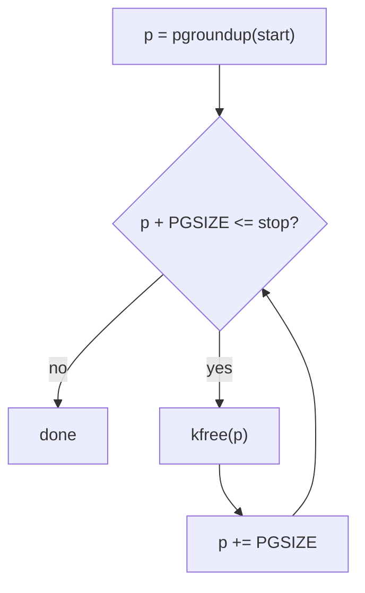
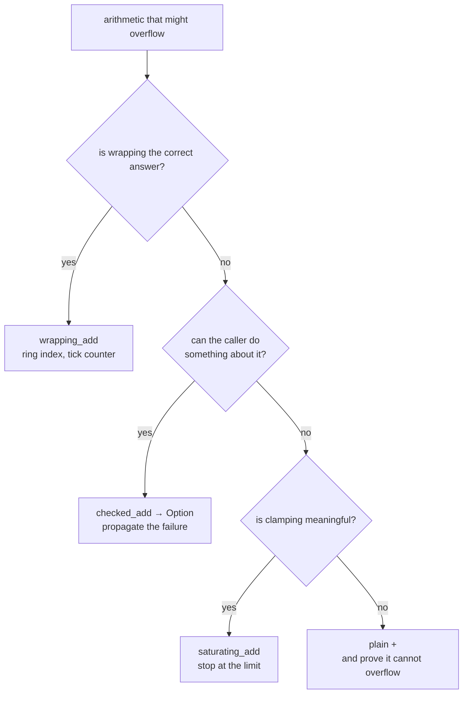

# Rust I: Values, Types, and Control Flow

## Overview

This is the session where you write your first Rust. The next three weeks are
language work, deliberately: a kernel is unforgiving, and you should not fight
the compiler and the hardware at once. Today covers the parts of Rust
you cannot write a line without — bindings, and why immutability is the
default rather than something you opt into; the scalar types, and why a kernel
cares that a page table entry is exactly 64 bits, a UART register exactly 8,
and an address one machine word; hexadecimal and the underscore that makes it
readable; expressions versus statements, and the stray semicolon that will
cost every one of you an afternoon; functions; `if` as an expression; the
three loop forms; and **integer overflow**, which panics in a debug build,
wraps in a release build, and in address arithmetic is a live kernel bug
rather than a curiosity. Everything runs on your laptop under `cargo test`.
Thursday's setup session works **00r_hello_rust**; Friday works **01r_control_flow**.

## Learning Objectives

- **Explain** why Rust bindings are immutable by default, and what the
  compiler buys with that rule.
- **Choose** the correct integer type for a page table entry, a device
  register, or an address, and say what breaks when it is wrong.
- **Convert** between decimal, hex, and binary by hand, and read
  `0x8000_1234` as a page number plus an offset without a calculator.
- **Distinguish** expressions from statements, and predict a return type with
  and without a trailing semicolon.
- **Write** `if` as an expression, obeying the rule that every branch shares
  one type.
- **Trace** `loop`, `while`, and `for` over a half-open range, including a
  `loop` that returns a value through `break`.
- **Predict** an overflowing operation's behavior in both build profiles, and
  select `wrapping_*`, `checked_*`, or `saturating_*` deliberately.
- **Diagnose** the page-rounding overflow that returns an address below its
  input.

## Prerequisites

- **L01 Building an Operating System** — what rv6 is, and the shape of the
  semester.
- **Setup complete**: `rustc`, `cargo`, and `oslings`
  ([Setup](../assignments/setup.md), [Dev Setup](../guides/dev-setup.md)).
- Running an exercise and reading its output
  ([Using OSlings](../guides/oslings-usage.md)).
- Prior programming experience in any language. **No Rust and no operating
  systems knowledge is assumed.**
- The [Rust for Systems](../guides/rust-for-systems.md) guide.

---

## 1. Bindings, and Immutability as a Decision

A **binding** gives a name to a value:

```rust
let page_size = 4096;
```

Assigning again — `page_size = 8192;` — is a **compile error**, not a warning:
bindings are immutable by default. For one you can change, say so:

```rust
let mut free_pages = 100;
free_pages -= 1;
```

C has this backwards: `int x = 5;` is mutable and you write `const` to give
that up, which almost nobody does, so the compiler is told nothing and can
prove nothing. Rust inverts the default: the common case — computed once, then
read — needs no ceremony, and `mut` becomes a real signal. In
`let mut p = pgroundup(start);` (`kalloc.rs`), the `mut` says something
true: `p` walks. Every other local in that function stands still.

The payoff is larger than style. In three weeks we cover **ownership and
borrowing**, where the compiler enforces that a value has many readers or one
writer, never both — only checkable because mutability is written down.
Immutable-by-default is the wall the rest of the language sits on.

> Key distinction: `let x = 5;` followed by `let x = x + 1;` is not
> assignment — it is **shadowing**. The second `let` creates a new binding
> reusing the name, possibly at a different type. The first `x` was never
> modified, only hidden.

### `const` versus `let`

A `const` is not a binding. It is a value substituted at every use site; it
needs an explicit type and must be computable at compile time:

```rust
pub const PGSIZE: usize = 4096;                          // memlayout.rs
pub const KERNBASE: usize = 0x8000_0000;                 // memlayout.rs
pub const PHYSTOP: usize = KERNBASE + 128 * 1024 * 1024; // memlayout.rs
```

`PHYSTOP` is arithmetic over another `const`, evaluated at compile time. Those
three lines are our board's physical memory map: RAM is the half-open range
`KERNBASE..PHYSTOP`.

---

## 2. Scalar Types, and Why Width Is Hardware

Rust's integers name their size in the type; there is no `int` whose width you
must look up per platform.

| Type | Bits | Range | What it is in rv6 |
|---|---|---|---|
| `u8` | 8 | 0 – 255 | a byte; a UART register; a character |
| `u32` | 32 | 0 – 2³²−1 | a 32-bit instruction word |
| `u64` | 64 | 0 – 2⁶⁴−1 | a timer value; a saved register |
| `usize` | 64 on rv64 | 0 – 2⁶⁴−1 | **an address**, a size, an index |
| `i8`…`i64`, `isize` | same widths | signed, two's complement | a value that may go negative |
| `bool` | stored as 1 byte | `true` / `false` | a flag |

In application code you can ignore all of this. In a kernel you cannot: the
number is not an abstraction, it describes something the machine has already
decided.

**A page table entry is exactly 64 bits.** The RISC-V Sv39 specification says
so: bits 0–9 are permission flags, bits 10–53 a physical page number. rv6
wraps that in a one-field struct, so the type system can tell a PTE from a
number:

```rust
#[repr(transparent)]                  // vm.rs
#[derive(Clone, Copy)]
pub struct Pte(pub usize);            // vm.rs
```

`#[repr(transparent)]` means "in memory this is *exactly* a `usize`" — no
header, no padding, no tag. The wrapper exists for the compiler, not the
machine, and on rv64 `usize` is 64 bits, so the struct *is* the 64 bits the
hardware walks. Make it a `u32` and the top half of every physical page number
disappears.

**A UART register is exactly 8 bits.** The NS16550A serial port exposes
one-byte registers at consecutive addresses, and the driver says so in the
types:

```rust
const LSR_DR:   u8 = 1 << 0;   // uart.rs  Data Ready
const LSR_THRE: u8 = 1 << 5;   // uart.rs  Transmit Holding Empty

unsafe fn reg_read(off: usize) -> u8 {              // uart.rs
    read_volatile((UART0 + off) as *const u8)
}
```

That width is not a preference. Reading the register as a `u32` issues a
4-byte load to a device with four *different* one-byte registers there, and on
real hardware some reads have side effects. The type is the bus transaction.

**An address is `usize`**, defined as "wide enough to hold a pointer on this
machine". Every address, size, offset, and index in rv6 is one
(`memlayout.rs`) — which is why `KERNBASE` is `usize` and
not `u64` even though they are identical on rv64. The type says what the
number *means*, not only how wide it is.

### No implicit conversions

Rust never widens or narrows for you: `let a: u64 = 1; let b: u32 = 2; a + b`
does not compile. You convert with `as`, which between integers truncates,
silently, always:

```rust
let addr: usize = 0x8000_1000;
let low: u8 = addr as u8;    // 0x00 — the other 56 bits are GONE
```

That is the one C-shaped footgun Rust hands you, so `as` in kernel code
deserves a second look: `(v % 10) as u8` (`put_num()` in `main.rs`) is safe only because
the modulus already proved the value is 0–9.

---

## 3. Hex, Binary, and the Underscore

Kernel source is written in hexadecimal, for one reason:

**One hex digit is exactly four bits.**

Sixteen values, four bits, a perfect fit — so a hex numeral is a *picture of
the bit pattern*. 4096 says nothing about which bits are set; `0x1000` says
immediately that exactly one is, twelve places up.

```text
       0    x    8    0    0    0    1    2    3    4
                 |    |    |    |    |    |    |    |
              1000 0000 0000 0000 0001 0010 0011 0100   bits, 4 per digit
              ^                    ^^^^^^^^^^^^^^^^^
              bit 31               low 12 bits = 0x234
                                   = the offset within a 4 KiB page

       page number = 0x8000_1234 >> 12     = 0x8_0001
       page base   = 0x8000_1234 & !0xfff  = 0x8000_1000
```

From week 5 you will be thinking about *which bits are set*, constantly, and
hex stops being a convenience — which is why every hardware manual and the
RISC-V specification use it.

Rust also writes octal (`0o`, three bits per digit) and binary (`0b`, one bit
per digit); `4096`, `0x1000`, `0o10000`, and `0b1_0000_0000_0000` are four
spellings of one value. Octal survives from machines with 12-, 18-, and
36-bit words, where three-bit groups divided evenly and four-bit groups did
not. One loud use remains: `0o755` is three groups of three bits — `rwx` for
owner, group, other — which is why `chmod` takes octal and always will.

### The underscore is nothing

Rust lets you put `_` anywhere inside a numeric literal, purely for your eyes:
`0x8000_0000` and `0x80000000` are the identical value. Group hex in fours,
because four hex digits is 16 bits and 16-bit groups are what an eye can count
without moving:

```rust
0x80000000     // how many zeros? you are counting. you will miscount.
0x8000_0000    // 8 followed by seven zeros. done.
```

Decimal takes underscores too: `const INTERVAL: u64 = 1_000_000;`
(`start.rs`) is a million timer ticks, and you can *see* that it is a
million. A literal may also carry its type as a suffix — `42u8`, `1usize`
(`intr_on()` in `trap.rs`) — when context does not pin the type down.

---

## 4. Expressions, Statements, and the Semicolon That Bites

Rust is **expression-oriented**: almost everything produces a value, including
things that in C are pure control flow. An **expression** evaluates to a value
(`1 + 2`, `f(x)`, `if a { 1 } else { 2 }`); a **statement** acts and evaluates
to nothing (`let x = 5;`, `p += PGSIZE;`).

A **block** — anything in `{ }` — is an expression whose value is its last
expression, provided that expression has no semicolon:

```rust
let offset = {
    let base = addr & !(PGSIZE - 1);
    addr - base            // no semicolon: this is the block's value
};
```

Add a semicolon there and the block's value becomes `()`, the **unit type** —
Rust's "no meaningful value", written as empty parentheses and occupying zero
bytes. The semicolon is an operator that throws a value away.

```text
   fn f() -> usize {        fn f() -> usize {
       a + b                    a + b;
   }                        }
       |                        |
       v                        v
   value = a + b            value = ()
   usize  ✓ compiles        ()     ✗ ERROR
```

This is the most common beginner error in Rust, and its message reads as
though it were about something else:

```text
error[E0308]: mismatched types
 --> src/lib.rs:3:23
  |
3 | fn add(a: u64, b: u64) -> u64 {
  |    ---                    ^^^ expected `u64`, found `()`
  |    |
  |    implicitly returns `()` as its body has no tail expression
4 |     a + b;
  |          - help: remove this semicolon to return this value
```

The last line tells you what to do. When a function "returns the wrong type"
and the wrong type is `()`, look for a stray semicolon first. `return a + b;`
also works, and real Rust uses it for *early* returns; the tail-expression
form ends essentially every function in rv6.

---

## 5. Functions

```rust
fn add(a: u64, b: u64) -> u64 {
    a + b
}
```

Parameter and return types are always written out. Rust infers freely *inside*
a body but never across a boundary: a signature is a contract, and a contract
you must read the implementation to understand is not one.

A function returning nothing has no `->`; its type is `()`. A function that
returns **never** is written `-> !`:

```rust
#[no_mangle]
#[link_section = ".entry"]
pub unsafe extern "C" fn _entry() -> ! {    // entry.rs
    asm!( /* set up a stack, then call start */ , options(noreturn));
}
```

`!` is the **never type**: not "returns nothing" but "control does not return
here at all". `_entry` hands off to `start` (`start.rs`, also `-> !`), which
`mret`s into `kmain`, and the kernel never unwinds back through the boot path.
Saying so in the type lets the compiler drop the return sequence entirely, and
lets it accept a body that is nothing but `loop {}`.

You will also meet `const fn`, a function the compiler runs at compile time so
its result can initialize a `const` (`Pte::new`, `vm.rs`); L04 covers it.

---

## 6. `if` Is an Expression

In C, `if` is a statement: it runs code, it does not produce a value, and that
gap is why C needs `? :`. Rust has no ternary because it does not need one:

```rust
let bigger = if a > b { a } else { b };
```

Four rules, all compiler-enforced:

1. **No parentheses** around the condition (permitted, but warned about), and
   **braces are never optional** — so there is no dangling-else problem.
2. **The condition must be a `bool`.** There is no truthiness: `if 1 { }` does
   not compile, which kills a family of C bugs starting with `if (x = 0)`.
3. **Every branch has the same type**, and to get a value out you need an
   `else` — otherwise, what is the value when the condition is false?

Here it is in the real driver, as an argument:

```rust
pub fn set_loopback(on: bool) {                              // uart.rs
    unsafe { reg_write(MCR, if on { MCR_LOOP } else { 0 }) }
}
```

Both branches are `u8`; neither has a semicolon. Same rule as a function body,
same trap: `if a > b { a; } else { b }` gives the arms types `()` and `u64`.

Chain with `else if`, and let an `if` be a whole function body. The trap
dispatcher opens on one bit test:

```rust
if (scause >> 63) == 1 {     // trap.rs
    // top bit set: an interrupt
} else {
    // top bit clear: an exception
}
```

> Key distinction: `if let Some(b) = try_getc() { … }` (`getc()` in `console.rs`) is not
> a different `if` — it is pattern matching, covered in L05. Read it today as
> "if this optional value is present, name it `b` and run the block."

---

## 7. Three Ways to Loop

```rust
loop { }                                       // forever, until `break`
while p + PGSIZE <= stop { p += PGSIZE; }      // test first, every pass
for i in 0..4 { }                              // i = 0, 1, 2, 3
```

**`for` walks a range.** `0..4` is **half-open**: it includes 0, excludes 4,
and yields four values; `0..=4` is inclusive. Half-open is not arbitrary — the
length of `a..b` is `b - a` with no adjustment, adjacent ranges join with
neither overlap nor gap, and it is how rv6 describes memory: RAM is
`KERNBASE..PHYSTOP`, where `PHYSTOP` is the first address that is *not* RAM.

**`while` re-tests before every pass.** This is the page allocator walking
physical memory:

```rust
unsafe fn free_range(start: usize, stop: usize) {   // kalloc.rs
    let mut p = pgroundup(start);
    while p + PGSIZE <= stop {
        kfree(p as *mut u8);
        p += PGSIZE;
    }
}
```

Read the condition: `p + PGSIZE <= stop`, not `p < stop`. The allocator hands
out whole pages, so a partial page at the end must not be freed — the
difference between "32768 pages of RAM" and "32768 pages plus one page of
something else".



**`loop` repeats until something says stop.** Its most literal kernel use is
the idle path — a loop with no exit at all:

```rust
pub fn getc() -> u8 {           // console.rs
    loop {
        if let Some(b) = try_getc() {
            return b;
        }
        unsafe { asm!("wfi") };   // wait-for-interrupt: sleep the CPU
    }
}
```

There is no `break`; the only way out is the `return`, and if no byte arrives
the CPU sleeps forever — correct for a machine with nothing to do. Inside any
loop, `break` leaves it and `continue` skips to the next pass.

### `break` with a value

A `loop` — and only a `loop` — can produce a value: write `break count;` and
`count` becomes the value of `let pages = loop { … };`. `while` and `for`
cannot, and the reason matters: both can finish by their condition going false
without reaching a `break`, so there would be no value. `loop` has no other
exit, so every exit is a `break`.

The kernel's decimal printer peels digits off a number with `loop`/`break`. It
must run at least once so that zero prints as `"0"`, which is exactly why it
is not a `while`:

```rust
let mut i = buf.len();       // main.rs
loop {
    i -= 1;
    buf[i] = b'0' + (v % 10) as u8;
    v /= 10;
    if v == 0 { break; }
}
```

---

## 8. Integer Overflow

Here is the question the rest of this lecture exists for. A `u8` holds 0
through 255. What is `255u8 + 1`?

In C the unsigned answer is 0, silently; the *signed* answer is undefined
behavior. Either way you find out weeks later, from a symptom that looks
nothing like the cause.

Rust's answer depends on how the code was built:

| Build | `255u8 + 1` | Cost |
|---|---|---|
| debug (`cargo test`, `oslings run`) | **panics**: `attempt to add with overflow` | a compare and a branch per operation |
| release (`cargo build --release`) | **wraps** to `0` | none |

Two behaviors for one piece of source is a strange bargain, argued about for
years before Rust 1.0. The check is a branch on *every* arithmetic operation,
and in a page-table walk that is real time — so the compromise ships it where
you hunt bugs and drops it where you chase speed. The rule that follows is
absolute: **never let wrapping happen by accident.**

!!! warning "The two builds are not two opinions"
    A debug panic and a release wrap are the *same bug*, caught in one case
    and not the other. "It passes in debug" only means the check found nothing
    on the inputs you tried. Reason about the extremes yourself — or build
    release with `-C overflow-checks=on`, a real option for a kernel under
    development.

### Why a kernel cares: rounding up an address

Rounding an address up to the next page boundary is the most common
arithmetic in a memory manager:

```rust
fn pgroundup(addr: usize) -> usize {
    (addr + PGSIZE - 1) & !(PGSIZE - 1)   // kalloc.rs
}
```

Clearing the low twelve bits snaps an address *down* to its page. Adding
`PGSIZE - 1` first — 4095, one byte short of a page — is exactly enough to
push an unaligned address over the next boundary, and never enough to push an
aligned one past its own.

Now hand it an address in the last page of the address space:

```text
    addr  = 0xFFFF_FFFF_FFFF_F001      (a real address, 4095 from the top)
    +4095 = 0x1_0000_0000_0000_0000    (65 bits — does not fit in 64)
    wraps = 0x0000_0000_0000_0000

    pgroundup(0xFFFF_FFFF_FFFF_F001) = 0    <- a "round UP" that went DOWN
```

A function whose entire job is *round up* has returned a value below its
input. In `free_range`, `p` now starts at 0, the `while` condition holds, and
the allocator puts address 0 on the free list — a page that is not memory, and
that some future `kalloc` hands to a page table. In debug you get a panic
naming the line. In release you get a kernel that works fine for twenty
minutes.

This class of bug has a CWE number (CWE-190) because it keeps producing
advisories in real kernels: an allocation size that wraps small, a bounds
check that passes because the sum wrapped below the limit. Rust does not make
it impossible — it makes it *loud* where loud is useful.

### Saying what you mean

Every integer type carries an explicit version of every operator:

| Method | On overflow | Returns | Use it when |
|---|---|---|---|
| `a.wrapping_add(b)` | wraps around | the wrapped value | wrapping *is* the intent — a tick counter, a ring index |
| `a.checked_add(b)` | reports failure | `Option<T>` — `None` | overflow is possible and must be handled |
| `a.saturating_add(b)` | clamps | the type's max (or min) | clamping is a sane answer |

There is a `wrapping_sub`, a `checked_mul`, and so on for every operator on
every integer type; a type's limit is `usize::MAX`, `u64::MAX`, `u8::MAX`.



rv6 uses `wrapping_*` where wrapping is genuinely correct — the console ring
buffer, whose head and tail run past the buffer length forever and are reduced
modulo it only when indexing:

```rust
let tail = *addr_of!(TAIL);                     // console.rs
let head = *addr_of!(HEAD);
if tail.wrapping_sub(head) < BUF_LEN {          // console.rs
    *addr_of_mut!(BUF[tail % BUF_LEN]) = b;
    *addr_of_mut!(TAIL) = tail.wrapping_add(1); // console.rs
}
```

`tail.wrapping_sub(head)` is the number of bytes queued, and it stays correct
even after `TAIL` wraps past `usize::MAX` and `HEAD` has not, because
two's-complement subtraction of wrapped counters gives the right difference —
a technique, not a workaround, and one that works only because the wrap was
requested.

### `Option`, just enough of it

`checked_add` cannot return a plain number, because sometimes there is none.
It returns an **`Option<usize>`**: either `Some(n)` or `None`. Rust has no
null, so this is how "maybe nothing" is spelled — and since `Option<usize>` is
a different type from `usize`, the compiler will not let you use the value
without handling `None`.

You take one apart with `match`, which tests a value against a list of shapes
and must cover all of them:

```rust
match addr.checked_add(PGSIZE - 1) {
    Some(bumped) => bumped & !(PGSIZE - 1),
    None         => return None,
}
```

Each arm is `pattern => value`; `Some(bumped)` both matches and names the
inner value; `match` is an expression, so the block has a type. L05 covers
enums and patterns. You have met the shape already: `uart::getc` returns
`Option<u8>` (`uart.rs`) because there may be no byte waiting.

---

## 9. Where Today Lands in rv6

Nothing here is preparation-for-later. Every construct is already load-bearing
in the kernel you finish in December.

| Today | In rv6 | Exercise |
|---|---|---|
| `const … : usize = 0x…` | the memory map, `memlayout.rs` | 31k |
| `u8` for a device register | the UART driver, `uart.rs` | 41k |
| `usize` as an address | `Pte`, `walk`, `mappages`, `vm.rs` | 33k |
| `while p + PGSIZE <= stop`, `pgroundup` | `free_range`, `kalloc.rs` | 32k |
| `loop { }` with no break | the idle path, `console.rs` | 45k |
| `wrapping_add` | the ring buffer, `console.rs` | 45k |
| `if (scause >> 63) == 1` | the trap dispatcher, `trap.rs` | 43k |

Today's exercises are the laptop-sized version of all of it.
**00r_hello_rust** is bindings, integer types, and hex literals — including
`0x8000_0000`, which returns in `31k_boot` as the address the kernel is
linked at. **01r_control_flow** is `if`, the loops, and overflow; its five
functions are `kalloc.rs` with the pointers removed.

---

## Key Concepts

| Concept | Definition | Example |
|---|---|---|
| Binding | A name for a value; immutable unless declared `mut` | `let page_size = 4096;` |
| `const` | A compile-time value substituted at each use; type required | `pub const PGSIZE: usize = 4096;` |
| `usize` | Unsigned integer wide enough to hold a pointer; 64 bits on rv64 | `let addr: usize = 0x8000_0000;` |
| Hexadecimal literal | Base-16 notation; one digit is exactly four bits | `0x1000` = 4096 = one bit at position 12 |
| Literal underscore | Visual grouping inside a literal; no effect on the value | `0x8000_0000` == `0x80000000` |
| Expression vs statement | An expression has a value; a statement does not | `a + b` vs `let x = a + b;` |
| Tail expression | A block's last expression, without a semicolon, is its value | `fn add(a: u64, b: u64) -> u64 { a + b }` |
| Half-open range | `a..b` includes `a`, excludes `b`; length is `b - a` | RAM is `KERNBASE..PHYSTOP` |
| Integer overflow | Arithmetic past the type's range: panics in debug, wraps in release | `255u8 + 1` |
| `Option<T>` | Either `Some(value)` or `None`; Rust's replacement for null | `checked_add` returns `Option<usize>` |

---

## Practice Problems

### Problem 1: Decode an address by hand

Given `PGSIZE = 4096` and the address `0x8000_1234`:

1. Write the low 16 bits in binary.
2. What is the offset within its page, in hex and decimal?
3. What is `pgrounddown(0x8000_1234)` — the base of the page it lies in?
4. What is `pgroundup(0x8000_1234)`?
5. How many whole pages lie in `0x8000_1234 .. 0x8000_4000`?

<details>
<summary>Click to reveal solution</summary>

**1.** Each hex digit is four bits, so `1234` expands digit by digit:

```text
   1     2     3     4
 0001  0010  0011  0100
```

**2.** A 4096-byte page needs 12 offset bits — exactly three hex digits — so
the offset is the low three digits, read off with no arithmetic: `0x234` =
2·256 + 3·16 + 4 = **564**.

**3.** Clear the low 12 bits: `0x8000_1234 & !0xfff` = **`0x8000_1000`**.

**4.** The offset is nonzero, so rounding moves on:
`0x8000_1234 + 0xfff = 0x8000_2233`, which clears to **`0x8000_2000`**. The
aligned case still works: `0x8000_1000 + 0xfff = 0x8000_1fff` clears back to
`0x8000_1000`.

**5.** Round the start up to `0x8000_2000`, then step while
`p + PGSIZE <= 0x8000_4000`: `0x8000_2000` ✓, `0x8000_3000` ✓,
`0x8000_4000` ✗. **2 pages** — the partial page at the front is dropped by the
rounding, exactly as `free_range` drops it.

</details>

### Problem 2: What does the compiler say?

Each of these fails to compile. Name the error and give the one-token fix.

```rust
// (a)
fn page_of(addr: usize) -> usize { addr / PGSIZE; }

// (b)
fn bigger(a: u64, b: u64) -> u64 { if a > b { a; } else { b } }

// (c)
fn has_room(n: usize) -> bool { if n { true } else { false } }

// (d)
fn total(a: u64, b: u32) -> u64 { a + b }

// (e)
fn count() -> usize {
    let pages = 0;
    for _ in 0..4 { pages += 1; }
    pages
}
```

<details>
<summary>Click to reveal solution</summary>

**(a)** Stray semicolon: no tail expression, so the block's value is `()`
while the signature promises `usize` — `error[E0308]: mismatched types …
expected usize, found ()`. **Delete the `;`.**

**(b)** The same bug inside a branch: `{ a; }` has type `()` and `{ b }` has
type `u64`. **Delete the `;` after `a`.**

**(c)** No truthiness — `n` is a `usize` and `if` demands a `bool`. **Write
`if n > 0`.** (C's `if (x = 0)` cannot even be expressed in Rust.)

**(d)** No implicit widening: `u64 + u32` is a mismatch even though the
conversion is lossless. **Write `a + b as u64`.**

**(e)** `pages` is not `mut`: `error[E0384]: cannot assign twice to immutable
variable`. **Write `let mut pages = 0;`.**

</details>

### Problem 3: Trace the decimal printer

This is `put_num()` in `main.rs`, the kernel's integer-to-string loop. Trace it for
`n = 205`, giving `buf[i..]` and the final `i`. `buf.len()` is 20.

```rust
let mut v = n.unsigned_abs();
let mut buf = [0u8; 20];
let mut i = buf.len();
loop {
    i -= 1;
    buf[i] = b'0' + (v % 10) as u8;
    v /= 10;
    if v == 0 { break; }
}
```

Then: why is this a `loop` and not `while v != 0`? And what breaks if someone
"tidies" it to start `i` at 0 and count up?

<details>
<summary>Click to reveal solution</summary>

Digits are produced least-significant first and written from the right end
backwards:

| pass | `i` after `i -= 1` | `v % 10` | `buf[i]` | `v` after `/= 10` | break? |
|---|---|---|---|---|---|
| 1 | 19 | 5 | `b'5'` | 20 | no |
| 2 | 18 | 0 | `b'0'` | 2 | no |
| 3 | 17 | 2 | `b'2'` | 0 | **yes** |

Final `i` = **17**, `buf[17..]` = `['2','0','5']` = `"205"`. The following
`for &b in &buf[i..]` prints exactly those three bytes; the first 17 slots
were never touched.

**Why `loop`.** `while v != 0` tests *before* the first pass, so `n = 0` would
produce no digits and print the empty string. `loop` runs the body at least
once — the only reason `put_num(0)` prints `"0"`. Rust spells do-while as
`loop` with the test at the bottom.

**Counting up.** Counting up writes 205 as `"502"` — and the printing step
`&buf[i..]` slices from `i` to the end, which after counting up starts past
the digits. Building the string backwards into the tail of a fixed buffer is
the standard trick.

Note also that `i -= 1` at `i == 0` would panic: `usize` is unsigned. The code
is safe only because 20 slots exceed the 19 digits of the largest `isize` — a
proof obligation, not luck.

</details>

### Problem 4: Debug or release?

For each expression, give the release value and the debug behavior.

```rust
let a: u8    = 200;
let b: u8    = 100;
let m: usize = usize::MAX;

// (1) a + b                 (5) m + 1
// (2) a.wrapping_add(b)     (6) m.wrapping_add(1)
// (3) a.saturating_add(b)   (7) 0usize - 1
// (4) a.checked_add(b)      (8) (a as u16) + (b as u16)
```

<details>
<summary>Click to reveal solution</summary>

| | Debug | Release | Note |
|---|---|---|---|
| (1) `a + b` | **panics**, `attempt to add with overflow` | `44` | 300 − 256 = 44 |
| (2) `wrapping_add` | `44` | `44` | Explicit — identical in both builds |
| (3) `saturating_add` | `255` | `255` | Clamped at `u8::MAX` |
| (4) `checked_add` | `None` | `None` | Type is `Option<u8>`, not `u8` |
| (5) `m + 1` | **panics** | `0` | wraps to zero |
| (6) `m.wrapping_add(1)` | `0` | `0` | same value, but requested |
| (7) `0usize - 1` | **panics**, *subtract* with overflow | `usize::MAX` | Unsigned: there is no −1 |
| (8) widened add | `300` | `300` | `u16` holds it; no overflow at all |

The point is rows 1/5/7 against rows 2/6: the *values* agree in a release
build, but only the `wrapping_*` rows say so on purpose. Row 8 is the best fix
available — widen the type so overflow cannot occur.

</details>

### Problem 5: Find the bug

This returns the base of the last page starting at or below `addr`, clamped so
it never reports a page below `KERNBASE`. It passes every test its author
wrote. Find the bug, give an input that triggers it, and fix it.

```rust
const KERNBASE: usize = 0x8000_0000;
const PGSIZE:   usize = 4096;

fn last_page_at_or_below(addr: usize) -> usize {
    let base = addr - (addr % PGSIZE);
    if base < KERNBASE { KERNBASE } else { base }
}
```

<details>
<summary>Click to reveal solution</summary>

**The bug is not in the arithmetic — it is in what the function does with an
address below RAM.** `addr - (addr % PGSIZE)` is a correct round-down for
every `usize`, and cannot underflow because `addr % PGSIZE <= addr`.

The clamp is the problem. For any `addr` below `KERNBASE` — say
`0x1000_0005`, a UART address (`UART0` in `memlayout.rs`) — it returns `KERNBASE`,
which is **not a page at or below `addr`**: it is 1.75 GiB *above* it. The
name promises a result ≤ `addr`; the body silently returns one greater, so
every caller that writes `while p < addr`, or treats the result as describing
`addr`, is wrong.

**Why the tests passed:** the author only tested addresses inside RAM, where
the `else` branch runs, plus perhaps `addr = 0`, where `KERNBASE` looks
plausible rather than contradictory.

**Fix — make the signature honest.** There may be no such page:

```rust
fn last_page_at_or_below(addr: usize) -> Option<usize> {
    if addr < KERNBASE { None } else { Some(addr - (addr % PGSIZE)) }
}
```

Same lesson as `checked_add`: when a function can be asked a question with no
valid answer, `Option` says so and the compiler forces every caller to decide.
Inventing a plausible wrong answer is how an allocator hands out address 0.

</details>

---

## Further Reading

- [Rust for Systems](../guides/rust-for-systems.md) — the Module 1 reference
  layer: types, expressions, and the constructs rv6 actually uses.
- [Cheatsheet](../guides/cheatsheet.md) — hex/binary conversion, integer
  ranges, and the `wrapping_*`/`checked_*`/`saturating_*` families.
- [Memory Map](../guides/memory-map.md) — where `0x8000_0000` and
  `0x1000_0000` come from on the QEMU `virt` board.
- [All Exercises](../assignments/exercises.md) — 00r and 01r, and what they
  lead to.
- *The Rust Programming Language*, ch. 3:
  <https://doc.rust-lang.org/book/ch03-00-common-programming-concepts.html>
- RFC 560, *Integer Overflow* — the design argument for panic-in-debug and
  wrap-in-release: <https://rust-lang.github.io/rfcs/0560-integer-overflow.html>
- CWE-190: <https://cwe.mitre.org/data/definitions/190.html>

---

## Summary

1. **Bindings are immutable by default, and that is a design decision.** `let`
   names a value; `mut` states that the value can change. Because mutability is
   written down, the ownership rules of L03 are checkable.
2. **Integer types name their exact width, and in a kernel width is
   hardware.** A page table entry is 64 bits (`Pte` in `vm.rs`), a UART register 8
   (`uart.rs`), an address `usize` (`memlayout.rs`).
3. **One hex digit is exactly four bits.** That is why hardware documentation
   and kernel source are written in hex, and why `0x8000_1234` yields its page
   number and offset by inspection.
4. **The underscore in a literal is nothing at all.** `0x8000_0000` and
   `0x80000000` are the same value; group hex in fours, because you will read
   these numbers thousands of times this semester.
5. **Rust is expression-oriented, and the semicolon throws values away.** A
   block's value is its last expression *without* a semicolon; a stray one
   changes the return type to `()`.
6. **`if` produces a value, so Rust needs no ternary.** The condition must be
   a real `bool`, braces are mandatory, and every branch shares one type —
   which is why a value-producing `if` needs an `else`.
7. **Three loop forms, one of which returns a value.** `for` walks a half-open
   range, `while` re-tests before every pass (`kalloc.rs`), and `loop` runs
   until a `break` — the only form that can carry a value out.
8. **Integer overflow panics in debug and wraps in release, so say what you
   mean.** `wrapping_*` when wrapping is the intent (`push()` in `console.rs`),
   `checked_*` when the caller must handle failure, `saturating_*` when
   clamping is right. Address arithmetic that silently wraps is how "round up"
   returns an address below its input, and an allocator hands out page zero.
