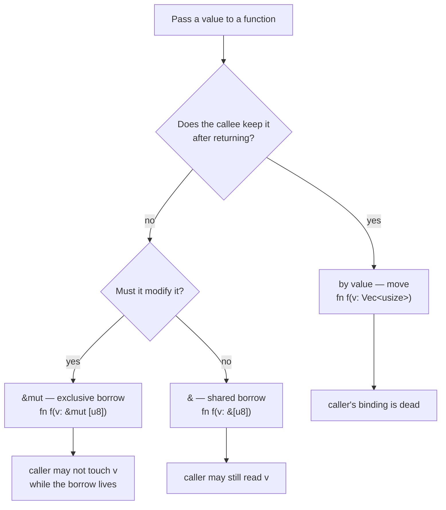
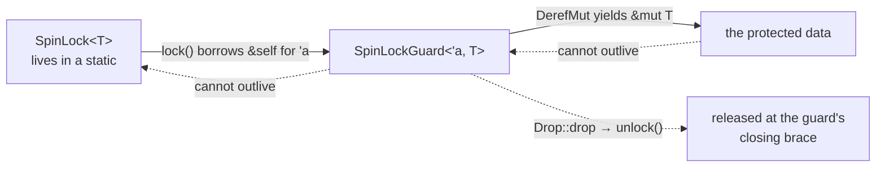

# Ownership, Borrowing, and Lifetimes

## Overview

This is the one Rust idea with no C analogue. Every value has exactly one
**owner**; the compiler knows who that owner is at every point in the program;
and when the owner goes away the value is released — with no `free()` and no
garbage collector. Handing a value to somebody else is a **move**, and the
original name goes dead. Lending it instead is a **borrow**, written `&` or
`&mut`, and borrows obey one rule: many readers or one writer, never both. A
**lifetime** is the compiler's name for how long a borrow stays valid. The
motivating object is the one you build in exercise 02 — a physical page
allocator, whose whole correctness argument is "a page that has been handed out
is no longer free." Ownership is how you say that in a type system instead of a
comment. Exercises `r02_ownership` and `r03_borrowing` are the hands-on half;
[Rust for Systems Programmers](../guides/rust-for-systems.md) is the
reference.

## Learning Objectives

- **Explain** why a kernel can use neither `malloc`/`free` discipline nor a
  garbage collector, and what ownership puts in their place.
- **Trace** ownership through assignments and calls, naming the owner at every
  line and saying where each value is dropped.
- **Distinguish** `Copy` types from move-only types via owned resources and
  `Drop`.
- **Describe** what a move compiles to, and why it costs nothing at run time.
- **State** the aliasing-XOR-mutation rule precisely and apply it to kernel data
  touched by an interrupt handler.
- **Decode** E0382, E0499, E0502, and E0106 into the underlying mistake.
- **Annotate** a function or struct with lifetimes when inference fails, and
  read `SpinLockGuard<'a, T>` as a safety argument.
- **Compare** rv6's compile-time enforcement with xv6's convention-based
  locking and Linux's runtime checkers.

## Prerequisites

- **L01 Building an Operating System** — what a kernel is; what rv6 becomes.
- **L02 Rust I: Values, Types, Control Flow** — bindings, `mut`, integers,
  `if`/`loop`/`match`.
- **Exercises `r00_hello_rust`, `r01_control_flow`** — writing a Rust function
  and reading a test failure.
- **[Rust for Systems Programmers](../guides/rust-for-systems.md)** and
  **[Using OSlings](../guides/oslings-usage.md)** — the C-to-Rust table, and
  `oslings run` / `watch` / `hint`.

---

## 1. The Bug That Shaped a Language

Start with the object. A **physical page allocator** manages RAM in fixed-size
blocks called **pages** — 4096 bytes on RISC-V, the constant `PGSIZE`
(`memlayout.rs:7`). It keeps a list of unused pages, hands one out (`kalloc`),
takes one back (`kfree`). Here is the real one, in full, `kalloc.rs:40`:

```rust
pub unsafe fn kalloc() -> *mut u8 {
    let r = FREELIST;
    if !r.is_null() {
        FREELIST = (*r).next;
    }
    r as *mut u8
}
```

The free list is a `static mut` raw pointer (`kalloc.rs:11`) whose nodes live
*inside the free pages themselves*: a free page's first eight bytes hold the
next free page's address, so the allocator needs no memory of its own.

It is correct only if one thing holds: **a page that has been handed out is not
on the free list, and a page on the free list has not been handed out.** Violate
it and you get this:

```text
   FREELIST ──▶ [ 0x8000_5000 ]──▶ [ 0x8000_6000 ]──▶ null

   kfree(0x8000_5000) called a second time:

   FREELIST ──▶ [ 0x8000_5000 ]──┐
                     ▲───────────┘      one page, on the list twice

   kalloc()  ──▶ 0x8000_5000            → the page-table code
   kalloc()  ──▶ 0x8000_5000            → a process stack

   Two subsystems own the same 4096 bytes. Neither knows.
```

Nothing crashes. The page-table code writes entries, the stack code pushes
registers over them, and the MMU later walks a page table full of stack frames;
the failure surfaces minutes later as an impossible fault. That is a **double
free** producing a **use-after-free** — and Microsoft and Chromium have each
reported, independently, that roughly 70% of the vulnerabilities they fix are
memory-safety bugs of this family.

Three roads out. **Manual discipline** is C's answer, and xv6's: free exactly
once, never touch the pointer again — nothing checks either claim, and the rule
lives in a comment. **Garbage collection** is Java's and Python's: a runtime
scans for unreachable values, but that runtime needs a thread, memory of its
own, and an operating system underneath it — and we are *writing* the operating
system. **Ownership** is the third road: make responsibility part of the type
system, check it at compile time, emit the release where responsibility ends.

> Key distinction: garbage collection asks *"is anyone still using this?"* at
> run time. Ownership asks *"who is responsible for this?"* at compile time.
> The first needs a runtime and releases nondeterministically. The second needs
> a type system and releases at a line you can point to.

---

## 2. Ownership: One Owner, Always

1. Every value has exactly one **owner** — a binding responsible for it.
2. There is only one owner at a time.
3. When the owner goes out of scope the value is **dropped** and its resources
   are released right there.

```rust
{
    let label = String::from("kernel");   // `label` owns this text
}                                          // scope ends: dropped here
```

A `String` owns a byte buffer on the **heap** — the pool a program allocates
from at run time, as opposed to the stack, the current function's local storage.
Somebody must release that buffer; in Rust it happens at the closing brace,
because that is where the owner stops existing.

### 2.1 What a move actually is

```rust
let a = String::from("kernel");
let b = a;
```

In most languages line 2 makes a second name for the same text: two names, one
buffer, two releases, one double free. So in Rust assignment **moves**
ownership — `b` owns the buffer and `a` is dead. Be concrete about the machine,
because "move" suggests expense and there is none.

```text
   stack                                     heap
BEFORE  a: { ptr, len=6, cap=6 } ─────────▶  [ k e r n e l ]
AFTER   a: <marked dead by rustc>
        b: { ptr, len=6, cap=6 } ─────────▶  [ k e r n e l ]   (untouched)

Run time: copy 3 words of stack, usually optimized away.
Compile time: `a` is struck off the list of usable names.
```

A move is a shallow bitwise copy of the *handle* plus a static bookkeeping
change. Nothing is scanned or reference-counted; the entire mechanism is the
compiler refusing to let you say `a` again:

```text
error[E0382]: borrow of moved value: `a`
  |     let b = a;
  |             - value moved here
  |     println!("{}", a);
  |                    ^ value borrowed here after move
```

Read "moved" as **"given away."** That message is a use-after-free caught before
the program ran.

### 2.2 Moves at function boundaries

Passing by value moves too: the parameter becomes the owner and the value dies
at the function's closing brace unless it is passed on.

```rust
fn consume(text: String) { }   // `text` owns it, and drops it at the `}`
```

If the caller still needs the value the callee must return it. That is clumsy,
and it is what `r02_ownership` looks like on purpose. Notice what the clumsiness
buys: while `take_page` runs it is the *only* owner of the list, and the page
number it returns is by construction no longer in the list it returns. The
Section 1 invariant is not a comment; it is the shape of the signature.

### 2.3 `Copy`: values that do not move

```rust
let page = 3usize;
let other = page;
assert_eq!(page, 3);   // still fine
```

A `usize` is eight bytes with nothing behind it, so duplicating it is as cheap
as moving it and there is nothing to double-free. Such types implement `Copy`:
the integers, `bool`, `char`, `&T`, and arrays of `Copy` types. `String`,
`Vec<T>`, and `&mut T` are not.

The dividing line is not "small" — it is *does this value own a resource whose
release must happen exactly once?* Hence the rule to remember: **`Copy` and
`Drop` are mutually exclusive.** If a type has cleanup to run, the language
refuses to duplicate it silently, because the cleanup would then run twice.
Problem 2 works through the cases.

> Key distinction: in the exercise, page *numbers* are copied freely; the
> *list* of them is moved. Same question behind both — is there a resource here?

---

## 3. Drop: Where `free()` Went

When a binding goes out of scope the compiler emits a call to its type's `Drop`
implementation, then to its fields' drops, recursively. You do not write the
call, you cannot forget it, and its site is a closing brace.

Two properties matter. **Drop is deterministic** — it happens at a specific
instruction, so it can carry what a collector never could: releasing a lock,
returning a page, closing a file, re-enabling interrupts. **Drop runs in reverse
declaration order** — last declared dies first, exactly the nesting discipline
locks need.

```rust
struct Page(usize);

impl Drop for Page {
    fn drop(&mut self) { println!("kfree({})", self.0); }
}
```

The idea is not new: C++ has had it since the mid-1980s as **RAII**, "resource
acquisition is initialization." What Rust adds is that ownership is *checked*,
so RAII cannot be defeated by an accidental copy, an early `return`, or a second
owner. And `drop(x)` is no intrinsic — its whole definition is
`pub fn drop<T>(_x: T) { }`, so the value dies at *its* closing brace.

---

## 4. Borrowing: Lending Without Giving Away

Moves alone would make a kernel unwritable: `checksum(page)` would swallow the
page and nothing could look at the same buffer twice. So there is a second way
to pass a value — **lend** it.

```rust
let page = [0u8; 4096];
let sum = checksum(&page);   // lend
let first = page[0];         // still ours
```

`&page` creates a **reference**: a value that points at `page` without owning
it. At run time it is nothing but an address — the same machine word a C pointer
would be. At compile time it is much more, because the compiler tracks how long
the borrow lives and what else may touch the value meanwhile. That bookkeeping
is the **borrow checker**.

### 4.1 Slices are the systems shape

`&[u8]` reads "shared reference to a run of `u8`". A **slice** is a pointer plus
a length — two machine words, no copy of the data — and it is the safe-code
shape of everything a kernel passes around: a page from the allocator, a
512-byte disk block, the typed-so-far part of a console buffer. The reference
kernel uses it throughout: `fs.rs:97` reads a file into a caller-provided
buffer, `fs.rs:109` looks a name up without owning it, and `ulib::read`
(`ulib/src/lib.rs:104`) is called with a stack buffer at
`commands/src/bin/wc.rs:36`. In C both would be `(char *buf, int n)`, and the
length would be the caller's problem forever.

### 4.2 The two kinds

- `&T` — a **shared** borrow. You may read. Any number may exist at once.
- `&mut T` — an **exclusive** borrow. You may read and write, and while it
  exists it is the *only* way to reach the value.

Almost everyone meets `&mut` as "mutable reference," and the name misleads. What
matters is not that you can write through it, but that nobody else can even
look. Read `&mut` as **exclusive** and the rest follows.



---

## 5. Aliasing XOR Mutation

Here is the whole rule, for any one value at any one moment:

> **Either any number of `&` borrows, or exactly one `&mut` borrow. Never both.**

*Aliasing* means more than one path leads to the same data; *mutation* means
somebody is changing it. Rust permits either, never both: many readers, or one
writer.

```rust
let mut page = [0u8; 16];
let a = &mut page;       // exclusive borrow #1
let b = &mut page;       // exclusive borrow #2  <- error[E0499]
fill(a, 0xFF);
```

### 5.1 Why this is the kernel property

Aliasing plus mutation is the precondition for the three worst bug classes in
systems code. **Iterator invalidation**: a pointer into a list, the list
reallocates, the pointer aims at freed memory — in Rust the `&` into the vector
conflicts with the `&mut` that `push` needs. **Optimizer hazards**: C must
assume same-typed pointers may alias, which is why `restrict` exists and why
misusing it miscompiles silently. **Concurrent corruption**: two writers, or a
reader and a writer at once, is what shreds a process table.

And a kernel is concurrent *even on one CPU*: an interrupt can land between any
two instructions, run a handler on your stack, touch your structures, and
return, and your code never knows. rv6's console is exactly that
(`console.rs:13`–`console.rs:15`):

```rust
static mut BUF: [u8; BUF_LEN] = [0; BUF_LEN];
static mut HEAD: usize = 0; // next index the consumer will read
static mut TAIL: usize = 0; // next index the producer will write
```

The UART interrupt handler pushes bytes and advances `TAIL`; a process blocked
in `read` pops and advances `HEAD`. Two agents, shared mutable state, no
function-call relationship. The borrow checker cannot help — that is *why* those
are `static mut` and why every access is inside `unsafe`. Rust does not make the
hardware problem disappear; it shrinks the places the problem can live from "the
whole kernel" to "the lines that say `unsafe`." Section 8 compares xv6 and
Linux.

### 5.2 Borrows end at their last use

A borrow lasts from where it is created to its **last use**, not to the end of
the enclosing block. This is *non-lexical lifetimes*, shipped in Rust 2018, and
it is the change that made the borrow checker pleasant.

```text
let mut buf = [0u8; 4];      ── buf owned, unborrowed
let view = &buf;             ──┐ shared borrow begins
let n = checksum(view);      ──┘ last use of `view`: borrow ENDS here
fill(&mut buf, 1);           ──▶ exclusive borrow begins and ends: no conflict
println!("{n}");
```

Under the pre-2018 rule `view` stayed borrowed until the closing brace and line
4 was rejected for no reason. Today almost every "why is this rejected?" moment
is a borrow you thought had finished but which is used again further down, so
the fix is usually to move the later use *earlier*.

---

## 6. Lifetimes

A **lifetime** is the region of the program over which a reference is valid —
not a duration in seconds, and not something you choose: the borrowed values
already decided it. An annotation only *states a relationship*, which the
compiler checks at every call site. Usually you write none, because of three
elision rules:

1. Each elided input reference gets a fresh lifetime.
2. With exactly one input lifetime, it is given to every elided output.
3. With a `&self` or `&mut self` input, `self`'s lifetime goes to the outputs.

Rule 2 is why `fn prefix(buf: &[u8], n: usize) -> &[u8]` needs no annotation and
rule 3 is why methods rarely do. When neither applies, the compiler stops:

```rust
fn longest(a: &[u8], b: &[u8]) -> &[u8]   // error[E0106]: missing lifetime specifier
```

The returned reference borrows from *something*, and the compiler must know
what, so it can stop you keeping the result after that something is gone. You
settle it by naming the region:

```rust
fn longest<'a>(a: &'a [u8], b: &'a [u8]) -> &'a [u8]
```

`'a` (say "tick A") is a lifetime parameter. Read it as: *for some region `'a`,
give me two references valid at least that long, and I return one also valid
that long.* A struct storing a reference is annotated the same way, meaning
"this struct may not outlive what it points at" — as in `ulib/src/lib.rs:63`:

```rust
pub struct Args<'a> {
    argv: &'a [&'a [u8]],
}
```

`Args` does not own the command line: `exec` pushed those bytes onto the new
process's stack, and `Args` is a window onto them.

### 6.1 The destination: `SpinLockGuard<'a, T>`

Everything above converges on one type, built in exercise 07 — `spinlock.rs:22`,
`:54`, `:71`:

```rust
pub fn lock(&self) -> SpinLockGuard<'_, T> { /* spin */ SpinLockGuard { lock: self } }

pub struct SpinLockGuard<'a, T> {
    lock: &'a SpinLock<T>,
}

impl<T> Drop for SpinLockGuard<'_, T> {
    fn drop(&mut self) { self.lock.unlock(); }
}
```



Assemble the argument from rules already in this lecture. The `&mut T` you touch
the data through is borrowed *from the guard*, so it cannot outlive the guard.
The guard holds a `&'a SpinLock<T>`, so it cannot outlive the lock. The guard's
`Drop` is the unlock, so the lock is held for exactly the guard's scope — no
`release()` to forget, no early `return` that skips it. "Only touch this data
while you hold the lock" stops being a rule people remember and becomes one the
compiler enforces. See `semaphore.rs:17` and `fs.rs:277`, where the whole
filesystem is a `SpinLock<FileSystem>`. In xv6 the equivalent code can read the
structure after `release()` and nothing complains. The `Guard<'a>` in
`r03_borrowing` is this idea with the atomics removed.

---

## 7. The Four Errors You Will Actually Hit

| Code | Compiler says | What it really means | Usual fix |
|---|---|---|---|
| **E0382** | use / borrow of moved value | You gave the value away, then named it again. A use-after-free, caught. | Borrow (`&`) instead of moving; have the callee return it; or `.clone()` if you truly want a second copy. |
| **E0499** | cannot borrow `x` as mutable more than once at a time | You asked for two writers to one value at one time. | Let the first `&mut` end first — usually by moving the later use up, or splitting scopes. |
| **E0502** | cannot borrow `x` as mutable because it is also borrowed as immutable | A reader and a writer overlap; usually the reader is a reference *into* a collection you are about to modify. | Read the value out rather than a reference to it. |
| **E0106** | missing lifetime specifier | You return a reference and the signature does not say which input it borrows from. | Add `<'a>` and tie the output to the right input, or return an owned value. |

Two habits make these fast. **Read all three parts of the message**: `rustc`
says where the value was moved or first borrowed, where the conflicting use is,
and often gives a `help:` line with the exact edit — the first span is the one
people skip and the one with the answer. And **ask "who owns this, and who is
looking at it now?"** E0382 is a wrong ownership answer, E0499 and E0502 wrong
aliasing answers, E0106 no answer at all.

> Key distinction: the borrow checker does not report bugs that "might" happen
> at run time; it reports programs whose ownership story it could not verify.

---

## 8. Where the Rules Run Out

Ownership describes values the compiler can see. A kernel also handles values it
cannot reason about: memory whose address came from a linker symbol, a device
register at a fixed address, a process table reachable from an interrupt
handler. For those, Rust offers raw pointers and `unsafe`, and checking stops.
`proc.rs:65` declares `static mut PROCS`; `proc.rs:70` deliberately hands out a
raw pointer rather than a reference:

```rust
/// Raw pointer to process slot `i`. Lets other modules reach the table without
/// creating references into a `static mut`.
pub unsafe fn proc_at(i: usize) -> *mut Proc {
    ptr::addr_of_mut!(PROCS[i])
}
```

A `&mut Proc` into a global an interrupt handler also touches would be a *lie*
to the borrow checker, so the code does not make one.

!!! warning
    `unsafe` does not turn off the borrow checker. It enables exactly five extra
    abilities: dereferencing a raw pointer, calling an `unsafe` function,
    touching a mutable static, implementing an `unsafe` trait, and reading union
    fields. Ownership and borrow rules still apply inside an `unsafe` block, so
    writing `unsafe` to silence an E0499 will not work.

So the honest claim is not "no memory bugs":

| | xv6 (C) | Linux (C) | rv6 (Rust) |
|---|---|---|---|
| Ownership of memory | comment | comment | type system |
| Use-after-free | anywhere | anywhere; KASAN finds some at run time | only in `unsafe` |
| Lock/data association | comment | `sparse`, `lockdep` at run time | the data is *inside* `SpinLock<T>` |
| Forgetting to unlock | possible | possible | impossible: `Drop` |
| Trusted region | all of it | all of it | the `unsafe` blocks — countable |

That last row is the real claim. Every kernel has a region where the programmer
is the only thing between the code and disaster; Rust does not remove it, it
makes it small enough to audit and marks it with a keyword you can grep for.

Your two exercises are the ground floor of that argument: `r02_ownership` builds
a page allocator from nothing but a `Vec<usize>` and move semantics, and
`r03_borrowing` gives `&` and `&mut` back, adds slices, and ends with a
`Guard<'a>`.

---

## Key Concepts

| Concept | Definition | Example |
|---|---|---|
| Owner | The single binding responsible for a value and its release | `let label = String::from("kernel");` |
| Move | Transfer of ownership; the source binding becomes unusable | `let b = a;` — naming `a` is now E0382 |
| `Copy` | Trait for types duplicated bitwise instead of moved | `let p = 3usize; let q = p;` — `p` still usable |
| `Drop` | Code run automatically when an owner goes out of scope | `SpinLockGuard::drop` calls `unlock()` (`spinlock.rs:71`) |
| Borrow | Access to a value without taking ownership | `checksum(&page)` keeps `page` |
| `&T` | Shared, read-only borrow; unlimited simultaneous copies | `fn dirlookup(&self, dir: usize, name: &[u8])` (`fs.rs:109`) |
| `&mut T` | Exclusive borrow; the only live path to the value | `fn read(&self, inum: usize, buf: &mut [u8])` (`fs.rs:97`) |
| Aliasing XOR mutation | Many `&` or one `&mut`, never both at once | two `&mut page` in one scope is E0499 |
| Slice `&[T]` | Pointer + length over a contiguous run, no copy | `&buf[..n]` in `wc` (`commands/src/bin/wc.rs:40`) |
| Lifetime `'a` | The region over which a reference stays valid | `fn longest<'a>(a: &'a [u8], b: &'a [u8]) -> &'a [u8]` |
| Guard | A value whose existence *is* the held resource | `SpinLockGuard<'a, T>` (`spinlock.rs:54`) |

---

## Practice Problems

### Problem 1: Trace ownership through the free list

Given `take_page(free: Vec<usize>) -> (Vec<usize>, usize)` and
`give_back(free: Vec<usize>, page: usize) -> Vec<usize>`, name the owner of the
vector after each line, and find the first line that fails and its error code.

```rust
1  let free = new_free_list(4);
2  let (free, p) = take_page(free);
3  let (free2, q) = take_page(free);
4  println!("{} {}", p, q);
5  let back = give_back(free, p);
```

<details>
<summary>Click to reveal solution</summary>

| Line | Owner afterwards | Note |
|---|---|---|
| 1 | `free` | fresh `Vec` holding 0,1,2,3 |
| 2 | the new `free` | the old `free` moved *into* `take_page`; the tuple pattern rebinds a new `free` — shadowing, not mutation |
| 3 | `free2` | `free` moved again and is now dead |
| 4 | `free2` | `p` and `q` are `usize`, i.e. `Copy`, so printing consumes nothing |
| 5 | — | **fails** |

Line 5 is `error[E0382]: use of moved value: 'free'` — the vector was given away
on line 3, and the compiler's first span points there ("value moved here"),
which is the line you actually need to read.

Note that `p` is used on lines 4 *and* 5 without complaint, because `usize` is
`Copy`; had `p` been a `String`, line 5 would be an E0382 for a second reason.

Fix: `let back = give_back(free2, p);`. At no moment do two bindings own the
vector, and at no moment is `p` both in the returned list and in the caller's
hand — the allocator invariant, enforced by signatures.
</details>

### Problem 2: `Copy` or not, and why

For each type say whether it is `Copy`, in one sentence: (1) `usize`,
(2) `[u8; 4096]`, (3) `Vec<usize>`, (4) `&[u8]`, (5) `&mut u64`,
(6) `SpinLockGuard<'a, T>`. Then state the rule connecting `Copy` and `Drop`.

<details>
<summary>Click to reveal solution</summary>

1. **Yes.** Plain bits; duplicating them duplicates the value.
2. **Yes.** An array of a `Copy` type is `Copy` — legal and quietly expensive
   (`let b = a;` emits a 4 KiB memcpy). Kernel code passes `&[u8]` instead, for
   speed rather than safety.
3. **No.** It owns a heap buffer; two owners would both free it.
4. **Yes.** A read-only pointer plus length, and any number may exist at once.
5. **No.** Copying it would produce two live exclusive borrows of one value.
   `&mut` is passed by *reborrow*, not by copy.
6. **No.** It has a `Drop` impl; copying it would unlock the spinlock twice,
   releasing a lock the other copy's holder still believes it holds.

**The rule:** `Copy` and `Drop` are mutually exclusive. `Copy` says "duplicating
the bits duplicates the value"; `Drop` says "release runs exactly once." Allow
both and release runs once per duplicate — the double free in a new hat.
`rustc`: `error[E0184]: the trait 'Copy' cannot be implemented for this type;
the type has a destructor`.
</details>

### Problem 3: Predict the drop order

With `Page` as in §3 and `fn consume(p: Page) { println!("consume({})", p.0); }`,
what prints, in order?

```rust
let a = Page(1);
let b = Page(2);
{
    let c = Page(3);
    consume(b);
    println!("inner end");
}
let d = Page(4);
drop(d);
println!("main end");
```

<details>
<summary>Click to reveal solution</summary>

```text
consume(2)
kfree(2)
inner end
kfree(3)
kfree(4)
main end
kfree(1)
```

- `consume(b)` **moves** `b` in, so its parameter — the new owner — dies at the
  function's closing brace and `kfree(2)` prints *before* `inner end`. The drop
  travelled with the ownership; nothing drops for `b` later.
- The inner block drops its own locals in reverse declaration order: `kfree(3)`.
- `drop(d)` takes `d` by value and does nothing, so `d` dies inside it —
  `kfree(4)` before `main end`.
- At the end only `a` remains: `kfree(1)`.

Two kernel lessons: a value's release travels with its ownership, so handing a
page to a subsystem hands over the duty to free it; and reverse declaration
order is exactly the nesting locks need — acquire A then B, release B then A.
</details>

### Problem 4: Find the borrow error, fix it without cloning

For each fragment: does it compile? If not, give the error code and the minimal
edit that preserves the intent.

```rust
// (a)
let mut pages = vec![10usize, 20, 30];
let first = &pages[0];
pages.push(40);
println!("first = {}", first);

// (b)
let mut count = 0u64;
let g = Guard::new(&mut count);
println!("{}", count);
```

<details>
<summary>Click to reveal solution</summary>

**(a) `error[E0502]: cannot borrow 'pages' as mutable because it is also
borrowed as immutable`.** `first` is a shared borrow *into* the vector's heap
buffer, still live because line 4 uses it. `push` needs `&mut pages` and may
reallocate that buffer, leaving `first` pointing at freed memory: iterator
invalidation, rejected at compile time. Fix by copying the value out instead of
borrowing, since `usize` is `Copy`:

```rust
let first = pages[0];   // a usize, not a &usize
pages.push(40);
println!("first = {}", first);
```

Moving the `println!` above the `push` also works, by ending the borrow sooner.

**(b) `error[E0502]: cannot borrow 'count' as immutable because it is also
borrowed as mutable`.** `Guard::new(&mut count)` takes an exclusive borrow the
guard *stores*, and `g` is alive on line 3, so nothing else may even read
`count`. Fix by scoping the guard:

```rust
{
    let mut g = Guard::new(&mut count);
    g.set(7);
}                            // g dropped: the &mut borrow ends
println!("{}", count);       // fine
```

That is the test `the_borrow_ends_when_the_guard_goes_out_of_scope` in
`r03_borrowing`, and it is exactly the discipline a lock guard imposes: while
the guard lives, the data is unreachable except through it.
</details>

### Problem 5: Choose the right lifetime signature

```rust
fn pick(a: &[u8], b: &[u8], first: bool) -> &[u8] { if first { a } else { b } }
fn head_of(a: &[u8], b: &[u8]) -> &[u8] { &a[..b.len()] }
```

(i) Why is `pick` rejected, and by which error? (ii) Annotate it. (iii)
Annotate `head_of` as *precisely* as possible, and give a call site the precise
version accepts but a `pick`-style signature rejects.

<details>
<summary>Click to reveal solution</summary>

**(i)** `error[E0106]: missing lifetime specifier`. Rule 1 gives `a` and `b` two
different fresh lifetimes; rule 2 applies only with exactly one input lifetime;
rule 3 needs a `self`. Two candidates, no rule to choose — and guessing wrong
would let you keep the result after the data is gone.

**(ii)** `fn pick<'a>(a: &'a [u8], b: &'a [u8], first: bool) -> &'a [u8]`. At a
call site the compiler unifies `'a` with the *shorter* of the two inputs,
because the result might be either.

**(iii)** `head_of` only returns a window into `a`, so give `b` its own
lifetime:

```rust
fn head_of<'a, 'b>(a: &'a [u8], b: &'b [u8]) -> &'a [u8] { &a[..b.len()] }
```

A call site this accepts and `<'a>`-on-both rejects:

```rust
let page = [0u8; 4096];
let window;
{
    let name = [b'i', b'n', b'i', b't'];   // lives only in this block
    window = head_of(&page, &name);
}                                          // `name` dies here — fine, 'b ended
println!("{}", window.len());              // valid: 'a is `page`'s region
```

With `<'a>` on both parameters the compiler unifies `'a` with `name`'s region
and rejects the `println!` with
`error[E0597]: 'name' does not live long enough`.

The lesson: one lifetime name where two belong *over-constrains*, and
over-constraining rejects correct programs. When a caller gets an inexplicable
"does not live long enough," check whether the callee tied together two regions
needlessly.
</details>

### Problem 6: What the guard does not protect you from

Using the real `SpinLock` and `pub static FS: SpinLock<FileSystem>`
(`fs.rs:277`):

(i) Why does `fn root_size() -> usize { let fs = FS.lock(); fs.inodes[1].size }`
work while `fn leak() -> &'static FileSystem { &*FS.lock() }` does not?
(ii) rv6 runs on one hart with a plain spinlock. Predict the run-time behavior
below and explain why the borrow checker does not stop it.

```rust
match FS.lock().read(inum, &mut buf) {
    Ok(n)  => { FS.lock().truncate(inum).unwrap(); }
    Err(_) => {}
}
```

<details>
<summary>Click to reveal solution</summary>

**(i)** In `root_size` the guard is a local. `Deref` yields a `&FileSystem`
borrowed *from* it, the field read produces a `usize` — a `Copy` value with no
borrow attached — and the guard drops at the closing brace, unlocking.

In `leak` the returned reference is borrowed from the *temporary* guard, which
dies at the end of the statement and unlocks as it goes. Returning it would hand
the caller a pointer to data the lock no longer protects: the xv6 bug of reading
a structure after `release()`. Nothing can satisfy `'static` from a borrow of a
local temporary, so the compiler rejects it.

**(ii)** It **deadlocks**: the kernel hangs, spinning inside the second
`lock()`. A `match` scrutinee is a temporary whose lifetime extends to the end
of the whole `match`, so the first guard is still alive — and the lock still
held — while the `Ok` arm runs. The second `lock()` finds `locked == true` and
spins in `core::hint::spin_loop()` (`spinlock.rs:28`) waiting for a release that
can only happen after the `match` ends, which requires the arm to finish, which
requires the lock. On one hart nothing breaks the tie.

The borrow checker does not stop it because **nothing violates ownership or
aliasing**: two guards on one `SpinLock` are two `&SpinLock<T>` shared borrows
of a static, and the interior mutability lives behind `UnsafeCell`
(`spinlock.rs:9`) — the type that tells the compiler to stop reasoning about the
contents. Rust prevents *data races* and *forgetting to unlock*; it does not
prevent *deadlock*, a liveness property rather than a memory-safety one. Fix by
ending the first borrow before taking the second:

```rust
let r = FS.lock().read(inum, &mut buf);   // guard dropped at the `;`
match r { /* ... */ }
```

Remember this shape: "lock held longer than the line it appears on" is the most
common way a working rv6 kernel stops booting in Module 2.
</details>

---

## Further Reading

- [Rust for Systems Programmers](../guides/rust-for-systems.md) — the C-to-Rust
  translation table, including the move/borrow column.
- [Unsafe Rust and `no_std`](../guides/rust-unsafe-nostd.md) — what `unsafe`
  actually enables.
- [Key Concepts](../guides/key-concepts.md) and
  [Cheatsheet](../guides/cheatsheet.md) — one-line definitions and the
  error-code table for review.
- [Using OSlings](../guides/oslings-usage.md) — `oslings run r02_ownership`,
  `oslings watch`, `oslings hint`.
- *The Rust Programming Language*, chapter 4, "Understanding Ownership" — the
  canonical treatment; then *The Rustonomicon*, "Ownership and Lifetimes", for
  the same material from the compiler's side.
- Niko Matsakis, "Non-Lexical Lifetimes" (RFC 2094) — why borrows end at last
  use.
- Microsoft Security Response Center, "A proactive approach to more secure code"
  (2019), and Chromium's "Memory safety" page — the 70% figures in §1.
- Cox, Kaashoek, and Morris, *xv6: a simple, Unix-like teaching operating
  system*, on locking and physical memory — the C code rv6 answers.

---

## Summary

1. **Every value has exactly one owner.** Ownership transfers but is never
   shared, and the compiler knows the owner at every point in the program.

2. **A move is a bitwise copy of the handle plus a compile-time death sentence.**
   `let b = a;` copies three machine words and strikes `a` off the list of usable
   names; nothing runs at run time.

3. **`Copy` types duplicate instead of moving, and `Copy` excludes `Drop`.**
   Anything with a resource to release must move, or the release would run once
   per copy.

4. **`Drop` is where `free()` went.** Release happens at the owner's closing
   brace, in reverse declaration order, with no call to forget.
   `SpinLockGuard`'s entire `Drop` is `self.lock.unlock()` (`spinlock.rs:71`).

5. **Borrowing lends a value without giving it away.** `&T` is shared and
   read-only, with no limit on count; `&mut T` is exclusive and, while it lives,
   the only path to the value. Read `&mut` as *exclusive*.

6. **Aliasing XOR mutation is the rule a kernel needs most.** Many readers or
   one writer: the precondition for iterator invalidation, optimizer hazards,
   and concurrent corruption — and a kernel is concurrent even on one CPU,
   because an interrupt lands between any two instructions.

7. **A lifetime says how long a reference stays valid; you write one only when
   inference fails.** E0106 means the signature does not say which input the
   returned reference borrows from. `Args<'a>` (`ulib/src/lib.rs:63`) and
   `SpinLockGuard<'a, T>` (`spinlock.rs:54`) are the shapes of the semester.

8. **The guard pattern turns a locking convention into a checked fact.** The
   data reference cannot outlive the guard, the guard cannot outlive the lock,
   and dropping the guard unlocks — the argument you start building in
   `r02_ownership` and `r03_borrowing`.
