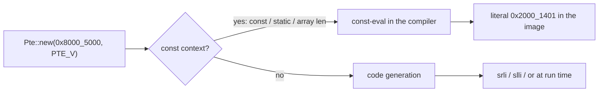
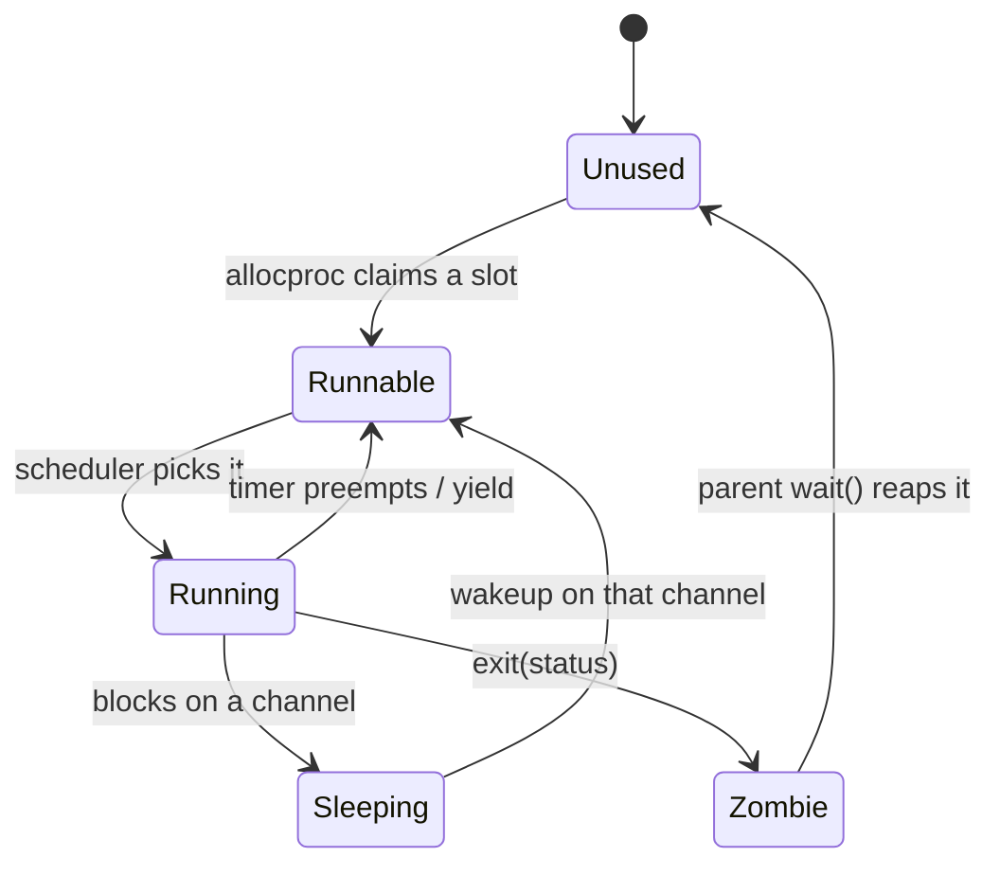

# Building Your Own Types: Structs, `impl`, `const fn`, and Enums

## Overview

Everything interesting in a kernel is a type somebody invented. A process is a
struct; a saved register set is a struct; a page table entry is a 64-bit word
that must never be confused with the physical address inside it. This session
builds those types and makes the compiler enforce what they mean. We define
structs, give them behavior with `impl` blocks, separate methods from associated
functions, and choose among `&self`, `&mut self`, and `self` using the ownership
rules from L03. Then three ideas rv6 leans on: the **newtype** pattern, which
turns a `u64` into a `Pte` so that handing over a physical address where an entry
belongs is a compile error; `const fn`, which builds page table entries and a
64-slot process table before a single instruction executes; and `#[repr(C)]`, the
only reason assembly may store the stack pointer at `Context + 8`. The second
half is enums, `match`, exhaustiveness, and `Option`. The exercises are
`04r_structs_impl` (Thursday, September 10) and `05r_enums_match` (Friday,
September 11).

## Learning Objectives

- **Define** a struct with fields and give it behavior in an `impl` block.
- **Distinguish** a method from an associated function, and `&self` from `&mut self` from `self`.
- **Explain** why the newtype pattern catches bugs a `typedef` cannot.
- **Evaluate** a `const fn` by hand and name the contexts that force compile-time evaluation.
- **Predict** struct layout under `repr(Rust)`, `#[repr(C)]`, and `#[repr(transparent)]`.
- **Justify** `#[repr(C)]` on `Context` from the assembly that indexes it.
- **Describe** an enum as a sum type and compare it to a C `enum` of integers.
- **Argue** that `match` exhaustiveness is a safety property, not a syntax rule.

## Prerequisites

- **L02 Rust I: Values, Types, Control Flow** — `usize`, bit operators, expressions.
- **L03 Ownership, Borrowing, and Lifetimes** — moves, `&T` versus `&mut T`, one-writer rule.
- Exercises `02r_ownership` (today) and `03r_borrowing` (Friday).
- [Rust for Systems](../guides/rust-for-systems.md) — types and integer widths.
- [Using OSlings](../guides/oslings-usage.md) — `oslings run`, `watch`, `hint`.

---

## 1. The Problem: a Kernel Written in Integers

A real signature from the rv6 reference kernel, `walk()` (`vm.rs`):

```rust
pub unsafe fn mappages(table: *mut Pte, va: usize, size: usize,
                       pa: usize, perm: usize) -> Result<(), ()>
```

Four of the five parameters are `usize`. A virtual address, a byte count, a
physical address, and a bag of permission bits are, to the machine, the same
thing: sixty-four bits. Swap `va` and `pa` at a call site and the program
compiles, links, boots, and maps the wrong page — with the symptom surfacing far
from the transposed argument that caused it.

xv6, the C kernel this course is modeled on, has the same problem everywhere:
`typedef uint64 pte_t;` names an entry, `typedef uint64 *pagetable_t;` names 512
of them. But `typedef` creates an **alias**, not a type: `pte_t` and `uint64` are
interchangeable in every expression. Rust's `type Pte = u64;` is equally
powerless. Only a `struct` makes a genuinely new type.

> Key distinction: an *alias* renames an existing type and changes nothing the
> compiler checks. A *newtype* is a one-field struct — a different type, the
> same bits.

Every kernel chooses how much of its meaning to write into the type system. rv6
chooses partially: page table entries get their own type, because entries and
addresses are confused constantly and fatally; addresses, sizes, pids, and
descriptors stay `usize`, because wrapping all of them would bury a teaching
kernel in conversions. Linux sits further along the same axis with `phys_addr_t`,
`pfn_t`, `pgprot_t`, and `pid_t`.

---

## 2. Structs: Naming a Bundle of Values

A struct bundles values into one named type that travels as a unit:

```rust
pub struct MemRegion { pub start: usize, pub end: usize }

let ram = MemRegion { start: 0x8000_0000, end: 0x8800_0000 };
```

`pub` on the struct exports the type; `pub` on a field exports access to it.
Leaving it off is how a module stops the rest of the kernel from corrupting its
data — `FileSystem` (`fs.rs`) keeps its `inodes` array private so every change
goes through a method that validates it.

A struct is a **product type**: a `MemRegion` is a `start` *and* an `end`. Hold
onto that word; §7 is the other half of the pair.

In memory a struct is a contiguous block of bytes and nothing else — no object
header, no type pointer, no vtable, no allocation. That is why structs work at
the hardware boundary: `size_of::<Pte>()` is 8, so `size_of::<[Pte; 512]>()` is
4096 — exactly one page, exactly what a RISC-V page table must be.

### The process control block

The central struct in any Unix kernel is the **process control block** (PCB):
everything the kernel knows about one process. In rv6 that is `Proc`
(`proc.rs`) — `state`, `pid`, `pagetable`, `context`, `trapframe`, `kstack`,
`ofile`, `parent`, `xstate`, `name`. The `context` — a fourteen-register save
area — is embedded **by value**, so switching to a process needs no second
allocation and no second dereference. And the whole table is one static array
(`PROCS` in `proc.rs`):

```text
static mut PROCS: [Proc; NPROC]                        NPROC = 64

  PROCS[0]      PROCS[1]                              PROCS[63]
 +-----------+ +-----------+                         +-----------+
 | state pid | | state pid |           ...           | state pid |
 | pagetable | | pagetable |                         | pagetable |
 | context   | |  ...      |                         |  ...      |
 +-----------+ +-----------+                         +-----------+
```

No `malloc`, no free list: the linker put the array in the kernel image, and
allocating a process means finding a slot whose `state` is `Unused`. That is only
possible because the whole array is initialized at compile time — §5.

---

## 3. `impl`: Giving a Type Behavior

```rust
impl MemRegion {
    pub fn contains(&self, addr: usize) -> bool {          // method
        addr >= self.start && addr < self.end
    }
    pub fn of_pages(start: usize, pages: usize) -> Self {  // associated fn
        MemRegion { start, end: start + pages * PAGE_SIZE }
    }
}
```

A function whose first parameter is some form of `self` is a **method**, called
with a dot; one with no `self` is an **associated function**, called through the
type with `::`. An associated function is the right shape for anything whose job
is to *produce* a value, because there is no value yet to call a method on.

Rust has no `constructor` keyword; `new` is only a convention. Hence
`Proc::new()` (`proc.rs`), `Context::zero()` (`swtch.rs`), `File::none()`
and `File::console()` (`file.rs`), `RoundRobin::new()` (`sched.rs`)
— each named for what it makes. Inside an `impl` block the type's own name may be
written `Self`.

### The three selves

Choosing the receiver is the ownership decision from L03, applied to methods.

| Receiver | Means | Caller keeps it? | Use when |
|---|---|---|---|
| `&self` | Shared borrow | Yes | Reading; any number may coexist |
| `&mut self` | Unique borrow | Yes | Mutating; excludes all other access meanwhile |
| `self` | By value | Only if `Copy` | Consuming the value, or a small `Copy` type |

`&mut self` carries real weight: while such a method runs, the borrow checker
guarantees no other reference to that value exists anywhere.

`self` by value on a small type is the interesting case. `Pte::flags`
(`vm.rs`) is `pub const fn flags(self) -> usize { self.0 & 0x3ff }`. Without
`#[derive(Clone, Copy)]` on `Pte` (`vm.rs`), calling `entry.flags()` would
**move** `entry` and the next line touching it would not compile. With `Copy` the
call copies eight bytes and `entry` survives; `is_valid` (`vm.rs`) then calls
`self.flags()` on the same value for the same reason.

> Key distinction: `Copy` does not make copying cheap — copying eight bytes was
> always cheap. It makes assignment stop *moving*. Derive it on small plain-data
> types (`Pte`, `File`, `Context`); leave it off anything that owns a resource.

`#[derive(...)]` also writes `Clone`, `PartialEq`/`Eq` (field-by-field `==`), and
`Debug` (what `assert_eq!` prints on failure). Writing these by hand is L06.

---

## 4. The Newtype Pattern

A struct with unnamed fields is a **tuple struct**; one with a single field is a
**newtype**. In rv6 (`Pte` in `vm.rs`):

```rust
#[repr(transparent)]
#[derive(Clone, Copy)]
pub struct Pte(pub usize);
```

You reach the wrapped value by position, `self.0`. At runtime a `Pte` *is* its
`usize` — same size, same alignment, same register, same instructions. Everything
you buy is at compile time.

### What it catches

The Sv39 walk (`vm.rs`) reads an entry, pulls a physical address out of it,
and treats that address as the next level's table:

```rust
if (*pte).is_valid() {
    table = (*pte).pa() as *mut Pte;   // the entry's PPN *is* the next table
}
```

The value changes meaning mid-line: an entry goes in, an address comes out, and
every paging bug lives near a line like that. With `Pte` a distinct type an entry
cannot be passed where an address is expected, and the one deliberate
reinterpretation is spelled with an explicit cast you can grep for.

### The layout being wrapped

```text
Sv39 page table entry — one 64-bit word

 63      54 53                                            10 9         0
+----------+------------------------------------------------+-----------+
| reserved |      PPN — physical page number (44 bits)       |   flags   |
+----------+------------------------------------------------+-----------+
                                                              9 8 7 6 5 4 3 2 1 0
                                                              RSW  D A G U X W R V

  V valid  R readable  W writable  X executable  U user-mode
  G global  A accessed  D dirty     RSW software-defined
```

The physical page number is the address with its low twelve bits removed
(`pa >> 12`), which loses nothing: a page is 4096 = 2^12 bytes, so a page's base
address ends in twelve zero bits, and those freed bits hold the flags.
Building an entry is "shift down 12, shift up 10, OR in the flags" — literally
`Pte::new()` (`vm.rs`), `Pte(((pa >> 12) << 10) | flags)`. Worked once:
`0x8000_0000 >> 12 = 0x8_0000`, `<< 10 = 0x2000_0000`, `| (V|R|W) = 0x2000_0007`.

`#[repr(transparent)]` promises the wrapper has the *exact* layout and ABI of the
field inside it — which makes `[Pte; 512]` a genuine hardware page table rather
than a Rust convenience: 512 × 8 = 4096 bytes, no tag, no padding. The cost is
that `pte + 1` becomes a type error until you write a method, which is the point.

> Note on widths: the exercise's `Pte` wraps `u64`, the kernel's wraps `usize`.
> On RISC-V 64 these are the same sixty-four bits; the kernel uses `usize`
> because the value is cast to and from a raw pointer.

---

## 5. `const fn`: Arithmetic the Compiler Does For You

A `const fn` may *also* be evaluated by the compiler, before the program runs:

```rust
const ROOT: Pte = Pte::new(0x8000_5000, PTE_V);
```

`ROOT` is not computed at startup. The compiler runs `Pte::new` itself —
`0x8000_5000 >> 12 = 0x8_0005`, `<< 10 = 0x2000_1400`, `| 1 = 0x2000_1401` — and
bakes that literal into the image. No shift instruction exists anywhere.



`const` only *adds* an ability: `vm.rs` calls `Pte::new` at runtime, mid-walk,
on a page address that does not exist until `kalloc` returns it.

### Why a kernel needs this

```rust
static mut PROCS: [Proc; NPROC] = [const { Proc::new() }; NPROC];   // proc.rs
```

Sixty-four process control blocks, each with a fourteen-field `Context`, a
sixteen-entry file table, and a name, fully initialized — with no code running.
That matters because of *when* the data must be valid: when the kernel's first
Rust function is entered there is no heap, no allocator, and nothing that could
have run an initialization loop. Anything a static needs is already in the image
or in the zeroed `.bss` the boot code clears.

C solves this with **static initializers**, restricted to constant expressions:
`= {0}` or `= 4096` are legal, a function call is not — hence the pile of
`xxx_init()` routines in every C kernel whose only job is to fill in what the
language could not. C++ answered with `constexpr` in 2011; Rust's `const fn`
stabilized in 2018 and lets an ordinary, typed, checked *function* go where only
a literal used to be allowed. (Note `[const { Proc::new() }; NPROC]`: the plain
repeat form requires the element type to be `Copy`, and `Proc` is not.)

A **const context** is any place the value must be known before the program runs:
a `const` or `static` item, an array length (`[u8; PGSIZE]`), an array repeat, an
enum discriminant. Inside a `const fn` you may use arithmetic, comparisons, `if`,
`match`, `loop`, and other `const fn`s; you may not allocate, call a non-`const`
function, or (on stable Rust) dereference a raw pointer — which is why `walk` and
`mappages` are ordinary functions.

---

## 6. `#[repr(C)]`: When Something Other Than Rust Reads Your Struct

By default a struct has representation `repr(Rust)`, and the language promises
**nothing** about layout: not field order, not padding, not that two identical
declarations agree. The compiler may sort fields to minimize padding, and does —
`struct { flags: u8, addr: u64, count: u16 }` takes 24 bytes under C's rules
(7 bytes of padding to align `addr`, 6 more at the tail) and may take 16 under
Rust's, by putting the most-aligned field first.

`#[repr(C)]` gives the freedom up and uses C's rules: fields in source order,
each at the next offset satisfying its alignment. You need it exactly when
something that is not the Rust compiler reads the bytes — assembly, hardware, a C
library, or a saved image.

### `Context` and the assembly that indexes it

`swtch.rs` declares a `#[repr(C)]` struct with fields `ra`, `sp`, `s0` … `s11`.
Thirty lines later, in the same file, hand-written assembly reads it by numeric
offset (`swtch.rs`). The contract is that field *i* lives at offset
8*i*:

```text
        Context  (Rust, #[repr(C)])     swtch  (hand-written asm; a0=old, a1=new)
offset  +--------------------------+
   0    | ra   return address      | <-->  sd ra,  0(a0)   /  ld ra,  0(a1)
   8    | sp   stack pointer       | <-->  sd sp,  8(a0)   /  ld sp,  8(a1)
  16    | s0                       | <-->  sd s0,  16(a0)  /  ld s0,  16(a1)
  ...   |  ...                     |
 104    | s11                      | <-->  sd s11, 104(a0) /  ld s11, 104(a1)
        +--------------------------+       112 bytes = 14 x 8
```

`Trapframe` (`usermode.rs`) is the same argument at larger scale: its 35
fields each carry their byte offset in a comment, because the trampoline assembly
saves every user register by that offset — `sd sp, 48(a0)` in `uservec`
matches `pub sp: u64, // 48` in `Trapframe` (`usermode.rs`).

!!! warning "This failure is silent at compile time"

    Delete `#[repr(C)]` from `Context` and nothing breaks in the build. The
    assembly is still valid; it may simply store the return address into whatever
    field now sits at offset 0. The first symptom is a jump to a garbage address
    on the next context switch, long after the mistake.

Worse, `Context`'s fourteen fields are all `usize`, so today's compiler has no
reason to reorder them and the kernel would probably keep running. The bug is not
that it breaks — it is that nothing *promises* it will not.

| Attribute | Guarantee | Used in rv6 for |
|---|---|---|
| `repr(Rust)` | None; optimize freely | Everything internal |
| `#[repr(C)]` | Source order, C alignment | `Context`, `Trapframe`, `Run` (`kalloc.rs`) |
| `#[repr(transparent)]` | Identical to the single field | `Pte` (`vm.rs`) |
| `#[repr(packed)]` | No padding at all | Nothing — refs to unaligned fields are UB |

---

## 7. Enums: Exactly One of These

A struct is "this *and* that". An enum is "this *or* that" — a **sum type**.

```rust
#[derive(Clone, Copy, PartialEq, Eq)]
pub enum ProcState { Unused, Runnable, Running, Sleeping, Zombie }   // proc.rs
```

Each name is a **variant**, and the type has five values in total — not five
valid values out of four billion. There is no `ProcState` equal to 47.

xv6 writes the same idea as a C `enum`, which is an `int` wearing a costume:
`p->state = 47;` compiles, runs, and means nothing. Two holes — nothing rejects
`47`, and nothing tells you which of the dozen `switch (p->state)` statements
needs revisiting when a sixth state is added. Both have shipped as real kernel
bugs; Rust closes the first with the type, the second with exhaustiveness. rv6
uses enums wherever the possibilities are closed and known — `InodeKind`
(`fs.rs`), `FileKind` (`file.rs`), `FsError` (`fs.rs`), `ExecError`
(`lookup()` in `exec.rs`).



That diagram *is* the type, drawn: every arrow a legal transition, every missing
arrow a move the kernel must refuse.

### Variants that carry data

A variant may hold fields of its own (`RunOutcome` in `usermode.rs`):

```rust
pub enum RunOutcome {
    Exited(isize),    // the root process finished, with this status
    Faulted(usize),   // something illegal happened; scause says what
    TimedOut,         // a watchdog gave up
}
```

One value answers two questions at once: how the run ended, and with what. A C
API says this with an `int`, an out-parameter, and a convention about which is
meaningful when; here the pairing is enforced, since a `Faulted` has no exit
status to reach.

In memory such an enum is a **discriminant** (a tag saying which variant) plus
space for the largest payload, rounded for alignment; `RunOutcome` is 16 bytes.
Rust also applies **niche optimization**: when a payload has bit patterns it can
never take, the tag hides in those — which is why `Option<&T>` is one pointer
wide, with `None` as the null pattern a `&T` can never hold.

### `Option<T>`: no null

Rust has no null. A possibly-absent value has a different *type*, defined in the
library rather than the language: `enum Option<T> { Some(T), None }`. Tony Hoare,
who put null references into ALGOL W in 1965, called it his "billion-dollar
mistake" in 2009: the problem is not that absence exists, but that in C and Java
an absent value has the same type as a present one, so the compiler cannot say
which dereferences need checking. `Option<File>` and `File` are different types,
so it can. rv6 uses this wherever an answer might not exist: `getfile` returns
`Option<File>` (`syscall.rs`), `pick_next` returns `Option<usize>`
(`sched.rs`) where `None` means "nothing is runnable". Below the safe layer
`kalloc()` still hands back a raw `*mut u8` that may be null.

---

## 8. `match`, Exhaustiveness, and Guards

```rust
let ticks = match state {                    // 05r's data-carrying ProcState
    ProcState::Unused                        => 0,
    ProcState::Runnable | ProcState::Running => 1,
    ProcState::Sleeping { .. }               => 2,
    ProcState::Zombie { exit_status }        => exit_status,
};
```

Each **arm** is a pattern, `=>`, and the value it produces; `match` is an
expression, which is why it sits on the right of a `let`. Four pattern features
appear: `|` for alternatives, `{ .. }` for "has fields, don't care", `{ name }`
to bind one, and `_` for anything.

### Exhaustiveness is the safety property

Delete the `Zombie` arm and the program does not compile:
`error[E0004]: non-exhaustive patterns: ProcState::Zombie { .. } not covered`.

Read forwards, that is a nuisance; read backwards, it is why the type exists.
Add a sixth state in week 9 — `Stopped`, for a process suspended by a signal. In
C every `switch` keeps compiling and silently takes its `default` arm, and you
find the wrong ones by debugging a kernel. In Rust the compiler lists every place
needing a decision, by file and line, before boot.

> Key distinction: exhaustiveness is not a syntax requirement, it is a
> *refactoring tool*. Its value is not in the match you are writing now, but in
> the twelve you will not remember when you change the enum next month.

### The `_` trap, and when `_` is right

`_` switches the check off forever: a catch-all covers variants that do not exist
yet, so adding one produces no error and no warning. rv6 uses `_` twice, and both
are right — `dispatch()` in `syscall.rs` (`_ => -1`, unknown syscall number) and `kerneltrap()` in `trap.rs`
(`_ => {}`, unhandled interrupt cause). Both match a raw integer arriving from
outside the kernel, chosen by a user program or by hardware, so the domain is
genuinely open. Contrast `FileSystem::read()` (`fs.rs`), which matches `InodeKind` with one arm per
variant and no catch-all, including an empty `InodeKind::File => {}` arm whose
only job is to say "handled, deliberately". The rule: `_` for open domains, never
for closed ones you defined yourself.

### Guards

An arm may carry an `if` condition, a **guard** (`sys_read()` in `syscall.rs`):

```rust
let file = match getfile(p, fd) {
    Some(f) if f.readable => f,
    _ => return -1,
};
```

"There is an open file here **and** it is readable." What matters is the failure
case: matching *continues with the next arm* rather than leaving the `match`, so
a write-only file falls through to `_` and the read fails with -1 — exactly the
Unix semantics. Testing inside the arm body loses that fall-through and forces
you to restate the failure path.

Because the compiler will not reason about arbitrary conditions, **guarded arms
do not count toward exhaustiveness**, so a `match` resting on one still needs a
fallback. Guards compose with tuple patterns — `match (state, event)` tests two
values at once — which is how a transition table becomes one readable block.
Where only one variant matters, `if let ProcState::Zombie { exit_status } = state
{ ... }` is a one-arm `match`, and `let ... else` handles the "bind or bail out"
shape kernel code is full of.

---

## 9. Where This Lands

`Pte` drives a real three-level Sv39 walk in exercise 33k; `Proc` and `ProcState`
are exercise 34k; `Context` and the assembly indexing it are exercise 35k;
`#[repr(C)]` on `Trapframe` makes user mode possible in exercise 48k.
`04r_structs_impl` builds `MemRegion` and a working `Pte`; `05r_enums_match`
builds a process state machine from an enum, a `match`, and an `Option`. Both run
under `cargo test` — no QEMU, no kernel. Read the tests at the bottom of each
`warmup/src/lib.rs` first: they are the contract.

---

## Key Concepts

| Concept | Definition | Example |
|---|---|---|
| Struct | Named product type bundling fields that travel as a unit | `struct MemRegion { start, end }` |
| Method vs associated function | With a `self` receiver, called with `.`; without, with `::` | `ram.contains(addr)` vs `Context::zero()` (`swtch.rs`) |
| Receiver | `&self` reads, `&mut self` mutates, `self` takes by value | `fn flags(self) -> usize` (`vm.rs`) |
| `Copy` | Assignment copies instead of moving | `#[derive(Clone, Copy)] pub struct Pte(pub usize)` |
| Newtype | One-field tuple struct giving a representation a new type; `#[repr(transparent)]` fixes its layout | `pub struct Pte(pub usize)` (`vm.rs`) |
| `const fn` | Function the compiler may evaluate before run time | `const ROOT: Pte = Pte::new(0x8000_5000, PTE_V);` |
| `#[repr(C)]` | Source order and C alignment; layout becomes a contract | `Context`, read by `sd sp, 8(a0)` (`swtch.rs`) |
| Enum / variant | Sum type: exactly one of a fixed set of named cases | `ProcState::{Unused, Runnable, ...}` (`proc.rs`) |
| Exhaustiveness | Every value must be covered, or `E0004` | Adding a variant breaks each incomplete `match` |
| `Option<T>` | `Some(T)` or `None`: absence with its own type | `fn pick_next(..) -> Option<usize>` (`sched.rs`) |
| Match guard | `if` on an arm; failure falls through to the next arm | `Some(f) if f.readable => f` (`syscall.rs`) |

---

## Practice Problems

### Problem 1: Pack and unpack an entry by hand

With `PTE_V = 1`, `PTE_R = 2`, `PTE_W = 4`, `PTE_X = 8` and the Sv39 layout of §4:

1. What word does `Pte::new(0x8020_3000, PTE_V | PTE_R | PTE_X)` hold?
2. A slot holds the raw word `0x2000_1401`. What address does it map, and which flags are set?
3. Why is `Pte::new(0x8000_1234, PTE_V).pa()` equal to `0x8000_1000`?
4. Which parts could the compiler do for you, and what must be true of the code?

<details>
<summary>Click to reveal solution</summary>

**1.** `new` is `((pa >> 12) << 10) | flags`. `0x8020_3000 >> 12 = 0x8_0203`;
`<< 8` gives `0x802_0300`, two more bits multiplies by 4, giving `0x2008_0C00`;
flags are `1 + 2 + 8 = 0xB`. Result **`0x2008_0C0B`**.

**2.** Flags are the low ten bits: `0x401` is `0b100_0000_0001`, and masking to
ten bits clears bit 10, leaving `0x1` — **only `PTE_V`**, so this is a non-leaf
entry pointing at the next level. Address: `0x2000_1400 >> 10 = 0x8_0005`,
`<< 12 =` **`0x8000_5000`**.

**3.** A PTE stores a *page number*: `>> 12` discards the offset within the page
and nothing puts it back, so `0x234` is lost on the way in. Not a defect — those
bits come from the virtual address at translation time.

**4.** All of them; `new`, `pa`, and `flags` are `const fn` (`vm.rs`). But the arithmetic runs in the compiler only if the result is demanded in
a const context. In an ordinary `let` the optimizer usually folds it anyway;
`const` *guarantees* it and errors if it cannot.

</details>

### Problem 2: The offset bug

A student wants `Context` to record where the process was interrupted and adds a
field, leaving `swtch`'s assembly untouched:

```rust
#[repr(C)]
pub struct Context { pub epc: usize, pub ra: usize, pub sp: usize, /* s0..s11 */ }
```

`init_context` (`swtch.rs`) still does `(*ctx).ra = entry; (*ctx).sp = stack_top;`

1. After `init_context`, which offsets hold `entry` and `stack_top`?
2. What does `swtch` load into `ra` and `sp` when switching *to* this context?
3. Describe the failure and where it appears relative to the edit.
4. Had they deleted `#[repr(C)]` instead, would the kernel break? Is that good?
5. Separately: `size_of::<Pte>()` is 8. Why does `size_of::<[Pte; 512]>() == 4096` matter?

<details>
<summary>Click to reveal solution</summary>

**1.** `#[repr(C)]` still holds, so fields sit in source order at 8-byte
intervals: `epc` @0, `ra` @8, `sp` @16. `init_context` writes through field
*names*, so `entry` lands at **offset 8** and `stack_top` at **offset 16**.

**2.** The assembly uses fixed numbers. `ld ra, 0(a1)` loads the freshly zeroed
`epc`, i.e. **0**; `ld sp, 8(a1)` loads **`entry`, a code address**. Every
`ld sN` after that is off by one slot too.

**3.** `swtch` ends in `ret`, which jumps to `ra` — address 0, an unmapped page,
so an instruction page fault at `sepc = 0`, with the stack pointer aimed into the
text segment. It appears at the *first context switch*, in a file the student
did not edit, with a fault address naming no function.

**4.** Probably not, today: all fourteen fields are `usize`, so rustc has no
reason to reorder them. That is the **worst** outcome — the code would depend on
unspecified behavior that happens to hold, and would break silently on a
compiler upgrade, or the day someone changes `ra` to a `u32`.

**5.** `#[repr(transparent)]` (`vm.rs`) makes a `Pte` exactly its `usize` — no
tag, no padding — so 512 of them are 4096 bytes back to back, and a RISC-V page
table is *defined* as one 4096-byte page of 512 eight-byte entries. Add a `bool`
field and the struct pads to 16 bytes: the array becomes two pages and the MMU
reads every second slot as garbage.

</details>

### Problem 3: Choosing the receiver

```rust
impl Region {
    fn size(???) -> usize                           { self.end - self.start }
    fn grow(???, pages: usize)                      { self.end += pages * PAGE_SIZE; }
    fn split_at(???, at: usize) -> (Region, Region) { /* ... */ }
}

#[derive(Clone)]                      // note: no Copy
pub struct Pte(pub u64);
impl Pte {
    pub fn flags(self) -> u64 { self.0 & 0x3ff }
    pub fn is_valid(self) -> bool { self.flags() & 1 != 0 }
}
```

1. Fill in the three receivers.
2. Why does `split_at` not need `Region: Copy`, while `Pte::flags(self)` needs `Pte: Copy`?
3. The `Pte` block does not compile. Name the error and give two fixes.

<details>
<summary>Click to reveal solution</summary>

**1.** `size(&self)` — reads, caller keeps the region. `grow(&mut self, pages)` —
writes a field, so it needs the unique borrow. `split_at(self, at)` — the
original is *replaced* by the two halves; consuming it says so, and the compiler
then guarantees nobody still holds it.

**2.** `split_at` takes `self` *in order to* consume it: the move is the intended
semantics. `Pte::flags` takes `self` only because copying eight bytes is simpler
than borrowing, and the caller expects to keep the entry. By-value `self` is a
move unless the type is `Copy`, so the second case needs `Copy`, the first does
not.

**3.** `is_valid` calls `self.flags()`, which takes `self` by value and therefore
moves it: **E0382, use of moved value**. Fixes: add `Copy` to the derive, as
`Pte` (`vm.rs`) does, so the call copies eight bytes; or make both receivers `&self`,
since borrowing never moves — the answer for any type too large or too
resource-owning to copy.

</details>

### Problem 4: The compiler as code reviewer

`ProcState::Stopped` is added for a process suspended by a signal.

```rust
// A
fn can_run(s: ProcState) -> bool {
    match s {
        ProcState::Runnable | ProcState::Running => true,
        ProcState::Unused | ProcState::Sleeping | ProcState::Zombie => false,
    }
}
// B
fn is_free(s: ProcState) -> bool { match s { ProcState::Unused => true, _ => false } }
// C
fn label(s: ProcState) -> &'static str {
    if s == ProcState::Zombie { "zombie" } else { "live" }
}

```

1. Which fail to compile?
2. For each that compiles, is its behavior correct for `Stopped`?
3. What single change to B would have made the compiler flag it?
4. State the general rule.

<details>
<summary>Click to reveal solution</summary>

**1.** Only **A**, with `error[E0004]: non-exhaustive patterns:
ProcState::Stopped not covered`. B has a `_` arm and is exhaustive by
construction; C is an `if`, so exhaustiveness never applies.

**2.** **B** happens to be right — a stopped process is not a free slot — but
right by luck, since nobody was asked. **C is wrong**: a stopped process is
neither a zombie nor schedulable, yet `label` calls it "live". The compiler said
nothing.

**3.** Replace the catch-all with the variants it stands for:
`ProcState::Runnable | ProcState::Running | ProcState::Sleeping | ProcState::Zombie => false`.
Adding `Stopped` then breaks the build and forces a decision.

**4.** Exhaustiveness only protects the matches that let it: one arm per variant
for closed domains you own, `_` only for open ones such as syscall numbers
(`dispatch()` in `syscall.rs`). C adds a second lesson — `==` bypasses the check, so a chain
of `if`s over an enum buys back the C behavior in full.

</details>

### Problem 5: Tracing guards and fall-through

```rust
enum State { Running, Sleeping { chan: u64 }, Zombie { status: i32 } }
enum Event { Wake { chan: u64 }, Reap, Preempt }

fn step(s: State, e: Event) -> Option<State> {
    match (s, e) {
        (State::Sleeping { chan: c }, Event::Wake { chan: w }) if c == w
                                            => Some(State::Running),
        (State::Running, Event::Preempt)    => Some(State::Running),
        (State::Zombie { .. }, Event::Reap) => Some(State::Running),
        _                                   => None,
    }
}
```

1. Give the result of `(Sleeping{chan:0x1000}, Wake{chan:0x1000})`; `(Sleeping{chan:0x1000}, Wake{chan:0x2000})`; `(Running, Reap)`; `(Zombie{status:3}, Reap)`.
2. Rewrite arm 1 with the channel test as an `if` inside the body. What changes?
3. Delete `_ => None`. Does it compile?
4. Why does arm 3 write `{ .. }` rather than `{ status }`?

<details>
<summary>Click to reveal solution</summary>

**1.** `Some(Running)` — arm 1, guard holds. **`None`** — arm 1's *pattern*
matches but the guard fails, so matching **continues**; arms 2 and 3 do not match
a `Sleeping`, so `_` answers. That is the whole point: a wakeup on the disk's
channel must not wake a process waiting on the console. `None` — no arm covers
`(Running, Reap)`. `Some(Running)` — arm 3.

**2.** `=> if c == w { Some(State::Running) } else { None }`. Behaviorally the
same *here*, structurally worse: once the pattern matches, the `match` is
committed to that arm, so the `else` must reproduce what the fall-through would
have done. In a real transition table every guard failure restates the default by
hand.

**3.** No — `error[E0004]: non-exhaustive patterns`. Guarded arms do not count
toward exhaustiveness, since the compiler will not try to prove `c == w` covers
every case, so `(Sleeping { .. }, Wake { .. })` is formally uncovered — and pairs
like `(Sleeping, Preempt)` are genuinely uncovered anyway.

**4.** The arm does not use the status. `{ .. }` says "this variant has fields
and I do not need them"; `{ status }` would bind an unread variable and earn an
`unused_variables` warning.


</details>

---

## Further Reading

- [Rust for Systems](../guides/rust-for-systems.md) — struct and enum syntax, the derive table, the receiver cheat sheet.
- [Sv39 Paging](../guides/sv39-paging.md) — the full entry layout and the three-level walk.
- [Memory Map](../guides/memory-map.md) — `KERNBASE`, `PHYSTOP`, `TRAMPOLINE`, `TRAPFRAME`.
- [RISC-V](../guides/riscv.md) — registers, `sd`/`ld`, and the convention `Context` follows.
- [rv6 Architecture](../guides/rv6-architecture.md) — how `proc.rs`, `vm.rs`, `swtch.rs`, and `usermode.rs` fit together.
- [Cheatsheet](../guides/cheatsheet.md), [Key Concepts](../guides/key-concepts.md) — exam lookup.
- *The Rust Programming Language*, ch. 5–6 — the chapters this session compresses.
- *The Rust Reference*, "Type layout" — what each `repr` does and does not guarantee.
- *The Rustonomicon*, "Data Representation in Rust" — field reordering, niche optimization.
- *RISC-V Privileged Architecture*, §4.4 — the Sv39 page table entry from the source.
- Cox, Kaashoek, Morris, *xv6: a simple, Unix-like teaching operating system*, ch. 2–3 — read `proc.h` beside `proc.rs`.
- C. A. R. Hoare, "Null References: The Billion Dollar Mistake" (QCon London, 2009).

---

## Summary

1. **A kernel written only in integers cannot be checked.** Addresses, sizes, pids, and flag words are all 64 bits; the compiler cannot tell them apart unless you give it types that do.
2. **Structs are product types with no runtime overhead.** A contiguous block of fields — no header, no vtable, no allocation — which is why `Proc` sits in a static array of 64 and `[Pte; 512]` is a hardware page table.
3. **`impl` blocks hold methods and associated functions.** A `self` receiver makes a method, called with `.`; no receiver makes an associated function, called with `::` — the shape of every constructor in rv6.
4. **The receiver is an ownership decision.** `&self` reads, `&mut self` mutates under a unique borrow, `self` consumes — and `self` on a small type works only because `Copy` makes assignment stop moving.
5. **The newtype pattern is free at runtime and load-bearing at compile time.** `Pte(usize)` is the same eight bytes, but confusing an entry with an address becomes a type error, and `#[repr(transparent)]` keeps `[Pte; 512]` one page.
6. **`const fn` moves arithmetic into the compiler.** It is what lets `static mut PROCS: [Proc; 64] = [const { Proc::new() }; 64]` exist where no code has run and no allocator exists.
7. **`#[repr(C)]` turns layout into a contract.** Rust may reorder fields; `Context` and `Trapframe` give that up because assembly indexes them by byte offset, and removing the attribute fails silently at build time.
8. **Enums plus exhaustive `match` make the compiler review your changes.** Adding a sixth `ProcState` yields a generated list of every decision now needed — unless you wrote `_`. `Option<T>` applies the same mechanism to absence.
