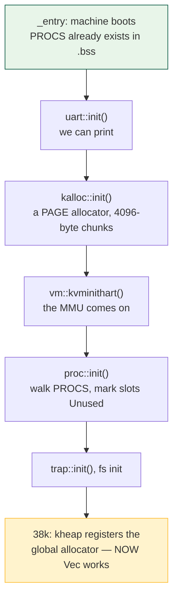

# L05: Arrays, Slices, `Vec`, and Fixed Tables

## Overview

Every operating system keeps lists of things: processes, open files, free
pages, buffered keystrokes. Where those lists live, and whether they may grow,
is one of the first real design decisions in a kernel. This session covers the
three ways Rust holds a run of values — the array `[T; N]`, the borrowed view
`&[T]`, and the growable `Vec<T>` — and what each is in memory. Then it makes
the argument the rest of the course rests on: rv6's process table is
`static mut PROCS: [Proc; NPROC]` (`proc.rs:65`), a plain array of 64 slots,
and it is an array rather than a `Vec` for reasons that have nothing to do
with taste. No allocator exists when the table is first needed, the trap path
may not allocate, and a hard limit fails honestly — a principle that recurs in
the file table, the inode table, and the console buffer. The exercise is
`06r_collections`, on Thursday, September 17 alongside `07r_traits`; see the
[exercise list](../assignments/exercises.md).

## Learning Objectives

- **Distinguish** `[T; N]`, `&[T]`, `&mut [T]`, and `Vec<T>` by where the bytes live and who owns them.
- **Describe** a slice as a two-word fat pointer, and why `[T]` cannot stand alone.
- **Explain** what a bounds check compiles to and what it costs.
- **Choose** between `table[i]`, `table.get(i)`, and an explicit range check for an untrusted index.
- **Trace** adapter chains built from `iter`, `iter_mut`, `enumerate`, `position`, `find`, and `map`.
- **Justify** rv6's fixed `[Proc; NPROC]` from boot order, the fault-path rule, and failure semantics.
- **Compute** a fixed table's static footprint from its element type.
- **Compare** rv6's static tables with xv6's and Linux's dynamic `task_struct`.

## Prerequisites

- **L03 Ownership, Borrowing, and Lifetimes** and exercises `02r`, `03r`: moves, `&`, `&mut`, the aliasing rule.
- **L04 Structs, `impl`, and `const fn`** and exercise `04r` (Thursday): struct layout, and what `const fn` buys you.
- Exercise `05r` (Friday): `Option<T>`, `Some`/`None`, exhaustive `match`.
- [Rust for Systems](../guides/rust-for-systems.md), the sections on types and references.
- [rv6 Architecture](../guides/rv6-architecture.md), for where `proc.rs` and `param.rs` sit.

---

## 1. Three Ways to Hold N Things

The question is older than Rust: when a program keeps N values of one type,
where do the bytes go and who is responsible for them? Three answers, and Rust
gives each its own type.

### `[T; N]` — the array

An **array** is N values of type `T` laid end to end, N baked into the type.
`[u32; 4]` and `[u32; 5]` are as different as `u32` and `bool`, and no array
ever changes length.

```rust
let a: [u32; 4] = [10, 20, 30, 40];   // list the elements
let b = [0u32; 4];                     // repeat one value
```

Because N is a compile-time constant, `size_of::<[u32; 4]>()` is 16 and the
compiler knows it before the program runs. A local array lives on the stack; a
`static` array lives in the executable's data or `.bss` section, its address
fixed by the linker. Nothing has to *run* for a static array to exist — which
is most of the argument in section 5.

### `Vec<T>` — the growable one

A `Vec<T>` owns a block of memory on the **heap** — the pool a program asks
for more of while it runs. The `Vec` itself is three words: a pointer, a `len`
(elements live), and a `cap` (elements that fit before the next
reallocation). `push` beyond `cap` allocates a larger block, copies everything
across, and frees the old one — which is why `push` is amortised O(1) but any
individual `push` may be slow, and may fail.

### `&[T]` — the slice

A **slice** is a borrowed window onto a run of elements somebody else owns: a
pointer and a length, 16 bytes, and nothing else. No capacity, because a slice
cannot grow; no ownership, because it allocated nothing and will free nothing.
A slice borrows under the rules from `03r` — `&[T]` shared, `&mut [T]`
exclusive.

> Key distinction: an array *is* the data, a `Vec` *owns* the data, a slice
> *points at* data. The first two answer "where do the bytes live"; the slice
> answers "how do I pass them around without copying or giving them away".

All three, same four numbers:

```text
  [u32; 4]  — the values ARE the variable
  +----+----+----+----+
  | 10 | 20 | 30 | 40 |      stack or .bss, size fixed at compile time
  +----+----+----+----+
   ^
   |  &arr[1..3]
   |  +-------+-------+
   +--|  ptr  | len=2 |       a slice: 16 bytes, borrows the middle two
      +-------+-------+

  Vec<u32> — the variable POINTS AT the values
  +-------+-------+-------+
  |  ptr  | len=4 | cap=8 |   24 bytes, on the stack
  +-------+-------+-------+
      |
      v  heap, allocated at run time, freed when the Vec drops
  +----+----+----+----+----+----+----+----+
  | 10 | 20 | 30 | 40 | ?? | ?? | ?? | ?? |
  +----+----+----+----+----+----+----+----+
```

---

## 2. What a Slice Really Is

The type `[T]` — no length, no reference — is legal, but you can never hold a
value of it: its size is unknown at compile time, so the compiler cannot say
how much stack to reserve or how to pass it in a register. Such types are
**unsized** and usable only behind a pointer: `&[T]`, `&mut [T]`, `Box<[T]>`.
The pointer carries the missing length, which makes it a **fat pointer**:

```rust
core::mem::size_of::<&u32>()      // 8   thin
core::mem::size_of::<&[u32]>()    // 16  fat: address + length
core::mem::size_of::<&[u32; 4]>() // 8   thin: the 4 is in the type
```

That last line is the trick: `&[u32; 4]` needs no run-time length because the
length is a compile-time fact, while `&[u32]` could point at three elements or
three million.

### Making slices

Slices come from ranges. Given `let buf = [0u8; 512];`, `&buf[..]` is the
whole thing, `&buf[..n]` the first `n` bytes, `&buf[n..]` everything from `n`
on, `&buf[a..b]` the `b - a` elements starting at `a`, and `&mut buf[..n]` the
same run writable and exclusive. Arrays and `Vec`s convert to slices
automatically wherever one is expected, so you rarely write `&buf[..]` by
hand. rv6's `wc` writes one explicitly, and it is the important one:

```rust
let n = ulib::read(fd, &mut buf)?;
for &b in &buf[..n] { ... }
```

That is `wc.rs:36` and `wc.rs:40`. `read` got the whole 512-byte buffer and
returns how many bytes it actually delivered; `&buf[..n]` is the prefix
holding real data. Iterating `&buf` would count 512 bytes every time, most of
them stale. The slice says "this many of those" without a second variable that
can drift out of sync.

### Slices are the interface

Because a slice erases the length from the type, one function serves every
container. rv6's scheduler is the cleanest example:

```rust
pub trait Scheduler {
    fn pick_next(&mut self, states: &[ProcState]) -> Option<usize>;
}
```

That is `sched.rs:6`. The policy never learns how big the process table is; it
reads `states.len()` and works, so changing `NPROC` from 64 to 8 cannot make
it wrong. The caller at `usermode.rs:285` builds a `[ProcState; NPROC]` on its
stack, fills it, and passes `&states` (`usermode.rs:290`). Write your own
signatures the same way: `&[T]` to read, `&mut [T]` to write, and a concrete
`[T; N]` or `Vec<T>` only when you need the length at compile time or need to
own the storage.

> Key distinction: the borrow rules do not soften for slices. `&mut [T]` is an
> exclusive borrow of the *whole run*, which is why you cannot hold `&mut v[0]`
> and `&mut v[1]` at once — the compiler cannot prove the indices differ.
> `split_at_mut` exists to make exactly that one promise safely.

---

## 3. Indexing and Bounds Checks

`table[i]` in Rust is not the same instruction sequence as `table[i]` in C. It
compiles to roughly this, in RISC-V terms:

```asm
    # let x = table[i];   table in a0, i in a1, len 8
    li      t0, 8
    bgeu    a1, t0, .Lpanic   # unsigned: is i >= len ?
    slli    t1, a1, 3         # i * 8 bytes per element
    add     t1, a0, t1
    ld      a2, 0(t1)         # the actual load
.Lpanic:
    call    core::panicking::panic_bounds_check
```

Three extra instructions, one of which the compiler usually folds away, and a
branch that is never taken and so is predicted perfectly. The compare is
*unsigned* on purpose: a negative index reinterpreted as unsigned is enormous,
so `bgeu` catches both ends at once.

In practice the cost is near zero: the optimizer deletes most checks.
`for x in table.iter()` emits none, and `for i in 0..table.len()` usually has
its bound proved. What survives is what the compiler could not prove —
exactly the checks you wanted.

### Three ways to index

| Form | On a bad index | Use when |
|---|---|---|
| `table[i]` | panics | `i` is yours and provably in range |
| `table.get(i)` | returns `None` | out-of-range is a normal outcome |
| `unsafe { table.get_unchecked(i) }` | undefined behavior | essentially never here |

For the kernel there is a fourth: check it yourself and return an error. That
is not the same as `get`, because the check happens at the *boundary*, once,
and everything past it can index freely. rv6 does this wherever an index
arrives from a user program:

```rust
unsafe fn getfile(p: *mut Proc, fd: usize) -> Option<File> {
    if fd >= NOFILE {
        return None;
    }
    let f = (*p).ofile[fd];
    ...
}
```

`syscall.rs:312`. That `fd` came out of a user register — it is whatever the
program put there — and `getfile` refuses it before touching the array.

!!! warning "A panic in the kernel is not a failed test"
    On your laptop an out-of-bounds index kills one process. In the kernel the
    panic handler prints and halts the machine, so a user program that can
    panic the kernel with a bad system-call argument owns a denial-of-service
    attack on the whole system. Validate at the boundary.

### What C does instead

C performs no check: `table[99]` on an eight-element array computes an address
and loads from it, and whatever lives there is what you get — or overwrite.
That decision is the root of a large share of the security bugs of the last
forty years; the 1988 Morris worm spread through a `gets` into a fixed buffer
in `fingerd`, and "out-of-bounds write" is still in the CWE top five. The
check is cheap insurance; `getfile` encodes the deeper lesson — know where
untrusted numbers enter, and check them there.

---

## 4. Iterating

A `for` loop is sugar: `for x in thing` becomes `into_iter(thing)` plus
repeated `next()` calls until it yields `None`. What you get out depends on
which of three things you iterate:

| You write | Each item is | The container afterwards |
|---|---|---|
| `for s in table.iter()` | `&T` — read only | untouched, still yours |
| `for s in table.iter_mut()` | `&mut T` — assign through it with `*s = ...` | modified in place |
| `for s in table.into_iter()` | `T` — moved out | consumed (for a `Vec`) |

Which one you may use is decided by your signature, not by preference: a
function that took `&[T]` borrowed for reading, so `iter_mut` will not compile
there. `enumerate()` is the adapter you will reach for most, because kernel
tables care about *where* a thing is as much as what it is:

```rust
for (index, slot) in table.iter().enumerate() {
    if *slot == Some(pid) {
        return Some(index);
    }
}
```

`enumerate` counts from 0 regardless of what it counts; it knows nothing about
your array's indices. On a full slice the two coincide, but on
`table[3..].iter().enumerate()` they do not — a classic off-by-three.

### The adapters worth knowing

You need about eight of the hundred-odd methods on `Iterator`.

| Adapter | Yields | Typical kernel use |
|---|---|---|
| `enumerate()` | `(usize, T)` | find *which slot* |
| `position(f)` | `Option<usize>` | index of the first match |
| `find(f)` | `Option<T>` | the first matching item |
| `any(f)` / `all(f)` | `bool` | "is any process runnable?" |
| `filter(f)` | matching items | walk only live slots |
| `map(f)` | transformed items | project a field per slot |
| `count()` | `usize` | how many slots are free |
| `collect()` | a container | **allocates** — host only |

rv6's line reader finds a newline with
`self.buf[self.start..self.len].iter().position(|&b| b == b'\n')`
(`lines.rs:34`): subslice first, then search, so the position is relative to
the region that holds data. The round-robin scheduler is one chain:

```rust
fn pick_next(&mut self, states: &[ProcState]) -> Option<usize> {
    let n = states.len();
    (0..n)
        .map(|off| (self.next + off) % n)
        .find(|&i| states[i] == ProcState::Runnable)
        .map(|i| { self.next = (i + 1) % n; i })
}
```

`sched.rs:20`. Read it as English: consider `n` offsets, wrap each into a
table index starting from where we left off, take the first that is runnable,
remember to resume after it next time.

The important property is that this **allocates nothing and builds nothing**.
Rust's iterators are lazy: `map` does not produce a list of eight indices, it
produces something that computes one index each time `find` asks, and `find`
stops asking the moment it succeeds. The optimized code is the loop you would
have written by hand, which is why the style is legal in a kernel with no heap
at all. `collect()` is the one adapter that breaks the rule, because it has to
put the results *somewhere*.

---

## 5. The Kernel Argument: Why `PROCS` Is an Array

The line the whole session aims at, from `proc.rs:65`:

```rust
static mut PROCS: [Proc; NPROC] = [const { Proc::new() }; NPROC];
```

with `pub const NPROC: usize = 64;` at `param.rs:7`. Sixty-four slots, decided
when the kernel is compiled, never sixty-five. In ordinary Rust that looks
like a beginner's mistake — surely a `Vec<Proc>` that grows is better. It is
not, and the reasons generalize.

### Reason 1: there is no allocator yet

Look at the order rv6 brings itself up, in `main.rs:87`:



The table is used at `proc::init()`, the fourth line of `kinit`. A `Vec<Proc>`
calls the **global allocator**, and rv6 has none until exercise 38k, where
`kheap.rs` provides a `GlobalAlloc` impl and `#[global_allocator]` registers
it (`kheap.rs:40`). Before that, `extern crate alloc` does not even compile:
`34k_processes` has no `kheap.rs`, and `38k_semaphores/main.rs:18` is the first
file in the course to declare it.

That is the shape of every boot, not an accident of our ordering. The
allocator is itself a data structure, and something must run before it works:
`kalloc::init()` (`kalloc.rs:21`) walks physical memory pushing pages onto a
free list, so it *is* what makes allocation possible and cannot allocate.
Anything needed earlier must exist without code running, as a fixed-size
static. `PROCS` sits in `.bss`: 36,352 bytes reserved at link time.

### Reason 2: the fault path must not allocate

The table is touched from the trap handler — a timer interrupt, a page fault,
a system call — and code there obeys a rule absolute in every serious kernel:
**do not allocate**. Allocation can *fail*, and a page-fault handler has
nowhere to report failure to. It takes *unbounded time*: an allocator may
search free lists, coalesce, or wake a reclaim thread and wait, and you cannot
wait inside a handler with interrupts disabled. And it *takes locks*, so an
allocator lock held by the code you interrupted deadlocks you against
yourself.

Linux fights this with `GFP_ATOMIC` — "never sleep, fail instead" — and a ban
on sleeping allocators in interrupt context. rv6 sidesteps the category: a
fixed array cannot allocate, so it cannot break the rule. Code that *cannot*
do the wrong thing beats code that is careful not to.

### Reason 3: a hard limit fails honestly

With `[Proc; NPROC]`, `allocproc` scans for an `Unused` slot and returns null
if there is none (`proc.rs:107`, failing return at `proc.rs:134`); `fork` turns
that into `-1` and the machine keeps running. The failure lands at the exact
call that asked for too much, and it is testable: fill the table and check that
the sixty-fifth `fork` fails.

With a `Vec<Proc>` the limit is "until memory runs out", which sounds more
generous and is much worse. The failure arrives late, at an unrelated
allocation elsewhere in the kernel; you cannot test it; and what finally stops
the growth is an out-of-memory killer guessing which process to destroy.

> Key distinction: "we might need more than N" is answered in a kernel with a
> compile-time constant and an error, not with growth. Raising `NPROC` is a
> code change with a known, computable memory cost. Letting a table grow is a
> promise you cannot keep, because the memory it would grow into belongs to
> somebody else.

### How everyone else does it

xv6, the C kernel rv6 descends from, has `struct proc proc[NPROC];` with
`#define NPROC 64` — the identical design, decades older. Linux *does* allocate
`task_struct`s from a slab cache, because it runs thousands of processes. But
Linux is also full of static bounds — `pid_max` caps process IDs,
`RLIMIT_NPROC` caps processes per user, `file-max` caps open files, and
per-CPU interrupt stacks are statically reserved precisely because the trap
path cannot allocate. The difference is where the boundary sits, not whether
one exists. At the far end the choice disappears: the JPL/NASA "Power of Ten"
rules make it rule 3 — *no dynamic allocation after initialization* — MISRA C
bans `malloc`, and seL4 has no kernel heap at all.

---

## 6. Sizing the Constant

If the size is fixed you can compute it. From `Proc` at `proc.rs:27`:

| Field | Type | Bytes |
|---|---|---|
| `state` | `ProcState` (5 variants, no payload) | 1 |
| `pid`, `kstack`, `xstate` | `usize` / `isize` | 8 each |
| `pagetable`, `trapframe`, `parent` | raw pointers | 8 each |
| `context` | `Context`, 14 saved registers (`swtch.rs:7`) | 112 |
| `ofile` | `[File; 16]`, `File` is 24 bytes | 384 |
| `name` | `[u8; 16]` | 16 |
| | **`size_of::<Proc>()`** | **568** |

So `PROCS` is `64 × 568 = 36,352` bytes — 35.5 KiB, about nine pages of the
128 MiB rv6 gives QEMU, reserved whether one process runs or sixty-four. That
is the trade: you always pay for the worst case, and in exchange the worst
case can never surprise you. rv6 makes it in half a dozen places:

| Constant | Value | Where | Bounds |
|---|---|---|---|
| `NPROC` | 64 | `param.rs:7` | processes in the system |
| `NOFILE` | 16 | `file.rs:19` | open files **per process** |
| `NINODE` | 64 | `fs.rs:5` | files in the filesystem |
| `NDIRENT` | 16 | `fs.rs:6` | entries per directory |
| `NAMELEN` | 14 | `fs.rs:7` | bytes in a filename |
| `FILESIZE` | 128 | `fs.rs:8` | bytes in one file |
| `BUF_LEN` | 256 | `console.rs:8` | buffered keystrokes |

Each is a hard limit with a defined failure: `fork` and `open` return -1,
`dircreate` returns `FsError::DirFull`, and the console `push`
(`console.rs:22`) drops the keystroke when the ring is full — there is nobody
to report to inside an interrupt handler.

### The lowest-free-slot rule

Both tables are searched the same way — walk from index 0, take the first free
slot: `allocproc` at `proc.rs:108`, `fdalloc` at `syscall.rs:298`.

```text
   ofile:  fd 0     fd 1     fd 2     fd 3     fd 4    ...  fd 15
         +--------+--------+--------+--------+--------+     +------+
         |Console |Console |Console | None   | None   | ... | None |
         +--------+--------+--------+--------+--------+     +------+
            stdin   stdout   stderr    ^
                                       |
                          open() returns 3: the lowest free index
```

For the file table this is not convenience but the Unix contract: `open` must
return the lowest unused descriptor. Shell redirection depends on it — `cmd >
file` is "close fd 1, then open the file", and the open is guaranteed to land
in slot 1, so the child's output goes to the file without the child knowing.
You write `fdalloc` in **exercise 50k**; its body is the scan you write today,
over a different table.

---

## 7. Where `Vec` Does Belong

None of this makes `Vec` bad. It makes `Vec` a tool with a prerequisite.

Use it freely in Module 1, in the host-side commands, and under `cargo test`:
there the allocator is the operating system's, already running, and failure
aborts one test. Exercise `06r` has one function return a `Vec<u32>` for
exactly that reason — the same data is a fixed array in one context and a
growable list in another, and knowing which you are in is the skill.

Inside the kernel `Vec` becomes legal at exercise 38k, under two standing
rules. Allocate at initialization, never on the trap path. And know what your
allocator does: `KernelHeap::alloc` (`kheap.rs:23`) hands out one whole
4096-byte page per allocation and refuses anything larger, so a `Vec` of eight
`usize`s costs a page and one that grows past 4096 bytes fails.

---

## Key Concepts

| Concept | Definition | Example |
|---|---|---|
| Array `[T; N]` | N values inline; length in the type, size fixed at compile time | `static mut PROCS: [Proc; NPROC]` (`proc.rs:65`) |
| Slice `&[T]` | Borrowed view: pointer plus length, 16 bytes, owns nothing | `pick_next(states: &[ProcState])` (`sched.rs:6`) |
| Mutable slice `&mut [T]` | Exclusive borrowed view; writable through the borrow | `ulib::read(fd, &mut buf)` (`lib.rs:104`) |
| `Vec<T>` | Heap-owning growable buffer: ptr, len, cap — 24 bytes | `live_pids()` in `06r`, host code only |
| Fat pointer | A reference carrying metadata beside the address | `size_of::<&[u32]>() == 16` vs `size_of::<&u32>() == 8` |
| Unsized type | Size unknown at compile time; usable only behind a pointer | `[T]`, `str` |
| Bounds check | Compare-and-branch inserted before an indexed load | `bgeu a1, t0, .Lpanic` |
| Boundary validation | Range-checking an untrusted index once, where it enters | `if fd >= NOFILE { return None }` (`syscall.rs:313`) |
| Iterator adapter | Lazy wrapper; transforms without materialising a list | `.map(..).find(..)` (`sched.rs:22`) |
| `.bss` | Zero-initialized static region reserved by the linker | Where `PROCS` lives before code runs |
| Global allocator | The `GlobalAlloc` impl `Box`/`Vec` call; absent until ex 08 | `KernelHeap` (`kheap.rs:40`) |
| Static resource bound | Compile-time cap with a defined failure | `NPROC = 64`; `fork` returns -1 when full |

---

## Practice Problems

### Problem 1: Count the bytes

Give the value of each expression, and say in one line why.

```rust
core::mem::size_of::<Option<u32>>()
core::mem::size_of::<[Option<u32>; 8]>()
core::mem::size_of::<Option<&u32>>()
core::mem::size_of::<&[Option<u32>]>()
core::mem::size_of::<Vec<Option<u32>>>()
```

<details>
<summary>Click to reveal solution</summary>

| Expression | Value | Why |
|---|---|---|
| `size_of::<Option<u32>>()` | **8** | `u32` uses all 2³² bit patterns, so `None` needs a tag byte: 4 + 1 = 5, rounded to the 4-byte alignment. |
| `size_of::<[Option<u32>; 8]>()` | **64** | Always `N × size_of::<T>()` — no header, no padding between elements. |
| `size_of::<Option<&u32>>()` | **8** | A reference is never null, so all-zeroes serves as `None`: the **niche optimization**. |
| `size_of::<&[Option<u32>]>()` | **16** | Fat pointer: address plus length, whatever the element type. |
| `size_of::<Vec<Option<u32>>>()` | **24** | ptr + len + cap; elements on the heap. |

The pair to remember is rows two and four: the *array* grows with N, the
*slice* never does. That is what lets one signature serve tables of every size.
</details>

### Problem 2: Trace the descriptor numbers

A freshly forked rv6 process has fds 0, 1, 2 on the console and 3..15 free. It
makes the following calls, all of which succeed. Give the value each `open`
returns, and say where step 7's bytes land.

```text
1.  open("a", O_RDONLY)
2.  open("b", O_RDONLY)
3.  close(3)
4.  open("c", O_RDONLY)
5.  close(1)
6.  open("d", O_WRONLY)
7.  write(1, "hello", 5)
```

<details>
<summary>Click to reveal solution</summary>

`fdalloc` (`syscall.rs:298`) scans from index 0 and takes the first slot whose
`kind` is `FileKind::None`.

| Step | Returns | Table afterwards (0..5) |
|---|---|---|
| 1. `open("a")` | **3** | `[con, con, con, a, -, -]` |
| 2. `open("b")` | **4** | `[con, con, con, a, b, -]` |
| 3. `close(3)` | 0 | `[con, con, con, -, b, -]` |
| 4. `open("c")` | **3** | `[con, con, con, c, b, -]` — 3 is free again, and lowest |
| 5. `close(1)` | 0 | `[con, -, con, c, b, -]` |
| 6. `open("d")` | **1** | `[con, d, con, c, b, -]` — 1 is now lowest free |
| 7. `write(1, ...)` | 5 | the bytes go **into file `d`**, not the console |

Step 7 is the point. The program never mentioned redirection; it wrote to fd 1
as always. Because `close` freed slot 1 and `open` must return the lowest free
index, standard output *became* the file. That two-step is how a shell
implements `cmd > d`, and it works only because the rule is "lowest free" — a
`Vec` of open files pushing onto the end could not do it.
</details>

### Problem 3: Find the borrow bug

This function clears every slot belonging to a dead process and reports how
many it cleared. It does not compile. Name the error, explain why the compiler
is right, and fix it without changing the signature.

```rust
pub fn reap(table: &mut [Option<u32>], dead: u32) -> usize {
    let mut n = 0;
    for (i, slot) in table.iter().enumerate() {
        if *slot == Some(dead) {
            table[i] = None;
            n += 1;
        }
    }
    n
}
```

<details>
<summary>Click to reveal solution</summary>

**The error** is E0502: *cannot borrow `*table` as mutable because it is also
borrowed as immutable*. `table.iter()` takes a shared borrow of the whole
slice and the loop holds it for the entire body, while `table[i] = None` needs
a mutable borrow of that same slice.

**Why the compiler is right,** even though this code is harmless: a shared
borrow guarantees the data does not change underneath the reader, and an
iterator *is* a reader holding a pointer into the run. Mutating a container
while iterating it is how you get invalidated iterators — in C++ the same shape
compiles and becomes a use-after-free the moment the mutation reallocates.
Rust does not special-case slices, because the rule that catches the dangerous
case must catch this one too.

**The fix** asks for write permission up front, which the signature grants:

```rust
pub fn reap(table: &mut [Option<u32>], dead: u32) -> usize {
    let mut n = 0;
    for slot in table.iter_mut() {
        if *slot == Some(dead) {
            *slot = None;
            n += 1;
        }
    }
    n
}
```

`iter_mut()` yields `&mut Option<u32>`, so `*slot = None` writes through the
borrow you already hold and no second borrow is taken. `enumerate()`
disappears because the index was only ever a way back to the element, and the
fixed version is faster: no indexing left to bounds-check. An index loop over
`0..table.len()` also compiles — each borrow ends with its statement — but it
pays a check per access and is the C habit, not the Rust one.
</details>

### Problem 4: The missing check

Suppose `getfile` in `syscall.rs` had been written without its first two
lines:

```rust
unsafe fn getfile(p: *mut Proc, fd: usize) -> Option<File> {
    let f = (*p).ofile[fd];          // no range check
    if f.kind == FileKind::None { None } else { Some(f) }
}
```

A user program calls `read(99, buf, 10)`. (a) What happens in Rust? (b) What
would happen in C, where `ofile` is a plain array? (c) Of `ofile[fd]`,
`ofile.get(fd)`, and an explicit `if fd >= NOFILE`, which is right, and why?

<details>
<summary>Click to reveal solution</summary>

**(a)** `ofile` is `[File; 16]` (`proc.rs:39`), so `ofile[99]` fails the
bounds check and calls `panic_bounds_check`; the panic handler prints and
halts the hart. The machine is dead, and any user program can do it with one
system call and no privileges. The check turned a memory-safety bug into an
availability bug — a real improvement, and still critical.

**(b)** In C, `ofile[99]` is `ofile + 99 × sizeof(File)` — 2,376 bytes past
the start of `ofile`, and since `Proc` is 568 bytes that lands roughly four
`Proc`s further along inside `PROCS`: **inside another process's control
block**, reinterpreting whatever sits at that offset as a `File`. If it looks
open, the caller gets a descriptor onto a file it never opened in a process it
does not own, and `sys_close(99)` would *write* `File::none()` there. Textbook
confused-deputy privilege escalation.

**(c)** The explicit `if fd >= NOFILE { return None; }`:

- `ofile[fd]` is wrong because `fd` is attacker-controlled, and an untrusted
  number must never reach an indexing operation whose failure mode is "halt".
- `ofile.get(fd)` is *safe* and would work, but it checks at the access rather
  than at the boundary. The kernel wants one validation point per untrusted
  value, near where it enters, so downstream code may assume a good value —
  concretely, `sys_read` later writes `(*p).ofile[fd].off += n`
  (`syscall.rs:505`), indexing directly, which is sound only because `getfile`
  already vouched for `fd`.
- The explicit check documents the interface: `NOFILE` appears in the
  condition, so the limit and the failure mode are visible in two lines.
</details>

### Problem 5: Trace the scheduler

`RoundRobin` (`sched.rs:20`) is called with `self.next == 3` and this state
array (`n = 8`):

```text
index:   0         1        2         3        4         5        6        7
state:   Running   Unused   Runnable  Zombie   Runnable  Unused   Unused   Sleeping
```

Give the return value and the new `self.next` for three successive calls,
assuming the states do not change. Then say how many times the closure inside
`map` runs during the first call, and why that matters.

<details>
<summary>Click to reveal solution</summary>

The chain: `(0..n)` produces offsets, `map` turns `off` into index
`(next + off) % n`, `find` takes the first `Runnable` index, and the trailing
`map` records where to resume.

**Call 1** — `next = 3`. Candidates: 3 (Zombie), 4 (Runnable). Returns
**`Some(4)`**, sets `next = 5`.

**Call 2** — `next = 5`. Candidates: 5 (Unused), 6 (Unused), 7 (Sleeping),
0 (Running — note *Running* is not *Runnable*, so no), 1 (Unused), 2
(Runnable, yes). Returns **`Some(2)`**, sets `next = 3`.

**Call 3** — `next = 3`, identical to call 1. Returns **`Some(4)`**, sets
`next = 5`.

So the scheduler alternates 4, 2, 4, 2, … and the two runnable processes share
the CPU evenly, which is the point of round robin. A policy that scanned from
0 every time would return 2 forever and starve process 4; the stored `next` is
what makes it fair.

**The closure runs twice** in call 1 — offsets 0 and 1 — then never again,
because `find` succeeded and stopped pulling. That is what "lazy" means: no
eight-element intermediate is built, nothing is touched beyond the two states
examined, and the compiled code is a loop with an early `break`. An eager
`map` would need somewhere to put eight indices, which in a kernel with no
allocator means a stack buffer and a size limit.
</details>

### Problem 6: The tempting refactor

A student proposes replacing the process table with
`static mut PROCS: Vec<Proc> = Vec::new();`, filled by `proc::init()` with
`NPROC` pushes, arguing the code is shorter and `NPROC` could later become a
boot-time option. Give four independent reasons this fails in rv6, ordered
from "does not compile" to "compiles, runs, and is still wrong".

<details>
<summary>Click to reveal solution</summary>

1. **It does not compile in Module 2.** `Vec` lives in `alloc`, which needs a
   `#[global_allocator]`; rv6 gains one only in exercise 38k (`kheap.rs:40`),
   so the type is unavailable when the table is needed.

2. **Even with an allocator, the sizes do not work.** A 64-slot `Vec<Proc>`
   needs a single 36 KB buffer, and rv6's heap serves one 4096-byte page per
   allocation and *refuses anything larger* (`kheap.rs:26`). The allocation
   returns null and the boot fails.

3. **The addresses stop being stable.** `proc_at` (`proc.rs:70`) hands out
   `*mut Proc` pointers into the table and the kernel stores them — `CURPROC`,
   the `parent` field of every child. A `Vec` moves its buffer when it grows,
   so any later `push` invalidates every stored pointer at once: a
   use-after-free reachable from the scheduler. Array addresses are fixed at
   link time and can never move.

4. **The failure semantics get worse.** Today `allocproc` returns null when no
   slot is free (`proc.rs:134`) and the error appears at the request that
   caused it. A growable table has no such point: it grows until an unrelated
   allocation elsewhere fails, possibly *on the trap path*, where there is
   nowhere to report it.

The legitimate part of the proposal — configurable `NPROC` — needs no `Vec`.
It needs a recompile, the honest cost of changing a bound in a kernel that
promises never to exceed it.
</details>

---

## Further Reading

- [Rust for Systems](../guides/rust-for-systems.md) — types, and `Option` layout.
- [rv6 Architecture](../guides/rv6-architecture.md) — where `proc.rs`, `param.rs`, and `file.rs` sit.
- [Memory Map](../guides/memory-map.md) — `.bss` and where the kernel image lands.
- [Unsafe Rust and `no_std`](../guides/rust-unsafe-nostd.md) — why `static mut` needs `addr_of_mut!`.
- [ulib and Commands](../guides/ulib-and-commands.md) — the `read`/`write` slice interface.
- [Key Concepts](../guides/key-concepts.md) and the [Cheatsheet](../guides/cheatsheet.md).
- *The Rust Programming Language*, ch. 4.3 and 8.1; *The Rustonomicon*, "Exotically Sized Types".
- Cox, Kaashoek, Morris, *xv6: a simple, Unix-like teaching operating system*, ch. 1 and 7.
- Holzmann, "The Power of Ten", IEEE Computer, 2006 — rule 3 is the one argued here.
- MITRE CWE Top 25: CWE-787 (out-of-bounds write), CWE-125 (out-of-bounds read).

---

## Summary

1. **Three containers, three jobs.** `[T; N]` *is* the data; `Vec<T>` *owns*
   heap data and can grow; `&[T]` *points at* data somebody else owns.

2. **A slice is a fat pointer.** Sixteen bytes — address plus length, no
   capacity and no ownership. `[T]` is unsized, so the length must ride along
   with the pointer.

3. **Slices are the right parameter type.** `&[T]` to read, `&mut [T]` to
   write. rv6's scheduler takes `&[ProcState]` (`sched.rs:6`) and works for
   any `NPROC`.

4. **Bounds checks are three instructions and usually free.** An unsigned
   compare and a never-taken branch, elided in iterator loops — cheap
   insurance that pays out by halting the machine.

5. **Untrusted indices are checked at the boundary.** `getfile` rejects
   `fd >= NOFILE` before touching `ofile` (`syscall.rs:313`), so downstream
   code may index directly. In C the missing check reads into a neighboring
   process control block.

6. **Iterator adapters are lazy and allocate nothing.** `map`, `find`,
   `position`, and `enumerate` compile to the loop you would have written by
   hand. `collect` is the exception.

7. **`PROCS` is `[Proc; NPROC]` for three reasons.** No allocator exists when
   the table is first needed; the trap path may not allocate; and a fixed
   limit fails at the call that asked for too much rather than elsewhere,
   later.

8. **Kernels bound resources statically.** `NPROC`, `NOFILE`, `NINODE`,
   `NAMELEN`, `BUF_LEN` — each a compile-time constant with a defined failure.
   "We might need more than N" is answered with a bigger constant and a
   recompile. `06r_collections` builds a miniature process table on this
   pattern; exercise 50k builds the file-descriptor table on the same one.
