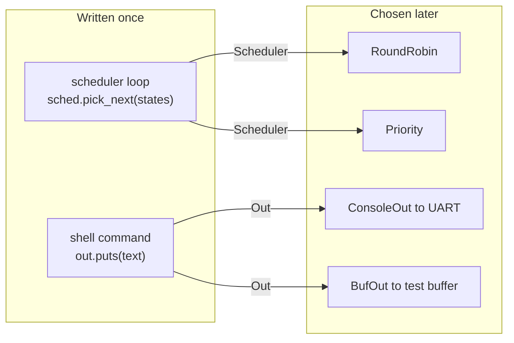
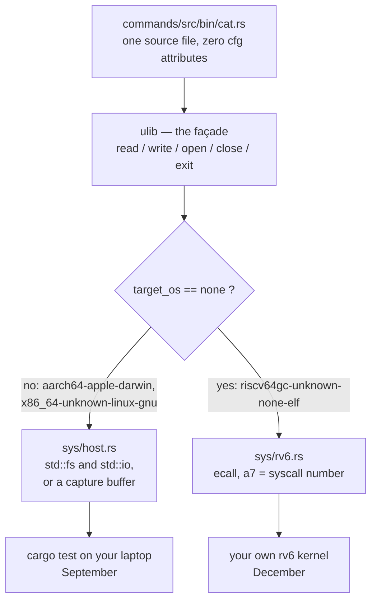

# Traits, Generics, and the `ulib` Façade

## Overview

This session is about building abstractions in a language that ships no runtime with them. A kernel has no garbage collector, no exception unwinder, and no dynamic loader, so every abstraction must compile down to instructions you could have written by hand. Rust's answer is the **trait**: a named contract types promise to satisfy, plus generics that let one function be written against the name instead of the type. The compiler stamps out a specialized copy per type — **monomorphization** — so a trait call on the scheduling path costs nothing at run time. The second half applies the same discipline to failure: `Option`, `Result`, `?`, and `From`, because a `no_std` kernel has nowhere to throw an exception. Both meet in **`ulib`**, the I/O façade that lets one `cat.rs` run on your laptop in September and on your own kernel in December. The exercises are [`07r_traits` (Thursday, September 17) and `08r_errors` (Friday, September 18)](../assignments/exercises.md).

## Learning Objectives

- **Explain** what a language runtime provides and why a `no_std` kernel cannot rely on one.
- **Define** a trait, distinguish required from default methods, and implement one for several types.
- **Write** generic functions with trait bounds, choosing among `<T: Trait>`, `where`, `impl Trait`, `dyn Trait`.
- **Describe** monomorphization and predict how many copies of a generic function are emitted.
- **Contrast** static and dynamic dispatch in code size, inlining, and what each lets you store.
- **Distinguish** `Option` from `Result` and justify which a kernel operation should return.
- **Trace** an error through `?` and `From` to the integer a system call finally returns.
- **Derive** why `#[cfg(target_os = "none")]` selects `ulib`'s backend more safely than a Cargo feature.

## Prerequisites

- **L03 (Ownership, Borrowing, Lifetimes)** — `&mut T` appears in every trait method today.
- **L04 (Structs, `impl`, `const fn`)** — `impl Trait for Type` is the sibling of plain `impl Type`.
- **L05 (Collections, Slices, and Fixed Tables)** — `[T; N]`, `&[T]`, `Option`, and exhaustive `match`; `05r` is Friday, September 11 and `06r` shares Thursday, September 17 with `07r`.
- **[Rust for Systems](../guides/rust-for-systems.md)** — generic syntax and the library types used here.
- **[Unsafe Rust and `no_std`](../guides/rust-unsafe-nostd.md)** — what `#![no_std]` removes, and why `panic = "abort"` is the only sane kernel setting.

---

## 1. Abstraction Without a Runtime

A **runtime** is code shipped alongside your program that does work you never wrote: Java's collects garbage, dispatches interface calls through tables built at class-load time, and unwinds the stack when you throw. A kernel has none of it, because a kernel *is* what everything else runs on. No loader resolves symbols, no allocator exists until you write one, and nobody catches a fault but the code you are writing. Every abstraction must be assembled at compile time.

That is why C kernels are blunt. C has no interfaces, so a project needing one builds it from a struct of function pointers — Linux's `struct file_operations` is thirty-odd of them — and it checks nothing: a null slot, a wrong slot, a pointer to the wrong struct are compile-time-detectable mistakes that C detects at 3 a.m. instead.

Rust's trait is that idea with the checking restored, and in its common form it compiles to a direct call. Two places in rv6 need it. In **the scheduler (exercise 36k)** which process runs next is policy, while handing over the CPU is mechanism — assembly you touch once; policies change, the loop must not. In **the shell (exercise 46k)** commands print to the UART when rv6 boots and to a buffer the harness reads back, and must not know which.



Both have one shape: *code that must call a method without knowing the type it is calling it on.*

---

## 2. Traits: A Contract Between Types

A **trait** is a named list of method signatures — the real one from the kernel, `shell.rs:17`:

```rust
pub trait Out {
    fn puts(&mut self, s: &str);
}
```

`puts` has a signature and a semicolon where a body would go, making it a **required method**: a type does not implement `Out` until it supplies one. A trait holds no data and you can never build a value of one; it is a statement *about* types, which is why §4's `dyn Out` needs machinery to act like a type.

### 2.1 Implementing it

`impl Trait for Type` is a separate block from L04's plain `impl Type`. This one supplies a trait's methods — all of them, or the compiler names the one you missed (`shell.rs:334`):

```rust
struct ConsoleOut;
impl Out for ConsoleOut {
    fn puts(&mut self, s: &str) {
        uart::puts(s);
    }
}
```

`ConsoleOut` is a **unit struct**: zero bytes, existing purely as a name to hang `impl Out` on. The point appears with the *second* implementer — a sink pushing into a `String`, or one that counts bytes and stores nothing, is every bit as good an `Out`. Nothing in the trait says "buffer" or "device"; it says "can be handed a `&str`".

> **Key distinction:** a trait is not a base class — no inheritance, no shared fields, no constructor. `ConsoleOut` and a test buffer are related only by having answered the same question, and you may implement your own trait for a type you did not write.

### 2.2 Default methods

A trait method may have a body:

```rust
pub trait Out {
    fn write_str(&mut self, s: &str);

    fn write_line(&mut self, s: &str) {
        self.write_str(s);
        self.write_str("\n");
    }
}
```

`write_line` is a **default method**: written once, inherited free by every implementer. It calls `write_str` on a `self` whose concrete type is not yet known and *cannot* be, since implementers that do not exist yet also get this body — which is why a fifth sink costs zero lines. The pattern is load-bearing in exercise 36k: `Scheduler` requires only `pick_next`, and a default built on it drives a scheduling loop every future policy inherits.

---

## 3. Generics and Trait Bounds

A **generic** function takes a type as a parameter. You have used generic *types* since L05 — `Option<T>`, `Vec<T>` — where `T` is a type the caller chooses. Writing a generic function starts out disappointing:

```rust
fn shout<T>(v: T) {
    // ...and now what?
}
```

You can do nothing with `v` — not print it, compare it, or call a method on it — because `T` could be a `u8`, a `[Proc; 64]`, or a closure, and one body must be correct for all of them. A **trait bound** buys back the right to do something:

```rust
pub fn log_all<O: Out>(out: &mut O, lines: &[&str]) {
    for line in lines {
        out.write_line(line);
    }
}
```

`<O: Out>` reads "for any type `O` that implements `Out`". The body may now call `write_line`, because the bound proves every possible `O` has one.

> **Key distinction:** the bound is a contract read in *both* directions — to the body, what it may assume; to the caller, what it must prove — and neither reads the other's code. "No method named `write_line` found for type parameter `O`" means you forgot the bound.

### 3.1 Four spellings, three meanings

```rust
fn log_all<O: Out>(out: &mut O, lines: &[&str]);            // 1. inline bound
fn log_all<O>(out: &mut O, lines: &[&str]) where O: Out;    // 2. where clause
fn log_all(out: &mut impl Out, lines: &[&str]);             // 3. impl Trait
fn log_all(out: &mut dyn Out, lines: &[&str]);              // 4. dyn Trait
```

Forms 1, 2, and 3 mean the same thing and compile to the same code: use `where` when the bound list crowds out the signature, `impl Trait` when the parameter is needed once and never named. It also appears in return position — `fn digits() -> impl Iterator<Item = u8>`, "one type I am not naming". Form 4 is different entirely.

---

## 4. Monomorphization: What the Compiler Actually Emits

The compiler does *not* emit one clever function that copes with every `O`. It emits **a separate, specialized copy per type actually used**, with method calls resolved at compile time and usually inlined away. That duplication is **monomorphization** — "make it single-shaped".

```text
 one source function       what the compiler emits
 ───────────────────       ───────────────────────
 fn trace<S: Scheduler,  ┌──> trace::<RoundRobin, StringOut>
          O: Out>        │      RoundRobin::pick_next  (direct)
                         │      StringOut::write_str   (inlined)
 used with               ├──> trace::<Priority, StringOut>
  (RoundRobin,StringOut) │      Priority::pick_next    (direct)
  (Priority,  StringOut) │      StringOut::write_str   (inlined)
  (Priority,  CountingOut)──>  trace::<Priority, CountingOut>
                                Priority::pick_next    (direct)
 3 combinations used,           CountingOut::write_str (inlined)
 so 3 copies, not 2 x 2 = 4.
```

This is **static dispatch**: no trait, no lookup, no pointer chasing in the machine code — `out.write_str(s)` on a `StringOut` becomes that function's body spliced in place. The abstraction is not cheap, it is *gone*, which is why traits are usable on a kernel's hot path. The price is code size.

### 4.1 The other kind: `dyn Trait` and the vtable

The alternative is `&mut dyn Out`: one copy of the function exists, and the *reference* carries the type information at run time.

```text
 let out: &mut dyn Out = &mut ConsoleOut;   // a FAT POINTER: 2 words

  ┌───────────────┬────────────────┐
  │ data pointer  │ vtable pointer │
  └──────┬────────┴───────┬────────┘
         v                v
  ┌──────────────┐  ┌──────────────────────────────┐
  │ ConsoleOut   │  │ vtable: ConsoleOut as Out    │
  │ (zero bytes) │  │ [0] drop_in_place -> no-op   │
  └──────────────┘  │ [1] size = 0  [2] align = 1  │
                    │ [3] puts -> ConsoleOut::puts │
                    └──────────────────────────────┘

  out.puts("hi")  =>  ld t0, 8(a0)    # vtable pointer
                      ld t0, 24(t0)   # puts slot
                      jalr t0         # indirect: nothing inlines
```

That is **dynamic dispatch**: an extra load and an indirect jump per call, no inlining across it, one copy of the code however many sinks exist. The vtable is compiler-built and read-only — `struct file_operations` again, except you cannot get a slot wrong.

### 4.2 Choosing between them

| | `impl Trait` / `<T: Trait>` | `dyn Trait` |
|---|---|---|
| Dispatch | resolved at compile time | one indirect call at run time |
| Inlining | yes | no |
| Code size | one copy per type used | one copy total |
| Pointer size | one word | two words (fat pointer) |
| Heterogeneous storage | impossible | `Vec<Box<dyn Trait>>`, struct fields |

The last line decides most cases: a generic `O` is fixed to *one* type per call site, so no `Vec<O>` can hold a `ConsoleOut` and a test buffer at once, whereas a `&mut dyn Out` can be stored, passed through twelve layers, and swapped at run time.

That is why the shell chose `dyn`: `shell.rs:39` threads `out: &mut dyn Out` through `cmd_ls` (`shell.rs:77`), `cmd_cat` (`shell.rs:141`), and `put_num` (`shell.rs:313`), where generics would copy the command set once per sink to save one indirect call per line at 115200 baud. `sched.rs` chose static dispatch, because `pick_next` runs on every timer tick.

> **Object safety:** a trait is usable as `dyn Trait` only if a vtable can be built for it — which a method generic over another type parameter, or one taking `self` by value, prevents.

---

## 5. The Two rv6 Abstractions

### 5.1 `Scheduler` — policy apart from mechanism

`sched.rs:5`:

```rust
pub trait Scheduler {
    fn pick_next(&mut self, states: &[ProcState]) -> Option<usize>;
}
```

Three things there are decisions. `&mut self`, because a policy may remember something between calls: round-robin remembers where the rotation stopped, and `sched.rs:20` scans forward from a stored cursor. A stateless policy ignores the ability — the trait sets a ceiling, not a floor.

`&[ProcState]`, not `&mut [Proc]`: the policy sees the states and nothing else, and cannot mark a process running, free one, or touch a page table. Giving an abstraction the smallest input that lets it work is a security property — a buggy policy can pick the wrong process, and that is the worst it can do.

`Option<usize>`, not `usize`: "nothing is runnable" is an ordinary answer, so it gets a value rather than an error or a panic.

The lineage is direct. xv6's `scheduler()` hardcodes the round-robin scan inline, so changing policy means editing the loop; Linux's `struct sched_class` is a struct of function pointers (`pick_next_task`, `enqueue_task`, `task_tick`, …) that the fair, real-time, and idle schedulers each fill in. rv6's trait is that design in a language that checks it.

### 5.2 `Out` — one seam, two destinations

`shell.rs:17` declares the trait, `shell.rs:334` gives the console implementation, and `shell.rs:345` picks one at the top of the read-eval-print loop:

```rust
let mut sh = Shell::new();
let mut out = ConsoleOut;          // the test substitutes a buffer here
sh.exec(&line, &mut out);
```

Under the harness a buffer-backed `Out` is substituted there, and nothing in `cmd_ls`, `cmd_cat`, or `cmd_pwd` changes or even knows.

This is not a mock or a test-only path bolted on: the commands were always written against `Out`, so the test exercises the same instructions the real machine will, and a test that runs a different code path from production tests the wrong program. Later, when rv6 grows user mode and a real `write`, the console gains a *third* implementation without the shell noticing.

---

## 6. Errors as Values

Open a file that is not there. Ask for a physical page when there are none left. Look up a pid that just exited. None is a bug; they are ordinary events a correct kernel must survive and report from the code that noticed to the code that can act.

Most languages report failure by **throwing an exception**: control leaves the function without returning, the stack unwinds frame by frame, and lands in a `catch` up the call chain. A kernel cannot, for three reasons.

**There is nothing to unwind into.** When a user program calls `read` the CPU is mid-trap: `ecall` has switched privilege level, the handler has switched to a kernel stack, and the "caller" is a program in another address space that never heard of Rust. No continuous stack runs from program into kernel, so the kernel returns to the trap handler carrying its answer in a register.

**There is nobody to catch.** Unwinding needs a runtime — a personality routine and DWARF unwind tables — exactly what `no_std` lacks. rv6 sets `panic = "abort"`, so no unwinder exists in the image.

**Stopping is not an option.** An unhandled exception in an application kills the process and the operating system cleans up; in an operating system it kills the machine. Rust's `panic!` — what `unwrap()` does on failure — halts rv6 and never returns: right for "the kernel's invariants are broken", wrong for "there is no such file".

So failure travels as a return value, as in C with `-1` and `errno`, but without the problem that nothing obliges you to look.

### 6.1 `Option` for absence, `Result` for failure

```rust
enum Option<T>    { Some(T), None }
enum Result<T, E> { Ok(T),   Err(E) }
```

`Option<T>` is for **absence**: a question whose honest answer may be "nothing". Which slot holds pid 7? Possibly none, and nothing has gone wrong. `Result<T, E>` is for **failure**: an operation that should have produced a `T` and could not, so it produces an `E` explaining itself. That `E` is the whole difference — `None` says nothing happened, `Err(FsError::NameTooLong)` says *what* went wrong, letting the caller give up, retry, or print something useful. `Result` is `#[must_use]`, so discarding one is a compiler warning: one attribute fixing the most common bug in C systems programming.

> **Key distinction:** "this name is not in the directory" is absence to the routine that scanned it and failure to the routine trying to open a file. Keeping them separate — `find` returning `Option`, `lookup` returning `Result` — puts the *policy* in one visible place, and `.ok_or(e)` is the line it lives on, as at `exec.rs:649`: `lookup(name).ok_or(ExecError::NotFound)?`.

### 6.2 Your own error type

`E` is any type you like; in kernel code it is an enum you wrote (`fs.rs:19`):

```rust
pub enum FsError {
    NotFound,     AlreadyExists,  NotADirectory,  IsADirectory,
    NoFreeInode,  DirFull,        NameTooLong,    FileTooBig,
}
```

One variant per way this subsystem can fail. The caller `match`es on the specific failure instead of decoding an integer — `shell.rs:135` treats `Err(FsError::AlreadyExists)` as success, because that is what real `touch` does — and exhaustiveness runs in reverse when you *grow* the type: add a variant and every `match` needing a new decision stops compiling. In C, adding an `errno` value silently does nothing.

### 6.3 `?`, and the desugaring you should know

Most kernel functions are a chain of fallible steps, each of which should abandon the rest of the work and report upward. Longhand one step is five lines and four is unreadable, so Rust has an operator for this shape: `let inum = fsg.dirlookup(dir, name)?;`

`?` means: if this is `Err(e)`, return from *the function I am in* with that error; otherwise unwrap the `Ok`. It works only inside a function that itself returns `Result` (or `Option`). The desugaring hides a step people miss:

```rust
// `expr?` inside a function returning Result<_, E>
match expr {
    Ok(v)  => v,
    Err(e) => return Err(From::from(e)),
}
```

`From::from`. The error is **converted** on the way out. When inner and outer types match this is free — the blanket `impl<T> From<T> for T` is the identity — which is why `fs.rs:139` writes `slot.ok_or(FsError::DirFull)?` inside a `Result<usize, FsError>` function and never thinks about it.

### 6.4 `From`, and layered errors

The conversion earns its keep with two layers — a shell command that can fail because the filesystem failed, `exec` failed, or its arguments were wrong:

```rust
pub enum ShellError { Fs(FsError), Exec(ExecError), BadArgs }

impl From<FsError> for ShellError {
    fn from(e: FsError) -> ShellError { ShellError::Fs(e) }
}
```

With that (and its `ExecError` twin), a function returning `Result<T, ShellError>` may use `?` on calls returning either inner error, with no visible conversion. It is written once per error-type *pair*, not per call site, and its direction is fixed: a specific inner error becomes a general outer one.

### 6.5 Where a `Result` becomes a number

A user program cannot receive a `Result`; it gets one integer in `a0`, so at the kernel's edge every rich error collapses.

```text
  layer                      type it speaks in          what it can say
  ─────────────────────────────────────────────────────────────────────
  cat.rs (user program)      Result<usize,ulib::Error>  Error(-1)
  ulib::read    lib.rs:104   isize, read out of a0      -1
  ══ trap boundary ══ one register, no types, another address space ══
  sys_read      syscall.rs:468  isize                   -1   <- cause lost
  FS.read_at    fs.rs:231    Result<usize, FsError>     IsADirectory, ...
  dirlookup     fs.rs:109    Result<usize, FsError>     NotFound
```

The collapse belongs in one place: the boundary. `syscall.rs:403` is representative — a `match` whose `Err(_)` arm returns `-1` and discards the reason — and because rv6 answers every failure with `-1`, `ulib`'s `Error` (`lib.rs:55`) is deliberately a thin wrapper around that number. The Unix convention we adopt later: `>= 0` is success, negative is minus an `errno` code (2 `ENOENT`, 21 `EISDIR`, 36 `ENAMETOOLONG`).

> **On panicking:** `unwrap()` and `expect()` panic on `Err` — fine in tests, close to banned in kernel code, and right only for a broken invariant such as `allocproc` returning a null page table. The rule of thumb is **`Result` for what the outside world did to you, panic for what you did to yourself.**

---

## 7. `ulib`: One Seam, Two Implementations

In September you write `cat` on your laptop and `cargo test` grades it. In December you will have a RISC-V kernel with a filesystem, file descriptors, `exec`, and user mode, and the goal is that the *same source file* — the same bytes, not a port — runs on both.

The two environments share nothing. On your laptop `read` is a libc function trapping into macOS or Linux, with `std` and a heap; on rv6 there is no `std`, no allocator, no libc, and no operating system but the one you wrote, so `read` must be an `ecall` with its number in `a7`. A **façade** is one API with the difference underneath it.



### 7.1 The shape of it

`sys/mod.rs` is the whole selection mechanism:

```rust
#[cfg(target_os = "none")]
mod rv6;
#[cfg(target_os = "none")]
pub(crate) use rv6::*;

#[cfg(not(target_os = "none"))]
mod host;
#[cfg(not(target_os = "none"))]
pub(crate) use host::*;
```

Both backends expose the same five private functions — `sys_read`, `sys_write`, `sys_open`, `sys_close`, `sys_exit` — so `lib.rs` above them contains **no `#[cfg]` at all**. `ulib::read` (`lib.rs:104`) calls `sys::sys_read`, checks for a negative return, and wraps it in a `Result`: the same eight lines on both targets, over a `sys/host.rs:33` that writes through `std::io::Write` and a `sys/rv6.rs:21` that is one `asm!` block around `ecall`.

The rv6 backend also holds the image's one `#[panic_handler]` (`sys/rv6.rs:66`), so no file you write contains one. `ulib::main!(run)` (`entry.rs:13`) is the other half: an ordinary `fn main` on the host, and on rv6 the `_start` symbol `exec` jumps to, with `argc`/`argv` unpacked from the stack `exec` built (`entry.rs:32`). A command's whole two-target ceremony is two lines, `cat.rs:15` and `cat.rs:19`.

### 7.2 Why `target_os`, and not a Cargo feature

The obvious alternative is a feature: `#[cfg(feature = "rv6")]` plus `cargo build --features rv6`. It is worse, in ways that will bite you in some other project.

`#[cfg(target_os = "none")]` is **derived** from the target triple: `riscv64gc-unknown-none-elf` has `target_os = "none"`, `aarch64-apple-darwin` has `target_os = "macos"`. One source of truth — the `--target` flag — so the backend cannot disagree with the machine you are building for.

A feature is an independent knob. **Forget it and the build is nonsense:** building for RISC-V without `--features rv6` compiles the host backend for a bare-metal target, giving errors about `std::fs`, a missing `panic_handler`, a missing `eh_personality`, and unresolved symbols — none saying "you forgot a feature". **Set it wrongly and it is worse:** the same crate built for your laptop *with* the feature executes `ecall` on macOS, from a build that warned about nothing. And features are **additive and unified**, so a feature any crate in the graph enables is enabled everywhere in it — including in crates being compiled for the host.

> **Rule:** features add capabilities; they do not choose between alternatives. If turning two on at once would be incoherent, they are the wrong mechanism. Derive exclusive choices from something that cannot be two things at once.

### 7.3 Testing through the seam

What is *missing* from the façade is instructive: no `println!`, because `write!` would drag 12–18 KiB of `core::fmt` into an image with a hard size budget, and arguments are `&[u8]` rather than `&str` (`lib.rs:63`) because that is what `exec` pushes onto the stack. It is the *intersection* of what both sides can honestly do.

The host backend then has a third mode: `testing::run` (`testing.rs:28`) installs a capture buffer in a thread-local and calls your `run` directly, so a command is tested with no process spawned and no temporary files — and the source under test is byte-identical to what will run on rv6.

---

## Key Concepts

| Concept | Definition | Example |
|---|---|---|
| Trait | Named set of method signatures a type promises to provide; not itself a type | `pub trait Out { fn puts(&mut self, s: &str); }` at `shell.rs:17` |
| Required / default method | Signature only, which implementers must supply; or a body in the trait, inherited free | `pick_next` is required; `write_line` is a default |
| Trait bound | Constraint granting the body that trait's methods | `fn log_all<O: Out>(out: &mut O, ...)` |
| Monomorphization | One specialized copy compiled per concrete type used | `trace::<Priority, StringOut>` |
| Static dispatch | Target resolved at compile time; direct call, inlinable | `&mut impl Out`, `<O: Out>` |
| Dynamic dispatch | Target looked up in a vtable at run time; one indirect call | `&mut dyn Out` at `shell.rs:39` |
| `Option<T>` | Absence: the honest answer may be "nothing" | `pick_next` returns `None` when nothing is runnable |
| `Result<T, E>` | Failure: could not produce a `T`, and says why; `#[must_use]` | `dirlookup` at `fs.rs:109` |
| `?` operator | Early-returns `Err(From::from(e))`, or unwraps `Ok` | `let n = ulib::read(fd, &mut buf)?;` at `cat.rs:25` |
| `#[cfg(target_os = "none")]` | Compilation switched by the target triple, not a flag | `sys/mod.rs:4` picking the `ecall` backend |

---

## Practice Problems

### Problem 1: Trace two policies through the same loop

Five slots and a fixed priority table (lower = more urgent):

```text
slot      0          1          2         3          4
state     Sleeping   Runnable   Unused    Runnable   Runnable
priority  1          2          0         2          1
```

Both policies run through the same default `run_for`, calling `pick_next` six times.

**(a)** A `RoundRobin` whose cursor `next` is currently **3**: give the six slots picked and `next` after each.
**(b)** A `Priority` over that table: give the six picks, and name the slots that starve.
**(c)** Slot 4 goes to `Sleeping` before the `Priority` run. What are the six picks now, and which tie-break rule decided it?

<details>
<summary>Click to reveal solution</summary>

**(a)** `pick_next` scans forward from `next`, wrapping modulo 5, for the first `Runnable` slot, then parks the cursor past it.

| call | scan starts at | first Runnable | new `next` |
|---|---|---|---|
| 1 | 3 | **3** | 4 |
| 2 | 4 | **4** | 0 |
| 3 | 0 | 0 sleeping → **1** | 2 |
| 4 | 2 | 2 unused → **3** | 4 |
| 5 | 4 | **4** | 0 |
| 6 | 0 | 0 sleeping → **1** | 2 |

Result `[3, 4, 1, 3, 4, 1]`: period three, and nothing starved.

**(b)** Runnable slots are 1, 3, 4 with priorities 2, 2, 1. Slot 4 has the lowest number and `Priority` keeps no state, so it decides identically every time: `[4, 4, 4, 4, 4, 4]`, and slots 1 and 3 **starve** — not a bug but the policy, which is why real systems add ageing.

**(c)** Slots 1 and 3 are runnable, both priority 2 — a tie. *Ties go to the lower index*, from a **strict** `<` when deciding whether a candidate displaces the best so far. Result `[1, 1, 1, 1, 1, 1]`, so slot 3 starves instead; with `<=` it would be `[3, 3, 3, 3, 3, 3]` — one character deciding which process never runs.
</details>

### Problem 2: Count the copies

`fn trace<S: Scheduler, O: Out>(sched: &mut S, out: &mut O, turns: usize)`, called only here:

```rust
trace(&mut rr,   &mut log,     4);   // RoundRobin, StringOut
trace(&mut prio, &mut log,     3);   // Priority,   StringOut
trace(&mut prio, &mut counter, 3);   // Priority,   CountingOut
trace(&mut rr,   &mut log,     9);   // RoundRobin, StringOut
```

**(a)** How many machine-code copies of `trace` are emitted, and why is it neither 4 nor 2×2?
**(b)** `O` is replaced by `out: &mut dyn Out`. How many now?
**(c)** Both parameters become `dyn`. How many, and what does each `out` call now cost?
**(d)** rv6's shell has eleven handlers taking the sink, and two sinks exist. How many handler bodies if they were generic, and why did the kernel pick `dyn Out` at `shell.rs:39`?

<details>
<summary>Click to reveal solution</summary>

**(a)** **Three.** Only combinations *actually used* are instantiated, not the cross product — `(RoundRobin, CountingOut)` never appears. Call sites are irrelevant: calls one and four share a copy and differ only in `turns`.

**(b)** **Two**, one per distinct `S`. `O` no longer contributes: `dyn Out` is a single type to the compiler, and the sink's identity lives in a vtable pointer at run time.

**(c)** **One.** Every `out` call becomes a vtable load, a slot load, and an indirect jump, none of it inlinable — and the compiler can no longer propagate constants across the call.

**(d)** Eleven handlers × two sinks = **twenty-two** bodies, plus a copy of everything each calls that is generic in the sink. The saving would be one indirect call per line on a UART where the write costs thousands of cycles, so the kernel takes `&mut dyn Out`.
</details>

### Problem 3: Desugar the operator

This does not compile:

```rust
pub enum ShellError { Fs(FsError), BadArgs }

fn cat_file(fs: &FileSystem, name: &str) -> Result<usize, ShellError> {
    if name.is_empty() { return Err(ShellError::BadArgs); }
    let inode = fs.lookup(name)?;   // lookup returns Result<Inode, FsError>
    let bytes = fs.read(inode)?;    // read   returns Result<&[u8], FsError>
    Ok(bytes.len())
}
```

**(a)** Write the desugaring of `fs.lookup(name)?` in full.
**(b)** Name the exact missing trait implementation, and write it.
**(c)** With it added, `cat_file` gets a 20-character name not in the directory. Which variant comes back, through how many conversions?
**(d)** Why does the same `?` need no conversion inside `read_file`, which returns `Result<&[u8], FsError>`?

<details>
<summary>Click to reveal solution</summary>

**(a)**

```rust
let inode = match fs.lookup(name) {
    Ok(v)  => v,
    Err(e) => return Err(From::from(e)),
};
```

**(b)** `From<FsError> for ShellError`. Without it, `From::from(e)` has nothing to select and the compiler reports "the trait bound `ShellError: From<FsError>` is not satisfied", pointing at the `?`.

```rust
impl From<FsError> for ShellError {
    fn from(e: FsError) -> ShellError { ShellError::Fs(e) }
}
```

Written once, it serves both `?`s here and every future one.

**(c)** `lookup` checks length before scanning, so a 20-character name yields `Err(FsError::NameTooLong)`; the `?` converts it once and `cat_file` returns `Err(ShellError::Fs(FsError::NameTooLong))` — **one** conversion, cause intact.

**(d)** Because inner and outer types are identical and the blanket `impl<T> From<T> for T` is the identity: the desugaring still calls `From::from`, but selects a conversion that does nothing and the optimizer removes it. So `?` between same-typed errors is free.
</details>

### Problem 4: Order the checks

`lookup` written two ways, with `NAME_MAX` = 14:

```rust
// version A
if name.len() > NAME_MAX { return Err(FsError::NameTooLong); }
self.find(name).ok_or(FsError::NotFound)

// version B
let inode = self.find(name).ok_or(FsError::NotFound)?;
if name.len() > NAME_MAX { return Err(FsError::NameTooLong); }
Ok(inode)
```

The directory holds `README` (13 bytes), `init`, and the directory `dev`. The boundary maps `NotFound` to `-2`, `IsADirectory` to `-21`, `NameTooLong` to `-36`, success to the byte count.

**(a)** For `"README"`, `"dev"`, `"fourteen_chars"` (14 characters, absent), and `"fifteenchars_15"` (15, absent), give the integer each version's boundary returns.
**(b)** One version is wrong. Which, and what is the defect in one sentence?
**(c)** On a real disk-backed filesystem, version B has a second problem. What is it?

<details>
<summary>Click to reveal solution</summary>

**(a)**

| input | version A | version B |
|---|---|---|
| `"README"` | `13` | `13` |
| `"dev"` | `-21` (raised later by `read`) | `-21` |
| `"fourteen_chars"` | `-2` (`NotFound`) | `-2` |
| `"fifteenchars_15"` | `-36` (`NameTooLong`) | `-2` (`NotFound`) |

Only the last row separates them — which is why the exercise's test data holds a 14-character name and a 15-character one.

**(b)** **Version B is wrong.** Because it scans first, an over-long name always comes back as `NotFound` — the `NameTooLong` arm is unreachable, since a name too long to store can never be found — so the caller cannot tell "impossible" from "not there yet".

**(c)** It does needless I/O: `find` reads directory blocks from disk, so B pays for a full scan before discovering the name could never have been stored. Cheap, local, disqualifying checks go first — the instinct that puts the permission check before the disk read in a real `open`.
</details>

### Problem 5: The feature that disagreed with the target

Suppose `ulib` selected its backend with `#[cfg(feature = "rv6")]` instead of `target_os`.

**(a)** `cargo build --target riscv64gc-unknown-none-elf` runs and the feature is forgotten. Describe the failure, and why the messages will not name the real cause.
**(b)** `cargo test` runs on a laptop *with* `--features rv6`. Does it compile? What happens when the test runs?
**(c)** A dev-dependency declares `ulib = { path = "../ulib", features = ["rv6"] }`. What does `cargo test` do now, and which property of Cargo features causes it?
**(d)** In one sentence, why can `#[cfg(target_os = "none")]` produce none of (a), (b), or (c)?

<details>
<summary>Click to reveal solution</summary>

**(a)** The host backend is compiled for a bare-metal target. `std` does not exist there, so `use std::fs::File` fails first, followed by a missing `#[panic_handler]`, a missing `eh_personality`, and unresolved symbols at link time. Every message names a *consequence* — "can't find crate for `std`" — never "you selected the wrong backend".

**(b)** It compiles cleanly: `asm!("ecall")` is valid on any target with the instruction. The failure is at run time — the process executes `ecall` with `a7 = 16`, which those kernels do not associate with `write` on this ABI, so you get a fault or nonsense from a build that warned about nothing. Worse than (a): a compile error is a message, a run-time trap is an afternoon.

**(c)** Every host build in that workspace silently gets the `ecall` backend, including the `cargo test` runs that grade your commands, because Cargo **unifies features**: one enabled by any crate in the graph is enabled everywhere in it. Features are meant to be *additive*, so using them for exclusive alternatives violates that model.

**(d)** Because `target_os` is derived from the same `--target` flag that decides which machine you are compiling for, so the backend and the target are one fact stated once and cannot disagree — there is no second knob to forget, to set wrongly, or for another crate to set on your behalf.
</details>

---

## Further Reading

- [All Exercises](../assignments/exercises.md) — `07r_traits` (Thursday, September 17) and `08r_errors` (Friday, September 18).
- [Rust for Systems](../guides/rust-for-systems.md) — generic syntax, `where` clauses, library traits.
- [Unsafe Rust and `no_std`](../guides/rust-unsafe-nostd.md) — `#[panic_handler]` and `panic = "abort"`.
- [ulib and Commands](../guides/ulib-and-commands.md) — the full `ulib` API and command workflow.
- [rv6 Architecture](../guides/rv6-architecture.md) — where `sched.rs`, `shell.rs`, `syscall.rs` sit.
- [Using OSlings](../guides/oslings-usage.md), [Cheatsheet](../guides/cheatsheet.md), [Key Concepts](../guides/key-concepts.md), [Exam Prep](../guides/exam-prep.md).
- *The Rust Programming Language*, ch. 9 and ch. 10 — <https://doc.rust-lang.org/book/>
- The Rust Reference on [conditional compilation](https://doc.rust-lang.org/reference/conditional-compilation.html).
- xv6-riscv `proc.c` and Linux `include/linux/sched.h` (`struct sched_class`).

---

## Summary

1. **A kernel has no runtime, so abstractions must be assembled at compile time.** That is why C kernels build interfaces from function-pointer structs and get no checking back.
2. **A trait is a named contract; types implement it, and it is not itself a type.** Required methods must be supplied; defaults are written once against them and inherited free.
3. **A trait bound is a contract in both directions:** what the body may assume, what the caller must prove. `<T: Trait>`, `where`, and `impl Trait` are three spellings of one thing.
4. **Monomorphization emits one specialized copy per combination of types actually used.** Calls are direct and usually inlined, so a trait on the scheduling path costs nothing at run time; the price is code size.
5. **`dyn Trait` trades an indirect call for one copy and the ability to store the thing.** rv6 uses static dispatch for `Scheduler` and `dyn` for `Out`.
6. **Failure is a value because there is nowhere to throw.** Mid-trap no stack runs back into the caller, and `panic = "abort"` leaves no unwinder in the image. `Option` reports absence, `Result` reports failure with a reason, `#[must_use]` stops you ignoring it.
7. **`?` early-returns `Err(From::from(e))`, which makes `From` the joint between error layers.** Same-typed errors convert through a free identity impl, layered ones through one `impl From` per pair, and the rich error collapses to an integer at one place: the system-call boundary.
8. **`ulib` is one I/O seam with two implementations chosen by `#[cfg(target_os = "none")]`.** Deriving the choice from the target triple makes it impossible for the backend to disagree with the machine being built — unlike a Cargo feature, which can be forgotten, set wrongly, or unified on by an unrelated crate. That is what lets your week-3 `cat.rs` recompile unchanged against your own kernel in December.
