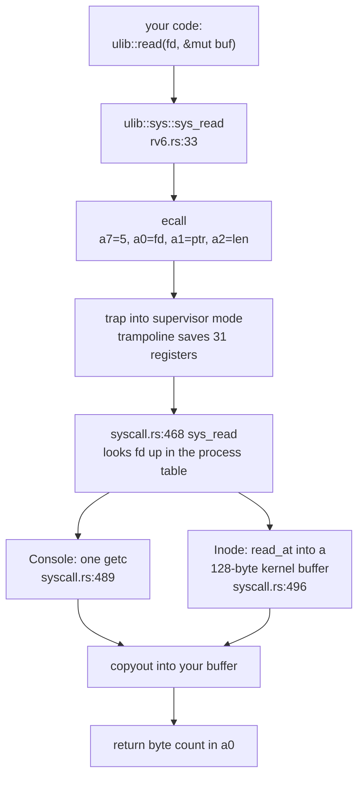
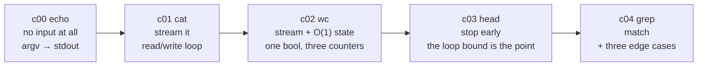

# Buffers, Bytes, and Line-Oriented I/O

## Overview

Every program you have written so far called functions that always did what you asked. This session is about the layer where that stops being true. `read` is permitted to hand you fewer bytes than you asked for, `write` is permitted to accept fewer than you gave it, and neither is an error — they are the contract. The loop that copes with that is the only difference between a `cat` that works on a 40-byte test file and one that works on a 40 MB log. From there the session builds outward: why a fixed buffer beats an allocator, how to choose its size, why the kernel boundary is defined in **bytes** rather than characters, and how to split a byte stream into lines without ever allocating. Those pieces then explain the shape of the five Module 1 command labs — [`c00_echo` through `c04_grep`](../assignments/exercises.md) — as one idea told five times: no input, stream it, stream it with O(1) state, stop early, match. That discipline is also what lets these exact files run on your own kernel in December.

## Learning Objectives

- **Explain** the `read` and `write` system-call contract, including why a short read is normal rather than an error.
- **Trace** a copy loop over a stream that returns arbitrary chunk sizes, and count the system calls it makes.
- **Justify** `write_all` over a bare `write`, and describe the failure mode of ignoring a short write.
- **Derive** a buffer size from the system-call cost, the stack budget, and the device's natural transfer size.
- **Distinguish** `u8`, `char`, `&str`, and `&[u8]`, and explain why a kernel interface is defined over bytes.
- **Describe** how a line iterator refills, compacts, and truncates a fixed buffer without allocating.
- **Design** a streaming computation whose state is O(1) in the size of its input, using `wc`'s word counter as the model.
- **Predict** the three inputs that break a naive substring search, and the Rust-specific reason one of them panics.

## Prerequisites

- **L05 (Collections, Slices, and Fixed Tables)** — `[T; N]`, `&[T]`, and why a kernel prefers a fixed array to a `Vec`.
- **L06 (Traits and the `ulib` Façade)** — `Result`, `?`, and how `#[cfg(target_os = "none")]` selects `ulib`'s backend.
- **`c00_echo` and `c01_cat`** — due at the start of this session; `cat`'s read loop is the worked example throughout.
- **[ulib and Commands](../guides/ulib-and-commands.md)** — the full `ulib` API surface and the `oslings ship` workflow.
- **[Rust for Systems](../guides/rust-for-systems.md)** — slices, byte-string literals, and pattern matching on `u8`.
- **[The Memory Map](../guides/memory-map.md)** — where a user program's image and its single stack page live.

---

## 1. The Narrowest Waist in Computing

Unix's central design decision was to make almost every source and sink of bytes look the same. A file on disk, a terminal, a pipe, a socket, a device like `/dev/null` — all are reached through a **file descriptor**, a small non-negative integer indexing a per-process table the kernel maintains. Nothing else about them is exposed. The program says "give me some bytes from descriptor 3" and does not know, and structurally *cannot* know, whether descriptor 3 is a file, a keyboard, or the output of another program.

Three descriptors are open before your program starts running, by convention rather than by hardware:

| Fd | Name | `ulib` constant | Typically |
|---|---|---|---|
| 0 | standard input | `STDIN` | keyboard, or the left side of a pipe |
| 1 | standard output | `STDOUT` | terminal, or a file after `>` |
| 2 | standard error | `STDERR` | terminal, *even when* stdout was redirected |

That last row is not a detail. `cat a b > out` sends descriptor 1 into `out`; if error messages also went to descriptor 1, the words "cannot open" would land in the middle of your data file. Separating the two is what makes a Unix pipeline composable at all.

The entire interface is four calls — `open`, `read`, `write`, `close` — plus `exit`. In `ulib` those are `lib.rs:104`, `lib.rs:114`, `lib.rs:125`, `lib.rs:134`, and `lib.rs:144`. On rv6 each becomes exactly one `ecall` instruction: the syscall number in `a7`, up to three arguments in `a0`–`a2`, the result back in `a0` (`ulib/src/sys/rv6.rs:21`). The numbers are fixed at `rv6.rs:10-14`: exit is 2, read is 5, open is 15, write is 16, close is 21.



Everything between the `ecall` and the return is machinery you build later: the trampoline in exercise 18, the descriptor table in exercise 20, the filesystem in exercise 10, the console driver in exercise 15. Today you are the caller, and what matters is what the caller is promised.

> Key distinction: `read` and `write` are not function calls that happen to be slow. They are *requests* — you state a maximum and the kernel answers with an actual. Confusing the request with the result is the single most common I/O bug in every language.

---

## 2. The Short-Read Contract

Here is the signature, from `ulib/src/lib.rs:104`:

```rust
pub fn read(fd: Fd, buf: &mut [u8]) -> Result<usize, Error>
```

It returns **how many bytes it actually read**. That number may be anywhere from `0` to `buf.len()`, and any value in that range is a normal, successful outcome. Exactly one value means end of file, and it is `0`.

Why would the kernel give you less than you asked for? Because the abstraction is uniform but the things behind it are not:

- **The file ran out.** You asked for 512 with 40 bytes remaining; you get 40.
- **The console works one keystroke at a time.** `syscall.rs:489`: rv6's `sys_read` on a console descriptor calls `console::getc()` once and returns `1`. It does not matter that you passed a 512-byte buffer — a console read on your own kernel returns exactly one byte, forever.
- **The kernel has a buffer of its own.** `syscall.rs:496` declares `let mut kbuf = [0u8; 128];` and then `let want = core::cmp::min(len, kbuf.len());`. Your 512-byte request is clipped to 128 before it ever reaches the filesystem. The kernel has no allocator on the trap path either, so its fixed staging buffer becomes your ceiling.
- **A pipe hands over whatever exists.** The writer has produced 12 bytes so far; you get 12 rather than blocking until 512 arrive.
- **On Linux, a signal arrived.** A `read` interrupted after transferring some data returns that partial count rather than failing.

So the shape of every copying program ever written is a loop:

```rust
loop {
    let n = ulib::read(fd, &mut buf)?;   // n may be anything in 0..=buf.len()
    if n == 0 { break; }                 // 0, and only 0, means end of file
    ulib::write_all(STDOUT, &buf[..n])?; // exactly n bytes, not buf.len()
}
```

Two details in three lines carry all the weight. The loop repeats until `read` says `0` — not until one `read` returns something smaller than the buffer, which is the tempting and wrong termination condition. And the write is over `&buf[..n]`, not `&buf`: bytes `n..512` hold whatever the previous iteration left there, so writing them duplicates a chunk of the file.

The same file read through a 512-byte buffer, on the host and on rv6:

```text
file: 1500 bytes                     (this is c01_cat's largest test)

host (macOS/Linux, regular file):
  read #1 -> 512   write 512
  read #2 -> 512   write 512
  read #3 -> 476   write 476
  read #4 -> 0     stop
  4 reads, 3 writes, 1500 bytes out

rv6 (kernel clips at 128 bytes, syscall.rs:496-497):
  read #1..#11 -> 128 each   (1408 bytes)
  read #12     -> 92
  read #13     -> 0     stop
  13 reads, 12 writes, 1500 bytes out

rv6 console (syscall.rs:489-493):
  read #1 -> 1 ... read #k -> 1 ... one syscall PER KEYSTROKE
```

Three wildly different call patterns, one unchanged program. That is the payoff of writing the loop correctly: the program neither knows nor cares which of these it is in.

The failure mode is nastier than a crash. A program that reads once and assumes it got everything passes every small test — a 12-byte fixture fits in one read — and then silently truncates a real file. No error, no panic, no log line; the output is just short.

> Historical note: this contract dates to the first edition of Unix in 1971, on a PDP-11 with 24 KiB of core. There was no memory in which to promise a full transfer, so the call promised only to make progress. `read(2)` on Linux still says "it is not an error if this number is smaller than the number of bytes requested," and every layer above it — stdio, Java's `InputStream`, Go's `io.Reader` — exists partly to hide that sentence from people who would otherwise get it wrong.

---

## 3. Short Writes, and Why `write_all` Exists

`write` has the mirror-image problem, and it is worse because it fails quietly in the other direction:

```rust
pub fn write(fd: Fd, buf: &[u8]) -> Result<usize, Error>   // lib.rs:114
```

It returns a count too, and that count may be less than `buf.len()`. A pipe whose buffer is full accepts what fits. A disk that fills mid-transfer writes what it could. A socket accepts what the send window allows. Ignoring the return value drops bytes with no error and no clue — the same silent truncation as the short read, from the other side.

The fix belongs in a library rather than in every program, so `ulib` ships it (`ulib/src/lib.rs:154`):

```rust
pub fn write_all(fd: Fd, mut buf: &[u8]) -> Result<(), Error> {
    while !buf.is_empty() {
        let n = write(fd, buf)?;
        if n == 0 {
            return Err(Error(-1));
        }
        buf = &buf[n..];
    }
    Ok(())
}
```

Three things are worth reading closely. The parameter is `mut buf: &[u8]` — the *binding* is mutable, not the data; each iteration re-points the slice past what was written, which costs nothing because a slice is a pointer and a length. The return type is `Result<(), Error>` with no count, because "all of it" is the only success there is. And the `n == 0` guard turns a stalled descriptor into an error rather than an infinite loop that writes zero bytes forever.

Use `write_all` always. There is no case in these five labs where a bare `write` is correct, and the host harness cannot catch you: `host.rs:33` accepts the whole buffer every time, so a `write`-based program is green on your laptop and truncates on rv6. That is one of two places where passing tests is not the same as being correct; the other is forgetting `close`, since the host harness has a growable descriptor table and rv6 has a small fixed one.

!!! warning
    A green `cargo test` run proves your logic, not your system-call hygiene. The two things the harness structurally cannot check are short writes and descriptor leaks. Both are free today and both cost you a debugging session in December, when the only diagnostic rv6 offers is the six-line panic handler at `ulib/src/sys/rv6.rs:66`, which prints the single word `panic`.

---

## 4. Buffering, and How to Choose a Size

Suppose you skipped the buffer and called `read` one byte at a time. Functionally it works. The cost is that each byte pays for a full trap: save the user's registers into the trapframe, switch the stack pointer and the page table, dispatch, do the work, restore, `sret`. That is hundreds of cycles of overhead for one byte of payload, so copying a 1 MB file becomes a million traps.

Read 512 bytes at a time and you pay that fixed cost once, amortised over 512 bytes. The extra work — a `memcpy` of 512 bytes inside the kernel — is a handful of cycles, because bulk copies are what memory systems are good at. That is the whole argument for buffering, and why `printf` does not issue a syscall per character.

```text
   syscalls to move 1 MiB
   1048576 |*
           |
     16384 |    *
           |
      2048 |         *          <- 512-byte buffer: 2048 calls
           |
       256 |              *     <- 4 KiB buffer: 256 calls
           |
        16 |                  * <- 64 KiB buffer: 16 calls
           +---------------------
             1   64  512  4K  64K        buffer size
```

The curve is the point: going from 1 byte to 512 removes 99.95 % of the calls; going from 512 to 64 KiB removes 99.2 % of what is *left*, a far smaller absolute win at 128× the memory. The first order of magnitude is nearly all the benefit.

Four forces set the actual number:

1. **System-call amortisation** wants it large — but with steeply diminishing returns, as above.
2. **The device's natural transfer size** wants it aligned. Disks move sectors (512 B) or blocks (4 KiB); pages are 4 KiB. A buffer that is a multiple of the block size lets a transfer start and end on a boundary instead of straddling two.
3. **The kernel's own staging buffer** caps the useful size. Asking rv6 for more than 128 bytes per read cannot help, because `syscall.rs:497` clips it. Anything past that ceiling buys nothing on rv6, though it still helps on the host.
4. **Your memory budget** wants it small, and on rv6 that constraint bites hard.

The fourth is unusual enough to spell out. A user program on rv6 gets a flat image of at most 16 pages — 64 KiB (`memlayout.rs:65`) — and **exactly one 4 KiB stack page** (`memlayout.rs:72`), with an unmapped guard gap between them so an overrun faults instead of silently corrupting the stack.

```text
0x0001_1000   initial sp; exec's push_argv copies argv strings just below
0x0001_0000   THE stack page -- one page, 4096 bytes, all you get
   ...        unmapped guard gap: overrun here = clean page fault
0x0000_0000   flat program image, 1..16 pages -> 64 KiB maximum
```

Your buffer is a local variable, so it lives on that one page. `cat.rs:23` and `wc.rs:34` use `[0u8; 512]`; `head.rs:40` and `grep.rs:45` use `[0u8; 1024]`, already a quarter of the entire stack. A `[0u8; 8192]` buffer is not slow, it is a page fault. Compare `stdio`'s `BUFSIZ`, which glibc sets to 8192 and nobody thinks about, because on Linux the stack grows on demand up to 8 MB. The constraint here is not austerity for its own sake; it is what "no allocator, one stack page" means once you write the number down.

> Key distinction: buffering is not caching. A buffer is *your* staging area for a transfer in flight; a cache is the kernel keeping data around in case someone asks again. Linux's page cache is the latter and is why the second `cat bigfile` is faster than the first. rv6 has buffers and no cache — its whole filesystem is a fixed array of inodes in RAM (`fs.rs:69`), so there is nothing to cache it *from*.

---

## 5. Bytes, `char`, and UTF-8

Rust gives you four types that beginners assume are variations on "text", and they are not:

| Type | Size | Guarantees | Where it comes from |
|---|---|---|---|
| `u8` | 1 byte | none — any of 256 values | a byte off a disk or a wire |
| `char` | **4 bytes** | one Unicode scalar value | `'a'`, `'é'`, `'🦀'` |
| `&str` | 16 bytes (ptr + len) | the pointed-to bytes are **valid UTF-8** | a string literal, `String` |
| `&[u8]` | 16 bytes (ptr + len) | none | `b"..."`, a buffer slice |

`char` is not a byte. It is a 32-bit value holding a Unicode scalar, so `'a' as u32` is 97 and `'🦀' as u32` is 129408. And `&str` is not merely "bytes that happen to be text" — it carries a *validity invariant* that unsafe code elsewhere in the standard library relies on, which is why converting bytes to a `&str` needs a check that can fail.

A kernel interface cannot afford that, for three reasons.

**The data genuinely is bytes.** A disk block, a UART receive register, a page of memory: none has an encoding. Handing them over as `&str` would be a claim the kernel cannot substantiate.

**Validation costs image space.** `core::str::from_utf8` is not a length check. UTF-8 is variable-length: a code point is 1–4 bytes, continuation bytes must match `10xxxxxx`, over-long encodings are illegal, and the surrogate range `U+D800..U+DFFF` is excluded. The standard library implements that with a lookup table over lead-byte classes plus a state machine — small, a couple of hundred bytes of table plus code, but not free, out of a 64 KiB budget for the whole program. Pull in the string formatting that usually travels with it and you spend 12–18 KiB, roughly a fifth of everything a program is allowed, so that `write!` can right-align a number. Hence `write_usize` (`lib.rs:181`): about twenty lines, no table, no `core::fmt`.

**Chunk boundaries do not respect characters.** A `read` returns bytes at whatever boundary the kernel chose, so a four-byte emoji straddling the end of a 512-byte buffer arrives as two bytes now and two later. A `&str`-based API would have to fail on the fragment or hold state across calls to stitch it together. A `&[u8]`-based API has nothing to be incomplete about — and copying bytes, counting newlines, and comparing against a needle are byte operations that give the right answer on UTF-8 text anyway.

That last point is what makes the choice safe rather than merely cheap. UTF-8 was designed in 1992 by Ken Thompson and Rob Pike with exactly this property: **every byte of a multi-byte sequence has its high bit set**, so no byte of a multi-byte character can be mistaken for an ASCII byte. Searching for the bytes of `cat` cannot produce a false hit inside `café`'s encoding, and splitting on `\n` (byte 0x0A) can never split inside a character. Byte-oriented `grep` and byte-oriented line splitting are correct on UTF-8 text for free — a deliberate goal of the encoding, aimed at letting existing Unix tools keep working unmodified.

Two consequences arrive immediately. Arguments are `&[u8]` because that is literally what `exec` pushes onto the new program's stack — NUL-terminated bytes, walked back into slices at `rv6.rs:80`. And `b"-n"` is a **byte-string literal**, a `&[u8; 2]` rather than a `&str`, which is what you compare argv against. `ulib::Args` therefore exposes `get(i) -> Option<&[u8]>` (`lib.rs:83`), with `str(i)` (`lib.rs:88`) alongside for the rare host-side case that wants the check.

> Key distinction: `wc` counts **bytes**, not characters. `printf 'café\n' | wc` reports 6 bytes, because `é` is two bytes in UTF-8. Real `wc` agrees — `-c` counts bytes, and you need `-m` to count characters, which is a different and much more expensive question.

---

## 6. Lines Without an Allocator

Most text processing is line-oriented, and a line is defined by a separator rather than a container: a run of bytes ending at `\n`. The newline is not part of the line, the last line of a file may not have one, and Windows-authored files carry a `\r` immediately before it that a byte-oriented reader includes in the line unless it is stripped.

Splitting a stream into lines with a heap is trivial: read a chunk, find newlines, allocate a `String` per line, keep a growable remainder. Without a heap you have one fixed buffer and a problem, because lines do not align with reads. A 1024-byte buffer may end mid-line, and the next `read` has to be appended to the fragment already there — which means moving the fragment to the front first.

`ulib::Lines` (`ulib/src/lines.rs:10`) does that, and is given to you so `c03_head` and `c04_grep` are labs about heads and greps rather than about ring buffers. Its whole state is six fields:

```rust
pub struct Lines<'b> {
    fd: Fd,
    buf: &'b mut [u8],   // storage YOU own; Lines only borrows it
    len: usize,          // bytes currently held
    start: usize,        // where the next line begins
    eof: bool,
    truncated: bool,
}
```

`next_line` (`lines.rs:32`) is a loop over four cases, in priority order:

1. **A newline is already in the buffer** (`lines.rs:34`) — return the slice before it and advance `start` past it. No syscall. This is the common case: one `read` typically yields many lines.
2. **End of file with bytes left over** (`lines.rs:39`) — return them as a final line. This is what makes a file whose last line lacks a newline still produce that line.
3. **Buffer full with no newline in it** (`lines.rs:52`) — a single line longer than the buffer. Return what there is, set the `truncated` flag, and continue. It cannot grow, so it says so instead of lying.
4. **Otherwise, compact and refill** (`lines.rs:49`) — `copy_within(start..len, 0)` slides the unconsumed tail to the front, then `read` fills the space behind it.

```text
Case 4, with a 16-byte buffer:

  before:  [ a b c \n d e f \n g h i j k l ]   start=8, len=16
                            ^start        ^len
           (lines "abc" and "def" already returned; "ghijkl" is a fragment)

  compact: [ g h i j k l . . . . . . . . . ]   start=0, len=6
  refill:   read(fd, &mut buf[6..])  -> 10 bytes
           [ g h i j k l m n \n o p q r s t ]   start=0, len=16
                            ^
  return:  "ghijklmn"                          start=9
```

Two things here matter more than the algorithm. The memory is *yours*: `Lines::new(fd, &mut buf)` borrows a buffer you declared, so the program's entire footprint is visible in the one line where you wrote `[0u8; 1024]`. And the borrow is what makes the returned slice safe — `next_line` returns `Option<&[u8]>` pointing **into** your buffer, and the `'b` lifetime on `Lines<'b>` forbids you touching `buf` while the iterator is alive. In C that discipline exists only in your head, and violating it is the classic dangling-pointer bug that survives for years because the memory usually still holds the old contents. Here it does not compile.

Compare the two C answers. `fgets` writes into a caller-supplied array and, on a line longer than it, silently returns a prefix with no indication whether the line ended or was cut — the same truncation, without the flag. `getline` gets it right by `malloc`-ing and `realloc`-ing a buffer that grows to whatever the line needs, which is exactly the option a program with no allocator does not have. `Lines` takes the `fgets` shape and adds the honesty: `truncated()` at `lines.rs:27`.

One more property: `next_line` **reads only when it must**. Cases 1 and 2 issue no syscall at all. Stop calling it and the reading stops with you — which is precisely what `head` needs.

---

## 7. Five Commands, One Idea

The five labs are a progression rather than five unrelated programs: each adds exactly one thing to the same skeleton.



**`echo` has no input.** It reads `argv` and writes bytes, the smallest program that still has the full job description: arguments in, bytes out, an exit status back. Its one subtlety is that a separator is not a terminator — `n` arguments take `n-1` spaces between them — and that pattern reappears in `wc`'s columns, in the shell's prompt, and in every kernel routine that prints a table.

**`cat` streams.** It is section 2 made executable. Two details are not obvious. Its per-file loop must not `return` on the first failure: `cat missing real` still has to print `real` and *then* exit non-zero. And it must `close` what it opened, because a descriptor table is a small fixed array — `cat *` in a large directory would run it dry.

**`wc` streams with O(1) state.** The obvious way to count words is to split the input on whitespace and count the pieces. There is nowhere to put the pieces, and often nowhere to put the *input* — a file can exceed everything rv6 gives a process. So invert it: instead of finding words, count the **transitions** from whitespace into non-whitespace. Every word has exactly one, its first byte, so counting transitions counts words.

```text
input:     ' '   ' '   'a'   ' '   ' '   'b'   '\n'
in_word:    f     f     t     f     f     t      f
words:      0     0     1     1     1     2      2
                        ^                 ^
                        transition: +1 each
```

One `bool` is everything you need to remember about the past, and two properties fall out for free rather than as special cases: a run of ten spaces still separates exactly one pair of words, because only the first non-space after them is a transition; and a final word with no trailing newline is already counted, because it was counted when it *started*. Word counting needs no end-of-file handling at all.

That shape recurs for the rest of the semester: the UART driver in exercise 15 is a state machine over arriving bytes, the shell's tokenizer in exercise 16 is the same word-boundary machine with an action attached, and the ELF parser in exercise 19 walks a header with fixed state. "Streaming with O(1) state" is not a lab constraint; it is what code on a trap path looks like, because there is no allocator to call there and no sensible way to handle its failure if there were.

**`head` stops early.** This is the first command whose correctness includes *not* doing work. `head -n 5 /var/log/huge.log` must not read a gigabyte to print five lines, and `slow_program | head -n 1` must not wait for `slow_program` to finish. Because `Lines::next_line` reads lazily, the stopping lives entirely in the loop bound — `head.rs:43` is `while printed < limit`, not a loop over every line with a counter deciding whether to print. Both versions pass every test; only one is `head`. It is also your first encounter with **backpressure**: a reader that stops reading eventually blocks the writer, which is how `yes | head -n 1` terminates instead of filling your disk.

`head` also parses an argument by hand, because `str::parse` wants a `&str` and drags in machinery. ASCII `'0'`–`'9'` are the ten consecutive byte values 48–57, so `b - b'0'` is the digit's value, and folding left to right with `n = n * 10 + digit` is exactly what place value means; `checked_mul` and `checked_add` make an absurd count return `None` rather than a wrapped number.

**`grep` matches**, and the matching is the easy part. Ours searches for a fixed byte string, not a regular expression — the same choice xv6's `grep` makes. Three inputs break the obvious dozen-line implementation, each a different class of bug:

1. **The empty needle.** `grep '' file` prints every line, including empty ones, because the empty string occurs in every string at position 0. A *definitional* edge case: the answer does not fall out of the loop, so it has to be stated before any scanning.
2. **A needle longer than the haystack.** The natural loop bound is `haystack.len() - needle.len()`, and both are `usize` — **unsigned**, so `3 - 8` does not go negative. A debug build panics on overflow; a release build wraps to about 1.8 × 10¹⁹ and then indexes past the end of the slice, which panics too. A *type* edge case, and one Rust catches loudly where C would compute a garbage bound and read whatever memory it found.
3. **A match at the very end.** Searching for `x` in `abcx`, the last start position is index 3 — exactly `haystack.len() - needle.len()`. The range **includes** its upper bound: `0..=n`, not `0..n` (`grep.rs:33`). An *off-by-one* of the dangerous kind: the program works on almost every input and silently misses matches that end at the last byte.

(2) and (3) pull in opposite directions — one says subtract carefully, the other says include the endpoint — which is why the guard clauses at `grep.rs:26-31` come before the loop rather than inside it.

`grep` also makes its **exit status** part of its output: 0 if something matched, 1 if nothing did and nothing went wrong, 2 if something went wrong. "Found nothing" is deliberately not an error but a successful run answering *no*, which is what makes `grep -q x f && echo yes` work. It is the only value a program returns that another program can act on without parsing text.

---

## 8. Why the Discipline Survives to December

None of these constraints are pedagogy. In December `oslings ship grep` recompiles `commands/src/bin/grep.rs` — the same file, not a port — for `riscv64gc-unknown-none-elf`, flattens the ELF into a raw image, and embeds it in your kernel. Your shell finds it, your `exec` loads it, your trap handler catches every `ecall`, your descriptor table backs its `open` and `read`.

The reference solutions measure as follows, built the way `oslings ship` builds them:

| Command | Flat image | Of the 64 KiB budget |
|---|---|---|
| `echo` | 384 B | 0.6 % |
| `cat` | 1256 B | 1.9 % |
| `wc` | 1821 B | 2.8 % |
| `head` | 2713 B | 4.1 % |
| `grep` | 2854 B | 4.4 % |

All five together are under 9 KiB. A single `println!` would roughly quintuple the largest of them. That is the entire argument for "no allocator, no `core::fmt`, bytes not strings" stated as a number: the moment you reach for a `Vec`, the file stops being able to make the trip.

---

## Key Concepts

| Concept | Definition | Example |
|---|---|---|
| File descriptor | A small integer indexing a per-process table of open things | `STDOUT` is `1`; the first `open` returns `3` |
| Short read | `read` returning fewer bytes than requested, which is normal | rv6 caps a read at 128 bytes (`syscall.rs:497`) |
| End of file | The single return value `0` from `read` | `if n == 0 { break; }` |
| Short write | `write` accepting fewer bytes than offered | A full pipe takes what fits and reports it |
| `write_all` | A loop over `write` until every byte is gone | `ulib/src/lib.rs:154`, nine lines |
| Streaming | Processing input in fixed chunks without holding it all | `cat`'s 512-byte loop on a 20 GB file |
| O(1) state | State whose size does not grow with the input | `wc`: three `usize` and one `bool` |
| Byte-string literal | `b"..."` — a `&[u8; N]`, not a `&str` | `args.get(1) == Some(b"-n")` |
| UTF-8 | Variable-length encoding, 1–4 bytes, ASCII-transparent | `é` is 2 bytes, so `wc` reports 2 |
| Line | Bytes up to a `\n`; the newline is a separator | `"a\nb"` is two lines; `"a\n"` is one |
| Compaction | Sliding an unconsumed fragment to the front to make room | `lines.rs:49` `copy_within(start..len, 0)` |
| Backpressure | A stopped reader eventually stalling the writer | `yes \| head -n 1` terminates |

---

## Practice Problems

### Problem 1: Counting the calls

A program copies a 900-byte file to standard output with a correct read/write loop and a `[0u8; 256]` buffer.

**(a)** On the host, where a regular-file `read` fills the buffer whenever it can, how many `read` calls does it make, and what does each return?
**(b)** On rv6, whose `sys_read` clips every request to 128 bytes (`syscall.rs:496-497`), how many `read` calls, and what does each return?
**(c)** The same program is run as `cat` with no arguments on rv6, and the user types `hi` then Enter. How many `read` calls occur before the program has those three bytes, and why?
**(d)** A classmate replaces the loop with a single `read` into a `[0u8; 4096]` buffer, arguing the file fits. On which of (a), (b), (c) does that produce correct output?

<details>
<summary>Click to reveal solution</summary>

**(a)** 256, 256, 256, 132 — 900 bytes — then a fifth call returning `0`. **Five** `read` calls, four writes. (The terminating zero-read is the part people forget; the loop cannot know it is done without it.)

**(b)** rv6 clips to 128 even though you asked for 256. 900 = 7 × 128 (896) plus one read of 4, then the `0`. **Nine** `read` calls, eight writes. The program is unchanged; only the call pattern differs.

**(c)** Three, one per byte — `h`, `i`, `\n` — because `syscall.rs:489` reads one character with `console::getc()` and returns `1` regardless of buffer size. A console descriptor on rv6 never returns more than one byte.

**(d)** Only (a), and only by luck. In (b) it prints 128 bytes and stops, losing 772 with no error; in (c) it prints `h` and exits. That is exactly the bug a small fixture hides: on a 12-byte file all three behave identically.
</details>

### Problem 2: Four broken copy loops

Each of these is meant to copy `fd` to standard output. Each has exactly one defect.

```rust
// A
loop {
    let n = ulib::read(fd, &mut buf)?;
    ulib::write_all(STDOUT, &buf[..n])?;
    if n < buf.len() { return Ok(()); }
}

// B
loop {
    let n = ulib::read(fd, &mut buf)?;
    if n == 0 { return Ok(()); }
    ulib::write_all(STDOUT, &buf)?;
}

// C
loop {
    let n = ulib::read(fd, &mut buf)?;
    if n == 0 { return Ok(()); }
    ulib::write(STDOUT, &buf[..n])?;
}

// D
let n = ulib::read(fd, &mut buf)?;
ulib::write_all(STDOUT, &buf[..n])?;
Ok(())
```

**(a)** Name each defect in one sentence.
**(b)** For a 1500-byte file, a 512-byte buffer, and a host kernel that always fills the buffer when it can, which of A–D produce correct output?
**(c)** Which defects does the `c01_cat` test suite catch, and which does it structurally miss?
**(d)** Rank A–D by how long the bug would survive in production, worst first, and justify the top entry.

<details>
<summary>Click to reveal solution</summary>

**(a)**
- **A**: treats a short read as end of file. A partially-filled buffer is normal, so this stops early on any stream that returns less than a full buffer — every console, every pipe, and every rv6 file read.
- **B**: writes `&buf`, the whole array, instead of `&buf[..n]`. On the last iteration it emits stale bytes left over from the previous read.
- **C**: uses `write` instead of `write_all`, so a short write silently drops the tail of a chunk.
- **D**: no loop at all — one read, then done.

**(b)** **A** and **C** produce correct output; **B** and **D** do not. A survives by coincidence: the host returns 512, 512, 476, so `n < buf.len()` first becomes true on the final chunk, after it has already been written. C survives because the host harness accepts every write, so its short-write bug cannot fire. B appends 36 stale bytes (512 − 476) after the last chunk, and D prints 512 bytes of 1500.

**(c)** The suite catches **A**, **B**, and **D** through `handles_content_larger_than_the_buffer`. It structurally misses **C**: `host.rs:33` accepts the entire buffer on every call, so no host test can ever produce a short write. That is stated as an explicit warning in the exercise, and it is why the rule is "always `write_all`" rather than "use `write_all` where it matters."

**(d)** Worst first: **C**, **A**, **B**, **D**. C is worst because no test on your laptop can fail it, so it ships, and then fires only under load, only on pipes or slow sinks, and only as output that is quietly a bit short. A is next: it works on files and fails on interactive input, which is hard to reproduce. B and D corrupt or truncate on the first non-trivial input and are caught in minutes.
</details>

### Problem 3: The word counter across a chunk boundary

`wc` counts a byte, a newline, and a word transition per byte, carrying only `in_word` between iterations. Input:

```text
"  the\tquick \n brown  "
```

read through a **6-byte** buffer.

**(a)** Show the chunk boundaries and give lines/words/bytes after each chunk, with the value of `in_word` carried across.
**(b)** Final counts?
**(c)** The word `the\tquick` is split across a chunk boundary in the middle of `quick`. Why does that not double-count it, and what single fact makes the answer independent of the buffer size?
**(d)** The input ends inside a word, with no trailing whitespace. Why is no end-of-file special case needed?

<details>
<summary>Click to reveal solution</summary>

The input is 21 bytes: `␣␣the⇥quick␣\n␣brown␣␣` (`⇥` is a tab).

**(a)** Chunks of 6: `"  the\t"`, `"quick "`, `"\n brow"`, `"n  "`.

| after chunk | bytes | lines | words | `in_word` |
|---|---|---|---|---|
| `"  the\t"` | 6 | 0 | 1 | false |
| `"quick "` | 12 | 0 | 2 | false |
| `"\n brow"` | 18 | 1 | 3 | true |
| `"n  "` | 21 | 1 | 3 | false |

Chunk 1: two spaces (no change), `t` is a transition → words 1, `h`/`e` already in a word, tab → `in_word = false`. Chunk 2: `q` is a transition → words 2, then `uick`, then space → false. Chunk 3: `\n` → lines 1, space, then `b` transition → words 3, `row` continues, and `in_word` is **true** at the boundary. Chunk 4: `n` sees `in_word == true` and does nothing — this is the case that would double-count if the state were not carried.

**(b)** **1 line, 3 words, 21 bytes.**

**(c)** Because a word is counted at its *transition*, and `brown` has exactly one transition — at `b`, in chunk 3. When `n` arrives in chunk 4, `in_word` is still true, so the second rule fires and nothing is counted. The fact that makes this buffer-size independent is that `in_word` summarises everything the algorithm needs to know about all preceding bytes; the chunk boundary is invisible to it. Change 6 to 512 or 1 and the answer is identical.

**(d)** Because the last word was counted when it *began*, at the `b` in chunk 3, not when it ended. Nothing about a word's end is ever needed. A "count words by looking for the end of each" formulation would need an end-of-file flush; the transition formulation does not, which is the simplification the state machine buys.
</details>

### Problem 4: `contains`, and three ways to break it

Consider this substring search, which omits the guard clauses:

```rust
fn contains(haystack: &[u8], needle: &[u8]) -> bool {
    for start in 0..(haystack.len() - needle.len()) {
        let mut ok = true;
        for (i, &b) in needle.iter().enumerate() {
            if haystack[start + i] != b { ok = false; break; }
        }
        if ok { return true; }
    }
    false
}
```

**(a)** `contains(b"abcx", b"x")` — what does it return, and why is that wrong?
**(b)** `contains(b"abc", b"abcdefgh")` — what happens in a debug build, and what happens in a release build?
**(c)** `contains(b"anything", b"")` — what does it return? Is that right?
**(d)** Write the two guard clauses and the corrected loop bound, and say which of (a)–(c) each one fixes.

<details>
<summary>Click to reveal solution</summary>

**(a)** **false**. `haystack.len() - needle.len()` is `4 - 1 = 3`, and `0..3` yields 0, 1, 2 — never 3, the only position where `x` sits. The last start position you must try is exactly `haystack.len() - needle.len()`, so the range has to be inclusive: `0..=3`. This is the most dangerous of the three, because the function is right for every match not ending at the final byte, so it survives casual testing and then quietly misses hits forever.

**(b)** `3 - 8` on `usize`. In a **debug** build overflow checks are on, so the subtraction panics with "attempt to subtract with overflow" before the loop starts. In a **release** build the checks are off, it wraps to `18446744073709551613`, the loop begins, and `haystack[0 + 3]` indexes past a 3-byte slice — the bounds check panics instead. Both panic, in different places, for different reasons. In C neither would: the loop would run 1.8 × 10¹⁹ times reading whatever follows, which is how this class of bug becomes a security advisory.

**(c)** `8 - 0 = 8`, so the outer loop runs with `start = 0`, the inner loop over an empty needle iterates zero times, `ok` stays true, and it returns **true**. Right answer, wrong reason — and wrong outright for an empty haystack: `contains(b"", b"")` computes `0 - 0 = 0`, the range `0..0` is empty, and it returns false. `grep ''` must print empty lines too.

**(d)**

```rust
if needle.is_empty() { return true; }              // fixes (c), including b"" in b""
if needle.len() > haystack.len() { return false; } // fixes (b), before any subtraction
for start in 0..=(haystack.len() - needle.len()) { /* ... */ }  // fixes (a)
```

Order matters: the length guard must precede the subtraction, not merely exist somewhere, since the panic happens when the expression is *evaluated*. This is `grep.rs:26-33`.
</details>

### Problem 5: Tracing `Lines` through a tiny buffer

A `Lines` is created over a **12-byte** buffer on a descriptor whose contents are:

```text
ab\ncdefghijklmnop\nqr
```

(20 bytes; note the second line is 14 bytes of text, longer than the buffer, and the file does not end with a newline.) Assume `read` always fills the space it is given.

**(a)** List the sequence of values `next_line()` returns, in order, until `None`.
**(b)** At which call does `truncated()` first become true, and which branch of `next_line` sets it?
**(c)** How many `read` syscalls happen in total?
**(d)** `head -n 2` is run over this descriptor. What is printed, and how does it differ from what real `head` would print?

<details>
<summary>Click to reveal solution</summary>

**(a)** `b"ab"`, `b"cdefghijklmn"`, `b"op"`, `b"qr"`, then `None`.

Trace: call 1 finds the buffer empty and reads 12 bytes, `ab\ncdefghijk`; the `\n` is at index 2, so it returns `b"ab"` and sets `start = 3`. Call 2 finds no `\n` in `buf[3..12]`, compacts the 9 remaining bytes (`cdefghijk`) to the front, reads 3 more into the tail, and holds `cdefghijklmn` — 12 bytes, still no newline. The buffer is full (`len == buf.len()`), so branch 3 at `lines.rs:52` fires: return all 12, mark truncated, reset `len = 0`. Call 3 asks for 12 and gets the 5 remaining (`op\nqr`), finds the `\n` at index 2, returns `b"op"`. Call 4 finds no newline, compacts, reads `0` and sets `eof`, then branch 2 at `lines.rs:39` returns the leftover `b"qr"`. Call 5 returns `None`.

**(b)** At the **second** call, via the "buffer full with no newline" branch at `lines.rs:52-58`. That branch is the only place `truncated` is set.

**(c)** Four: 12 bytes, 3 bytes, 5 bytes, and the final `0`-returning call that sets `eof`. (Depending on how the underlying stream chunks, the middle two could be split further; the branch structure is unchanged.)

**(d)** `head -n 2` prints `ab` and `cdefghijklmn`, each with a newline, then stops — so the last two `read` calls never happen. Real `head` prints `ab` and the whole 14-byte line `cdefghijklmnop`, because `getline` grows its buffer. Ours cannot grow, so it reports the truncation through `truncated()` rather than lying about it: bounded memory, and a flag when the bound was reached.
</details>

### Problem 6: Sizing a buffer under two budgets

You are choosing the buffer size for a filter that will run both on your laptop and on rv6.

**(a)** Copying a 4 MiB file on the host, how many `read` calls does a 64-byte buffer make versus a 4096-byte one? Express the second as a percentage of the first.
**(b)** rv6's `sys_read` clips every request to 128 bytes. Above what buffer size does increasing it stop reducing the rv6 syscall count, and why?
**(c)** A student picks `[0u8; 8192]` "for speed". What happens on rv6, and at which address?
**(d)** `head` and `grep` use 1024 while `cat` and `wc` use 512. Give a reason for the difference that is about the *algorithm* rather than about performance.

<details>
<summary>Click to reveal solution</summary>

**(a)** 4 MiB is 4 194 304 bytes. With 64 bytes: 65 536 reads. With 4096: 1024 reads. The second is **1.5625 %** of the first — a 64× reduction, matching the 64× buffer. Each of those calls is a full trap, so the saving is real; but note the shape of the curve, since going from 4096 to 65536 would save only another 960 calls out of 1024.

**(b)** Above **128 bytes**. `syscall.rs:497` computes `want = min(len, kbuf.len())` with `kbuf: [0u8; 128]`, so a request for 512 and a request for 8192 both return at most 128 bytes and the call count is identical. The kernel's fixed staging buffer, not your buffer, sets the rv6 ceiling — a good reminder that the other side of a system call has a memory budget too.

**(c)** It faults. A local array lives on the stack, and a user program on rv6 gets exactly one 4 KiB stack page at `0x0001_0000` (`memlayout.rs:72`), with the stack pointer starting at `0x0001_1000` and growing down. An 8192-byte local pushes `sp` below `0x0001_0000` into the unmapped guard gap, so the first write to the buffer takes a page fault. The gap is deliberate: without it the program would silently overwrite its own image at address 0.

**(d)** `cat` and `wc` consume bytes one at a time and their correctness does not depend on the chunk size, so 512 is chosen purely for amortisation. `head` and `grep` go through `Lines`, where the buffer *is* the **maximum line length the program can represent** — a longer line comes back truncated. Their size is a semantic limit, not a tuning knob: 1024 is a statement about what counts as a line, while still being only a quarter of the stack page.
</details>

---

## Further Reading

- [All Exercises](../assignments/exercises.md) — `c02_wc`, `c03_head`, and `c04_grep` follow this session; `c00_echo` and `c01_cat` are due at its start.
- [ulib and Commands](../guides/ulib-and-commands.md) — the complete `ulib` API, the portability rules, and the measured image budget.
- [L06 Traits and the `ulib` Façade](03-cs326-2026-09-10-traits-generics-and-the-ulib-facade.md) — `Result`, `?`, and why the backend is chosen by target triple.
- [L05 Collections, Slices, and Fixed Tables](03-cs326-2026-09-08-collections-slices-and-fixed-tables.md) — slices as fat pointers, and fixed arrays over `Vec`.
- [L12 File Commands over a Filesystem API](12-cs326-2026-11-12-file-commands-over-a-filesystem-api.md) — the same commands, later, against the filesystem you write.
- [The Memory Map](../guides/memory-map.md) and [rv6 Architecture](../guides/rv6-architecture.md) — the 64 KiB image and the one stack page, in context.
- [Rust for Systems](../guides/rust-for-systems.md), [Unsafe Rust and `no_std`](../guides/rust-unsafe-nostd.md), [Using OSlings](../guides/oslings-usage.md), [Cheatsheet](../guides/cheatsheet.md), [Key Concepts](../guides/key-concepts.md), [Exam Prep](../guides/exam-prep.md).
- `read(2)` and `write(2)` on Linux — read the RETURN VALUE paragraphs in full; the short-transfer sentence is the whole lesson.
- Ken Thompson and Rob Pike, *Hello World, or Καλημέρα κόσμε, or こんにちは 世界* (USENIX 1993) — the paper that introduced UTF-8 and explains the ASCII-transparency property.
- xv6-riscv `user/cat.c`, `user/wc.c`, `user/grep.c` — the same programs in C, and a fair comparison for what Rust's slices and `Result` buy.

---

## Summary

1. **A file descriptor is a small integer and nothing else.** One interface of four calls hides files, terminals, and pipes, which is why a filter written for a file works in a pipeline unmodified. Errors go to descriptor 2 so redirecting descriptor 1 does not poison the data.
2. **A short read is normal, not an error.** `read` returns how many bytes it actually got, anywhere from 0 to the buffer size; only `0` means end of file. rv6 clips every file read to 128 bytes (`syscall.rs:497`) and returns exactly one byte from a console (`syscall.rs:489`), so on your own kernel the short read is the common case.
3. **The copy loop is the load-bearing idea of Module 1.** Read into a fixed buffer, stop at `0`, write exactly `&buf[..n]`, repeat. A single-read implementation passes a 12-byte fixture and silently truncates a real file, with no error to lead you to it.
4. **`write` can be short too, so use `write_all`.** It loops until every byte is gone (`lib.rs:154`) and returns no count, because "all of it" is the only success. The host harness accepts every write, making this one of two defects your tests structurally cannot catch — the other being a leaked descriptor.
5. **Buffering amortises the trap, and the first order of magnitude is most of the win.** A 512-byte buffer removes 99.95 % of the syscalls a byte-at-a-time loop would make; past that you meet diminishing returns, a 128-byte ceiling inside rv6, and a 4 KiB stack page (`memlayout.rs:72`) that makes an 8 KiB buffer a page fault rather than a slowdown.
6. **The kernel boundary is bytes, because bytes are what it has.** `char` is a 4-byte scalar and `&str` carries a validity invariant; a disk block carries neither. Validation costs image space out of 64 KiB, and UTF-8's ASCII transparency makes byte-wise copying, newline splitting, and substring search correct on UTF-8 text anyway.
7. **Lines come out of a fixed buffer by compacting and refilling.** `ulib::Lines` returns slices into a buffer you declared, refills only when it must, and reports truncation rather than growing (`lines.rs:52`). The `'b` lifetime makes the returned slice safe by construction — a discipline C leaves to your memory.
8. **The five commands are one idea told five times.** `echo` has no input; `cat` streams; `wc` streams with O(1) state by counting whitespace-to-word transitions instead of splitting; `head` stops early, a correctness property rather than an optimisation; `grep` matches, and its three edge cases are three distinct classes of bug. All five together fit in under 9 KiB, which is why they can run on your kernel in December.
