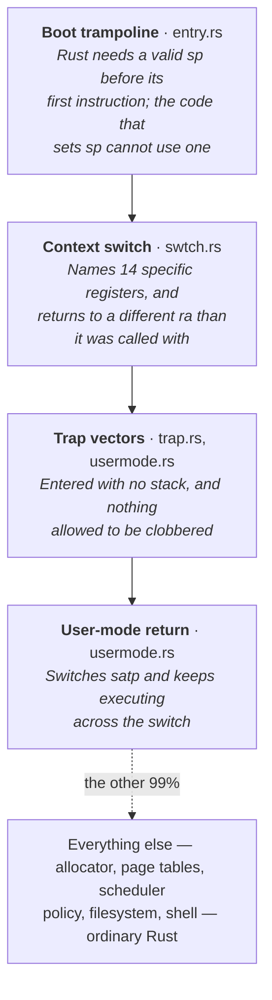
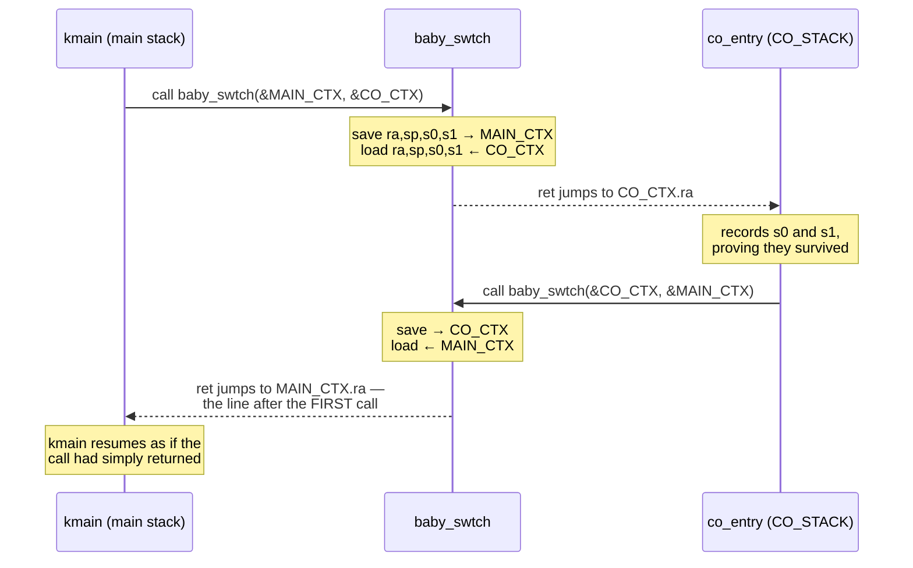

# RISC-V Registers and Calling Assembly from Rust

## Overview

Every operating system has a floor below which its implementation language
cannot reach. There is no way to write *save every register and switch to
another stack* in Rust, because the entire point of a register allocator is
that you do not choose which registers your code uses — the moment you need to
name one, you have left the language. So every kernel ever written contains a
little assembly, always in the same few places. This session is that floor. We
lay out the RV64 register file and its ABI names; state the
caller-saved/callee-saved split precisely enough to *derive* why a context
switch costs fourteen stores rather than thirty-one; pin down the calling
convention that `extern "C"` names; and build the bridge — `global_asm!` to
emit instructions, `extern "C"` to declare them, `#[repr(C)]` to freeze the
struct offsets they index. We finish by reading `baby_swtch` one instruction at
a time and naming what it is. Unlocks
[`a00_asm_bridge`](../assignments/exercises.md); the
[RISC-V guide](../guides/riscv.md) holds the lookup tables.

## Learning Objectives

- **Explain** why a kernel cannot be written entirely in a high-level language, and name the places assembly always appears.
- **Identify** the RV64 registers by number and ABI name, and state the role of `zero`, `ra`, and `sp`.
- **State** the caller-saved/callee-saved contract in both directions and apply it to a code fragment.
- **Derive** why a context switch saves only fourteen registers, and say where the other seventeen are.
- **Trace** a call through `a0`–`a7`, `ra`, and `sp`, including a non-leaf function's prologue and epilogue.
- **Decode** the pseudo-instructions `ret`, `li`, `mv`, and `beqz` into the real instructions emitted.
- **Resolve** local numeric label references (`1b`, `2f`) and explain why assembly needs them.
- **Justify** why calling an `extern "C"` symbol is `unsafe`, and what `#[repr(C)]` guarantees that Rust's default layout does not.

## Prerequisites

- **L04 (Structs, `impl`, and `const fn`)** — a struct is fields at fixed offsets; today those offsets become load-bearing.
- **L07 (Buffers, Bytes, and Line-Oriented I/O)** — bytes, slices, and pointers into them; `c02`–`c04` should be passing.
- **[RISC-V](../guides/riscv.md)** — the register table, instruction list, and calling-convention rules in reference form.
- **[Dev Setup](../guides/dev-setup.md)** — you need the `riscv64gc-unknown-none-elf` target and a working `qemu-system-riscv64` before Friday.
- **[Unsafe Rust and `no_std`](../guides/rust-unsafe-nostd.md)** — `unsafe`, raw pointers, and `extern` blocks.

---

## 1. Where the Language Runs Out

### 1.1 You do not choose the registers

A **register** is a named storage slot inside the CPU itself — not in memory,
not addressable, just wires. RV64 has 32 for general use, each 64 bits wide.
Arithmetic reads registers and writes registers; loads and stores are the only
instructions that touch memory at all.

Which register holds your variable? You do not know, and you are not supposed
to. The compiler's **register allocator** keeps the busiest values in the 32
slots and spills the rest to memory, reassigning as it goes. It will put your
`x` in `a3` here and `s7` fifty lines later, and change its mind when you add a
line or upgrade the compiler.

Now consider a sentence a kernel must be able to say:

> Save the current value of *every* callee-saved register into this struct,
> then load *every* one of them from that other struct, then return.

There is no Rust expression for "the current value of `s7`". There is no type
whose value is a register. Naming one is precisely what the abstraction exists
to prevent — and this is not an oversight in Rust. C cannot say it either, nor
Go, nor any language whose compiler allocates registers for you. The boundary
is not a failure of the language; it is the definition of one.

### 1.2 The same few places, in every kernel

What is remarkable is how *little* assembly this needs, and how predictable its
locations are. rv6, xv6, and Linux put it in the same spots for the same
reasons:



A few hundred instructions in a kernel of thousands of lines. Each exists
because the code must name a register, survive without a stack, or keep running
while the ground under it is replaced.

Both sides of that boundary must agree, without consulting each other, on where
arguments go and what survives a call. That agreement is the **ABI**, the
Application Binary Interface; RISC-V's is called LP64. It is a convention, not
a hardware feature — the CPU has no idea `a0` means "first argument". Sections
2 through 4 are that document, and `extern "C"` is Rust's way of saying "this
function obeys it".

> **Key distinction:** assembly in a kernel is not an optimization. Nobody
> writes `swtch` in assembly because it is faster; they write it in assembly
> because it is *not expressible*. A better compiler would not remove it.

---

## 2. The RV64 Register File

Registers have numbers, `x0`–`x31`, which is what the instruction encoding
contains. Nobody writes `x14`. Everyone writes the **ABI name**, which says
what the register is conventionally for; the assembler, the disassembler, and
GDB all print ABI names.

| Register | ABI name | Role | Saved by |
|---|---|---|---|
| `x0` | `zero` | Hardwired 0; writes discarded | — |
| `x1` | `ra` | Return address — where `ret` jumps | Caller |
| `x2` | `sp` | Stack pointer | Callee |
| `x3` | `gp` | Global pointer (unused in rv6) | — |
| `x4` | `tp` | Thread pointer (unused; `-smp 1`) | — |
| `x5`–`x7` | `t0`–`t2` | Temporaries | Caller |
| `x8` | `s0` / `fp` | Saved register, or frame pointer | Callee |
| `x9` | `s1` | Saved register | Callee |
| `x10`–`x11` | `a0`–`a1` | Arguments **and** return values | Caller |
| `x12`–`x17` | `a2`–`a7` | Arguments | Caller |
| `x18`–`x27` | `s2`–`s11` | Saved registers | Callee |
| `x28`–`x31` | `t3`–`t6` | Temporaries | Caller |

### 2.1 `zero`, and the pseudo-instructions it buys

`x0` always reads as 0 and discards every write. Spending 1/32nd of the
register file on a constant looks wasteful until you count what it buys: many
of the instructions you read are other instructions with `zero` in a slot.

| What you write | What is emitted |
|---|---|
| `mv rd, rs` | `addi rd, rs, 0` |
| `li rd, 5` | `addi rd, zero, 5` |
| `beqz rs, L` | `beq rs, zero, L` |
| `ret` | `jalr zero, 0(ra)` |

These are **pseudo-instructions**: mnemonics the assembler expands. They are
not slower and not fake, but GDB sometimes disassembles `ret` as
`jalr zero, 0(ra)`. That is not a bug; learn to read both.

### 2.2 `ra` is an ordinary register

On x86, `call` pushes the return address onto the stack and `ret` pops it. On
RISC-V, `call` puts it in `ra` and `ret` jumps to whatever `ra` holds. Nothing
is pushed or popped. `ra` is a general-purpose register that convention has
given a job, and you may load, store, or overwrite it like any other. **A
function that changes `ra` before returning returns somewhere else.** That is
the entire mechanism of §8, and it costs one `ld`.

Because `ra` is caller-saved, any function that calls another must save it
first — the inner `call` overwrites it. A **leaf function**, which calls
nothing, need not bother. `add3` is a leaf: three instructions, no stack.

### 2.3 `sp` and the direction of growth

`sp` points at the lowest currently-used byte of the stack, and the stack grows
**downward**. Claiming 32 bytes is `addi sp, sp, -32`; releasing them is
`addi sp, sp, 32`. The ABI requires `sp` to be a multiple of 16 at every call
boundary. Two consequences that will bite: to point `sp` at a fresh buffer you
must point it at the **top**, as the harness does at `main.rs:179`
(`addr_of!(CO_STACK) as usize + CO_STACK_WORDS * 8`); and RISC-V has **no red
zone**, so unlike x86-64 it promises nothing about memory below `sp`. A trap
handler may overwrite it at any instant, and in a kernel that is not
theoretical.

> **Key distinction:** RISC-V's registers are nearly uniform — any of `x1`–`x31`
> can be any operand of any instruction, and the roles above are pure
> convention. x86-64 is the opposite: its 16 registers carry hardware-imposed
> roles (`rsp` for `push`, `rcx` for shifts, `rdx:rax` for division), which is
> why x86 assembly is full of moves that exist only to satisfy the encoding.

---

## 3. Caller-Saved and Callee-Saved

This is the most consequential idea in the lecture. Every register is in
exactly one of two classes.

**Caller-saved** (*volatile*, *temporary*): `ra`, `t0`–`t6`, `a0`–`a7`.

> A called function may destroy these. If the **caller** still needs a value
> afterwards, it must save it first — normally by spilling it into its own
> stack frame.

**Callee-saved** (*non-volatile*, *saved*): `sp`, `s0`–`s11`.

> A called function must return these unchanged. If the **callee** wants one,
> it saves the old value on entry and restores it before returning.

Neither rule is optional and neither is checked. They are halves of one
bargain: the caller-saved set gives a callee scratch space it can use without
ceremony, and the callee-saved set gives a caller somewhere to keep long-lived
values across many calls. A compiler puts a counter that survives forty calls
in `s3` and a value used once in `t0`, and gets both cheaply.

```text
     caller (Rust)                  callee (your assembly)
     -------------                  ----------------------
     t0 = 0x11  \ about to be
     a3 = 0x22  / clobbered  ---->  free to use immediately, with no
                                    saving of any kind.
     needs them after the call?
     spills them to its OWN frame.

     s2 = 0x33  \ must survive --->  wants s2? then it must:
     s5 = 0x44  / the call             addi sp, sp, -16
                                       sd   s2, 0(sp)    <- save
     the caller does nothing.          ...use s2...
     It simply trusts.                 ld   s2, 0(sp)    <- restore
                                       addi sp, sp, 16
```

### 3.1 Why a context switch is cheap

A context switch is entered by an ordinary `call`, from ordinary Rust, on the
ordinary kernel stack. The ABI applies to it like anything else. So at the
instant `swtch` begins, where are the caller's fifteen live `t` and `a`
registers?

**Already on the stack.** The compiler had to assume `swtch` would destroy
them, so anything still needed was spilled into the caller's frame before the
`call` was emitted. Saving them again would save the same values twice. And the
frame holding them is reached through `sp` — which is one of the registers a
switch saves.

That leaves exactly fourteen: the twelve `s` registers the caller is relying on,
`sp` (the handle to everything else), and `ra` — caller-saved, but saved anyway
because the switch is about to overwrite it on purpose (§8). Fourteen `usize`
fields, 112 bytes: `Context` in `swtch.rs:7`. Not a design choice, a
derivation. You could not save fewer, and more would be redundant.

### 3.2 Three save areas, three sizes

The same reasoning applied to three situations gives three structures. If you
can explain the sizes, you understand the calling convention.

| Structure | Saves | Size | Why that set |
|---|---|---|---|
| `Context` (`swtch.rs:7`) | `ra`, `sp`, `s0`–`s11` | 14 regs, 112 B | Entered by a **call**; the caller already spilled the caller-saved set |
| `kernelvec` frame (`trap.rs:91`) | `ra`, `t0`–`t6`, `a0`–`a7` | 16 regs, 128 B | Entered by an **interrupt** — nothing was spilled. But it calls ordinary Rust, which preserves the `s` registers for free |
| `Trapframe` (`usermode.rs:34`) | all 31, plus `epc` | 35+ slots | A user process resumes much later from a different context. Nothing may be lost, and nothing was spilled |

> **Key distinction:** a **call** is cooperative — the compiler on both sides
> knows it is coming and prepares. A **trap** is not: it lands between any two
> instructions, in any state. That difference is why the first row holds 14
> entries and the last holds 35.

---

## 4. The Calling Convention and the Stack Frame

| Rule | Detail |
|---|---|
| Integer/pointer arguments | `a0`–`a7`, the first eight, left to right |
| Arguments nine and beyond | On the caller's stack (rv6 never needs this) |
| Return value | `a0` (a second in `a1`; large Rust structs return via a hidden pointer) |
| Return address | `ra`, written by `call`, jumped to by `ret` |
| Stack | Grows down; `sp` 16-byte aligned at every call boundary |
| Wide values | On RV64 a pointer, a `usize`, and a `u64` are all one register |

A pointer is just an integer, so `bytecopy(dst, src, n)` arrives as `a0 = dst`,
`a1 = src`, `a2 = n` with no ceremony. A three-argument function whose
arguments are already in the right registers needs no setup code at all — which
is why `add3` is three instructions long.

### 4.1 Prologue and epilogue

A **leaf** function can often run entirely out of `a` and `t` registers and
never touch the stack; all three routines you write on Friday are leaves. A
non-leaf function must build a **stack frame**: a region it owns for the
duration of the call, holding its saved `ra`, any callee-saved registers it
wants, and its spilled locals.

```asm
myfunc:
    addi sp, sp, -32         # prologue: claim 32 bytes (multiple of 16)
    sd   ra, 24(sp)          # we are about to call, which overwrites ra
    sd   s0, 16(sp)          # save s0 because we intend to use it
    sd   s1, 8(sp)           # 0(sp) is padding, for 16-byte alignment

    mv   s0, a0              # park the argument somewhere call-proof
    call helper              # clobbers ra, t*, a* -- s0 and s1 survive
    add  a0, a0, s0          # s0 is still what we put there

    ld   s1, 8(sp)           # epilogue: the prologue, backwards
    ld   s0, 16(sp)
    ld   ra, 24(sp)
    addi sp, sp, 32
    ret                      # jalr zero, 0(ra)
```

While `helper` runs, the stack holds three frames stacked downward: the
caller's (containing the spilled `t` and `a` registers of §3.1), `myfunc`'s
32 bytes, then `helper`'s. Below `sp` is unallocated and not yours.

The epilogue is the prologue reversed. That symmetry is not style: it is the
only way `sp` ends where it started, and a function returning with a different
`sp` corrupts its caller's frame and crashes somewhere unrelated, later.

---

## 5. The Instructions You Actually Need

rv6 hand-writes a tiny fraction of RV64GC; the compiler emits the rest. This is
close to the whole hand-written vocabulary of the course.

| Instruction | Meaning |
|---|---|
| `add rd, rs1, rs2` | `rd = rs1 + rs2`, wrapping silently |
| `addi rd, rs1, imm` | `rd = rs1 + imm`, `imm` in −2048..2047 |
| `li rd, imm` / `la rd, sym` | Load a constant / the *address* of a symbol |
| `mv rd, rs` | Copy a register |
| `lb rd, off(rs1)` / `sb rs2, off(rs1)` | Load / store one **b**yte |
| `ld rd, off(rs1)` / `sd rs2, off(rs1)` | Load / store a 64-bit **d**oubleword |
| `beqz rs, L` / `bnez rs, L` | Branch if `rs` is / is not zero |
| `j L` / `call sym` / `ret` | Jump / call (sets `ra`) / return (jumps to `ra`) |

### 5.1 Only loads and stores touch memory

RISC-V is a **load–store architecture**. `add` cannot add a value in memory to
a register; there is no such instruction. Incrementing a counter in memory
takes three. Every RISC design since the early 1980s made this trade for
pipelining: if only two instruction types can fault on an address, fault
handling stays simple and everything else has fixed, short latency.

The addressing mode is equally singular: `off(rs1)`, meaning "the address
`rs1 + off`". There is no base-plus-index-times-scale. And **`off` is a signed
12-bit constant baked into the instruction** — a literal in −2048..2047, never
a register, never computed at run time. That is why every save/restore sequence
in the kernel is a column of hard-coded numbers, and why those numbers must
agree byte for byte with a Rust struct (§6.3).

### 5.2 Local numeric labels

Assembly has no scoping: a label is a name in one flat namespace, so `loop:`
can exist exactly once per object file. Inventing `bytecopy_loop_top`,
`memmove_loop_top`, `strlen_loop_top` for every three-instruction loop in a
kernel is miserable.

Numeric labels fix it. `1:`, `2:`, … may be defined as often as you like, and a
reference says which **direction** to search: `1b` is the nearest `1:`
**b**ackward (loop tops), `2f` the nearest `2:` **f**orward (skipping ahead).

```asm
bytecopy:
    beqz a2, 2f              # n == 0: skip the loop entirely
1:                           # <- loop top
    lb   t0, 0(a1)
    sb   t0, 0(a0)
    addi a0, a0, 1
    addi a1, a1, 1
    addi a2, a2, -1
    bnez a2, 1b              # <- back to the nearest 1: above
2:                           # <- exit
    ret
```

Resolution is textual and local; a later `1:` elsewhere in the file cannot
affect this `1b`, because "nearest backward" is unambiguous.

There is a hard-won lesson in that first line too. The zero check comes
*before* the loop. A do-while copies one byte when asked to copy none — the
classic `memcpy` bug, which survives testing for years because `n == 0` is rare
until suddenly it is not.

> **Key distinction:** `add` wraps silently on overflow. RISC-V has no overflow
> trap, no flags, no condition codes at all. Rust's `+` panics on overflow in
> debug builds; the hardware underneath has no opinion. Writing assembly means
> giving that check up.

---

## 6. The Bridge

Three small pieces connect a Rust crate to a block of assembly. Together they
are the reason the previous five sections are useful.

### 6.1 `global_asm!`

`core::arch::global_asm!` takes a string of assembly and emits it at module
level, outside any function. Whatever you declare `.globl` becomes a real
symbol in the object file, indistinguishable to the linker from one the
compiler produced.

```rust
use core::arch::global_asm;

global_asm!(
    r#"
.globl add3
add3:
    add  a0, a0, a1
    add  a0, a0, a2
    ret
"#
);
```

`r#"…"#` is a **raw string**: Rust performs no escape processing inside it, so
a `\n` reaches the assembler as backslash-n rather than as a newline. Assembly
directives are full of backslashes, and this detail costs an hour the first
time. A second gotcha: like `format!`, both `asm!` and `global_asm!` treat `{`
and `}` as template placeholders, so literal braces must be doubled.

Its sibling `asm!` inlines assembly *inside* a function with operands, which is
right for one or two instructions wired to Rust values — `entry.rs:13-21` uses
it to set `sp` and call `kmain`. Use `global_asm!` for whole functions, `asm!`
for instructions.

### 6.2 `extern "C"`, and why calling it is `unsafe`

The assembly defines a symbol. Rust does not know it exists, what it takes, or
what it returns. You tell it:

```rust
extern "C" {
    pub fn add3(a: u64, b: u64, c: u64) -> u64;
}
```

`"C"` names the ABI — arguments in `a0`, `a1`, `a2`, result in `a0`,
callee-saved registers preserved; everything in §3 and §4. Rust now generates a
call site obeying those rules exactly.

What it cannot do is check the declaration against the assembly. There is
nothing to check against: by link time the assembly is machine code with no
type information in it. Declare three arguments where the assembly reads four,
and the fourth is whatever was left in `a3`. Declare a return value the
assembly never writes, and you receive a perfectly deterministic, completely
meaningless number.

> **The signature is a promise.** An `extern "C"` declaration is not a
> description the compiler verifies. It is an assertion you are making, and the
> compiler generates code that depends on it being true. That is exactly what
> `unsafe` marks: the places where *you* are the type checker. When you get it
> wrong the failure is silent, distant, and strange — no panic, no error, just
> a wrong number or a jump into nowhere.

The same holds in the other direction. Rust **mangles** symbol names by
default — `foo` in crate `bar` becomes something like `_ZN3bar3foo17h9c4f8e…E`,
because Rust permits two `foo`s in different modules and the linker does not.
Assembly that says `call kmain` needs `kmain` spelled `kmain` in the object
file, which is what `#[no_mangle]` does (`main.rs:207-208`). `#[no_mangle]`
fixes the *name*; `extern "C"` fixes the *convention*; you normally need both.
The same pair is on `_entry` (`entry.rs:10-12`) and on every `static mut` the
assembly reaches with `la` — `CO_STACK`, `MAIN_CTX`, `CO_CTX`, `SEEN_S0`,
`SEEN_S1` at `main.rs:138-147`.

### 6.3 `#[repr(C)]`, now load-bearing

You met `#[repr(C)]` in L04 as a curiosity. Here is why it is not.

Rust's default layout, `repr(Rust)`, is deliberately **unspecified**. The
compiler may reorder fields — typically widest alignment first, to minimize
padding — and may change how between releases. That is a real optimization and
costs nothing, right up until something outside the compiler needs to know
where a field is.

Assembly needs to know. `sd ra, 0(a0)` means "store `ra` zero bytes past the
pointer in `a0`", and that 0 is welded into the instruction (§5.1). If the
compiler put `sp` first, the instruction would corrupt `sp` instead of writing
`ra`, with no diagnostic of any kind.

`#[repr(C)]` freezes the layout to C's rules: fields in **declaration order**,
each at the next offset satisfying its own alignment with padding inserted as
needed, total size rounded up to the strictest alignment. Those rules are
stable, documented, and computable by hand — so the two sides agree.

```text
    #[repr(C)]                        memory, at the address in a0
    pub struct Ctx {                  +--------+  <- a0 + 0
        pub ra: usize,  // offset  0  |   ra   |
        pub sp: usize,  // offset  8  +--------+  <- a0 + 8
        pub s0: usize,  // offset 16  |   sp   |
        pub s1: usize,  // offset 24  +--------+  <- a0 + 16
    }                                 |   s0   |
                                      +--------+  <- a0 + 24
    size = 32, align = 8              |   s1   |
                                      +--------+
```

Every struct assembly touches in this course carries the attribute for this
reason: `Ctx` on Friday, `Context` (`swtch.rs:5-7`), and `Trapframe`
(`usermode.rs:34`), whose byte offsets are written into its comments because
two assembly routines index them by hand.

!!! warning "Adding a field in the middle"

    Inserting a field into a `#[repr(C)]` struct that assembly indexes moves
    every offset after it. The Rust still compiles. The assembly still
    assembles. The kernel breaks in a way no tool will point at.

---

## 7. The Machine It Runs On

`rustc` hands the text inside `global_asm!` to the assembler unmodified;
`rust-lld` links the resulting object, following `asmlab.ld`, which names
`_entry` as the ELF entry point and places the `.entry` section first inside
`.text` at `0x8000_0000` — where RAM begins on QEMU's `virt` board
(`asmlab.ld:12,16,19`). `-bios none` removes the firmware, so QEMU loads your
ELF and jumps into it directly. Your program *is* the whole software stack: no
OS beneath it, no libc, no loader, and no `println!` — printing is a `volatile`
byte store to `0x1000_0000` (`uart.rs:15,24`). No C cross-toolchain is needed
either; `rust-lld` ships with rustup.

!!! warning "`qemu-system-riscv64`, not `qemu-riscv64`"

    These are different programs. `qemu-system-riscv64` emulates a **whole
    machine** — CPU, RAM, UART, timer — which is what a kernel needs and what
    every exercise in this course uses. `qemu-riscv64` is **linux-user**
    emulation: it runs a single RISC-V *Linux process* by translating its
    system calls to the host's. There is no Linux here to make system calls
    to, so it could not run this program even in principle — and it is not
    built for macOS at all, so on half the class's laptops it does not exist.
    If a tutorial tells you to install it, you are reading about something
    else.

---

## 8. `baby_swtch`, Instruction by Instruction

Everything above converges on eight instructions.

### 8.1 The setup

```rust
#[repr(C)]
#[derive(Clone, Copy)]
pub struct Ctx { pub ra: usize, pub sp: usize, pub s0: usize, pub s1: usize }

extern "C" {
    pub fn baby_swtch(old: *mut Ctx, new: *const Ctx);
}
```

By §4, `a0 = old` and `a1 = new`. By §6.3, the fields sit at 0, 8, 16, 24.

```asm
.globl baby_swtch
baby_swtch:
    sd   ra, 0(a0)           # 1  *old.ra = our return address
    sd   sp, 8(a0)           # 2  *old.sp = our stack
    sd   s0, 16(a0)          # 3
    sd   s1, 24(a0)          # 4

    ld   ra, 0(a1)           # 5  ra = the other context's return address
    ld   sp, 8(a1)           # 6  sp = the other context's stack
    ld   s0, 16(a1)          # 7
    ld   s1, 24(a1)          # 8

    ret                      # 9  jalr zero, 0(ra) -- to the ra just LOADED
```

Instructions 1–4 photograph the current thread of execution into `*old`. 5–8
install a different one. 9 is the punchline.

### 8.2 The trace

The harness (`main.rs:171-183`) builds the second context by hand. A context
that has never run has no saved registers, so its registers are *forged*: `ra`
set to the entry point it should begin at, `sp` to the top of a fresh 4 KiB
stack, and two recognizable values in `s0` and `s1`.

| Point | `ra` | `sp` | `s0` | `s1` |
|---|---|---|---|---|
| A. `kmain` about to `call` | the line after the call | main stack | `kmain`'s | `kmain`'s |
| B. after instruction 4 | unchanged — and now in `MAIN_CTX` | unchanged, stored | unchanged, stored | unchanged, stored |
| C. after instruction 8 | `co_entry` | top of `CO_STACK` | `0xC0FFEE` | `0xBEEF` |
| D. after `ret` | executing at `co_entry`, on the coroutine's stack | | | |

Between B and C one function's entire identity is replaced with another's.
Nothing was pushed or popped; four loads did it.

### 8.3 What just happened

`ret` is `jalr zero, 0(ra)` (§2.1). It jumps to whatever `ra` currently holds,
and `ra` currently holds a value loaded out of a struct four instructions ago.

> **This function does not return to its caller. It returns into whatever the
> other context was doing.** A `ret` that lands somewhere other than the
> matching `call` *is* a context switch. Everything else about multitasking is
> bookkeeping around it.

Notice what came along for the ride. `sp` was loaded too, so the code resuming
at `co_entry` runs on a *different stack* — its locals, saved registers, and
return addresses are a different set of values in a different region of memory.
Two independent threads of execution now exist, and the only thing
distinguishing them is which values are in `ra` and `sp`.



That round trip proves three things at once. Arriving back in `kmain` proves
`ra` round-tripped; `co_entry` running without faulting proves `sp` was
switched to a valid stack; the recorded values prove `s0` and `s1` survived.
Miss any one of the eight instructions and exactly one of the three breaks.

### 8.4 Save everything before loading anything

The two blocks are ordered for a reason, and it is not tidiness. Suppose the
loads came first:

```asm
    ld   ra, 0(a1)           # WRONG: ra is now the OTHER context's
    ...
    sd   ra, 0(a0)           # and this stores the wrong value into *old
```

`*old` now records the *new* context's registers. The old thread of execution
is not saved anywhere — it is gone. Its return address was in `ra`, and `ra`
was overwritten before anything read it. Nothing faults; the machine runs
perfectly, in the wrong place, forever. Problem 4 works out exactly what that
looks like on the terminal.

Two details from the harness. `co_entry` is written in assembly on purpose
(`main.rs:149-151`): a Rust prologue is entitled to claim `s0` as a frame
pointer, which would overwrite the register the test is trying to prove
survived. And switching a context to *itself* must still work (`main.rs:199`) —
store four registers, load the same four back, change nothing.

### 8.5 Scaling up

The real thing (`swtch.rs:46-82`) is this function with ten more registers:
fourteen `sd`s at offsets 0 through 104, fourteen `ld`s at the same offsets,
`ret`. Same shape, same argument, same punchline. Exercise `05_context_switch`
writes it; `06_scheduling` calls it in a loop, and one CPU starts pretending to
be many. Forging a first context generalizes too: `init_context`
(`swtch.rs:38-44`) sets `ra` to the function a new process should begin
executing and `sp` to the top of its kernel stack, so `swtch` can "resume" a
thread that never previously existed.

---

## Key Concepts

| Concept | Definition | Example |
|---|---|---|
| ABI name | Conventional name saying what a register is used for | `x10` is `a0`, the first argument |
| Register allocator | Compiler pass assigning values to registers; the reason you cannot name one from Rust | Your `x` in `a3` today, `s7` tomorrow |
| Caller-saved | The callee may destroy it; the caller spills it if needed | `ra`, `t0`–`t6`, `a0`–`a7` |
| Callee-saved | The callee must return it unchanged | `sp`, `s0`–`s11` |
| Pseudo-instruction | A mnemonic the assembler expands into real instructions | `ret` → `jalr zero, 0(ra)` |
| Leaf function | Calls nothing, so needs no saved `ra` and no frame | `add3` — three instructions, no stack |
| Stack frame | The region below `sp` a function owns during its call | `addi sp, sp, -32` … `addi sp, sp, 32` |
| 12-bit offset | The `off` in `off(rs1)` is a literal in −2048..2047 | `sd s11, 104(a0)` — 104 is in the encoding |
| Local numeric label | Reusable label resolved by direction | `1b` = nearest `1:` back; `2f` = nearest `2:` forward |
| `global_asm!` | Emits assembly at module level; `.globl` makes a linker symbol | `global_asm!(r#".globl add3 …"#)` |
| `extern "C"` | Asserts a symbol follows the C ABI; unverifiable, hence `unsafe`. `#[no_mangle]` is its name-side partner | `fn baby_swtch(old: *mut Ctx, new: *const Ctx)` |
| `#[repr(C)]` | Freezes field order and padding to C's rules | `Ctx` at 0, 8, 16, 24 (`swtch.rs:5-7`) |

---

## Practice Problems

### Problem 1: Who saves what

A leaf helper `scale(x: u64) -> u64` is called from the middle of a routine. At
the call, these registers hold values the routine still needs *afterwards*:
`t2`, `a4`, `s3`, `sp`, `ra`. For each, give its class, who must preserve it,
and what code must exist. Then: `scale` is a leaf using only `a0` and `t0`. How
many save/restore instructions does `scale` itself contain?

<details>
<summary>Click to reveal solution</summary>

| Register | Class | Responsible | What must exist |
|---|---|---|---|
| `t2` | Caller-saved | **Caller** | `sd t2, off(sp)` before the call, `ld` after |
| `a4` | Caller-saved | **Caller** | Same — spilled into the caller's own frame |
| `s3` | Callee-saved | **Callee** | Nothing in the caller. `scale` saves it only if it uses it — and it does not |
| `sp` | Callee-saved | **Callee** | Nothing in the caller. `scale`'s epilogue must restore `sp` exactly |
| `ra` | Caller-saved | **Caller** | The caller saved `ra` in its own prologue, because `call scale` overwrites it |

`scale` contains **zero** save/restore instructions. It is a leaf, so it never
overwrites `ra` by calling anything, and it uses only `a0` and `t0` — both
caller-saved and free to clobber. It touches no callee-saved register, so it
owes nothing.

The common error is filing `ra` under callee-saved because "the callee gets us
home". `ra` is caller-saved: a callee may destroy it, and does so the instant
it calls anything. That is exactly why non-leaf functions save `ra` in their
prologue — they are saving it *as a caller*, for the call they are about to
make.
</details>

### Problem 2: Build the frame

`tally(n: u64) -> u64` must keep `n` across three calls to a helper, use `s1`
and `s2` as accumulators, and hold a 24-byte local array. Write the prologue
and epilogue, state the frame size, and give `sp` inside the body if `sp` was
`0x8000_5A00` on entry.

<details>
<summary>Click to reveal solution</summary>

```text
    saved ra        8   (tally calls, so ra dies)
    saved s0        8   (holds n: it must survive calls -> a callee-saved
                         register -> save the caller's s0 first)
    saved s1        8
    saved s2        8
    local array    24
                  ----
                   56  -> round UP to a multiple of 16 = 64
```

```asm
tally:
    addi sp, sp, -64
    sd   ra, 56(sp)
    sd   s0, 48(sp)
    sd   s1, 40(sp)
    sd   s2, 32(sp)
    mv   s0, a0              # park n where calls cannot reach it
    # ...body; the local array is 0(sp)..23(sp)...
    ld   s2, 32(sp)
    ld   s1, 40(sp)
    ld   s0, 48(sp)
    ld   ra, 56(sp)
    addi sp, sp, 64
    ret
```

`sp` inside the body is `0x8000_5A00 − 64 = 0x8000_59C0`; both values are
16-byte aligned, as required.

Two things to notice. `n` arrives in `a0`, which is caller-saved and therefore
destroyed by the first `call helper`; moving it to `s0` is what "keep it across
calls" costs, and the price of using `s0` is saving the caller's. And the
rounding from 56 to 64 is not optional: hand a callee a misaligned `sp` and you
have violated the ABI, which on some implementations faults and on QEMU
produces misaligned accesses that work until they do not.
</details>

### Problem 3: Compute the offsets

```rust
#[repr(C)]
pub struct Frame {
    pub flag: u8,
    pub ra:   usize,
    pub id:   u32,
    pub sp:   usize,
}
```

Give every field's offset, the size, and the alignment. Write the two
instructions that save `ra` and `sp` into a `Frame` whose address is in `a0`.
Then: what changes if `#[repr(C)]` is deleted?

<details>
<summary>Click to reveal solution</summary>

C's rules: declaration order, each field at the next offset satisfying its own
alignment, size rounded up to the struct's alignment (8, the strictest).

```text
    offset  0   flag: u8      1 byte
    offset  1   -- 7 bytes padding (usize needs 8-byte alignment) --
    offset  8   ra:   usize   8 bytes
    offset 16   id:   u32     4 bytes
    offset 20   -- 4 bytes padding --
    offset 24   sp:   usize   8 bytes
    ---------------------------------
    size = 32, align = 8
```

```asm
    sd   ra, 8(a0)
    sd   sp, 24(a0)
```

Without `#[repr(C)]` the layout is **unspecified**. The compiler would almost
certainly reorder to `ra`, `sp`, `id`, `flag` — putting the 8-byte fields first
removes all padding and shrinks the struct from 32 bytes to 24. That is a real
win, and exactly why the default exists.

But then `sd ra, 8(a0)` writes into `sp`, and `sd sp, 24(a0)` writes four bytes
past the end of the struct into whatever follows it. Nothing warns you: the
Rust compiles, the assembly assembles, the linker is satisfied. You find out
when an unrelated variable changes by itself.

The rule generalizes: if anything outside the Rust compiler indexes a struct —
assembly, a device, another language, a file format — it needs `#[repr(C)]`. If
nothing does, do not add it; you would be paying padding for nothing.
</details>

### Problem 4: Find the bug

A student writes `baby_swtch` this way and gets the output below it.

```asm
.globl baby_swtch
baby_swtch:
    ld   ra, 0(a1)
    ld   sp, 8(a1)
    ld   s0, 16(a1)
    ld   s1, 24(a1)

    sd   ra, 0(a0)
    sd   sp, 8(a0)
    sd   s0, 16(a0)
    sd   s1, 24(a0)

    ret
```

```text
asmlab: RISC-V assembly bridge
running checks...
  [ok] add3 follows the calling convention
  [ok] bytecopy copies exactly n bytes
```

Then nothing, until the harness kills QEMU. Explain step by step why it hangs
rather than printing a `[fail]` line.

<details>
<summary>Click to reveal solution</summary>

The loads run first, so by the time the stores execute all four registers hold
the *new* context's values. `*old` is filled with a copy of `*new`, and the old
thread of execution is destroyed: its return address was in `ra`, and `ra` was
overwritten in instruction 1 before anything read it.

1. `kmain` calls `baby_swtch(&mut MAIN_CTX, &CO_CTX)`.
2. Loads: `ra = co_entry`, `sp = CO_STACK` top, `s0 = 0xC0FFEE`, `s1 = 0xBEEF`.
3. Stores: `MAIN_CTX` now holds a copy of `CO_CTX`, not `kmain`'s state.
4. `ret` jumps to `co_entry`. So far it *looks* right.
5. `co_entry` records `s0` and `s1` — correctly. Both survived.
6. `co_entry` calls `baby_swtch(&CO_CTX, &MAIN_CTX)` to go home.
7. Loads from `MAIN_CTX`: `ra = co_entry` again. Stores into `CO_CTX`.
8. `ret` jumps to `co_entry`. Again. And again. Forever.

The result is a tight infinite loop between `co_entry` and `baby_swtch`, on a
valid stack, executing valid instructions, never faulting. Nothing is wrong
from the CPU's point of view — which is why there is no `[fail]` line. Printing
one requires *reaching* the check, and control never returns to `kmain`.

Two lessons. **Save all before you load any**, because the old `ra` is the only
record of where the caller lives. And a hang with no output is the signature of
a `ret` to a wrong-but-valid address, while a crash is the signature of a `ret`
to a wrong-and-invalid one. The hang is the harder of the two to debug, which
is why the self-switch check at `main.rs:199` exists.
</details>

### Problem 5: The signature is a promise

The assembly is correct; the declaration is not.

```asm
.globl add3
add3:
    add  a0, a0, a1
    add  a0, a0, a2
    ret
```

```rust
extern "C" {
    pub fn add3(a: u64, b: u64) -> u64;   // two arguments, not three
}

let x = unsafe { asm::add3(10, 20) };
let y = unsafe { asm::other_routine(7) };   // some other extern fn
let z = unsafe { asm::add3(1, 2) };
```

Does this compile? What are `x` and `z`? Is the behaviour deterministic? What
tool would catch it?

<details>
<summary>Click to reveal solution</summary>

**It compiles, with no warning.** An `extern` block is a declaration, and a
declaration is your assertion. There is nothing to compare it against: the
assembly carries no type information, and by link time it is machine code.

Rust emits a call site for a two-argument function — it sets `a0 = 10`,
`a1 = 20`, and *does not touch* `a2`. The assembly then adds whatever `a2`
happens to contain.

- **`x` = 30 + (whatever was in `a2`)**. Early in `kmain`, `a2` may well be 0
  and `x` may well be 30 — the worst possible outcome, because the bug now
  passes your first test.
- **`z` = 3 + (whatever `a2` holds by then)**, and the intervening call has
  almost certainly left something there: `a2` is caller-saved, so nothing is
  obliged to preserve it.

**It is deterministic** — the same binary on the same input gives the same
answer every time — but not *stable*. Adding a line, changing optimization
level, or upgrading the compiler changes what is in `a2` and therefore the
answer. That is the worst debugging experience in systems programming: a bug
that reproduces reliably, vanishes when you add a print statement, and returns
when you remove it.

**No tool catches it.** Not the type checker, the borrow checker, the linker,
or `unsafe` — `unsafe` checks nothing; it marks the region where you have taken
the checking on yourself. Miri cannot see into assembly. The only defences are
reading the declaration against the assembly, and tests that tell 30 apart from
30-plus-garbage — which is why the harness calls `add3` twice and checks
`add3(u64::MAX, 1, 0) == 0`.
</details>

### Problem 6: Resolve the labels, predict the output

```asm
.globl mystery
mystery:
    beqz a2, 2f
1:
    lb   t0, 0(a1)
    beqz t0, 2f
    sb   t0, 0(a0)
    addi a0, a0, 1
    addi a1, a1, 1
    addi a2, a2, -1
    bnez a2, 1b
2:
    li   t1, 0
    sb   t1, 0(a0)
    ret
```

Say which line each of the three label references targets. Then: `src` holds
`48 69 00 21` (`'H'`, `'i'`, `0`, `'!'`), `dst` is eight zeroed bytes, and the
call is `mystery(dst, src, 4)`. What does `dst` contain afterwards, and what is
in `a0` at `ret`?

<details>
<summary>Click to reveal solution</summary>

**Labels.** Both `2f` references target the `2:` before `li t1, 0` — nearest
*forward*. `1b` targets the `1:` at the loop top — nearest *backward*. Two
`2f`s reaching one label is normal, not a conflict; it is what "skip to the
common exit" looks like.

| Pass | `t0` | Action | `a0` | `a1` | `a2` |
|---|---|---|---|---|---|
| entry | — | `a2 = 4 ≠ 0`, fall through | `dst+0` | `src+0` | 4 |
| 1 | `0x48` `'H'` | store, advance | `dst+1` | `src+1` | 3 |
| 2 | `0x69` `'i'` | store, advance | `dst+2` | `src+2` | 2 |
| 3 | `0x00` | `beqz t0, 2f` → **exit** | `dst+2` | `src+2` | 2 |

At `2:` it stores a zero byte at `0(a0)` = `dst+2`.

**`dst` = `48 69 00 00 00 00 00 00`**, and **`a0` = `dst + 2`** at `ret` — a
pointer to the terminator, not to the start of the string.

This is `strncpy` with a guaranteed terminator: at most `n` bytes, stopping
early at a NUL. The `!` at `src+3` is never copied, because the NUL ended the
loop before the count did. And `a0` was used as a loop cursor, so the *return
value* (§4: `a0` is the return register) is the end pointer. A Rust declaration
saying `-> *mut u8` whose caller assumed it got `dst` back would leave every
string off by its own length — Problem 5's lesson from the other direction: the
two sides must agree on the *meaning* of `a0`, not just its width.
</details>

---

## Further Reading

- [RISC-V](../guides/riscv.md) — the register table, full instruction list, pseudo-instruction expansions, and the CSRs you meet later.
- [Unsafe Rust and `no_std`](../guides/rust-unsafe-nostd.md) — `unsafe`, raw pointers, `extern` blocks, and `asm!` operand syntax.
- [Memory Map](../guides/memory-map.md) — why `0x8000_0000`, and what else lives in the `virt` board's address space.
- [Dev Setup](../guides/dev-setup.md) — installing the RISC-V target and QEMU; the September 18 hard deadline.
- [QEMU and GDB](../guides/qemu-gdb.md) — `info registers`, single-stepping, and watching `ra` change under you.
- [Cheatsheet](../guides/cheatsheet.md) and [Key Concepts](../guides/key-concepts.md) — the register table and the caller/callee split are Midterm 1 material.
- [All Exercises](../assignments/exercises.md) — `a00_asm_bridge` is unlocked by this session and due Friday.
- *RISC-V Instruction Set Manual, Volume I* — Chapter 2 (the RV32I base) and the assembly programmer's reference, where the pseudo-instruction table lives.
- *RISC-V ELF psABI Specification* (`riscv-non-isa/riscv-elf-psabi-doc`) — the document that actually says `a0` is the first argument. Short and readable.
- Patterson and Hennessy, *Computer Organization and Design, RISC-V Edition*, §2.8 — the same material at book length.
- xv6-riscv `kernel/swtch.S`; Linux `arch/riscv/kernel/entry.S` and `switch_to.S`.

---

## Summary

1. **The floor is real and narrow.** No language whose compiler allocates registers can express "save every register and switch stacks", so every kernel has assembly — boot trampoline, context switch, trap vectors, user-mode return. A few hundred instructions, and nothing else.
2. **Thirty-two registers, two classes, always called by ABI name.** `zero` is hardwired 0 and underwrites half the pseudo-instruction set; `ra` holds the return address as an ordinary writable register; `sp` grows down and is 16-byte aligned at every call.
3. **Caller-saved means the callee may destroy it; callee-saved means the callee must give it back.** `ra`, `t0`–`t6`, `a0`–`a7` versus `sp`, `s0`–`s11`. Nothing enforces either rule.
4. **A context switch saves fourteen registers because the rest are already on the stack.** It is entered by a normal `call`, so the compiler already spilled everything caller-saved that mattered — and `sp`, the handle to that spill, is one of the fourteen. `Context` (`swtch.rs:7`) is a derivation, not a design.
5. **A call is cooperative; a trap is not.** That alone is why `Context` holds 14 registers, `kernelvec`'s frame 16, and `Trapframe` 35.
6. **Offsets are welded into instructions.** `off(rs1)` takes a signed 12-bit literal, so every save/restore is a column of constants that must match a Rust struct exactly — which is what `#[repr(C)]` guarantees and what `repr(Rust)`, free to reorder fields, explicitly does not.
7. **`extern "C"` is a promise, not a check.** Rust cannot compare a declaration against machine code, so a wrong signature yields no diagnostic and no crash — just a wrong answer from a leftover register. That is precisely what `unsafe` marks: the place where you are the type checker.
8. **`ret` jumps to whatever is in `ra`, and `ra` is just a register.** Load it from elsewhere and the function returns elsewhere; load `sp` too and it returns on another stack. Eight instructions in `baby_swtch`, fourteen more in `swtch`, and one CPU can pretend to be many.
