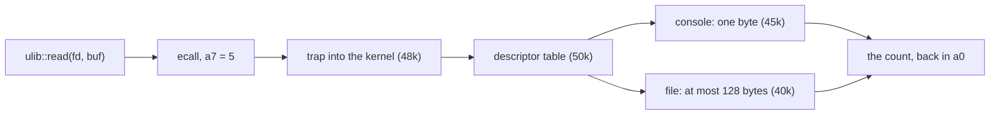

# Week 5 · Streams of Bytes: `cat`, `wc`, and `grep`

> **Thu Sep 24** `11c_cat` · **Fri Sep 25** `12c_wc`, `13c_grep`, extra credit `14c_head`
>
> Read this page yourself before Midterm 1. **Essentials** is what Thursday
> and Friday assume. **Going deeper** is optional and is not on the exam.

[Slides](05-cs326-2026-09-22-cat-wc-and-grep-slides.html){ .md-button }
[Thursday prep](../prep/05-cs326-2026-09-24-prep-cat.md){ .md-button }
[Friday prep](../prep/05-cs326-2026-09-25-prep-wc-and-grep.md){ .md-button }

## This week { #this-week }

In `53k` you type `run mygrep` at your own rv6 shell, and the file you write
this week runs on your kernel. Each `read` it makes traps into code you wrote
and returns whatever your console or filesystem had ready.

This week you write three Unix commands with no heap and no `format!`. On
Thursday `cat` copies bytes through a `read` that may come back short. On
Friday `wc` counts an input of any size with a few variables, and `grep`
searches it line by line. Midterm 1 (Thu Oct 15) tests the short-read contract,
why `write_all` exists, and streaming with fixed buffers and O(1) state.

By Friday night you have three commands that handle a file of any size through
one fixed buffer.

---

## Essentials { #essentials }

### Thursday · `11c` cat { #thu-11c }

In `50k` you write the kernel's side of `read`, and rv6 answers a file read
with at most 128 bytes. `11c_cat` writes the other side now, and must be right
whatever `read` returns.

#### Everything is a descriptor { #11c-descriptors }

Unix reaches files, terminals and devices the same way: through a **file
descriptor**, a small integer indexing a per-process table in the kernel. A
program reading descriptor 3 cannot tell what stands behind it.

Three descriptors are open before your first line runs:

| fd | `ulib` name | Default, and what changes it |
|---|---|---|
| 0 | `STDIN` | the keyboard; `<` swaps in a file |
| 1 | `STDOUT` | the screen; `>` swaps in a file |
| 2 | `STDERR` | the screen, whatever `>` did |

Complaints use descriptor 2 so they survive redirection: `wc gone.txt > counts`
shows its message on the screen and leaves `counts` clean. With no file names,
a command reads descriptor 0, so `cat < notes.txt` prints a file `cat` never
opened. `ulib` opens and closes the rest:

```rust
pub fn open(path: &[u8], flags: u32) -> Result<Fd, Error>
pub fn close(fd: Fd) -> Result<(), Error>
```

Read `Result<Fd, Error>` as "a descriptor, or the news that there is none".
rv6 gives each process 16 descriptor slots, and those three are already in
use. Every `open` spends a slot and only `close` refunds it. Skip a `close`
and nothing fails there; a later `open` of a file that exists fails instead.
That delayed failure is a **leak**, and error paths leak as easily as normal
ones.

#### The short-read contract { #11c-short-read }

`read` is a request with a ceiling, and its answer is the truth:

```rust
pub fn read(fd: Fd, buf: &mut [u8]) -> Result<usize, Error>
```

Read the `usize` as "how many bytes I actually put in `buf`", from 0 to
`buf.len()`. Fewer than you asked for is a **short read**, and it is normal. A
file can run out partway through your request, and a terminal hands over only
what has been typed.

Only `0` means end of input. A correct reader asks again until it hears 0,
and each time uses only the first `n` bytes. Here is `cat` with no arguments
on your laptop's terminal, with a 512-byte buffer:

```text
you type hello, Enter   read -> 6   buf[..6] is "hello\n"
you type ok, Enter      read -> 3   buf[..3] is "ok\n"; buf[3..6] still says "lo\n"
you press Ctrl-D        read -> 0   end of input: three reads, two lines
```

The second row is the whole contract: 3 is not the end signal, and the bytes
past 3 belong to the line before.

`write` has the mirror problem, and `write_all`, from week 4,
[repeats until every byte is gone](#exam-write-all). The test harness on your
laptop is generous in two ways rv6 is not: it takes every write whole, and it
never counts open descriptors. A bare `write` and a missing `close` both pass
there.

> **The one thing to get right:** every small test passes, and a file larger
> than the buffer comes out cut short, or ends with a stretch of bytes from the
> chunk before. `read`'s answer, not the buffer's size, says how many bytes are
> real, and only 0 says the file is over.

#### One fixed buffer { #11c-buffer }

An rv6 program runs without a heap, so `Vec`, `String` and `format!` are out
of reach. Everything a command stores is an array it declared, and its read
buffer is one of them, on the stack. Copying a 3 KB note or a 3 TB disk
image uses the same array.

Every `read` is a trip into the kernel, a trap whose fixed cost does not
shrink with the request. A bigger buffer spreads that cost over more bytes:

```text
copying 1 MiB (1,048,576 bytes), not counting the final read of 0
  1-byte buffer    1,048,576 reads
512-byte buffer        2,048 reads   0.2% as many
  4 KiB buffer           256 reads   and your whole stack
```

The first factor of 512 removes nearly every trap, and later growth saves far
less. An rv6 program gets one 4 KiB stack page, so a 1 KiB buffer is a quarter
of it and 8 KiB does not fit. That is why `cat` and `wc` use 512 bytes and
`grep` uses 1,024.

#### One bad file, one exit status { #11c-status }

The `i32` your `run` returns is the **exit status**: 0 for success, anything
else for failure.

Give the real `cat` a missing file and a good one:

```text
$ cat gone.txt todo.txt
cat: gone.txt: No such file or directory
buy milk
$ echo $?
1
```

The complaint about `gone.txt` went to standard error, and `todo.txt` printed
anyway. The final 1 describes the whole run, not the last file: a later
success does not erase an earlier failure.

### Friday · `12c` wc { #fri-12c }

From `45k` on, rv6 gets your typing through device interrupts and keeps it in
a small fixed ring. `12c_wc` practices that discipline on a file: lines, words
and bytes, counted in one pass.

#### Bytes, `char`, and UTF-8 { #12c-bytes }

Rust has four types that can hold text, and they differ in what they promise:

| Type | Size | Promises |
|---|---|---|
| `u8` | 1 byte | nothing: any of 256 values |
| `char` | 4 bytes | one Unicode scalar value |
| `&str` | 16 bytes (pointer, length) | the bytes are valid UTF-8 |
| `&[u8]` | 16 bytes (pointer, length) | nothing |

In **UTF-8** a character takes 1 to 4 bytes, and ASCII takes exactly one:

```rust
assert_eq!('ñ'.len_utf8(), 2);          // one char, two bytes
assert_eq!("año".len(), 4);             // len counts bytes
assert_eq!("año".chars().count(), 3);
let flag: &[u8; 2] = b"-n";             // a byte string, not a &str
```

Read `"año".len()` as "how many bytes", never "how many letters". So `wc`
counts bytes: a file holding `año` and a newline is 5 bytes. The commands use
`&[u8]` throughout: a disk block or a keystroke has no encoding, and checking
UTF-8 costs image space.

Bytes are safe on UTF-8 text anyway; [Going deeper](#deeper-utf8) shows why.

To `wc`, a **line** is a `\n` byte, so a last line without one is not counted.
A **word** is a run of non-whitespace bytes. `matches!(b, b'a' | b'e')`
tests a byte against several patterns at once.

#### Streaming with O(1) state { #12c-state }

Counting the easy way means holding the whole input and cutting it at
whitespace. rv6 has no heap for either, and a file can outgrow all the memory
a process gets. The alternative is to **stream**: examine every byte once,
while it sits in the buffer, then reuse the buffer. What survives between
bytes is **O(1) state**: the same handful of variables for a 50-byte file and a
50 GB one.

Streaming has one trap: anything spanning two bytes can span two reads. A
counter of Windows line endings, `\r\n`, shows the way out:

```rust
// Called once per chunk. The caller keeps `after_cr` between calls.
fn feed(chunk: &[u8], after_cr: &mut bool, pairs: &mut usize) {
    for &b in chunk {
        if *after_cr && b == b'\n' { *pairs += 1; }
        *after_cr = b == b'\r';
    }
}
```

Read `after_cr` as "the one fact about the past that the next byte might
need". Feed it `one\r`, then `\ntwo\r\n`, and `pairs` is 2, the same as one
feed of the whole. Declare `after_cr` inside `feed` instead and the
first pair vanishes, so the answer depends on where the reads fell.

State updated by each arriving byte is a **state machine**, and a correct one
gives the same answer however its input is chunked.

> **The one thing to get right:** a file holding `hello world` gets 10 words,
> one per letter. A word is not a kind of byte; it is an event, the change from
> separator to non-separator. One byte cannot show a change. Only what you
> remember about the byte before it can.

### Friday · `13c` grep { #fri-13c }

In `53k`, `grep` runs as a user program on rv6, where a panic prints one word.
`13c_grep` gets its edge cases right under `cargo test`, reading lines through
a buffer it declares.

#### Lines without an allocator { #13c-lines }

To `grep`, a line is everything between two `\n` bytes; the `\n` itself
belongs to neither side. Reads know nothing about lines, so a 1 KiB read may
stop halfway through one. A heap would let you grow a buffer until the line
fits; without one, you move the unfinished part to the front and read more
behind it.

`ulib::Lines` does that for you:

```rust
impl<'b> Lines<'b> {
    pub fn new(fd: Fd, buf: &'b mut [u8]) -> Lines<'b> { … }
    pub fn next_line(&mut self) -> Option<&[u8]> { … }
}
```

Read `buf: &'b mut [u8]` as "your array, on loan to `Lines` for as long as
`lines` is in use". Each `next_line` hands back a slice of that array with the
`\n` removed, or `None` at end of file. An oversized line is cut to the
buffer's length, its tail is thrown away, and `truncated()` turns true.

Print `buf[0]` while `lines` is still in use and you get ``error[E0502]:
cannot borrow `buf[_]` as immutable because it is also borrowed as mutable``;
write to it and you get `E0506`.
Hold a line across the next call and you get `E0499`, since that call may
write over its bytes. C compiles all three and hands you bytes that changed
under you.

#### `while let` { #13c-while-let }

A `for` loop needs an iterator, and `Lines` is not one. Each line borrows the
buffer that the next call overwrites, and `Iterator` has no way to say that. So
you drive it by hand, with **`while let`**:

```rust
let mut stack = vec![10, 20, 30];
while let Some(top) = stack.pop() {
    println!("{top}");              // 30, then 20, then 10
}
// pop() answered None: the loop is over
```

Read `while let Some(top) = stack.pop()` as "call `pop`; while the answer is
`Some`, bind it to `top` and run the body". The first answer that does not
match ends the loop.

#### Where a search breaks { #13c-search }

Our `grep` matches a fixed string, not a regular expression. A line matches if
the **pattern** occurs in it as one contiguous run of bytes: `ear` is in
`heart`, but not in `era`. Search code calls the pattern the **needle** and the
line the **haystack**.

Sliding a needle along a haystack is a fencepost count: a 2-byte needle on a
5-byte line starts at 0, 1, 2 or 3, four starts, and the last is 5 − 2. Two
sizes need a decision before you count. An empty needle has nothing to
mismatch, so it is found in every line. A needle with more bytes than the line has no
start at all, and its "last start" is a negative number that a `usize` cannot
hold.

Rust has two range forms, and only one includes its end:

```rust
let a: Vec<u32> = (1..5).collect();     // [1, 2, 3, 4]: stops before 5
let b: Vec<u32> = (1..=5).collect();    // [1, 2, 3, 4, 5]
let gap = 2usize.checked_sub(5);        // None: checked, no panic
```

Read `..=` as "up to and including". A `checked_` operation returns an
`Option` where plain arithmetic would panic: `2 - 5` on `usize` values panics
in a debug build.

> **The one thing to get right:** `grep log` prints `logfile` but not `syslog`.
> Count the starts by hand: a 3-byte needle fits a 6-byte line at 0, 1, 2
> and 3. The last start is exactly 6 − 3, and a range that stops one start
> early never tries 3, the only place `log` sits in `syslog`.

#### An answer scripts can test { #13c-status }

`grep` reports its verdict twice: as printed lines, and as its exit status,
which is what `if` and `&&` read:

| Status | Meaning |
|---|---|
| 0 | some line matched |
| 1 | the search ran and nothing matched |
| 2 | trouble: no pattern, or a file that `open` refused |

Status 1 is the answer "no", not a failure:

```text
$ grep -q ERROR build.log && echo "read the log"
read the log
$ grep zebra build.log; echo $?
1
```

Read `-q` as "print nothing; just answer". If `grep` exited 0 whether or not
it found anything, every `if grep` would take the same branch.

> **Extra credit · `14c`** `14c_head` prints the first 10 lines of its input, or
> as many as `-n COUNT` asks for. The idea: `head` is judged by what it does
> not read. `Lines` fetches input only when you ask for a line, so `head`'s
> work is set by the count, not by the file's size. `head -n 1` on a 10 GB log
> should cost one buffer, not 10 GB.
> { #ec-14c }

### For the exam { #exam }

*Not needed on Thursday or Friday. On Midterm 1.*

**Counting the calls** · *Midterm 1.* When `read` fills the buffer whenever it
can, N bytes through a B-byte buffer take ⌈N/B⌉ reads that return data, then
one that returns 0, and each data read gets one `write_all`. For 1,000 bytes
and a 256-byte buffer: 256, 256, 256, 232, 0, so five reads and four writes.
A kernel that returns less per read changes the count, never the output. A
program that reads once prints the first chunk and silently drops the rest.
[Problem 1](#problem-1) has this shape.
{ #exam-count }

**Why `write_all` exists** · *Midterm 1.* `write` returns how many bytes it
took: a disk that fills mid-write takes what fits and reports the smaller
count. `write_all` calls `write` again on the part not yet taken until nothing
is left. It turns a write that takes 0 bytes into an error, not a loop that
spins forever. It returns no count, since success means every byte.
{ #exam-write-all }

**State across a chunk boundary** · *Midterm 1.* Given a streaming routine, an
input and a buffer size, give the state after each chunk and the final answer.
A correct routine gives the same answer for every buffer size, because
nothing it needs is lost when a read ends. If the answer changes with the
chunking, some state was reset between reads; [Problem 2](#problem-2) has
this shape. A routine that acts when a line ends may still hold a result when
`read` returns 0, so it needs one last step after the loop, a **flush**
([Problem 3](#problem-3)).
{ #exam-chunks }

---

## Going deeper { #deeper }

*Optional. Nothing here is needed on Thursday or Friday, and nothing here is on
the exam.*

### Where a `read` goes on rv6 { #deeper-read-path }

On rv6 each `ulib` call is one `ecall`: the call number in `a7`, up to three
arguments in `a0`–`a2`, the result back in `a0`. `read` is call 5, `open` 15,
`write` 16 and `close` 21:



rv6 stages a file read through a 128-byte kernel buffer, and its files hold at
most 128 bytes, so a 512-byte request always comes back short. A console read
returns one keystroke, so `cat` with no arguments makes one `read` per key,
while the host fills 512 bytes when it can. One program works in all three
because it loops until 0. Linux's `read(2)` page says it outright: "It is not
an error if this number is smaller than the number of bytes requested."

### Choosing a buffer size { #deeper-buffer-size }

Four forces set the number:

1. **The per-call cost** wants it large, with fast-shrinking returns: 512 to
   64 KiB removes 2,032 of the last 2,048 calls, at 128 times the memory.
2. **The device** wants it aligned to 512-byte sectors or 4 KiB blocks and
   pages.
3. **The kernel's staging buffer** caps it: rv6 never returns more than 128
   bytes per read.
4. **Your memory** wants it small. An rv6 program's stack is one page:

```text
0x0001_1000   top of the stack (sp starts just below, under argv)
0x0001_0000   the stack: one 4 KiB page for every local
0x0000_0000   the program image: at most 16 pages (64 KiB)
```

glibc's `BUFSIZ` is 8,192 and nobody minds, because a Linux stack grows on
demand to 8 MB. On rv6, 8 KiB of locals runs `sp` off its page.

### UTF-8, and why bytes are safe { #deeper-utf8 }

Ken Thompson and Rob Pike designed UTF-8 in 1992, for Plan 9. A character's
first byte says how long it is, and every byte after it has the form
`10xxxxxx`:

```text
0xxxxxxx                              1 byte: ASCII, unchanged
110xxxxx 10xxxxxx                     2 bytes: ñ is C3 B1
1110xxxx 10xxxxxx 10xxxxxx            3 bytes
11110xxx 10xxxxxx 10xxxxxx 10xxxxxx   4 bytes
```

Only ASCII bytes have the top bit clear, so a byte-wise search for ASCII never
hits inside a longer character. Validating UTF-8 takes a state machine of its
own and costs code in a 64 KiB image. `wc -m`, which counts characters, pays
for decoding every byte.

### Inside `Lines` { #deeper-lines }

`next_line` tries three cases in order. A buffered `\n` returns the bytes
before it, with no `read` at all. At end of file, leftover bytes come back as
the last line, which is why a final line with no newline still appears.
Otherwise it **compacts**: `copy_within` slides the unfinished tail to the
front. If that tail still fills the buffer with no `\n`, it comes back whole
and the rest of that line is skipped; if not, `read` fills the space behind
it. With a 16-byte buffer, after `abc` and `def` came back:

```text
before   [a b c \n d e f \n g h i j k l . .]   start 8, len 14
compact  [g h i j k l . . . . . . . . . .]    start 0, len 6
refill   read(fd, &mut buf[6..]) -> 10
         [g h i j k l m n \n o p q r s t u]   len 16
return   "ghijklmn"                           start 9
```

C's `fgets` returns a long line's prefix with only a missing `\n` to warn
you, then the rest as if it were a new line. `getline` grows its buffer with
`realloc`, which needs a heap. `Lines` keeps one line out per line in, and
`truncated()` says when bytes were dropped.

### The version rv6 cannot run { #deeper-vec-wc }

The in-class example
[`week05/12c_wc_vec_example`](https://github.com/USF-CS326-F26/inclass/tree/main/week05/12c_wc_vec_example)
writes the easy `wc` in plain `std`. The idea fits in three lines of your
own:

```rust
let text = std::fs::read_to_string("notes.txt")?;  // every byte, on the heap, checked as UTF-8
let words = text.split_whitespace().count();       // pass 1
let longest = text.lines().map(str::len).max();    // pass 2: the text is still there
```

Read `read_to_string` as "keep every chunk until end of file, then check it is
UTF-8". That buys a second pass for free, costs memory in proportion to the
file, and refuses a file with a single invalid byte. A streaming `wc` pays 512
bytes for any input and gets one pass. Take away the whole-file `String` and
you are back to chunks, and to [the boundary problem](#12c-state).

### Practice problems { #problems }

#### Problem 1: Counting the calls { #problem-1 }

A correct copy program moves a 2,000-byte file to standard output through a
512-byte buffer.

1. On the host, where `read` fills the buffer whenever it can, what does each
   `read` return, and how many writes happen?
2. Under a kernel that returns at most 128 bytes per read, how many `read`
   calls, and how many writes?
3. The program copies standard input on rv6, and you type `ok` and press Enter.
   How many `read` calls return data?
4. A classmate reads once into a 2 KiB (2,048-byte) buffer, "since the file
   fits". Which of the three settings print the right output?

<details markdown="1">
<summary>Click to reveal solution</summary>

1. 512, 512, 512, 464, then 0: five reads and four writes.
2. 2,000 is 15 × 128 + 80: 15 reads of 128, one of 80, then 0, so 17 reads and
   16 writes, and the same output.
3. Three, one per byte: `o`, `k` and the byte Enter sends, a `\r` on QEMU's
   serial console. An rv6 console read returns one byte, whatever the buffer
   size.
4. Only the host, and by luck. Under the 128-byte kernel it prints 128 bytes
   and drops 1,872 with no error. On the console it prints `o` and exits.

</details>

#### Problem 2: Carry it across { #problem-2 }

The [`\r\n` counter](#12c-state) reads the 10 bytes `hi\r\n\r\r\nok\r` through
a 3-byte buffer, starting with `after_cr = false` and `pairs = 0`.

1. Give `after_cr` and `pairs` after each chunk, and the final count.
2. A classmate declares `after_cr` inside `feed`, starting at `false` on every
   call. What does that version report here, and for which buffer sizes is it
   right?

<details markdown="1">
<summary>Click to reveal solution</summary>

1. The chunks are `hi\r`, `\n\r\r`, `\nok` and `\r`:

    | After chunk | `after_cr` | `pairs` |
    |---|---|---|
    | `hi\r` | true | 0 |
    | `\n\r\r` | true | 1 |
    | `\nok` | false | 2 |
    | `\r` | true | 2 |

2. It reports 0: each `\n` arrives at the start of a chunk, with a fresh
   `false`. It is right for buffers of 4, 5, or 7 bytes and up, where no pair
   straddles a boundary, and wrong for 1, 2, 3 and 6. The kernel, not you,
   chooses where reads end.

</details>

#### Problem 3: Does it need a flush? { #problem-3 }

This streaming routine reports the length of the longest line:

```rust
fn feed(chunk: &[u8], cur: &mut usize, best: &mut usize) {
    for &b in chunk {
        match b {
            b'\n' => { *best = (*best).max(*cur); *cur = 0; }
            _ => *cur += 1,
        }
    }
}
```

1. What does `best` hold after the input `ab\ncdef`, with no final newline?
   What is the right answer?
2. What must happen at end of input, and why does the `\r\n` counter need
   nothing similar?

<details markdown="1">
<summary>Click to reveal solution</summary>

1. `best` is 2, from the one `\n`. `cdef` is still in `cur`, as 4, when
   the input ends, so the right answer is 4.
2. After the read that returns 0, take `best.max(cur)` once more: a
   flush. This routine acts when a line ends, and the last line may never
   end. The `\r\n` counter acts when a pair completes, so nothing is pending.

</details>

#### Problem 4: Unsigned arithmetic and ranges { #problem-4 }

```rust
fn seats_between(first: usize, last: usize) -> usize {
    last - first + 1                    // seats first through last
}
```

1. What is `seats_between(3, 7)`?
2. What does `seats_between(7, 3)` do in a debug build, and in a release build?
3. A loop over `first..last` visits which seats for `(3, 7)`?
4. Rewrite it to return `None` for the second call.

<details markdown="1">
<summary>Click to reveal solution</summary>

1. 5: seats 3, 4, 5, 6 and 7.
2. Debug panics: `attempt to subtract with overflow`, "panicked at src/…".
   Release wraps: 3 − 7 is 2^64 − 4, and adding 1 gives
   18,446,744,073,709,551,613 seats, a count some later loop will believe.
3. 3, 4, 5 and 6: `..` stops before 7. `first..=last` includes it, matching
   the `+ 1`.
4. Let `checked_sub` catch it, and `checked_add` the one case left,
   `(0, usize::MAX)`:

    ```rust
    fn seats_between(first: usize, last: usize) -> Option<usize> {
        last.checked_sub(first).and_then(|gap| gap.checked_add(1))
    }
    ```

</details>

---

## Key terms { #terms }

| Term | Meaning | Where you use it |
|---|---|---|
| File descriptor | A small integer indexing the process's table of open files | `11c`, `50k` |
| Short read | `read` returning fewer bytes than asked; only 0 is end of file | `11c`, `12c` |
| `write_all` | Repeats `write` until every byte is taken | `10c`–`14c` |
| Exit status | The `i32` a program ends with; 0 is success | `11c`, `13c`, `46k` |
| UTF-8 | 1 to 4 bytes per character; ASCII is one byte | `12c`, `13c` |
| Byte string | `b"..."`: a `&[u8; N]`, not a `&str` | `11c`–`14c` |
| Streaming | Looking at each byte once, through a fixed buffer | `11c`, `12c` |
| O(1) state | A fixed set of variables, the same for any input length | `12c`, `45k` |
| `ulib::Lines` | Lines out of a buffer you own, without the `\n` | `13c`, `14c` |
| `while let` | Loop while a value matches a pattern | `13c`, `14c` |

## Further reading { #reading }

- [Code and output](../inclass/week05-examples.html): eleven programs that run
  this page's examples (the `hello`/`ok` short reads, 1 MiB through three
  buffers, the `\r\n` counter fed in chunks, the 16-byte line buffer), each
  beside what it printed, and six files that must not compile. Press `i` on
  one to edit it and run it.
- [ulib and the Command Set](../guides/ulib-and-commands.md#the-complete-api-surface):
  the API, [the test harness](../guides/ulib-and-commands.md#the-host-backend-and-the-test-harness)
  and [the budget](../guides/ulib-and-commands.md#the-budget-and-what-a-command-actually-costs).
- [Cheatsheet: file descriptors and open flags](../guides/cheatsheet.md#file-descriptors-and-open-flags),
  the reference you bring to Midterm 1.
- The Linux `read(2)` and `write(2)` manual pages: read the RETURN VALUE
  sections in full.
- Rob Pike and Ken Thompson, *Hello World, or Καλημέρα κόσμε, or こんにちは 世界*
  (USENIX Winter 1993): the paper that introduced UTF-8.
- xv6-riscv's `user/cat.c`, `user/wc.c` and `user/grep.c`: the same commands in
  C, with a `grep` that also handles `^`, `.`, `*` and `$`.
