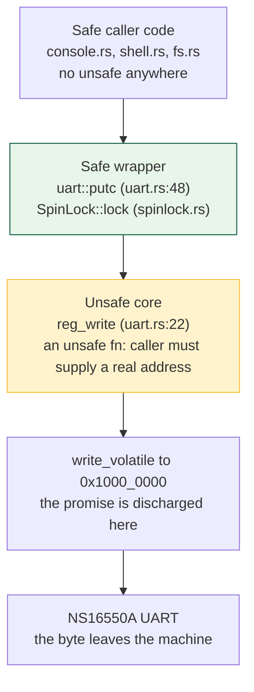
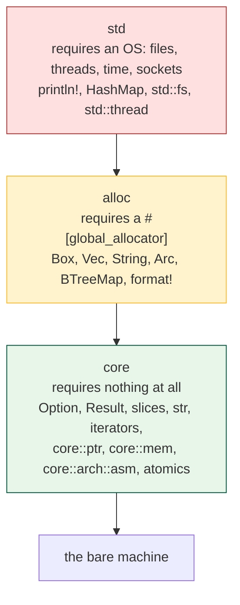

# L09 Leaving `std`: `no_std` and Bare-Metal Rust

## Overview

This is the hardest transition in the course, and we take it in one deliberate
step. Everything you have written so far ran as a process: something loaded it,
gave it a stack, called its `main`, and stood ready to catch its mistakes. From
today, nothing does. We start with **raw pointers**, the only way to name an
address Rust did not hand you, and with `unsafe` — which does not disable the
borrow checker or any other rule, but permits exactly five extra operations and
records a promise you are making. Then **volatile** access, without which
memory-mapped I/O is not merely slow but meaningless. Then the cliff itself:
`#![no_std]`, `#![no_main]`, `#[panic_handler]`, and the `core`/`alloc`/`std`
split. We finish by reading
`riscv64gc-unknown-none-elf` field by field and explaining why its
operating-system field is literally `none`. The exercises are
`21r_unsafe_bridge` and `30k_kernel_basics`, both on Friday, October 2; the
companion reference is
[Unsafe Rust and no_std](../guides/rust-unsafe-nostd.md).

## Learning Objectives

- **Distinguish** a raw pointer from a reference by the guarantees each carries
  and which operations need `unsafe`.
- **Enumerate** the five operations `unsafe` unlocks, and state what it does
  *not* change about compilation.
- **Explain** why creating a raw pointer is safe while dereferencing one is
  not, and why `.add(n)` scales by `size_of::<T>()`.
- **Predict** the machine code emitted for volatile and non-volatile device
  accesses, and name the two classic MMIO failures.
- **Describe** the `core`/`alloc`/`std` layering and what each layer demands of
  the environment beneath it.
- **Justify** every line of the `no_std` skeleton by the build error you get
  without it.
- **Decode** `riscv64gc-unknown-none-elf` field by field, including the `gc`
  extension letters.
- **Design** a safe wrapper around an unsafe core and judge whether it is
  sound.

## Prerequisites

- L03 *Ownership, Borrowing, and Lifetimes* — you must know what a reference
  guarantees to appreciate what a raw pointer does not.
- L07 *Buffers, Bytes, and Line-Oriented I/O* and exercises `10c`–`13c` (this
  week and last): the last code you write with an OS underneath you.
- L08 *RISC-V Registers and the Calling Convention*, and exercise `20a` on
  Thursday, October 1, for `extern "C"` and why layout matters to assembly.
- [RISC-V](../guides/riscv.md) for registers and ISA extension letters;
  [Memory Map](../guides/memory-map.md) for the `virt` board's address space.
- [Rust for Systems](../guides/rust-for-systems.md) for Module 1's safe Rust —
  slices, `Option`, `const fn`.

---

## 1. The Boundary Where the Type System Stops

Rust's safety claim is narrower and stronger than most people assume. It is not
"Rust programs cannot crash". It is: **a program containing no `unsafe` cannot
exhibit undefined behavior, provided the `unsafe` code beneath it is correct.**
Safe Rust is a proof, and every proof rests on axioms — here, the `unsafe`
blocks underneath.

You have relied on those axioms all semester. `Vec` is a raw pointer, a length,
and a capacity held together by `unsafe` code; the standard library is a few
thousand lines of audited `unsafe` wearing millions of lines of safe API. A
kernel is the same shape, except the unsafe core is a much larger fraction of
the whole and *you* write it.

### Why a reference cannot name the UART

On QEMU's `virt` machine the serial port's registers live at physical address
`0x1000_0000` (`memlayout.rs:17`). Storing one byte there sends that byte down
the wire. Nothing allocated that address; the board's address decoder routes
accesses in that range to the UART chip instead of to RAM.

```text
      a store instruction:  sb  a1, 0(a0)
                                   |
                              address bus
                                   |
                    +--------------+--------------+
                    |              |              |
              0x0200_0000     0x1000_0000    0x8000_0000
                 CLINT           UART           RAM
              (timer regs)   (serial port)   (128 MiB)
                    |              |              |
              a knob on a     a knob on a     a byte that
              timer chip      serial chip     remembers
```

The instruction is identical in all three cases; only the number differs. That
is **memory-mapped I/O**: the CPU has one way to reach the outside world, loads
and stores, so devices are wired into the address space.

Now try to express `0x1000_0000` as a Rust reference. You cannot. A `&mut u8`
is a compile-time-enforced claim that the compiler *knows* something: the
address is non-null, aligned, points at a live initialized `u8`, and — the
strong one — no other reference to that byte exists while this one lives. The
compiler can only claim that about memory it can account for: a `let`, a field,
an allocation it can see. It cannot account for a chip. So Rust offers a
second, humbler pointer that promises nothing.

> Key distinction: a reference is an address *plus a set of compiler-enforced
> claims*. A raw pointer is an address. Every other difference follows.

---

## 2. Raw Pointers

`*const T` and `*mut T` are Rust's raw pointers. Read `*mut u8` as one type
name — "raw pointer to a `u8` I may write through". The `*` is spelling, not an
operation.

| | `&T` / `&mut T` | `*const T` / `*mut T` |
|---|---|---|
| Guaranteed non-null | yes | no |
| Guaranteed aligned | yes | no |
| Points at live, initialized data | yes | no |
| Aliasing restricted | yes (`&mut` is unique) | no |
| Carries a lifetime | yes | no |
| Borrow checker inspects it | yes | never |
| `Copy` | `&T` yes, `&mut T` no | always |
| Creating one is safe | yes | **yes** |
| Dereferencing one is safe | yes | **no** |

The last two rows are the ones to memorize. Building a raw pointer is
arithmetic on a number, and numbers are harmless:

```rust
const UART0: usize = 0x1000_0000;             // memlayout.rs:17
let p = UART0 as *mut u8;                     // safe: nothing happened
let n: *mut Run = ptr::null_mut();            // kalloc.rs:11 — safe
let q = &end as *const u8 as usize;           // kalloc.rs:22 — safe
```

`ptr::null_mut()` spells "no pointer at all". It is a `const fn`, so it works
in a `const` initializer — which is why the free list can be a
compile-time-initialized `static mut` (`kalloc.rs:11`) and why `walk` returns
it as a failure value (`vm.rs:60`) instead of an `Option`. Test with
`.is_null()` (`kalloc.rs:42`, `vm.rs:63`).

### Arithmetic scales by the pointee

`p.add(n)` is the address `n` **elements** past `p` — not `n` bytes, unless the
element happens to be one byte. On a `*mut u8` the two coincide, which is why
the UART driver's `base.add(offset)` reads naturally. On anything else they do
not, and this is the most common pointer bug in the paging exercises:

```rust
const fn px(level: usize, va: usize) -> usize {   // vm.rs:44
    (va >> (12 + level * 9)) & 0x1ff              // an index, 0..=511
}
let pte = table.add(px(level, va));               // vm.rs:55
```

`table` is a `*mut Pte`, and `Pte` is a `#[repr(transparent)]` wrapper around a
`usize` (`vm.rs:25-27`), so one element is 8 bytes. `table.add(511)` lands at
byte offset 4088 — the last entry of a 4096-byte page table, exactly right.
Write `(table as *mut u8).add(511)` and you land 4081 bytes too early, in the
middle of another entry, and the kernel dies somewhere unrelated ten thousand
instructions later.

`.add` is itself an `unsafe fn`, for a reason worth knowing: **the result must
stay inside the same allocated object as the input.** Computing an address
outside that object is undefined behavior even if you never load or store
through it. That is *provenance* — a pointer carries an invisible tag naming
the allocation it came from. For the kernel, "the same object" usually means
"the same page" or "the same register block".

### Dereferencing

```rust
if (*pte).is_valid() { ... }             // vm.rs:56
*pte = Pte::new(page as usize, PTE_V);   // vm.rs:67
```

Rust has no `->`; `(*p).field` is the spelling, and the parentheses are
required because `.` binds tighter than `*`. Auto-deref does not apply to raw
pointers, so `p.field` will not compile — but `p.add(1)`, `p.is_null()`,
`p.read()`, and `p.write()` do: those are inherent methods *on the pointer*.

---

## 3. `unsafe`: Five Operations and a Promise

Here is the thing everyone gets wrong, stated as plainly as possible.

**`unsafe` unlocks exactly five operations:**

1. Dereference a raw pointer.
2. Call an `unsafe fn` or a function declared in an `extern` block.
3. Read or write a `static mut`.
4. Implement an `unsafe` trait.
5. Read a field of a `union`.

That list is the entire feature. In rv6 you meet #1 and #2 constantly
(`vm.rs:56`; `kalloc::kalloc()` at `vm.rs:62`, `swtch` at `swtch.rs:35`), #3 in
the allocator and console (`kalloc.rs:37`, `console.rs:20-24`), #4 twice
(`spinlock.rs:12`, `kheap.rs:22`), and #5 never.

**`unsafe` does not:**

| It does NOT | Demonstration |
|---|---|
| Disable the borrow checker | `E0499: cannot borrow as mutable more than once` fires inside `unsafe { }` exactly as outside |
| Disable lifetimes | a reference outliving its data is still a compile error |
| Disable type checking | you still need `as` casts; no implicit conversions appear |
| Turn off bounds checks | `v[i]` still panics; skipping it needs `get_unchecked`, itself unsafe |
| Make undefined behavior legal | it makes UB *possible* — the compiler stops stopping you, the rules do not change |
| Mean "this code is dangerous" | it means "I checked what the compiler cannot check" |

The second column is not rhetorical, and Problem 1 makes you prove it: take
two `&mut` borrows of the same slice *inside* an `unsafe` block and the
compiler still answers ``error[E0499]: cannot borrow `regs[_]` as mutable more
than once at a time``. `unsafe` was never a switch that turns rules off.

### The promise, and who makes it

`unsafe` is a **claim the programmer makes**, and the compiler believes it
unconditionally. The keyword comes in two halves:

- `unsafe fn f(...)` — *"calling me has a precondition; you must satisfy it."*
  `kalloc::kfree` (`kalloc.rs:34`) threads any address you hand it onto the
  free list; `vm::walk` (`vm.rs:52`) dereferences whatever you pass as `table`.
- `unsafe { ... }` — *"I have satisfied it."*

Two rules follow. If you cannot state the promise in one sentence, you do not
know whether it is true. And keep the block as small as the operation: fifty
lines inside one `unsafe` hides which line matters.

### C has all of this, invisibly

xv6, the C kernel this course descends from, contains the same free list:

```c
void kfree(void *pa) {
    struct run *r = (struct run*)pa;
    r->next = kmem.freelist;
    kmem.freelist = r;
}
```

Every line is *exactly* as unsafe as ours. C has no way to say so, so the
promise is implied everywhere and visible nowhere. Rust does not make kernel
programming safe; it makes the unsafe parts **greppable**. Ask a Rust kernel
"show me every place that could corrupt memory" and you get a finite answer. In
C the answer is "yes".

### The shape that follows: safe wrapper, unsafe core



`putc` (`uart.rs:48-51`) is safe: any code may call it with any byte and
nothing bad can happen, because the unsafe part — a store to a fixed address
this module owns — is discharged inside. A wrapper that keeps its promise for
*every possible* caller input is **sound**; one that a legal call can break is
unsound, even if no current caller breaks it.

---

## 4. Volatile: Why MMIO Without It Means Nothing

The optimizer works from one assumption about memory: **it changes only when
your program changes it.** True of RAM, false of a device. Two consequences,
both fatal.

Four functions compiled for `riscv64gc-unknown-none-elf` at `-O`.
`0x1000_0000` is the UART's transmit register; `0x1000_0005` is its line status
register, whose bit 5 the chip sets when it can accept another byte
(`uart.rs:15`).

```rust
pub unsafe fn plain_hi() { *THR = b'h'; *THR = b'i'; }
pub unsafe fn volatile_hi() { write_volatile(THR, b'h'); write_volatile(THR, b'i'); }
pub unsafe fn plain_wait() { while *LSR & 0x20 == 0 {} *THR = b'x'; }
pub unsafe fn volatile_wait() { while read_volatile(LSR) & 0x20 == 0 {} write_volatile(THR, b'x'); }
```

```asm
plain_hi:                    volatile_hi:
    lui  a0, 65536               lui  a0, 65536
    li   a1, 105                 li   a1, 104        # 'h'
    sb   a1, 0(a0)               sb   a1, 0(a0)
    ret                          li   a1, 105        # 'i'
                                 sb   a1, 0(a0)
                                 ret

plain_wait:                  volatile_wait:
    lui  a0, 65536               lui  a0, 65536
    lbu  a1, 5(a0)           .LBB3_1:
    andi a1, a1, 32              lbu  a1, 5(a0)
    bnez a1, .LBB1_2             andi a1, a1, 32
.LBB1_1:                         beqz a1, .LBB3_1
    j    .LBB1_1                 li   a1, 120
.LBB1_2:                         sb   a1, 0(a0)
    li   a1, 120                 ret
    sb   a1, 0(a0)
    ret
```

`lui a0, 65536` builds `65536 << 12 = 0x1000_0000`. Now read the differences.

**`plain_hi` emitted one store, of `'i'` (105).** The `'h'` is gone: nothing
reads `*THR` between the two writes, so the first is a dead store, and dead
stores are deleted. On real hardware you lost a character, and no tool tells
you.

**`plain_wait` reads the status register once, before the loop, and if the bit
is clear executes `j .LBB1_1` — a branch to itself, forever.** The loop body
never modified `*LSR`, so the load was hoisted out (loop-invariant code motion)
and "wait until the device is ready" became "if it was not ready at this
instant, hang". No panic, no message, no fault: the classic MMIO bug, and it
costs students an afternoon every year.

`core::ptr::read_volatile` and `core::ptr::write_volatile` declare an access
**observable**: perform it exactly once, exactly where written; do not delete,
duplicate, merge, or reorder it past another volatile access. Every MMIO touch
in rv6 goes through them — the UART (`uart.rs:19`, `uart.rs:23`), the PLIC
(`plic.rs:24-28`), the CLINT timer (`start.rs:61-62`), and the test finisher
that powers the machine off (`testdev.rs:19`).

### Reads with side effects

Deletion is not the only hazard: some device reads *do something*. The PLIC's
claim register returns the pending interrupt number **and atomically marks it
claimed** (`plic.rs:33`); a compiler that dropped that load as unused would
leave the interrupt pending forever. Volatile is not a hint about caching or
speed — the access itself is part of the program's observable behavior.

Volatile is not synchronization: it gives you no atomicity, no ordering against
*non-volatile* memory, and nothing at all between harts — that is what
`core::sync::atomic` (`spinlock.rs:5`) and the locks of exercise 37k are for.
Nor does it license a null or misaligned pointer; the address must still be
valid for `T`.

The rule is mechanical: **device register → volatile; ordinary memory → plain
dereference.** Copying a page of program image (`vm.rs:222`) uses plain
accesses and *should* be optimized hard. Marking `putc`'s store volatile is the
difference between a driver and a no-op.

---

## 5. The Cliff: `#![no_std]`

Everything above still works in a hosted Rust program. This next part does not.
`#![no_std]` (`main.rs:1`) removes the standard library and, with it, every
assumption that an operating system exists underneath you.

### The three layers



`std` is not a separate universe from `core` — it is `core` plus `alloc` plus
an OS-dependent layer, and it re-exports the lower ones. `Option` is really
`core::option::Option`; `std::ptr::write_volatile` *is*
`core::ptr::write_volatile`. That is why almost everything from Module 1
survives untouched.

What disappears is anything needing a kernel: `println!` (it needs a file
descriptor), `std::fs`, `std::thread`, `std::time` — and, surprisingly to most
people, `HashMap`, whose default hasher seeds itself from OS entropy
(`alloc`'s `BTreeMap` does not).

You will have a heap eventually, because you write it: `kheap.rs` registers a
`#[global_allocator]` (`kheap.rs:40-41`) built on the page allocator from
exercise 32k, and `extern crate alloc;` (`main.rs:26`) lights up `Box`, `Vec`,
and `Arc`. `no_std` does not forbid a heap; it refuses to invent one for you.

### The skeleton, line by line

`#![no_main]` (`main.rs:2`) removes the *entry shim*. In a hosted program the
compiler emits a hidden `main` symbol that the C runtime (`crt0`) calls after
setting up the process — argv, environment, stdio, TLS. There is no C runtime
here and no process, so the shim goes. Our entry point is whatever the linker
script names: `ENTRY(_entry)` (`kernel.ld:12`) resolves to `_entry`
(`entry.rs:18`), which the script places at the front of `.text`
(`kernel.ld:19`) so it lands exactly at `0x8000_0000` (`kernel.ld:16`).

`#[panic_handler]` is the price of admission. Every `unwrap`, every array
index, every debug-build overflow check needs somewhere to land, and `std`
normally supplies it. Without `std` the compiler demands exactly one function
of type `fn(&PanicInfo) -> !`:

```rust
#[panic_handler]                       // main.rs:281
fn panic(_info: &PanicInfo) -> ! {
    uart::puts("OSLINGS:FAIL (panic)\n");
    testdev::exit_failure(1);
}
```

The `!` return type is the **never type**: a promise that control never comes
back — the honest signature for a kernel panic. Exercise 30k's version spins;
the finished kernel prints and powers the machine off.

`#[no_mangle]` and `extern "C"` come as a pair on every symbol the outside
world touches (`entry.rs:13-18`, `start.rs:24-25`, `main.rs:96-97`).
`#[no_mangle]` keeps the symbol name verbatim so the linker script and the
assembler can find it; `extern "C"` pins the calling convention to the RISC-V C
ABI — arguments in `a0`–`a7`, return in `a0`, `s0`–`s11` callee-saved — the
contract from L08. Rust's own ABI is deliberately unspecified and may change
between compiler versions.

### Learn the errors, not the incantations

Each line of the skeleton corresponds to a build failure. Cause them once on
purpose and you never memorize the list again:

| Omission | What `rustc` says |
|---|---|
| no `#![no_std]`, bare-metal target | ``error[E0463]: can't find crate for `std` `` |
| `#![no_std]` but no panic handler | ``error: `#[panic_handler]` function required, but not found`` |
| `#![no_std]`, no `#![no_main]`, has `fn main` | ``error: using `fn main` requires the standard library`` |
| `#![no_std]`, no `#![no_main]`, no `fn main` | ``error[E0601]: `main` function not found in crate`` |
| unwinding enabled on a target that unwinds | ``error: language item required, but not found: `eh_personality` `` |

That last row needs a footnote: our target already defaults to
`panic-strategy: abort`, so you will not normally see it, and rv6 states
`panic = "abort"` in both profiles anyway (`rv6/Cargo.toml:12-16`). The
unwinder walks the stack, runs destructors, and reads DWARF tables — a
*library*, not present, and a kernel has no business unwinding out of a
fault.

---

## 6. Reading `riscv64gc-unknown-none-elf`

Every Rust build has a **target triple** (historically three fields, in
practice four): the one string that tells `rustc` which instructions to emit,
which ABI to follow, and which libraries can exist. Ours is set once in
`rv6/.cargo/config.toml:4`, so `cargo build` inside `rv6/` never needs
`--target`.

```text
     riscv64  gc      -unknown  -none    -elf
        |     |          |        |        |
        |     |          |        |        +-- environment / object format:
        |     |          |        |            bare ELF objects, no libc flavor
        |     |          |        |            (contrast: -gnu, -musl, -msvc)
        |     |          |        +----------- OPERATING SYSTEM: none.
        |     |          |                     There is no OS. You are about to be it.
        |     |          +-------------------- vendor: unspecified
        |     +------------------------------- ISA extensions: G and C
        +-------------------------------------- base ISA: 64-bit RISC-V
```

The `gc` is not decoration. `G` is shorthand for the general-purpose extension
set, `C` adds the compressed 16-bit encodings, and `rustc`'s target spec spells
it out as `+m,+a,+f,+d,+c,+zicsr,+zifencei`:

| Letter | Extension | What it gives you |
|---|---|---|
| `I` | base integer | loads, stores, branches, ALU |
| `M` | multiply/divide | `mul`, `div`, `rem` |
| `A` | atomics | `lr`/`sc`, `amoswap` — your spinlock in exercise 37k |
| `F`, `D` | single/double float | plus the `lp64d` ABI: doubles in `f` registers |
| `C` | compressed | 16-bit forms of common instructions; smaller kernels |
| `Zicsr` | CSR access | `csrr`, `csrw` — `satp`, `mstatus`, `mepc` |
| `Zifencei` | instruction fence | `fence.i`, needed after writing code into memory |

`Zicsr` deserves a moment: without CSR instructions there is no paging, no
traps, and no privilege transitions. The extension that makes an operating
system possible is a three-letter afterthought in the string.

Now the important field — ask the compiler what it believes:

```bash
$ rustc --print cfg --target riscv64gc-unknown-none-elf
panic="abort"
target_arch="riscv64"
target_endian="little"
target_env=""
target_has_atomic="64"
target_os="none"
target_pointer_width="64"
target_vendor="unknown"
```

`target_os="none"`. And notice what is *absent*: no `target_family="unix"`,
which the Linux triple has. No family, no environment, no libc — and the
target's own metadata records `"std": false`. `rustup target add
riscv64gc-unknown-none-elf` installs a compiler target plus `core` and `alloc`;
it cannot install a standard library, because there is nothing for one to stand
on.

> Key distinction: `qemu-system-riscv64` emulates a **machine** — CPU, memory,
> UART, timer, interrupt controller — and runs your kernel as the only software
> on it. `qemu-riscv64` (user-mode emulation) emulates a **process**, translating
> Linux system calls to the host. A `-none-` binary makes no system calls, so
> user-mode QEMU cannot run it even in principle; it also does not exist on
> macOS. We use `qemu-system-riscv64` exclusively (`rv6/.cargo/config.toml:13-22`),
> where `-bios none` means *we* are the firmware.

The chain is complete, and every link is chosen rather than accidental: a
target with no OS field, a linker script that puts `_entry` at the address
QEMU's reset ROM jumps to, `#![no_main]` so nothing else claims that entry
point, and a panic handler because no one above you catches a fall.

---

## 7. What You Are Signing Up For

From Thursday, October 1, `oslings` stops running `cargo test` on your laptop and
starts booting a kernel in QEMU. The failure modes change character:

| Before | After |
|---|---|
| a red test with a diff | a machine that prints nothing and never stops |
| `panic!` prints a backtrace | `panic!` prints whatever your handler prints — nothing at all before `uart::init` |
| the debugger is `println!` | the debugger is GDB on QEMU ([QEMU and GDB](../guides/qemu-gdb.md)) |
| the OS catches your bad pointer | your bad pointer *is* the OS |

What keeps this tractable is the discipline from section 3: **make the unsafe
surface small and name every promise.** rv6's `unsafe` is concentrated in the
allocator, the page-table walker, the drivers, the context switch, and the trap
path; the shell, filesystem, and scheduler bookkeeping above them are ordinary
safe Rust — the architecture Rust-for-Linux uses for drivers, and what makes a
kernel auditable at all.

Today's exercises split the cliff in half on purpose. **`21r_unsafe_bridge`**
gives you raw pointers, `unsafe`, `.add`, volatile register access, and a safe
wrapper, with `cargo test` still catching mistakes on your laptop.
**`30k_kernel_basics`** then takes `std` away: two inner attributes and a
panic handler, and the reward is a binary that compiles for
`riscv64gc-unknown-none-elf`. No QEMU yet — booting is L10.

---

## Key Concepts

| Concept | Definition | Example |
|---|---|---|
| Raw pointer | An address and a pointee type, nothing else; may be null, dangling, aliased, unaligned | `0x1000_0000 as *mut u8` |
| Reference | An address plus enforced non-null, aligned, live, and aliasing claims | `&mut [u8]` passed to a checked wrapper |
| `unsafe` block | A promise that the operations inside satisfy their preconditions | `unsafe { write_volatile(THR, c) }` (`uart.rs:23`) |
| `unsafe fn` | A function whose *caller* must establish a precondition it cannot check | `kalloc::kfree` (`kalloc.rs:34`) |
| Undefined behavior | A state the language gives no meaning to; the compiler assumes it never happens | dereferencing past the end of a page |
| Soundness | A safe API that no legal call can make cause UB | `uart::putc` (`uart.rs:48`), `SpinLock` (`spinlock.rs:12`) |
| MMIO | Device registers wired into the address space, reached by ordinary loads/stores | UART at `0x1000_0000` (`memlayout.rs:17`) |
| Volatile access | An access performed exactly once, in place, unmergeable | `read_volatile(LSR)` in the poll loop (`uart.rs:19`) |
| `core` / `alloc` / `std` | Dependency-free / needs an allocator / needs an OS | `core::ptr` always; `Vec` after `kheap.rs:40` |
| `#![no_std]` / `#![no_main]` | Drop `std` and the `main` entry shim; the linker script names the entry | `main.rs:1-2` + `kernel.ld:12` |
| `#[panic_handler]` | The one `fn(&PanicInfo) -> !` a `no_std` binary must provide | `main.rs:281` |
| Target triple | `arch-vendor-os-env`; fixes instructions, ABI, and available libraries | `riscv64gc-unknown-none-elf` (`rv6/.cargo/config.toml:4`) |

---

## Practice Problems

### Problem 1: Which lines need `unsafe`, and which error survives it?

For each numbered line, say whether it compiles; if not, name the error.

```rust
static mut TICKS: u64 = 0;

pub fn poke(regs: &mut [u8]) -> u8 {
    let base = regs.as_mut_ptr();              // 1
    let p = base.add(5);                       // 2
    unsafe {
        *p = 0x20;                             // 3
        let a = &mut regs[0];                  // 4
        let b = &mut regs[1];                  // 5
        *a = 1; *b = 2;
        TICKS += 1;                            // 6
        core::ptr::read_volatile(base)         // 7
    }
}
```

<details>
<summary>Click to reveal solution</summary>

- **1 — compiles.** Producing an address is never unsafe.
- **2 — error.** ``error[E0133]: call to unsafe function `...::add` is unsafe
  and requires unsafe function or block``. Nothing is dereferenced, yet `.add`
  is unsafe: computing an address outside the original allocation is itself UB
  (provenance). Move it inside the block.
- **3, 4 — compile.** Line 3 is permitted operation #1.
- **5 — error.** ``error[E0499]: cannot borrow `regs[_]` as mutable more than
  once at a time`` — raised *inside* the `unsafe` block. That is the whole
  point: `unsafe` unlocks five operations and changes nothing else. Borrow
  checking, lifetimes, types, and bounds checks all still run. (`split_at_mut`
  is the fix.)
- **6 — compiles**: operation #3, and a place assignment rather than a
  reference; `&mut TICKS` would trip the `static_mut_refs` lint, for which
  `addr_of_mut!` is the tool (`console.rs:24`).
- **7 — compiles**: operation #2, calling an `unsafe fn`.

Two errors. Neither is fixed by adding more `unsafe`.
</details>

### Problem 2: Pointer arithmetic in a page-table walk

The root page table sits at physical address `0x8020_3000`. `Pte` is a
`#[repr(transparent)]` newtype over `usize` (`vm.rs:25-27`), and
`px(level, va) = (va >> (12 + level*9)) & 0x1ff` (`vm.rs:44`). Take
`va = 0x3F5A_2000`.

1. Compute `px(2, va)`, `px(1, va)`, `px(0, va)`.
2. What byte address does `table.add(px(1, va))` produce, if `table` is the
   `*mut Pte` value `0x8020_3000`?
3. A student writes `(table as *mut u8).add(px(1, va))`. What address is that,
   and what goes wrong?

<details>
<summary>Click to reveal solution</summary>

`va = 0x3F5A_2000 = 0b0011_1111_0101_1010_0010_0000_0000_0000`.

1. - `px(2, va) = (va >> 30) & 0x1ff`; `va < 0x4000_0000`, so **px(2) = 0**.
   - `px(1, va) = (va >> 21) & 0x1ff = 506 = 0x1FA`
     (`0x3F5A_2000 / 0x20_0000 = 506.8…` → 506).
   - `px(0, va) = (va >> 12) & 0x1ff = 0x3F5A2 & 0x1FF = 0x1A2 = 418`.

2. `Pte` is transparent over `usize`, so `size_of::<Pte>() == 8` and
   `.add(506)` advances `506 * 8 = 4048 = 0xFD0` bytes:
   **`0x8020_3000 + 0xFD0 = 0x8020_3FD0`** — still inside the same 4096-byte
   page, as every index 0..=511 must be.

3. `*mut u8` scales by 1, giving `0x8020_31FA`: not 8-byte aligned, straddling
   entries 63 and 64. Reads assemble a value from two unrelated PTEs; writes
   corrupt both. It compiles cleanly, faults nowhere, and detonates later during
   an unrelated translation.
</details>

### Problem 3: Read the compiler output

A student's UART transmit path, at `-O`:

```asm
plain_wait:
    lui  a0, 65536
    lbu  a1, 5(a0)
    andi a1, a1, 32
    bnez a1, .LBB1_2
.LBB1_1:
    j    .LBB1_1
.LBB1_2:
    li   a1, 120
    sb   a1, 0(a0)
    ret
```

1. What address is `a0`, and what was the source loop?
2. What transformation did the compiler apply, and was it legal?
3. What happens in QEMU, and why does the same code sometimes "work" in a debug
   build?

<details>
<summary>Click to reveal solution</summary>

1. `lui a0, 65536` puts `65536 << 12 = 0x1000_0000` in `a0` — the UART base.
   `lbu a1, 5(a0)` reads the Line Status Register at offset 5 (`uart.rs:12`);
   `andi a1, a1, 32` tests bit 5, `LSR_THRE` (`uart.rs:15`). The source was
   `while *LSR & 0x20 == 0 {}` then `*THR = b'x'` (120 = `'x'`), written with
   plain dereferences instead of `read_volatile`/`write_volatile`.

2. **Loop-invariant code motion.** Nothing in the loop writes `*LSR`, so the
   value cannot change under the compiler's memory model; the load was hoisted
   above the loop, which degenerated into `j .LBB1_1`. Entirely legal — the
   program never said this memory is observable. Not a compiler bug, a missing
   `volatile`.

3. If the chip is ready at the first read it prints and continues; otherwise
   the kernel hangs forever with no output, no panic, and no fault. A debug
   build often "works" because LICM does not run at `-O0` — a heisenbug that
   vanishes under the debugger and returns in release.
</details>

### Problem 4: Find the unsound wrapper

This safe function is meant to be the checked boundary around an unsafe core.
It compiles and passes a test that writes offsets `0..regs.len()`.

```rust
pub fn write_reg_at(regs: &mut [u8], offset: usize, value: u8) -> bool {
    let base = regs.as_mut_ptr();
    unsafe { core::ptr::write_volatile(base.add(offset), value); }
    if offset > regs.len() {
        return false;
    }
    true
}
```

Name every defect, and say why it is *unsound* rather than merely buggy.

<details>
<summary>Click to reveal solution</summary>

Three defects:

1. **The check happens after the write.** By the time `offset > regs.len()` is
   evaluated the store has landed. Ordering is the entire content of a bounds
   check.
2. **Off-by-one.** Valid indices are `0..regs.len()`, so the test must be
   `offset >= regs.len()`; with `>`, `offset == len` writes one byte past the
   end.
3. **`base.add(offset)` is UB before the store executes** when `offset` leaves
   the slice's allocation. Computing the address is already the violation.

Why *unsound*: a safe function promises that **no** call from safe code can
cause undefined behavior. `write_reg_at(&mut buf, 9_999_999, 0)` is legal safe
Rust with no `unsafe` in the caller's file, and it produces a wild store — the
unsafety escaped the module that promised to contain it. A sound version checks
first and returns early:

```rust
pub fn write_reg_at(regs: &mut [u8], offset: usize, value: u8) -> bool {
    if offset >= regs.len() { return false; }
    unsafe { core::ptr::write_volatile(regs.as_mut_ptr().add(offset), value); }
    true
}
```

Now the promise fits in one sentence: "`offset` is less than the length of a
slice I hold `&mut` to, so `base.add(offset)` is inside that allocation and
writable."
</details>

### Problem 5: Interrogate the target

Answer from the triple and the compiler's output, not from memory.

1. What do `g` and `c` expand to in `riscv64gc`, and which single extension
   makes paging and trap handling possible at all?
2. Why can `rustup target add riscv64gc-unknown-none-elf` never give you `std`,
   and what does the missing `target_family="unix"` line mean for a dependency
   full of `#[cfg(unix)]` code?
3. A student runs `qemu-riscv64 target/riscv64gc-unknown-none-elf/debug/rv6`.
   Give two independent reasons it cannot work.

<details>
<summary>Click to reveal solution</summary>

1. `g` = the general-purpose set — **I** + **M** + **A** + **F**/**D**, plus
   **Zicsr** and **Zifencei** by modern convention; `c` = the compressed 16-bit
   encodings. `rustc`'s spec lists exactly `+m,+a,+f,+d,+c,+zicsr,+zifencei`.
   **Zicsr** is the one that matters: without CSR instructions you cannot touch
   `satp`, `stvec`, `mstatus`, or `mepc` — no paging, no traps, no privilege
   transitions, no OS.

2. `std` is defined by what it calls: file descriptors, `mmap`, threads,
   clocks. No kernel beneath this target answers those calls — the OS field is
   `none` — so `rustup` ships `core` and `alloc` and the metadata records
   `"std": false`. Likewise `#[cfg(unix)]` is false here, so code inside such a
   block is not compiled at all; crates that gate their whole implementation on
   `unix`/`windows` compile to nothing useful, which is why rv6's
   `[dependencies]` is empty.

3. (i) `qemu-riscv64` is *user-mode* emulation: it emulates a Linux process and
   translates guest Linux syscalls to the host. A `-none-` binary makes no
   syscalls; it expects to own a machine, execute `csrw`, and store to
   `0x1000_0000`. (ii) It is not a Linux executable at all — no interpreter, no
   `main`, an entry point fixed at `0x8000_0000` by a linker script, privileged
   instructions in machine mode. Practically, `qemu-riscv64` also does not exist
   on macOS. The right tool is `qemu-system-riscv64 -machine virt -bios none
   -kernel …` (`rv6/.cargo/config.toml:13-22`).
</details>

---

## Further Reading

- [Unsafe Rust and no_std](../guides/rust-unsafe-nostd.md) — the reference
  version of this lecture, with every rv6 citation in one place.
- [Rust for Systems](../guides/rust-for-systems.md) — the safe-Rust half.
- [Memory Map](../guides/memory-map.md) — the `virt` board's physical address
  space, and why the kernel lives at `0x8000_0000`.
- [RISC-V](../guides/riscv.md) — registers, CSRs, and the extension letters.
- [rv6 Architecture](../guides/rv6-architecture.md) — which exercise builds what.
- [QEMU and GDB](../guides/qemu-gdb.md) — the debugging you need once `println!`
  is gone.
- [Using OSlings](../guides/oslings-usage.md) — `oslings run`, `watch`, `hint`.
- [The Rustonomicon](https://doc.rust-lang.org/nomicon/) — the book about
  unsafe Rust; chapters 1–3 are today's.
- [Behavior considered undefined](https://doc.rust-lang.org/reference/behavior-considered-undefined.html)
  — the normative list. Short, and worth reading in full once.
- [The Embedded Rust Book](https://docs.rust-embedded.org/book/) — `no_std`
  from the microcontroller side.
- [A Freestanding Rust Binary](https://os.phil-opp.com/freestanding-rust-binary/)
  — the same cliff on x86-64.
- [Rust platform support](https://doc.rust-lang.org/rustc/platform-support.html)
  — every triple, with tier and `std` availability.
- [QEMU `virt` machine](https://www.qemu.org/docs/master/system/riscv/virt.html).
- [xv6: a simple, Unix-like teaching OS](https://pdos.csail.mit.edu/6.828/2023/xv6/book-riscv-rev3.pdf)
  — the C ancestor of rv6; compare its `kalloc.c` with ours.
- [Rust in the Linux kernel](https://docs.kernel.org/rust/index.html) — the
  same architecture at production scale.

---

## Summary

1. **Safe Rust is a proof resting on unsafe axioms.** Safe code cannot cause
   undefined behavior *given a correct unsafe core*. `Vec` and `String` work
   this way; a kernel is the same shape, except you write the core.
2. **A raw pointer is an address; a reference is an address plus enforced
   claims.** `*const T`/`*mut T` may be null, dangling, unaligned, and aliased,
   carry no lifetime, and are invisible to the borrow checker — exactly why they
   can name a UART and a reference cannot.
3. **Creating a pointer is safe; using one is not.** Dereferencing needs
   `unsafe`, and so does `.add()`, because computing an address outside the
   original allocation is itself UB. `.add(n)` scales by `size_of::<T>()`: 8
   bytes per step on a `*mut Pte`.
4. **`unsafe` permits five operations and changes nothing else.** Deref a raw
   pointer, call an `unsafe fn`, touch a `static mut`, implement an `unsafe`
   trait, read a `union` field. Borrow checking, lifetimes, types, and bounds
   checks still run inside the block; `E0499` fires there as outside.
5. **`unsafe` is a promise, not a switch.** `unsafe fn` says "the caller owes
   me a precondition"; `unsafe { }` says "I paid it". Keep blocks small, state
   the promise in one sentence, wrap the core in a *sound* safe API.
6. **MMIO without `volatile` is meaningless, not merely slow.** At `-O` the
   compiler deletes a store nothing reads and hoists a load nothing writes: two
   plain stores to the UART emit one instruction, and a plain polling loop
   compiles to `j` to itself. Device register → volatile; memory → plain
   dereference.
7. **`#![no_std]` removes everything that assumed an OS.** You keep `core`,
   lose `println!`, files, threads, and `HashMap`, and get `alloc` back only
   after registering a `#[global_allocator]` (`kheap.rs:40`). `#![no_main]`
   drops the C-runtime entry shim, the linker script names `_entry`, and
   `#[panic_handler]` is mandatory because panics must land somewhere.
8. **`riscv64gc-unknown-none-elf` says it out loud.** 64-bit RISC-V with
   `IMAFD`+`C`+`Zicsr`+`Zifencei`, unspecified vendor, ELF objects, and an OS
   field of `none` — no `target_family`, no libc, no prebuilt `std`. That field
   is empty because you are about to be the thing that fills it. Today:
   `21r_unsafe_bridge`, then `30k_kernel_basics`.
