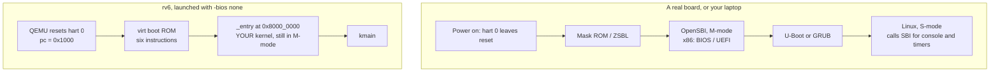
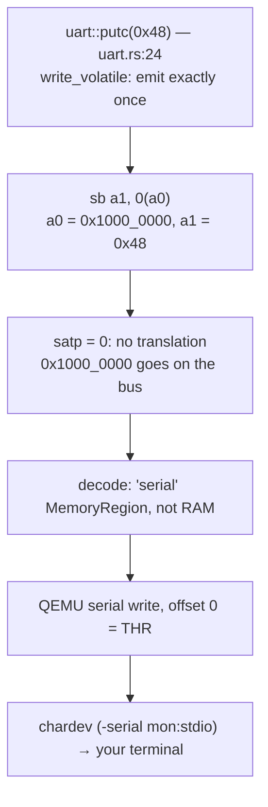
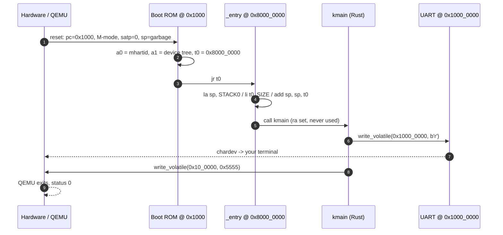

# Boot: From Reset to `kmain`

## Overview

Everything you have written so far ran on top of an operating system. Today the
floor disappears. We start at the instant a RISC-V hart leaves reset — one
program counter, thirty-one registers holding nothing useful, no stack, no
allocator, no `println!` — and follow the machine forward until Rust code is
running and a character appears on your terminal. Along the way we read QEMU's
six-instruction boot ROM, take `rv6/kernel.ld` apart to see how `_entry` is
guaranteed to land at `0x8000_0000`, work out why the first thing any kernel
does is set a stack pointer in assembly, and trace one byte from a
`write_volatile` through the NS16550A UART onto the screen. This session unlocks
**00_rust_kernel_basics** and **01_boot**; the companion references are the
[Memory Map](../guides/memory-map.md) and [RISC-V](../guides/riscv.md) guides.

## Learning Objectives

- **Describe** a RISC-V hart's state at reset, and name what is *not* initialized.
- **Explain** what firmware does on a RISC-V or x86 machine, and what `-bios none` removes.
- **Decode** QEMU's six-instruction `virt` boot ROM and state the values left in `a0`, `a1`, `t0`.
- **Read** `kernel.ld` and justify `ENTRY`, `. = 0x80000000`, `*(.entry)`, `etext`, and `end`.
- **Derive** `sp` after `_entry` runs, given a built kernel's symbol table.
- **Trace** one byte from `write_volatile` through MMIO dispatch to the terminal.
- **Locate** UART0, CLINT, PLIC, the test finisher, and RAM on the `virt` map.
- **Predict** the failure of a kernel with no stack pointer, and of a non-`volatile` MMIO write.

## Prerequisites

- **L08 RISC-V Registers and the Calling Convention** — `sp`, `ra`, `t0`, and why a prologue needs a stack.
- **L09 Leaving `std`** and exercise `r09_unsafe_bridge` — `#![no_std]`, raw pointers, `write_volatile`.
- **Exercise `a00_asm_bridge`** — RISC-V assembly called from Rust.
- [Unsafe Rust and no_std](../guides/rust-unsafe-nostd.md) — raw pointers and volatile access.
- [RISC-V](../guides/riscv.md) — "Registers" and "Privilege modes".
- [Memory Map](../guides/memory-map.md) — this lecture is the narrative; that guide is the lookup table.

---

## 1. The Machine at Reset

A CPU fresh out of reset is a much smaller machine than the one you are used to.
Ask QEMU to stop before executing anything (`-S`) and dump the registers; this
is the entire state that matters:

```text
 pc       0000000000001000
 mhartid  0000000000000000
 mstatus  0000000a00000000        <- MPP = 0, we are in MACHINE mode
 mtvec    0000000000000000        <- no trap handler installed
 satp     0000000000000000        <- paging OFF; addresses are physical
 x1/ra    0000000000000000
 x2/sp    0000000000000000        <- NOT a stack
 ... all 31 general registers zero ...
```

Four facts there govern what follows.

**The program counter starts at `0x1000`, not at your code.** The reset vector is
a property of the board; on `virt` it is the base of a small read-only region
QEMU calls `riscv_virt_board.mrom`.

**We are in machine mode.** Of RISC-V's three privilege modes — machine (M),
supervisor (S), user (U) — M is the most privileged and the only one that exists
at reset. rv6 stays there until exercise 13, when `start.rs` uses `mret` to drop
into S-mode so the MMU can take effect (`start.rs:54`).

**Paging is off.** `satp = 0` selects Bare mode: every address reaches the bus
untranslated. Virtual addresses do not exist until exercise 03.

**`sp` is not a stack pointer.** QEMU zeroes the general registers; real silicon
usually does not bother, and you get whatever the flip-flops powered up holding.
Either way the value is meaningless — and that is why `_entry` must be assembly.

> Key distinction: QEMU zeroing the registers is a *convenience of the
> emulator*, not a guarantee. The RISC-V privileged spec leaves the general
> registers unspecified at reset, so never write boot code that depends on one
> starting at zero — `sp` least of all.

Notice what is missing: no allocator, no interrupt handler, no notion of a
"process", and on real hardware not even working RAM until a DRAM controller is
programmed. QEMU hands you RAM for free — one of several ways it is kinder than
a board.

---

## 2. Firmware, and What `-bios none` Deletes

On any machine you have used, a great deal of software runs before the
operating system, and the layering is similar across architectures.



Those layers solve real problems. Mask ROM cannot be updated, so it is kept
tiny. **OpenSBI** is the RISC-V analogue of a BIOS: resident in M-mode, offering
the *Supervisor Binary Interface* — `ecall` services for console output, timers,
and reset — so an S-mode kernel need not know which UART this board has. A
bootloader then finds a kernel image on storage.

`-bios none` deletes all of it. QEMU loads the `-kernel` ELF straight into RAM
at the addresses in its program headers, and the reset vector points at RAM
base. **Your kernel is the firmware.** No SBI, so `putc` cannot be an `ecall` —
it must be a store to a device register. No bootloader, so nothing relocates
you. And you start in machine mode, because no M-mode resident dropped you
down.

Here is the whole boot ROM, disassembled straight out of the QEMU monitor:

```asm
0x1000:  auipc  t0, 0            # t0 = 0x1000
0x1004:  addi   a2, t0, 40       # a2 = 0x1028, the fw_dynamic info struct
0x1008:  csrr   a0, mhartid      # a0 = 0  (which hart am I?)
0x100c:  ld     a1, 32(t0)       # a1 = [0x1020] = 0x87e0_0000, the device tree
0x1010:  ld     t0, 24(t0)       # t0 = [0x1018] = 0x8000_0000
0x1014:  jr     t0               # go
```

Six instructions: the entire boot process of this course. Both loaded constants
are data QEMU patched into the ROM at startup — the jump target (`0x8000_0000`,
because `-bios none` points it at RAM base) and the address of the **device tree
blob**, a serialized description of the board dropped two megabytes below
`PHYSTOP`. By RISC-V convention `a0` holds the hart ID and `a1` the DTB pointer
when control reaches the kernel; Linux discovers its memory map from it. **rv6
ignores `a1`** and hardcodes `memlayout.rs` instead — a fair trade for a kernel
targeting one board, and exactly why it would not boot on a different one.

> Key distinction: `-bios none` means "no firmware", not "no boot ROM". The six
> instructions above always run; what is gone is OpenSBI and the bootloader, tens
> of thousands of instructions that would otherwise execute before you.

---

## 3. The Address Space of the `virt` Board

Paging is off and there is no firmware, so the addresses your kernel emits go
straight onto the board's bus. RAM and devices share one flat address space, and
which range means what is fixed by the board. This is **memory-mapped I/O**: a load
or store in a device's range is not a memory access — it operates the device.

```text
 0x0000_1000  +------------------------------------------+
              |  boot ROM (mrom) — 6 instructions          |  reset vector
 0x0010_0000  |  SiFive test finisher                      |  testdev.rs:11
 0x0200_0000  |  CLINT: software interrupts                |
 0x0200_4000  |  CLINT: mtime @ +0xBFF8, mtimecmp @ +0x4000|  start.rs:17-18
 0x0c00_0000  |  PLIC — device interrupt router, 6 MiB     |  memlayout.rs:26
 0x1000_0000  |  NS16550A UART, 8 bytes                    |  memlayout.rs:17
 0x1000_1000  |  virtio-mmio, pflash, PCIe ECAM  (unused)  |
              |                                            |
 0x8000_0000  +===========================================+  KERNBASE
              |  R A M   (-m 128M)                         |
              |    kernel image: .text .rodata .data .bss  |
              |    'end' -> everything above is free       |
              |    device tree blob at 0x87e0_0000         |
 0x8800_0000  +===========================================+  PHYSTOP
```

The [Memory Map](../guides/memory-map.md) guide shows the `info mtree -f`
command that produced this. Five regions matter to rv6:

| Region | Base | What it is | rv6 |
|---|---|---|---|
| Test finisher | `0x0010_0000` | write a magic word, QEMU exits | ex 01, `testdev.rs` |
| CLINT | `0x0200_0000` | core-local interruptor: `mtime`, `mtimecmp` | ex 14, `start.rs:17` |
| PLIC | `0x0c00_0000` | routes device IRQs to a hart | ex 15, `plic.rs` |
| UART0 | `0x1000_0000` | NS16550A serial port, 8 registers | ex 01, `uart.rs` |
| RAM | `0x8000_0000` | 128 MiB, `KERNBASE`..`PHYSTOP` | everywhere |

CLINT versus PLIC confuses people every year. The **CLINT is inside the CPU's
world**: it drives the timer that interrupts *this* hart and speaks only machine
mode. The **PLIC is outside**: it collects peripheral interrupt lines — the UART
is source 10 (`plic.rs:14`) — and delivers them to a hart's privilege context.
Timer ticks come from the CLINT; "a key was pressed" comes through the PLIC.

Which answers the question: **why is the kernel at `0x8000_0000`?** Everything
below it is device space or ROM; RAM begins there and nowhere else, so that is
the ROM's jump target, so that is where the kernel's first instruction must be.
`memlayout.rs:11` names it `KERNBASE`; `kernel.ld:16` obeys it.

---

## 4. `kernel.ld`, Line by Line

The linker assigns every byte of your program an address, using rules meant for
user programs under an operating system — exactly wrong here.
`rv6/kernel.ld` overrides them in about twenty lines, and you should be able to
justify every one.

```text
OUTPUT_ARCH( "riscv" )
ENTRY( _entry )              /* kernel.ld:12 */

SECTIONS
{
  . = 0x80000000;            /* kernel.ld:16 */

  .text : {
    *(.entry)                /* kernel.ld:19  <- the trick */
    *(.text .text.*)
    . = ALIGN(0x1000);
    PROVIDE(etext = .);      /* kernel.ld:22 */
  }
  .rodata : { . = ALIGN(16); *(.srodata .srodata.*) *(.rodata .rodata.*) }
  .data   : { . = ALIGN(16); *(.sdata   .sdata.*)   *(.data   .data.*)   }
  .bss    : { . = ALIGN(16); *(.sbss    .sbss.*)    *(.bss    .bss.*)    }

  PROVIDE(end = .);          /* kernel.ld:43 */
}
```

**`ENTRY(_entry)`** writes `_entry`'s address into the ELF header's entry-point
field. Be precise about what that does *not* do: QEMU's boot ROM never reads
that field — it jumps to `0x8000_0000` unconditionally. The two agree only
because of `kernel.ld:19`.

**`. = 0x80000000`** sets the *location counter*, the linker's placement cursor.
Change this line and your kernel is unbootable, because the ROM's jump target
does not change with it.

**`*(.entry)` first inside `.text`** is what makes the whole scheme work.
`.entry` is a section name nothing in Rust's output claims; `entry.rs:11` puts
exactly one function into it. Because the script lists `*(.entry)` before
`*(.text .text.*)`, `_entry` lands at offset 0 of `.text` — `0x8000_0000`.
Delete that line and the linker orders functions as it pleases: `0x8000_0000`
holds an arbitrary Rust function, entered with a garbage stack pointer, and the
kernel dies silently.

**`. = ALIGN(0x1000); PROVIDE(etext = .);`** rounds up to a 4 KiB boundary and
names that address. The alignment matters because `etext` is meant to be a
page-table boundary — code read-execute, everything above read-write — and
permissions are granted a page at a time. rv6 does not use it yet, so `nm` will
not show the symbol: `PROVIDE` emits one only if something references it.

**`PROVIDE(end = .)`** sits after `.bss`, past every byte of the image — the
*linker-computed* answer to "where does my kernel stop?", a question with no
compile-time answer because it moves whenever you add a function. Exercise 02's
allocator reads it:

```rust
extern "C" {
    static end: u8;                          // kalloc.rs:14
}

pub unsafe fn init() {
    let start = &end as *const u8 as usize;  // kalloc.rs:22
    free_range(start, PHYSTOP);              // kalloc.rs:23
}
```

`static end: u8` declares a *byte* whose value is meaningless — the allocator
wants its *address*. Declaring an `extern` object, taking its address, and never
reading it is how you reach a linker symbol from a high-level language.

A real build produces:

```text
Section     Address       Size      Note
.text       0x8000_0000   0x1000    _entry at offset 0; etext would be 0x8000_1000
.rodata     0x8000_1000   0x022e    string literals
.eh_frame   0x8000_1230   0x0058    the linker placed this; the script never named it
.data       0x8000_1288   0x0008
.bss        0x8000_1290   0x4000    all of it is STACK0
                                    -> end = 0x8000_5290
```

`.text` is exactly `0x1000` bytes because of the `ALIGN` on `kernel.ld:21`. More
instructive: **`.eh_frame` is there although the script never mentioned it.** A
linker script does not restrict output to the sections it names; anything
unclaimed is placed by the linker's own rules. That is why you read `end` at
runtime instead of computing "`.bss` start plus size" — right today, wrong after
any change that pulls in a new section.

---

## 5. `_entry`: the First Twenty Bytes

`0x8000_0000` holds `_entry`; `sp` holds garbage. Together those are booting's
central chicken-and-egg problem, because every function Rust compiles begins
with a *prologue* that carves out space and saves `ra`:

```asm
kmain:
    add  sp, sp, -32        # carve 32 bytes off the stack
    sd   ra, 24(sp)         # save the return address there
```

Both instructions dereference `sp`, so a garbage `sp` means the first Rust
instruction stores to a garbage address — and you cannot fix that from inside
Rust, because the fix would itself have a prologue. **The stack must be
established by code that does not use a stack**, written by hand:

```rust
const STACK_SIZE: usize = 4096 * 4;                 // entry.rs:5

#[no_mangle]
static mut STACK0: [u8; STACK_SIZE] = [0; STACK_SIZE];   // entry.rs:8

#[no_mangle]
#[link_section = ".entry"]                          // entry.rs:11
pub unsafe extern "C" fn _entry() -> ! {
    asm!(
        "la sp, {stack}",     // sp = bottom of our stack
        "li t0, {size}",      // t0 = stack size
        "add sp, sp, t0",     // sp = top of stack (it grows downward)
        "call kmain",         // enter Rust; never returns
        stack = sym STACK0,
        size = const STACK_SIZE,
        options(noreturn),
    );
}
```

The stack is a plain 16 KiB array in `.bss`. A stack is just a region of memory
plus a register pointing into it, and we choose both.

```text
   high addresses
   0x8000_5290  +---------------------+  <- sp starts HERE (STACK0 + 0x4000)
                |                     |     also == 'end' in this build
                |   16 KiB of         |
                |   kernel stack      |     sp moves DOWN as calls nest
                |                     |
   0x8000_1290  +---------------------+  <- STACK0, symbol address
   low addresses
```

`la sp, STACK0` puts the array's *lowest* address into `sp`. But stacks grow
downward, so starting there means the first push writes *below* the array; the
`li`/`add` pair moves `sp` one byte past the top, where a downward-growing stack
must start.

All four lines are pseudo-instructions. Disassembled from the built kernel:

```asm
0000000080000000 <_entry>:
    80000000:  00001117    auipc  sp, 0x1
    80000004:  29010113    add    sp, sp, 656      # sp = 0x80001290 <STACK0>
    80000008:  6291        lui    t0, 0x4          # t0 = 0x4000 = 16384
    8000000a:  9116        add    sp, sp, t0       # sp = 0x80005290
    8000000c:  00000097    auipc  ra, 0x0
    80000010:  20e080e7    jalr   526(ra)          # -> 0x8000021a <kmain>
```

Four pseudo-instructions became six machine instructions in twenty bytes. `la`
is `auipc` plus `add`, because RISC-V has no 64-bit immediate. `li t0, 16384`
collapsed to one compressed `lui`, since 16384 is `4 << 12`. `call` is `auipc`
plus `jalr`, leaving a return address in `ra` that `kmain`, declared `-> !`,
never uses.

> Key distinction: `_entry` is not a normal function even though it is spelled
> like one. It never returns, has no prologue, is entered by a hardware jump
> rather than a `call`, and its body is entirely `asm!`. The `unsafe extern "C"
> fn` wrapper exists only so Rust emits a symbol with the right name and
> section.

### What happens if you skip it

This is the failure mode you will hit. Delete the three stack
instructions, leaving only `call kmain`. It builds cleanly; QEMU prints
**nothing** and hangs. Break in:

```text
 pc       0000000000000000
 mcause   0000000000000001        <- instruction access fault
 mtval    0000000000000000
 mtvec    0000000000000000
 x1/ra    0000000080000008        <- we did reach kmain
 x2/sp    fffffffffffffff0        <- 0 + (-16)
```

Follow the chain. `sp` started at 0; `kmain`'s prologue computed `sp - 16`,
wrapping to `0xffff_ffff_ffff_fff0`; the store there raised a store access
fault; the hardware jumped to `mtvec`, still `0`. Fetching from address 0 raises
an *instruction* access fault whose handler is also address 0 — a trap loop the
machine can never leave. Nothing prints because the fault preceded the first
`putc`; nothing crashes because there is no one to crash *to*. **A silent hang
and an OSlings timeout is the signature of a broken stack pointer**, diagnosed
by exactly the dump above — which is why
[QEMU and GDB](../guides/qemu-gdb.md) is a guide.

---

## 6. One Byte to the Screen: the NS16550A

You are about to print with no operating system, C library, file descriptor, or
system call. Every line of code involved:

```rust
const UART0: *mut u8 = 0x1000_0000 as *mut u8;   // uart.rs:15

pub fn putc(c: u8) {
    unsafe { write_volatile(UART0, c); }         // uart.rs:24
}
```

Storing a byte to `0x1000_0000` makes a character appear.

### What is actually there

The device is an **NS16550A**, descended from National Semiconductor's 8250 —
the UART on the 1981 IBM PC. The 16550 added a 16-byte FIFO whose first revision
was famously broken; the **16550A** fixed it, and that part number became the
universal serial-port interface. PC serial ports, embedded debug consoles, and
QEMU's `virt` machine all present the same eight one-byte registers forty years
later, at `0x1000_0000`–`0x1000_0007`.

| Offset | On write | On read | rv6 |
|---|---|---|---|
| +0 | THR — transmit holding | RBR — receive buffer | `uart.rs:6-7` |
| +1 | IER — interrupt enable | IER | `uart.rs:8` |
| +2 | FCR — FIFO control | IIR — interrupt ident | `uart.rs:9` |
| +3 | LCR — line control (word size, parity, DLAB) | LCR | `uart.rs:10` |
| +4 | MCR — modem control (bit 4 = loopback) | MCR | `uart.rs:11` |
| +5 | — | LSR — line status | `uart.rs:12` |
| +6 | — | MSR — modem status | unused |
| +7 | scratch | scratch | unused |

Two LSR bits carry the whole polled driver: bit 0 (`LSR_DR`, `uart.rs:14`) means
a byte waits in RBR; bit 5 (`LSR_THRE`, `uart.rs:15`) means the transmit register
is empty. Exercise 11's driver spins on THRE before every store
(`uart.rs:49-50`); exercise 01's does not, and gets away with it only because
QEMU's emulated UART is infinitely fast.

> Key distinction: the same offset is two different registers depending on
> direction — `+0` written is the transmitter, `+0` read is the receiver. That is
> how the physical chip is wired, and why `RBR` and `THR` are both `0`.

### Following the byte



The third step is the one to dwell on. Because `satp` is zero, the address the
instruction produced *is* the address on the bus: no page table, no fault
possible. Once exercise 03 turns on Sv39 that stops being automatic — the UART page
must be explicitly mapped or the very same store faults, which is why
`memlayout.rs:17` exists. On real hardware a bus fabric routes the address to the
chip, which shifts the byte out one bit at a time at the configured baud rate.

### Why `volatile` is not optional

This is the most important line in `uart.rs`, easier to believe once you have seen it
fail. Replace `write_volatile(UART0, c)` with a plain `*UART0 = c` and
build with optimizations. The compiler analyses
`puts("\nrv6 is booting...\nOSLINGS:PASS\n")`, sees thirty-one stores to one
address with no intervening read, decides thirty are dead, and emits:

```asm
0000000080000016 <kmain>:
    80000016:  lui   a0, 0x10000       # a0 = 0x1000_0000
    8000001a:  li    a1, 10            # a1 = '\n'   <- the LAST byte only
    8000001e:  ...
    80000026:  sb    a1, 0(a0)         # one store. thirty were deleted.
    8000002a:  sw    a2, 0(a3)         # test finisher: 0x5555
```

Run it and the terminal receives exactly one byte: a newline. The optimization is
correct under the abstract machine Rust and C are defined against, where a store
you never read is unobservable. It is catastrophic here because the store *is*
the observable event. `write_volatile` says this location is not memory: perform
every access, in program order, exactly as written.

> Key distinction: `volatile` constrains the *compiler*, not the *hardware*. It
> guarantees the instruction is emitted; it says nothing about caches, store
> buffers, or the order another hart observes. Cross-hart ordering needs fences,
> which arrive with spinlocks in exercise 07.

---

## 7. Stopping the Machine, and What Comes Next

A user program ends by returning from `main`; the C runtime calls `exit` and the
kernel reclaims everything. A kernel has nowhere to return to, which is why
`kmain` and the panic handler are both `-> !`. But a grader needs the run to
*end* with a verdict, so `virt` provides the **SiFive test finisher** at
`0x0010_0000`:

```rust
const TEST_FINISHER: *mut u32 = 0x10_0000 as *mut u32;   // testdev.rs:11
const FINISHER_PASS: u32 = 0x5555;                       // testdev.rs:13
const FINISHER_FAIL: u32 = 0x3333;                       // testdev.rs:14

pub fn exit_failure(code: u16) -> ! {
    unsafe { write_volatile(TEST_FINISHER, FINISHER_FAIL | ((code as u32) << 16)); }
    loop { core::hint::spin_loop(); }                    // testdev.rs:30-33
}
```

Write `0x5555` and QEMU exits with status 0; `0x3333` exits non-zero, with the
word's upper sixteen bits folded into the status so a kernel can report *which*
failure. Note the `loop` after each write: if the device failed to stop the machine,
execution must not fall off the end of a `-> !` function.

This is a QEMU-and-SiFive convention: x86 kernels power off through ACPI, a real
RISC-V system calls the SBI system-reset extension, and on hardware with
neither, `wfi` in a loop is the closest thing to "stop". The finisher is what
lets `oslings run 01_boot` capture serial output and get a real exit status back.

The whole session:



Everything after today elaborates this diagram. Exercise 02 reads `end` and turns
the RAM above it into a free list. Exercise 03 builds Sv39 page tables and turns
`satp` on, after which the UART store works only because you mapped it. Exercise
13 inserts `start.rs` between `_entry` and `kmain`, dropping the kernel into
supervisor mode via `mret`. Exercise 14 programs the CLINT for a heartbeat;
exercise 15 wires the PLIC and makes the console interrupt-driven.

**Compared with xv6**, rv6's boot is deliberately shorter: xv6-riscv boots under
OpenSBI, starts every hart, and gives each a stack slice, while rv6 uses `-smp 1`
and one `STACK0` — removing a whole class of concurrency bugs from the first six
weeks. **Compared with Linux**, the difference is scale rather than kind:
RISC-V's `head.S` also sets `sp` to a statically allocated `init_thread_union`
before calling C, then relocates itself, parses the DTB, enables paging with a
temporary map, and calls `start_kernel`. Your twenty bytes do the job of the
first page of `head.S`.

---

## Key Concepts

| Concept | Definition | Example |
|---|---|---|
| Reset state | Architectural state at reset; most of it is unspecified. `pc` holds the board-fixed reset vector | `pc = 0x1000`, M-mode, `satp = 0`, `sp` meaningless |
| Firmware / SBI | Resident M-mode software offering services to S-mode | OpenSBI; deleted by `-bios none` |
| `-bios none` | Load the `-kernel` ELF into RAM, point the reset vector at RAM base | rv6 starts in M-mode, no SBI |
| Device tree blob | Serialized hardware description passed in `a1` | `0x87e0_0000`; rv6 ignores it, Linux parses it |
| Entry symbol | The name the linker records as the first instruction | `ENTRY(_entry)`, `kernel.ld:12` |
| Location counter | The linker's cursor while assigning addresses | `. = 0x80000000`, `kernel.ld:16` |
| `.entry` section | A section nothing else claims, placed first | `#[link_section = ".entry"]`, `entry.rs:11` |
| `end` symbol | Linker-computed first address past the kernel image | `kalloc.rs:14`; `0x8000_5290` here |
| Trampoline | Assembly stub bridging two execution environments | `_entry`: bare hart → Rust with a valid `sp` |
| MMIO | Device registers mapped into the physical address space | A store to `0x1000_0000` transmits a byte |
| Volatile access | Access the compiler must emit exactly as written | `write_volatile(UART0, c)`, `uart.rs:24` |
| Test finisher | `virt` device that exits QEMU with a status | `0x5555` pass, `0x3333` fail, `testdev.rs:13-14` |

---

## Practice Problems

### Problem 1: Order the boot chain

Order these ten events, and mark each **hardware/QEMU** (H) or **software you
wrote** (S).

```text
a. sp = STACK0 + 0x4000             f. a1 = 0x87e0_0000
b. QEMU exits with status 0         g. sb 0x72 -> 0x1000_0000
c. pc = 0x1000                      h. jr t0 -> 0x8000_0000
d. ELF LOAD segments copied to RAM  i. 0x5555 -> 0x0010_0000
e. jalr -> kmain                    j. a0 = mhartid
```

<details>
<summary>Click to reveal solution</summary>

**d (H) → c (H) → j (H) → f (H) → h (H) → a (S) → e (S) → g (S) → i (S) → b (H)**

**d** precedes any instruction: QEMU parses the `-kernel` ELF at startup and
copies its segments to their link addresses. **c** is the reset; **j**, **f**,
**h** are ROM instructions at `0x1008`, `0x100c`, `0x1014`. **a** and **e** are
`_entry`; **g** is `putc` inside `kmain` (`0x72` is `'r'`); **i** is
`exit_success`; **b** is QEMU reacting to it.

The commonly missed item is **d**: students put the ELF load after reset because
"loading is what a bootloader does". With `-bios none` QEMU loads before the
machine starts.
</details>

### Problem 2: Decode the boot ROM

The ROM is six instructions at `0x1000`, and memory there contains:

```text
0x1018:  0x0000000080000000
0x1020:  0x0000000087e00000
```

Given `auipc t0, 0` at `0x1000`, compute the final `t0`, `a0`, `a1`, and `a2`.
Then: if QEMU were launched *with* OpenSBI, which of the four would change?

<details>
<summary>Click to reveal solution</summary>

`auipc t0, 0` sets `t0 = pc = 0x1000`.

| Register | Instruction | Value |
|---|---|---|
| `a2` | `addi a2, t0, 40` | `0x1000 + 40 = 0x1028` |
| `a0` | `csrr a0, mhartid` | `0` (single hart, `-smp 1`) |
| `a1` | `ld a1, 32(t0)` → `[0x1020]` | `0x87e0_0000` |
| `t0` | `ld t0, 24(t0)` → `[0x1018]` | `0x8000_0000` |

**With OpenSBI, only `t0` changes**: `0x1018` would hold OpenSBI's load address
and the ROM would jump into firmware. `a0` and `a1` keep their meanings all the
way down the chain, because OpenSBI passes them on to whatever it starts next.
`a2` points at the `fw_dynamic` info struct — the word at `0x1028` is
`0x4942_534f`, ASCII `"OSBI"` — which is how the ROM configures OpenSBI; with
`-bios none` nothing reads it.
</details>

### Problem 3: Compute `sp` and `end` from a symbol table

A build of your kernel produces these sections (all of them):

```text
.text     0x8000_0000   size 0x1000
.rodata   0x8000_1000   size 0x0400
.data     0x8000_1400   size 0x0010
.bss      0x8000_1410   size 0x4020
STACK0    0x8000_1420   (STACK_SIZE = 4096 * 4)
```

Compute (a) `sp` after `_entry`'s third instruction, (b) the `end` symbol,
(c) the first page-aligned address `kalloc::init` hands out, and (d) the gap
between the top of the stack and `end`.

<details>
<summary>Click to reveal solution</summary>

```text
(a)  sp  = STACK0 + 0x4000 = 0x8000_1420 + 0x4000  = 0x8000_5420
(b)  end = one past the last section = 0x8000_1410 + 0x4020 = 0x8000_5430
(c)  pgroundup(end) = (0x8000_5430 + 0xFFF) & !0xFFF     = 0x8000_6000
(d)  0x8000_5430 - 0x8000_5420 = 0x10 = 16 bytes
```

(c) is `pgroundup` from `kalloc.rs:17`, called by `free_range`.

Part (d) is the interesting one: `STACK0` is *not* the last thing in `.bss` —
`.bss` is `0x4020` bytes for a `0x4000`-byte array, so 16 bytes follow it.
Assuming "stack top == `end`", which happened to hold in the Section 5 build,
puts you off by 16. Compute `end` from the section, never the array.
</details>

### Problem 4: Find the bug

This `entry.rs` builds and links without a warning:

```rust
pub unsafe extern "C" fn _entry() -> ! {
    asm!(
        "la sp, {stack}",
        "call kmain",
        stack = sym STACK0,
        options(noreturn),
    );
}
```

What happens when it runs? Does it print? Does it crash? When would it appear
to *work*?

<details>
<summary>Click to reveal solution</summary>

`sp` is set to the **bottom** of `STACK0` — the array's lowest address — and
the stack grows *downward*, so every push writes below the array.

It will very likely print. `kmain` and `putc` are shallow — a few hundred bytes
of stack — so `sp` walks just below `STACK0` and scribbles on `.data` and the
tail of `.rodata`, including the string literals `puts` is reading. Expect
correct output, truncated output, or garbage, depending on which bytes got
clobbered when.

That is worse than a crash. A kernel that faults immediately tells you where it
went wrong; this one corrupts its own read-only data and keeps going, and the
symptom has no visible connection to the cause. **Wrong-direction stack bugs are
silent at shallow call depths and catastrophic at deep ones.** A guard page below
the stack is how real kernels make this loud; it becomes possible once you have
paging.
</details>

### Problem 5: Predict what QEMU prints

Two kernels differ only in `putc`:

```rust
// Kernel A
pub fn putc(c: u8) { unsafe { write_volatile(UART0, c); } }

// Kernel B
pub fn putc(c: u8) { unsafe { *UART0 = c; } }
```

Both call `puts("HI\n")` then `exit_success()`. Predict each one's terminal
output in debug and in release, and explain what the compiler is permitted to
do.

<details>
<summary>Click to reveal solution</summary>

| | debug | release |
|---|---|---|
| **A** | `HI\n` | `HI\n` |
| **B** | `HI\n` | `\n` only |

Kernel A is correct in both profiles: `write_volatile` forbids eliminating,
duplicating, reordering, or merging the access.

Kernel B is correct only by accident in debug: `-O0` emits stores roughly as
written, so all three arrive. At `-O2` the optimizer sees three stores to one
address with no intervening load, and a store whose value is never read and
which is followed by another store to the same place is *dead*. Only the last
survives; the terminal receives `'\n'`.

No amount of `unsafe` prevents this — `unsafe` turns off Rust's *safety* checks,
not the optimizer. Dead-store elimination is exactly what you want on ordinary
memory; `volatile` is how you say "this address is not ordinary memory". The
nastier half: **a missing `volatile` can pass in debug and fail in release.**
</details>

### Problem 6: Decode the addresses

For each address, name the region it lands in on the `virt` board and say what
a 4-byte store would do.

```text
(a) 0x0000_1004
(b) 0x0010_0000
(c) 0x0c00_0028
(d) 0x1000_0005
(e) 0x8000_0000
(f) 0x0200_4000
```

<details>
<summary>Click to reveal solution</summary>

**(a) `0x0000_1004`** — boot ROM (`0x1000`–`0xffff`). Read-only; the store is
discarded. You are overwriting the second reset instruction, except you are not.

**(b) `0x0010_0000`** — the test finisher (`testdev.rs:11`). `0x5555` exits QEMU
with status 0, `0x3333` non-zero, other values are ignored. The one address where
a single store terminates the machine.

**(c) `0x0c00_0028`** — the PLIC priority array, one 4-byte word per source from
the PLIC base. `0x28 = 40 = 10 × 4`, so this is **source 10's priority — the
UART's** (`plic.rs:14`, written by `plic.rs:24`). Storing 1 makes UART
interrupts eligible; 0 disables the source.

**(d) `0x1000_0005`** — UART offset 5, the Line Status Register, which is
**read-only**; the write does nothing. You clear LSR bits by servicing the
condition (reading RBR, writing THR), not by writing LSR.

**(e) `0x8000_0000`** — the first four bytes of RAM, holding `_entry`'s `auipc
sp, 0x1`. RAM is writable and nothing protects it while `satp = 0`, so the store
corrupts your own boot code. Harmless only because `_entry` never runs twice —
and a vivid argument for `etext`.

**(f) `0x0200_4000`** — `CLINT_MTIMECMP0` (`start.rs:18`), hart 0's timer compare
register; writing it schedules the next timer interrupt. A 4-byte store touches
only the low half of a 64-bit register, which can briefly put `mtimecmp` in the
past and fire a spurious interrupt.
</details>

---

## Further Reading

- [Memory Map](../guides/memory-map.md) — the full `virt` address table and a worked symbol dump.
- [RISC-V](../guides/riscv.md) — registers, privilege modes, CSRs, `asm!` operands.
- [Unsafe Rust and no_std](../guides/rust-unsafe-nostd.md) — raw pointers, `write_volatile`, `static mut`, `extern "C"`.
- [QEMU and GDB](../guides/qemu-gdb.md) — breaking at `_entry` and reading `mcause` when nothing prints.
- [rv6 Architecture](../guides/rv6-architecture.md) — where `start.rs`, `trap.rs`, and the rest of the boot chain arrive.
- [All Exercises](../assignments/exercises.md) — `00_rust_kernel_basics` and `01_boot` are unlocked by this session.
- *RISC-V Privileged Architecture* manual, Chapter 3 (machine-level ISA).
- QEMU source, `hw/riscv/virt.c` — `virt_memmap[]` is the authoritative map; `riscv_setup_rom_reset_vec()` builds the ROM.
- xv6-riscv `entry.S` and `kernel.ld`; Linux `arch/riscv/kernel/head.S`.
- National Semiconductor, *PC16550D* datasheet — Section 6's register table, from the source.

---

## Summary

1. **A hart at reset has almost no state you can use.** `pc` holds the board's reset vector (`0x1000` on `virt`), you are in M-mode, `satp = 0` so addresses are physical, `mtvec = 0` so any trap is fatal, and `sp` is meaningless.
2. **`-bios none` removes firmware, not the boot ROM.** Six ROM instructions always run; OpenSBI and the bootloader disappear. Your kernel *is* the firmware: no SBI, no relocation, M-mode from instruction one.
3. **`0x8000_0000` is not a choice.** Everything below it on `virt` is device space; RAM starts there, so the ROM jumps there, so `_entry` must be there.
4. **The linker script guarantees `_entry` is first.** `*(.entry)` at the head of `.text` (`kernel.ld:19`) plus `#[link_section = ".entry"]` (`entry.rs:11`) is the whole mechanism. Without it, an arbitrary Rust function occupies `0x8000_0000`.
5. **`end` is the linker's answer to "where does the kernel stop".** `PROVIDE(end = .)` (`kernel.ld:43`) is read at runtime by `kalloc.rs:22`, turning everything above it into free pages. It moves with every code change, which is why it is a symbol and not a constant.
6. **The first job of any kernel is to give itself a stack.** Rust prologues dereference `sp` before anything else, so `sp` must be valid before the first Rust instruction — and the code that fixes it cannot itself use a stack. Skip it and you get a silent trap loop at `pc = 0`, not an error message.
7. **Printing is one store to one address.** `write_volatile(0x1000_0000, byte)` reaches the NS16550A's transmit register and QEMU forwards it onward. `volatile` is load-bearing: without it the optimizer legally deletes thirty of thirty-one stores.
8. **The board's map is the kernel's API.** UART0, the test finisher, the CLINT, the PLIC, and RAM each reappear as a `memlayout.rs` constant — and after exercise 03 each must be explicitly mapped or it stops working.
