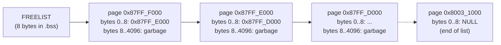
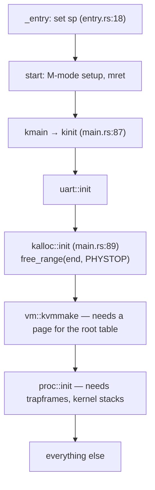

# Physical Memory and the Free List

## Overview

Your kernel boots and prints. It owns 128 MiB of RAM and has no idea which of it
is in use. This session builds the first real kernel service: a **physical page
allocator**. We start from granularity — why kernels hand out fixed-size
4096-byte pages instead of arbitrary byte ranges — and then build the allocator
that xv6, early Linux, and rv6 all use: the **intrusive free list**. It is the
most elegant structure in the kernel, and the reason is worth savoring: a free
page contains nothing by definition, so the "next free page" pointer is stored
*inside the free page itself*. The bookkeeping lives in the very memory it
describes, at zero extra cost. We cover `kfree` as a push, `kalloc` as a pop,
the LIFO order that falls out, where the initial list comes from, and what the
design gives up next to a buddy allocator or `malloc`. Exercise
`32k_physical_memory` is where you write it, on Thursday, October 8 alongside
`31k_boot`; see also the
[Memory Map](../guides/memory-map.md) guide.

## Learning Objectives

- **Explain** why physical memory is allocated in fixed-size pages rather than variable-size blocks, from the hardware and the allocator side.
- **Distinguish** internal from external fragmentation, and say which one a page allocator suffers and which it eliminates.
- **Describe** the intrusive free list and justify why its metadata overhead is zero bytes.
- **Trace** `kfree` as a push and `kalloc` as a pop, pointer write by pointer write.
- **Derive** the order pages come off a fresh free list, given the loop in `free_range`.
- **Diagnose** the ordering bug from writing `FREELIST` before the node's `next` pointer, and predict its exact symptom.
- **Compare** the free list against bitmap, buddy, and `malloc` allocators, naming each trade.
- **Identify** the invariants this allocator does *not* enforce, and who does.

## Prerequisites

- **L10 Boot: From Reset to `kmain`** and exercise `31k_boot` (the same session) — how the kernel image is laid out and how control reaches `kmain`.
- **L09 Leaving `std`** and exercise `21r_unsafe_bridge` — raw pointers, `unsafe`, `static mut`.
- The [Memory Map](../guides/memory-map.md) guide — `KERNBASE`, `PHYSTOP`, and the linker symbol `end`.
- The [Unsafe Rust and no_std](../guides/rust-unsafe-nostd.md) guide — `*mut T`, `ptr::null_mut()`, dereferencing raw pointers.
- Linked lists: push-front, pop-front, and what breaks when the order is wrong.
- The [RISC-V](../guides/riscv.md) guide, for address conventions.

---

## 1. The First Resource

### What the kernel inherits

When `kmain` runs the machine is embarrassingly simple: one CPU, one UART, and
one flat array of bytes from `KERNBASE` to `PHYSTOP`.

```rust
pub const PGSIZE: usize = 4096;                              // memlayout.rs:7
pub const KERNBASE: usize = 0x8000_0000;                     // memlayout.rs:11
pub const PHYSTOP: usize = KERNBASE + 128 * 1024 * 1024;     // memlayout.rs:13
```

That is 134,217,728 bytes — exactly 32,768 pages. The kernel's code, data, and
boot stack sit at the bottom; nothing in the machine has an opinion about the
rest.

Now consider what is coming. A page table grows a level: it needs a page. A
process is created: it needs a trapframe and a kernel stack. Every one of those
is the same request — *"give me RAM nobody else is using"* — and answering it is
the entire job of a physical allocator. It answers exactly two questions:

1. `kalloc()` — give me a page nobody else is using.
2. `kfree(pa)` — I am done with this page; someone else may have it.

> **Key distinction:** the physical allocator is not virtual memory. It hands
> out *real RAM at real addresses*. Virtual memory (L12, exercise `33k`) is a
> translation layer on top, and page tables are themselves pages that came from
> `kalloc`. The allocator has to exist first.

### The hardest easy problem in the kernel

Every other subsystem depends on this one, and it depends on nothing. So it must
be correct before anything else can be tested, it cannot call anything that might
itself allocate, and — crucially — **`kfree` must never be able to fail**.
Teardown runs when memory is already short: `freeproc` returns a trapframe and a
kernel stack (`proc.rs:143`, `proc.rs:147`) *after* an allocation has failed. If
returning memory required memory, the kernel would deadlock exactly when it was
already in trouble. Remember that requirement.

---

## 2. Why Pages

### The hardware works in pages

The first reason is not a software choice at all. RISC-V's Sv39 MMU translates
at 4096-byte granularity: the low 12 bits of an address are an untranslated byte
offset, and everything above is a *page number* that gets looked up. A page
table entry has no room to describe anything finer:

```rust
pub const fn new(pa: usize, flags: usize) -> Pte {
    Pte(((pa >> 12) << 10) | flags)                          // vm.rs:30
}
```

The `>> 12` discards the low twelve bits. Not "rounds", not "errors" —
*discards*. Hand `Pte::new` the address `0x8003_1008` and the hardware is
silently told `0x8003_1000`. It can only name page-aligned frames, so an
allocator feeding it may as well produce nothing else.

The second reason is the TLB, which caches *page* translations: at 64-byte
granularity a working set would scatter across far more pages, burning a TLB
entry for each.

### Fixed size makes allocation O(1)

Now the software reason, which is the more interesting one. `malloc` is hard
because its blocks are all different sizes: ask for 40 bytes and it must
*search*; free a block and it must check the neighbors and coalesce; it must
record each block's size so `free(p)` can work with no length argument. That
machinery exists purely because the blocks are not interchangeable.

Make every block exactly one page and all of it evaporates. Nothing to search
for, because every free page is identical. No size to record, because it is
always `PGSIZE`. Nothing splits, nothing merges, and every result is
4096-aligned. Both operations become a single pointer swap — no loop, no
comparison, no worst case. `kalloc` costs the same when one page is free as
when 32,719 are.

### The fragmentation trade

Fixed-size blocks do not make fragmentation disappear; they move it.

**External fragmentation** is free memory that exists but is unusable because it
is not contiguous — 100 MiB free in 400-byte scraps, and a 4 KiB request fails.
This is `malloc`'s chronic disease, and a page allocator is *completely immune*
to it: every free page is exactly as good as every other, so if any page is free,
any single-page request succeeds.

**Internal fragmentation** is memory handed out but unused. A page allocator has
it in abundance; `kheap.rs` is the honest extreme:

```rust
//! (a 16-byte `Arc` still costs 4096 bytes) ...              // kheap.rs:11
unsafe fn alloc(&self, layout: Layout) -> *mut u8 {
    if layout.size() > PGSIZE || layout.align() > PGSIZE {
        return ptr::null_mut();
    }
    kalloc::kalloc()                                          // kheap.rs:29
}
```

A 16-byte `Arc` consumes a full page: 99.6% waste. rv6 accepts that because it
allocates few small objects, and because the alternative is a second, more
complicated allocator on top — precisely what Linux does (§6).

> **Key distinction:** external fragmentation makes requests *fail*. Internal
> fragmentation makes them *expensive*. A kernel would rather waste memory than
> fail unpredictably, which is why the bottom layer is almost always fixed-size.

### What "page-aligned" buys

An address is page-aligned when its low 12 bits are zero. Two cheap arithmetic
facts follow, both used by rv6:

```rust
fn pgroundup(addr: usize) -> usize {
    (addr + PGSIZE - 1) & !(PGSIZE - 1)                       // kalloc.rs:18
}
fn pgrounddown(a: usize) -> usize { a & !(PGSIZE - 1) }       // vm.rs:49
```

`& !(PGSIZE - 1)` clears the low 12 bits — rounding *down* — and adding
`PGSIZE - 1` first turns it into rounding *up*. `PGSIZE` is a power of two, so
both are two instructions rather than a division. Alignment also makes the page
number just `pa >> 12`, and satisfies any smaller alignment requirement for
free.

---

## 3. The Intrusive Free List

### The idea

Up to 32,719 free pages; we need a structure that records which ones they are,
supports O(1) insert and remove, and — from §1 — must not itself allocate in
order to record a free. That last constraint is the killer: an array of
free-page addresses needs about 256 KiB, allocated from where?

Now the observation that solves it. **A free page contains nothing** — that is
what "free" means, so its 4096 bytes are available for any purpose, including
our own bookkeeping. Put the link *in the page*:

```rust
#[repr(C)]
struct Run {
    next: *mut Run,                                           // kalloc.rs:8
}

static mut FREELIST: *mut Run = ptr::null_mut();              // kalloc.rs:11
```

`Run` is a lie the kernel tells itself, and a productive one. There is no `Run`
in RAM — there is a page, and `pa as *mut Run` chooses to read its first eight
bytes as a pointer, with `#[repr(C)]` pinning `next` to offset 0. A list whose
nodes *are* the free pages is called **intrusive**.



Count the bookkeeping bytes outside the managed memory: eight, for `FREELIST` in
`.bss`, and that figure never grows with RAM size.

> **Key distinction:** the free list's capacity is automatically equal to the
> resource it manages. You can never run out of room to record a free page,
> because the page you are recording *is* the room. That is why `kfree` cannot
> fail — the property §1 demanded, obtained for nothing.

### `kfree` is a push

```rust
pub unsafe fn kfree(pa: *mut u8) {
    let r = pa as *mut Run;                                   // kalloc.rs:35
    (*r).next = FREELIST;                                     // kalloc.rs:36
    FREELIST = r;                                             // kalloc.rs:37
}
```

Three lines, and the middle one is the interesting one: `(*r).next = FREELIST`
is a real store to physical RAM at the address of the page being freed. This is
the moment the bookkeeping is written into the resource it describes.

```text
before:  FREELIST ──▶ [ B ] ──▶ [ C ] ──▶ NULL
         page A holds whatever the previous owner left

step 1:  r = A as *mut Run       no memory touched
step 2:  (*r).next = FREELIST    writes B's address into A[0..8]
step 3:  FREELIST = r

after:   FREELIST ──▶ [ A ] ──▶ [ B ] ──▶ [ C ] ──▶ NULL
```

Note what step 2 did to page A's *contents*: the first eight bytes are gone,
overwritten with a pointer. That is the one real cost of the design — **`kfree`
destroys data**. Reading a page after freeing it was already a bug; now it is a
bug that announces itself, because the first word is a physical address.

### `kalloc` is a pop

```rust
pub unsafe fn kalloc() -> *mut u8 {
    let r = FREELIST;                                         // kalloc.rs:41
    if !r.is_null() {
        FREELIST = (*r).next;                                 // kalloc.rs:43
    }
    r as *mut u8                                              // kalloc.rs:45
}
```

Read the head; if it is real, advance the head to whatever that page says comes
next; return the old head. The null case needs no special handling — a null head
*is* the out-of-memory answer, and callers check it (`vm.rs:63`, `proc.rs:119`).

Two subtleties. `FREELIST = (*r).next` reads eight bytes from a page we are in
the middle of giving away — safe only because the caller cannot write to it
until `kalloc` returns. And the returned page still holds that stale `next`
pointer; `kalloc` does not clean up after itself (§5).

### LIFO, and why it is right

Both operations act on the front, so the most recently freed page is the next
allocated: **last in, first out**. That falls out of using the cheap end of a
singly linked list, and it happens to be right anyway. A page just freed was just
in use, so its cache lines are still resident; handing it straight back means the
next owner's first write hits a warm line. FIFO would systematically hand out the
*coldest* page in the system.

LIFO is also what the self-test checks: free a page, allocate again, get the same
page — the signature of pushing and popping at the same end.

---

## 4. Where the List Comes From

An empty free list is useless. Something must put all 32,719 pages on it, and to
do that it must first answer: *where does the kernel end?*

### The linker gives you the answer

Hardcoding the number is wrong — it changes every time you add a function.
Instead the linker script emits a symbol at the very end of the image:

```text
  .bss : { . = ALIGN(16); *(.sbss .sbss.*) *(.bss .bss.*) }
  PROVIDE(end = .);                                           /* kernel.ld:43 */
```

and `kalloc.rs` imports it:

```rust
extern "C" {
    static end: u8;                                           // kalloc.rs:14
}

pub unsafe fn init() {
    let start = &end as *const u8 as usize;                   // kalloc.rs:22
    free_range(start, PHYSTOP);                               // kalloc.rs:23
}
```

`end` is not a variable — no `u8` is stored there. What matters is its *address*,
which is why the code takes `&end` and casts straight to `usize`. `static end: u8`
is the standard trick for importing a linker symbol into Rust: the type is a
fiction, and reading the value would be meaningless.

### Building the list

```rust
unsafe fn free_range(start: usize, stop: usize) {
    let mut p = pgroundup(start);                             // kalloc.rs:27
    while p + PGSIZE <= stop {                                // kalloc.rs:28
        kfree(p as *mut u8);                                  // kalloc.rs:29
        p += PGSIZE;
    }
}
```

Three details. `pgroundup` skips the partial page the kernel's tail sits in;
rounding *down* would hand out live `.bss`. The condition `p + PGSIZE <= stop`
skips a partial page at the top too. And the list is built purely from `kfree`
calls — freeing a page nobody allocated is the same operation as freeing one
someone did.

For one debug build of the exercise-22 kernel:

```text
   0x8800_0000  PHYSTOP
        ^
        |       32,719 free pages, all on the free list
        |
   0x8003_1000  first free page  = pgroundup(end)
   0x8003_0748  end              <- PROVIDE(end = .), kernel.ld:43
        |       .bss   (includes STACK0, the 16 KiB boot stack)
        |       .data
        |       .rodata
        |       .text
   0x8000_0000  KERNBASE = _entry
```

The kernel occupies 49 pages; 32,768 − 49 = 32,719 remain. Your `end` will
differ — which is the entire point of using the symbol.

### The order the list ends up in

`free_range` walks **upward** from `0x8003_1000`, and every `kfree` pushes onto
the **front**. So the *last* page freed is the *first* on the list: the highest
page in RAM, `0x87FF_F000`, ends up at the head, and the very first `kalloc()`
returns it. The list runs downward through physical memory even though it was
built upward — push-front applied to an ascending sequence.

Where that fits into boot:



`kalloc::init` runs at `main.rs:89`, after the UART and before anything that
could need memory. The ordering is forced: `kvmmake` allocates its root page
table on its first line (`vm.rs:126`).

---

## 5. What This Design Deliberately Gives Up

An allocator this small is small because of what it refuses to do; each refusal
is a limitation something later must work around.

**It cannot allocate two contiguous pages.** The list has no idea whether any
two of its pages are adjacent, and finding an adjacent pair would require a
search, destroying the O(1) property. That is not hypothetical: DMA devices need
physically contiguous buffers, and superpages need 2 MiB-aligned contiguous
frames. rv6 needs neither; Linux does, which is a large part of why it uses a
buddy allocator.

**It does not zero pages.** `kalloc` returns whatever the last owner left, plus
a stale `next` pointer in the first eight bytes. Callers that care must zero it,
and in rv6 they all do:

```rust
let page = kalloc::kalloc();
if page.is_null() { return ptr::null_mut(); }
ptr::write_bytes(page, 0, PGSIZE);                            // vm.rs:66
```

The same pattern appears at `vm.rs:130`, `proc.rs:98`, and `proc.rs:123`. Pushing
zeroing to callers is a performance choice — a page about to be overwritten
entirely does not need it — but also a security decision: an un-zeroed page
handed to a user process leaks the previous owner's data. rv6 is safe only
because every user page goes through `vm.rs:216-220`, which zeroes.

**It detects nothing.** `kfree` takes an address, no length, and no way to know
whether that page was ever allocated. Free a page twice and the list gains a
cycle. Free a pointer into the middle of a page and you corrupt live data. Free
an address outside RAM and `kfree`'s store lands in MMIO space. xv6 adds cheap
checks for all three — panic on a misaligned or out-of-range address, plus
poisoning freed pages so use-after-free is loud — which rv6 omits to keep the
exercise to two functions. Every one of these mistakes is therefore silent.

**It is not thread-safe.** `FREELIST` is a `static mut` (`kalloc.rs:11`), so two
harts in `kalloc` at once can both read the same head and both return it. The
fix is a spinlock around both functions — xv6 keeps one in its `kmem` struct —
which you build in exercise `37k`. rv6 runs one hart, so `kalloc.rs` in the
finished exercise-22 kernel is still 46 lines with no lock.

---

## 6. The Alternatives

### A bitmap allocator

One bit per page: 0 = free, 1 = used. For our 32,768 pages that is exactly 4096
bytes — one page of metadata for 128 MiB. Allocation scans for a zero bit, O(n)
worst case, though a hint pointer and `ctz` make it fast. The compensating
advantage is decisive: `k` consecutive zero bits give `k` contiguous pages,
something the free list can never do. Bitmaps are common in bootloaders and
filesystems, where contiguity matters and allocation is rare.

### A buddy allocator

This is what Linux uses for physical pages. Blocks come in power-of-two sizes:
order 0 = 4 KiB, order 1 = 8 KiB, up to order 10 = 4 MiB, each order with its
own free list.

To serve a request, find the smallest order that fits; if that list is empty,
take a block from the order above and **split** it into two halves called
buddies, keeping one and listing the other. On free, check whether your buddy is
also free — its address is yours with one bit flipped, so the test is an XOR and
a lookup — and if so **coalesce** the pair into the next order up, recursively.

```text
order 3  [================ 32K ================]
                        split
order 2  [====== 16K =====][====== 16K =====]
              split                buddy, stays free
order 1  [= 8K =][= 8K =]
            split      buddy, stays free
order 0  [4K][4K]
          ^   buddy, stays free
          returned to caller
```

You get contiguous allocation and automatic defragmentation, in O(log n) rather
than O(1), with per-order free lists as real metadata. Linux layers **SLUB** on
top for sub-page objects; rv6's `kheap.rs` fills that slot far more crudely.

### `malloc`

`malloc` sits above all of this in user space, subdividing large chunks it gets
from the kernel via `brk` or `mmap`. Its problem is harder — arbitrary sizes and
lifetimes — so it pays with headers, size classes, coalescing, and permanent
exposure to fragmentation.

| | rv6 free list | Bitmap | Buddy | `malloc` |
|---|---|---|---|---|
| Block sizes | 4 KiB only | 4 KiB only | 4 KiB · 2^k | arbitrary |
| `alloc` / `free` cost | O(1) / O(1) | O(n) / O(1) | O(log n) both | O(1)+ / coalesce |
| Metadata | 0 bytes | 1 bit/page | per-order lists | per-block headers |
| Contiguous runs | impossible | yes | yes | yes |
| External fragmentation | none | none | bounded | chronic |
| Internal fragmentation | up to 4095 B | up to 4095 B | up to 50% | small |
| Can `free` fail? | no | no | no | no |

The row that matters most for a kernel is the last: none can fail on free. The
row explaining rv6's choice is "metadata: 0 bytes", given that nothing in this
kernel ever needs two adjacent pages.

---

## 7. The Ordering Bug

The mistake nearly everyone makes at least once is writing the two lines of
`kfree` in the wrong order:

```rust
pub unsafe fn kfree(pa: *mut u8) {
    let r = pa as *mut Run;
    FREELIST = r;               // WRONG: head moved first
    (*r).next = FREELIST;       // ...so this stores r into r
}
```

The second line reads a `FREELIST` that has already been updated, so it stores
the page's own address into its own `next` field. Every node points at itself.

```text
correct:                       buggy:
  FREELIST ─▶ [A] ─▶ [B] ─▶ …    FREELIST ─▶ [A] ─┐
                                              ^   │
                                              └───┘
```

Through `init`, each `kfree` orphans the page before it, so all but one of the
32,719 pages leak before the kernel finishes booting, and the survivor points at
itself. Problem 2 traces the consequences and the exact line QEMU prints. The
symptom names the bug: two allocations returning the same page means a
one-element cycle, so `next` points at its own node, so `next` was written after
the head moved.

> **Key distinction:** the rule for any push-front is *write the new node's link
> before you publish the node*. Here that is only source ordering; in a
> lock-free multicore list it becomes a memory-ordering requirement enforced by
> a release store, for exactly the same reason — nobody may observe the new head
> until its `next` is valid.

---

## 8. Where `kalloc` Shows Up Next

With this built, the rest of the kernel stops thinking about memory. Every later
allocation in rv6 is one call:

| Caller | What it allocates | Cite |
|---|---|---|
| `vm::walk` | an interior page-table page, on demand | `vm.rs:62` |
| `vm::kvmmake` | the kernel root page table, the trampoline | `vm.rs:126`, `vm.rs:158` |
| `vm::load_segment` | one page per page of the user image | `vm.rs:216` |
| `vm::map_user_stack` | the user stack page | `vm.rs:240` |
| `proc::allocproc` | page table, trapframe, kernel stack | `proc.rs:96`, `:117`, `:118` |
| `kheap` | one page per heap allocation | `kheap.rs:29` |

Every one checks for null and unwinds on failure, and every one gives its pages
back with `kfree` on teardown (`vm.rs:364`, `proc.rs:143`). Two functions,
forty-six lines, and the whole kernel rests on them.

**Exercise `32k_physical_memory`** is where you write `kfree` and `kalloc`. `Run`,
`FREELIST`, `pgroundup`, `init`, and `free_range` are given; the two list
operations are not. Its `README.md` has the mechanics and the Rust.

---

## Key Concepts

| Concept | Definition | Example |
|---|---|---|
| Page | The fixed-size unit of allocation and of hardware translation | `PGSIZE = 4096` (`memlayout.rs:7`) |
| Page-aligned | An address whose low 12 bits are zero | `0x8003_1000` is; `0x8003_0748` is not |
| `pgroundup` | Round an address up to the next page boundary | `(a + 4095) & !4095` (`kalloc.rs:18`) |
| Intrusive list | A list whose nodes are the objects themselves | `Run` overlaid on a free page (`kalloc.rs:6-9`) |
| `FREELIST` | The head of the list; the allocator's entire out-of-line state | `static mut FREELIST: *mut Run` (`kalloc.rs:11`) |
| `kfree` | Push a page onto the front of the free list; cannot fail | `(*r).next = FREELIST; FREELIST = r;` |
| `kalloc` | Pop the front page off the list, or return null | `FREELIST = (*r).next;` (`kalloc.rs:43`) |
| LIFO | Last freed is first allocated, because both ends are the front | `kfree(b); kalloc() == b` |
| `end` | Linker symbol: the first address past the kernel image | `PROVIDE(end = .)` (`kernel.ld:43`) |
| Internal fragmentation | Allocated-but-unused bytes inside a block | A 16-byte `Arc` in 4096 bytes (`kheap.rs:11`) |
| External fragmentation | Free memory unusable because it is not contiguous | Impossible with fixed-size pages |
| Buddy allocator | Power-of-two blocks that split and coalesce | Linux `free_area`, 4 KiB–4 MiB |

---

## Practice Problems

### Problem 1: What does the first `kalloc` return?

`end = 0x8003_0748` and `PHYSTOP = 0x8800_0000`. After `kalloc::init()`, the
kernel calls `kalloc()` three times. Give the three addresses returned, in
order, and say how many pages remain.

<details>
<summary>Click to reveal solution</summary>

`free_range` starts at `pgroundup(0x8003_0748)`:

```text
(0x8003_0748 + 0xFFF) & !0xFFF = 0x8003_1747 & 0xFFFF_F000 = 0x8003_1000
```

It loops **upward**, and since the condition is `p + PGSIZE <= PHYSTOP`, the
last page freed is `0x87FF_F000`. `kfree` pushes onto the *front*, so that page
is the head: the three allocations return `0x87FF_F000`, `0x87FF_E000`,
`0x87FF_D000`.

Pages built: `(0x8800_0000 − 0x8003_1000) / 0x1000 = 0x7FCF = 32,719`; 32,716
remain. A free list built by ascending `kfree` calls hands out memory in
descending order — an artifact of the loop, not a policy.
</details>

### Problem 2: Find the bug and predict the output

This compiles with no warnings. Identify the bug, say what the free list looks
like after `init()`, and give the exact line the self-test prints.

```rust
pub unsafe fn kfree(pa: *mut u8) {
    let r = pa as *mut Run;
    FREELIST = r;
    (*r).next = FREELIST;
}
// kalloc is the reference implementation, unchanged.
```

<details>
<summary>Click to reveal solution</summary>

`kfree` moves the head **before** saving the old head into the new node, so by
the time `(*r).next = FREELIST` runs, `FREELIST` already equals `r` and the page
stores a pointer to itself.

After `init()`, each `kfree` has orphaned the previous page: 32,718 pages are
leaked before `kmain` finishes booting. `FREELIST = 0x87FF_F000`, whose first
eight bytes contain `0x87FF_F000` — a one-element cycle.

The self-test then passes checks 1–3 (a real, aligned, writable page) and fails
check 4: `b = kalloc()` returns `0x87FF_F000` again, so `a == b`.

```text
  [fail] second kalloc reused or failed
OSLINGS:FAIL
```

The bug stays silent until the *second* allocation, which is why "it allocated
fine, I don't see the problem" is the usual reaction — and note `kalloc` is
entirely correct here; the fault is one function away from the symptom.
</details>

### Problem 3: Alignment arithmetic and a silent truncation

(a) Compute `pgroundup(0x8003_1000)`, `pgroundup(0x8003_1001)`, and
`pgroundup(0x8000_0000)` by hand.

(b) A leaf PTE is `Pte(((pa >> 12) << 10) | flags)` (`vm.rs:30`) with
`PTE_V = 1`, `PTE_R = 2`, `PTE_W = 4` (`vm.rs:17-19`). Give the PTE for
`pa = 0x87FF_F000` with those three flags, then for `pa = 0x87FF_F008`, and say
what the hardware does with the second.

<details>
<summary>Click to reveal solution</summary>

**(a)**

```text
pgroundup(0x8003_1000) = 0x8003_1FFF & 0xFFFF_F000 = 0x8003_1000  (unchanged)
pgroundup(0x8003_1001) = 0x8003_2000 & 0xFFFF_F000 = 0x8003_2000  (rounds up)
pgroundup(0x8000_0000) = 0x8000_0FFF & 0xFFFF_F000 = 0x8000_0000  (unchanged)
```

Already-aligned addresses are fixed points: adding `PGSIZE - 1` can never push
one past its own boundary. That is why the idiom is exactly right, not close.

**(b)** Flags are `1 | 2 | 4 = 7`.

```text
0x87FF_F000 >> 12 = 0x0008_7FFF   PPN
   << 10          = 0x21FF_FC00
   | 7            = 0x21FF_FC07   the PTE

0x87FF_F008 >> 12 = 0x0008_7FFF   identical — the 8 falls off the end
PTE               = 0x21FF_FC07   identical
```

The offset is discarded with no error and no warning: the MMU maps the page to
frame `0x87FF_F000`, eight bytes below what the caller intended. This is the
concrete reason a physical allocator must return page-aligned addresses — an
unaligned frame is not an error the hardware can report, it is one the hardware
cannot perceive.
</details>

### Problem 4: Double free

Starting from a free list `FREELIST → A → B → C → NULL`, the kernel executes:

```rust
let p = kalloc();      // p == A
kfree(p);
kfree(p);              // oops
let x = kalloc();
let y = kalloc();
```

Draw the list after each step, and give the values of `x` and `y`. What is the
consequence?

<details>
<summary>Click to reveal solution</summary>

```text
start           FREELIST -> A -> B -> C -> NULL
kalloc()  p = A FREELIST -> B -> C -> NULL   (A[0..8] still holds B, stale)
kfree(A)        A.next = B    FREELIST -> A -> B -> C -> NULL
kfree(A) again  A.next = FREELIST, which is already A
                A.next = A    FREELIST -> A -+     B and C now unreachable
                                          ^  |
                                          +--+
kalloc()  x = A FREELIST = A.next = A
kalloc()  y = A FREELIST = A.next = A
```

So `x == y == A`: two callers believe they own the same frame. If one is a page
table and the other a kernel stack, the stack's pushes overwrite PTEs and the
machine faults somewhere unrelated to either bug site. The second `kfree` also
**leaked B and C**.

The allocator cannot catch this: `kfree` receives only an address — no length,
owner, or allocated bit. Detecting "already on the list" needs an O(n) walk or a
bit per page, which is a bitmap, i.e. a different allocator. xv6 mitigates the
*consequences* by poisoning freed pages, but still does not detect the double
free.
</details>

### Problem 5: Sizing the alternatives

A machine has 4 GiB of RAM and 4 KiB pages; assume the kernel image is
negligible. (a) How many bytes of metadata does the rv6 free list need outside
the pages it manages? (b) How many for a bitmap allocator? (c) A driver needs a
physically contiguous 64 KiB DMA buffer — which of the allocators in §6 can
supply it?

<details>
<summary>Click to reveal solution</summary>

**(a)** Eight bytes — the `FREELIST` pointer. The per-page links live inside the
free pages, so they cost nothing. The figure is independent of RAM size: 128 MiB
and 4 GiB both cost eight bytes.

**(b)** 4 GiB / 4 KiB = 1,048,576 pages, one bit each = 128 KiB = 32 pages. A
fixed 1/32768 of RAM, but unlike the free list it must be carved out of usable
memory before management can begin, and it grows with RAM.

**(c)** 64 KiB is 16 contiguous pages.

- **Free list:** effectively no. It has no ordering and no adjacency
  information; you would allocate one page at a time and hope for 16 consecutive
  addresses, or sort the list into a structure you have no memory for.
- **Bitmap:** yes — scan for 16 consecutive zero bits. O(n), but word-at-a-time,
  and it always finds a run if one exists.
- **Buddy:** yes, and this is its purpose: 64 KiB is order 4, so take an order-4
  block or split an order-5. Contiguity is structural, not searched for.

This is the most important limitation of the intrusive free list, and the reason
no production kernel uses one as its only physical allocator.
</details>

### Problem 6: Why the self-test does not corrupt the list

The harness writes a pattern across **all 4096 bytes** of the page it just
allocated — including the first eight, which held a `next` pointer. Explain why
this does not corrupt the free list, then describe a change to `kalloc` that
would make the same write catastrophic.

<details>
<summary>Click to reveal solution</summary>

It is safe because of the invariant `kalloc` establishes before returning:
**the returned page is no longer on the list.** `FREELIST = (*r).next` runs
first (`kalloc.rs:43`), so by the time the caller holds the pointer, no reachable
node's `next` refers to it. The bytes it overwrites are stale.

The catastrophic variant returns the head *without* advancing it:

```rust
pub unsafe fn kalloc() -> *mut u8 {
    FREELIST as *mut u8          // BUG: head never advances
}
```

Now the caller's first write clobbers the live head's `next`: the pattern
`0, 1, 2, …` puts `0x0706_0504_0302_0100` there, the next `kalloc` returns the
same page, and anything walking the list dereferences an address nowhere near
RAM.

The principle: in an intrusive structure the link bytes and the payload bytes
are *the same bytes*, so removal and transfer of ownership must be one
indivisible step. Every intrusive container in every kernel obeys this rule.
</details>

---

## Further Reading

- [Memory Map](../guides/memory-map.md) — the `virt` physical layout, `kernel.ld` line by line, and measured addresses for `etext`, `end`, and `STACK0`.
- [Unsafe Rust and no_std](../guides/rust-unsafe-nostd.md) — raw pointers, `static mut`, and what `unsafe` does not turn off.
- [Sv39 Paging](../guides/sv39-paging.md) — where these pages end up: PTE format, the three-level walk, `satp`.
- [rv6 Architecture](../guides/rv6-architecture.md) — how `kalloc` sits under `vm`, `proc`, and `kheap`.
- [Key Concepts](../guides/key-concepts.md) — the running glossary.
- xv6-riscv, `kernel/kalloc.c` — the ancestor of `kalloc.rs`, with the `kmem` spinlock and the `memset(pa, 1, PGSIZE)` poisoning rv6 omits. https://github.com/mit-pdos/xv6-riscv
- *xv6: a simple, Unix-like teaching operating system*, Cox, Kaashoek, Morris — chapter 3 opens with the physical allocator.
- Knuth, *TAOCP* Vol. 1 §2.5 — the original analysis of buddy systems.
- Wilson et al., "Dynamic Storage Allocation: A Survey and Critical Review" (1995) — why `malloc`'s fragmentation problem is hard.
- Linux `mm/page_alloc.c` — the production buddy allocator, zones, orders 0–10.

---

## Summary

1. **The physical allocator is the kernel's first service and depends on nothing.** Page tables, trapframes, kernel stacks, and the heap are all built from its pages, so it runs first: `kalloc::init()` at `main.rs:89`.

2. **Allocation is page-granular because the hardware is.** A Sv39 PTE stores a page number, not an address: `Pte::new` (`vm.rs:30`) computes `(pa >> 12) << 10`, silently discarding the low twelve bits. An unaligned frame is not something the MMU can represent.

3. **Fixed-size blocks make allocation O(1) and kill external fragmentation.** No search, no split, no coalesce, no size header. The price is internal fragmentation — `kheap.rs` spends a whole page on a 16-byte `Arc` — which a kernel accepts, since wasted memory beats unpredictable failure.

4. **The intrusive free list stores its links inside the free pages themselves.** `Run` (`kalloc.rs:6-9`) is a fiction overlaid on a page's first eight bytes. Out-of-line metadata: eight bytes, whatever the RAM size.

5. **`kfree` is a push, `kalloc` is a pop, and `kfree` can never fail.** The storage for a free record *is* the page being freed, so nothing is allocated on the free path — exactly what teardown paths like `freeproc` (`proc.rs:143`) require.

6. **LIFO falls out of using one end of the list, and is also the right policy.** The most recently freed page is the most recently *used* page, so it is likely still cache-warm. Building the list upward from `end` means the first `kalloc` returns the top page of RAM, `0x87FF_F000`.

7. **Order the two stores in `kfree` correctly or you leak all of RAM at boot.** `(*r).next = FREELIST` before `FREELIST = r`. Reversed, every node points at itself, 32,718 pages become unreachable during `init`, and two allocations return the same page.

8. **This allocator refuses four things on purpose.** No contiguous multi-page allocation, no zeroing (callers do it — `vm.rs:66`), no validation, no locking. Each refusal buys simplicity now and is paid for later: by a buddy allocator in Linux, by callers in rv6, by the spinlock you write in exercise `37k`.
