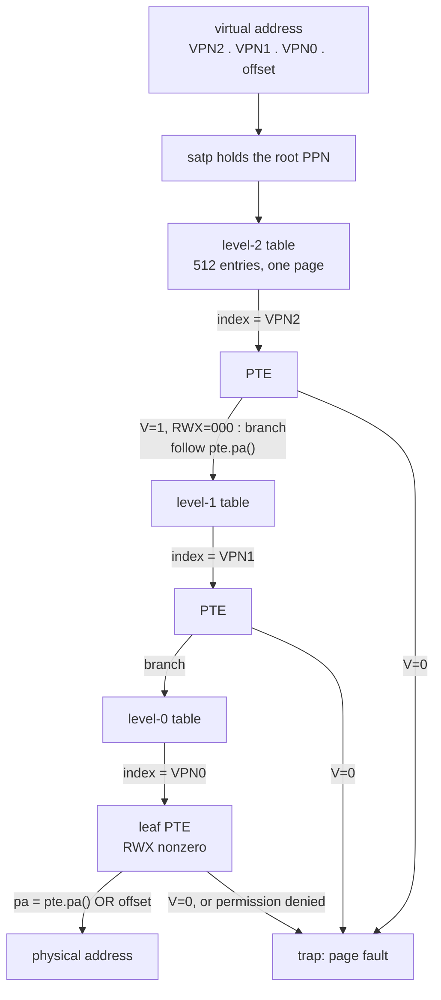
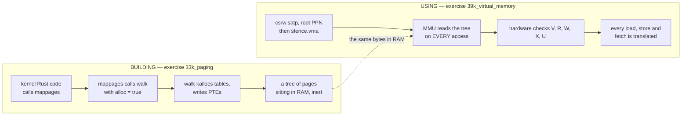

# Virtual Memory I: Sv39 Page Tables

## Overview

Every address your kernel has used so far has been a real address in RAM. Today
that stops being true. Virtual memory is the most important idea in modern
operating systems and the hardest concept in Module 2 — not because any one
piece is difficult, but because three separate ideas (isolation, relocation,
protection) arrive through one mechanism, and that mechanism is a tree of tables
the *hardware* reads on every single memory access. This session covers RISC-V's
Sv39 scheme concretely: how a 39-bit virtual address is sliced into three 9-bit
indices plus a 12-bit offset, what all 64 bits of a page-table entry mean, how
the leaf/branch distinction is encoded in the permission bits, and how the
three-level walk turns a virtual address into a physical one. It also separates
two things students conflate constantly: *building* a page table in software
(exercise `33k_paging`, Friday, October 9) and the *hardware using* one after
you write `satp` (exercise `39k_virtual_memory`, Friday, October 30). The [Sv39 Paging](../guides/sv39-paging.md) guide
holds the reference tables.

## Learning Objectives

- **Explain** the three distinct problems virtual memory solves — isolation, relocation, protection — and why one mechanism solves all three.
- **Decode** a 39-bit Sv39 virtual address into `VPN[2]`, `VPN[1]`, `VPN[0]`, and the page offset.
- **Describe** the 64-bit Sv39 page-table entry, naming every flag and the PPN field by bit position.
- **Distinguish** a leaf PTE from a branch PTE by its `R`/`W`/`X` bits, and predict what the MMU does with each.
- **Trace** a three-level page-table walk by hand, showing the arithmetic at every level.
- **Encode and decode** PTE values: pack an address plus flags into a `usize`, and recover the address from raw hex.
- **Contrast** building a page table with the hardware walking one, and identify bugs only the second exposes.
- **Estimate** the memory a page-table tree costs for a given set of mappings.

## Prerequisites

- **L11 Physical Memory and the Free List** and exercise `32k_physical_memory` (Thursday, October 8) — `kalloc` is what `walk` calls when it needs a new table page.
- **L10 Boot: From Reset to kmain** and exercise `31k_boot` (also Thursday, October 8) — where the kernel image sits in RAM.
- **L09 Leaving std** and the [Unsafe Rust and no_std](../guides/rust-unsafe-nostd.md) guide — raw pointers, `unsafe`, `ptr::write_bytes`.
- The [Memory Map](../guides/memory-map.md) guide — `KERNBASE`, `PHYSTOP`, `UART0`, and the QEMU `virt` device addresses.
- The [RISC-V](../guides/riscv.md) guide — CSRs, supervisor mode, and `csrw`.
- Bit manipulation in Rust: `<<`, `>>`, `&`, `|`, and hex-to-binary conversion done by hand.

---

## 1. Three Problems, One Mechanism

Virtual memory is usually introduced as "each process gets its own address
space," which is true but hides the fact that three genuinely different problems
are being solved at once. Keep them separate; when you debug a page table you
will be debugging exactly one of them.

### 1.1 Isolation

Process A stores to address `0x1000`. Process B holds a pointer to *its*
`0x1000`. If both denote the same byte of RAM, A has corrupted B — and can *read*
B's password buffer by guessing an address. Isolation means neither process can
name the other's bytes at all. Not "is not allowed to" — *cannot name*. If a
physical page appears in no entry of A's page table, no 64-bit number A can
compute reaches it. That is far stronger than a permission check, and it is why a
hardware translation layer beats any software sandbox.

### 1.2 Relocation

A linker must decide at build time what address a function lives at. If programs
shared one physical space, the linker would have to know what else is loaded and
pick a free hole — an answer that changes every time the machine's software mix
changes.

With virtual memory the linker stops caring. In rv6 every user program is linked
to start at virtual address `0`: `USER_CODE` in `memlayout.rs:61` is literally
`0x0`. Ten programs can all be linked at `0` and run simultaneously, because each
gets a page table that sends virtual `0` somewhere different. Relocation moved
out of link time and into a data structure the kernel fills in at load time.

### 1.3 Protection

Physical RAM has no opinion about whether a page holds instructions or data. A
page table does. Every leaf entry carries independent read, write, and execute
bits, so one physical page can be mapped read-execute in one place and read-write
in another.

This is where whole exploit classes die. A non-executable stack will not run
injected shellcode; a non-writable text segment cannot be rewritten by a stray
pointer. The reference kernel shows the split one line apart: `vm.rs:228` maps a
user's code pages `PTE_R | PTE_X | PTE_U`, `vm.rs:245` maps the user stack
`PTE_R | PTE_W | PTE_U`. Code is not writable; the stack is not executable. That
is W^X.

`PTE_U` is a fourth bit that is a wall rather than a permission: a page without
it cannot be touched from user mode at all, whatever `R`/`W`/`X` say. The comment
at `vm.rs:21-23` calls it "the wall between user programs and the kernel," which
is literal — forget it on a user page and the program faults instantly; set it by
accident on a kernel page and user code reads kernel memory.

> Key distinction: isolation is about what a process can *name*; protection is
> about what it may *do* with what it can name. Both are enforced by the same
> hardware at the same instant, but they answer different questions.

### 1.4 What it costs

All of this comes from one thing: an extra level of indirection on every memory
access. The CPU must consult a structure in RAM to resolve an address that is
itself in RAM. The history of MMU design is the history of making that
indirection cheap — caches of recent translations (the TLB), bigger pages,
hardware walkers running alongside the pipeline.

Cheaper schemes were tried. **Base-and-bound** (add a base, trap past the bound)
gives isolation and relocation with two registers and no tables — but one
contiguous region per process, no sharing, no per-page permissions, and a demand
for physically contiguous memory that fragments badly. **Segmentation**
generalized it to several base/bound pairs, still handing out variable-sized
chunks and therefore still fragmenting. Paging won because fixed-size pages make
allocation trivial — any free page fits any need, which is exactly why your
`kalloc` free list can be a single list — at the price of a large lookup
structure.

---

## 2. Pages, Page Numbers, and the Offset

Translation happens at page granularity. A RISC-V page is 4096 bytes — `PGSIZE`
in `memlayout.rs:7`. 4096 is 2^12, so the low 12 bits of an address select a byte
*within* a page and the rest select *which* page.

The critical simplification: **the offset is never translated.** It is copied
straight through. Translation is therefore only ever a question about page
numbers.

```text
   virtual address                       physical address
  ┌──────────────┬──────────┐           ┌───────────────┬──────────┐
  │  VPN (27 b)  │ off (12) │           │  PPN (44 b)   │ off (12) │
  └──────┬───────┴────┬─────┘           └───────▲───────┴────▲─────┘
         │            │                         │            │
         │            └─────────── copied ──────┼────────────┘
         │                                      │
         └────── page table lookup ─────────────┘
```

Two consequences follow, and both appear in code you will read:

1. A physical address in a PTE is always page-aligned, so its low 12 bits are
   always zero and the hardware need not store them. It stores `pa >> 12`, the
   **physical page number** (PPN).
2. Rebuilding a full physical address from a leaf is `pte.pa() | (va & 0xFFF)` —
   what the software `translate` helper in `33k_paging` does, and what the MMU
   does in silicon.

---

## 3. Sv39: The Address Formats

"Sv39" means *supervisor virtual-memory scheme, 39-bit virtual addresses*. It has
bigger siblings — Sv48 (four levels) and Sv57 (five) — with identical mechanics
and more levels. rv6, xv6, and Linux on RISC-V all start with Sv39.

### 3.1 The two formats

```text
  VIRTUAL (39 significant bits)
  63                39 38      30 29      21 20      12 11         0
 ┌────────────────────┬──────────┬──────────┬──────────┬────────────┐
 │  sign extension    │  VPN[2]  │  VPN[1]  │  VPN[0]  │   offset   │
 │ (must equal bit 38)│  9 bits  │  9 bits  │  9 bits  │  12 bits   │
 └────────────────────┴──────────┴──────────┴──────────┴────────────┘

  PHYSICAL (56 bits)
  63      56 55                                    12 11         0
 ┌──────────┬────────────────────────────────────────┬────────────┐
 │  unused  │              PPN (44 bits)             │   offset   │
 └──────────┴────────────────────────────────────────┴────────────┘
             PPN[2] 55..30 │ PPN[1] 29..21 │ PPN[0] 20..12
```

Bits 63..39 of a virtual address are not spare: they **must** be copies of bit
38, like a sign-extended two's-complement number, or the access faults. That
splits the usable space into a low half and a high half with an enormous hole
between them — the "canonical hole" you may know from x86-64. Kernels typically
put user space low and the kernel high.

rv6 sidesteps this entirely. `memlayout.rs:49` sets `MAXVA = 1 << 38`, stopping
one bit short so we never build an address with bit 38 set. Every rv6 virtual
address lives in the low half and sign extension never bites us.

Note the asymmetry: virtual addresses carry 39 bits, physical addresses 56. A
machine may hold far more RAM than any one process can address. The PPN
sub-fields matter only for superpages (§4.5); for 4 KiB pages treat the PPN as
one 44-bit number.

Index extraction is one line, `vm.rs:44-46`:

```rust
const fn px(level: usize, va: usize) -> usize {
    (va >> (12 + level * 9)) & 0x1ff
}
```

Shift past the offset (12) plus `level` groups of 9, then mask nine bits.
`level = 2` gives bits 38..30, `level = 1` gives 29..21, `level = 0` gives
20..12. `0x1ff` is 511, nine ones.

### 3.2 Why three levels of nine

Nine bits per level is not arbitrary. One page table must fit in exactly one
page, so the same `kalloc` that hands out everything else can hand out table
pages. A PTE is 8 bytes. 4096 / 8 = **512 entries**, and 512 = 2^9, hence 9 index
bits. Three levels of 9 plus 12 offset bits = 39. The name Sv39 is a
*consequence* of "one table per page, 8 bytes per entry, three levels."

Why a tree at all? A flat array indexed by the whole 27-bit VPN would need 2^27 ×
8 bytes = **1 GiB of page table per process**, almost all zeros, since a real
process maps a few dozen of its 134 million possible pages. A tree materializes
only the subtrees you use: one page costs a root + level-1 + level-0 = 12 KiB,
and a second page in the same 2 MiB neighborhood costs nothing more. Sparse
address spaces are cheap; that is the whole point.

---

## 4. The Page-Table Entry

### 4.1 Every bit

```text
 63 62  61 60      54 53                        10 9 8 7 6 5 4 3 2 1 0
 ┌──┬──────┬──────────┬────────────────────────────┬───┬─┬─┬─┬─┬─┬─┬─┬─┐
 │N │ PBMT │ reserved │           PPN              │RSW│D│A│G│U│X│W│R│V│
 └──┴──────┴──────────┴────────────────────────────┴───┴─┴─┴─┴─┴─┴─┴─┴─┘
   1    2       7                 44                 2  1 1 1 1 1 1 1 1
```

| Bits | Name | Meaning |
|------|------|---------|
| 0 | `V` | **Valid.** If 0 the entry is meaningless and the walk faults. |
| 1 | `R` | **Readable.** Loads allowed. |
| 2 | `W` | **Writable.** Stores allowed. |
| 3 | `X` | **eXecutable.** Instruction fetches allowed. |
| 4 | `U` | **User.** Reachable from user mode; supervisor may *not* touch a `U` page unless `SUM` is set in `sstatus`. |
| 5 | `G` | **Global.** Present in every address space; lets the TLB keep it across an ASID switch. |
| 6 | `A` | **Accessed.** Set when the page has been read, written, or fetched. |
| 7 | `D` | **Dirty.** Set when the page has been written. |
| 9:8 | `RSW` | **Reserved for software.** Hardware ignores these; Linux stores swap markers here. |
| 53:10 | `PPN` | The 44-bit physical page number. |
| 60:54 | — | Reserved; must be zero. |
| 62:61 | `PBMT` | Page-based memory type (Svpbmt). Zero on our machine. |
| 63 | `N` | NAPOT contiguity hint (Svnapot). Zero on our machine. |

rv6 uses the low five bits and the PPN — `vm.rs:17-23`:

```rust
pub const PTE_V: usize = 1 << 0;
pub const PTE_R: usize = 1 << 1;
pub const PTE_W: usize = 1 << 2;
pub const PTE_X: usize = 1 << 3;
pub const PTE_U: usize = 1 << 4;
```

`Pte::flags` at `vm.rs:36-38` masks with `0x3ff` — the low **ten** bits, `V`
through `RSW`, the whole software-visible flag group.

### 4.2 Leaf versus branch: the most important rule here

A PTE means one of two completely different things, and hardware tells them apart
using nothing but `R`, `W`, and `X`:

> Key distinction: a valid PTE with **none** of `R`/`W`/`X` set is a **branch** —
> its PPN is the address of the next-level table. A valid PTE with **any** of
> them set is a **leaf** — its PPN is the mapped data page. There is no separate
> "is this a table" bit; the permission bits carry that meaning.

| `X W R` | Meaning |
|---------|---------|
| `0 0 0` | **Branch**: pointer to the next-level table |
| `0 0 1` | Leaf, read-only |
| `0 1 0` | *Reserved* — write without read is illegal |
| `0 1 1` | Leaf, read-write |
| `1 0 0` | Leaf, execute-only |
| `1 0 1` | Leaf, read-execute |
| `1 1 0` | *Reserved* |
| `1 1 1` | Leaf, read-write-execute |

That is why `walk` links new intermediate tables with `PTE_V` and nothing else —
`vm.rs:67`:

```rust
*pte = Pte::new(page as usize, PTE_V);
```

Write `PTE_V | PTE_R` there and the software walk in exercise 33k still works (it
only checks `is_valid()`, `vm.rs:56`), your tests pass, and then the hardware in
exercise 39k reads the same entry, sees `R`, concludes "leaf," and translates a
1 GiB region to garbage. Hold that thought for §6.

The inverse test is used for real in `free_pt`, `vm.rs:358`:

```rust
let is_leaf = (*pte).flags() & (PTE_R | PTE_W | PTE_X) != 0;
```

Leaves get freed, branches get recursed into — the same one-line rule, running
backwards.

### 4.3 `A`, `D`, `G`, and what QEMU does

`A` and `D` exist to support paging to disk: which pages were touched recently
(eviction policy) and which were modified (must be written back). What hardware
does when it finds `A = 0` is implementation-defined. Two legal behaviors:
**hardware update**, where the MMU atomically sets `A` (and `D` on a store) and
continues — QEMU's `virt` machine does this; or **fault**, where the kernel is
expected to set the bits and retry — some real silicon works this way.

rv6 never sets or inspects `A` and `D`, exactly as xv6 does not. That works on
QEMU, and a port to some real boards would need an `A`/`D` fault handler: a tidy
example of "works on the emulator" hiding a portability bug. `G` is a pure TLB
optimization rv6 does not use; we meet the TLB in Virtual Memory II.

### 4.4 Encoding and decoding, with the arithmetic

Two functions, four lines, `vm.rs:30-35`:

```rust
pub const fn new(pa: usize, flags: usize) -> Pte {
    Pte(((pa >> 12) << 10) | flags)
}
pub const fn pa(self) -> usize {
    (self.0 >> 10) << 12
}
```

`pa >> 12` throws away the offset bits, leaving the page number; `<< 10` slides
it up above the flag field; `| flags` drops the flags into the hole. Map physical
`0x1000_0000` (the UART) read-write and valid:

```text
  pa                = 0x0000_0000_1000_0000
  pa >> 12          = 0x0000_0000_0001_0000     (PPN = 0x10000)
  (pa >> 12) << 10  = 0x0000_0000_0400_0000
  flags V|R|W       = 0b0000_0111 = 0x7
  PTE               = 0x0000_0000_0400_0007
```

Back out: `0x0400_0007 >> 10 = 0x10000`, `<< 12 = 0x1000_0000`. The round trip is
exact because a page-aligned address has 12 zero low bits, so nothing is lost.
Note that `pa()` masks the flags off for free — shifting right by 10 discards
bits 9..0 — which is why the decoder is a shift pair, not a shift-and-mask.

Now the exam direction. Decode `0x0000_0000_2008_040F`:

```text
  flags = PTE & 0x3ff = 0x00F = 0b0000_1111 = V | R | W | X
  R/W/X nonzero     -> LEAF
  PPN  = PTE >> 10  = 0x0008_0201
  pa   = PPN << 12  = 0x8020_1000
```

A read-write-execute leaf mapping physical `0x8020_1000`, a page of the rv6
kernel image, identity-mapped by `kvmmake` at `vm.rs:141-151`. Decode
`0x0000_0000_2008_0001` instead and you get `flags = 0x001` = `V` only, so `R`,
`W`, `X` are all zero: a **branch** whose next-level table lives at
`0x8020_0000`. Same shape, same shifts, opposite meaning.

### 4.5 Superpages, briefly

If an entry at level 2 or level 1 has any `R`/`W`/`X` bit set, the walk stops
early and that entry is a leaf covering a huge range: 2 MiB at level 1, 1 GiB at
level 2. That is a **superpage** (Linux: huge page), and the unused low PPN
sub-fields must be zero, so a 2 MiB superpage must map a 2 MiB-aligned physical
address. Superpages save TLB entries and whole levels of walking, which is why
Linux maps its direct map with them. rv6 never uses them, so in our kernel
"level 2 or 1 entry" and "branch" are synonyms — our convention, not the
hardware's.

---

## 5. The Walk

### 5.1 The shape of it



Three memory reads to resolve one address. That is the indirection cost from
§1.4, and it is why the TLB exists.

### 5.2 `walk` in rv6

The whole descent is 22 lines, `vm.rs:52-73`:

```rust
pub unsafe fn walk(mut table: *mut Pte, va: usize, alloc: bool) -> *mut Pte {
    let mut level = 2;
    while level > 0 {
        let pte = table.add(px(level, va));
        if (*pte).is_valid() {
            table = (*pte).pa() as *mut Pte;
        } else {
            if !alloc {
                return ptr::null_mut();
            }
            let page = kalloc::kalloc();
            if page.is_null() {
                return ptr::null_mut();
            }
            ptr::write_bytes(page, 0, PGSIZE);
            *pte = Pte::new(page as usize, PTE_V);
            table = page as *mut Pte;
        }
        level -= 1;
    }
    table.add(px(0, va))
}
```

Four things to notice:

1. **The loop runs for levels 2 and 1 only** (`while level > 0`). Level 0 is not
   an iteration; it is the return at `vm.rs:72`. The loop's job is to find the
   level-0 *table*; the caller decides what to do with the leaf slot.
2. **`walk` returns a pointer to a PTE, not a physical address.** It hands you
   the slot, so the caller can write it (`mappages`) or read it (`walkaddr`).
   That single signature serves both directions.
3. **`alloc` is the difference between building and inspecting.** `true` creates
   missing tables on the way down; `false` returns null the moment a level is
   missing. `mappages` passes `true` (`vm.rs:86`), `walkaddr` passes `false`
   (`vm.rs:256`). New tables are zeroed before being linked in (`vm.rs:66`) — a
   page from `kalloc` still holds the free list's own `next` pointer, and an
   unzeroed table is 512 entries of garbage, some with bit 0 set.
4. **`walk` never checks permissions.** It ignores `R`, `W`, `X`, and `U`
   entirely; the *hardware* enforces permissions. `walkaddr` at `vm.rs:252-261`
   is the version that adds the checks, because it runs on addresses a user
   program supplied.

### 5.3 `mappages`

`vm.rs:75-98` turns "map this range" into repeated leaf writes:

```rust
let mut a = pgrounddown(va);
let last = pgrounddown(va + size - 1);
let mut pa = pa;
loop {
    let pte = walk(table, a, true);
    if pte.is_null() { return Err(()); }
    *pte = Pte::new(pa, perm | PTE_V);
    if a == last { break; }
    a += PGSIZE;
    pa += PGSIZE;
}
```

`last` is `pgrounddown(va + size - 1)`, not `va + size`; the `- 1` is what makes
a request of exactly `PGSIZE` bytes map exactly one page. The
`Pte::new(pa, perm | PTE_V)` at `vm.rs:90` is the only place `PTE_V` is added to
a leaf — callers pass permissions, `mappages` supplies validity. And the middle
break exists instead of `while a <= last` because `last` can be the top page of
the address space, where `a += PGSIZE` would wrap.

Notice the layering: `mappages` loops over `walk`, `walk` loops over `px`, `px`
is one shift and one mask. Everything above this line — `load_segment`
(`vm.rs:196`), `map_user_stack` (`vm.rs:239`), `uvmcopy` (`vm.rs:383`), `kvmmake`
(`vm.rs:125`) — is written in terms of `mappages`.

### 5.4 Worked translation 1: the UART page

The kernel identity-maps the UART so printing survives the MMU coming on
(`vm.rs:132`). Translate `0x1000_0010`, ten bytes into that page.

```text
  va = 0x1000_0010

  offset = va & 0xFFF                = 0x010
  VPN[0] = (va >> 12) & 0x1FF
         = 0x10000 & 0x1FF           = 0      (0x10000 = 128 * 512)
  VPN[1] = (va >> 21) & 0x1FF
         = 0x80 & 0x1FF              = 128
  VPN[2] = (va >> 30) & 0x1FF
         = 0 & 0x1FF                 = 0      (0x1000_0010 < 2^30)
```

The walk is `root[0]` → level-1 table; `L1[128]` → level-0 table; `L0[0]` is the
leaf. It holds PPN `0x10000`, so
`pa = (0x10000 << 12) | 0x010 = 0x1000_0010`. Identity: `va == pa`. This only
*looks* trivial — three table lookups happened, and the answer equals the
question only because `kvmmake` passed the same address as both `va` and `pa`.

### 5.5 Worked translation 2: the high code page

Exercise 33k's harness maps a fresh physical page at virtual `0x0040_0000`
read-execute and translates `0x0040_0123`.

```text
  va = 0x0040_0123

  offset = va & 0xFFF                = 0x123
  VPN[0] = (va >> 12) & 0x1FF
         = 0x400 & 0x1FF             = 0      (1024 mod 512 = 0)
  VPN[1] = (va >> 21) & 0x1FF
         = 2 & 0x1FF                 = 2      (0x40_0000 / 0x20_0000 = 2)
  VPN[2] = (va >> 30) & 0x1FF        = 0
```

Walk: `root[0]` → level-1; `L1[2]` → level-0; `L0[0]` is the leaf. If it holds
PPN `0x87654`, then `pa = 0x8765_4000 | 0x123 = 0x8765_4123`.

Compare with §5.4. Both addresses have `VPN[2] = 0`, so both use the same root
entry and therefore the **same level-1 table**. They differ at `VPN[1]` (128 vs
2), so they need **different level-0 tables**. Count the pages after both
mappings:

```text
  root table              1 page   (allocated by the caller)
  level-1 table           1 page   (allocated on the first walk)
  level-0 table for [128] 1 page
  level-0 table for [2]   1 page
  --------------------------------
  4 pages = 16 KiB of tables to map 2 pages = 8 KiB of data
```

That ratio is terrible and it is correct: the tree charges you for *spread*, not
*volume*. Map 512 consecutive pages instead of two scattered ones and one
level-0 table serves them all. Here is the tree those two mappings produce:

```text
  root (level 2)
   ├─ [0]  V, no RWX  ──────────────► level-1 table
   └─ (511 zero entries)
                                       level-1 table
                                        ├─ [2]   V, no RWX ──► level-0 table A
                                        ├─ [128] V, no RWX ──► level-0 table B
                                        └─ (510 zero entries)

  level-0 table A                       level-0 table B
   ├─ [0] V R X  -> code page            ├─ [0] V R W -> 0x1000_0000 (UART)
   └─ (511 zeros)                        └─ (511 zeros)
```

### 5.6 Worked translation 3: a kernel text address

Translate `0x8020_1234` under the identity map `kvmmake` builds for
`KERNBASE..PHYSTOP` (`vm.rs:141-151`).

```text
  va = 0x8020_1234
  offset = 0x234
  VPN[0] = (va >> 12) & 0x1FF = 0x80201 & 0x1FF = 0x001 = 1
  VPN[1] = (va >> 21) & 0x1FF = 0x401   & 0x1FF = 0x001 = 1
  VPN[2] = (va >> 30) & 0x1FF = 0x2             =         2
```

`root[2]` is no coincidence: each level-2 entry covers 2^30 = 1 GiB, and
`KERNBASE = 0x8000_0000` is exactly 2 GiB, so all of RAM begins at root slot 2.
The leaf holds PPN `0x80201`, giving `pa = 0x8020_1234` — and the PTE itself,
with `V|R|W|X`, is the `0x2008_040F` you decoded in §4.4.

---

## 6. Building a Page Table vs. the Hardware Using One

Reread this section if anything is confusing. Nearly every question students ask
about virtual memory turns out to be a confusion between these two activities.

### 6.1 Two different agents



In `33k_paging` the MMU is **off**: `satp` still says Bare mode, every address in
the kernel is physical, and the page table you build is inert — a tree of
4096-byte arrays of 64-bit integers that nothing in the machine interprets. The
harness's `translate` helper is *software pretending to be an MMU*: it calls
`walk` and ORs in the offset, the arithmetic of §5.4 done in Rust instead of
silicon.

In `39k_virtual_memory` you write the root PPN into `satp` (`make_satp`,
`vm.rs:106-108`; `kvminithart`, `vm.rs:177-181`) and from the next instruction on
the hardware walks that tree for every access — including the fetch of the
instruction right after the `csrw`.

### 6.2 What changes when the hardware takes over

| | Building (ex 03) | Using (ex 09+) |
|---|---|---|
| Who reads the PTEs | your `walk`, in Rust | the MMU, in hardware |
| When | when you call it | every load, store, fetch |
| Checks `V` | yes (`vm.rs:56`) | yes |
| Checks `R`/`W`/`X`/`U` | **no** | **yes**, and faults if denied |
| Leaf vs branch | **no** — follows any valid PTE | **yes** — stops at the first `R`/`W`/`X` |
| Cost of a mistake | a printed `[fail]` | a hang, or a trap with no handler |
| Caching | none | TLB; needs `sfence.vma` after changes |

The two bold rows are where bugs live. Because `walk` follows any valid PTE
without reading `R`/`W`/`X`, a page table can be perfectly correct according to
your software and catastrophic to the hardware. The canonical case: set `PTE_R`
on a branch. Software follows it; hardware stops there, treats a level-1 entry as
a 2 MiB superpage leaf, finds a PPN that is not 2 MiB-aligned, and faults — or
does not fault and maps two megabytes of the wrong memory. The mirror image:
forget `PTE_R` on a *leaf*. Software still reports a mapping; hardware sees
`RWX = 000`, concludes "branch," and reads a fourth level of page table out of
your data page.

> Key distinction: `walk` asks "is there an entry here?" The MMU asks "is there
> an entry here, does it stop the walk, and am I allowed to do this?" The second
> question is strictly harder, and exercise 33k never asks it.

### 6.3 Why we separate them

Turning paging on is dangerous in a specific way: if the page holding the
currently executing instruction is not mapped, the CPU faults on the very next
fetch, and with no trap handler installed the machine wedges silently. There is
nothing to debug because nothing prints.

So rv6 splits the risk. Exercise 33k gets the data structure exactly right while
mistakes are cheap and printable. Exercise 39k adds identity mapping, `satp`, and
`sfence.vma`, and its harness verifies every required mapping *with `walk`, while
the MMU is still off*, before flipping the switch. By the time `csrw satp` runs,
the tree has already been proven correct in software.

---

## 7. Costs, and How Others Do It

rv6 identity-maps `KERNBASE..PHYSTOP`, 128 MiB (`memlayout.rs:13`). What does
that cost in tables?

```text
  each level-0 table covers 512 * 4 KiB   = 2 MiB
  128 MiB / 2 MiB                         = 64 level-0 tables
  all 64 share one level-1 table (VPN1 = 0..63), hanging off root[2]
  ----------------------------------------------------------------
  1 root + 1 level-1 + 64 level-0         = 66 pages = 264 KiB
```

About 0.2% overhead — the usual answer for 4 KiB pages, one 8-byte PTE per
4096-byte page being 1/512. A single 1 GiB superpage at `root[2]` would cover the
same RAM with *zero* extra tables, which is exactly why production kernels use
superpages for the direct map.

**xv6-riscv** is where rv6's structure comes from, and the correspondence is
nearly line-for-line: `walk`, `mappages`, the `PTE_*` flags, `PX(level, va)`,
`kvmmake`, `kvminithart`. The differences are Rust's: xv6 passes a `pagetable_t`
(really `uint64 *`) where we pass `*mut Pte`, and where xv6 returns `0` for
failure we return `Result<(), ()>` (`vm.rs:81`) or a null pointer.

**Linux on RISC-V** uses the same Sv39 hardware and adds everything we leave out:
demand paging (an invalid leaf whose `RSW` bits describe a swap slot),
copy-on-write, superpages, per-page reference counting, ASIDs so a context switch
need not flush the whole TLB, and Sv48/Sv57 chosen at boot from what the hardware
reports. rv6's `uvmcopy` (`vm.rs:383-419`) is where copy-on-write would go; today
it eagerly copies every user page, which is correct, simple, and exactly what
`fork` does in xv6.

---

## Key Concepts

| Concept | Definition | Example |
|---|---|---|
| Virtual address | The address a program computes; meaningless to RAM until translated. | `0x0040_0123` in a user program |
| Physical address | An actual byte position in RAM or MMIO space. | `0x8020_1234` in rv6's kernel image |
| Page | The fixed 4096-byte unit of translation and allocation. | `PGSIZE`, `memlayout.rs:7` |
| Page offset | The low 12 bits; copied unchanged through translation. | `0x123` of `0x0040_0123` |
| VPN[i] | A 9-bit slice of the virtual page number indexing level `i`'s table. | `px(1, 0x0040_0123) == 2` |
| PPN | The 44-bit physical page number, stored in bits 53..10 of a PTE. | `0x8020_1000 >> 12 == 0x80201` |
| PTE | An 8-byte entry: PPN plus 10 flag bits; 512 fill one page. | `0x2008_040F` = RWX leaf at `0x8020_1000` |
| Branch PTE | Valid with `R`/`W`/`X` all zero; PPN is the next-level table. | `Pte::new(page, PTE_V)`, `vm.rs:67` |
| Leaf PTE | Valid with any of `R`/`W`/`X` set; PPN is the mapped data page. | the leaf write in `mappages`, `vm.rs:90` |
| Identity mapping | `va == pa`, so turning the MMU on changes nothing. | `mappages(root, UART0, PGSIZE, UART0, ..)`, `vm.rs:132` |
| Page-table walk | Following VPN[2], VPN[1], VPN[0] through three tables to a leaf. | `walk`, `vm.rs:52-73` |
| Superpage | A leaf PTE at level 1 or 2, covering 2 MiB or 1 GiB. | Unused by rv6; Linux's direct map |

---

## Practice Problems

### Problem 1: Decode a virtual address

Split `0x0000_0000_1F40_2ABC` into `VPN[2]`, `VPN[1]`, `VPN[0]`, and the offset,
in hex and decimal. Which entry of the root table does the walk start at?

<details>
<summary>Click to reveal solution</summary>

```text
  va = 0x1F40_2ABC

  offset = va & 0xFFF = 0xABC = 2748

  va >> 12 = 0x1F402
  VPN[0]   = 0x1F402 & 0x1FF = 0x002 = 2
             (0x1F402 = 0b1_1111_0100_0000_0010; low 9 bits = 0_0000_0010)

  va >> 21 = 0xFA
  VPN[1]   = 0xFA & 0x1FF = 0xFA = 250

  va >> 30 = 0
  VPN[2]   = 0
```

The walk starts at **root entry 0**. Reassemble to check:
`(0 << 30) | (250 << 21) | (2 << 12) | 0xABC = 0x1F40_0000 + 0x2000 + 0xABC =
0x1F40_2ABC`. ✓

</details>

### Problem 2: Encode and decode a PTE

(a) Build the PTE mapping physical `0x8765_4000` with `PTE_V | PTE_R | PTE_W`
using `Pte::new` (`vm.rs:30-32`). Show the shifts.
(b) Decode `0x0000_0000_0C00_1007`. Leaf or branch? What address, and what may be
done with it?

<details>
<summary>Click to reveal solution</summary>

**(a)**

```text
  pa                 = 0x8765_4000
  pa >> 12           = 0x0008_7654        (PPN)
  (pa >> 12) << 10   = 0x21D9_5000
  flags V|R|W        = 1 | 2 | 4 = 0x7
  Pte                = 0x21D9_5007
```

Check the shift by hand: `0x87654 << 8 = 0x8765400`, then `<< 2 = 0x21D95000`.
Decode to verify: `0x21D95007 >> 10 = 0x87654`, `<< 12 = 0x8765_4000`. ✓ This is
exactly check 0 in exercise 33k's harness.

**(b)**

```text
  PTE   = 0x0C00_1007
  flags = 0x007 = V | R | W   ->  R/W/X nonzero  ->  LEAF
  PPN   = 0x0C001007 >> 10 = 0x0003_0004
  pa    = 0x30004 << 12    = 0x3000_4000
```

A valid **leaf**, read-write but not executable, mapping physical `0x3000_4000`.
Read-write-no-execute is the right shape for a data page or an MMIO register
page.

</details>

### Problem 3: Count the page-table pages

Starting from a freshly zeroed root table, in this order:

```rust
mappages(root, 0x0000_0000, PGSIZE, pa0, PTE_R | PTE_W);
mappages(root, 0x0000_1000, PGSIZE, pa1, PTE_R | PTE_W);
mappages(root, 0x0020_0000, PGSIZE, pa2, PTE_R | PTE_X);
mappages(root, 0x4000_0000, PGSIZE, pa3, PTE_R);
```

How many pages does `walk` allocate in total, not counting the root or the four
data pages?

<details>
<summary>Click to reveal solution</summary>

| VA | VPN[2] | VPN[1] | VPN[0] |
|---|---|---|---|
| `0x0000_0000` | 0 | 0 | 0 |
| `0x0000_1000` | 0 | 0 | 1 |
| `0x0020_0000` | 0 | 1 | 0 |
| `0x4000_0000` | 1 | 0 | 0 |

- Call 1: `root[0]` empty → a level-1 table; its `[0]` empty → a level-0 table.
  **2 pages.**
- Call 2: same `VPN[2]` and `VPN[1]`, so both tables exist; only `VPN[0]` differs.
  **0 pages.**
- Call 3: `root[0]` exists, level-1 slot `[1]` empty → one level-0 table.
  **1 page.**
- Call 4: `root[1]` empty → a level-1 table and a level-0 table. **2 pages.**

**Total: 5 pages = 20 KiB** to map 16 KiB of data. The second mapping was free
because it landed in the same 2 MiB neighborhood as the first: locality in the
virtual address space is locality in the page table.

</details>

### Problem 4: Find the bug

A student's `walk` passes every check in exercise 33k. In exercise 39k, the instant
`kvminithart` runs QEMU goes silent — no output, no trap message. The relevant
line of their `walk`:

```rust
ptr::write_bytes(page, 0, PGSIZE);
*pte = Pte::new(page as usize, PTE_V | PTE_R);
table = page as *mut Pte;
```

Explain precisely why the software tests passed and the hardware hung.

<details>
<summary>Click to reveal solution</summary>

The bug is `PTE_R` on an **intermediate** entry, which makes every branch a leaf
as far as hardware is concerned (§4.2).

Why the software passed: rv6's `walk` decides whether to descend with
`is_valid()` (`vm.rs:56`), which tests bit 0 only and never looks at `R`/`W`/`X`.
So the software walk follows the entry to the next table, finds the correct leaf,
and returns the right answer for every translation the harness checks. Nothing is
wrong from Rust's point of view.

Why the hardware hung: the MMU stops at the first entry with any of `R`/`W`/`X`
set. At level 2 it finds `V|R`, concludes "1 GiB superpage leaf," and tries to
build a physical address from a PPN that is really the address of a level-1
table — and is not 1 GiB-aligned, a misaligned-superpage fault. Either way the
first instruction fetch after `csrw satp` faults, and with no trap handler
installed the machine takes a fault while handling a fault and stops. Nothing
prints, because printing requires executing an instruction.

This is the sharpest illustration of §6: a page table can be provably correct
under a software walker and catastrophic under the real one, because the software
walker does not implement the leaf/branch rule.

</details>

### Problem 5: Translate from a table dump

A root page table sits at physical `0x8004_0000`. Dumping the tables shows only
these non-zero entries (everything else is `0x0`):

```text
  table at 0x8004_0000:   entry [1]   = 0x2001_1001
  table at 0x8004_4000:   entry [3]   = 0x2001_5001
  table at 0x8005_4000:   entry [7]   = 0x2001_C0DF
```

Translate virtual address `0x4060_7ABC`.

<details>
<summary>Click to reveal solution</summary>

Decode the address first:

```text
  va = 0x4060_7ABC
  offset = 0xABC
  VPN[0] = (va >> 12) & 0x1FF = 0x40607 & 0x1FF = 7
  VPN[1] = (va >> 21) & 0x1FF = 0x203   & 0x1FF = 3
  VPN[2] = (va >> 30) & 0x1FF = 0x1             = 1
```

**Level 2** — table `0x8004_0000`, index 1: `0x2001_1001`. Flags `0x001` = `V`
only → branch. `PPN = 0x20011001 >> 10 = 0x80044`, next table `0x8004_4000`. ✓

**Level 1** — table `0x8004_4000`, index 3: `0x2001_5001`. Flags `V` only →
branch. `PPN = 0x20015001 >> 10 = 0x80054`, next table `0x8005_4000`. ✓

**Level 0** — table `0x8005_4000`, index 7: `0x2001_C0DF`. Flags
`0x0DF = 0b0_1101_1111` = `V`(1) `R`(2) `W`(4) `X`(8) `U`(0x10) `A`(0x40)
`D`(0x80), with `G` clear. `R`/`W`/`X` nonzero → **leaf**.
`PPN = 0x2001C0DF >> 10 = 0x80070`, page at `0x8007_0000`.

**Result:** `pa = 0x8007_0000 | 0xABC = 0x8007_0ABC`. It is a user page (`U`
set), readable, writable and executable, and hardware has already recorded that
it was accessed and written.

</details>

### Problem 6: Predict what QEMU prints

A student implements `Pte::pa` as

```rust
pub const fn pa(self) -> usize {
    (self.0 >> 12) << 12
}
```

leaving `Pte::new` correct. Exercise 33k's harness starts by building
`Pte::new(0x8765_4000, PTE_R | PTE_W | PTE_V)` and asserting
`e.pa() == 0x8765_4000`. What does QEMU print, and what value is returned?

<details>
<summary>Click to reveal solution</summary>

From Problem 2(a), the correctly built PTE is `0x21D9_5007`. The buggy decoder
shifts right by 12 instead of 10:

```text
  0x21D9_5007 >> 12 = 0x0002_1D95
  0x21D95 << 12     = 0x21D9_5000
```

It returns `0x21D9_5000`, not `0x8765_4000`, so the first check fails:

```text
rv6 booting (exercise 33k: paging)...
  [fail] Pte::pa did not recover the address
OSLINGS:FAIL
```

The whole bug is two bits: the PPN starts at bit **10**, not 12, because the flag
field is **10** bits wide (`V R W X U G A D` plus two `RSW` bits). Off-by-two in
this shift is the most common paging bug there is, and it yields an address that
looks plausible — page-aligned, in a sane range — which is why the harness checks
the round trip explicitly.

Note what this would *not* catch: if the harness built the PTE by hand as
`0x8765_4000 | 0x7` and then decoded, both a `>> 10` and a `>> 12` decoder would
be wrong in different ways. Round-tripping through your own encoder catches
inconsistency; only the bit table in §4.1 proves you match the hardware.

</details>

---

## Further Reading

- [Sv39 Paging](../guides/sv39-paging.md) — the reference tables for this lecture: address layouts, the PTE bit map, and the walk, in one place.
- [Memory Map](../guides/memory-map.md) — `KERNBASE`, `PHYSTOP`, `UART0`, `PLIC`, and the `virt` device addresses these mappings target.
- [RISC-V](../guides/riscv.md) — CSRs and supervisor mode, background for `satp` in L16.
- [Unsafe Rust and no_std](../guides/rust-unsafe-nostd.md) — why `walk` and `mappages` are `unsafe fn` taking raw pointers.
- [Key Concepts](../guides/key-concepts.md) — the running glossary; every paging term above is in it.
- [QEMU and GDB](../guides/qemu-gdb.md) — dumping a page table from the QEMU monitor and single-stepping the instruction after `csrw satp`.
- *The RISC-V Instruction Set Manual, Volume II: Privileged Architecture*, "Supervisor-Level ISA" — the Sv39 section is four pages and is authoritative for every bit position in §4.1.
- xv6-riscv, `kernel/vm.c` and `kernel/riscv.h` — the C original rv6's `vm.rs` follows; `walk`, `mappages`, and `PX` are directly comparable.
- Cox, Kaashoek, and Morris, *xv6: a simple, Unix-like teaching operating system*, chapter 3, "Page tables."
- Arpaci-Dusseau, *Operating Systems: Three Easy Pieces*, chapters 15-20 — address translation from base-and-bound through multi-level tables.

---

## Summary

1. **Virtual memory solves three problems with one mechanism.** Isolation (a process cannot *name* another's memory), relocation (every program links at the same address), and protection (per-page read/write/execute) all fall out of putting a translation table between the CPU and RAM.

2. **The offset is never translated.** The low 12 bits pass through unchanged; translation only answers "which physical page does this virtual page map to?" Everything else in Sv39 is bookkeeping around that question.

3. **Sv39's numbers follow from three choices.** One table per 4 KiB page, 8 bytes per entry, three levels: 4096/8 = 512 entries = 9 index bits, and 3 × 9 + 12 = 39. Virtual addresses carry 39 significant bits (sign-extended to 64); physical addresses carry 56.

4. **A PTE packs a 44-bit PPN at bit 10 above ten flag bits.** `V R W X U G A D` are bits 0-7, `RSW` is 9-8, `PPN` is 53-10. Encoding is `((pa >> 12) << 10) | flags` (`vm.rs:31`); decoding is `(pte >> 10) << 12` (`vm.rs:34`). The shift is **10**, not 12.

5. **`R`/`W`/`X` all zero means branch; any of them set means leaf.** There is no separate table bit. That single rule is why `walk` links intermediate tables with `PTE_V` alone (`vm.rs:67`) and why `free_pt` tests `flags() & (PTE_R|PTE_W|PTE_X)` before recursing (`vm.rs:358`).

6. **The walk is three indexed lookups.** `px` (`vm.rs:44-46`) extracts an index, `walk` (`vm.rs:52-73`) descends levels 2 and 1 and returns a pointer to the level-0 slot, and `mappages` (`vm.rs:75-98`) loops over `walk` to install one leaf per page. Every higher-level routine is written in terms of `mappages`.

7. **Building a page table and having the hardware use one are different activities.** Your `walk` checks only `V` and follows anything valid; the MMU also enforces `R`/`W`/`X`/`U` and stops at the first leaf. A table that passes every software test can still hang the machine — which is why rv6 builds and verifies tables in `33k_paging` before turning the MMU on in `39k_virtual_memory`.

8. **The tree charges for spread, not volume.** Two scattered pages can cost four table pages; 512 consecutive ones cost three. rv6's whole 128 MiB kernel identity map fits in 66 pages (264 KiB), about 0.2% overhead — the standard price of 4 KiB pages.

---

**Next:** exercise `33k_paging` builds this — `Pte::new`, `Pte::pa`, and the
three-level `walk` — and verifies it with a software MMU while the real one is
still switched off. Read its `README.md` first; it tells you what to type, and
this page tells you what the bits mean. Friday, October 9 is the walk itself.
