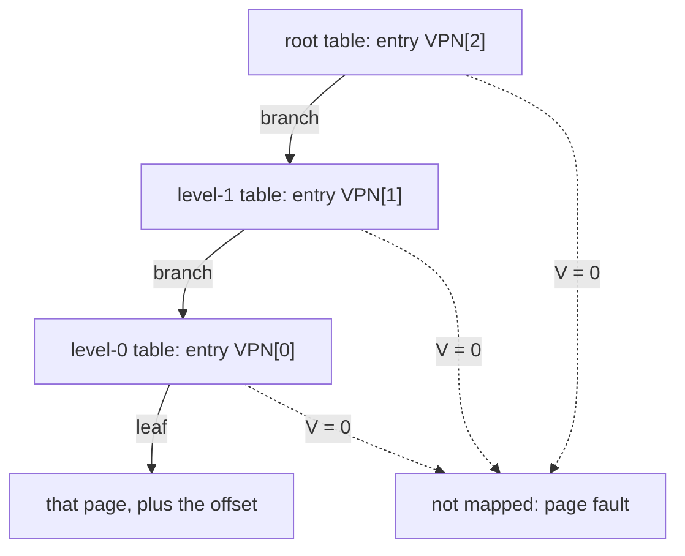

# Week 7 · From Reset to Page Tables: Boot, the Free List, and Sv39

> **Thu Oct 8** `31k_boot`, `32k_physical_memory` · **Fri Oct 9** `33k_paging`
>
> Read **Essentials** before Tuesday: it is what Thursday and Friday assume.
> **Going deeper** is optional and is not on the exam.

[Slides](07-cs326-2026-10-06-boot-physical-pages-and-sv39-slides.html){ .md-button }
[Thursday prep](../prep/07-cs326-2026-10-08-prep-boot-and-physical-memory.md){ .md-button }
[Friday prep](../prep/07-cs326-2026-10-09-prep-paging.md){ .md-button }

## This week { #this-week }

In `34k` every process gets a page table of its own, and in `48k` a user
program runs at virtual address 0 on RAM it cannot see past. Both rest on three
layers you build this week.

On Thursday your kernel boots: QEMU jumps to your first instruction, a few
lines of assembly give it a stack, and Rust prints over the serial port. Then
it carves RAM into 4 KiB pages on a free list. On Friday those pages
become Sv39 page tables. Midterm 1, Thursday Oct 15, covers everything through
`33k`; translation by hand is its longest question.

By Friday night your kernel boots, allocates pages, and translates addresses in
software, with the MMU still off.

---

## Essentials { #essentials }

### Thursday · `31k` Boot { #thu-31k }

Every kernel exercise starts when QEMU powers on and your first instruction
runs. `31k_boot` makes that instruction yours, and gets Rust printing.

#### The machine at reset { #31k-reset }

A `virt` machine starts one hart at `pc = 0x1000`, in machine mode, with paging
off. On a real board, firmware and a bootloader would run next. `oslings run`
passes `-bios none`, which removes both: a six-instruction boot ROM jumps
straight to `0x8000_0000`, where QEMU copied your kernel.

RAM begins there; the devices sit below it:

```text
0x0000_1000   boot ROM: six instructions, then a jump to RAM
0x0010_0000   test finisher: storing 0x5555 ends the run
0x0200_0000   CLINT: the timer from week 6
0x0c00_0000   PLIC: routes device interrupts
0x1000_0000   UART: a byte stored here reaches your terminal
0x8000_0000   RAM: 128 MiB, up to 0x8800_0000
```

Each device row is MMIO: to print, the kernel writes a byte to the UART's
address, with a volatile store.

#### The linker script puts you first { #31k-linker }

The **linker script**, `kernel.ld`, gives every section an address, so it must
place the entry code at exactly `0x8000_0000`:

```text
ENTRY( _entry )
SECTIONS {
  . = 0x80000000;
  .text : { *(.entry) *(.text .text.*) ... }
  ...                          then .rodata, .data and .bss
  PROVIDE(end = .);
}
```

Read `. = 0x80000000` as "place what follows here": the dot is the **location
counter**. `*(.entry)` comes first, and the entry function carries
`#[link_section = ".entry"]`, so it lands first. `ENTRY(_entry)` only records
`_entry`'s address in the ELF header, which the ROM never reads.

`PROVIDE(end = .)`, after `.bss`, names the first address past the image. Rust
reaches it as an external static:

```rust
extern "C" { static end: u8; }
let first_free = unsafe { &end as *const u8 as usize };
```

Read `static end: u8` as "some byte lives here". The byte is meaningless; its
address is the answer. It moves whenever the kernel grows, so it is a symbol,
not a constant.

#### A stack before any Rust { #31k-stack }

Almost every compiled function starts with a prologue that stores through `sp`
([week 6](06-cs326-2026-09-29-below-rust-assembly-unsafe-and-no-std.md#exam-prologue)).
At reset `sp` is garbage, and no Rust function can fix it, since its own
prologue runs first. So a hand-written assembly stub, the boot **trampoline**,
makes `sp` valid, then calls Rust.

The stack is a 16 KiB static array in the image, below `end`, so the allocator
never hands it out. Stacks grow down, so `sp` starts at the top:

```text
high   base + 16 KiB   <- sp starts here; each call moves it down
low    base            <- the array's own address names this end
```

Read the array's address as its bottom. Start `sp` there, and every push lands
below the array, on someone else's data.

> **The one thing to get right:** nothing prints; ten seconds later
> `oslings` reports a QEMU timeout and suggests checking the stack setup. The
> first prologue stored through a garbage `sp`; with the trap vector still 0,
> the machine faults forever before one byte reaches the UART.

### Thursday · `32k` The free list { #thu-32k }

From `33k` on, every page table is a page the kernel hands itself.
`32k_physical_memory` builds the allocator that hands pages out and takes them
back.

#### Why pages { #32k-pages }

RAM, `KERNBASE` (`0x8000_0000`) to `PHYSTOP` (`0x8800_0000`), is 128 MiB:
32,768 **pages** of 4096 bytes (`PGSIZE`). `kalloc` hands out a page nobody
uses, and `kfree` takes one back. With one block size, any free page fits any
request, so both are O(1).

An address is 2ᵏ-aligned when its low k bits are 0. A page starts at a multiple
of 4096, so it is **page-aligned**: in hex it ends in `000`, and dropping those
digits divides by 4096. `0x8002_3D40` ends in `40`, six zero bits: 64-byte
aligned, not page-aligned. The given `pgroundup` finds the first whole page
above the kernel by rounding `end` up:

```text
end                     0x8002_3D40
add 0xFFF               0x8002_4D3F   a partial page crosses its boundary
clear the low 12 bits   0x8002_4000   the first page the allocator may use
round down instead      0x8002_3000   the clear step alone
```

Read "clear the low 12 bits" as "zero the last three hex digits". The mask
works because 4096 is a power of two, so `PGSIZE - 1` is twelve ones. An
aligned address stays put: adding `0xFFF` cannot carry it past its boundary.

#### The intrusive free list { #32k-free-list }

The allocator must track 32,000 free pages without allocating memory, so each
free page stores the address of the next in its first 8 bytes. A list whose
links live inside its members is **intrusive**. A free needs no memory of its
own, so it cannot fail: the page being returned carries its own record.

Both operations work at the front of the list. Here are four, on pages
`0x8710_xxxx` named by their last four hex digits:

```text
                   head   first 8 bytes of each free page
start              3000   3000:2000   2000:1000   1000:null
allocate -> 3000   2000   2000:1000   1000:null
free 5000          5000   5000:2000   2000:1000   1000:null
allocate -> 5000   2000   2000:1000   1000:null
```

Read `5000:2000` as "page `0x8710_5000` holds `0x8710_2000`". The page freed
last comes out next: **LIFO**, last in, first out.

> **The one thing to get right:** the first allocation works, and the second
> returns the same page: `[fail] second kalloc reused or failed`. A free
> publishes a page by making the head name it. Publish it before writing its
> link, and the link records the page itself: a one-page loop, every other page
> lost. Write the link before you publish the node.

#### Building the list from `end` { #32k-building }

At boot the given code frees every whole page from the rounded-up `end` to
`PHYSTOP`, ascending: `(0x8800_0000 - 0x8002_4000) >> 12` = 32,732 pages for the
`end` above. Check it from the other end: RAM's 32,768 pages less the kernel's
36 (`0x2_4000 >> 12`) is 32,732. The last one freed, RAM's top page
`0x87FF_F000`, pops first, then `0x87FF_E000`, and on down.

The allocator does not zero pages. A page it returns holds its old contents and
a stale link in its first 8 bytes. Nothing reads that link once the page leaves
the list, so the allocator does not care; on Friday, a page table does.

### Friday · `33k` Sv39 page tables { #fri-33k }

From `48k` on, every user program runs at virtual address 0, on its own RAM;
`33k_paging` builds the tree of tables behind that. The MMU stays off, and a
software translator in the test reads your tree.

#### Why virtual memory { #33k-why }

The **MMU** translates every **virtual address** code uses into a **physical
address**, through a tree of tables the kernel builds: the **page table**. That
buys three things:

| | Without translation | With a table per process |
|---|---|---|
| Isolation | any program reaches any byte | unmapped pages do not exist for you |
| Relocation | code is built for where it lands | every program links at one address |
| Protection | RAM cannot tell code from data | each page has R, W and X bits |

Only the page number is translated. The low 12 bits, the **offset**, are copied
across, so an answer ends in the same three hex digits as its question.

#### Bits by hand { #33k-bits }

Friday's checks and the midterm's translations are shifts and masks in hex:

| Move | How | Example |
|---|---|---|
| Shift | `<< k` moves bits up; `>> k` drops the low k | `0x8_1234 << 12` = `0x8123_4000` |
| Mask | `(1 << n) - 1` is n ones; `x & !m` clears them | `0xFFF`, `0x3FF`, `0x1FF`: 12, 10, 9 |
| Extract | shift down, then mask | `(0x8123_4ABC >> 12) & 0x1FF` = `0x34` |
| Pack | shift into place, then OR | `0x5 << 4` = `0x50`; OR in `0x3`: `0x53` |

FAT file systems pack dates the same way:

```rust
// years since 1980 in bits 15..9, month in 8..5, day in 4..0
const fn pack_date(y: u16, m: u16, d: u16) -> u16 { (y << 9) | (m << 5) | d }
const fn month(date: u16) -> u16 { (date >> 5) & 0xF }
// pack_date(46, 10, 9) is 0x5D49; month(0x5D49) is 10
```

Read `(date >> 5) & 0xF` as "slide the month to bit 0, keep four bits". Without
the mask you get `0x2EA`, the year still attached.

#### The Sv39 address { #33k-address }

**Sv39** addresses have 39 bits: the offset under 27 bits of **virtual page
number** (VPN), cut into three 9-bit indices, one per level of the tree:

```text
 38        30 29        21 20        12 11          0
+------------+------------+------------+-------------+
|   VPN[2]   |   VPN[1]   |   VPN[0]   |   offset    |
+------------+------------+------------+-------------+
 root: 1 GiB  level 1: 2 MiB level 0: 4 KiB  byte in page
```

Read VPN[i] as `(va >> (12 + 9 * i)) & 0x1FF`, and the bottom row as how much
one entry at that level covers. Nine bits, because a table fills one page: 512
entries of 8 bytes, and 512 is 2⁹. A flat table for 2²⁷ pages would take 1 GiB
per process; a tree grows only where something is mapped, 12 KiB of tables for
a first page.

#### The page-table entry { #33k-pte }

A table holds 512 8-byte **page-table entries** (PTEs). Each packs a
**physical page number** (PPN), an address without its low 12 bits, into bits
53..10. Bits 9..0 are flags: `V` (1) valid, `R` (2) read, `W` (4) write, `X` (8)
execute, and `U` (16) reachable from user mode. As boxes:

```text
 63    54 53             10 9 8 7 6 5 4 3 2 1 0
+--------+-----------------+---+-+-+-+-+-+-+-+-+
|reserved|  PPN (44 bits)  |RSW|D|A|G|U|X|W|R|V|
+--------+-----------------+---+-+-+-+-+-+-+-+-+
```

R, W and X also decide the entry's kind. Valid with all three clear is a
**branch**, whose PPN names the next table. Valid with any of them set is a
**leaf**, whose PPN names the mapped page.

In Rust an entry is a newtype over `usize` with `#[repr(transparent)]`: its own
type, laid out exactly like its field. The same idea, on a framebuffer:

```rust
#[repr(transparent)]
pub struct Pixel(pub u32);

let fb = 0x8600_0000 as *mut Pixel;      // a 640-pixel-wide screen
let row1 = unsafe { fb.add(640) };       // 0x8600_0A00
```

Read `fb.add(640)` as "640 pixels along", 2,560 bytes, because `.add` counts
elements. On 8-byte entries, index 511 sits 4,088 bytes in: a table's last
entry.

#### Encode and decode by hand { #33k-encode }

Packing is `((pa >> 12) << 10) | flags`; unpacking is `(entry >> 10) << 12`,
with the flags in `entry & 0x3FF`. The shifts do not cancel: `>> 12` drops the
offset, and `<< 10` makes room for the flags. Encode `0x8123_4000` as V R W
(1 + 2 + 4 = 7):

```text
pa            0x8123_4000
pa >> 12      0x0008_1234   the PPN: three hex digits dropped
PPN << 10     0x2048_D000   << 8 appends 00, then multiply by 4
| flags       0x2048_D007   V R W: a leaf
```

Read it upward to decode. Make the low digit 1, and `0x2048_D001` is a branch
to a table at `0x8123_4000`. The classic slip is decoding with a shift of 12:
`0x2048_D000` looks plausible, is wrong, and fails Friday's first check.

#### The walk { #33k-walk }

Translation is three lookups from the root, one per level:



Each lookup is one 8-byte load from `table + index × 8`. One high address,
through the first three pages the allocator hands out:

```text
va 0x20_00A0_35F0:  VPN[2] 128,  VPN[1] 5,  VPN[0] 3,  offset 0x5F0

root at 0x87FF_F000, entry 128 = 0x21FF_F801   V only: table at 0x87FF_E000
level 1, entry 5               = 0x21FF_F401   V only: table at 0x87FF_D000
level 0, entry 3               = 0x2014_8C07   V R W: page at 0x8052_3000

pa = 0x8052_3000 | 0x5F0 = 0x8052_35F0
```

The tree holds only the tables some mapping needs, so this one address, mapped
into an otherwise empty root, costs two more pages. A table must be all zeros,
512 invalid entries, before any entry points at it. Checking R, W, X and U is
the hardware's job, not the walk's.

> **The one thing to get right:** every check passes, and much later a walk
> follows an entry nobody wrote. On a fresh boot an allocated page reads as
> empty: its only nonzero word is a link with bit 0 clear. A recycled page holds
> its last owner's bytes, and any word with bit 0 set looks valid.

### For the exam { #exam }

*Not needed on Thursday or Friday. On Midterm 1.*

**Decoding `satp`** · *Midterm 1.* `satp` holds MODE in bits 63:60 (8 is Sv39,
0 is off), an address-space ID in 59:44, and the root table's PPN in 43:0.
`0x8000_0000_0008_7FFF` is Sv39, with PPN `0x8_7FFF`: a root at `0x87FF_F000`.
{ #exam-satp }

**The top pages** · *Midterm 1.* `MAXVA` is `1 << 38` =
`0x40_0000_0000`, one bit short of 39, so no rv6 address needs sign extension.
`TRAMPOLINE`, the top page at `0x3F_FFFF_F000`, is R X in every table.
`TRAPFRAME`, one per process at `0x3F_FFFF_E000`, is R W. Neither has U.
{ #exam-maxva }

**Mapped, but not for the user** · *Midterm 1.* The kernel checks user-supplied
addresses with a software walk, `walkaddr`, which returns 0 at or above
`MAXVA`, for an unmapped page, or for a leaf without U. So the MMU
translates `TRAPFRAME` in supervisor mode, but `walkaddr` refuses it.
{ #exam-walkaddr }

**W⊕X** · *Midterm 1.* No page should be writable and executable at once, or
code can rewrite itself. Spot a leaf with both W (4) and X (8). Code belongs in
R X pages; stacks and data belong in R W pages.
{ #exam-wx }

**Reset to Rust** · *Midterm 1.* Each step needs the one before:
{ #exam-boot-order }

1. QEMU copies the ELF to its link addresses before any instruction runs.
2. Reset: `pc = 0x1000`, and the ROM jumps to `0x8000_0000`.
3. The entry stub is there, because the linker script put `.entry` first.
4. The stub points `sp` at the boot stack's top, using no stack itself.
5. Only then does it call Rust: `kmain` now, `start` from `43k`.

---

## Going deeper { #deeper }

*Optional. Nothing here is needed on Thursday or Friday, and nothing here is on
the exam.*

### The boot ROM up close { #deeper-rom }

Stop QEMU before its first instruction (`-S`) and ask its monitor: `pc` is
`0x1000`, and `satp`, `mtvec` and every general register are 0. QEMU zeroes them
as a courtesy; the spec does not, so silicon may hold anything. The ROM:

```asm
0x1000:  auipc  t0, 0          # t0 = 0x1000
0x1004:  addi   a2, t0, 40     # a2 = 0x1028, a table for OpenSBI
0x1008:  csrr   a0, mhartid    # a0 = 0, this hart's ID
0x100c:  ld     a1, 32(t0)     # a1 = 0x87E0_0000, the device tree
0x1010:  ld     t0, 24(t0)     # t0 = 0x8000_0000, the jump target
0x1014:  jr     t0
```

QEMU writes both loaded words into the ROM at startup. The **device tree** is a
description of the board, 2 MiB below `PHYSTOP`. rv6 ignores it and hardcodes
the `virt` board, which is why it boots there and nowhere else. Under OpenSBI,
`t0` would point at the firmware.

### Nineteen stores become one { #deeper-volatile }

Week 6's [deleted store](06-cs326-2026-09-29-below-rust-assembly-unsafe-and-no-std.md#deeper-emitted)
hits the boot banner too. Send the 19 bytes of `"\nrv6 is booting...\n"` to the
UART with plain stores, compile with `-O`, and the loop becomes one `sb` of the
final newline; the volatile version keeps all nineteen. `oslings` builds
without optimization, so the plain version passes every test.

### What the free list gives up { #deeper-free-list }

The free list stays small by refusing four jobs. It cannot promise adjacent
pages, which DMA buffers and superpages need. It does not zero. It detects
nothing: a double free makes a cycle ([Problem 4](#problem-4)). And it has no
lock.

A **bitmap** allocator keeps one bit per page: 32,768 pages need one page of
bits. Allocating means scanning, but k zero bits in a row are k contiguous
pages. A **buddy** allocator keeps a free list per power-of-two size. It splits
a larger block to serve a smaller request, and on free it merges a block with
its buddy, whose address differs in one bit, when both are free.

| | Free list | Bitmap | Buddy |
|---|---|---|---|
| Allocate / free | O(1) / O(1) | scan / O(1) | O(log n) / O(log n) |
| Bookkeeping outside the pages | one pointer | a bit per page | a list per size |
| Contiguous runs | no | yes | yes, by design |

### The rest of the PTE, and superpages { #deeper-pte }

All 64 bits, from the top:

```text
63    62..61   60..54     53..10   9..8   7   6   5   4   3   2   1   0
N     PBMT     reserved   PPN      RSW    D   A   G   U   X   W   R   V
```

`G` marks a mapping present in every address space, a hint for the TLB, the
MMU's cache of translations. `A` (accessed) and `D` (dirty) record use, for
paging to disk; hardware may set them or fault so the kernel can. QEMU sets them
itself, which is why rv6 never touches them. X W R = 010 and 110 are reserved.

A leaf need not sit at level 0: at level 1 it maps a 2 MiB **superpage**, and
at the root 1 GiB, from a physical address aligned to match. rv6 never builds
one. Mapping all 128 MiB of RAM with 4 KiB leaves takes a root, a level-1 table
and 64 level-0 tables, 66 pages; one 1 GiB leaf at root entry 2 would need none
below it.

### Week 10: the hardware reads your tree { #deeper-mmu-on }

On Friday only the test's software translator reads your tree. In `39k` you
build the kernel's own table, an identity map in which every address maps to
itself, check it with your walk while translation is off, and only then install
its root in `satp`. From `43k`, with the kernel in supervisor mode, the hardware
walks the tree on every access.

The hardware asks more than your walk: it stops at the first entry with R,
W or X, and it enforces them. So an interior entry with R set passes every
software check, then fails in hardware as a superpage leaf. With no trap handler
yet, that is a silent hang, which is why week 10 verifies first.

### How xv6 and Linux do it { #deeper-others }

xv6, rv6's C ancestor, also boots with `-bios none` at `0x8000_0000`, but starts
every hart, each on a 4 KiB slice of one stack array. Its allocator panics on a
misaligned or out-of-range free, fills pages with junk so stale data shows
early, and takes a spinlock.

Linux on RISC-V boots under OpenSBI, picks Sv57, Sv48 or Sv39 by what the
hardware supports, and takes physical pages from a buddy allocator.

### Practice problems { #problems }

#### Problem 1: The first pages out { #problem-1 }

A build puts `end` at `0x8002_7F08`, and `PHYSTOP` is `0x8800_0000`.

(a) Which page does the building loop free first, and which last? How many
pages go on the list?

(b) What do the first three allocations return?

(c) What is in the first 8 bytes of the third page from (b)? Does it matter?

<details markdown="1">
<summary>Click to reveal solution</summary>

**(a)**

```text
0x8002_7F08 + 0xFFF = 0x8002_8F07   clear the low 12 bits: 0x8002_8000, first
last page freed     = 0x8800_0000 - 0x1000 = 0x87FF_F000
pages               = (0x8800_0000 - 0x8002_8000) >> 12 = 0x7FD8 = 32,728
```

Check: 32,768 pages less the kernel's 40 (`0x2_8000 >> 12`) is 32,728.

**(b)** `0x87FF_F000`, `0x87FF_E000`, `0x87FF_D000`: pushed last, popped first.

**(c)** `0x87FF_C000`, the link written while the list was built. The list no
longer reads it, but a caller expecting zeros gets a pointer: an invalid PTE
only because page addresses have bit 0 clear.

</details>

#### Problem 2: Encode and decode { #problem-2 }

(a) Encode a user code page: physical `0x8034_5000` with V, R, X and U.

(b) Decode `0x0400_0017`: flags, address, leaf or branch. Should a kernel ever
build it?

(c) Decode `0x21FF_F801`. What would a decoder that shifts by 12 return?

<details markdown="1">
<summary>Click to reveal solution</summary>

**(a)** Flags are 1 + 2 + 8 + 16 = `0x1B`.

```text
0x8034_5000 >> 12   0x0008_0345
<< 8                0x0803_4500
times 4             0x200D_1400   that is << 10
| 0x1B              0x200D_141B
```

**(b)** `0x0400_0017 & 0x3FF` = `0x017` = V R W U: a leaf. `>> 10` is
`0x1_0000`, and `<< 12` is `0x1000_0000`: the UART, readable and writable from
user mode. No kernel should: with U, any program could drive the serial port
around the kernel.

**(c)** Flags `0x001`, V alone: a branch. `>> 10` is `0x8_7FFE`, so the next
table is at `0x87FF_E000`. Shifting by 12 gives `0x21FF_F000`: page-aligned,
plausible, and nowhere near the table.

</details>

#### Problem 3: Translate by hand { #problem-3 }

`satp` is `0x8000_0000_0008_0602`. The reachable tables hold only these
nonzero entries:

```text
table at 0x8060_2000:   [5]  = 0x2018_1C01
table at 0x8060_7000:   [3]  = 0x2018_0C01
table at 0x8060_3000:   [10] = 0x2024_5417
```

(a) Give the mode and the root table's address.

(b) Translate `0x1_4060_A7E4`, showing each VPN and the offset.

(c) Translate `0x1_4060_B7E4`.

(d) May user code store to the address in (b)? May it jump there?

<details markdown="1">
<summary>Click to reveal solution</summary>

**(a)** `satp >> 60` = 8, Sv39. The low 44 bits are PPN `0x8_0602`, so the root
is at `0x8060_2000`.

**(b)**

```text
va >> 30 = 0x5                            VPN[2] = 5
va >> 21 = 0xA03,     & 0x1FF = 0x003     VPN[1] = 3
va >> 12 = 0x1_4060A, & 0x1FF = 0x00A     VPN[0] = 10      offset 0x7E4

root [5]  = 0x2018_1C01   flags 0x001, branch   -> table 0x8060_7000
L1   [3]  = 0x2018_0C01   flags 0x001, branch   -> table 0x8060_3000
L0   [10] = 0x2024_5417   flags 0x017, V R W U  -> page  0x8091_5000
```

The physical address is `0x8091_5000 | 0x7E4` = **`0x8091_57E4`**.

**(c)** Only VPN[0] changes, to 11. Entry 11 of the level-0 table is 0, so V is
clear: not mapped, a page fault.

**(d)** A store is allowed: W and U are set. A jump is not: X is clear, so the
fetch faults.

</details>

#### Problem 4: A double free, drawn { #problem-4 }

The list is `head → 4000 → 9000 → 2000 → null`, for pages `0x8700_4000`,
`0x8700_9000` and `0x8700_2000`. The kernel allocates twice, frees the first
page it got, frees the second, then by mistake frees the first page again.

Draw the list after each step. Give the next three allocations, if nobody
writes to the pages. What went wrong, and why can the allocator not notice?

<details markdown="1">
<summary>Click to reveal solution</summary>

```text
start              head -> 4000 -> 9000 -> 2000 -> null
allocate -> 4000   head -> 9000 -> 2000 -> null
allocate -> 9000   head -> 2000 -> null
free 4000          head -> 4000 -> 2000 -> null
free 9000          head -> 9000 -> 4000 -> 2000 -> null
free 4000 again    4000's link becomes 9000, the head
                   head -> 4000 -> 9000 -> 4000 -> 9000 -> ...
```

The next three allocations return `4000`, `9000`, `4000`. Two callers now own
`0x8700_4000`, `9000` is next in line for a second owner, and `2000` is lost.

The allocator gets only an address: no size, no owner, no "allocated" bit.
Detecting a double free takes a walk of the whole list, or a bit per page: a
bitmap.

</details>

---

## Key terms { #terms }

| Term | Meaning | Where you use it |
|---|---|---|
| `-bios none` | No firmware: the ROM jumps straight to RAM | `31k` |
| Linker script | Gives each section an address; `.entry` goes first | `31k` |
| `end` | Linker symbol: the first address past the kernel image | `32k` |
| Boot trampoline | Assembly that makes `sp` valid, then calls Rust | `31k`, `43k` |
| Page | 4096 bytes: the unit of allocation and translation | `32k`, `33k` |
| Page-aligned | Low 12 bits zero; in hex, ends in `000` | `32k`, `33k` |
| Intrusive free list | Free pages linked through their first 8 bytes; LIFO | `32k`, `34k` |
| Virtual address | What code uses; the MMU maps it to physical | `33k`, `39k`, `48k` |
| VPN / PPN | Virtual / physical page number: no offset | `33k` |
| PTE | 8 bytes: the PPN at bit 10, flags in bits 9..0 | `33k`, `39k`, `48k` |
| Leaf / branch | Valid, with R, W or X / with none of them | `33k`, `39k` |
| `satp` | MODE plus the root table's PPN | `39k`, Midterm 1 |

## Further reading { #reading }

- [Code and output](../inclass/week07-examples.html): thirteen bare-metal
  programs that look at the machine running them under QEMU (the boot ROM's
  six instructions, where the linker put each byte, the stack, the free pages
  above it, and this page's PTE and Sv39 arithmetic), each beside what it
  printed, and nine files that must not compile.
- [Memory Map](../guides/memory-map.md#the-qemu-virt-physical-map): the full
  `virt` map, [`kernel.ld`, line by line](../guides/memory-map.md#kernelld-line-by-line)
  and [what the allocator does with `end`](../guides/memory-map.md#what-the-allocator-does-with-end).
- [Sv39 Paging](../guides/sv39-paging.md#splitting-a-virtual-address):
  [leaf or branch](../guides/sv39-paging.md#leaf-or-branch),
  [`satp`](../guides/sv39-paging.md#the-satp-register),
  [a translation by hand](../guides/sv39-paging.md#doing-a-translation-by-hand)
  and [mistakes that cost points](../guides/sv39-paging.md#mistakes-that-cost-points).
- [Unsafe Rust and no_std](../guides/rust-unsafe-nostd.md#pointer-arithmetic-with-add):
  `.add`, [`#[repr(transparent)]`](../guides/rust-unsafe-nostd.md#reprc-and-reprtransparent)
  and [linker symbols](../guides/rust-unsafe-nostd.md#extern-c-blocks).
- [QEMU and GDB](../guides/qemu-gdb.md#diagnostic-playbook): what silence
  means. [Exam Prep](../guides/exam-prep.md#shape-2-decode-the-bits) and the
  [Cheatsheet](../guides/cheatsheet.md#sv39-virtual-memory) you may bring.
- [The xv6 book](https://pdos.csail.mit.edu/6.828/2023/xv6/book-riscv-rev3.pdf),
  chapters 2 and 3.
- *Operating Systems: Three Easy Pieces*, chapters 17 and 18–20; the RISC-V
  privileged manual's Sv39 section.
