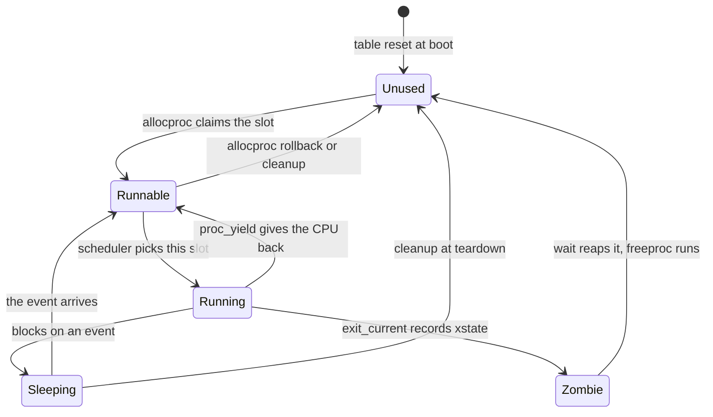
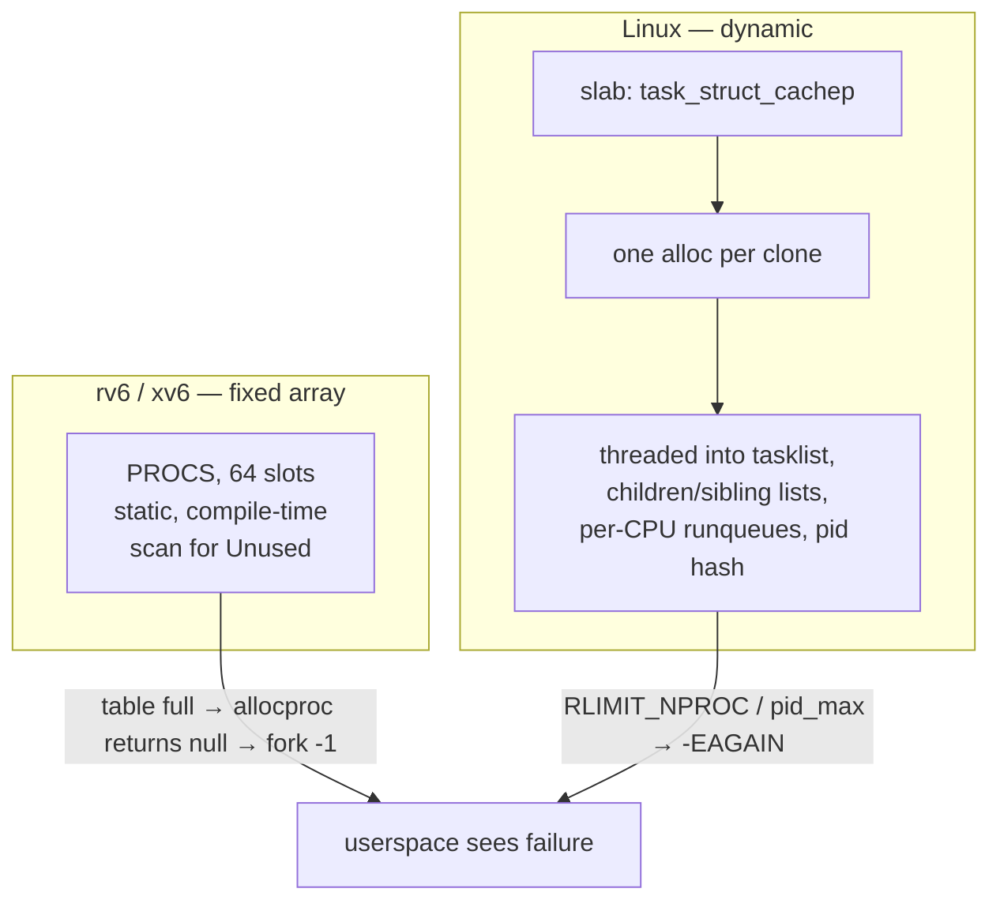

# Processes and the Process Control Block

## Overview

A process answers two questions at once: *what may this program touch*, and
*when may it run*. Textbooks answer with a metaphor — "a program in execution" —
which is true and useless. In rv6 the answer is a `struct`, and every field in it
exists because one of those two questions demanded it. This session derives that
struct, `Proc`, field by field: an identifier, a state, two separate register
saves, a page table root, a kernel stack, a parent link, and an exit status. We
then draw the five-state lifecycle (`Unused`, `Runnable`, `Running`, `Sleeping`,
`Zombie`) and name the exact line of kernel code that drives each transition. We
put `NPROC` of these blocks in a fixed static array and defend that choice
against the linked list you would reach for in userspace. Finally we set rv6's
`Proc` beside xv6's `struct proc` and Linux's `task_struct`, so you can see which
fields are *essential* and which are *scale*. The exercise is
`34k_processes`, on Thursday, October 22 — after Midterm 1 and fall break; see also [rv6 Architecture](../guides/rv6-architecture.md) and
[Sv39 Paging](../guides/sv39-paging.md).

## Learning Objectives

- **Define** a process operationally as the unit of isolation and the unit of scheduling.
- **Derive** each field of rv6's `Proc` from a question the kernel must answer about a running program.
- **Distinguish** the saved kernel context (`Context`) from the saved user registers (`Trapframe`).
- **Trace** a process through the `Unused → Runnable → Running → Zombie → Unused` lifecycle, naming the code site behind each edge.
- **Explain** what a Rust `enum` plus exhaustive `match` buys a kernel that an integer state code does not.
- **Justify** the fixed array `PROCS: [Proc; NPROC]`, and predict what the kernel does when the table is full.
- **Apply** manual ownership discipline to `allocproc`/`freeproc`, identifying leaks, double frees, and dangling pointers.
- **Compare** rv6's `Proc`, xv6's `struct proc`, and Linux's `task_struct`.

## Prerequisites

- **L11 Physical Memory** and exercise `32k_physical_memory` (Thursday, October 8) — `kalloc`/`kfree` hand out the pages a process owns.
- **L12 Virtual Memory I: Sv39 Page Tables** and exercise `33k_paging` (Friday, October 9) — a process's `pagetable` is the root you built there.
- **Exercises `04r`, `05r`** — `struct`, `impl`, `const fn`, `enum`, `match`; `ProcState` is the payoff for `05r`.
- **L09 Leaving std** and [Unsafe Rust and no_std](../guides/rust-unsafe-nostd.md) — `static mut`, raw pointers, `addr_of_mut!`.
- **L08 RISC-V Registers** and exercise `20a_asm_bridge` — `baby_swtch` already saved and restored a context by hand.
- The [Memory Map](../guides/memory-map.md) guide for `PGSIZE` and the QEMU `virt` layout.

---

## 1. A Process Is a Data Structure

The standard definition — "a process is a program in execution" — tells you
nothing you can implement. Here is a definition you can implement:

> **Key definition:** A process is the kernel's **unit of isolation** and its
> **unit of scheduling**. Isolation means the process has its own address space:
> a page table that decides which physical memory its loads and stores can reach.
> Scheduling means the process has its own saved execution state: enough register
> content that the kernel can stop it mid-instruction-stream and restart it later
> as if nothing happened.

Every PCB field serves one of those two jobs, or a third, smaller one:
**accounting** — the relationships and results the system needs after the process
is gone. If you cannot place a proposed field in one of those three buckets, it
probably does not belong in the PCB.

### Program versus process

A program is a passive file: instructions and initialized data. A process is the
kernel's live wrapper around one *run* of it. Run the same program three times
and you get three processes — three page tables, three register sets, three pids
— which may all point at the same instructions.

```text
     one program image                     three processes
     (bytes on disk)                       (kernel state)

     +---------------+          Proc slot 3      Proc slot 7      Proc slot 12
     |  .text        |          pid   = 4        pid   = 9        pid   = 11
     |  0x00: main   |  <-----  state = Running  state = Runnable state = Sleeping
     |  .rodata      |          pt    -> PT_A    pt    -> PT_B    pt    -> PT_C
     +---------------+          kstack-> page    kstack-> page    kstack-> page
                                sp/ra saved      sp/ra saved      sp/ra saved

     The instructions can be shared. Everything the kernel remembers
     about a *run* of them cannot be.
```

There is no "process object" hiding elsewhere. As far as every other module is
concerned, a process **is** its PCB: `usermode::curproc()` returns a `*mut Proc`
(`usermode.rs:238`), `sys_fork` gets one from `allocproc` (`syscall.rs:95`), and
the scheduler picks a process by picking a slot index. When we say "the kernel
kills process 7," the operation is a write to a struct field.

---

## 2. Deriving the PCB, Field by Field

Rather than memorize `Proc`, derive it. Ask what the kernel must be able to
answer about a program it manages; each question forces a field.

| The kernel must answer | Field | Type | rv6 |
|---|---|---|---|
| Which process is this? | `pid` | `usize` | `proc.rs:29` |
| Is it eligible to run right now? | `state` | `ProcState` | `proc.rs:28` |
| What memory may it touch? | `pagetable` | `*mut Pte` | `proc.rs:30` |
| Where do I resume it *in the kernel*? | `context` | `Context` | `proc.rs:33` |
| Where do I resume it *in user mode*? | `trapframe` | `*mut Trapframe` | `proc.rs:35` |
| Where does its kernel code push frames? | `kstack` | `usize` | `proc.rs:37` |
| What has it open? | `ofile` | `[File; NOFILE]` | `proc.rs:39` |
| Who should learn that it died? | `parent` | `*mut Proc` | `proc.rs:42` |
| What did it die with? | `xstate` | `isize` | `proc.rs:44` |
| What do I call it in a debug print? | `name` | `[u8; 16]` | `proc.rs:45` |

That is the whole of rv6's PCB — ten fields, `proc.rs:27-46`.

### Identity: `pid`

The slot index would work as a name, but slots are recycled. `pid` comes from a
monotonically increasing counter (`NEXTPID`, `proc.rs:66`, bumped by `alloc_pid`
at `proc.rs:89-93`), so it names *this run* of a program and is never reused
within a boot. A stale slot index silently refers to whichever process now
occupies the slot; a stale pid refers to nothing.

### Address space: `pagetable`

One `*mut Pte`: the physical address of the root Sv39 page table you built in
exercise `33k_paging`. This single pointer *is* the isolation — two processes with
different roots cannot see each other's memory, because the hardware translates
every user load and store through whatever root `satp` holds. The process
**owns** this page and everything reachable from it (§5).

### Two register saves, and why that is confusing

The genuinely confusing part of any PCB is that a process needs its registers
saved in **two different places for two different reasons**. Say so out loud
now, because students routinely conflate them:

- **`context: Context`** — 14 callee-saved registers (`ra`, `sp`, `s0`–`s11`),
  `swtch.rs:5-22`. A *kernel-to-kernel* snapshot, capturing the kernel's own
  execution when a process hands the CPU back to the scheduler. The scheduler
  `swtch`-es out of its own `Context` into this one (`usermode.rs:297`) and the
  process resumes in kernel code, on its own kernel stack, just after the `swtch`
  it called. Only 14 registers, because `swtch` is an ordinary function call and
  the compiler already spilled anything caller-saved.
- **`trapframe: *mut Trapframe`** — a whole 4 KiB page holding all 31 user
  registers plus `epc` and three kernel pointers (`usermode.rs:33-71`). A
  *user-to-kernel* snapshot, written by the trampoline on every trap. It must
  save **everything**, because a trap is not a function call: user code never
  agreed to lose a register.

> **Key distinction:** `Context` answers "where was this process's *kernel*
> execution?" and holds 14 registers. `Trapframe` answers "where was this
> process's *user* execution?" and holds 35 fields. A process being scheduled
> uses the first; a process trapping into the kernel uses the second. Both live
> in the same PCB, and they are never both in use at the same instant.

### Kernel stack: `kstack`

When a process traps into the kernel, kernel code runs *on that process's
behalf* and needs somewhere to push frames. It cannot use the user stack (user
memory is untrusted), and it cannot share one global kernel stack, because a
process can be suspended mid-syscall and resumed later — its half-finished kernel
frames must survive. So each process owns a page, and `usermode::ready`
(`usermode.rs:245-249`) sets `context.sp = kstack + PGSIZE`, since RISC-V stacks
grow down.

### Relationships and results: `parent`, `xstate`

`parent` (`proc.rs:42`) is how `wait` finds its children: `sys_wait` scans the
whole table for a slot whose `parent` equals the caller and whose state is
`Zombie` (`syscall.rs:147`). `xstate` (`proc.rs:44`) is the integer the process
passed to `exit`, stored by `exit_current` (`usermode.rs:373`) and copied out to
the parent's memory by `sys_wait` (`syscall.rs:149-152`). Those two fields are
the entire reason the `Zombie` state must exist — see §3.

### What the PCB points at

```mermaid
flowchart LR
    subgraph T["One PCB in static memory"]
        A["pid, state, xstate\nparent, name"]
        B["context (14 regs, inline)"]
        C["pagetable *mut Pte"]
        D["trapframe *mut Trapframe"]
        E["kstack usize"]
        F["ofile, 16 entries"]
    end
    C --> P1["root page table\n4 KiB from kalloc"]
    P1 --> P2["level-1 / level-0 tables\n+ user data pages"]
    D --> P3["trapframe page\n4 KiB from kalloc"]
    E --> P4["kernel stack page\n4 KiB from kalloc"]
    F --> P5["console / inode\nno page owned"]
```



Three fields are pointers to pages the process **owns** and must give back.
Everything else is inline, which is why a PCB can live in a static array with no
allocator at all.

### `const fn new` and the blank slot

`Proc::new()` (`proc.rs:49-62`) is a `const fn` returning a blank PCB: `Unused`,
pid 0, all pointers null. Being `const` lets the entire table be built at compile
time (§4), and it defines "empty" precisely enough that `freeproc` can restore it
(`proc.rs:139-158`).

Two things in the reference kernel are declared but never filled: `name` is
always zeros, and no rv6 code ever sets `ProcState::Sleeping`. Better to say so
than to pretend the struct is minimal.

---

## 3. The Process State Machine

A process is in exactly one of five states at all times. "Exactly one of a fixed
set of named alternatives" is precisely a Rust `enum`, so `ProcState`
(`proc.rs:18-25`) is one, with `#[derive(Clone, Copy, PartialEq, Eq)]` so a
state is a cheap value you can copy and compare.



Each edge is a specific write in the reference kernel:

| From | To | Event | Code |
|---|---|---|---|
| — | `Unused` | boot-time table reset | `proc.rs:74-87` |
| `Unused` | `Runnable` | a free slot is claimed | `proc.rs:112` |
| `Runnable` | `Running` | the policy chose this slot | `usermode.rs:293` |
| `Running` | `Runnable` | voluntary yield | `usermode.rs:364` |
| `Running` | `Zombie` | the process called `exit` | `usermode.rs:374` |
| `Zombie` | `Unused` | a parent's `wait` reaped it | `syscall.rs:153` |
| any live | `Unused` | teardown of a finished run | `usermode.rs:344-351` |

### Why `Runnable` and `Running` are separate

They mean different things to the scheduler. `Runnable` is "put me in the
lottery"; `Running` is "I hold the CPU, do not pick me again." The round-robin
policy filters on exactly one of them (`sched.rs:24`), so with a single combined
state a one-hart kernel would happily re-enter a process already on the CPU.

Linux does *not* keep them separate: `TASK_RUNNING` covers both, and "is it on a
CPU?" is answered from the runqueue. That is defensible where the runqueue is the
primary structure; for rv6, where the table *is* the runqueue, separate states
are cheaper and clearer.

### Why `Zombie` has to exist

The natural design is for `exit` to free the slot immediately. It cannot, for one
reason: **the exit status has an addressee**. The parent may not have called
`wait` yet, and it is entitled to that value; freeing the PCB would destroy the
status before delivery. So `exit_current` writes `xstate` and sets `Zombie`
(`usermode.rs:373-374`); the scheduler never picks a `Zombie` (it is not
`Runnable`); the slot lingers as a corpse holding one number until `sys_wait`
finds it, copies the status out, and calls `freeproc` (`syscall.rs:147-154`).

That is also why leaked zombies are a classic Unix bug: a parent that never calls
`wait` leaves slots occupied by processes holding no memory and running no code,
only a status nobody collected.

### What the `enum` actually buys you

Compare two ways of writing the policy filter:

```rust
// (a) comparison chain — compiles today, silently wrong tomorrow
if states[i] != ProcState::Unused && states[i] != ProcState::Zombie {
    return Some(i);
}

// (b) exhaustive match — the compiler is now on your side
match states[i] {
    ProcState::Runnable => return Some(i),
    ProcState::Unused | ProcState::Running
    | ProcState::Sleeping | ProcState::Zombie => continue,
}
```

Version (a) is a bug factory. Add a sixth state — say `Stopped` — and (a)
compiles unchanged and starts scheduling stopped processes. Version (b) fails
with `non-exhaustive patterns: ProcState::Stopped not covered`, and the compiler
names *every* site to revisit. In C, where `procstate` decays to `int`, you get
no such list.

> **Key distinction:** An integer state code lets you write `state = 7`. A Rust
> `enum` makes invalid states unrepresentable and makes adding a state a
> compile-time work list. That second property is the one that matters at kernel
> scale, and it costs nothing at runtime — `ProcState` is one byte.

rv6 mostly uses `==` rather than `match`, which is fine for a five-state enum you
can hold in your head — but it is exactly where the compiler stops helping.

---

## 4. The Process Table

```rust
static mut PROCS: [Proc; NPROC] = [const { Proc::new() }; NPROC];
static mut NEXTPID: usize = 1;
```

That is `proc.rs:65-66`, with `NPROC = 64` from `param.rs:7`. The whole table is
built at compile time by repeating a `const fn` — no allocator, no init-order
problem, nothing to fail at boot.

```text
  PROCS: [Proc; 64]   — one contiguous static array

  idx   state      pid   pagetable   kstack     parent
  ---   --------   ---   ---------   --------   ------
   0    Running      1   0x8020_1000 0x8020_5000  null      <- the shell
   1    Runnable     4   0x8020_9000 0x8020_a000  &PROCS[0] <- forked child
   2    Zombie       3   null        null         &PROCS[0] <- exited, unreaped
   3    Unused       0   null        0            null
   4    Unused       0   null        0            null
   ...
  63    Unused       0   null        0            null

  allocproc scans 0..64 for the first Unused slot     -> proc.rs:108-110
  a full scan that finds none returns null            -> proc.rs:134
```

### Why an array and not a list

In userspace you would reach for a growable list. In a kernel an array wins:

1. **No allocator dependency.** The table must exist before, and independently
   of, the memory allocator — the allocator is itself a service processes use. A
   `static` array is live the instant `.bss` is zeroed at boot.
2. **Bounded memory.** 64 PCBs, sized at compile time. A kernel that can grow a
   core structure without limit can be pushed into exhausting its own memory by a
   userspace fork bomb.
3. **Index equals identity, cheaply.** The scheduler copies every state into a
   plain `[ProcState; NPROC]` and hands that slice to the policy
   (`usermode.rs:285-288`), which returns an index (`sched.rs:20-29`). With a
   list, that snapshot is a pointer chase under a lock.
4. **No allocation on the fork path.** `fork` must not fail because the *table*
   could not grow; failing because it is *full* is a much easier condition to
   reason about.
5. **Deterministic worst case.** An O(NPROC) scan with no indirection — for 64
   entries, a handful of cache lines.

The cost is a hard ceiling — exactly what check 3 in exercise `34k_processes`
verifies.

### What happens when the table is full

Nothing dramatic — and that is the design goal. `allocproc` scans all `NPROC`
slots, finds none `Unused`, and returns `ptr::null_mut()` (`proc.rs:134`).
`sys_fork` checks for null and returns `-1` (`syscall.rs:96-98`). The user
program sees a failed `fork`; the kernel never panics, blocks, or grows.

Linux does the same through a different mechanism: `fork` returns `-EAGAIN` when
`RLIMIT_NPROC` or the pid space is exhausted. **Resource exhaustion in the kernel
becomes an error return in userspace, never a kernel failure.**

### pids and slots are different things

`NEXTPID` only increases; slot indices are recycled the moment a process is
freed, so slot 3 may hold pid 5, then 41, then 208. Two consequences:

- Any structure remembering a process by **index** is wrong the instant that slot
  is reused. Remember pids for anything that must outlive the process.
- Any structure remembering a process by **`*mut Proc`** has the same problem,
  because the pointer *is* the slot address. This is the trap in `parent` —
  see §5 and Problem 6.

### Raw pointers into a `static mut`

Every access goes through `ptr::addr_of_mut!(PROCS[i])` (`proc.rs:71`, exposed as
`proc_at`), never a `&mut`. Two `&mut` references into the same static is instant
undefined behavior, and the process table is precisely the structure the whole
kernel wants to poke at simultaneously. Raw pointers keep the compiler from
making aliasing assumptions we cannot honor.

---

## 5. Ownership Without the Borrow Checker

A PCB is not just a record; it is an **owner**. Three of its fields point at
pages that came from `kalloc` and must go back to `kfree` exactly once.

Notice that `Proc` deliberately does **not** derive `Copy`. Copying a PCB would
produce two structs each claiming to own the same page table — the exact thing
ownership forbids. Rust's type system will not enforce that for us here (we are
below the borrow checker, on raw pointers into a static), so we enforce it by
hand, with the same rule: **one owner, one release**.

```text
  allocproc — acquire in order, roll back on any failure   (proc.rs:107-135)

  find Unused slot ......... proc.rs:108-110
       |
  pid = alloc_pid() ........ proc.rs:111       \
  state = Runnable ......... proc.rs:112        |  cheap, cannot fail
  parent = null, xstate = 0  proc.rs:113-114   /
       |
  pagetable = create_pagetable()  proc.rs:116   \
  trapframe = kalloc()            proc.rs:117    |  3 pages, any may fail
  kstack    = kalloc()            proc.rs:118   /
       |
  any of the three null? ---- yes ---> freeproc(p);  return null
       |                                     proc.rs:119-122
       no
       |
  zero the trapframe ....... proc.rs:123
  ofile[0..3] = console .... proc.rs:127-130
  return p ................. proc.rs:131
```

The rollback path is the interesting one. `allocproc` calls `freeproc` on a
*half-built* process, so `freeproc` (`proc.rs:139-158`) tolerates any field still
being null or zero — every release is guarded — and each release is immediately
followed by nulling the field:

```rust
if !(*p).trapframe.is_null() {
    kalloc::kfree((*p).trapframe as *mut u8);
    (*p).trapframe = ptr::null_mut();   // <- not optional
}
```

Dropping that second line does not break the happy path — the next `allocproc`
overwrites the field anyway. It breaks the *unhappy* path: call `freeproc` twice
on a slot and one physical page lands on the free list twice. Two future
processes then receive the same page as their page table root and quietly destroy
each other, minutes later, in unrelated code.

> **Key distinction:** A leak costs you a page. A double free costs you the
> integrity of the allocator, and the symptom appears arbitrarily far from the
> cause. When you are unsure, leak.

Order matters too. `freeproc` releases the owned pages *first* and sets
`state = Unused` **last** (`proc.rs:157`). Once a slot is `Unused`, anyone may
claim it; flip the state first and a concurrent `allocproc` could take the slot,
install a fresh page table, and have your trailing `free_pagetable` free *its*
page. On a single hart with interrupts off the wrong order is survivable — until
exercise `37k_spinlocks`. xv6 solves it generally with a per-process
`struct spinlock lock` held across every state change.

### The dangling `parent` pointer

`has_children` (`proc.rs:173-181`) and `sys_wait` (`syscall.rs:147`) both compare
`(*q).parent == p` — pointer equality against a slot address. Free a parent while
a child still exists and the child's `parent` points at a recycled slot, so an
unrelated process inherits a child it never forked. rv6 sidesteps this by tearing
whole trees down together (`usermode.rs:344-351`); real Unix **reparents** orphans
to `init` instead. Problem 6 works the failure through.

---

## 6. Three PCBs: rv6, xv6, Linux

Same idea at three scales. The point is not to memorize Linux, but to see how
small the essential core is.

| Concern | rv6 `Proc` | xv6 `struct proc` | Linux `task_struct` |
|---|---|---|---|
| Identity | `pid: usize` | `int pid` | `pid`, `tgid`, per-namespace `struct pid` |
| State | `ProcState` (5) | `enum procstate` (6, adds `USED`) | `__state` bitmask + `exit_state` |
| Address space | `pagetable: *mut Pte` | `pagetable_t pagetable`, `uint64 sz` | `struct mm_struct *mm`, `*active_mm` |
| Kernel regs | `Context` (14) | `struct context` (14) | `struct thread_struct thread` (arch-specific) |
| User regs | `*mut Trapframe` (page) | `struct trapframe *` | on the kernel stack (`struct pt_regs`) |
| Kernel stack | `kstack: usize` (4 KiB) | `uint64 kstack` (4 KiB) | `void *stack` (16 KiB on x86-64) |
| Open files | `[File; 16]` inline | `struct file *ofile[16]` | `struct files_struct *files` (shareable) |
| Cwd | — | `struct inode *cwd` | `struct fs_struct *fs` |
| Parent | `parent: *mut Proc` | `struct proc *parent` | `real_parent`, `parent`, `children`, `sibling` lists |
| Exit result | `xstate: isize` | `int xstate` | `exit_code`, `exit_signal` |
| Blocking | `Sleeping` (unused) | `void *chan` + `SLEEPING` | wait queues, `TASK_INTERRUPTIBLE`/`UNINTERRUPTIBLE` |
| Locking | none yet | `struct spinlock lock` | many, plus RCU |
| Debug name | `name: [u8; 16]` | `char name[16]` | `comm[TASK_COMM_LEN]` — also 16 |
| Where it lives | `[Proc; 64]` static array | `struct proc proc[NPROC]`, `NPROC = 64` | slab cache, unbounded up to limits |
| Scheduler data | slot index only | slot index only | `sched_entity`, `sched_rt_entity`, priority, `cpus_mask`, … |

Three observations.

**The essential core is seven fields.** Identity, state, address space, saved
registers, kernel stack, parent, exit status. rv6 has exactly them, plus open
files. Everything Linux adds answers a requirement rv6 does not have: multiple
CPUs, namespaces, cgroups, capabilities, audit, seccomp, several scheduling
classes, RCU-safe teardown.

**Linux's `task_struct` is a thread, not a process.** A Linux "process" is a
*thread group*: several `task_struct`s sharing one `tgid`, one `mm_struct`, and
one `files_struct`. `getpid()` returns the `tgid`; the per-thread id is the
`pid`. That inversion is the most confusing thing about reading Linux process
code, and it comes from `clone()`, which lets the caller choose field-by-field
what the child shares. rv6's `fork` is `clone()` with everything unshared.

**The 16-byte name survives everywhere.** rv6's `name: [u8; 16]`, xv6's
`char name[16]`, Linux's `comm[TASK_COMM_LEN]` with `TASK_COMM_LEN == 16`. That
is why `ps` truncates long command names — a 1970s buffer size still visible in
your terminal.



Different mechanisms, same contract at the boundary.

---

## 7. What Is Not in the PCB Yet

The `Proc` you build in exercise `34k_processes` is smaller than the one quoted
here. It grows on a schedule:

- **`context`** arrives with exercise `35k_context_switch`, when `swtch` gives the
  kernel something to save into.
- **The scheduler's use of `state`** arrives with `36k_scheduling`, where your
  round-robin policy reads a `[ProcState; NPROC]` snapshot.
- **`trapframe` and `kstack`** matter from `43k_traps` and `48k_user_mode` onward,
  once there is a user mode to trap out of.
- **`ofile`** fills in at `50k_file_descriptors`.
- **`parent` and `xstate`** become load-bearing at `51k_fork_wait`.

Today's job is the skeleton and the two operations that manage it: claim a slot,
give it back. `oslings run 34k_processes` checks allocation, pid uniqueness, the
`NPROC` ceiling, refusal when full, and clean reuse after a free. Read its
`README.md` for the how; this page was the why.

---

## Key Concepts

| Concept | Definition | Example |
|---|---|---|
| Process | The unit of isolation (own address space) and scheduling (own saved registers) | `PROCS[3]` with pid 7, its own page table and kstack |
| PCB | The kernel's record of one process; in rv6, `struct Proc` | `proc.rs:27-46`, ten fields |
| Process table | The fixed static array holding every PCB | `static mut PROCS: [Proc; NPROC]`, `proc.rs:65` |
| `NPROC` | Compile-time ceiling on live processes | `64`, `param.rs:7` |
| `ProcState` | Five-variant enum: the process lifecycle | `Unused`, `Runnable`, `Running`, `Sleeping`, `Zombie` |
| pid | Monotonic per-boot identifier, never reused | `NEXTPID` starts at 1, `proc.rs:66` |
| Slot index | Position in `PROCS`; recycled on free | slot 3 may hold pid 5, then pid 41 |
| `Context` | 14 callee-saved registers: kernel-to-kernel resume point | `ra`, `sp`, `s0`–`s11`, `swtch.rs:5-22` |
| `Trapframe` | Full user register snapshot, one page per process | 35 fields, `usermode.rs:33-71` |
| Kernel stack | Per-process page for kernel frames during a syscall | `context.sp = kstack + PGSIZE`, `usermode.rs:248` |
| Zombie | Exited but unreaped; holds only `xstate` for its parent | `exit_current` sets it, `usermode.rs:374` |
| Ownership discipline | One owner per page; `allocproc` acquires, `freeproc` releases once | `freeproc` nulls each pointer after `kfree`, `proc.rs:142-153` |

---

## Practice Problems

### Problem 1: Slots, pids, and reuse

Starting from a freshly `init`-ed table, the kernel executes:

```text
a = allocproc();
b = allocproc();
c = allocproc();
freeproc(b);
d = allocproc();
freeproc(a);
freeproc(c);
e = allocproc();
f = allocproc();
```

Give the slot index and pid for each of `a` through `f`. Then state whether
`d == b` and whether `(*d).pid == (*b).pid` at the moment `d` is returned.

<details>
<summary>Click to reveal solution</summary>

`allocproc` always takes the **first** `Unused` slot (`proc.rs:108-110`), and
`alloc_pid` always hands out the next integer (`proc.rs:89-93`).

| Var | Slot | pid | Why |
|---|---|---|---|
| `a` | 0 | 1 | first free slot; `NEXTPID` starts at 1 |
| `b` | 1 | 2 | |
| `c` | 2 | 3 | |
| `d` | 1 | 4 | slot 1 was freed, so it is the first `Unused` again |
| `e` | 0 | 5 | after freeing `a` (slot 0) and `c` (slot 2), slot 0 is first |
| `f` | 2 | 6 | next free slot |

`d == b` is **true**: both are `ptr::addr_of_mut!(PROCS[1])`. `(*d).pid ==
(*b).pid` is **false** — `b` named pid 2, `d` names pid 4 — but since they are
the same pointer, `(*b).pid` now *also* reads 4. The old value is gone. That is
the hazard of remembering a process by pointer or index: the identity you meant
lives in `pid`, not in the address.

</details>

### Problem 2: Find the bug in `freeproc`

A student submits this `freeproc`. The exercise's tests pass. Describe two
distinct failure modes it introduces anyway, and say which one is worse.

```rust
pub unsafe fn freeproc(p: *mut Proc) {
    (*p).state = ProcState::Unused;
    (*p).pid = 0;
    free_pagetable((*p).pagetable);
}
```

<details>
<summary>Click to reveal solution</summary>

**Bug 1 — the pointer is never nulled.** `(*p).pagetable` still holds the address
of a page that is now on the free list. Call `freeproc` on that slot again — which
happens on the `allocproc` rollback path (`proc.rs:119-122`) and in
`cleanup_except` (`usermode.rs:344-351`) — and the page is freed twice, landing on
the free list twice. Two future `kalloc` callers then receive the same page, share
a page table root, and corrupt each other.

**Bug 2 — the state is cleared before the resource is released.** Between
`state = Unused` and `free_pagetable` the slot advertises itself as free while
still holding a live page table. Anything running in that window — an interrupt
handler, or another hart under SMP — can `allocproc` this slot, install a *fresh*
page table, and have the trailing `free_pagetable` free the new process's root.

Bug 2 is worse: bug 1 needs a double `freeproc`, but bug 2 needs only a
badly-timed interrupt, and it is invisible on a single hart with interrupts off —
it passes every test today and fails after exercise `37k_spinlocks`. Compare
`proc.rs:139-158`: every release guarded, every pointer nulled immediately after
its `kfree`, `state = Unused` **last**.

</details>

### Problem 3: The abandoned slot

An `allocproc` written like this passes exercise `34k_processes`:

```rust
(*p).pid = alloc_pid();
(*p).state = ProcState::Runnable;
(*p).pagetable = create_pagetable();
if (*p).pagetable.is_null() {
    return ptr::null_mut();          // out of memory
}
return p;
```

Physical memory runs out and `create_pagetable` returns null. Describe the state
of the table afterwards, and predict what the exercise-06 scheduler does when it
next runs. Then explain what `proc.rs:119-122` does differently.

<details>
<summary>Click to reveal solution</summary>

The slot is left **`Runnable` with a null `pagetable`**, and a pid is consumed.
Three consequences:

1. **The slot is lost forever.** It is not `Unused`, so no future `allocproc`
   reclaims it. Repeat the failure 64 times and the table is permanently full
   while holding zero real processes.
2. **The scheduler will pick it.** `sched.rs:24` filters on `Runnable` and this
   slot qualifies; `usermode.rs:293` marks it `Running` and `usermode.rs:297`
   `swtch`-es into `(*p).context`, which is all zeros. `ra` is 0, so `swtch`'s
   `ret` jumps to address 0 — an instruction-fetch fault the kernel cannot
   attribute to anything.
3. **The caller cannot tell.** `sys_fork` sees null and reports `-1`
   (`syscall.rs:96-98`); the user program believes nothing happened, but the
   kernel is booby-trapped.

The reference kernel calls `freeproc(p)` first (`proc.rs:119-122`). Because
`freeproc` tolerates half-built processes it releases whichever pages were
allocated and resets the slot to `Unused`, leaving the table as it was; only the
pid is spent, which is harmless. The rule: **a constructor that fails partway
must undo everything it did**, and the cheapest way to guarantee that is a
destructor safe to call on a partial object.

</details>

### Problem 4: Legal and illegal transitions

For each transition, say whether rv6 as written can perform it, and if so name
the function that does. If not, explain what would have to change.

1. `Running → Runnable`
2. `Zombie → Runnable`
3. `Unused → Running`
4. `Running → Unused`
5. `Runnable → Sleeping`

<details>
<summary>Click to reveal solution</summary>

1. **Yes.** `proc_yield` (`usermode.rs:363-366`) sets `Runnable` and `swtch`-es
   back to the scheduler; `sys_wait` uses it to block-and-retry
   (`syscall.rs:165`).
2. **No, and it must never happen.** A `Zombie` already ran `exit_current` and
   `swtch`-ed away for good — `usermode.rs:376` is literally `unreachable!()`.
   Its user memory may be gone; resurrecting it would run a process with a freed
   address space.
3. **No.** `allocproc` produces `Runnable`, never `Running` (`proc.rs:112`). The
   intermediate state matters: a brand-new process has not yet had
   `usermode::ready` set up its `context`, so it is not safe to `swtch` into. xv6
   makes this explicit with a sixth state, `USED` — "slot claimed, process not
   yet built."
4. **Yes, but only via teardown.** `cleanup_except` (`usermode.rs:344-351`) calls
   `freeproc` on every non-`Unused` slot whatever its state. The normal path is
   `Running → Zombie → Unused`.
5. **No.** Nothing in rv6 ever writes `ProcState::Sleeping`; the only mention is
   the declaration at `proc.rs:23`. Reaching it needs a `sleep(chan)` that parks
   a process on a wait channel and a `wakeup(chan)` that returns every sleeper on
   that channel to `Runnable`. rv6 uses yield-and-retry instead — correct, but it
   burns CPU: a waiting process is scheduled repeatedly only to find it still has
   nothing to do.

</details>

### Problem 5: How big is the process table?

Assume the reference kernel's `Proc` (`proc.rs:27-46`) is laid out in
declaration order with natural alignment on `riscv64gc` (8-byte `usize`,
8-byte pointers, 1-byte fieldless enums), that `Context` is 14 `usize` values,
and that `File` is `{FileKind, usize, usize, bool, bool}` with `NOFILE = 16`.

Compute (a) `size_of::<File>()`, (b) `size_of::<Proc>()`, (c) the size of
`PROCS`, and (d) how many 4 KiB pages that occupies.

<details>
<summary>Click to reveal solution</summary>

**(a) `File`** (`file.rs:40-50`):

| Field | Offset | Size |
|---|---|---|
| `kind: FileKind` | 0 | 1 (+7 pad) |
| `inum: usize` | 8 | 8 |
| `off: usize` | 16 | 8 |
| `readable: bool` | 24 | 1 |
| `writable: bool` | 25 | 1 (+6 tail pad) |

`size_of::<File>() = 32`, align 8.

**(b) `Proc`:**

| Field | Offset | Size |
|---|---|---|
| `state` | 0 | 1 (+7 pad) |
| `pid` | 8 | 8 |
| `pagetable` | 16 | 8 |
| `context` | 24 | 112 (14 × 8) |
| `trapframe` | 136 | 8 |
| `kstack` | 144 | 8 |
| `ofile` | 152 | 512 (16 × 32) |
| `parent` | 664 | 8 |
| `xstate` | 672 | 8 |
| `name` | 680 | 16 |

`size_of::<Proc>() = 696` bytes.

**(c)** 64 × 696 = **44,544 bytes ≈ 43.5 KiB**.

**(d)** 44,544 / 4096 = 10.875 → **11 pages** of `.bss`, reserved at compile time
whether or not a single process ever runs.

Note what dominates: `ofile` is 512 of the 696 bytes — 74% of the PCB is the
open-file table. That is exactly why xv6 and Linux store `struct file *`
*pointers* instead of inline structs, and why Linux factors the table into a
refcounted `files_struct` that threads share. Contrast the `Proc` you build in
exercise `34k_processes`: four fields, 40 bytes, 2.5 KiB of table. The PCB grows
about 17× over the semester, and every byte answers a requirement.

</details>

### Problem 6: The parent that came back wrong

rv6 identifies a parent by pointer: `has_children` (`proc.rs:173-181`) and
`sys_wait` (`syscall.rs:147`) both test `(*q).parent == p`.

Suppose rv6 freed a process's slot as soon as it exited, instead of tearing the
whole tree down at the end of `run`. Trace this scenario and say exactly what
goes wrong:

```text
1. Process P occupies slot 3, pid 7. P forks child C -> slot 4, pid 8.
2. P exits and its slot is freed immediately.
3. An unrelated allocproc claims slot 3 for a new process N, pid 9.
4. N calls wait().
```

Then name the mechanism real Unix kernels use to prevent this.

<details>
<summary>Click to reveal solution</summary>

At step 2, `C`'s `parent` still holds `&PROCS[3]`. Freeing `P` cannot find that
reference: nothing points *from* a parent *to* its children — the relationship
lives only in the child, as a raw pointer.

At step 3, slot 3 is reused, so `N`'s address is `&PROCS[3]` — exactly the value
in `C`'s `parent`.

At step 4, `sys_wait` evaluates `(*C).parent == N`, which is `true`:

- `has_children(N)` reports a child, so `wait` blocks instead of returning `-1`,
  even though `N` never forked.
- When `C` exits, `N` reaps it — reads `C`'s `xstate`, copies it into `N`'s
  address space, frees `C`'s slot, returns pid 8, a pid `N` never saw. The status
  went to the wrong place and a stranger destroyed someone else's child.

This is a dangling pointer plus slot reuse — an ABA problem — and the pointer
comparison makes it silent: the *value* matches, so no check fires.

Real kernels **reparent**. xv6's `reparent()` walks the table during exit and
hands every child of the exiting process to `initproc` (pid 1), under
`wait_lock`. Linux does the same in `forget_original_parent()`, using the
`children`/`sibling` lists so it needs no scan, falling back to the nearest
sub-reaper or `init`. The invariant either way: **no `parent` pointer outlives
the process it names** — which is why `init` must never exit.

rv6 avoids the question by construction: `run` frees every process except the
root together at the end (`usermode.rs:344-351`), so a parent never disappears
while a child is live. A fair simplification for a teaching kernel, and one that
works only because rv6 has no long-running process tree.

</details>

---

## Further Reading

- [rv6 Architecture](../guides/rv6-architecture.md) — where `proc.rs` sits relative to `vm.rs`, `sched.rs`, and `usermode.rs`.
- [Sv39 Paging](../guides/sv39-paging.md) — what the `pagetable` field actually points at.
- [Memory Map](../guides/memory-map.md) — `PGSIZE`, `KERNBASE`, and where `.bss` (and therefore `PROCS`) lives.
- [Unsafe Rust and no_std](../guides/rust-unsafe-nostd.md) — `static mut`, `addr_of_mut!`, and why raw pointers instead of `&mut`.
- [Key Concepts](../guides/key-concepts.md) and [Exam Prep](../guides/exam-prep.md) — the PCB and the state machine are Midterm 1 material.
- Exercise `34k_processes` `README.md` — the implementation walkthrough for `allocproc` and `freeproc`.
- xv6-riscv, `kernel/proc.h` and `kernel/proc.c` — read `allocproc`, `freeproc`, `reparent`, and `wait` side by side with rv6's.
- *xv6: a simple, Unix-like teaching operating system* (Cox, Kaashoek, Morris), chapter 1 ("Operating system interfaces") and chapter 7 ("Scheduling").
- Linux `include/linux/sched.h` — find `struct task_struct` and count how many of its fields you can place in the three buckets from §1.
- Bach, *The Design of the UNIX Operating System* (1986), chapter 6 — the original `proc`/`u-area` split and why modern kernels merged them.

---

## Summary

1. **A process is two guarantees, not a metaphor.** It is the unit of isolation
   (its own address space) and the unit of scheduling (its own saved registers).
   Every PCB field serves one of those, or the third job of accounting.
2. **The PCB is the process.** rv6's `Proc` (`proc.rs:27-46`) is ten fields, and
   every other module names a process by `*mut Proc`. There is no other
   representation.
3. **A PCB needs two register saves.** `Context` (14 registers, `swtch.rs:5-22`)
   resumes kernel execution from the scheduler; `Trapframe` (35 fields, a whole
   page, `usermode.rs:33-71`) resumes user execution after a trap. Conflating
   them is the most common misreading of a PCB.
4. **Five states, and every edge has a code site.** `Unused → Runnable` at
   `proc.rs:112`, `Runnable → Running` at `usermode.rs:293`, `Running → Zombie`
   at `usermode.rs:374`, `Zombie → Unused` at `syscall.rs:153`. `Zombie` exists
   solely because the exit status has an addressee who may not have asked yet.
5. **The enum buys a compile-time work list.** Exhaustive `match` means adding a
   sixth state makes the compiler name every site that must change. An integer
   state code gives you a code review and hope — and the enum costs one byte.
6. **A fixed array beats a list in a kernel.** `PROCS: [Proc; 64]`
   (`proc.rs:65`, `param.rs:7`) needs no allocator, bounds memory, and keeps
   allocation off the `fork` path. Its cost is a hard ceiling; hitting it returns
   null (`proc.rs:134`), which becomes `fork` returning `-1` — an error in
   userspace, never a kernel failure.
7. **Ownership is a discipline you keep by hand.** A PCB owns three pages.
   `allocproc` acquires them and rolls back completely on failure
   (`proc.rs:119-122`); `freeproc` releases each, nulls the pointer immediately,
   and sets `Unused` last (`proc.rs:139-158`). Leak a page and you lose 4 KiB;
   free it twice and you lose the allocator.
8. **The essential PCB is seven fields; the rest is scale.** rv6, xv6, and Linux
   agree on identity, state, address space, saved registers, kernel stack,
   parent, and exit status. Everything Linux adds — namespaces, cgroups,
   scheduling classes, RCU teardown, per-task locks — answers a requirement rv6
   does not have. Exercise `34k_processes` builds the seven.
