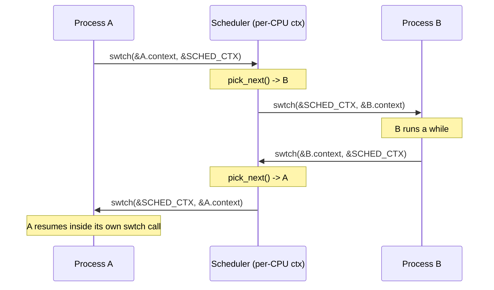
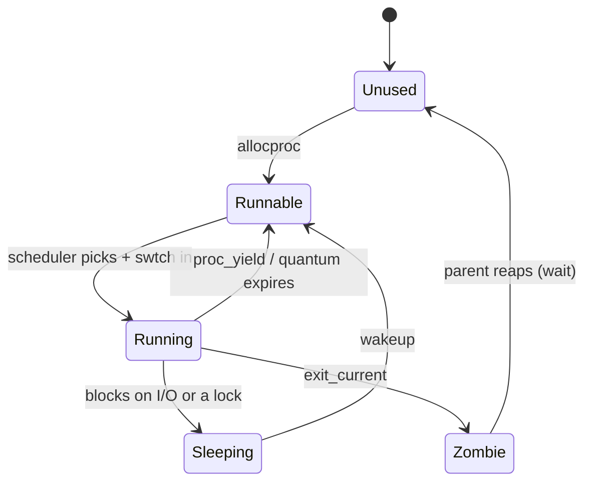

# The Context Switch and the Scheduler

## Overview

Everything so far has run exactly once, start to finish: `kmain` boots, sets up
memory, builds a process table, and stops. This session is where one CPU starts
pretending to be many. The first half is **mechanism** — `swtch`, fourteen stores
and fourteen loads and a `ret` that returns into a different thread of execution.
You already wrote a four-register version of it as `baby_swtch` in `20a_asm_bridge`;
today we read the real one line by line, then the double switch (process → scheduler
→ process) that rv6 routes every transition through. The second half is **policy** —
who runs next, and why that question is kept out of the assembly. We build round
robin, then survey FCFS, SJF, priority, MLFQ, and CFS precisely enough to compare
them numerically. This is the concept behind exercises `35k_context_switch` and
`36k_scheduling`, both on Friday, October 23; see also the [RISC-V guide](../guides/riscv.md).

## Learning Objectives

- **Explain** why a context switch saves only the callee-saved registers, and
  where the caller-saved ones actually are at that moment.
- **Trace** `swtch` instruction by instruction, naming what is in every register
  at entry, at the midpoint, and after `ret`.
- **Describe** what `#[repr(C)]` guarantees, what breaks silently without it, and
  what changed between 20a's `baby_swtch` and rv6's `swtch`.
- **Justify** routing every switch through a per-CPU scheduler context rather than
  switching process to process directly.
- **Distinguish** mechanism from policy, and explain how the `Scheduler` trait
  turns that distinction into replaceable code.
- **Derive** the round-robin no-starvation invariant from the rotation cursor.
- **Define** throughput, latency, fairness, quantum, and starvation precisely, and
  rank FCFS, SJF, priority, MLFQ, and CFS on a given workload.

## Prerequisites

- `20a_asm_bridge` — `baby_swtch`, `global_asm!`, `extern "C"`, the RV64 register
  file. This lecture assumes you wrote it.
- L08 *RISC-V Registers and the Calling Convention* and the
  [RISC-V guide](../guides/riscv.md).
- L13 *Processes and the PCB* and exercises `34k_processes` (Thursday, October 22)
  and `32k_physical_memory` —
  `Proc`, `ProcState`, the `PROCS` table, and the `kalloc` page each process uses as
  a kernel stack.
- The [Unsafe Rust and no_std guide](../guides/rust-unsafe-nostd.md) — raw pointers,
  `addr_of_mut!`, why calling assembly is `unsafe`.
- Rust traits (`07r_traits`), which is how the policy plugs in.

---

## 1. What a Context Actually Is

A CPU has no memory of its own past. At any instant its entire architectural
state is 32 general-purpose registers, the program counter, and some control
registers. Everything else a computation depends on — stack, heap, code — lives in
RAM, which does not evaporate when the CPU looks elsewhere. That asymmetry is the
trick: to pause a computation you copy out its registers, not its memory. That
snapshot is the **context**.

### The calling convention has already done most of the work

The naive version saves all 31 writable registers. rv6 saves 14. `swtch` is not
magic and not a trap handler: it is an ordinary function called from Rust through
`extern "C"`, obeying the RISC-V ABI, which splits the register file in two.

| Class | Registers | Rule |
|---|---|---|
| Caller-saved | `t0`–`t6`, `a0`–`a7` | A called function may destroy these freely. |
| Callee-saved | `ra`, `sp`, `s0`–`s11` | A called function must return them unchanged. |

Read the second row as a promise about the *past*. When the compiler emitted the
call to `swtch`, it knew `swtch` might clobber every caller-saved register, so it
had already spilled any `t` or `a` value it still needed. **Those values are not in
registers when `swtch` runs — they are already in memory, on the caller's stack.**
Saving `sp` therefore saves all of them, transitively and for free.

What remains is what the ABI says must survive: `ra`, `sp`, `s0`–`s11`. Fourteen
registers. Saving fewer loses state; saving more wastes stores on the kernel's
hottest path.

Notice what is *not* there: the program counter. A cooperatively suspended kernel
thread is always suspended in one place — inside its call to `swtch` — so the address
it resumes at is `ra`. The switch gets `pc` for free by hijacking the return.

> Key distinction: a **context** is not a **trap frame**. A context is the small
> set of registers a *kernel thread* needs to resume from a voluntary call. A trap
> frame (exercise `48k_user_mode`) is the much larger set a *user process* needs
> when hardware interrupts it at an arbitrary instruction — no calling convention
> protects anything there, so all 31 registers plus `pc` and several CSRs go.

rv6 saves no floating-point registers because the kernel never uses them; kernels
that do must either save `f0`–`f31` too or switch the FPU lazily.

### Two languages have to agree on byte offsets

From `swtch.rs:5`–`swtch.rs:22`:

```rust
#[repr(C)]
#[derive(Clone, Copy)]
pub struct Context {
    pub ra: usize,
    pub sp: usize,
    pub s0: usize,
    // ... s1 through s11 ...
    pub s11: usize,
}
```

The assembly reaches these fields by hardcoded offsets — `0(a0)`, `8(a0)`, `16(a0)`.
For that to be anything but a lie, the fields must sit in memory in declaration
order, and Rust's default `repr(Rust)` explicitly does **not** promise that: the
compiler may reorder fields to reduce padding. `#[repr(C)]` opts into C's rules —
declaration order, each field at the next offset satisfying its alignment. `usize` on
RV64 is 8 bytes, 8-aligned, so there is no padding:

```text
Context — 112 bytes
   0  ra   <- where this thread resumes      8  sp   <- and on which stack
  16  s0    24  s1    32  s2    40  s3    48  s4    56  s5
  64  s6    72  s7    80  s8    88  s9    96  s10  104  s11
```

The failure without `#[repr(C)]` is the worst kind: silent. If the compiler put `s11`
at offset 8, `ld sp, 8(a1)` would load `s11`'s value into the stack pointer and the
resumed thread would run on something that is not a stack — not faulting at the `ld`,
but later, in unrelated code, at the first store into a frame. Today's `rustc` happens
not to reorder an all-`usize` struct, which makes this worse: a bug that first appears
on a compiler upgrade.

---

## 2. `swtch`, Instruction by Instruction

From `swtch.rs:46`–`swtch.rs:82`, abridged in the middle:

```asm
.globl swtch
swtch:
    sd ra,  0(a0)          # a0 = old: freeze the CURRENT context
    sd sp,  8(a0)
    sd s0,  16(a0)
    ...
    sd s11, 104(a0)

    ld ra,  0(a1)          # a1 = new: thaw the TARGET context
    ld sp,  8(a1)
    ld s0,  16(a1)
    ...
    ld s11, 104(a1)

    ret                    # jump to the ra we just LOADED
```

**Entry.** `a0` and `a1` hold the arguments per the ABI: where to save and load from. `ra` holds the address after the call site; `sp` points at the caller's stack.

**The save block (`swtch.rs:50`–`swtch.rs:63`).** Fourteen `sd` (store doubleword)
instructions write the live registers into `*old`, which is then a complete,
resumable description of the calling thread. Nothing the CPU is doing has changed —
we made a copy.

**The load block (`swtch.rs:65`–`swtch.rs:78`).** Fourteen `ld` instructions
overwrite those registers from `*new`. Two are dramatic, twelve are bookkeeping:

- `ld sp, 8(a1)` switches stacks. From here the CPU stands on someone else's stack;
  the old thread's locals and frames are still intact in memory, just unreachable.
- `ld ra, 0(a1)` rewrites where this function will return to.

**`ret` (`swtch.rs:80`).** `ret` is a pseudo-instruction for `jalr x0, 0(ra)`: jump
to the address in `ra`, discard the link. It never consults the stack and has no idea
a switch happened. It jumps to the `ra` loaded four instructions ago.

That is the whole idea of the course in one instruction. **`swtch` is a function
that does not return to its caller.** It returns to whoever last called `swtch`
with this context as their `old` — a different thread, on a different stack,
possibly minutes ago. Control reappears in the original caller only when someone
later passes that first context as `new`.

### `baby_swtch` and `swtch`, side by side

You have already written this. In `20a_asm_bridge`, `baby_swtch` saves and restores
four registers through a four-field `Ctx`:

```asm
.globl baby_swtch                 .globl swtch
baby_swtch:                       swtch:
    sd   ra, 0(a0)                    sd ra,  0(a0)
    sd   sp, 8(a0)                    sd sp,  8(a0)
    sd   s0, 16(a0)                   sd s0,  16(a0)
    sd   s1, 24(a0)                   sd s1,  24(a0)
                                      ...            (s2..s10)
                                      sd s11, 104(a0)

    ld   ra, 0(a1)                    ld ra,  0(a1)
    ld   sp, 8(a1)                    ld sp,  8(a1)
    ld   s0, 16(a1)                   ld s0,  16(a1)
    ld   s1, 24(a1)                   ld s1,  24(a1)
                                      ...            (s2..s10)
                                      ld s11, 104(a1)

    ret                               ret
```

Ten more registers, and a `Context` living inside a `Proc` (`proc.rs:33`) instead of a
test harness. Same argument registers, same ordering constraint, same `ret`. 20a's
version was not a model of a context switch; it *was* one, for a machine that only
used four registers.

Two details 20a also established. **`global_asm!`, not `asm!` inside a function:** a
Rust function gets a prologue and epilogue that adjust `sp`, and `swtch` is *about*
`sp`. `global_asm!` emits the routine with no wrapper; the `extern "C"` block at
`swtch.rs:34` declares the symbol, and calling it is `unsafe` because Rust cannot
check that declaration against the assembly. **Save all before loading any:** a `ld`
before the `sd` that reads the same register would save the target's value instead
of the caller's.

---

## 3. The Double Switch

A scheduler switches among many contexts, and rv6 does it in a shape that looks
wasteful: process A never switches to process B directly. It switches to the
**scheduler**, which switches to B.



### Why not switch directly?

**1. The scheduler needs a stack nobody is about to free.** A direct switch means the
picking code runs on the *outgoing* process's kernel stack. Look at `exit_current`
(`usermode.rs:371`–`usermode.rs:377`): a process marks itself `Zombie` and leaves for
good, and its kernel stack page goes back to `kalloc`. You cannot free the stack you
are standing on.

**2. It collapses `n²` transitions into two shapes.** Everything is process →
scheduler or scheduler → process, so an invariant like "the process-table lock is held
across the switch and released by whoever arrives" has two cases, not every pair.

**3. "Per-CPU" is not decoration.** rv6 is single-hart, so the scheduler context is
one static — `SCHED_CTX` at `usermode.rs:204`, the running process in `CURPROC` at
`usermode.rs:206`. On a multi-hart machine each hart needs its own scheduler context
and stack, since all can be inside the loop at once; xv6 keeps these two fields in a
per-CPU `struct cpu` indexed by hart id.

**4. One place to look.** Every scheduling decision happens in one loop. The cost is
28 stores and 28 loads per handover, not 14 and 14 — noise against a millisecond
quantum.


### One turn, in detail

The loop is `scheduler` at `usermode.rs:278`, stripped to essentials:

```rust
let mut policy = RoundRobin::new();
loop {
    let mut states = [ProcState::Unused; NPROC];
    for i in 0..NPROC { states[i] = (*proc::proc_at(i)).state; }

    match policy.pick_next(&states) {
        Some(i) => {
            let p = proc::proc_at(i);
            (*p).state = ProcState::Running;
            CURPROC = p;
            swtch::swtch(addr_of_mut!(SCHED_CTX), addr_of_mut!((*p).context));
            CURPROC = ptr::null_mut();
        }
        None => { /* nothing runnable */ }
    }
}
```

Stare at `usermode.rs:297`. Textually one call; dynamically, an unbounded amount of
time passes inside it. Control reaches the next statement only because the process
eventually called `swtch` the other way, from `proc_yield` (`usermode.rs:365`) or
`exit_current` (`usermode.rs:375`).

`proc_yield` at `usermode.rs:363` is the cooperative hand-back:

```rust
pub unsafe fn proc_yield(p: *mut Proc) {
    (*p).state = ProcState::Runnable;
    swtch::swtch(addr_of_mut!((*p).context), addr_of_mut!(SCHED_CTX));
}
```

Note the order: mark yourself `Runnable` *before* switching away, because after the
`swtch` you are not running and cannot mark anything. When the scheduler picks you
again, execution resumes at that closing brace with every local on your kernel stack
as you left it — the consequence of having saved `sp`.



### Bootstrapping a context that has never run

A new process has never called `swtch`, so it has no saved context. The kernel
forges one — `ready` at `usermode.rs:245`–`usermode.rs:249`:

```rust
pub unsafe fn ready(p: *mut Proc) {
    (*p).context = Context::zero();
    (*p).context.ra = forkret as *const () as usize;
    (*p).context.sp = (*p).kstack + PGSIZE;
}
```

Exercise 35k's `init_context` (`swtch.rs:38`–`swtch.rs:44`) is the same three lines
in general form. Two fields matter. **`ra` is the entry function's address** — the
first `swtch` into this process `ret`s to it, so `ret` *becomes* the call. In rv6
the entry is `forkret` (`usermode.rs:356`), which calls the `-> !` function
`usertrapret`, so it never returns and needs no valid `ra` of its own. **`sp` is the
top of a fresh stack:** `kstack` is one `kalloc`'d page (`proc.rs:118`;
`PGSIZE = 4096` at `memlayout.rs:7`) and RISC-V stacks grow *downward*. Setting it
to `kstack` is a classic bug — the first push writes below the page.

---

## 4. Mechanism and Policy

**Mechanism** is *how* an action is performed. `swtch` is mechanism: fourteen stores,
fourteen loads, a jump; assembly; no opinions. **Policy** is *which* action, and
*when*. Choosing the next process is policy: arithmetic over a table, safe Rust,
entirely opinions.

The separation is not tidiness — it is what makes a scheduler replaceable. In rv6
the seam is a trait, `sched.rs:5`–`sched.rs:7`:

```rust
pub trait Scheduler {
    fn pick_next(&mut self, states: &[ProcState]) -> Option<usize>;
}
```

The loop names the trait, not the implementation (`usermode.rs:279`,
`usermode.rs:290`). Swap `RoundRobin` for `Lottery` and the delicate assembly is not
recompiled, not re-reviewed, not re-debugged. `&mut self` lets a policy carry state
between calls — a cursor, a priority table, a virtual clock.

The interface is itself a design decision. `pick_next` sees only states: enough for
round robin, not enough for shortest-job-first (needs burst estimates) or CFS (needs
accumulated runtime). Linux draws the line much further out — its `sched_class` is a
struct of roughly two dozen function pointers, with classes chained in priority
order: stop, deadline, realtime, fair, idle.

> Rule of thumb: policy code runs on *every* scheduling decision. An `O(n)` policy is
> fine at `NPROC = 64` (`param.rs:7`) and a catastrophe at 100,000 threads — which is
> why Linux went from an `O(n)` scan to the `O(1)` scheduler to CFS's red-black tree.

---

## 5. Round Robin

Round robin puts runnable processes in a circle and gives each a turn
(`sched.rs:20`–`sched.rs:29`):

```rust
fn pick_next(&mut self, states: &[ProcState]) -> Option<usize> {
    let n = states.len();
    (0..n)
        .map(|off| (self.next + off) % n)
        .find(|&i| states[i] == ProcState::Runnable)
        .map(|i| {
            self.next = (i + 1) % n;
            i
        })
}
```

Four properties, each doing real work:

1. **It starts where it left off.** `self.next` is the rotation cursor. Scanning from
   `0` every time is the difference between round robin and "always run the
   lowest-numbered runnable process" — a different, unfair policy.
2. **It considers exactly `n` candidates**, so it terminates even when nothing is
   runnable, and **it wraps**: `(self.next + off) % n` makes the array a circle.
3. **It advances past the winner.** `self.next = (i + 1) % n` guarantees progress;
   `self.next = i` would pick the same process forever — a one-character bug that
   produces a plausible-looking run.

```text
NPROC = 4    states: [Runnable, Sleeping, Runnable, Runnable]
                        p1        p2        p3        p4

next=0 -> scan 0,1,2,3 -> pick 0 (p1), next=1
next=1 -> scan 1,2,3,0 -> pick 2 (p3), next=3
next=3 -> scan 3,0,1,2 -> pick 3 (p4), next=0
-> 1, 3, 4, 1, 3, 4, ...
```

**No-starvation invariant.** If a process is `Runnable` and stays `Runnable`, it is
selected within the next `n` picks. Each pick moves the cursor strictly past the
chosen index (mod `n`), so the cursor sweeps through distinct starting positions; once
it reaches or passes our index, the scan from there reaches that process before
anything already passed. Each scan covers all `n` slots, so it cannot be skipped twice
for the same reason.

### Quantum

As written this is **cooperative**: the process decides when to hand back, and one
that loops forever owns the machine. The fix is the **quantum** — the maximum CPU
time a process may hold before the scheduler runs again — enforced by a timer.

rv6 already has the hardware. `start.rs:19` sets `INTERVAL = 1_000_000`, and the
`time` CSR ticks at 10 MHz on QEMU `virt`, so the machine timer fires about every
0.1 s; `timervec` (`start.rs:83`) forwards it as a supervisor software interrupt,
counted at `trap.rs:64`. Turning that tick into a forced yield is preemption:
exercise `44k_interrupts`. Today's scheduler is cooperative on purpose, because it is
deterministic — a wrong `pick_next` gives a wrong *order* rather than a heisenbug.

Quantum length is a real tradeoff. Near the switch cost, overhead dominates: a 1 µs
switch with a 100 µs quantum burns 1% of the machine. Far above the typical burst,
round robin degenerates into FCFS and latency becomes the longest CPU-bound job.
Classic Unix used 100 ms; Linux made 1–10 ms typical; CFS dropped it entirely.

---

## 6. A Survey of Policies

### The vocabulary, defined precisely

For a job arriving at `a`, first running at `f`, needing `s` seconds of CPU, and
completing at `c`:

| Term | Definition |
|---|---|
| **Turnaround time** | `c − a`. Total time in the system. |
| **Response time** (**latency**) | `f − a`. Arrival to first execution — what an interactive user feels. |
| **Waiting time** | `(c − a) − s`. Runnable but not running. |
| **Throughput** | Jobs completed per unit time. A property of the system, not a job. |
| **Fairness** | Each of `n` runnable processes gets `W/n ± ε` of any long enough window `W` (weighted: a share proportional to its weight). About *share*, not order. |
| **Starvation** | A runnable process whose selection can be deferred indefinitely — no bound on its wait. Unlike deadlock, where nothing is runnable. |
| **Quantum** | Maximum uninterrupted CPU time a process may hold. |
| **Preemptive** | The scheduler can take the CPU back without the process's cooperation. |

Latency and throughput pull against each other — shorter quanta lower both — and every
policy below picks a point on that line.

### FCFS

Run to completion in arrival order. Non-preemptive, minimal switch overhead, maximal
throughput on batch work. No starvation — your wait is bounded by the work ahead of
you. Its defect has a name, the **convoy effect**:

```text
three jobs at t=0 needing 100, 1, 1 seconds

FCFS:  [-------- J1 (100) --------][J2][J3]
       turnaround: J1=100, J2=101, J3=102   avg = 101
SJF:   [J2][J3][-------- J1 (100) --------]
       turnaround: J2=1,  J3=2,   J1=102    avg = 35
```

### SJF and SRTF

Pick the smallest service time. SJF is **provably optimal for average turnaround**
when all jobs arrive together, by an exchange argument: if a longer job runs before
a shorter one, swapping them cuts the shorter job's completion by more than it adds
to the longer one's, so the sum strictly decreases. SRTF is the preemptive variant —
on each arrival, switch if the newcomer's *remaining* time is smaller — and is
optimal online.

Two problems. It **requires knowing the future** — real systems estimate the next
burst with an exponential average, `τ_{n+1} = α·t_n + (1−α)·τ_n` — and it **starves
long jobs**: a steady stream of short arrivals means the long job's turn never comes.

### Priority

Each process carries a priority; always run the highest. FCFS, SJF, and round robin
are special cases (priority = arrival time, remaining time, constant). Priorities
are **static** — standard in hard real-time systems, where rate-monotonic analysis
assigns priority by period — or **dynamic**, recomputed from behavior.

Starvation is the defining hazard, and the classic fix is **aging**: raise a waiting
process's priority over time so it eventually reaches the top. The other hazard is
**priority inversion** — a high-priority process blocks on a lock held by a
low-priority process, which is preempted by a medium-priority one, so it waits
behind work it outranks. The Mars Pathfinder rover rebooted repeatedly in flight in
1997 for exactly this; the fix is **priority inheritance**, where the lock holder
inherits its highest waiter's priority. The lock side is `37k_spinlocks`.

### MLFQ

MLFQ descends from CTSS (1962) and Multics and survives in BSD, Windows, and macOS.
It answers "how do you get SJF's latency without knowing the future?" — **learn it
from behavior.** A job that keeps blocking early is probably interactive; one that
burns full quanta is probably batch.

```text
  Q3 (q=1ms)  [ vim ] [ shell ]    <- interactive
       │ used a full quantum -> demote
  Q2 (q=2ms)  [ make ]
  Q1 (q=4ms)  [ ]
  Q0 (q=8ms)  [ ffmpeg ] [ cc1 ]   <- CPU-bound, long slices
       ^
       └── every S ms: boost everything back to Q3
```

The rules: higher priority means shorter quantum; the highest non-empty queue runs
first, round robin within a queue; a new job enters at the top, optimistically
assumed interactive; using a full quantum demotes you one level, yielding early does
not.

Two patches make it work. **Gaming:** a program that yields at 99% of its quantum
would stay on top forever, so implementations account *total* CPU used at a level
rather than per-slice. **Starvation:** a bottom-queue job can be starved by endless
interactive work, so every `S` ms everything is boosted back to the top.

### CFS

CFS was Linux's default from 2.6.23 (2007) to 6.6 (2023). It models an *ideal* CPU
running all `n` runnable tasks at `1/n` speed each and picks whichever real task has
fallen furthest behind that ideal. Each task carries a **virtual runtime**, advanced
by `delta_exec × (NICE_0_WEIGHT / task_weight)`. `NICE_0_WEIGHT` is 1024 and each
nice level scales weight by about 1.25, so five nice levels is roughly a 3× share
difference (`1.25^5 ≈ 3.05`). A heavy task's vruntime advances slowly, so it is
chosen more often.

- **Selection:** run the runnable task with the smallest `vruntime`. Tasks live in a
  red-black tree keyed by `vruntime`, so picking is the leftmost node — `O(1)` with
  the pointer cached, `O(log n)` to insert.
- **Slice:** no fixed quantum. CFS targets a scheduling *period* of a few
  milliseconds and gives each task `period × w_i / Σw`, floored so slices never fall
  below the cost of switching.
- **Fairness:** CPU share converges to weight share — proportional share, the same
  idea as weighted fair queuing in networks.
- **No starvation:** a waiting task's `vruntime` freezes while running tasks' advance,
  so it necessarily becomes leftmost. New and woken tasks are clamped to the
  runqueue's `min_vruntime`, or one with a tiny vruntime would monopolize the CPU.

Linux 6.6 replaced CFS with **EEVDF** (Earliest Eligible Virtual Deadline First),
which keeps the virtual-time machinery and adds a per-task latency request as a
virtual deadline — shorter, more frequent slices without a larger share.

### On one page

| Policy | Preemptive | Picks | Optimizes | Starvation | Must know |
|---|---|---|---|---|---|
| FCFS | No | Earliest arrival | Throughput | No | Nothing |
| SJF | No | Smallest service time | Avg turnaround (optimal) | Yes — long jobs | Future burst |
| Round robin | With a quantum | Next in rotation | Response time, fairness | No | Nothing |
| Priority | Either | Highest priority | Whatever priority encodes | Yes — needs aging | Priority assignment |
| MLFQ | Yes | Top non-empty queue | Latency *and* throughput | Yes — needs boosting | Observed behavior |
| CFS | Yes | Smallest `vruntime` | Proportional fairness | No | Accumulated runtime |

rv6 uses plain round robin, and so does xv6: its scheduler sweeps the process table,
running each `RUNNABLE` entry it finds before continuing the sweep, then starts over —
round robin with the table as the circle. rv6 lifts the cursor into a `RoundRobin`
object behind a trait, so the policy is swappable.

---

## 7. What This Unlocks

**Preemption** (`44k_interrupts`): the timer already ticks, and making the tick force a
yield turns cooperative round robin into preemptive. **Locking**
(`37k_spinlocks`): once a switch can happen at an arbitrary instruction, every shared
kernel structure needs mutual exclusion. **Blocking** (`38k_semaphores`): `Sleeping`
exists in `ProcState` (`proc.rs:18`) but nothing puts a process there yet.

---

## Key Concepts

| Concept | Definition | Example |
|---|---|---|
| Context | Register state needed to resume a suspended kernel thread | `ra`, `sp`, `s0`–`s11` — 14 `usize`, 112 bytes (`swtch.rs:7`) |
| Callee-saved | Registers a called function must return unchanged | `ra`, `sp`, `s0`–`s11`; the only ones `swtch` saves |
| `#[repr(C)]` | Forces declaration-order, C-rule field layout | Locks `ra` at 0, `sp` at 8, `s11` at 104 (`swtch.rs:5`) |
| `swtch` | Save 14 registers, load 14, `ret` | `swtch.rs:46`–`swtch.rs:82`; 20a's `baby_swtch` plus ten |
| Double switch | Every handover goes process → scheduler → process | In at `usermode.rs:297`, out at `usermode.rs:365` |
| Per-CPU scheduler context | The hub context each hart switches through | `static mut SCHED_CTX` (`usermode.rs:204`) |
| `Scheduler` trait | The seam that makes a policy replaceable | `pick_next(&mut self, &[ProcState]) -> Option<usize>` (`sched.rs:5`) |
| Round robin | Give each runnable process a turn in rotation | Cursor at `sched.rs:26`: `self.next = (i + 1) % n` |
| Quantum | Max CPU held before the scheduler runs again | rv6's timer fires every ~0.1 s (`start.rs:19`) |
| Starvation | Runnable but indefinitely deferred by the selection rule | A long job under SJF |

---

## Practice Problems

### Problem 1: Trace the registers

`swtch(&A, &B)` is called with `ra = 0x8000_2140`, `sp = 0x8020_0FF0`, `s0 = 7`. The
`Context` at `B` holds `ra = 0x8000_3000`, `sp = 0x8021_0FF0`, `s0 = 99`.

(a) What is at `A + 8` after the save block? (b) What is in `sp` after the load
block? (c) What address does `ret` jump to? (d) What is in `s0` then? (e) Which
stack is the CPU standing on?

<details>
<summary>Click to reveal solution</summary>

(a) `0x8020_0FF0` — `sd sp, 8(a0)` (`swtch.rs:51`) stores `sp` at offset 8 of the
*old* context.

(b) `0x8021_0FF0`, loaded from `B + 8`.

(c) `0x8000_3000`, loaded from `B + 0`. **Not** `0x8000_2140`: `ret` is
`jalr x0, 0(ra)` and uses the `ra` just overwritten. That is the point of the
routine.

(d) `99`.

(e) B's stack. A's frames are intact at `0x8020_0FF0` and below, unreachable until
someone switches back into A and restores `sp` from `A + 8`.

</details>

### Problem 2: Find the bug

This passes the exercise-05 test; used in a scheduler, the kernel hangs.

```asm
.globl swtch
swtch:
    ld ra,  0(a1)
    sd ra,  0(a0)
    ld sp,  8(a1)
    sd sp,  8(a0)
    # ... same pattern for s0..s11 ...
    ret
```

What is wrong, and why does the one-way test still pass?

<details>
<summary>Click to reveal solution</summary>

Load and store are **interleaved in the wrong order**: each register is loaded from
`new` *before* being saved to `old`, so `*old` ends up a copy of `*new` rather than a
snapshot of the caller. The caller's context is destroyed.

The forward switch still works — `ra` and `sp` are correctly loaded from `new`, so
`ret` lands in the target, which is why a one-way test passes. But nothing can switch
*back*: `old.ra` now points into the target, so `swtch(&new, &old)` returns into the
target's entry again on a stale `sp`. In a scheduler loop that looks like one process
running forever, or an immediate fault — both far from the real bug.

The 20a rule is exactly this: **save all fourteen before loading any.**

</details>

### Problem 3: Predict the run order

`NPROC = 6`, states `[Runnable, Unused, Sleeping, Runnable, Runnable, Zombie]`, cursor
starting at `next = 4`. Slot 4's process exits on its second turn (`Zombie` before the
next pick); everything else keeps yielding. List the first eight indices `pick_next`
returns and the cursor after each.

<details>
<summary>Click to reveal solution</summary>

Scans go `(next + off) % 6` for `off` in `0..6`, taking the first `Runnable`.

| Pick | Scan order | Chosen | New `next` |
|---|---|---|---|
| 1 | 4,5,0,1,2,3 | **4** | 5 |
| 2 | 5,0,1,2,3,4 | **0** | 1 |
| 3 | 1,2,3,4,5,0 | **3** | 4 |
| 4 | 4,5,0,1,2,3 | **4** | 5 → slot 4 now Zombie |
| 5 | 5,0,1,2,3,4 | **0** | 1 |
| 6 | 1,2,3,4,5,0 | **3** | 4 |
| 7 | 4,5,0,1,2,3 | **0** | 1 |
| 8 | 1,2,3,4,5,0 | **3** | 4 |

Order: `4, 0, 3, 4, 0, 3, 0, 3`. `Unused`, `Sleeping`, and `Zombie` are skipped
identically — `pick_next` tests only for `Runnable` (`sched.rs:24`). Once slot 4 exits
the rotation collapses to alternating 0 and 3, and never stalls on the dead index.

</details>

### Problem 4: The forged context

`kalloc` returns `0x8025_0000` for a new process's kernel stack; `PGSIZE` is 4096;
`forkret` is at `0x8000_51C4`. A student writes:

```rust
(*p).context.ra = forkret as *const () as usize;
(*p).context.sp = (*p).kstack;
```

(a) Give the values at offsets 0 and 8. (b) What happens on the first `swtch` into
this process? (c) Exactly when does it go wrong, and what does QEMU show? (d) What
is the correct line?

<details>
<summary>Click to reveal solution</summary>

(a) Offset 0 (`ra`) = `0x8000_51C4`; offset 8 (`sp`) = `0x8025_0000`.

(b) The scheduler's `swtch` loads both and `ret`s, so execution begins at `forkret`'s
first instruction with `sp = 0x8025_0000`.

(c) At `forkret`'s prologue, which does something like `addi sp, sp, -16` and then
stores `ra` at `8(sp)` — writing to `0x8024_FFF8`, *below* the allocated page, into
whatever `kalloc` handed out previously. RISC-V stacks grow **downward**, so `kstack`
is the *bottom* of the page. Nothing faults immediately: the address is mapped and
writable. You get silent corruption of another process's stack — in QEMU, typically a
page-fault report from an unrelated function, or a hang.

(d) `(*p).context.sp = (*p).kstack + PGSIZE;` (`usermode.rs:248`).

</details>

### Problem 5: Compute the metrics

Four jobs arrive at t=0 with service times J1=8, J2=4, J3=9, J4=5 ms. Compute average
turnaround and average response time for (a) FCFS in order J1..J4; (b) SJF; (c) round
robin with a 2 ms quantum, scanning J1→J4. Which policy wins which metric, and why?

<details>
<summary>Click to reveal solution</summary>

**(a) FCFS.** Completions 8, 12, 21, 26; all arrive at 0, so turnaround = completion,
average **16.75 ms**. Responses = start times 0, 8, 12, 21 → average **10.25 ms**.

**(b) SJF** (order J2, J4, J1, J3). Completions 4, 9, 17, 26; average turnaround
**14.0 ms**, the minimum by the exchange argument. Responses 0, 4, 9, 17 → **7.5 ms**.

**(c) Round robin, q = 2.** Rounds J1 J2 J3 J4 (0–8) and again (8–16, J2 finishing at
16), then J1 J3 J4, with J1 done at 18, J4 at 21, J3 alone to 26. Average turnaround
(18+16+26+21)/4 = **20.25 ms**; responses 0, 2, 4, 6 → average **3.0 ms**.

**Reading it.** SJF wins turnaround (optimal for a batch arriving together). Round
robin wins response time by roughly 3× and loses turnaround badly, because it
interleaves everything and finishes nothing early. FCFS is middling and needs the
fewest switches — and this accounting ignores switch cost entirely.

</details>

### Problem 6: Why not switch directly?

Suppose you delete the scheduler context and have `proc_yield` call
`swtch(&self.context, &next.context)` directly, choosing `next` with `pick_next` right
there. (a) Name one thing that still works. (b) Name the specific case that breaks in
`exit_current`. (c) What changes if rv6 ran on four harts?

<details>
<summary>Click to reveal solution</summary>

(a) The ordinary yield path — `swtch` does not care whose contexts it gets, and you
save one switch per handover.

(b) `exit_current` (`usermode.rs:371`) marks the process `Zombie` and leaves for good.
Its kernel stack must go back to `kalloc`, but with direct switching the picking code
ran on *that* stack and nobody else can free it: either a one-page leak per exit, or a
use-after-free. With the hub, the scheduler is already on its own stack. Second
breakage: if `pick_next` returns `None`, a direct-switching `proc_yield` has nowhere
to go — it would return into a process that just declared itself not running.

(c) `SCHED_CTX` and `CURPROC` become per-CPU fields indexed by hart id (xv6's
`struct cpu`). Direct switching makes SMP worse: two harts could pick the same
`Runnable` process and both switch into it, running one stack on two CPUs.

</details>

---

## Further Reading

- Exercise `35k_context_switch` `README.md` — the `global_asm!` body and `volatile`.
- Exercise `36k_scheduling` `README.md` — the `Scheduler` trait, the iterator adapters,
  and the interleaving the test checks.
- [RISC-V guide](../guides/riscv.md) — register table and calling convention.
- [Unsafe Rust and no_std guide](../guides/rust-unsafe-nostd.md) — `global_asm!`,
  `extern "C"`, `addr_of_mut!`, `volatile`.
- [rv6 Architecture](../guides/rv6-architecture.md) — where these modules sit.
- [Key Concepts](../guides/key-concepts.md) and
  [Exam Prep](../guides/exam-prep.md) — the section 6 terminology is examinable.
- Cox, Kaashoek, Morris, *xv6: a simple, Unix-like teaching operating system*, ch. 7 —
  read `swtch.S` and `scheduler()` and compare with rv6.
- Arpaci-Dusseau, *Operating Systems: Three Easy Pieces*, ch. 7–9 — the source of the
  MLFQ rules above; free online.

---

## Summary

1. **A context is only the registers the ABI cannot recover.** `swtch` saves `ra`,
   `sp`, and `s0`–`s11` — 14 values, 112 bytes — because the caller-saved ones were
   already spilled to the stack by whoever called `swtch`, and saving `sp` reaches
   them all.

2. **`#[repr(C)]` is load-bearing.** The assembly addresses fields at fixed offsets
   (`0`, `8`, …, `104`) while Rust's default layout makes no ordering promise. Without
   it the bug is silent, distant, and compiler-version dependent.

3. **The `ret` is the mechanism.** It jumps to the `ra` just loaded from the *new*
   context, so `swtch` returns into a different thread of execution on a different
   stack. Everything else is bookkeeping around that one jump.

4. **You already wrote this.** rv6's `swtch` is 20a's `baby_swtch` with ten more
   registers: same argument registers, same save-then-load constraint, same `ret`.

5. **rv6 switches twice per handover, through a per-CPU hub.** Process → scheduler →
   process via `SCHED_CTX` (`usermode.rs:204`). The extra 14 stores and 14 loads buy a
   scheduler stack no exiting process can free underneath it, and two transition shapes
   instead of `n²`.

6. **A new context is forged, not saved.** Set `ra` to the entry function and `sp` to
   `kstack + PGSIZE` — the *top*, because stacks grow down — so the first `swtch` into
   it turns `ret` into a call.

7. **Mechanism and policy are separated so the policy is replaceable.** `swtch` is
   assembly with no opinions, `pick_next` is safe Rust that is entirely opinions, and
   the `Scheduler` trait (`sched.rs:5`) is the seam — what it exposes decides which
   policies are expressible at all.

8. **Round robin trades turnaround for latency and never starves.** The cursor
   advancing past each selection (`sched.rs:26`) is the whole proof. FCFS convoys; SJF
   is turnaround-optimal but starves long jobs; priority needs aging; MLFQ infers job
   type from behavior; CFS orders by weighted virtual runtime. Exercises
   `35k_context_switch` and `36k_scheduling` are the mechanism and the policy.
