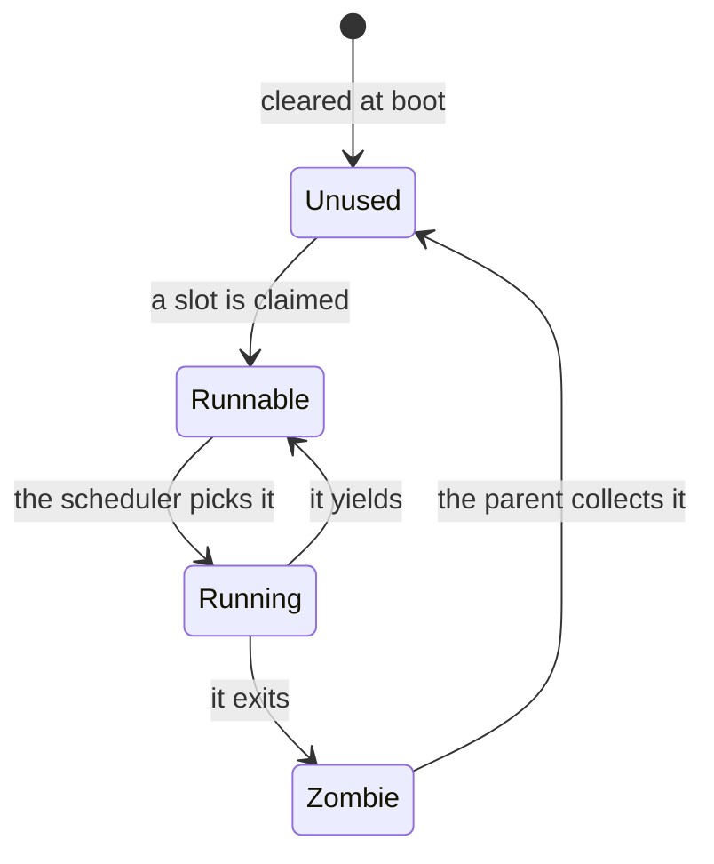
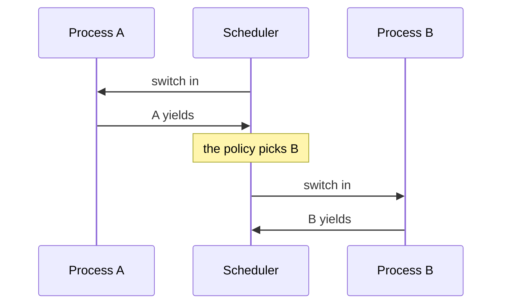

# Week 9 · Processes, the Context Switch, and Scheduling

> **Thu Oct 22** `34k_processes` · **Fri Oct 23** `35k_context_switch`, `36k_scheduling`
>
> Presented Tue Oct 13. Fall break (Oct 20) sits between this lecture and its sessions.
> The PCB section ([Thursday · `34k`](#thu-34k)) is on Midterm 1; the rest is for Oct 22–23 and Midterm 2.
> Read **Essentials** before Oct 13 and again before Oct 22.
> **Going deeper** is optional and is not on the exam.

[Slides](09-cs326-2026-10-13-processes-context-switch-and-scheduling-slides.html){ .md-button }
[Thursday Oct 22 prep](../prep/09-cs326-2026-10-22-prep-processes.md){ .md-button }
[Friday Oct 23 prep](../prep/09-cs326-2026-10-23-prep-context-switch-and-scheduling.md){ .md-button }

## This week { #this-week }

In `48k` a user program traps into your kernel and later carries on, and in
`51k` `fork` turns one process into two. Both need a kernel that holds many
programs at once and runs them in turns on one CPU.

The PCB part is on [Midterm 1](../assignments/midterm-1.md), Thu Oct 15. Back
from fall break, reread Essentials first; each prep page has a short "Back from
break" list that points into it.

On Thursday Oct 22 you build the process table: one record per process, and the
rules for claiming a slot and giving it back. On Friday you write the switch
that stops one computation and resumes another, then the policy that picks whose
turn is next. By Friday night three processes share one CPU, each resuming
exactly where it stopped.

---

## Essentials { #essentials }

### Thursday · `34k` Processes { #thu-34k }

*On Midterm 1: all of this part.*

In `51k`, `fork` copies a running program, and the kernel must keep both
copies apart. `34k_processes` builds their records and the table that holds
them.

#### A process is a data structure { #34k-process }

A **process** is one run of a program, plus the kernel's record of that run.
Run a program three times and you get three processes: the same code, three
records. The record is the **process control block** (PCB). rv6's is `Proc`,
and to the rest of the kernel a pointer to it *is* the process.

Its page table makes it the unit of **isolation**: its loads and stores go
through its own root. Its saved registers make it the unit of **scheduling**:
copy them out, run something else, copy them back, and it carries on.

#### The PCB: what it holds, and when { #34k-pcb }

Each field answers a question the kernel asks about a run. You start with
four:

| Field | The question it answers | Arrives in |
|---|---|---|
| `pid` | Which run is this? | `34k` |
| `state` | May it run now? | `34k` |
| `pagetable` | What may it touch? | `34k` |
| `name` | What do we print? | `34k` |
| `context` | Where does its kernel code resume? | `36k` |
| `trapframe`, `kstack` | Where do user registers and kernel frames go? | `48k` |
| `ofile` | What has it open? | `50k` |
| `parent`, `xstate` | Who hears its exit status? | `51k` |

rv6 never fills in `name`.

#### Five states, one enum { #34k-states }

A process is in exactly one of five states: a job for a Rust `enum`.

```rust
#[derive(Clone, Copy, PartialEq, Eq)]
pub enum ProcState { Unused, Runnable, Running, Sleeping, Zombie }
```

`PartialEq, Eq` allow `==`; `Copy` lets Friday's scheduler copy the states
out.



A freshly claimed slot is `Runnable`, not `Running`: only the scheduler puts a
process on the CPU. A `Zombie` has exited and awaits only its parent, so it
never runs again. Only teardown sends a slot straight to `Unused`.

`Sleeping` exists, but only `36k`'s test sets it. Using it takes a `sleep` that
parks a process on an event and a `wakeup` that makes it `Runnable`; rv6 yields
and retries.

#### The process table: slots and pids { #34k-table }

The PCBs live in a fixed static array of `NPROC` (64) slots: no heap, and the
table itself runs out only by being full. The same shape, for lockers:

```rust
pub struct Locker { owner: u32, open: bool }
impl Locker {
    pub const fn empty() -> Locker { Locker { owner: 0, open: false } }
}
static mut LOCKERS: [Locker; 4] = [const { Locker::empty() }; 4];
```

Read `[const { Locker::empty() }; 4]` as "run `empty()` at compile time and
stamp it into every slot". Without the `const { }`, rustc says ``the trait
bound `Locker: Copy` is not satisfied``. Do not derive `Copy`: a slot that owns
a page must never be copied.

Slots are recycled; pids never are. A full table refuses with null:

```text
               slot 0   slot 1   slot 2   slot 3   next pid
claim 4 times  pid 1    pid 2    pid 3    pid 4    5
claim          refused: null                       5
give back 2    pid 1    pid 2    -        pid 4    5
claim          pid 1    pid 2    pid 5    pid 4    6
```

An old pointer to slot 2 now names pid 5, so remember a process by its pid.

#### Ownership by hand { #34k-ownership }

A claim takes a page-table page from `kalloc`, and the slot becomes its
**owner**: the give-back must return it. No compiler watches this table, so the rule is yours to keep: **one owner, one release**. A slot reads
`Unused` only once it owns nothing, since `Unused` invites the next claim.

A claim that fails halfway must give back every piece it took before its slot
reads `Unused`, usually newest first:

```text
build:  slot claimed -> piece 1 taken -> piece 2 taken -> piece 3: none left
undo:   slot: Unused <- piece 1 back  <- piece 2 back  <- start here
then:   report failure: null
```

In `34k` a slot owns one piece; from `48k` on, three, and rv6's
[one teardown](#exam-failed-claim) frees whichever are not null, in any order.

Reach a slot through `addr_of_mut!`, never a `&mut`, which promises that nothing
else touches that memory. rustc flags only `&mut LOCKERS`, "creating a mutable
reference to mutable static"; `&mut LOCKERS[2]` slips past.

```rust
let p: *mut Locker = unsafe { core::ptr::addr_of_mut!(LOCKERS[2]) };
unsafe { (*p).open = true; }
```

> **The one thing to get right:** you return the page, yet a `[fail]` line
> says the page table was not dropped. Returning a page and forgetting it
> are two acts: a field that still holds the address lets the next release free
> that page twice.

### Friday · `35k` The context switch { #fri-35k }

*For Oct 22–23.*

In `36k` three processes take turns on one CPU. `35k_context_switch` builds the
call that stops one and returns into another.

#### What a context is { #35k-context }

Stop a computation, and its memory stays put; only its registers are lost. A
paused computation is its **context**: the registers it needs back.

It does not need all 31: the switch is entered by an ordinary call, so the
caller has already saved what it needs
([week 6](06-cs326-2026-09-29-below-rust-assembly-unsafe-and-no-std.md#20a-saved)).
That leaves the callee-saved `s0`–`s11` and `sp`, plus `ra`: caller-saved, but
kept as the resume point. A paused computation is always paused inside its call
to the switch, so `ra` does the program counter's job. That makes 14 registers,
112 bytes.

#### The offset contract, and a `ret` that lands elsewhere { #35k-offsets }

The switch finds each saved register by an offset welded into an `sd` or
`ld`. Plain Rust may reorder a struct's fields; `#[repr(C)]` keeps them in
declaration order. Without it, an `ra` that Rust code writes could sit where
the assembly reads another register, with no compile error. In `35k` the save
half is given.

The switch makes three moves: save the live registers into the old context, load
the new one's, and `ret`. Here they are with a made-up `Pause` (`sp` at 0,
`s1` at 8, `ra` at 16), as A calls `trade(&A, &B)`:

```text
                       ra            sp            s1   A's Pause (sp, s1, ra)
enter trade(&A, &B)    0x8000_1A04   0x8021_0F80   5    (old contents)
after the three saves  0x8000_1A04   0x8021_0F80   5    0x8021_0F80, 5, 0x8000_1A04
after the three loads  0x8000_2B10   0x8022_0FD0   9    unchanged
ret                    jumps to 0x8000_2B10, on B's stack
```

The saves change no register, the loads replace all three with B's values,
and `ret` goes where the loads said. A's `Pause` now holds what a later
`trade(&B, &A)` needs to bring A back: Midterm 1's
[trace-the-registers](06-cs326-2026-09-29-below-rust-assembly-unsafe-and-no-std.md#exam-trace)
shape.

#### Starting a context that never ran { #35k-fresh }

A computation that never ran has nothing saved, so you forge its context.
Set `ra` to its entry function, so the first switch `ret`s into it. Set `sp` to
the *top* of a fresh page, because stacks grow down: for a page at
`0x8003_7000`, that is `0x8003_8000`. The entry's address must become a number:

```rust
extern "C" fn blink() -> ! { loop {} }
let entry: extern "C" fn() -> ! = blink;   // the function, as a pointer
let ra = entry as usize;                   // the pointer, as a number
```

The shortcut `blink as usize` draws a warning, "direct cast of function item
into an integer".

> **The one thing to get right:** `[fail] task never ran`, though every load
> is there. Loads from the context you just saved into put back what you had, so
> `ret` returns to your own caller. Save into one context; load from the
> *other*.

### Friday · `36k` Round robin { #fri-36k }

*For Oct 22–23.*

In `51k` a parent waits while its child runs, and something must pick whose
turn it is. `36k_scheduling` writes that choice.

#### Mechanism and policy { #36k-policy }

The switch is **mechanism**: *how* the CPU moves between processes. *Which*
process runs next is **policy**. Keep them apart, and a new policy never
touches the assembly. The seam is a trait:

```rust
pub trait Scheduler {
    fn pick_next(&mut self, states: &[ProcState]) -> Option<usize>;
}
```

Read it as "given every slot's state, name a slot, or say that none can run".
You wrote a `RoundRobin` against this same method in `07r_traits`: `&mut self`
is what lets it keep its cursor between calls.

#### Round robin, by its rules { #36k-round-robin }

**Round robin** gives each runnable process a turn, then comes around again.
Scan from a cursor, not from slot 0; skip what is not `Runnable`; wrap past the
end; move the cursor just past your pick. A lap that finds nothing answers
`None`. With `[Runnable, Runnable, Unused, Sleeping, Runnable]` and the cursor
at 1:

```text
cursor   scans     picks   new cursor
1        1         1       2
2        2, 3, 4   4       0
0        0         0       1
```

`36k` invites an iterator chain. Two of its adapters, on a playlist:

```rust
let songs = ["intro", "Blue Monday", "Heroes", "outro"];
let long = songs.iter().find(|s| s.len() > 6);   // Some(&"Blue Monday")
let chars = long.map(|s| s.len());               // Some(11)
```

Read `.find` as "the first item that passes, or `None`", and `long.map` as
"change what is inside the `Some`; leave `None` alone".

#### The double switch { #36k-double-switch }

A process never switches straight to another. It switches to the scheduler,
which has its own context and stack, and the scheduler switches onward:



The detour costs a second switch and buys a stack that belongs to no process.
Each CPU has its own scheduler context; rv6 boots one hart, so it keeps one. A
process's locals sit on its own stack, which its saved `sp` brings back.

> **The one thing to get right:** `[fail] run order is not round-robin`: each
> process takes all its turns before the next gets any. Every scan began at the
> same slot, so it found the same process until that one finished. The rotation
> lives in the cursor, not the scan.

### For the exam { #exam }

*Not needed on Oct 22 or 23.*

**A claim that fails halfway** · *Midterm 1.* A claim takes a pid, marks its
slot `Runnable`, finds no page, and returns null. The slot is lost: only
`Unused` slots are claimed, and the scheduler switches into a context nobody
built. No test runs out of memory. The cure: one teardown that tolerates a
half-built slot, called from every failure path.
{ #exam-failed-claim }

**The vocabulary** · *Midterm 2.* **Throughput** is jobs finished per unit of
time. **Turnaround** is finish minus arrival; **response** is first run minus
arrival. A **quantum** is the most CPU time a process gets per turn.
**Fairness** means each runnable process gets its share; **starvation** is a
runnable process waiting without bound, so a sleeper is not starved.
**Cooperative** scheduling waits for a yield, as in `36k`; **preemptive** takes
the CPU back on a timer. `44k` starts a timer that rv6 only counts, so every
run picks in the same order.
{ #exam-terms }

**The scheduling survey** · *Midterm 2.* For jobs arriving together, SJF gives
the lowest average turnaround; round robin caps each first wait at one quantum
per job ahead.
{ #exam-survey }

| Policy | Runs next | Preempts? | Starves? |
|---|---|---|---|
| FCFS | earliest arrival | no | no; long jobs delay the rest |
| SJF | shortest job | no; SRTF, yes | yes, long jobs |
| Priority | highest priority | either | yes, without aging |
| Round robin | next in rotation, one quantum | on a timer | no |
| MLFQ | top non-empty queue; a used-up allotment demotes | yes | yes, without boosts |
| CFS | least weighted runtime | yes | no |

---

## Going deeper { #deeper }

*Optional. Nothing here is needed on Thursday or Friday, and nothing here is on
the exam.*

### Two register saves, for two reasons { #deeper-two-saves }

From `48k` on, a process has registers saved in two places. The context holds
14, written by a voluntary call when kernel code gives up the CPU. `Trapframe`
(`usermode.rs`), in a page of its own, holds all 31 registers, the user program
counter `epc` and four kernel fields, and every trap from user mode writes it.
A trap is not a call: user code never agreed to lose a register, so the
trapframe saves them all. A switch goes kernel to kernel; a trap goes user to
kernel.

### Why the detour through the scheduler { #deeper-hub }

Switching process to process would save one switch per handover. rv6 pays it
anyway:

- **Whose stack?** Choosing the next process takes code, and code needs a
  stack. A direct switch would run it on the outgoing process's kernel stack,
  which may be a zombie's awaiting release or, on a multi-CPU machine, one that
  another CPU is about to resume.
- **Nowhere to go.** When nothing is runnable, a direct switch has no target;
  the scheduler loop simply looks again.
- **Many CPUs.** xv6 keeps each hart's scheduler context in a per-CPU
  `struct cpu`, beside the process that hart is running.

In the finished kernel the hub is `scheduler()` (`usermode.rs`), and processes
return to it through `proc_yield()` and `exit_current()` (`usermode.rs`).

### xv6's `swtch.S`, and why rv6's is `global_asm!` { #deeper-swtch }

xv6, the C kernel rv6 descends from, keeps its switch in an assembly file,
`swtch.S`, declared to C as `void swtch(struct context *old, struct context
*new)`. Its `struct context` holds the same 14 registers, and the routine makes
the same three moves. xv6 adds a rule around the call: the process's lock is
held across the switch and released by whichever side arrives, so no other CPU
can take the process halfway through.

rv6 uses `global_asm!`, which emits a bare label with no Rust around it. A
compiled Rust function gets a prologue and an epilogue that may move `sp` and
restore registers from it, and a routine that replaces `sp` cannot sit inside
code that trusts it. Since Rust 1.88, a `#[unsafe(naked)]` function holding one
`naked_asm!` block is the other way to write it.

### Why `Zombie` exists { #deeper-zombie }

The obvious design frees a slot the moment its process exits. It cannot, because
the exit status has an addressee: the parent may not have called `wait` yet. So
an exiting process records its status, becomes a `Zombie`, and switches away for
good. The slot lingers, running nothing, until the parent's `wait` collects the
status and frees it. A parent that never waits leaks slots; `ps` on Linux marks
such processes `Z`.

### MLFQ and CFS, up close { #deeper-mlfq-cfs }

**MLFQ**, the multilevel feedback queue, descends from CTSS (1962) and still
shapes the schedulers of BSD, Solaris and Windows. It earns SJF's advantage by
watching behavior instead of knowing the future. Higher queues get shorter
quanta, and the top non-empty queue runs, round robin within it. A new job
starts at the top. A job that uses up its allotment at a level drops a level,
however it spread the time out. Every so often all jobs are boosted to the top,
so a long job cannot starve.

**CFS**, Linux's default from 2.6.23 (2007) until EEVDF replaced it in 6.6
(2023), has no fixed quantum. Each task carries a virtual runtime that grows as
it runs, scaled by its weight: nice 0 weighs 1024, and each nice level changes
the weight by about 1.25×. The smallest virtual runtime runs next, found as the
leftmost node of a red-black tree. A waiting task's virtual runtime stands still
while the others grow, so it always reaches the front.

### Linux's `task_struct`, and threads { #deeper-task-struct }

Linux's PCB is `struct task_struct` in `include/linux/sched.h`, hundreds of
fields long. Most answer questions rv6 never asks: namespaces, cgroups,
scheduling classes, security. Its name field, `comm`, is 16 bytes, like rv6's
`name`, which is why `ps` truncates long command names.

A `task_struct` is a **thread**, not a process. Threads share one address space
and one set of open files, but each has its own context and stack. A Linux
process is a thread group: `task_struct`s sharing one `mm_struct` and one
`tgid`, which `getpid()` returns. rv6 has no threads: each `Proc` is one address
space and one context.

### Practice problems { #problems }

#### Problem 1: Slots, pids, and reuse { #problem-1 }

A four-slot table starts empty, with the next pid 1. A claim takes the lowest
`Unused` slot, and a refused claim takes no pid:

```text
a = claim;  b = claim;  c = claim
give back a;  give back c
d = claim;  e = claim;  f = claim;  g = claim
give back d
h = claim
```

Give each claim's slot and pid, or say it was refused. A log kept `a` as "the
logger". What does that pointer name at the end, and what should the log have
kept?

<details markdown="1">
<summary>Click to reveal solution</summary>

| Claim | `a` | `b` | `c` | `d` | `e` | `f` | `g` | `h` |
|---|---|---|---|---|---|---|---|---|
| Slot | 0 | 1 | 2 | 0 | 2 | 3 | refused | 0 |
| pid | 1 | 2 | 3 | 4 | 5 | 6 | none | 7 |

`d` takes slot 0 because it is the lowest free slot again. `g` finds all four
slots taken, so it gets null. Seven pids went to four slots.

`a`, `d` and `h` are the same pointer, so the log's `a` now names pid 7, a
process that never logged anything. The log should have kept pid 1. A lookup of
pid 1 now finds nothing, which is the truth.

</details>

#### Problem 2: Legal and illegal transitions { #problem-2 }

For each transition, say whether rv6 as written ever makes it. If it does, say
what causes it; if not, say what would have to change, or why it must never
happen.

1. `Runnable → Zombie`
2. `Sleeping → Running`
3. `Running → Sleeping`
4. `Runnable → Unused`
5. `Zombie → Runnable`

<details markdown="1">
<summary>Click to reveal solution</summary>

1. **No.** Only a running process exits, and it marks *itself* `Zombie`. Ending
   one that is not running needs a kill, and even xv6's `kill` only sets a flag:
   the victim exits itself the next time it runs.
2. **Never.** Waking makes a sleeper `Runnable`, and only the scheduler makes
   anything `Running`.
3. **Not in rv6**, where no kernel path writes `Sleeping`. It needs a `sleep` that
   parks the running process on an event and a `wakeup` that makes every process
   parked there `Runnable`. xv6 has both; rv6 yields and retries instead.
4. **Yes, in teardown only.** In the finished kernel a claim that fails partway
   hands its half-built slot to the teardown, and the end of a run frees every
   leftover slot, whatever its state, in `cleanup_except()` (`usermode.rs`).
   The normal road is `Running → Zombie → Unused`.
5. **Never.** A zombie switched away for the last time; the code after that
   switch is `unreachable!()`. Its parent is owed a finished process.

</details>

#### Problem 3: Trace a switch through a hub { #problem-3 }

Use [`Pause` and `trade`](#35k-offsets): `sp` at 0, `s1` at 8, `ra` at 16.
A hub H runs with `sp = 0x8021_0F80` and `s1 = 5`. Worker X has never run; its
`Pause` was forged with `sp = 0x8006_0000`, `s1 = 0` and `ra = 0x8000_3000`,
the address of `x_entry`.

1. H calls `trade(&H, &X)`, so `ra = 0x8000_1A04`. Where does the `ret` land,
   with what `sp` and `s1`?
2. `x_entry` sets `s1 = 40`, moves `sp` down 16, and calls `trade(&X, &H)` with
   `ra = 0x8000_3010`. What does X's `Pause` hold? Where does the `ret` land,
   with what `s1`?
3. Back in H, `s1` is 5 and `sp` is `0x8021_0F60`. H calls `trade(&H, &X)` with
   `ra = 0x8000_1A40`; X resumes, changes nothing, and calls `trade(&X, &H)` with
   `ra = 0x8000_3024`. Where does that `ret` land, with what `sp`, and why not at
   `0x8000_1A04`?
4. Worker Y is forged the same way, but `y_entry` sets `a0 = 1` and returns
   without calling `trade`. Where does its `ret` go?

<details markdown="1">
<summary>Click to reveal solution</summary>

1. At `0x8000_3000`, the first instruction of `x_entry`, with
   `sp = 0x8006_0000` and `s1 = 0`. H's `Pause` holds `0x8021_0F80`, `5` and
   `0x8000_1A04`.
2. X's `Pause` holds `0x8005_FFF0`, `40` and `0x8000_3010`. The `ret` lands at
   `0x8000_1A04` in H, with `sp = 0x8021_0F80` and `s1 = 5`: H gets its own
   `s1` back, although X wrote 40, because `s1` is in the context.
3. At `0x8000_1A40`, with `sp = 0x8021_0F60` and `s1 = 5`. H's second `trade`
   overwrote its `Pause`, so a context always resumes from its latest switch,
   never an earlier one. X's `Pause` now holds `0x8005_FFF0`, `40` and
   `0x8000_3024`.
4. Back to `y_entry`. The `ret` in `trade` leaves `ra` alone, so Y starts with
   `ra` holding its own entry address. Its `ret` jumps to its first instruction,
   and Y runs again and again, never giving the CPU back. That is why a real
   entry function is typed `-> !`.

</details>

#### Problem 4: Predict the round-robin order { #problem-4 }

Five slots start as `[Runnable, Sleeping, Zombie, Runnable, Runnable]`, with the
cursor at 2. Slot 4's process exits during its first turn. Slot 1's process
wakes, becoming `Runnable`, right after the third pick. The others yield at the
end of each turn.

List the first eight picks and the cursor after each. Then give the order when
every scan starts at slot 0. Is the sleeping slot starved before it wakes?

<details markdown="1">
<summary>Click to reveal solution</summary>

| Pick | 1 | 2 | 3 | 4 | 5 | 6 | 7 | 8 |
|---|---|---|---|---|---|---|---|---|
| Scans | 2, 3 | 4 | 0 | 1 | 2, 3 | 4, 0 | 1 | 2, 3 |
| Picks | 3 | 4 | 0 | 1 | 3 | 0 | 1 | 3 |
| Cursor after | 4 | 0 | 1 | 2 | 4 | 1 | 2 | 4 |

Slot 4 becomes `Zombie` at pick 2, and slot 1 wakes after pick 3. The order is
3, 4, 0, 1, 3, 0, 1, 3. Slot 1 runs on the first scan after it wakes, because
the cursor sits on it, and the dead slot 4 costs one extra look per lap.

Starting every scan at 0 picks slot 0 all eight times. Slots 3 and 4, and slot 1
once awake, are runnable and never chosen: that is starvation. Before it wakes,
slot 1 is not starved, because a sleeper is not runnable.

</details>

---

## Key terms { #terms }

| Term | Meaning | Where you use it |
|---|---|---|
| Process | One run of a program, plus the kernel's record of it | `34k` onward |
| PCB | The kernel's record of one process; rv6's `Proc` | `34k`, `48k`, `51k` |
| `ProcState` | `Unused`, `Runnable`, `Running`, `Sleeping`, `Zombie` | `34k`, `36k` |
| Process table | A fixed static array of `NPROC` (64) PCBs | `34k`, `36k` |
| pid versus slot | A pid names one run and is never reused; a slot is recycled | `34k`, `51k` |
| Ownership by hand | One owner, one release, with no borrow checker watching | `34k`, `48k` |
| Context | The 14 registers a paused computation needs back | `35k`, `36k` |
| Offset contract | `#[repr(C)]` fixes the offsets the assembly uses | `35k` |
| Mechanism versus policy | How to switch, versus which process runs next | `36k` |
| Round robin | Each runnable process gets a turn, in rotation | `36k` |
| Double switch | Process to scheduler to process, never process to process | `36k`, `51k` |
| Starvation | A runnable process that waits without bound | `36k`, Midterm 2 |

## Further reading { #reading }

- [rv6 Architecture: processes, switching, and scheduling](../guides/rv6-architecture.md#processes-switching-and-scheduling):
  the finished kernel's process lifecycle, from claim to reaping.
- [RISC-V: the caller/callee split](../guides/riscv.md#the-callercallee-split)
  and [loads, stores, and offsets](../guides/riscv.md#loads-stores-and-offsets).
- [Unsafe Rust and no_std: `static mut` and `addr_of!`](../guides/rust-unsafe-nostd.md#static-mut-and-addr_of)
  and [`#[repr(C)]`](../guides/rust-unsafe-nostd.md#reprc-and-reprtransparent).
- [Rust for Systems: `const fn`](../guides/rust-for-systems.md#const-fn): why
  the process table exists before the kernel runs.
- [Exam Prep: trace the registers](../guides/exam-prep.md#shape-1-trace-the-registers),
  with a worked switch.
- Week 6: [caller-saved and callee-saved](06-cs326-2026-09-29-below-rust-assembly-unsafe-and-no-std.md#20a-saved)
  and [a `ret` that lands somewhere else](06-cs326-2026-09-29-below-rust-assembly-unsafe-and-no-std.md#20a-resume).
- [The xv6 book](https://pdos.csail.mit.edu/6.828/2023/xv6/book-riscv-rev3.pdf),
  chapter 7, "Scheduling".
- Arpaci-Dusseau and Arpaci-Dusseau,
  [*Operating Systems: Three Easy Pieces*](https://pages.cs.wisc.edu/~remzi/OSTEP/),
  chapters 4–9: processes, direct execution, and scheduling.
