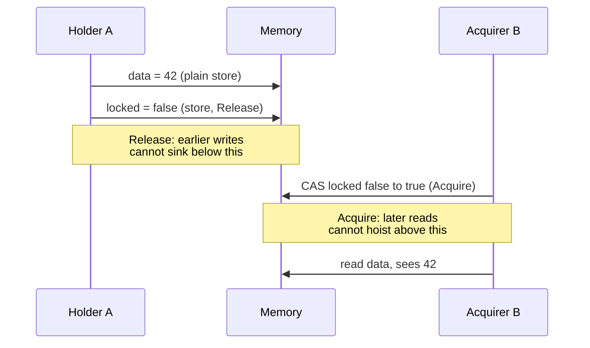
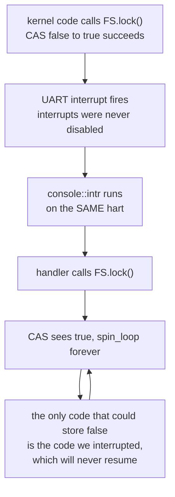

# Locks, Semaphores, and the Kernel Heap

## Overview

Every structure you have built so far — the free list, the process table, the
scheduler cursor — has had one writer, because the kernel has done one thing at
a time. That ends here. Interrupts already fire (`trap.rs:39`), real hardware
has more than one hart, and two flows of control can now be inside the same data
structure at the same instant. This session builds mutual exclusion from
nothing: first a race condition, traced instruction by instruction so you see
where it breaks rather than being told that it does; then the atomic operation
the hardware provides; then enough memory ordering to justify the
`Acquire`/`Release` pair; then the RAII guard, which turns "remember to unlock"
into a rule the compiler enforces. The second half is counting semaphores, the
lost-wakeup problem, and the bounded buffer. We close with the kernel heap
coming online: `#[global_allocator]`, and what `Box`, `Vec`, and `Arc` cost.
This is the concept behind exercises `37k_spinlocks` and `38k_semaphores`, both
on Thursday, October 29; see also the [Unsafe Rust and no_std guide](../guides/rust-unsafe-nostd.md).

## Learning Objectives

- **Construct** a race condition from a plain `bool` flag and exhibit the
  interleaving that breaks it.
- **Distinguish** test-and-set from compare-and-swap, and name the RISC-V
  instruction each becomes.
- **Justify** `Acquire` on lock and `Release` on unlock by what may move across
  them.
- **Explain** how an RAII guard plus `UnsafeCell` makes a locking convention
  compiler-enforced.
- **Describe** `Send` and `Sync`, and why `unsafe impl Sync` is a promise, not a
  fact.
- **Derive** the single-hart deadlock between a lock holder and an interrupt
  handler.
- **Trace** a bounded buffer through counting semaphores and identify the
  lost-wakeup hazard.
- **Compute** the cost of `Box`, `Vec`, and `Arc` under a page-per-allocation
  heap.

## Prerequisites

- L11 *Physical Memory and the Free List* and `32k_physical_memory` —
  `kalloc`/`kfree`, what the kernel heap is built on.
- L14 *The Context Switch and the Scheduler* — once control can leave a function
  part-way through, shared state needs protecting.
- L04 *Structs, impl, and const fn* — why a lock can live in a plain `static`.
- `03r_borrowing` and `07r_traits` — `&`/`&mut` aliasing, `Deref`, `Drop`.
- The [Unsafe Rust and no_std guide](../guides/rust-unsafe-nostd.md) — raw
  pointers, `UnsafeCell`, and what an `unsafe impl` claims.
- The [rv6 Architecture guide](../guides/rv6-architecture.md).

---

## 1. Constructing a Race Condition

A race condition is not visible in any single line of code. Every line below is
correct; the bug lives in the *interleaving*, so the only honest way to show it
is to write it down.

### The flag that does not work

The obvious way to protect a critical section without special hardware — a
shared `bool` saying whether anyone is inside:

```rust
static mut BUSY: bool = false;

if !BUSY {          // is anyone inside?
    BUSY = true;    // no — claim it
    critical();
    BUSY = false;
}
```

The compiler turns `if !BUSY { BUSY = true; }` into three separate memory
events: a load, a branch, and a store. Nothing keeps them together.

```text
   if !BUSY { BUSY = true; }  ->   lbu t0, BUSY / bnez t0, skip / sb 1, BUSY

   time   A                        B                        BUSY
   ----   -------------------      -------------------      -----
     1    lbu  t0 <- 0 (free)                                false
     2    bnez t0, not taken                                 false
     3                             lbu  t0 <- 0 (free)       false
     4                             bnez t0, not taken        false
     5    sb   1 -> BUSY                                     true
     6                             sb   1 -> BUSY            true
     7    critical()               critical()                true
                            both inside; BUSY says one is
```

There is the whole problem. Between A's load at time 1 and its store at time 5,
`BUSY` is still `false` even though A has decided to enter, so anything reading
it then gets a stale answer. The window is two instructions — a couple of
nanoseconds — small enough that this code passes ten thousand tests and then
corrupts the process table in front of a customer.

The identical failure destroys ordinary updates: `COUNTER += 1` is
`ld`/`addi`/`sd`, so A and B can both load `7`, both compute `8`, and both store
it. Two increments, one result — the **lost update**.

> Key distinction: a **critical section** is code that must not run in two flows
> at once; **mutual exclusion** is the property that it doesn't; a **race
> condition** is what you have when you needed mutual exclusion and did not get
> it. It is a property of the *program*, not the run — the run that produced the
> right answer had the race too.

### Why you cannot fix this with more code

Dekker's algorithm (1962) and Peterson's (1981) do achieve mutual exclusion for
two threads from ordinary loads and stores — and need explicit fences on any CPU
designed after about 1990, because they assume program order (§3).

The deeper objection is structural: every software solution is a sequence of
independent operations an adversary may interleave, so each added instruction is
a new window. The window closes only when the hardware provides an operation
with **no interior**. That is an *atomic* operation, and it is the one thing
here you cannot build.

---

## 2. Atomicity: What the Hardware Gives You

`riscv64gc` — the `g` is the IMAFD bundle — includes the **A extension**, which
offers two families.

**Atomic memory operations (AMOs)** read a word or doubleword, combine it with a
register, write it back, and return the *old* value in `rd`, with no hart able
to interpose: `amoswap.w rd, rs2, (rs1)` is `rd = M[rs1]; M[rs1] = rs2`, and
`amoadd`, `amoor`, `amoand`, `amoxor`, `amomax`, `amomin` differ only in the
combining function. Widths are `.w` and `.d` only — **no byte-width AMOs**,
which matters in a moment.

**Load-reserved / store-conditional.** `lr.d rd, (rs1)` loads and places a
*reservation* on the address; `sc.d rd, rs2, (rs1)` stores only if that
reservation is intact, writing 0 to `rd` on success and non-zero on failure.
Another hart's write, a context switch, sometimes a cache eviction breaks it.
Any read-modify-write can be built from LR/SC.

### Test-and-set versus compare-and-swap

**Test-and-set** writes `true` unconditionally and reports what was there
before. In Rust that is `AtomicBool::swap`, and a TAS lock is
`while flag.swap(true, Acquire) { spin_loop(); }`: an old value of `false` means
the lock was free and is now yours. One instruction, no failure path — but the
only state it expresses is "busy".

**Compare-and-swap** is conditional: change `x` to `new` only if it is currently
`old`. That is what rv6 uses, `spinlock.rs:25`:

```rust
self.locked
    .compare_exchange(false, true, Ordering::Acquire, Ordering::Relaxed)
```

`Ok(_)` means you made the transition; `Err(actual)` hands you what was really
there. CAS is strictly more expressive — it can move a value through many
states, which is how lock-free queues and reference counts work.

> Key distinction: CAS compares **values**, so a word that went `A → B → A`
> between your read and your CAS looks untouched — the **ABA problem**, and why
> lock-free list code carries version counters. LR/SC watches the **address**,
> so it is immune.

### What rv6 actually compiles to

Compile `spinlock.rs:22`–`spinlock.rs:31` for `riscv64gc-unknown-none-elf` at
`-O` and the loop is not what you would guess:

```asm
lock:   andi    a1, a0, -4        # round the &AtomicBool down to a word
        slli    a0, a0, 3         # byte offset within that word, times 8
        li      a2, 1
        sllw    a2, a2, a0        # shift the 1 into that byte's lane
        amoor.w.aq a3, a2, (a1)   # the atomic: OR in the bit, return old word
        ...
        beqz    a3, .LBB0_2       # old byte was 0 -> we got the lock
.LBB0_1:
        pause                     # core::hint::spin_loop()
        amoor.w.aq a3, a2, (a1)
        ...
        bnez    a3, .LBB0_1
```

Two things to keep. The mask-and-shift preamble *is* the missing byte-width AMO:
`AtomicBool` is one byte, RV64A does words, so the compiler works on the
containing word and extracts the byte afterwards. And **there is no `lr`/`sc`
here at all** — LLVM noticed that OR-ing a 1 into a bit already set changes
nothing, so a CAS from `false` to `true` on a `bool` is *exactly* test-and-set,
and on this type the distinction you just learned collapses. The same
`compare_exchange` on an `AtomicUsize` cannot be reduced: it becomes the retry
loop `lr.d.aq` / `bne` (fail) / `sc.d` / `bnez` (reservation lost, try again).

`core::hint::spin_loop()` (`spinlock.rs:28`) becomes `pause`, a Zihintpause hint
that the core is busy-waiting. Note that **every** spin iteration is a write, and
a write takes the cache line exclusive, so many spinners ping-pong one line while
doing no work; the standard fix, *test-and-test-and-set*, spins on a plain load
until the lock reads free and only then tries the atomic. rv6 has one hart and
skips it.

---

## 3. Just Enough Memory Ordering

An atomic instruction makes one operation indivisible. It says nothing about the
operations *around* it, and that is a separate problem.

Both the compiler and the CPU reorder memory accesses. RISC-V's model is
**RVWMO** (weak memory ordering): a hart's stores may become visible to other
harts in a different order than issued. And on *any* machine, one hart included,
the compiler will sink a store past another or hoist a load above one if it sees
no reason not to — which is why ordering matters in rv6 with a single CPU, where
the reordering an interrupt handler observes is usually the compiler's.

- **`Acquire`** on a load or read-modify-write: nothing after it may move before
  it, so every access to the protected data stays inside the lock.
- **`Release`** on a store: nothing before it may move after it, so every write
  you made lands before the unlock.
- **`Relaxed`**: atomic with respect to itself, nothing more.

They are useless alone and work as a *pair*.



Everything the previous holder did before its `Release` is visible to the next
holder after its matching `Acquire`. That sentence is what makes a lock protect
*data* and not merely a flag. rv6's unlock (`spinlock.rs:46`,
`store(false, Ordering::Release)`) is two instructions: `fence rw, w` — all prior
reads and writes, before this write — then `sb zero, 0(a0)`.

Two details reward a second look. **The failure ordering is `Relaxed`**
(`spinlock.rs:25`): a failed CAS acquired nothing, and a contended lock fails on
most iterations, so `Acquire` there would buy a fence per spin. **`is_locked`
uses `Relaxed`** (`spinlock.rs:50`) — deliberate, and a warning: the answer is
stale the instant you have it. Use it for assertions, never for
`if !lock.is_locked() { ... }`, which is §1's racy flag rebuilt from an atomic.

---

## 4. The Guard: Turning Discipline into a Type

Everything so far exists in C. What Rust adds is that you cannot use it wrong.

### The interior-mutability puzzle

`SpinLock::lock` takes `&self` and must hand back something you can write
through — but `&T` means nobody may mutate. The one escape is `UnsafeCell<T>`,
the only type the compiler treats as opting out and the only sound way to get
`*mut T` from a `&`. Hence `spinlock.rs:7`–`spinlock.rs:10`:

```rust
pub struct SpinLock<T> {
    locked: AtomicBool,
    data: UnsafeCell<T>,
}
```

`UnsafeCell` checks nothing; it grants permission, and the lock supplies the
correctness. `Deref`/`DerefMut` (`spinlock.rs:58`–`spinlock.rs:69`) do the raw
dereference inside `unsafe`, sound only because holding a guard means you won
the atomic.

### `Drop` is the unlock

The guard is a borrow of the lock and nothing else, `spinlock.rs:54`:

```rust
pub struct SpinLockGuard<'a, T> { lock: &'a SpinLock<T> }

impl<T> Drop for SpinLockGuard<'_, T> {
    fn drop(&mut self) { self.lock.unlock(); }     // spinlock.rs:71
}
```

In a scope, `let mut c = COUNTER.lock();` swings the CAS `false → true`, `*c` is
`&mut u64` through `DerefMut`, and the closing brace stores `false`. Count what
is now impossible. You cannot forget to unlock; an early `return` or a panic
cannot skip it. You cannot unlock twice — `Drop` runs once. You cannot reach the
data without the lock, since the only path to the `UnsafeCell` is through a
guard. You cannot keep a reference past the release, since `deref` borrows the
guard. And `'a` (`spinlock.rs:55`) stops the lock being moved or dropped while a
guard lives. In C each is a code review; here they are type errors. To release
early, call `drop(guard)` — `shell.rs:102` does.

### `Send`, `Sync`, and a promise the compiler cannot check

- **`Send`** — a value of this type may be *moved* to another thread.
- **`Sync`** — a `&T` may be *shared* with another thread; equivalently `&T: Send`.

Both are auto traits, derived structurally. `UnsafeCell<T>` is deliberately
**not** `Sync`, so `SpinLock<T>` is not either and a `static SpinLock` would be
rejected outright. `spinlock.rs:12` overrides that:

```rust
unsafe impl<T: Send> Sync for SpinLock<T> {}
```

Read it as a signed statement: *I have checked that the lock serializes access,
so sharing this is safe.* The `unsafe` is the signature. The bound is `T: Send`,
not `T: Sync`, for a precise reason: the lock hands `&mut T` to whichever hart
wins, so `T` is effectively passed between threads; it never hands out two `&T`
at once, so `Sync` is not needed.

`SpinLock::new` is a `const fn` (`spinlock.rs:15`), which is what lets a lock
live in a `static` with no lazy initialization: `fs.rs:277` is
`pub static FS: SpinLock<FileSystem> = SpinLock::new(FileSystem::new());`.

---

## 5. Deadlock, Lock Order, and Interrupts

Mutual exclusion introduces a failure mode the racy version did not have:
everybody stops. **Deadlock** needs four conditions at once (Coffman, 1971) —
mutual exclusion, hold-and-wait, no preemption, and circular wait. Break any one
and it is impossible; kernels almost always break the fourth.

### Lock ordering

The classic cycle needs only two locks:

```text
   thread A                    thread B
   FS.lock()                   PROC.lock()
   PROC.lock()   <-- waits     FS.lock()     <-- waits     forever
```

The fix is a **global lock order**: number every lock and acquire in increasing
order, so no cycle can form. xv6 states its order in comments; Linux checks a
version of it at runtime with `lockdep`, which records every ordering it has seen
and complains when a new one contradicts it. There is no cheap static check —
which is why lock ordering is still a leading source of kernel bugs.

### The single-hart deadlock

Here is the one that matters for rv6, and it needs no second CPU.



The lock is held by *this* hart, which is now spinning instead of finishing the
critical section. Making it reentrant is worse: the handler would walk into a
half-updated structure, trading a hang for silent corruption.

The rule: **a spinlock an interrupt handler can also take must be acquired with
interrupts disabled.** xv6 builds this in — `acquire()` calls `push_off()`,
clearing `sstatus.SIE` and bumping a per-CPU nesting depth, and `release()` calls
`pop_off()`, restoring interrupts only at depth zero. Nesting matters: naive
"disable on acquire, enable on release" re-enables at the inner release of two
nested locks while the outer is still held. Linux spells it `spin_lock_irqsave`.

rv6's `SpinLock` does none of this, and the exercise says so. Three assumptions
make that survivable, all worth suspicion: one hart; interrupt handlers that take
no locks; and a console that avoids needing one, using a
single-producer/single-consumer ring with separate head and tail
(`console.rs:13`–`console.rs:15`) where the handler only advances `TAIL`
(`console.rs:18`) and the reader only `HEAD`.

### Never sleep holding a spinlock

Waiters burn CPU. If the holder blocks, every waiter spins for the duration, and
on one hart nobody can run the holder again. rv6's scheduler recognizes the
shape: the `None` arm at `usermode.rs:300`, reached when nothing is runnable,
comments "either the root finished, or we deadlocked." Hence two lock types —
**spinlocks** for short sections with interrupts off, and **sleeping locks**
(xv6's `sleeplock`, Linux's `mutex`) built on §6's machinery.

---

## 6. Semaphores

Dijkstra introduced semaphores in 1965 for the THE system, and the abbreviations
stuck: **P** from *proberen* (test), **V** from *verhogen* (increment). A
semaphore is a non-negative counter with two atomic operations — **P / wait**,
which decrements if the count exceeds zero and otherwise blocks, and **V /
post**, which increments and wakes a waiter.

```text
   count = initial + (completed V) - (completed P)      and    count >= 0
```

Initialized to 1 it is a **binary semaphore**, behaving like a mutex; at *n* it
is a **counting semaphore**, metering *n* interchangeable units — buffer slots,
DMA channels, "at most 8 processes in this region."

> Key distinction: a mutex has an **owner**, and that is checkable. A semaphore
> does not: `V` may be called by a thread that never called `P`. That is what
> makes semaphores right for *signaling* and poor for mutual exclusion, where
> the ownership check is the point.

### rv6's semaphore

`semaphore.rs:5`–`semaphore.rs:7` is three lines and no new ideas:

```rust
pub struct Semaphore {
    count: SpinLock<i64>,
}
```

The count is shared mutable state, so it lives behind the lock you just built —
composition, the cheapest kind of correctness. `try_wait`
(`semaphore.rs:16`–`semaphore.rs:24`) locks, tests, decrements, returns `bool`;
`post` (`semaphore.rs:26`–`semaphore.rs:29`) locks and increments. Both take
`&self` and change the count: interior mutability, laundered through the lock.

It is `try_wait`, not `wait`, because blocking needs a sleep queue and somebody
else to run; on one hart a process that blocked with nothing else runnable would
hang the machine. Only "what to do at zero" is deferred.

### The lost wakeup

Blocking is not a small addition. The obvious `wait` is:

```rust
// WRONG
if count == 0 { sleep(); }     // <-- the window is inside this line
count -= 1;
```

with `post` as `count += 1; wakeup();`. Trace them:

```text
   time   consumer                        producer            count  sleeping
   ----   -----------------------------   -----------------   -----  --------
     1    reads count == 0, decides                             0      -
          to sleep
     2                                    count += 1            1      -
     3                                    wakeup()              1      none!
     4    sleep()                                               1    consumer
                                                                     forever
```

The wakeup at time 3 arrives before the sleep at time 4 and is lost: it woke
nobody, and the consumer now sleeps with a permit available. This is the **lost
wakeup**, the hardest bug in this area — the window is two instructions wide and
the symptom is a hang minutes later somewhere else.

The fix makes *testing the condition and going to sleep* atomic with respect to
the wakeup. The standard contract — xv6's `sleep(chan, lk)`, and every condition
variable everywhere — evaluates the condition holding a lock; has `sleep` mark
the process `Sleeping` and **then** release the lock, so there is no instant
where it is neither holding nor visible as a sleeper; has `wakeup` take the same
lock before scanning; and on waking re-tests in a **`while`, not an `if`**, since
a third thread may have taken the resource meanwhile. `ProcState::Sleeping`
exists in `proc.rs` and nothing puts a process there yet — which is why
semaphores appear here in non-blocking form.

### The bounded buffer

Producer/consumer over a fixed ring is the canonical use. It needs three
semaphores.

```text
   empty = N   free slots        full = 0   filled slots        mutex = 1

   producer                             consumer
   loop {                               loop {
     P(empty)   // claim a free slot      P(full)    // claim an item
     P(mutex)                             P(mutex)
     buf[in] = item;                      item = buf[out];
     in = (in + 1) % N;                   out = (out + 1) % N;
     V(mutex)                             V(mutex)
     V(full)    // publish it             V(empty)   // release the slot
   }                                    }

   invariant:  empty + full + (items being written or read) = N
```

Each does one job: `empty` blocks the producer when the buffer is full, `full`
blocks the consumer when it is empty, `mutex` keeps the index arithmetic
exclusive. The producer *waits* on `empty` and *posts* to `full` — signals in
opposite directions, which a mutex cannot express. The order of the two `P`
operations is load-bearing; that is Problem 4.

---

## 7. The Kernel Heap Comes Online

Everything rv6 has allocated so far has been a `static` or a stack slot, size
fixed at compile time; `PROCS` is a fixed array because there was no
alternative. That changes in `38k_semaphores`, and the change is one file.

### `GlobalAlloc` and `#[global_allocator]`

Rust's heap types — `Box`, `Vec`, `String`, `Arc` — live in the `alloc` crate,
which is `no_std`-compatible and asks the world for exactly one thing: raw
memory. You supply it by implementing `GlobalAlloc`, two methods over a `Layout`
(a size and an alignment):

```rust
unsafe impl GlobalAlloc for KernelHeap {
    unsafe fn alloc(&self, layout: Layout) -> *mut u8 {           // kheap.rs:23
        if layout.size() > PGSIZE || layout.align() > PGSIZE {    // kheap.rs:26
            return ptr::null_mut();
        }
        kalloc::kalloc()
    }
    unsafe fn dealloc(&self, ptr: *mut u8, _layout: Layout) {     // kheap.rs:32
        kalloc::kfree(ptr);
    }
}

#[global_allocator]                                               // kheap.rs:40
static ALLOCATOR: KernelHeap = KernelHeap;
```

`#[global_allocator]` is a language item, not a library registration: one per
binary, and from that point every heap allocation in the program — including
ones inside library code you never wrote — routes through it. `main.rs:26` is
the matching `extern crate alloc;`. A null return is the failure signal, which
the runtime turns into `handle_alloc_error` — a panic, not a `Result`.

```text
   Box::new / Vec::push / Arc::clone      alloc crate      main.rs:26
        |  Layout { size, align }
        v
   GlobalAlloc::alloc                    kheap.rs:23      KernelHeap
        |  reject if > 4096 bytes        kheap.rs:26
        v
   kalloc::kalloc()                      kalloc.rs:40     page allocator
        |  pop the head of FREELIST      kalloc.rs:11
        v
   one 4096-byte page, end .. PHYSTOP    memlayout.rs:13  0x8800_0000
```

### What `Box`, `Vec`, and `Arc` now cost

The heap serves **one whole page per allocation** — honest, and extravagant:

| Expression | Bytes wanted | Pages taken | Wasted |
|---|---|---|---|
| `Box::new(7u64)` | 8 | 1 | 4088 |
| `Arc::new(Semaphore::new(2))` | 32 (2 counters + 16) | 1 | 4064 |
| `Vec::<u32>::with_capacity(2048)` | 8192 | — | fails, then panics |

`Arc` is why this exercise exists. `Arc::new(x)` heap-allocates `x` beside two
reference counts; `Arc::clone` copies a pointer and **atomically** bumps the
strong count — the same primitive as your spinlock, which is what the "A" stands
for and why `Rc` cannot cross threads. Crucially `Arc<T>` yields only `&T`, since
other owners may exist, so mutating anything shared through an `Arc` needs
interior mutability *inside* the `T`. `Arc<Semaphore>` is exactly that, and
`Arc<Mutex<T>>` is the standard Rust shape for shared mutable state — you have
now built both halves.

### Why the heap arrives this late and stays this small

**Late, because of the dependency chain.** The heap allocates from `kalloc`,
whose free list is only populated by `kalloc::init()` (`main.rs:89`), walking
from the linker symbol `end` (`kalloc.rs:14`) to `PHYSTOP`. Nothing may allocate
before that. Pedagogically, forcing exercises `30k`–`37k` to work without dynamic
memory is what makes the fixed `PROCS` table comprehensible — and it mirrors
practice: xv6 has no kernel `malloc` at all, only pages and fixed arrays.

**Small, because a real allocator is a course of its own.** Linux uses a buddy
allocator for pages and SLUB above it for objects; rv6's forty lines need not
compete, since the shell's `Vec<(String, usize)>` (`shell.rs:24`) and a few
`Arc`s are the whole workload.

One more reason closes the loop: **rv6's heap is not thread-safe.** `kalloc`
manipulates a bare `static mut FREELIST` (`kalloc.rs:11`) with no lock, so two
harts allocating at once would corrupt it. Fixing that means wrapping the free
list in a `SpinLock` — the type you build in `37k_spinlocks`. The exercises come
in this order for a reason.

---

## Key Concepts

| Concept | Definition | Example |
|---|---|---|
| Race condition | Two flows touch shared data at overlapping times; the result depends on the interleaving | Both see `BUSY == false` and both enter (§1) |
| Critical section | Code that must not run in two flows at once | The body between `FS.lock()` and the guard's drop |
| Atomic operation | An operation no observer can see half-completed | `amoor.w.aq` — a read-modify-write in one instruction |
| Test-and-set vs CAS | TAS writes `true` unconditionally; CAS only on a match | `swap(true, Acquire)` vs `compare_exchange` (`spinlock.rs:25`) |
| `Acquire`/`Release` | Acquire forbids later accesses moving up; Release earlier ones moving down | `spinlock.rs:25` and `spinlock.rs:46` (`fence rw, w`) |
| Spinlock | A lock whose waiters busy-wait instead of sleeping | `AtomicBool` + `UnsafeCell<T>` (`spinlock.rs:7`) |
| Interior mutability | Legally obtaining `*mut T` from a shared reference | `UnsafeCell::get` behind `Deref` (`spinlock.rs:61`) |
| RAII guard | A value whose destructor releases the resource | `SpinLockGuard`'s `Drop` calls `unlock` (`spinlock.rs:71`) |
| `Send` / `Sync` | `Send`: movable to another thread. `Sync`: `&T` shareable | `unsafe impl<T: Send> Sync` (`spinlock.rs:12`) |
| Deadlock | A cycle of waiting that never breaks; all four Coffman conditions | A handler taking the lock its interrupted code holds (§5) |
| Counting semaphore | A non-negative count with atomic `wait`/`post`, metering *n* units | `SpinLock<i64>` (`semaphore.rs:5`) |
| Lost wakeup | A `post` landing between the condition test and the sleep | Consumer sleeps forever with a permit available (§6) |
| `#[global_allocator]` | The language item naming the binary's one `GlobalAlloc` | `static ALLOCATOR: KernelHeap` (`kheap.rs:40`) |

---

## Practice Problems

### Problem 1: Find the losing interleaving

Someone writes a semaphore without the lock:

```rust
pub fn try_wait_broken(&self) -> bool {
    if self.count > 0 {        // read
        self.count -= 1;       // read, modify, write
        true
    } else { false }
}
```

The semaphore holds **one** permit and two flows both call it. Produce an
interleaving in which both return `true`, give the final `count`, and name the
invariant from §6 that broke.

<details>
<summary>Click to reveal solution</summary>

The `if` and the decrement are two independent read-modify-write sequences:

```text
   time   A                       B                       count
     1    load count -> 1                                   1
     2    compare 1 > 0: true                               1
     3                            load count -> 1           1
     4                            compare 1 > 0: true       1
     5    load 1, sub -> 0, store                           0
     6                            load 0, sub -> -1, store -1
```

Both callers believe they hold the only permit; `count` ends at **-1**,
violating `count >= 0`. A lost update is worse still: if both stores computed
`1 - 1` from the values loaded at times 1 and 3, `count` would end at `0` — two
permits from a stock of one, with a count that looks healthy.

The fix is `semaphore.rs:17`: lock *before* the test. Making only the decrement
atomic (`fetch_sub`) does not help — the window is between them.

</details>

### Problem 2: Decode the compiled lock

`try_lock` compiles to this. `a0` holds `&AtomicBool`, and the flag sits at
`0x8000_A00E`.

```asm
        andi    a1, a0, -4
        slli    a0, a0, 3
        li      a2, 1
        sllw    a2, a2, a0
        amoor.w.aq a3, a2, (a1)
        srlw    a3, a3, a0
        zext.b  a3, a3
        seqz    a0, a3
```

(a) What address is in `a1`? (b) What is in `a2` before the AMO? (c) Why is
there no `lr.d`/`sc.d` loop? (d) If the flag was already `true`, what does the
AMO write and what does the function return?

<details>
<summary>Click to reveal solution</summary>

(a) `0x8000_A00E & ~3 = 0x8000_A00C`. RV64A has no byte-width AMO, so the atomic
runs on the containing 32-bit word.

(b) The byte is at offset `0xE - 0xC = 2`. `slli a0, a0, 3` is address × 8, whose
low bits give bit offset `2 × 8 = 16`, so `a2 = 0x0001_0000`.

(c) CAS `false → true` on a `bool` **is** test-and-set: setting a bit already set
is a no-op, so OR-ing it in reaches the same final state, and the old word says
whether you won. A CAS on a `usize` between arbitrary values cannot be reduced
and does compile to `lr.d.aq`/`sc.d`.

(d) It writes `true` again — harmless. `a3` gets the old word with bit 16 set,
`srlw`/`zext.b` extract old byte `1`, `seqz` maps non-zero to `0`, so `try_lock`
returns `false`. The write still happens on the losing path, which is why a
contended TAS spin bounces the cache line.

</details>

### Problem 3: Find the bug

One of these provides mutual exclusion. The other passes every single-threaded
test and provides none.

```rust
static COUNTER: SpinLock<u64> = SpinLock::new(0);

fn bump_a() {
    let mut g = COUNTER.lock();
    *g += 1;
}

fn bump_b() {
    let _ = COUNTER.lock();
    unsafe { RAW_COUNTER += 1; }
}
```

Which is broken, why, what does the compiler say, and what one character fixes it?

<details>
<summary>Click to reveal solution</summary>

`bump_b`. `let _ = expr;` does **not** create a binding — `_` is a wildcard
pattern that discards the value at once, so the `SpinLockGuard` temporary drops
at the end of that statement. `Drop` runs, the lock is released, and the
"critical section" that follows is unprotected.

The compiler says nothing: the code is well-formed and means what was written.
The fix is one character, `let _g = COUNTER.lock();` — a leading-underscore
*identifier* is a real binding, so the guard lives to end of scope.

`bump_a` needs no `unsafe`: `DerefMut` yields `&mut u64` and the lock makes that
sound. That is the payoff of the `UnsafeCell` design — a plain `static`, not a
`static mut`.

</details>

### Problem 4: Trace the bounded buffer

`N = 3`, `empty = 3`, `full = 0`, `mutex = 1`, blocking `P`/`V`. The producer
offers four items back to back. Give `empty` and `full` after each of the first
three productions and say precisely where the fourth blocks. Then: a student
swaps the producer's first two lines to `P(mutex); P(empty);`. Show the deadlock.

<details>
<summary>Click to reveal solution</summary>

Each production runs `P(empty)`, `P(mutex)`, write, `V(mutex)`, `V(full)`:

| After | `empty` | `full` | `mutex` |
|---|---|---|---|
| production 1 | 2 | 1 | 1 |
| production 2 | 1 | 2 | 1 |
| production 3 | 0 | 3 | 1 |

The fourth blocks at its **first** operation, `P(empty)`, with `empty == 0` — and
crucially it has not yet taken `mutex`, so it waits *outside* the critical
section and consumers can still get in. Throughout,
`empty + full + (items in flight) = 3`.

**The swap.** With `P(mutex); P(empty);` the producer takes `mutex`, then blocks
on `empty == 0` **while still holding `mutex`**. The consumer's `P(full)`
succeeds and its `P(mutex)` blocks. Producer waits for `V(empty)`, consumer for
`V(mutex)`: circular wait, from swapping two adjacent lines. The rule is general
— **acquire the counting semaphore before the mutual-exclusion one, and release
in the opposite order.**

</details>

### Problem 5: Predict what QEMU prints

`PGSIZE = 4096` (`memlayout.rs:7`), one page per allocation. Assume `Vec` grows
capacity `4 → 8 → 16`, allocating the new block before freeing the old.

```rust
let mut v: Vec<u64> = Vec::new();
for i in 0..10 { v.push(i); }
let big: Vec<u32> = Vec::with_capacity(2048);
```

(a) How many `kalloc` calls does the loop make, and what is the peak number of
pages held at once? (b) How many bytes of the final page are used? (c) What
happens at `with_capacity`, and what does QEMU show?

<details>
<summary>Click to reveal solution</summary>

(a) `Vec::new()` allocates nothing. The 1st push allocates capacity 4, the 5th
grows to 8, the 9th to 16 — **three** `kalloc` calls. Each growth allocates,
copies, then frees, so **two** pages are live at that instant: peak 2, one held
at the end. Capacity is irrelevant — 32 and 128 bytes both cost one page.

(b) 16 × 8 = 128 bytes of 4096. **3968 bytes wasted**, 97% of a page, for ten
`u64` values.

(c) `2048 × 4 = 8192` bytes, and `kheap.rs:26` rejects anything larger than
`PGSIZE`, returning `ptr::null_mut()`. `alloc` treats null as failure and calls
`handle_alloc_error`, reaching the panic handler. QEMU prints the panic and stops
— not an out-of-memory message and not a `Result` you can handle. Over 100 MiB is
free; the failure is purely the one-page ceiling.

</details>

---

## Further Reading

- Exercise `37k_spinlocks` `README.md` — the API you will call — and
  `38k_semaphores` `README.md`, with its `Arc` walk-through.
- [Unsafe Rust and no_std](../guides/rust-unsafe-nostd.md) — `UnsafeCell`, raw
  pointers, and what a soundness obligation is.
- [Rust for Systems](../guides/rust-for-systems.md) — `Deref`, `Drop`, aliasing.
- [rv6 Architecture](../guides/rv6-architecture.md) — where these modules sit.
- [Key Concepts](../guides/key-concepts.md) and
  [Exam Prep](../guides/exam-prep.md) — the concurrency cluster is examinable.
- Mara Bos, *Rust Atomics and Locks* (O'Reilly, 2023), free online — ch. 2–4 are
  the best treatment of `Ordering` anywhere; ch. 4 builds this lock.
- Cox, Kaashoek, Morris, *xv6*, ch. 6 and ch. 7.5 — compare `push_off`/`pop_off`
  with rv6's deliberate omission.
- Arpaci-Dusseau, *Three Easy Pieces*, ch. 26–31; Dijkstra, *Cooperating
  Sequential Processes* (1965), where P and V come from.
- *The RISC-V Instruction Set Manual, Volume I*, the "A" chapter and the RVWMO
  appendix; Linux `Documentation/memory-barriers.txt`.

---

## Summary

1. **A race condition lives in the interleaving, not the code.** `if !BUSY {
   BUSY = true; }` is a load, a branch, and a store; a second flow reading
   between them gets a stale answer and enters the same critical section.

2. **You cannot close the window with more instructions.** Every software scheme
   is more interleavable operations; only a hardware operation with no interior
   closes it.

3. **Test-and-set writes unconditionally; compare-and-swap writes only on a
   match.** `compare_exchange(false, true, Acquire, Relaxed)` (`spinlock.rs:25`)
   reduces on an `AtomicBool` to one `amoor.w.aq` — CAS on a bool *is*
   test-and-set. A general CAS becomes an `lr.d`/`sc.d` retry loop.

4. **Acquire and Release are a pair, and they protect the data, not the flag.**
   Acquire forbids later accesses moving above the lock; Release forbids earlier
   ones moving below the unlock (`fence rw, w`, `spinlock.rs:46`), so the next
   holder sees everything the previous one wrote.

5. **The guard converts a convention into a type rule.** `UnsafeCell` makes
   `&mut T` from `&self` legal, `Deref` reaches it only through a guard, and
   `Drop` (`spinlock.rs:71`) unlocks on every path. `unsafe impl<T: Send> Sync`
   (`spinlock.rs:12`) is the promise the compiler cannot verify — and
   `let _ = lock.lock()` silently discards all of it.

6. **A kernel disables interrupts while holding a spinlock, or it deadlocks
   against itself.** The handler spins waiting for code that will never resume.
   Lock ordering fixes cycles between locks; only interrupt masking
   (`push_off`/`pop_off`) fixes this one. rv6 omits it and survives on one hart
   with lock-free interrupt handlers (`console.rs:13`).

7. **A semaphore is a count with `P` and `V`, and the hard part is blocking.**
   `count = initial + Vs − Ps`, never negative; one permit is a mutex, *n*
   permits meter a resource. Naive sleep/wakeup loses the wakeup landing between
   the test and the sleep — hence the lock-releasing `sleep` and the `while`
   re-test. rv6's `try_wait` (`semaphore.rs:16`) is non-blocking for that reason.

8. **The heap is one page per allocation, arriving as late as it can.**
   `#[global_allocator]` (`kheap.rs:40`) installs `KernelHeap`; every `Box`,
   `Vec`, and `Arc` routes to `kalloc` (`kalloc.rs:40`), so a 32-byte `Arc` costs
   4096 bytes and anything over a page fails outright. It stays unsynchronized
   because `kalloc` has no lock — exactly what `37k_spinlocks` and `38k_semaphores`
   give you the tools to fix.
