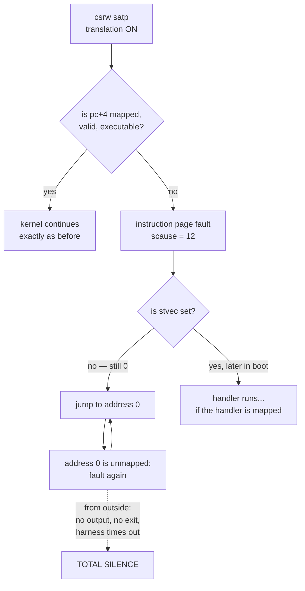
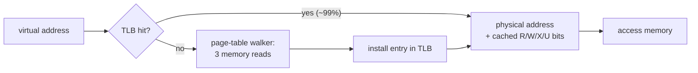

# Virtual Memory II: Turning the MMU On

## Overview

Last session you built a page table and proved it correct in software. Today you
hand it to the hardware. The switch is two instructions long and it is the most
dangerous moment in the kernel, because of a paradox: the instruction *after* the
one that enables address translation is itself fetched *through* it. If the code
doing the switching is not mapped at the address it is currently executing from,
the very next instruction fetch faults — and at that point in boot there is no
trap handler, so nothing prints, nothing exits, and QEMU sits there until the
harness times out. This session covers the
resolution (identity mapping), the kernel address space `kvmmake` builds region
by region and the permission each region earns, the exact encoding of `satp`,
what `sfence.vma` and the TLB have to do with correctness, and a catalogue of the
ways this goes wrong. Nearly all of them look like total silence, which is why
last Friday's GDB workshop came first. Exercise `09_virtual_memory` is the
switch; the [Sv39 Paging](../guides/sv39-paging.md) guide is the reference card.

## Learning Objectives

- **Explain** the bootstrap paradox of enabling address translation, and why it has no software-only solution.
- **Justify** identity mapping as the resolution, and state precisely what it does and does not change about a running kernel.
- **Enumerate** the regions the kernel page table must contain, and **justify** the permission bits each region is given.
- **Encode and decode** a `satp` value: MODE, ASID, and the root table's physical page number.
- **Describe** exactly what writing `satp` does — including the case where it does nothing at all, because the hart is in machine mode.
- **Explain** what a TLB caches, why it is not coherent with memory, and when `sfence.vma` is mandatory rather than decorative.
- **Diagnose** a failed MMU switch from its external symptom: silence, a fault loop, a `pc` of zero, or output that stops mid-line.
- **Contrast** rv6's identity map with xv6's split-permission map and with Linux's two-map jump into a high-half kernel.

## Prerequisites

- **L12 Virtual Memory I: Sv39 Page Tables** and exercise `03_paging` — `Pte`, `walk`, `mappages`, and the leaf/branch rule.
- **L11 Physical Memory and the Free List** and exercise `02_physical_memory` — `kalloc` supplies the root table and every table page below it.
- **L10 Boot: From Reset to kmain** and the [Memory Map](../guides/memory-map.md) guide — `kernel.ld`, the `end` symbol, and where the `virt` machine's devices live.
- The [Sv39 Paging](../guides/sv39-paging.md) guide — the `satp` and `sfence.vma` reference tables, and five worked translations.
- The [QEMU and GDB](../guides/qemu-gdb.md) guide — last Friday's workshop: `p/x $satp`, `info registers`, `monitor info mem`.
- The [RISC-V](../guides/riscv.md) guide — CSRs, `csrw`, and the machine/supervisor privilege split.

---

## 1. The Twenty Scariest Lines in the Course

### 1.1 The paradox, stated plainly

Here is the whole of `kvminithart` (`vm.rs:177-181`):

```rust
pub unsafe fn kvminithart(root: *mut Pte) {
    let satp = make_satp(root);
    asm!("csrw satp, {}", in(reg) satp);
    asm!("sfence.vma zero, zero");
}
```

Two instructions do the work. Think about what happens between them.

The `csrw` retires. Address translation is now on. The CPU increments the program
counter by four and fetches the next instruction — the `sfence.vma`. That fetch
is a **memory access**, and every memory access is now translated. The processor
takes the program counter, splits it into `VPN[2]`, `VPN[1]`, `VPN[0]` and an
offset, reads three levels of your page table, checks the `V` and `X` bits on the
leaf it lands on, and only then reads the four bytes it wanted.

```text
   cycle N          cycle N+1                     cycle N+2
  ┌──────────────┐ ┌───────────────────────────┐ ┌───────────────┐
  │ csrw satp    │ │ fetch pc+4                │ │ execute       │
  │ (physical)   │ │  -> pc+4 is a VIRTUAL     │ │ sfence.vma    │
  │              │ │     address now           │ │               │
  │ MMU: OFF     │ │  -> walk root[VPN2]       │ │               │
  │              │ │     L1[VPN1], L0[VPN0]    │ │               │
  │              │ │  -> need V=1 and X=1      │ │               │
  └──────────────┘ └───────────────────────────┘ └───────────────┘
                      MMU: ON, and it is already
                      deciding whether your kernel
                      is allowed to keep existing
```

The program counter changed meaning *between two adjacent instructions*, and so
did every other pointer the kernel holds: `sp`, `ra`, the `root` argument still
sitting in a register, the address of the UART. All were physical addresses a
nanosecond ago. Now they are virtual addresses that must translate to something.

> Key distinction: nothing *moved*. Not one byte of RAM changed. What changed is
> the interpretation of every number the CPU treats as an address. Turning on the
> MMU is a change of meaning, not a change of contents.

### 1.2 Why there is no one to catch you

If the fetch of `pc+4` fails, the hardware raises an instruction page fault and
jumps to the trap vector. At this point in boot, in rv6, the trap vector has never
been set: `trap::init` runs *after* `kvminithart` in `kinit` (`main.rs:87-94` in
the reference kernel; `main.rs:63-68` in exercise 13). So `stvec` is still zero,
and the trap jumps to virtual address `0`.

Virtual address `0` is not mapped either, so the fetch there faults, traps to
`stvec` = `0`, and faults again. The machine is now in a loop that executes no
instruction you wrote and produces no output, because producing output would
require executing an instruction. That is the "total silence" symptom, and it is
what a broken page table looks like from outside.



You cannot solve this in software after the fact. There is no "if the switch
fails, undo it" — the code that would undo it cannot be fetched. The only
solution is to make the switch a no-op for the code performing it.

### 1.3 Identity mapping

**Identity mapping** means building the page table so that each virtual address
maps to the numerically identical physical address: `va == pa`. Under an identity
map, translation is fully on and fully enforced, but the answer it produces is
the question it was asked.

That is exactly what the bootstrap needs. If the page holding `kvminithart` is
identity-mapped read-execute, `pc + 4` translates to `pc + 4` and the kernel does
not notice. If `sp` points into `STACK0` and that page is identity-mapped
read-write, the next `sd` works. Every pointer in every register survives, because
each translates to itself.

The mechanism is nothing special: an identity mapping is an ordinary leaf PTE
whose PPN happens to equal the VPN of the address it is reached by. `mappages`
does not know it is building one. It is the *arguments* that make it an identity
map — the same value passed as both `va` and `pa` (`vm.rs:132`):

```rust
mappages(root, UART0, PGSIZE, UART0, PTE_R | PTE_W)
//              ^^^^^        ^^^^^
//              va            pa      — the same number, twice
```

### 1.4 Three things identity mapping is not

**It is not "translation off."** Bare mode (`satp` MODE = 0) skips the page table
entirely. Under an identity map the hardware walks three levels of table for every
access and enforces `V`, `R`, `W`, `X` and `U` on the leaf. An identity-mapped
kernel can absolutely fault: jump into a device page mapped without `X` and you
get an instruction page fault, identity or not.

**It is not for user processes.** The kernel keeps its identity map for the life
of the machine, but every user process gets a table where virtual `0` maps to some
arbitrary physical page (`USER_CODE = 0x0`, `memlayout.rs:61`) — the entire point
of virtual memory. Identity mapping is a bootstrap technique, not the goal.

**It is not free of consequences.** Kernel virtual addresses now equal physical
addresses, so the kernel's address space can never be larger than physical memory.
On 32-bit machines with more than a gigabyte of RAM that becomes the "highmem"
problem that plagued Linux for a decade. rv6 has 128 MiB and 39 virtual bits, so
the question never arises.

---

## 2. Building the Kernel Address Space, Region by Region

### 2.1 The rule

> Key distinction: after the switch, an address the kernel touches that is not in
> the kernel page table does not exist. The rule for `kvmmake` is therefore
> mechanical — **if the kernel will touch it after the switch, map it now.**

Ask what addresses the kernel dereferences. It prints, so it touches the UART. It
exits QEMU, so it touches the test finisher. It executes instructions, uses a
stack, reads statics, allocates pages, and edits page tables — all in RAM. Later
exercises add interrupt handling, so the PLIC joins the list. That is the map.

### 2.2 The device pages

```rust
mappages(root, UART0,         PGSIZE,    UART0,         PTE_R | PTE_W)?; // vm.rs:132
mappages(root, TEST_FINISHER, PGSIZE,    TEST_FINISHER, PTE_R | PTE_W)?; // vm.rs:135
mappages(root, PLIC,          PLIC_SIZE, PLIC,          PTE_R | PTE_W)?; // vm.rs:138
```

Each is one identity-mapped MMIO region, read plus write, and each earns those
bits for a reason.

**Read and write, because MMIO registers are read and written.** `uart::putc`
does `write_volatile(0x1000_0000, c)` — a store. The console driver you write in
exercise 15 will *load* from the UART's line-status register to see whether a
byte has arrived. Deny either bit and the driver faults on its first access.

**Not executable, deliberately.** There are no instructions at `0x1000_0000`.
Leaving `X` clear costs nothing and converts an entire class of bug — a corrupted
function pointer, a wild jump, a return through a smashed stack slot — from
"executes whatever the UART's registers happen to look like" into a clean
instruction page fault with the faulting address in `stval`. Permissions you do
not need are free protection.

**Sizes come from the device.** The UART (`memlayout.rs:17`) and the test
finisher (`memlayout.rs:21`) are one page each. The PLIC is 4 MiB
(`memlayout.rs:27`) — 1024 pages, two whole level-0 tables at `VPN[1] = 96` and
`97`. One `mappages` call still does it; the size argument is what differs.

### 2.3 RAM, in one call

```rust
mappages(root, KERNBASE, PHYSTOP - KERNBASE, KERNBASE, PTE_R | PTE_W | PTE_X)?; // vm.rs:141-151
```

One call maps all 128 MiB of RAM (`KERNBASE`, `memlayout.rs:10`; `PHYSTOP`,
`memlayout.rs:13`), and that single line covers four different things the kernel
needs:

| What | Where it lives | Why the RAM map covers it |
|---|---|---|
| Kernel text | `0x8000_0000` upward, `kernel.ld:16-23` | the instruction after `csrw satp` |
| Kernel rodata, data, bss | above `.text`, `kernel.ld:25-41` | string literals, statics, the free-list head |
| The boot stack | `STACK0` in `.bss`, `entry.rs:14` | `sp` must keep working |
| Everything `kalloc` hands out | from `end` (`kernel.ld:43`) to `PHYSTOP`, `kalloc.rs:23` | **including the page tables themselves** |

That last row is the subtle one. The root table and its 66-odd children came from
the same free list as everything else, so they sit between `end` and `PHYSTOP` —
inside the region this call maps. The kernel page table maps itself.

Note the argument that trips people: the third parameter is a **size**, not an end
address. `PHYSTOP - KERNBASE` is `0x0800_0000`, not `0x8800_0000`. Pass `PHYSTOP`
and everything still "works" — Practice Problem 3 is what that costs.

### 2.4 The permissions each region deserves

The kernel image is not one homogeneous blob. The linker script gives it four
regions with genuinely different needs:

| Region | Contents | Deserves | Why |
|---|---|---|---|
| `.text` | instructions | `R X` | must be fetchable; must **not** be writable, or a stray pointer rewrites the kernel |
| `.rodata` | string literals, constant tables | `R` | never written, never executed |
| `.data` / `.bss` | statics, `STACK0`, the free list | `R W` | written constantly; must **not** be executable |
| free pages | page tables, stacks, user page contents | `R W` | data the kernel manipulates, never kernel instructions |
| MMIO | device registers | `R W` | see §2.2 |

Those rows express **W^X** — *write xor execute*: no page is both writable and
executable. It is why injected shellcode on a stack does not run and why an
overflow into `.text` faults instead of taking over the machine.

rv6 does not do this. It maps all of RAM `PTE_R | PTE_W | PTE_X` in one call,
because getting the split right is fiddly and one mistake is an instant,
undebuggable fault. A `.text`-only mapping needs the `etext` boundary provided at
`kernel.ld:22`, and two calls instead of one — and if the first stops a page
short, the last page of `.text` is unmapped and the kernel dies on a fetch it
cannot report.

> Key distinction: rv6's `R W X` on RAM is a *pedagogical* choice, not a design
> claim. It buys a table you can get right on the first try, at the cost of the
> single most valuable protection a kernel page table provides. xv6 makes the
> other choice and pays two extra lines for it (§6).

Notice what rv6 does *not* give up. The user side of the same file is strict:
user code pages are `PTE_R | PTE_X | PTE_U` (`vm.rs:228`) and the user stack is
`PTE_R | PTE_W | PTE_U` (`vm.rs:245`). W^X is enforced exactly where an attacker
would be — in user memory — and relaxed only in the kernel's own map.

### 2.5 What you do not have to map

**The page tables, for the walk's sake.** The hardware walker uses *physical*
addresses throughout — `satp` holds the root's physical page number, every branch
PTE holds the next table's — so translation would work even with the tables
unmapped. They must be mapped anyway, because the *kernel* reaches them through
`*mut Pte` pointers when it calls `walk` again, and those pointers are virtual
after the switch.

**The CLINT.** The timer registers at `0x0200_0000` (`start.rs:17-18`) are touched
only by machine-mode code, and machine-mode accesses bypass `satp` entirely (§3.4).
The kernel page table has no CLINT entry and needs none.

**Anything above `PHYSTOP`.** There is no RAM there. Leaving it unmapped means a
runaway pointer faults instead of silently reading a nonexistent physical address.

Here is the full ex09 map, and what it costs:

```text
  virtual                              physical           perms   pages of table
  ─────────────────────────────────────────────────────────────────────────────
  0x0010_0000  (1 page)      ───────►  0x0010_0000        R W     ┐
  0x1000_0000  (1 page)      ───────►  0x1000_0000        R W     │ 1 root
  0x8000_0000 .. 0x8800_0000 ───────►  same, 128 MiB      R W X   │ 2 level-1
                                                                  │ 66 level-0
  (later: PLIC 4 MiB R W, TRAMPOLINE 1 page R X)                  ┘ = 69 pages
                                                                    = 276 KiB
```

The device gigabyte (`VPN[2] = 0`) needs one level-1 table and two level-0 tables
— the UART lands at `VPN[1] = 128`, the test finisher at `VPN[1] = 0`,
`VPN[0] = 256`. The RAM gigabyte (`VPN[2] = 2`, because `KERNBASE` is exactly
2 GiB) needs one level-1 table and 64 level-0 tables, one per 2 MiB. 276 KiB of
tables for 128 MiB of address space: about 0.2%, the standard price of 4 KiB
pages.

### 2.6 One non-identity mapping, later

From exercise 18 on, `kvmmake` gains a fifth region that is *not* identity-mapped:
the trampoline (`vm.rs:169`), one page of assembly at `TRAMPOLINE`
(`memlayout.rs:53`, the top page of the address space) with `PTE_R | PTE_X`. It
sits at the same virtual address in the kernel's table and in every user table, so
the instruction stream survives the `csrw satp` that switches between them — the
same paradox as today, on every trap. That is L22's problem; recognize it when it
returns.

---

## 3. `satp`: The Register That Turns It On

### 3.1 The encoding

`satp` — Supervisor Address Translation and Protection — is one 64-bit CSR with
three fields.

```text
  63    60 59              44 43                                    0
 ┌────────┬──────────────────┬────────────────────────────────────────┐
 │  MODE  │       ASID       │        PPN of the ROOT table           │
 │ 4 bits │     16 bits      │               44 bits                  │
 └────────┴──────────────────┴────────────────────────────────────────┘
```

| Field | Bits | rv6's value | Meaning |
|---|---|---|---|
| MODE | 63:60 | `8` | `0` = Bare (no translation), `8` = Sv39, `9` = Sv48, `10` = Sv57 |
| ASID | 59:44 | `0` | address-space identifier; tags TLB entries so a switch need not flush |
| PPN | 43:0 | `root >> 12` | the root table's **physical page number**, not its address |

Three details cause most of the bugs. MODE `8` is the whole switch — write `0`
and you have politely asked the hardware to do nothing. The PPN field holds the
root address *shifted right by 12*, for the same reason a PTE does: a table is
page-aligned. And `satp` names a **physical** address, necessarily: it is the one
pointer in the machine that cannot be virtual, because it is what gives virtual
addresses meaning.

### 3.2 `make_satp`

Two lines (`vm.rs:104-108`):

```rust
pub const SATP_SV39: usize = 8 << 60;

pub fn make_satp(root: *mut Pte) -> usize {
    SATP_SV39 | ((root as usize) >> 12)
}
```

For the rv6 kernel table, whose root is the first page `kalloc` hands out and
therefore the highest page in RAM, `0x87FF_F000`:

```text
  root              = 0x0000_0000_87FF_F000
  root >> 12        = 0x0000_0000_0008_7FFF     (PPN)
  SATP_SV39         = 0x8000_0000_0000_0000     (MODE = 8, bits 63:60)
  satp              = 0x8000_0000_0008_7FFF
```

That literal value is worth memorizing for this course: the leading `8` is Sv39,
and everything after it is a page number ending in the last three digits of a RAM
address. If you `p/x $satp` in GDB and see something that does not start with `8`,
paging is off. If you see something whose PPN, shifted left 12, is not inside
`0x8000_0000..0x8800_0000`, your root table is not in RAM.

### 3.3 What the write actually does

`csrw satp, t0` does not walk anything, validate anything, or copy anything. It
writes 64 bits into one register. Everything that follows is a consequence:

1. From the next instruction on, the address-translation hardware is in Sv39 mode
   for supervisor and user accesses.
2. The address translation for the *next fetch* is resolved by walking the tree
   whose root is at `PPN << 12`.
3. Any translation the TLB had cached from a previous `satp` value may now be
   wrong. Hence `sfence.vma`, §4.

Writing MODE `0` would turn translation back off, and nobody does: by then every
pointer in flight is virtual, so switching back changes their meaning again — the
paradox in reverse.

### 3.4 The genuinely confusing part: machine mode

Here is something that will not add up unless someone tells you.

Address translation applies to instruction fetches and data accesses made in
**supervisor** and **user** mode. Machine mode accesses are never translated, no
matter what `satp` contains.

Now look at how the kernel is entered in exercise 09. `entry.rs:17` says
`call kmain`. There is no `start.rs` in this exercise — it first appears in
`13_traps` — so the hart is still in **machine mode** when `kvminithart` runs. The
`csrw satp` executes, the register takes the value, and translation does not
actually take effect. Your identity map is installed and unused.

From exercise 13 on, `entry.rs:23` says `call start` instead. `start.rs` clears
`satp` (`start.rs:37`), sets `mstatus.MPP` to supervisor, points `mepc` at `kmain`,
and executes `mret` (`start.rs:54`). Now `kmain` — and the `kvminithart` inside
`kinit` — runs in supervisor mode, and the switch is real.

> Key distinction: exercise 09 asks you to build a *correct* kernel page table and
> install it. Exercise 13 is where a wrong one kills the machine. The table is the
> same table; the privilege mode is what makes it load-bearing.

This is not a cheat. It is the reason the exercise is survivable: rv6 has you
build and verify the table under conditions where a mistake cannot wedge the
machine, and by the time the hardware genuinely depends on it you have already
proved it right. Do not use it as an excuse to be sloppy — the exercise harness
checks every mapping with `walk` before it calls `kvminithart` precisely so that
"it passed" means "this table would have worked."

---

## 4. `sfence.vma` and the TLB

### 4.1 What a TLB caches

Every translation costs three dependent memory reads (§5.1 of the previous
lecture). Doing that on every load, store, and fetch would make the machine
roughly four times slower. So every real CPU keeps a **TLB** — Translation
Lookaside Buffer — a small, fully-associative cache of recent virtual-page →
physical-page results, together with the permission bits that came with them.



Hit rates in the high nineties are normal, which is why a three-read walk costs
almost nothing on average — and why an address-space switch, which invalidates the
cache, is genuinely expensive.

### 4.2 The TLB is not coherent with memory

This is the fact that makes `sfence.vma` necessary. When you store a new value
into a PTE, that store goes to RAM (through the data cache) like any other store.
The TLB is not listening. It is a separate structure indexed by virtual page
number, and it has no idea that the bytes its entry was derived from have changed.

So after you edit a live page table, the hardware may keep using the old
translation — for an unbounded time, until that entry is naturally evicted. The
resulting bug is the worst kind: it depends on TLB pressure, so it reproduces
once an hour, moves when you add a `printf`, and looks like faulty hardware.

`sfence.vma` is the instruction that fixes this. It does two jobs at once:

| Job | What it means |
|---|---|
| **Invalidate** | discard cached translations, so the next access re-walks the table |
| **Order** | guarantee that page-table stores issued *before* the fence are visible to walks that happen *after* it |

The forms (see the [Sv39 Paging](../guides/sv39-paging.md) guide for the table):
`sfence.vma zero, zero` flushes everything; `sfence.vma rs1, zero` flushes the one
virtual address in `rs1`; `sfence.vma zero, rs2` flushes one ASID. rv6 only ever
uses the sledgehammer.

### 4.3 When you must flush

- **After writing `satp`.** The old address space's entries are still in there.
  `kvminithart` does exactly this at `vm.rs:180`.
- **After changing any PTE in a page table that is currently installed.** Changing
  permissions, unmapping a page, or remapping one to different physical memory.
- **After making an invalid PTE valid.** RISC-V is stricter than x86 here: the
  specification permits an implementation to cache the *absence* of a mapping, so
  "I only added a mapping, nothing could be stale" is not a valid argument on this
  architecture. Practice Problem 5.

rv6's `mappages` never fences, and that is correct *because of an invariant*, not
by luck: a table is always built to completion before it is installed in `satp`,
and user tables are edited while the hart runs on the kernel's table. Break the
invariant — lazy allocation, demand paging, copy-on-write — and every edit needs a
fence.

> Key distinction: QEMU flushes its internal translation cache on more occasions
> than real silicon flushes a TLB. A missing `sfence.vma` is therefore exactly the
> class of bug that passes every test you can run in this course and fails on a
> real board. Write the fence because the architecture requires it, not because
> the emulator caught you.

### 4.4 The bracket pattern

rv6's `kvminithart` writes `satp` and then fences. The switch between the kernel's
and a user's address space, which you will meet in L22, fences on *both* sides
(`usermode.rs:133-135` and `usermode.rs:140-142`):

```asm
sfence.vma zero, zero
csrw satp, t1
sfence.vma zero, zero
```

The leading fence makes page-table writes issued before this moment visible to the
walker about to run; the trailing one discards translations cached for the address
space you just left. xv6's `kvminithart` uses the same bracket at boot. rv6 omits
the leading fence there, which is safe on a freshly reset single hart with an empty
TLB — the kind of "safe because of context" that stops being safe as soon as
someone copies the function elsewhere.

---

## 5. The Failure Catalogue

This is the practical heart of the session. Enabling paging is unusual among
kernel operations in that most of its failure modes produce **no diagnostic
output at all**. Learning to read the shape of the silence is the skill.

### 5.1 Why silence is the default answer

Printing requires executing an instruction (kernel text mapped executable), using
the stack (`.bss` mapped read-write), and storing to `0x1000_0000` (the UART page
mapped read-write). A broken kernel page table breaks at least one of those,
usually the first. There is no panic message available, because a panic message is
a print.

That is precisely why last Friday's session was the QEMU/GDB workshop. When the
machine cannot tell you anything, you attach a debugger and ask the hardware:
`p/x $satp`, `info registers pc sepc scause stval`, `monitor info mem`.

### 5.2 The catalogue

| Mistake | What the machine does | How you tell |
|---|---|---|
| RAM region not mapped, or mapped without `X` | Instruction page fault on the fetch after `csrw satp`; `stvec` still 0, so `pc` → 0, fault loop | `pc = 0x0`, `scause = 0xc` (12), `stval` = an address in kernel text, `satp` starts with `8` |
| `PHYSTOP - KERNBASE` written as `PHYSTOP` | **Nothing visible.** 2.1 GiB mapped instead of 128 MiB, 1091 table pages consumed instead of 65 | `monitor info mem` shows RAM running past `0x8800_0000` |
| UART page not mapped | Kernel survives the switch, then dies on its first `putc`: store page fault | Not one byte of output; with `trap::init` done, a fault loop inside the trap printer |
| Test-finisher page not mapped | Kernel runs, prints, then hangs at `exit_success` | `OSLINGS:PASS` appears and QEMU never exits; harness times out at 10 s |
| `make_satp` forgets `>> 12` | Root "table" at `0x87FF_F000_000`, ~8.5 TiB up, where no memory exists | `scause = 1` (instruction **access** fault, not page fault) — the walk itself could not read a PTE |
| `make_satp` omits `SATP_SV39` | MODE = 0 = Bare. Translation never turns on. Kernel runs perfectly | Silent no-op; caught only by checking `satp >> 60 == 8` |
| `PTE_R` set on a branch PTE | Hardware stops at level 2 or 1, reads it as a mis-aligned superpage | Fault on the first translated access; software `walk` reports the table as fine |
| Leaf mapped without `PTE_R` | Hardware reads `RWX = 000` as a *branch* and walks into your data page | Garbage translations, or a fault deep in a table that is not a table |
| Live PTE changed with no `sfence.vma` | Stale translation used for an unbounded time | Rare, non-deterministic, moves when you add a print. Not reproducible on QEMU |

Two rows deserve their distinction spelled out, because `scause` tells them apart
and students conflate them:

| `scause` | Name | Means |
|---|---|---|
| 1 | instruction access fault | the *hardware* could not read memory it needed — including a PTE at a nonexistent physical address |
| 5 / 7 | load / store access fault | same, for data |
| 12 | instruction page fault | the page table said no: entry invalid, or `X` clear |
| 13 / 15 | load / store page fault | the page table said no: entry invalid, or `R` / `W` clear |

> Key distinction: a **page** fault means your table refused. An **access** fault
> means your table could not even be read. If you see `scause = 1` right after
> turning the MMU on, suspect `satp` itself, not the mappings.

### 5.3 Verify before you switch

Because the failure mode is silence, rv6 inverts the usual order: prove the table
correct while a mistake is still printable, then flip the switch. The exercise
harness (`09_virtual_memory`, `main.rs:76-124`) does exactly that. With the MMU
still off it calls `walk` on each required region and checks that the leaf exists,
that its physical address equals its own page base (identity), and that the needed
permission bits are set — `main.rs:85` for the UART, `:89` for the test finisher,
`:94` for kernel RAM, and `:99-104` for the page the current stack pointer is on,
located by taking the address of a local. Then it checks `satp` itself: MODE is 8
(`main.rs:108`) and the PPN really is `root >> 12` (`:112`). Only at `main.rs:118`
does it call `kvminithart`.

The pattern generalizes far beyond this exercise: **when the failure mode is
silence, add a check that runs before the dangerous step and speaks.** You will
use it again for trap vectors, for the trampoline, and for the first jump to user
mode.

### 5.4 Reading the silence

Three diagnostic questions, in order, will localize almost any failure here:

```text
  1. Did the switch even happen?
       p/x $satp     ->  0x0                 : make_satp or the csrw is wrong
                     ->  0x8000....0008_7FFF : paging is on, root is in RAM
                     ->  starts with 0       : MODE field missing (Bare)

  2. Where did it die?
       info registers pc sepc scause stval
       pc == 0                : trapped with stvec unset — this is boot-time
       scause == 12           : could not FETCH; stval is the address it wanted
       scause == 15           : could not STORE; stval is the address it wanted
       stval == 0x1000_0000   : the UART. You forgot the UART page.
       stval in 0x8000_xxxx   : kernel text or data. Check the RAM mapping.

  3. What does the hardware think is mapped?
       monitor info mem       : one line per contiguous mapping, with perms.
                                Missing region = missing mappages call.
```

---

## 6. How Others Do It

**xv6-riscv** is rv6's parent, and its `kvmmake` differs in two ways. It splits
kernel text from kernel data — `KERNBASE..etext` read-execute, `etext..PHYSTOP`
read-write — using the same `etext` symbol `kernel.ld:22` provides and rv6
ignores. That is real kernel W^X for one extra `mappages` call and one `extern`
declaration. It also maps the virtio disk's MMIO page, which rv6 does not need.
Everything else is the same design; reading `kernel/vm.c` beside `vm.rs` is a
productive hour.

**Linux** does not run identity-mapped, and the way it escapes is the most direct
answer to today's paradox. A Linux kernel is linked at a high virtual address
(on RISC-V, in the top half of the address space) but loaded at whatever physical
address the bootloader chose. So early boot builds a temporary page table that
maps the kernel's text at **both** addresses at once — identity, and at its final
virtual address — enables translation with that table, and then executes a jump to
the high address. The jump is the moment the kernel leaves the identity map. After
it lands, the identity half of the temporary table is thrown away and the real
kernel page table takes over.

```text
  rv6 / xv6                          Linux
  ─────────────────────────          ──────────────────────────────────────
  build identity map                 build a table mapping text TWICE:
  csrw satp                            identity, and at the link address
  next fetch translates to itself    csrw satp
  (kernel never moves)               next fetch translates to itself (identity)
                                     jump to the high virtual address
                                     drop the identity half
                                     (kernel now lives where it was linked)
```

Both are the same trick: **make the currently executing code valid under the new
mapping**. Identity mapping is the cheap version, which is why every teaching
kernel uses it; the double map plus a jump is what you do when the kernel must
end up somewhere other than where it was loaded.

Linux adds everything we omit: ASIDs so a process switch need not flush the TLB;
TLB shootdown by inter-processor interrupt, because `sfence.vma` on one hart does
not touch another's TLB; superpages for the linear map; and `PTE_G` on kernel
mappings. rv6 has one hart, one ASID, and 4 KiB pages everywhere.

---

## Key Concepts

| Concept | Definition | Example |
|---|---|---|
| Bootstrap paradox | The instruction after the one enabling translation is itself fetched through translation. | the `sfence.vma` at `vm.rs:180` |
| Identity mapping | A mapping where `va == pa`, so translation is on but transparent. | `mappages(root, UART0, PGSIZE, UART0, ..)`, `vm.rs:132` |
| `satp` | The CSR naming the active page table: MODE, ASID, root PPN. | `0x8000_0000_0008_7FFF` |
| `SATP_SV39` | The MODE field value 8, pre-shifted to bit 60. | `8 << 60`, `vm.rs:104` |
| ASID | Address-space id tagging TLB entries so a switch need not flush. | always 0 in rv6 |
| MMIO region | Device registers mapped into the physical address space. | `UART0` (`memlayout.rs:17`), `PLIC` (`memlayout.rs:26`) |
| W^X | No page is both writable and executable. | user code `R X U` (`vm.rs:228`) vs. stack `R W U` (`vm.rs:245`) |
| `etext` | Linker symbol at the end of `.text`; the W^X boundary rv6 does not use. | `PROVIDE(etext = .)`, `kernel.ld:22` |
| TLB | Hardware cache of recent virtual-page → physical-page translations. | why three-read walks cost nothing on average |
| `sfence.vma` | Invalidates cached translations and orders page-table stores. | `sfence.vma zero, zero`, `vm.rs:180` |
| Page fault | The table refused the access (`scause` 12/13/15). | unmapped kernel text after a bad `kvmmake` |
| Access fault | Memory the hardware needed — including a PTE — could not be read (`scause` 1/5/7). | `satp` PPN built without `>> 12` |

---

## Practice Problems

### Problem 1: Build and decode `satp`

(a) The root table is at physical `0x8004_2000`. Give the `satp` value
`make_satp` (`vm.rs:106-108`) returns, in hex, showing the arithmetic.
(b) Decode `0x8000_0000_0008_7FFF` into MODE, ASID, and root table address.
(c) A student writes `SATP_SV39 | (root as usize)`, forgetting the shift, with
`root = 0x87FF_F000`. What does the hardware do on the next instruction fetch, and
which `scause` results?

<details>
<summary>Click to reveal solution</summary>

**(a)**

```text
  root       = 0x0000_0000_8004_2000
  root >> 12 = 0x0000_0000_0008_0042      (PPN)
  SATP_SV39  = 0x8000_0000_0000_0000
  satp       = 0x8000_0000_0008_0042
```

**(b)**

```text
  MODE = satp >> 60                       = 0x8 = 8  -> Sv39
  ASID = (satp >> 44) & 0xFFFF            = 0
  PPN  = satp & 0xFFF_FFFF_FFFF           = 0x8_7FFF
  root = PPN << 12                        = 0x8000_0000 + 0x7FFF_000 = 0x87FF_F000
```

Root table at `0x87FF_F000` — the top page of RAM, which is the *first* page
`kalloc` returns, since `free_range` pushes pages upward onto a stack
(`kalloc.rs:26-32`).

**(c)** The PPN field becomes `0x87FF_F000` instead of `0x8_7FFF`. The hardware
reads that as a page *number* and looks for the root table at
`0x87FF_F000 << 12 = 0x87F_FFF0_0000` — about 8.5 TiB up, where the `virt` machine
has nothing.

The first translated fetch starts a walk whose first memory read targets a
nonexistent physical address. That is not a page fault — the table never got to
express an opinion — it is an **instruction access fault**, `scause = 1`. Spotting
`1` rather than `12` right after `csrw satp` is the fastest way to tell "my `satp`
is wrong" from "my mappings are wrong."

</details>

### Problem 2: Order the boot steps

Put these in the order `kinit` must run them, and then name the two orderings that
are not merely conventional but mandatory, and say what breaks if each is reversed.

```text
  A. mappages(root, KERNBASE, PHYSTOP - KERNBASE, KERNBASE, R|W|X)
  B. kalloc::init()
  C. csrw satp, make_satp(root)
  D. root = kalloc()  (and zero it)
  E. sfence.vma zero, zero
  F. trap::init()   (installs stvec)
  G. uart::init()
  H. mappages(root, UART0, PGSIZE, UART0, R|W)
```

<details>
<summary>Click to reveal solution</summary>

Order: **G, B, D, H, A, C, E, F** — matching `kinit` at `main.rs:87-94`, where
`vm::kvminithart(vm::kvmmake())` collapses D-H-A-C-E into one line.

Two orderings are mandatory:

1. **B before D.** `kalloc::init` builds the free list; `kalloc` returns null
   before it runs, `kvmmake` returns null, and the harness reports
   `kvmmake returned null`. The same dependency covers every table page `walk`
   allocates inside H and A.

2. **H and A before C.** Both mapping calls must complete before the `csrw`.
   Reverse A and C and the instruction after the `csrw` cannot be fetched — total
   silence. Reverse H and C and the kernel survives the switch but dies on its
   next `putc`.

One ordering that looks mandatory and is not: **F after C**. Installing `stvec`
before the switch would give you a handler — but the handler's code and stack live
in the very RAM region a broken table failed to map, so it would fault on entry.
No ordering makes a broken kernel map survivable, which is the point of §5.3.

</details>

### Problem 3: Find the bug

A student writes:

```rust
mappages(root, KERNBASE, PHYSTOP, KERNBASE, PTE_R | PTE_W | PTE_X)?;
```

The exercise harness prints `OSLINGS:PASS`. The kernel boots. Everything works.
What is wrong, and what did it cost?

<details>
<summary>Click to reveal solution</summary>

The third argument is a **size**, not an end address. The correct size is
`PHYSTOP - KERNBASE = 0x0800_0000` (128 MiB). Passing `PHYSTOP = 0x8800_0000`
maps 2.125 GiB, running from `0x8000_0000` to `0x1_07FF_FFFF`.

Why nothing complains: the harness checks that `KERNBASE` is identity-mapped
`R|W|X` (`main.rs:94`) and that the stack page is mapped (`main.rs:99-104`). Both
are true. Extra mappings are not checked because nothing dereferences them.

What it cost:

```text
  correct:  128 MiB / 2 MiB   =  64 level-0 tables + 1 level-1 =   65 pages
  buggy:   2176 MiB / 2 MiB   = 1088 level-0 tables + 3 level-1 = 1091 pages
```

1091 pages is 4.26 MiB of page tables — about 3.3% of the machine's RAM, gone,
versus 260 KiB. `kalloc` still had 32,000 pages, so it succeeded silently.

The real cost is not memory. `0x8800_0000` to `0x1_07FF_FFFF` are now **valid,
writable, executable** addresses translating to memory the board does not have. A
pointer running off the top of RAM used to give a clean page fault with the bad
address in `stval`; now it gives an access fault from deeper in, or on other
hardware reaches a device. `monitor info mem` shows it at a glance: the RAM lines
run past `0x8800_0000`.

</details>

### Problem 4: Predict what QEMU prints

A student's `kvmmake` maps the test finisher and `KERNBASE..PHYSTOP` correctly but
omits the UART entirely. Predict the console output (a) in exercise 09, and (b) in
the exercise-13 kernel, where `kmain` runs in supervisor mode and `kinit` is
`uart::init(); kalloc::init(); kvminithart(kvmmake()); proc::init(); trap::init();`
followed by `uart::puts(BANNER)`.

<details>
<summary>Click to reveal solution</summary>

**(a) Exercise 09.** The harness never reaches the dangerous step:

```text
rv6 booting (exercise 09: virtual memory)...
  [fail] UART page not identity-mapped read+write
OSLINGS:FAIL
```

The check at `main.rs:85` runs with the MMU off and calls `walk(root, UART0,
false)`, which returns null because no level-0 table exists for `VPN[1] = 128`.
QEMU then exits normally via the test finisher. This is §5.3 working as designed:
a precise sentence instead of a hang.

**(b) Exercise 13.** Nothing. Not one character.

`uart::init()` runs before the switch and works. `kvminithart` installs the table;
the RAM map is correct, so the fetch after `csrw satp` succeeds and the kernel
keeps running. `proc::init` and `trap::init` touch only RAM, so they succeed —
and `trap::init` sets `stvec`, so there *is* a handler now.

Then `uart::puts("\n")` stores to `0x1000_0000`. Unmapped: **store page fault**,
`scause = 15`, `stval = 0x1000_0000`. The trap handler runs, and its first
instinct is to print a diagnostic — through the UART. That store faults too. Fault
loop, no output, QEMU never exits, `oslings` times out after 10 seconds.

The lesson is the ordering. The same missing mapping produced a clear message in
(a) and total silence in (b), and the only difference is whether anything checked
before trusting. Note also that a trap handler is not a safety net when the thing
it needs is the thing that is broken.

</details>

### Problem 5: The fence you think you do not need

The kernel is running with paging on. It maps a brand-new page into the *live*
kernel page table:

```rust
mappages(kernel_root, 0x8500_0000, PGSIZE, some_page, PTE_R | PTE_W)?;
// no sfence.vma
*(0x8500_0000 as *mut u64) = 42;
```

Nothing was previously mapped at `0x8500_0000`. Argue whether the fence is needed,
and explain why this bug is unlikely to be caught by any test you can run in this
course.

<details>
<summary>Click to reveal solution</summary>

**The fence is needed.** The intuition that says otherwise — "the TLB caches
translations, and there was no translation to cache, so nothing can be stale" — is
correct on x86 and wrong on RISC-V. The RISC-V privileged specification permits an
implementation to cache the result of a walk that found an **invalid** entry. A
hart may have speculatively walked `0x8500_0000` (a mispredicted branch, a
prefetch) before the `mappages` call, cached "not mapped," and will keep faulting
on the store afterwards. Making an invalid PTE valid requires `sfence.vma` on this
architecture. Explicitly.

Why it will not be caught here: QEMU flushes its translation cache far more
aggressively than a real TLB and does not model speculative walks at all. The
store will work, every time, on every machine in this class. It fails on real
silicon, intermittently, under load.

rv6's `mappages` gets away without a fence only because rv6 never does what this
snippet does (§4.3). The invariant, not the code, is what makes it safe.

</details>

### Problem 6: Diagnose the register dump

You attach GDB to a hung kernel and see:

```text
(gdb) info registers pc satp scause stval sepc
pc      0x0
satp    0x8000000000087fff
scause  0xc
stval   0x800061a4
sepc    0x800061a4
```

Say exactly what happened, in order, and name the most likely single line of
`kvmmake` at fault.

<details>
<summary>Click to reveal solution</summary>

Read it right to left.

`satp = 0x8000_0000_0008_7FFF`: MODE 8, so **the switch happened** — this is not a
"paging never turned on" bug. The root table is at `0x87FF_F000`, the top page of
RAM, exactly where `kalloc`'s first allocation lands. `satp` itself is fine.

`scause = 0xc = 12`: **instruction page fault.** The hardware could not fetch. Not
an access fault, so the walk read real memory and the page table gave a definite
"no": either the leaf was invalid, or its `X` bit was clear.

`stval = sepc = 0x8000_61A4`: the address it could not fetch, and the PC when the
trap was taken. That address is in `0x8000_xxxx` — kernel text, a few tens of KiB
into the image. So the kernel could not fetch its own code.

`pc = 0x0`: after the trap, control went to `stvec`, still zero because
`trap::init` has not run. Address 0 is unmapped, so the fetch there faulted too,
trapping to 0 again. The machine has been looping on a fault at address 0 since
boot. In a longer-running loop expect `sepc` and `stval` to be overwritten by the
*latest* fault — break at the trap vector to catch fault number one.

**Verdict:** the `KERNBASE..PHYSTOP` mapping is missing, too short, or lacks
`PTE_X` — the call at `vm.rs:141-151`. Given `stval` sits low in the image, "too
short" is unlikely; check first that `PTE_X` is in the permission argument, then
that the size argument is `PHYSTOP - KERNBASE`.

</details>

---

## Further Reading

- [Sv39 Paging](../guides/sv39-paging.md) — the `satp` field table, the three `sfence.vma` forms, the predicted allocation order of the kernel's 74 table pages, and five worked translations.
- [QEMU and GDB](../guides/qemu-gdb.md) — last Friday's workshop: attaching, `p/x $satp`, walking a page table by hand with `x/gx`, `monitor info mem`, and the full diagnostic playbook.
- [Memory Map](../guides/memory-map.md) — `kernel.ld` line by line, `etext` and `end`, the `virt` physical map, and the kernel's virtual address space as a table.
- [RISC-V](../guides/riscv.md) — CSR access, `csrw`, and the machine/supervisor/user privilege split that §3.4 turns on.
- [Key Concepts](../guides/key-concepts.md) — the running glossary.
- *The RISC-V Instruction Set Manual, Volume II: Privileged Architecture* — the `satp` register, the "Virtual Address Translation Process" algorithm, and the `SFENCE.VMA` section, which contains the sentence about caching invalid entries that Practice Problem 5 turns on.
- xv6-riscv, `kernel/vm.c` — `kvmmake` and `kvminithart` in C, with the `etext` split rv6 leaves out.
- Cox, Kaashoek, and Morris, *xv6: a simple, Unix-like teaching operating system*, chapter 3.
- Linux, `arch/riscv/kernel/head.S` and `arch/riscv/mm/init.c` — the early page table that maps the kernel twice, and the jump that leaves the identity map behind.

---

## Summary

1. **The instruction after the switch is fetched through the switch.** `csrw satp` turns translation on, and the very next instruction fetch is a translated memory access. If the executing code is not mapped at the address it is running from, the fetch faults with no handler installed, and the machine goes silent.

2. **Identity mapping is the resolution.** Build the table so `va == pa` for everything the kernel touches, and turning the MMU on changes nothing observable: `pc`, `sp`, and every pointer in flight translate to themselves. Translation is fully on and fully enforced — it just answers with the question.

3. **The rule for `kvmmake` is mechanical.** If the kernel will touch it after the switch, map it now: the UART (`vm.rs:132`), the test finisher (`vm.rs:135`), the PLIC (`vm.rs:138`), and all of RAM (`vm.rs:141-151`) — which in one call covers kernel text, data, the boot stack, and the page tables themselves.

4. **Permissions are where rv6 compromises.** Devices get `R W` and no `X`, so a wild jump faults instead of executing register contents. RAM *deserves* `R X` for text, `R` for rodata, `R W` for data — real W^X — and rv6 gives it `R W X` in one call because the `etext` split (`kernel.ld:22`) is fiddly and one mistake is undebuggable. xv6 makes the other trade in two lines.

5. **`satp` is MODE, ASID, and a page number.** MODE 8 means Sv39 (`SATP_SV39 = 8 << 60`, `vm.rs:104`); ASID is 0 in rv6; the PPN field is `root >> 12`, not `root`. The kernel's value is `0x8000_0000_0008_7FFF`. Forgetting the shift produces an access fault (`scause` 1); forgetting the MODE produces a silent no-op.

6. **Machine mode ignores `satp`, which is why exercise 09 is survivable.** Through exercise 12 `entry.rs` calls `kmain` directly, the hart stays in machine mode, and translation never takes effect. From exercise 13 `start.rs` `mret`s into supervisor mode and the same table becomes load-bearing. Build it as if your life depended on it; in three exercises it will.

7. **The TLB is not coherent with memory, and `sfence.vma` is how you say so.** Flush after writing `satp` (`vm.rs:180`), after changing any live PTE, and — RISC-V specifically — after making an invalid entry valid. QEMU is more forgiving than real hardware, so this is the bug class that passes every test you can run.

8. **When the failure mode is silence, check before you commit.** The exercise harness verifies every region with `walk` while the MMU is still off and validates `satp` before installing it (`main.rs:76-124`), so a bug prints a sentence instead of hanging the machine. Read `pc`, `satp`, `scause`, and `stval` in that order; `scause` 12 means your mappings are wrong, `scause` 1 means your `satp` is.

---

**Next:** exercise `09_virtual_memory` builds the kernel page table and turns the
MMU on — `make_satp` and `kvmmake`, verified before the switch. Read its
`README.md` first; it tells you what to write, and this page tells you why the
machine either keeps running or goes quiet. Thursday's L17 takes the booted,
paging kernel and gives it a filesystem and devices.
