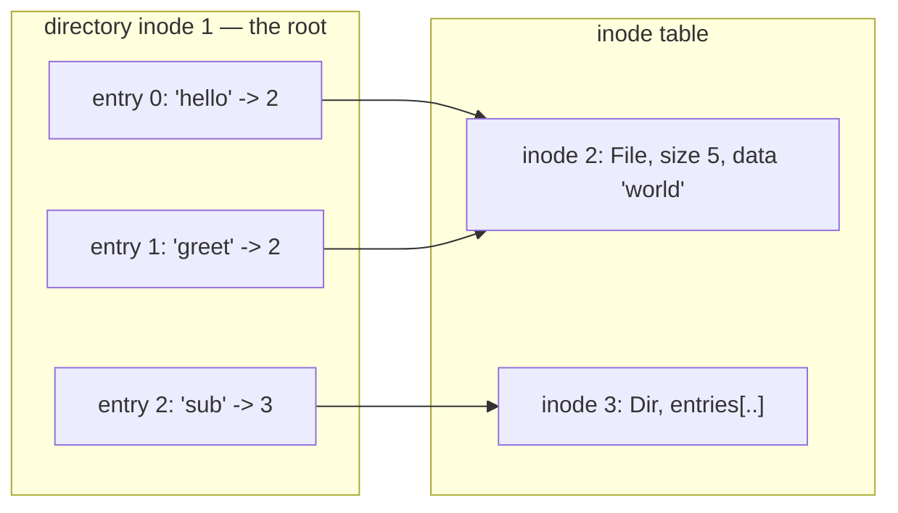
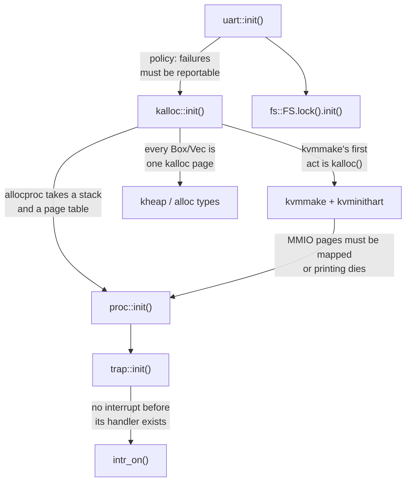

# Filesystems, Devices, and the Boot Sequence

## Overview

Three topics that would each be thin alone, and that together finish the kernel.
A **filesystem** turns storage into named byte arrays, and its one consequential
decision — that the object holding a file's contents does not hold its name — is
what makes hard links, cheap renames, and `unlink` fall out for free. A **device
driver** turns a handful of memory-mapped registers into an interface; the
NS16550A UART is the template for every driver you will write, with its status
register, its flag masks, its poll-then-transfer loop, and `volatile` one last
time. **Booting** is calling those subsystems' `init` functions in an order where
each one's dependencies are already satisfied — a topological sort you do by hand,
get wrong, and then debug by reading a boot log. Concept behind exercises
`40k_filesystem` (Thursday, November 5), `42k_boot_to_life` (Friday, November 6),
and the extra-credit `41k_devices`; after Friday, November 6, `cargo run` boots
rv6 for real. See the
[rv6 Architecture guide](../guides/rv6-architecture.md).

## Learning Objectives

- **Distinguish** a file, an inode, an inode number, a directory entry, and a
  name, and say which each filesystem call consumes or produces.
- **Derive** hard links, O(1) rename, and `unlink`-not-`delete` from the
  separation of inode and directory entry.
- **Trace** path resolution as repeated `dirlookup`, and predict which error a
  failing component produces.
- **Enumerate** what rv6's filesystem omits — superblock, bitmaps, buffer cache,
  write-ahead log — and the failure each one prevents.
- **Decode** an NS16550A line-status byte, and explain what a driver checks before
  writing `THR` and before reading `RBR`.
- **Explain** three miscompilations that follow from dropping `read_volatile` and
  `write_volatile` on device registers.
- **Justify** each edge in rv6's `kinit` dependency graph, and say which orderings
  are mechanical and which are policy.
- **Diagnose** a hung or silent boot from the last line the kernel printed.

## Prerequisites

- Exercise `32k_physical_memory` and L11 *Physical Memory and the Free List* —
  `kalloc`, the free list, and what a null return means.
- Exercise `33k_paging`, L16 *Virtual Memory II*, and the
  [Sv39 Paging guide](../guides/sv39-paging.md) — `satp`, `kvmmake`, identity
  mapping, `sfence.vma`.
- Exercise `31k_boot` and [Boot: From Reset to `kmain`](05-cs326-2026-09-24-boot-from-reset-to-kmain.md)
  — MMIO, `_entry`, and the blind-write console this session replaces.
- Exercise `37k_spinlocks` — the whole filesystem lives behind one lock.
- Exercise `08r_errors` — `Result`, `?`, and matching a specific variant.
- The [Unsafe Rust and `no_std` guide](../guides/rust-unsafe-nostd.md) — raw
  pointers, and why every register access is `unsafe`.

---

## 1. The File and Its Name

A file is a randomly addressable array of bytes with bookkeeping attached. The
interesting part is not the array; it is a decision Unix made around 1970: **the
object holding a file's contents does not hold its name.** Contents and metadata
live in an *inode*; names live in *directories*, tables mapping a name to an inode
number.

rv6 keeps the split exactly. An inode (`fs.rs:50`–`fs.rs:55`) has a kind, a size,
and its contents, and no name field anywhere:

```rust
pub struct Inode {
    kind: InodeKind,            // Free | File | Dir
    size: usize,
    data: [u8; FILESIZE],       // file bytes ...
    entries: [DirEnt; NDIRENT], // ... or directory entries
}
```

A directory entry (`fs.rs:31`–`fs.rs:36`) is the other half: a name, the `inum`
it points at, and a `used` flag. An **inode number** is an index, not a pointer —
an index survives being written to disk and reloaded elsewhere. Inode 1 is the
root (`fs.rs:83`); `alloc` scans upward from `ROOT` for the first `Free` slot
(`fs.rs:86`).



Two entries point at inode 2: nothing forbids it, and nothing had to be added to
allow it.

### Three consequences, all free

**One file, many names.** Two entries holding the same `inum` are two equally
real names for one file; neither is the original, and `stat` returns no name field
because the file does not have one. A **hard link** is not a feature that was
built — it is one that was never prevented.

**Rename is cheap.** It rewrites one directory entry, so `mv` costs the same for a
4 KiB file and a 40 GiB one. Across filesystems it must copy, because an inode
number means nothing outside the filesystem that assigned it.

**Deletion is `unlink`.** The call removes a *name*; whether the file dies is
answered by counting. A real inode carries `nlink` and is freed only at zero
*and* when no process still has it open.

> Key distinction: rv6's `unlink` (`fs.rs:190`–`fs.rs:203`) frees the inode
> immediately, with no link count. That is correct only because rv6 has no way to
> make a second link. Practice Problem 2 shows what breaks the moment you add one.

rv6's inode also stores the bytes inline (`fs.rs:53`); a real inode stores *block
numbers*.

---

## 2. Directories Are Files With Structure

A directory is an inode whose contents happen to be an array of `DirEnt`. In V7
Unix it was literally a file you could `read()`; `readdir` became a call only once
filesystems switched to B-trees. The idea survives: a directory is data,
interpreted by the filesystem.

rv6's limits are at `fs.rs:5`–`fs.rs:9`: 64 inodes, 16 entries per directory,
`NAMELEN` 14, `FILESIZE` 128. That 14 is historically exact — V7 directory entries
were 16 bytes, a 2-byte inode number and a 14-character name. 4.2BSD's Fast File
System introduced variable-length entries in 1983 and raised the cap to 255.

`dirlookup` (`fs.rs:109`–`fs.rs:119`) is a linear scan that checks the kind first:

```rust
pub fn dirlookup(&self, dir: usize, name: &[u8]) -> Result<usize, FsError> {
    if self.inodes[dir].kind != InodeKind::Dir {
        return Err(FsError::NotADirectory);
    }
    for e in &self.inodes[dir].entries {
        if e.used && e.len == name.len() && &e.name[..e.len] == name {
            return Ok(e.inum);
        }
    }
    Err(FsError::NotFound)
}
```

That kind check is the entire reason `cat /etc/passwd/foo` reports `ENOTDIR`
instead of garbage. "No such entry" and "you asked a non-directory for an entry"
are different facts, so they get different variants — and `dircreate` reuses both,
treating `NotFound` as permission to proceed (`fs.rs:126`).

The scan is O(entries). At 16 that is free; ext4 switches to hashed B-trees once a
directory outgrows a block, and XFS uses B+trees, because the workload nobody plans
for is a build cache with a million files in one directory.

> Resource ordering, quietly done right: `dircreate` takes the directory slot
> *before* it allocates the inode (`fs.rs:132`–`fs.rs:141`) — reverse those and a
> create into a full directory leaks an inode every time.

---

## 3. Path Resolution Is Repeated `dirlookup`

There is no such thing as "opening a path". There is only looking up one component
in one directory, repeatedly, each result becoming the next directory.

```text
resolve("/sub/inner/notes")

  start   dir = ROOT (1)                        leading '/' -> start at the root
  step 1  dirlookup(1, "sub")    -> Ok(3)       3 is a Dir: keep walking
  step 2  dirlookup(3, "inner")  -> Ok(7)       7 is a Dir: keep walking
  step 3  dirlookup(7, "notes")  -> Ok(9)       last component: answer is 9

  a relative path "inner/notes" is the identical loop with dir = cwd
```

**It is where errors come from.** Which step failed picks the error: a missing
component is `NotFound` (`ENOENT`); an intermediate component that is a file is
`NotADirectory` (`ENOTDIR`).

**It is where filesystems get glued together.** At each step a real kernel asks
whether this inode is a mount point and switches to the mounted filesystem's root
— the same hook that implements chroot, bind mounts, and container namespaces.

**It is hot, so it is cached.** Linux walks paths in `link_path_walk`, backed by
the **dentry cache**, a hash table keyed on (parent, name).

xv6 packages the loop as `namei` and `nameiparent` — the latter returns the
parent plus the final component, because `create` and `unlink` need the parent,
not the target. **rv6 has no `namei`.** The shell resolves one component at a time
against its current directory (`shell.rs:98`–`shell.rs:104`), keeping that
directory as a stack of `(name, inum)` pairs (`shell.rs:22`–`shell.rs:34`) — which
is why rv6 prints `pwd` without storing `..` anywhere.

Real Unix goes the other way: `.` and `..` are genuine entries written into every
directory at creation, so `..` works from any process without that process
remembering how it got there. It also creates the cycles that `rmdir`'s emptiness
rule and symlink limits (Linux gives up after 40) exist to contain.

---

## 4. What rv6's Filesystem Trades Away

The structures and the logic are real; the storage is not. rv6's filesystem is one
static behind one lock (`fs.rs:277`).

| Property | rv6 | xv6 | ext4 |
|---|---|---|---|
| Storage | RAM, a static array | virtio disk | block device |
| Survives reboot | no | yes | yes |
| File size | ≤ 128 bytes | direct + indirect blocks | extents, 16 TiB |
| Inode count | 64, compiled in | superblock field | superblock field |
| Free space | `kind == Free` scan | bitmap block | bitmap + block groups |
| Link count | none | `nlink` | `nlink` |
| Crash consistency | n/a | write-ahead log | journal |
| Locking | one global spinlock | per-inode, per-buffer | fine-grained |

### The layout rv6 does not build

On a disk, five structures appear, in this order:

```text
  block 0     block 1      log blocks     inode blocks    bitmap     data blocks
+-----------+-----------+--------------+---------------+----------+--------------+
| boot      | SUPER     | WRITE-AHEAD  | inodes, packed| one bit  | file and     |
| sector    | BLOCK     | LOG          | N per block   | per data | directory    |
| (ignored) | sizes and | (uncommitted |               | block    | contents     |
|           | offsets   |  writes)     |               |          |              |
+-----------+-----------+--------------+---------------+----------+--------------+
              ^                                       ^
    the one fixed location;              inum -> (block, offset)
    everything else is found             is integer division
    through it
```

**Superblock.** A self-describing header: how many inodes, how many blocks, where
each region starts. Without it the layout is baked into the kernel — and it is why
`mkfs` is a program.

**Inode blocks.** Fixed-size records packed into blocks, so `inum` → (block,
offset) is integer division. rv6's `self.inodes[inum]` *is* that arithmetic.

**Free bitmaps.** One bit per data block, one per inode — because rv6's scan of
every inode for `Free` (`fs.rs:87`) would cost a disk read per candidate.

**Buffer cache.** In-RAM copies of disk blocks, with the invariant that *at most
one buffer exists per block*. That uniqueness is what makes locking a block
meaningful: two processes touching the same block get the same lock.

**Write-ahead log.** The genuinely hard one. Creating a file modifies at least
three blocks — the new inode, the parent directory's data, the free bitmap — and a
power failure between them leaves an inode nothing points to, or a directory entry
naming a block that is also free. `fsck` was the original answer: scan the whole
disk at boot and guess. Logging replaced it: write the group of changes to a log
region, write a commit record, then install them in place. A crash before the
commit discards the log; after it, replay is safe because installing a block twice
is harmless.

> Key distinction: the log makes an operation **atomic**, not **durable**.
> Durability is `fsync`.

None of that is denied, only deferred: `50k_file_descriptors` builds `open` and file descriptors
on the same `Inode`, using offset primitives that already exist (`fs.rs:231`,
`fs.rs:249`), where `read_at` returning `Ok(0)` (`fs.rs:238`) is how `cat` learns
to stop.

---

## 5. Devices: The Register File Is the Interface

In exercise `31k_boot` you "printed" by storing a byte to `0x1000_0000` and
hoping. That works in QEMU and is not a driver. A driver talks to a device through
its **registers**, checking its **status** before every transfer.

Registers are memory-mapped: certain physical addresses are wired to a chip
instead of to RAM. On the `virt` machine the UART sits at `0x1000_0000`
(`memlayout.rs:17`), the PLIC at `0x0c00_0000` (`memlayout.rs:26`), the power-off
device at `0x10_0000` (`memlayout.rs:21`) — all below `KERNBASE = 0x8000_0000`
(`memlayout.rs:10`), where RAM begins.

The chip is an **NS16550A** (`uart.rs:6`–`uart.rs:12`):

```text
address        off  read                       write
0x1000_0000     0   RBR  received byte         THR  byte to transmit
0x1000_0001     1   IER  interrupt enable      IER
0x1000_0002     2   IIR  interrupt ident.      FCR  FIFO control
0x1000_0003     3   LCR  line control          LCR  8N1, DLAB
0x1000_0004     4   MCR  modem control         MCR  loopback bit
0x1000_0005     5   LSR  LINE STATUS           (read-only)

LSR bit layout (uart.rs:14, uart.rs:15)
   7      6      5      4      3      2      1      0
+------+------+------+------+------+------+------+------+
| ERR  | TEMT | THRE |  BI  |  FE  |  PE  |  OE  |  DR  |
+------+------+------+------+------+------+------+------+
                 ^                                   ^
        room for another byte              a byte is waiting
        LSR_THRE = 1 << 5                  LSR_DR = 1 << 0
```

Two things there are not software-shaped. **Offset 0 means different registers
for read and write** — reading takes a byte out of the receive FIFO, writing puts
one into the transmit holding register. And offsets 0 and 1 become the baud divisor
when bit 7 of `LCR` (the divisor latch access bit) is set. A register's identity
can depend on a bit in another register, which is one reason accesses must happen
in exactly the order written.

### A driver is a state machine over a status register

Every polled driver asks the same three questions — *is it ready*, *transfer*,
*acknowledge* — and rv6's is four functions (`uart.rs:40`–`uart.rs:59`):

```rust
pub fn tx_ready() -> bool { unsafe { reg_read(LSR) & LSR_THRE != 0 } }
pub fn rx_ready() -> bool { unsafe { reg_read(LSR) & LSR_DR   != 0 } }

pub fn putc(c: u8) {
    while !tx_ready() {}          // spin until there is room
    unsafe { reg_write(THR, c) }  // then, and only then, hand over the byte
}

pub fn getc() -> Option<u8> {
    if rx_ready() { Some(unsafe { reg_read(RBR) }) } else { None }
}
```

The asymmetry is a design decision. `putc` spins; `getc` does not. Waiting for
the transmitter is waiting for a bounded event — at 115200 baud, ten bits per
frame, one byte takes about 87 µs and it *will* finish. Waiting for the receiver
is waiting for a human, so "nothing yet" is an ordinary answer and gets an
`Option`.

That 87 µs is also why blind writes are wrong: a 1 GHz CPU issues roughly 87,000
instructions while one character goes out the wire. QEMU's emulated UART swallows
bytes instantly, so blind writes look fine; on hardware a banner overruns the
transmit register and most of it vanishes.

`init` (`uart.rs:26`–`uart.rs:32`) is three writes: `IER = 0` (we poll),
`LCR = 0x03` (8 data bits, no parity, one stop bit), `FCR = 0x07` (enable and clear
the FIFOs). xv6 adds one rv6 skips — the baud divisor, written by setting `LCR` to
`0x80`, sending two bytes through the aliased offsets 0 and 1, then restoring
`0x03`. `MCR` also carries a **loopback** bit (`uart.rs:16`, `uart.rs:69`) wiring
the transmitter into the receiver, so a board can test its own serial port.

> The lineage is worth knowing, because you will meet it again: 8250 (IBM PC,
> 1978) → 16450 (the PC/AT) → 16550 (a FIFO that did not work) → **16550A** (1987,
> a working 16-byte FIFO). QEMU emulates the 16550A, and so does much of the
> embedded silicon shipping today.

### Polling versus interrupts

Polling burns CPU proportional to the wait; an interrupt costs a fixed few hundred
cycles. Hence the rule: **poll when the expected wait is shorter than the interrupt
overhead, interrupt when it is longer.** A UART transmitter (µs) is fine to poll; a
disk (ms) is not. rv6 moves *input* to interrupts in L19 —
`uart::enable_rx_interrupt` (`uart.rs:36`), PLIC source 10 (`plic.rs:14`),
`console::intr` (`console.rs:68`) — but output stays polled forever, because the
console must work when everything else is broken.

---

## 6. `volatile`, One Last Time

To a compiler an ordinary read is a pure function of memory: cacheable, movable,
duplicable, deletable, as long as no other code in the same thread could tell.
Device registers violate all of that — they change without anyone writing them, and
reading one has side effects. Hence `read_volatile`/`write_volatile` on every
access (`uart.rs:18`–`uart.rs:24`).

Drop it and you get three specific miscompilations, all of which have shipped:

1. **The hoisted poll.** `while !tx_ready() {}` with a plain load: the compiler
   proves nothing in the loop body writes `0x1000_0005`, hoists the load out, and
   the loop becomes "read once, then fall through or spin forever".
2. **The dead store.** `reg_write(THR, b'h'); reg_write(THR, b'i');` are two
   stores to one address with no intervening read. Dead-store elimination keeps
   the last and your kernel prints `i`.
3. **The reorder.** `LCR` must be written before the divisor bytes, but they are
   stores to *different* addresses with no data dependency, so nothing stops the
   compiler from swapping them.

What `volatile` gives you is narrow: the access **happens**, **exactly once**, and
**in program order with respect to other volatile accesses**. It is not atomic,
not a barrier against ordinary accesses, and says nothing about caches — real
hardware also wants a non-cacheable mapping and sometimes a fence. rv6 gets away
with it because QEMU does not cache MMIO (`vm.rs:132`).

Rust has no `volatile` type qualifier, deliberately. C's propagates through every
expression touching the type; Rust makes volatility a property of the *access*,
reachable only through an `unsafe` raw-pointer call — exactly the visibility you
want at the hardware boundary.

---

## 7. Boot Is a Dependency Graph

`kinit` is six lines (`main.rs:87`–`main.rs:94`), with an argument behind each
one. The exercise-12 version is the first four.

```rust
unsafe fn kinit() {
    uart::init();                    // console first
    kalloc::init();                  // physical pages
    vm::kvminithart(vm::kvmmake());  // build the kernel page table, arm the MMU
    proc::init();                    // the process table
    trap::init();                    // the trap vector (exercise 43k)
    fs::FS.lock().init();            // create the root directory (exercise 46k)
}
```



**UART first is policy, not mechanism.** Nothing in `kalloc` calls the UART; the
console goes first because every later failure has to be able to say so.

**`kalloc` before `kvmmake` is mechanical.** `kvmmake`'s first act is
`kalloc::kalloc()` for the root page table (`vm.rs:126`), and `mappages` allocates
another page per missing level. With the free list still null (`kalloc.rs:11`),
`kalloc` returns null (`kalloc.rs:40`), `kvmmake` returns null, and `kvminithart`
installs a `satp` pointing at physical page 0. The heap rides the same edge: the
global allocator forwards every request straight to `kalloc` (`kheap.rs:29`).

**Turning the MMU on is the load-bearing step.** The instant `csrw satp` retires
(`vm.rs:178`), every address goes through that page table — including the address
of the *next instruction*. rv6 survives because `kvmmake` identity-maps
`KERNBASE..PHYSTOP` R/W/X (`vm.rs:141`–`vm.rs:149`), so the program counter means
the same thing on both sides of the write. It also maps the UART, test finisher,
and PLIC (`vm.rs:132`–`vm.rs:139`) — miss those and the kernel is alive, mute, and
unable to power off. The following `sfence.vma` (`vm.rs:180`) flushes stale TLB
entries.

**`fs::FS.lock().init()` has almost no predecessor** — the inode table is a static
array. The skill is not memorizing the order; it is telling a load-bearing edge
from a conventional one.

### The confusing part: at exercise 42k the MMU is armed but inert

Up through exercise 42k, `_entry` calls `kmain` directly (`entry.rs:18`), so the
kernel runs in **machine mode**, where `satp` does not translate anything: the
write lands, the mode field reads back as 8, and nothing is being translated.

From exercise 43k on, `_entry` goes through `start`, which sets `mstatus.MPP` to
supervisor (`start.rs:29`), points `mepc` at `kmain` (`start.rs:34`), and `mret`s
(`start.rs:54`). Only then does the page table take effect — so **a broken page
table can pass exercise 42k and hang exercise 43k**, with no code change in between.

### The same problem at Linux scale

Linux's `kinit` is `start_kernel()` in `init/main.c` — around ninety calls in a
hand-fixed order, ending in `rest_init()`, which spawns PID 1 and PID 2 and turns
the boot CPU into the idle task. Two differences are worth stealing.

**Linux prints before it has a console.** `printk` writes into a ring buffer,
replayed when a console registers during `console_init()`. The constraint rv6
solves by putting `uart::init()` first, Linux solves by decoupling *producing* a
message from *displaying* one. The cost is that a crash before `console_init()`
shows nothing — hence `earlycon`, a blind-write UART driver almost exactly like
rv6's exercise-01 console.

**Linux does not call driver inits from `start_kernel` at all.** A driver
declares its slot with `module_init` / `subsys_initcall` / `late_initcall`, which
place a function pointer into a per-level linker section; `do_initcalls()` runs the
levels in order — early, core, postcore, arch, subsys, fs, device, late. That turns
a hand-maintained call list into a declared partial order, the only thing that
scales to thousands of drivers. It is still not enough: a driver whose dependency
has not probed yet returns `-EPROBE_DEFER` and is retried later.

---

## 8. Reading a Boot Log

A boot log is a sequence of claims: each line proves that everything before it
completed. Debugging a boot is binary search over the last line printed.

```text
$ cargo run                                  what this line proves
                  __
 _ __            / /_                        uart::init() ran, MMIO reaches
| '__|  \ \ / /  | '_ \                      0x1000_0000, and putc's THRE
| |      \ V /   | (_) |                     poll is draining properly
|_|       \_/     \___/

  A tiny interesting RISC-V OS

rv6: kernel booted.                          kinit() RETURNED: every init call
                                             finished, and the satp write did
                                             not fault

rv6: nothing to do yet — idling.             the #[cfg(not(harness))] arm was
                                             compiled in: a wfi loop, not a
                                             crash
```

The banner is a good test by itself: ~150 bytes through `putc` exercise the `THRE`
poll about 150 times, so a wrong mask usually yields one character and a freeze
rather than silence.

| Symptom | What it proves | Suspect first |
|---|---|---|
| Nothing, QEMU still running | `kmain` never reached, or `uart::init()` never ran | linker script, `_entry`, stack, wrong target |
| One or two characters, then freeze | `putc` is spinning on `tx_ready()` forever | wrong `LSR` offset or mask; UART page unmapped after `satp` |
| Full banner, then silence | `kinit` returned; the problem is after it | idle loop is normal — check what should print next |
| Banner, then instant QEMU exit | somebody wrote the test finisher | harness path compiled in (`--features harness`) |
| Nothing, and QEMU exits or resets | a fault with no handler installed | `kvmmake` returned null; `satp` root is garbage |

Before the trap handler exists there is no panic message and no backtrace, so the
technique is blunt and effective: print a one-character checkpoint before and after
the suspicious call and see which side you reach. After that, GDB is available —
see the [QEMU and GDB guide](../guides/qemu-gdb.md); `info registers satp` and
QEMU's `-d int,mmu` answer most of the table above directly.

Linux's log works the same way, with better tools: `dmesg` timestamps are seconds
since boot, so a gap between two lines is time spent inside one initialization, and
`initcall_debug` prints every initcall and its duration.

---

## Key Concepts

| Concept | Definition | Example |
|---|---|---|
| Inode | A file's metadata and contents, never its name | `fs.rs:50`: `kind`, `size`, `data`, `entries` |
| Inode number (`inum`) | An index identifying an inode within one filesystem | `ROOT = 1` (`fs.rs:9`); `alloc` returns the first `Free` index |
| Directory entry | A (name, `inum`) pair stored in a directory's contents | `fs.rs:31`: `name`, `len`, `inum`, `used` |
| Hard link | Two directory entries holding the same `inum` | Neither name is the "real" one; `stat` has no name field |
| Link count | Entries pointing at an inode; free the inode at zero | rv6 has none — why its `unlink` is unsafe under links |
| Path resolution | Repeated `dirlookup`, each result the next directory | `/sub/inner` = `dirlookup(1,"sub")`, then `dirlookup(3,"inner")` |
| Write-ahead log | Log a group of block writes, commit, then install | Makes create atomic across a power failure; replaced `fsck` |
| MMIO register | A physical address wired to a device, not to RAM | `UART0 = 0x1000_0000` (`memlayout.rs:17`) |
| Status flag | One bit of a status register reporting device state | `LSR_THRE = 1 << 5`, `LSR_DR = 1 << 0` (`uart.rs:14`) |
| `volatile` access | Happens, once, in program order with other such accesses | `read_volatile`/`write_volatile` (`uart.rs:18`) |
| Initialization order | A topological sort of subsystem dependencies | `kalloc::init()` before `kvmmake()` (`main.rs:88`) |

---

## Practice Problems

### Problem 1: Trace the inode table

Starting from a freshly `init`ed filesystem (root is inode 1), run this at the
root:

```rust
fs.dircreate(ROOT, b"a", InodeKind::File)?;   // -> inum ?
fs.dircreate(ROOT, b"b", InodeKind::Dir)?;    // -> inum ?
fs.dircreate(ROOT, b"c", InodeKind::File)?;   // -> inum ?
fs.unlink(ROOT, b"b")?;
fs.dircreate(ROOT, b"d", InodeKind::File)?;   // -> inum ?
```

Give the four inode numbers and the slot each name lands in. Then say what
`for_each_entry(ROOT, ..)` visits, in order, and what that implies about `ls`.

<details>
<summary>Click to reveal solution</summary>

`alloc` scans `ROOT..NINODE` for the first `Free` (`fs.rs:87`) and inode 1 is the
root, so `a` → **2** (slot 0), `b` → **3** (slot 1), `c` → **4** (slot 2).
`unlink` returns inode 3 to `Free` and clears slot 1 (`fs.rs:197`–`fs.rs:198`).
`d` then takes the first unused slot, **1**, and the first free inode, **3** —
both recycled lowest-index-first.

`for_each_entry` walks slots in order (`fs.rs:179`), so it visits `a`, `d`, `c`.
Directory order is slot order, an artifact of allocation history rather than
creation time — which is why `ls` sorts its output and `ls -f` does not.
</details>

### Problem 2: The link count you do not have

rv6 has no `link`, but suppose you add one that copies an existing directory entry
under a new name in the same directory:

```text
dircreate(ROOT, "notes", File)  -> inum 5, write 40 bytes into it
link(ROOT, "notes", "notes2")   -> slot 1 now holds ("notes2", 5)
unlink(ROOT, "notes")
```

What does `unlink` do, what does reading through `notes2` return, and what happens
on the *next* `dircreate`? Name the field a real inode has that prevents this.

<details>
<summary>Click to reveal solution</summary>

`unlink` sets `inodes[5] = Inode::new()` — kind `Free` — and clears the slot
(`fs.rs:196`–`fs.rs:199`), never checking whether another entry points at inode 5.

`dirlookup(ROOT, "notes2")` still returns 5, but `read(5, ..)` sees `Free` and
returns `Err(NotFound)` (`fs.rs:100`). The real damage is the next `dircreate`:
`alloc` returns the lowest `Free` inode, now 5, so `notes2` silently names an
unrelated new file — no error, wrong data.

The fix is `nlink`: incremented per directory entry, decremented per `unlink`, the
inode freed only at zero — plus a second condition in real kernels, that no process
has it open, which is why `rm` on a file a running process holds open frees no
space until that process exits.
</details>

### Problem 3: Resolve four paths by hand

Root is inode 1 with entries `sub` → 3 (Dir) and `log` → 4 (File); directory 3 has
`inner` → 7 (Dir); directory 7 has `notes` → 9 (File). Give the `dirlookup` calls
and the result for each:

(a) `/sub/inner/notes` &nbsp; (b) `/sub/notes` &nbsp; (c) `/log/notes`
&nbsp; (d) `cat /sub/inner`

<details>
<summary>Click to reveal solution</summary>

(a) `dirlookup(1,"sub")` → `Ok(3)`; `dirlookup(3,"inner")` → `Ok(7)`;
`dirlookup(7,"notes")` → `Ok(9)`.

(b) `dirlookup(1,"sub")` → `Ok(3)`; `dirlookup(3,"notes")` → `Err(NotFound)`.
Directory 3 exists; it just has no such entry. POSIX `ENOENT`.

(c) `dirlookup(1,"log")` → `Ok(4)`; `dirlookup(4,"notes")` → the kind check at
`fs.rs:110` fires because inode 4 is a `File` → `Err(NotADirectory)`, POSIX
`ENOTDIR`. The walk failed at a component that *exists*, which is why the two
errors are separate variants.

(d) Resolution succeeds and yields 7; the failure is one layer up. `read(7, ..)`
matches `InodeKind::Dir` → `Err(IsADirectory)` (`fs.rs:101`), POSIX `EISDIR`.
Resolution failing and the operation on the resolved inode failing are different
stages, and a good message says which.
</details>

### Problem 4: Decode a line status byte

You break in GDB during boot and `x/1xb 0x10000005` reports `0x61`.

(a) Which register is that, and how do you know from the source?
(b) Which flags are set?
(c) What do `tx_ready()` and `rx_ready()` return?
(d) What does `getc()` return, and what does a second `getc()` return right after?

<details>
<summary>Click to reveal solution</summary>

(a) `UART0` is `0x1000_0000` (`memlayout.rs:17`) and `LSR` is offset 5
(`uart.rs:12`).

(b) `0x61 = 0b0110_0001`: bit 0 `DR`, bit 5 `THRE`, bit 6 `TEMT`. No error bits.

(c) `tx_ready()` is `LSR & (1 << 5)` (`uart.rs:41`) → **true**; `rx_ready()` is
`LSR & (1 << 0)` (`uart.rs:45`) → **true**. A byte is waiting *and* there is room
to send one — independent halves of the chip.

(d) `getc()` returns `Some(reg_read(RBR))` (`uart.rs:53`). That read **removes**
the byte from the receive FIFO, and if the FIFO is now empty the hardware clears
`DR`, so the second `getc()` returns `None`. *Reading a device register can change
the machine* — which also means `x/1xb 0x10000000` in GDB is not a harmless
inspection: it consumes the byte you were trying to observe.
</details>

### Problem 5: Two bugs, and what QEMU prints

```rust
fn tx_ready() -> bool {
    unsafe { *((UART0 + 5) as *const u8) & (1 << 5) != 0 }
}

pub fn putc(c: u8) {
    unsafe { *((UART0 + 0) as *mut u8) = c; }
    while !tx_ready() {}
}
```

Name both bugs, and predict what `puts("hi\n")` does in a debug build and in a
release build.

<details>
<summary>Click to reveal solution</summary>

**Bug 1: the poll is on the wrong side of the write.** The check must happen
*before* handing a byte to `THR` (`uart.rs:48`–`uart.rs:51`); waiting afterwards
protects nothing, since the previous byte may still have been in flight when this
one landed on top of it. Invisible in QEMU; on hardware, characters vanish
whenever output outruns the wire.

**Bug 2: neither access is volatile.** The compiler sees that the loop body writes
nothing to the `LSR` address, hoists the load out, and turns the loop into
`if !ready { loop {} }` — decided once, by a value read once. The `THR` writes are
plain stores to one address, so a run of them are dead stores and LLVM keeps only
the last.

A **debug** build does neither optimization and prints `hi`; a **release** build
prints nothing, or one character, or hangs. That divergence is the diagnostic:
"works in debug, hangs in release" on hardware code means a missing `volatile`.
</details>

### Problem 6: A boot order that passes, and then does not

```rust
unsafe fn kinit() {
    vm::kvminithart(vm::kvmmake());
    kalloc::init();
    uart::init();
    proc::init();
}
```

(a) Which call fails first, and what value ends up in `satp`?
(b) What does `oslings run 42k_boot_to_life` print?
(c) What happens on exercise 43k, and why is it different?
(d) What does this say about the boot self-check?

<details>
<summary>Click to reveal solution</summary>

(a) `kvmmake` runs first, and its first act is `kalloc::kalloc()` for the root
page table (`vm.rs:126`–`vm.rs:131`). `FREELIST` is still null (`kalloc.rs:11`), so
`kalloc` returns null (`kalloc.rs:40`) and `kvmmake` returns null immediately.
`kvminithart` computes `make_satp(null) = SATP_SV39 | 0` = `0x8000_0000_0000_0000`
(`vm.rs:106`–`vm.rs:108`) — mode Sv39, root page number 0 — and writes it.

(b) It **passes**. Through exercise 42k the kernel runs in machine mode, where
`satp` translates nothing, so nothing faults: the remaining three calls run, the
banner prints, and the self-check finds a working allocator, a `satp` whose mode
field is 8, and a process table that hands out a `Proc`.

(c) From exercise 43k, `start` `mret`s into supervisor mode with that `satp` loaded
(`start.rs:29`–`start.rs:54`). Translation is now live against a page table at
physical address 0. The first fetch faults, no handler exists yet, and the machine
hangs or resets before printing anything — the same bug, invisible for one
exercise and fatal in the next.

(d) The MMU check reads a register and concludes the MMU is up; that proves the
register's *value*, not that translation works. Every test has a boundary between
what it observes and what it claims, and finding it is a skill you want before you
trust a green result. The fix is `main.rs:87`–`main.rs:91`: console, allocator,
MMU, processes.
</details>

---

## Further Reading

- [rv6 Architecture](../guides/rv6-architecture.md) — where `fs.rs`, `uart.rs`,
  and `main.rs` sit relative to everything else.
- [Memory Map](../guides/memory-map.md) — the `virt` machine's MMIO addresses,
  including the UART and PLIC regions `kvmmake` maps.
- [Sv39 Paging](../guides/sv39-paging.md) — `satp`, `make_satp`, and why the
  identity map is what lets `kvminithart` return.
- [QEMU and GDB](../guides/qemu-gdb.md) — breaking in `kinit`, `info registers
  satp`, and `-d int,mmu`.
- [Boot: From Reset to `kmain`](05-cs326-2026-09-24-boot-from-reset-to-kmain.md)
  — `_entry`, the stack, and the blind-write console this session upgrades.
- [File Commands over a Filesystem API](14-cs326-2026-11-24-file-commands-over-a-filesystem-api.md)
  — the November 24 lecture behind the extra-credit `47k_file_commands`, which
  builds `touch`, `cat`, and `rm` on today's API.
- [Key Concepts](../guides/key-concepts.md) and
  [Exam Prep](../guides/exam-prep.md) — the section 4 terminology is examinable.
- Ritchie and Thompson, *The UNIX Time-Sharing System* (CACM, 1974), section 3 —
  the inode/directory split in four pages, by the people who made it.
- Cox, Kaashoek, and Morris, *xv6: a simple, Unix-like teaching operating system*,
  chapter 8 — the on-disk layout, buffer cache, and logging layer rv6 defers.
- *PC16550D UART with FIFOs* datasheet — the register map of section 5.
- Linux `init/main.c` and `include/linux/init.h` — `start_kernel()` and the
  initcall level macros.

---

## Summary

1. **A file is not its name.** The inode holds contents and metadata; the
   directory holds names and inode numbers. Hard links, O(1) rename, and `unlink`
   rather than `delete` all follow from that one split.
2. **An inode number is an index, not a pointer.** That is what lets it be written
   to disk, and what makes `inum` → block arithmetic on a real filesystem.
3. **A directory is a file with structure** — for rv6, 16 entries of a 14-byte
   name and an `inum` (`fs.rs:31`). `dirlookup` scans it linearly and checks the
   kind first, which is why `ENOTDIR` exists.
4. **Path resolution is repeated `dirlookup`**, and it is where errors, mount
   points, symlink loops, and the dentry cache all live. rv6 has no `namei`.
5. **rv6 trades away persistence and everything that guards it** — a superblock,
   inode blocks, free bitmaps, a buffer cache with one buffer per block, and a
   write-ahead log making multi-block operations atomic against power failure.
6. **A driver is a state machine over a status register.** Is it ready, transfer,
   acknowledge. `putc` spins on `LSR_THRE` while `getc` returns `Option` on
   `LSR_DR`, because one wait is bounded and the other is a human.
7. **`volatile` guarantees the access happens, once, in order** — and nothing
   else. Without it you get a hoisted poll loop, an eliminated dead store, or
   reordered configuration writes.
8. **Boot is a topological sort you write by hand.** Console first so failures can
   report themselves, allocator before anything that allocates, page table before
   the MMU is armed, handler before the interrupt — then read the log backwards,
   because the last line printed is the last dependency that was satisfied.
