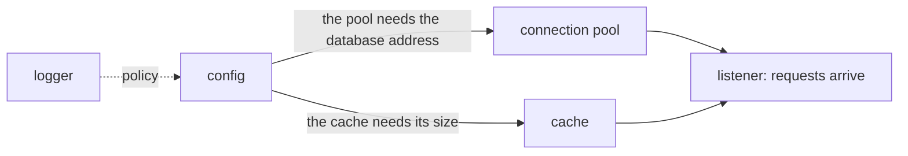
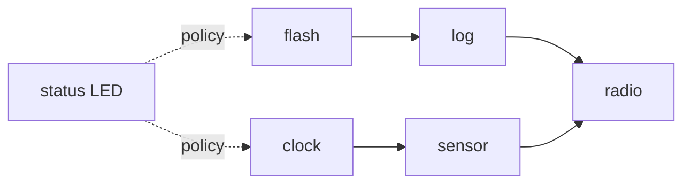

# Week 11 · Files, Boot Order, and Traps

> **Thu Nov 5** `40k_filesystem`, extra credit `41k_devices` · **Fri Nov 6** `42k_boot_to_life`, `43k_traps`, `44k_interrupts`
>
> Read **Essentials** before Tuesday: it is what Thursday and Friday assume.
> **Going deeper** is optional and is not on the exam.

[Slides](11-cs326-2026-11-03-filesystems-boot-order-and-traps-slides.html){ .md-button }
[Thursday prep](../prep/11-cs326-2026-11-05-prep-filesystem.md){ .md-button }
[Friday prep](../prep/11-cs326-2026-11-06-prep-boot-to-life-traps-and-interrupts.md){ .md-button }

## This week { #this-week }

In `45k` a keystroke interrupts your kernel, in `46k` a shell runs `mkdir` and
`ls`, and in `48k` a user program's `ecall` traps into the kernel. All three
rest on this week: a filesystem, a kernel that really boots, and a path for
traps.

On Thursday you finish the last subsystem, inodes and directories, where every
call returns a `Result`. On Friday you assemble the parts into a kernel that
boots and stays up, then teach it to survive a breakpoint and take timer
interrupts. Friday gets most of this lecture. Midterm 2, Thursday Nov 19,
covers all four core exercises.

By Friday night `cargo run` boots rv6 for real, and a timer interrupts it ten
times a second.

---

## Essentials { #essentials }

### Thursday · `40k` Files and directories { #thu-40k }

In `46k` the shell's `mkdir`, `ls` and `cd` run on one small API.
`40k_filesystem` builds its core.

#### A file is not its name { #40k-inodes }

A **filesystem** turns storage into named files. rv6 keeps its filesystem in
RAM, with the classic Unix structures. An **inode** records one file or
directory: kind, size and contents, but no name.

Names live in directories. A **directory** is an inode whose contents are
**entries**, (name, inode number) pairs. An **inode number** indexes a fixed
table; inode 1 is the root, `/`:

```text
inode 1  Dir    "home" -> 2    "motd" -> 3
inode 2  Dir    "ada"  -> 4
inode 3  File   size 12
inode 4  Dir    "plan" -> 6
inode 6  File   size 40        inode 5 and 7..63: Free
```

Read `"home" -> 2` as "inode 1 holds the name `home`, pointing at inode 2".
Inode 2 never learns its name, so a rename rewrites one entry in inode 1. A new
file takes the lowest free number, here 5, wherever it lands. rv6 has 64
inode slots (0 is never used), 16 entries per directory, 14-byte names and
128-byte files.

#### Path resolution by hand { #40k-paths }

No step opens a whole path. Resolving `/home/ada/plan` is one directory lookup
per name (xv6 calls the step `dirlookup`), starting at the root, each answer
the next directory to search:

```text
/home/ada/plan   1 -home-> 2 -ada-> 4 -plan-> 6   found: inode 6
/home/bob/plan   1 -home-> 2 -bob-> ?             NotFound
/motd/plan       1 -motd-> 3, a File -plan-> ?    NotADirectory
cat /home/ada    resolves to 4, then reads a Dir  IsADirectory
```

Whichever step fails decides the error. `NotFound` means a real directory
lacks the name. `NotADirectory` means a step asked a file for an entry, a
different fact. The last row resolves, then fails in the operation on what it
found.

#### Errors as values, behind one lock { #40k-errors }

A missing name is an answer, not a bug, and `no_std` has no exceptions. Every
operation returns a `Result` whose error is an `enum`, one variant per
failure. The same design, for a clock time such as `7:30`:

```rust
enum TimeError { NoColon, NotANumber }

fn minutes(s: &str) -> Result<u32, TimeError> {
    let (h, m) = s.split_once(':').ok_or(TimeError::NoColon)?;
    let h: u32 = h.parse().map_err(|_| TimeError::NotANumber)?;
    let m: u32 = m.parse().map_err(|_| TimeError::NotANumber)?;
    Ok(h * 60 + m)                                // "7:30" -> Ok(450)
}
```

Read `.ok_or(TimeError::NoColon)?` as "turn `None` into this error, and if
there is one, return it from `minutes` now". Callers must open the `Result`.
One error can be good news: when signing up a member, "no such member" means
the name is free. Match that variant, and pass the rest up.

One `SpinLock` from `37k` guards the whole filesystem. Its guard derefs to
`&mut`, so no operation needs `unsafe`.

> **The one thing to get right:** `[fail] lookup of /hello returned the wrong
> inode`. A stored name is a 14-byte field with a length beside it, so `plan`
> is four letters and ten zero bytes that are not part of the name. The length
> marks where a name ends; a lookup that reads past it matches nothing shorter
> than 14 bytes.

> **Extra credit · `41k`** `41k_devices` stops `31k`'s console from writing
> blind. A **status register** reports the chip's state in one-bit **flags**,
> and a polled driver reads them before every transfer. See
> [the UART up close](#deeper-uart).

### Friday · `42k` Boot to life { #fri-42k }

From `45k` on you type into rv6 and it answers, which needs a kernel that boots
and stays up. `42k_boot_to_life` assembles your parts into one boot.

#### Boot is a dependency graph { #42k-graph }

Booting brings each subsystem up after everything it uses. As a graph, an
arrow from A to B means "B needs A first", and any order that respects every
arrow works. A web service starting:



Read the dotted arrow as policy, the solid ones as calls. Config never calls
the logger, which goes first so later failures can be reported. The
listener goes last: once it opens, work arrives that needs everything.

rv6's graph has both kinds, and the
[architecture guide](../guides/rv6-architecture.md#the-boot-sequence) draws it.
The edge with teeth runs from the page allocator to the kernel page table.
Every table page is allocated, so an empty allocator yields a null root. From
`43k`, switching the MMU on with that root faults in silence; `42k` still runs
in machine mode, which ignores `satp`.

#### Two builds of one kernel { #42k-builds }

From `42k` on, one tree builds two kernels. `oslings` builds with
`--features harness`: boot, self-check, `OSLINGS:PASS` or a `[fail]` line,
power off. Plain `cargo run`, from `rv6/`, prints the banner and idles; quit
QEMU with Ctrl-A, then X. The switch is a **Cargo feature**, declared under
`[features]` in `Cargo.toml`:

```rust
#[cfg(feature = "selftest")]
{ run_checks(); power_off(); }        // cargo run --features selftest
#[cfg(not(feature = "selftest"))]
loop { wait_for_event(); }            // plain cargo run
```

Read `#[cfg(...)]` as "compile what follows only when this holds". The other
block is never type-checked, so its errors hide until you build the other way.

> **The one thing to get right:** a wrong boot order can pass `42k`. Machine
> mode never translates, so a table built from an empty allocator does no
> harm, and the self-check, seeing Sv39 in `satp`, says `[ok]`. The same order
> in supervisor mode, as from `43k`, prints nothing at all.

### Friday · `43k` Traps { #fri-43k }

In `48k` every system call arrives as a trap, and in `45k` every keystroke.
`43k_traps` builds their path and survives a first trap, a breakpoint.

#### Three modes, three words { #43k-modes }

A RISC-V hart runs in one of three **privilege modes**:

| Mode | Who runs there | May use |
|---|---|---|
| M, machine | reset code, the timer's helper | everything, including the `m*` registers |
| S, supervisor | the rv6 kernel | the `s*` registers, `satp`, `sret`; never `m*` |
| U, user | programs, from `48k` | ordinary instructions only |

Going down is a return, `mret` or `sret`, into prepared state. Going up is
always a **trap**: the hardware stops the instruction stream and jumps to a
handler the upper mode chose earlier. From `43k` on, given machine-mode code
`mret`s into S before any of your Rust runs.

A trap has two kinds of cause. An **exception** is synchronous: the current
instruction caused it, as `ebreak`, `ecall` or a page fault do. An
**interrupt** is asynchronous: something outside the instruction stream, such
as the timer, wants attention. Both reach one handler.

#### The supervisor trap path { #43k-path }

On a trap into S-mode, the hardware sets a few registers and jumps:

```text
scause   why: bit 63 = interrupt, the low bits = the cause code
sepc     where: the address of the interrupted instruction
stval    a detail for some causes, such as a fault's bad address
sstatus  SPIE = SIE, SIE = 0, SPP = the mode it came from
pc       stvec
```

Read `SIE = 0` as "interrupts off": no handler starts with a second trap on
its heels. No general register is saved: all 31 still hold the
interrupted code's values.

So `stvec` names a given assembly **trap vector**. It wraps one Rust call in a
save and restore of the caller-saved registers, then runs `sret`, which sets
`pc` from `sepc`, the mode from `SPP` and `SIE` from `SPIE`. The handler needs
a fixed name and the C convention
([week 6](06-cs326-2026-09-29-below-rust-assembly-unsafe-and-no-std.md#20a-bridge)):

```rust
#[no_mangle]
pub extern "C" fn on_alarm() { /* ... */ }   // assembly: call on_alarm
```

Read `#[no_mangle]` as "keep this exact symbol"; without it, `call` fails to
link.

#### Re-run or step past { #43k-sepc }

`sret` resumes at `sepc`, the instruction that trapped. For an exception, the
handler decides what it deserves. A page fault the kernel repaired should run
again, so `sepc` stays. An `ebreak` or `ecall` has done its job, so the handler
resumes at the next instruction, 4 bytes on for the standard encodings:

```text
0x8000_4A10   ebreak    the trap: sepc = 0x8000_4A10
0x8000_4A14   ...       where a handled breakpoint resumes
```

An interrupt is different: nothing failed, and `sepc` names an instruction not
yet run, so return to it.

> **The one thing to get right:** the banner prints, then nothing until
> `oslings` reports a QEMU timeout. The kernel is busy, not stuck: it resumes
> at `0x8000_4A10`, which only traps again, with no crash and no message.

#### Reading and writing CSRs { #43k-csrs }

Trap registers are **control and status registers** (CSRs), reached only by
the `csr` instructions, through `asm!`:

| Instruction | Effect |
|---|---|
| `csrr rd, csr` | copy the CSR into `rd` |
| `csrw csr, rs` | replace the whole CSR with `rs` |
| `csrs csr, rs` | set the bits that are 1 in `rs`; leave the rest |
| `csrc csr, rs` | clear the bits that are 1 in `rs`; leave the rest |
| `csrrw rd, csr, rs` | swap, in one step |

A read names where the value goes:

```rust
let now: usize;
unsafe { asm!("csrr {}, time", out(reg) now); }   // the 10 MHz clock
```

Read `out(reg) now` as "any register, copied into `now`"; a write names its
source the same way, `in(reg) x`. CSRs pack unrelated fields, so a `csrw`
meant for one bit clears the rest.

### Friday · `44k` The timer { #fri-44k }

In `45k` a keypress arrives through this same path. `44k_interrupts` receives
the first interrupt: a timer tick.

#### Why a timer, and why it takes a detour { #44k-timer }

Your `36k` scheduler switches only when a process yields, so a process that
never yields keeps the CPU. The cure is an event the running code does not
control, a timer interrupt, which makes **preemption** possible. rv6 counts its
ticks but stays cooperative.

The timer is week 6's CLINT, and it raises a *machine* interrupt: its enable
bit is in a machine-only CSR, and machine interrupts cannot be delegated to S.
A given M-mode handler, the one `mtvec` names, takes each tick and passes it
down:

```text
mtime reaches mtimecmp   a machine timer interrupt, taken in M-mode
the M-mode handler       moves mtimecmp one interval later
                         marks a supervisor software interrupt pending
                         mret
the kernel, in S-mode    a supervisor software interrupt: code 1
```

Read your tick as a *software* interrupt carrying a timer's meaning. The
interval is 1,000,000 counts of the 10 MHz `mtime`: ten ticks a second.

#### Decode `scause` top bit first { #44k-scause }

Bit 63 of `scause` says interrupt (1) or exception (0), and the low bits give
the code. The codes overlap, so the top bit comes first:

| Code | Interrupt (bit 63 = 1) | Exception (bit 63 = 0) |
|---|---|---|
| 1 | supervisor software: the tick | instruction access fault |
| 2 | — | illegal instruction |
| 3 | — | breakpoint (`ebreak`) |
| 5 | supervisor timer: unused | load access fault |
| 8 | — | `ecall` from U-mode |
| 9 | supervisor external: `45k` | `ecall` from S-mode |
| 12, 13, 15 | — | instruction, load, store page fault |

```text
0x8000_0000_0000_0001   bit 63 = 1: interrupt 1, the tick; sepc stays
0x0000_0000_0000_0001   bit 63 = 0: exception 1, a refused fetch
```

One code, two meanings. A handler that checks only the code treats the fault
as a tick, and the fault repeats forever.

#### Three gates and a pending bit { #44k-gates }

In the kernel, an interrupt is taken only while three things hold:

| Condition | Where | Who changes it |
|---|---|---|
| it is pending | its bit in `sip` | the M-mode handler raises it; yours must lower it |
| its source is enabled | its bit in `sie` | the kernel |
| interrupts are on | `SIE`, in `sstatus` | the kernel; a trap clears it, `sret` restores it |

Nothing on the trap path lowers a pending bit. Once `sret` puts `SIE` back,
all three hold again, and the same interrupt is taken at once: an **interrupt
storm**. Friday's failures:

| You see | It means |
|---|---|
| nothing, then a timeout | a fault before the banner, with no vector yet |
| the banner, then a timeout | `43k`: the `ebreak` re-runs; `44k`: a storm |
| `[fail] no timer ticks`, after 2 s | a gate is closed, or no tick is counted |
| the banner, then idling | `cargo run`, working as intended |

> **The one thing to get right:** a storm does not look like too many ticks.
> It looks like a hang: the loop that would check them never runs again, so no
> `[fail]` line appears, and the run times out after the banner.

### For the exam { #exam }

*Not needed on Thursday or Friday. On Midterm 2.*

**Devices** · *Midterm 2.* A driver works a device through **registers** at
fixed addresses. A status register packs flags, tested with a mask: the
UART's line status, at `0x1000_0005`, has bit 0 "a byte is waiting" and bit 5
"room to send", so `0x21` means both. **Polling** spins on a flag before each
transfer. Every access is volatile, or the compiler hoists the poll and drops
repeated stores. Offset 0 is two registers: a load receives, a store
transmits.
{ #exam-devices }

**Hard links and link counts** · *Midterm 2.* Two entries holding one inode
number are two equal names, a **hard link**. A Unix inode keeps a **link
count**; `unlink` removes a name and frees the inode only at zero, once no
process has it open. rv6's `unlink` frees it at once, safe only because rv6
cannot make a second name. Add links alone, and the other name points at a
freed inode a create may reuse.
{ #exam-links }

**The M→S handoff** · *Midterm 2.* Before `mret`, `44k`'s `start.rs` does
six jobs in eight CSR writes, then starts the timer. `mstatus.MPP` = `01`,
so `mret` lands in S. `mepc` = `kmain`; `satp` = 0. `medeleg` and
`mideleg` = `0xffff`, so traps go to S. `pmpaddr0` and `pmpcfg0` set one PMP
range over all memory, or S may touch nothing. `mcounteren` lets S read
`time`; `43k`'s copy lacks it.
{ #exam-handoff }

**`stval` and `sscratch`** · *Midterm 2.* `stval` holds a trap's detail, such
as a page fault's address; rv6 never reads it. The hardware never uses
`sscratch`: the kernel parks the trapframe's address there before entering
user mode, so a user trap's first instruction swaps it in (`48k`).
{ #exam-stval }

---

## Going deeper { #deeper }

*Optional. Nothing here is needed on Thursday or Friday, and nothing here is on
the exam.*

### What rv6's filesystem trades away { #deeper-fs }

rv6's files vanish at power-off. A disk filesystem adds a **superblock** that
says where everything is, inodes packed into blocks, **free bitmaps** in place
of rv6's scan for `Free`, a **buffer cache** holding at most one copy of each
block, and a **write-ahead log**.

A create touches at least three blocks, the inode, the parent directory and a
bitmap, and power can fail between any two. So the kernel writes the group to
a log, then a commit record, and only then writes in place. A crash before the commit discards the group; after it, replay is
safe. The log makes a group **atomic**; **durable** is `fsync`'s job.

The 14-byte name is a fossil: a V7 Unix directory entry was a 2-byte inode
number and a 14-byte name. 4.2BSD moved to variable-length entries of up to 255
bytes.

### The UART up close { #deeper-uart }

QEMU emulates an NS16550A, with one-byte registers at `0x1000_0000` plus an
offset:

```text
off   read                    write
0     RBR  received byte      THR  byte to send
1     IER  interrupt enable   IER
2     IIR  interrupt id       FCR  FIFO control
3     LCR  line control       LCR
4     MCR  modem control      MCR  (bit 4: loopback)
5     LSR  line status        -
```

With bit 7 of LCR set, offsets 0 and 1 become the baud-rate divisor, so
register order matters. Blind writes work in QEMU only because its UART takes
bytes instantly. At 115,200 baud a byte with start and stop bits is 10 bits:
10 / 115,200 s = 86.8 µs. A 1 GHz core runs tens of thousands of instructions
meanwhile, so a driver that does not ask first loses most of its banner.

### Armed but inert { #deeper-inert }

Build `42k` with the page table made before the allocator. Its first
allocation returns null, and `satp` becomes `0x8000_0000_0000_0000`: mode 8,
with the root at physical page 0. Machine mode translates nothing, so the
self-check reads mode 8 and passes. In supervisor mode the fetch after the
`satp` write walks a "table" at address 0, faults, and jumps to `stvec`, still
0, forever. Tested on QEMU 10.2: `[ok]` in machine mode, not one byte in
supervisor mode.

### Boot at Linux scale { #deeper-linux }

Linux boots through `start_kernel()` in `init/main.c`, dozens of calls in a
hand-kept order. `printk` fills a ring buffer from the start, replayed once a
console registers; `earlycon`, a blind-write UART much like `31k`'s, covers the
gap. Drivers declare a level instead, such as `core_initcall` or
`device_initcall`, and the levels run in order: a declared partial order. A
driver whose dependency is missing returns `-EPROBE_DEFER` and is retried.

### Trap-path fine print { #deeper-trap }

RISC-V traps are **precise**: when the handler starts, every instruction before
`sepc` has finished and none after it has had any effect. x86 instead sorts
exceptions into faults, traps and aborts; on RISC-V the handler decides.

`stvec`'s low two bits are a mode: `00` sends every trap to one address, `01`
sends interrupt *i* to base + 4×*i*. rv6 uses the first and aligns its vector to
16 bytes. The vector saves only the 16 caller-saved registers, because the
Rust handler follows the C convention, which preserves `s0`–`s11`. A kernel
trap borrows the current stack; a user trap cannot, which is `48k`'s problem.

### The CLINT up close { #deeper-clint }

The machine timer interrupt is level-triggered: pending while `mtime` ≥
`mtimecmp`, so only moving `mtimecmp` lowers it. The given handler adds the
interval to the old deadline, not to the current time, so one late tick does
not delay the rest. Its first instruction, `csrrw a0, mscratch, a0`, trades
`a0` for a pointer to a save area.

Machine interrupts cannot be delegated. On QEMU 10.2, after `0xffff` goes into
`mideleg`, it reads back `0x3666`: bits 3, 7 and 11 stay 0. Chips with the
Sstc extension give supervisor mode its own `stimecmp` and remove the detour.

### Practice problems { #problems }

#### Problem 1: Resolve, create, rename { #problem-1 }

A filesystem holds this, with every other inode `Free`:

```text
inode 1  Dir    "bin" -> 2   "etc" -> 3   "readme" -> 6
inode 2  Dir    "ls"  -> 4
inode 3  Dir    (no entries)
inode 4  File   size 96
inode 6  File   size 18
```

(a) Resolve `/bin/ls`, `/etc/ls` and `/readme/ls`. What does reading `/etc`
return?

(b) `/etc/hosts` is created, then `/bin/cat`. Which inode numbers do they get?

(c) `/readme` is renamed to `/etc/readme`. What changes?

<details markdown="1">
<summary>Click to reveal solution</summary>

**(a)**

```text
/bin/ls      1 -bin-> 2 -ls-> 4              found: inode 4
/etc/ls      1 -etc-> 3, which has no "ls"   NotFound
/readme/ls   1 -readme-> 6, a File           NotADirectory
read /etc    resolves to 3, a Dir            IsADirectory
```

**(b)** `hosts` gets **5**, the lowest free number, though it lands in inode
3. `cat` gets **7**. Inode numbers record which slots were free, not where a
file lives.

**(c)** Inode 1 loses its `readme` entry, and inode 3 gains one pointing at 6.
Inode 6 is untouched: same number, same 18 bytes. The rename costs the same for
any file size.

</details>

#### Problem 2: Decode five causes { #problem-2 }

For each `scause`, give the kind and the cause. Should a handler resume at
`sepc`, resume past that instruction, or not resume it at all?

```text
(a) 0x8000_0000_0000_0005     (d) 0x0000_0000_0000_000C
(b) 0x0000_0000_0000_0005     (e) 0x8000_0000_0000_0001
(c) 0x0000_0000_0000_0009
```

<details markdown="1">
<summary>Click to reveal solution</summary>

| | Kind | Cause | `sepc` |
|---|---|---|---|
| (a) | interrupt | 5, supervisor timer | resume at it: nothing failed |
| (b) | exception | 5, load access fault | not at all, unless something changed: the load fails again |
| (c) | exception | 9, `ecall` from S-mode | resume past it, or the call repeats |
| (d) | exception | 12, instruction page fault | re-run once the page is mapped; otherwise kill the program |
| (e) | interrupt | 1, supervisor software: rv6's tick | resume at it |

(a) and (b) share code 5; only bit 63 separates them. rv6 never sees (a): the
CLINT's interrupt belongs to machine mode, so it arrives as (e). rv6's kernel
never executes `ecall`, so (c) would mean a bug.

</details>

#### Problem 3: Trace a tick { #problem-3 }

The kernel runs in S-mode with `SIE` = 1, `SPIE` = 0, `SPP` = 1, and the
tick's source enabled in `sie`. `sp` is `0x8001_3E60`, and `stvec` is
`0x8000_0F00`. A tick becomes pending just before the instruction at
`0x8000_2C3C` runs.

(a) Give `scause`, `sepc`, `SIE`, `SPIE`, `SPP` and `pc` right after the trap.

(b) The vector opens a 128-byte frame. What is `sp` in the handler?

(c) The handler lowers the pending bit and returns. Give `pc`, the mode and
`SIE` after `sret`.

(d) The handler leaves the pending bit set instead. What happens?

<details markdown="1">
<summary>Click to reveal solution</summary>

**(a)**

```text
scause  0x8000_0000_0000_0001   interrupt 1, the tick
sepc    0x8000_2C3C             the instruction that has not run
SPIE    1                       the old SIE
SIE     0                       interrupts off in the handler
SPP     1                       it came from S-mode
pc      0x8000_0F00             stvec
```

**(b)** `0x8001_3E60 - 0x80` = **`0x8001_3DE0`**: a kernel trap keeps the
interrupted code's stack.

**(c)** `pc` = `0x8000_2C3C`, in S-mode because `SPP` was 1, with `SIE` = 1
from `SPIE`. That instruction runs as if nothing happened.

**(d)** After `sret` the tick is pending, enabled and unmasked, so it is taken
again before `0x8000_2C3C` runs: a storm. The code that counts ticks never
runs again, and `oslings` reports a QEMU timeout after the banner.

</details>

#### Problem 4: Order a boot { #problem-4 }

A weather station has six parts. The log writes to flash. The sensor stamps
each reading with the clock. The radio sends readings and logs each command
sent back, and commands arrive the moment it is on. Flash and clock need
nothing. A status LED needs nothing, and the designers want it first, to blink
an error code if anything later fails.

(a) Draw the graph and give two valid orders.

(b) Which edges are policy?

(c) The radio moves to second place. What fails, and when?

<details markdown="1">
<summary>Click to reveal solution</summary>

**(a)**



LED, flash, log, clock, sensor, radio works; so does LED, clock, flash, sensor,
log, radio.

**(b)** The two dotted edges out of the LED. Nothing calls the LED; they put it
first so every later failure can be reported. Every other edge is a call that
fails without its target.

**(c)** The radio is on before the log exists, so logging the first command
goes through an uninitialized log. It fails only when a command arrives: fine
on the bench, broken in the field. Like interrupts, the part that lets outside
work in goes last.

</details>

---

## Key terms { #terms }

| Term | Meaning | Where you use it |
|---|---|---|
| Inode | A file's record: kind, size and contents, never its name | `40k`, `46k`, `50k` |
| Inode number | An index into the inode table; the root is 1 | `40k`, `50k` |
| Directory entry | A (name, inode number) pair inside a directory | `40k`, `46k` |
| Path resolution | One lookup per name, each answer the next directory | `40k`, `46k` |
| `Result` and `?` | Errors as values; `?` returns an `Err` to the caller | `40k` onward |
| Dependency graph | "Needs this first" arrows; any order that respects them boots | `42k` |
| Cargo feature | A compile-time switch: `--features harness` or not | `42k` onward |
| Privilege mode | M, S or U: which instructions and registers are legal | `43k`, `48k` |
| Exception, interrupt | Caused by the current instruction, or from outside it | `43k`–`45k` |
| `scause`, `sepc` | Why a trap happened, and at which instruction | `43k`–`48k` |
| Trap vector | What `stvec` names: save, call the handler, restore, `sret` | `43k`, `48k` |
| Interrupt storm | A pending bit left set, so one interrupt is taken forever | `44k`, `45k` |

## Further reading { #reading }

- [rv6 Architecture: the boot sequence](../guides/rv6-architecture.md#the-boot-sequence),
  [two builds](../guides/rv6-architecture.md#two-builds-of-the-same-kernel)
  and [the timer path](../guides/rv6-architecture.md#path-1-the-machine-mode-timer-interrupt).
- [RISC-V Reference: the CSRs](../guides/riscv.md#control-and-status-registers),
  [decoding `scause`](../guides/riscv.md#decoding-scause) and
  [what the hardware does on a trap](../guides/riscv.md#what-the-hardware-does-on-a-trap-and-what-it-does-not).
- [Rust for Systems: `Result`, `?`, error enums](../guides/rust-for-systems.md#7-result-error-enums).
- [QEMU and GDB](../guides/qemu-gdb.md#diagnostic-playbook): what silence
  means. The [Cheatsheet](../guides/cheatsheet.md#scause-why-a-trap-happened)
  has the `scause` table.
- [The xv6 book](https://pdos.csail.mit.edu/6.828/2023/xv6/book-riscv-rev3.pdf),
  chapters 4 and 8; *Operating Systems: Three Easy Pieces*, chapters 6 and
  39–40.
