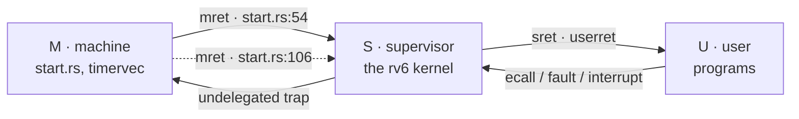

# Traps, Privilege Modes, and Interrupts

## Overview

Every event an operating system reacts to — a system call, a page fault, a
keystroke, a scheduling tick — arrives through one mechanism, and today we take
it apart. We start with RISC-V's three privilege modes, then fix the vocabulary
that gets conflated everywhere: *exception*, *interrupt*, and *trap* are three
different words. Then the two halves that make rv6 work. First the machine-to-supervisor handoff in `start.rs` — six
control registers that must **all** be right, or the machine goes silent with
no message; PMP is the one everybody forgets. Second the supervisor trap path:
`stvec`, `sepc`, `scause`, `sstatus`, `stval`, the `scause` decode, and `sret`.
We close on the CLINT timer — why it must be armed in machine mode and
forwarded down, and why a scheduler without it can only switch when a process
cooperates. This session unlocks **13_traps** and **14_interrupts**; the
reference tables live in the [RISC-V](../guides/riscv.md) guide.

## Learning Objectives

- **Distinguish** exception, interrupt, and trap, and classify any event as one.
- **State** what M, S, and U may each do, and name the two instructions that move down the ladder.
- **Explain** each CSR `start.rs` writes before `mret`, and predict the failure if one is omitted.
- **Describe** physical memory protection and why an unconfigured PMP leaves S-mode unable to read a byte.
- **Trace** register state through a trap: what hardware writes, what `kernelvec` saves, what `sret` restores.
- **Decode** an `scause` value into kind and cause, and decide whether `sepc` must be advanced.
- **Derive** the timer path from `mtimecmp` through `timervec` to `sip.SSIP`, and justify the forwarding.
- **Argue** why preemption needs a timer, and what an interrupt storm looks like from outside.

## Prerequisites

- **L10 Boot: From Reset to `kmain`** — `_entry`, the M-mode start state, `-bios none`.
- **L14 The Context Switch and the Scheduler** — `swtch`, cooperative round robin, the quantum.
- **Exercise `a00_asm_bridge`** and exercises `00`–`12` — inline `asm!`, `global_asm!`, `extern "C"`.
- [RISC-V](../guides/riscv.md) — the CSR tables and the `scause` decode; this lecture is their narrative.
- [Unsafe Rust and no_std](../guides/rust-unsafe-nostd.md) — `asm!` operands, `static mut`, `options(noreturn)`.

---

## 1. Three Modes, and What Each May Do

A CPU that runs other people's code needs a way to be *less* powerful on
purpose. RISC-V spells that out as three privilege modes, held in two bits of
hart state no instruction can read directly.

| Mode | Encoding | Who runs there in rv6 | May do |
|---|---|---|---|
| **M** machine | `11` | `entry.rs`, `start.rs`, `timervec` | Everything: all CSRs, all physical memory, PMP, the CLINT. The mode at reset |
| **S** supervisor | `01` | the rv6 kernel | `s*` CSRs, `satp`, delegated traps, `sret`, `sfence.vma`, `wfi`. **Cannot** touch `m*` CSRs |
| **U** user | `00` | shell commands, `18_user_mode` on | Ordinary instructions only. **No** CSR access, and only the memory its page table grants |

**Privilege belongs to the hart, not to the code.** The same bytes behave
differently depending on the mode executing them: `csrr t0, mstatus` is fine in
M, illegal in S and U. No bit in the encoding says "privileged"; the check
happens at execution time against the current mode.

**You cannot ask what mode you are in.** There is no readable `current_mode`;
S-mode cannot read `mstatus`, U-mode cannot read `sstatus`. Privilege is
visible from below only through what fails — deliberately, since a mode that
could inspect the ladder could probe it.

**Going down is a return; going up is a trap.** There is no "enter user mode"
instruction: you descend by setting up the state a *return* would restore and
executing `mret` or `sret`, and you ascend only by trapping. That asymmetry is
the security model — the lower mode never chooses the address it lands on,
because the upper mode wrote it into `mtvec` or `stvec` beforehand.



> Key distinction: *privilege* and *address space* are independent. Sv39
> controls **which bytes** you can reach; the mode controls **which
> instructions** you may execute.

x86 has four rings but real systems use two — the standard cautionary tale
about designing more privilege levels than anyone wants. ARMv8's EL0–EL3 map
onto U/S/M closely enough that porting is mostly renaming: `ELR_EL1` is `sepc`,
`ESR_EL1` is `scause`, `VBAR_EL1` is `stvec`, `eret` is `sret`.

---

## 2. Exception, Interrupt, Trap: Three Words, Three Meanings

**Exception** — *synchronous*. The instruction currently executing caused it, so
re-running the program hits it at the same instruction every time. A
breakpoint, a page fault, an illegal instruction, an `ecall`.

**Interrupt** — *asynchronous*. Something outside the instruction stream wants
attention. It is delivered *between* instructions, at a boundary the hardware
picks, with no relation to what was executing. A timer expiry, a UART receiving
a byte, a disk finishing a transfer.

**Trap** — the umbrella term for the *transfer of control* either one causes:
stop, record why, jump to the handler. In RISC-V both kinds share one vector
register and one cause register, which is why they get conflated — and why bit
63 of `scause` exists.

```text
                          an event
                              |
              +---------------+---------------+
              |                               |
        EXCEPTION                        INTERRUPT
     synchronous, caused by          asynchronous, caused by
     the current instruction         something else entirely
              |                               |
     ebreak, ecall, page fault       timer, UART, disk
     illegal instruction              (scause bit 63 = 1)
     (scause bit 63 = 0)                      |
              |                               |
              +---------------+---------------+
                              |
                          take a TRAP
                  scause, sepc, sstatus written
                        pc <- stvec
```

The split has a consequence students hit in `13_traps`. For an exception the
faulting instruction has **not** completed; `sepc` points *at* it, and whether
to re-run or step past is a per-cause decision. A page fault you repaired
should re-run; an `ebreak` you have counted must be stepped over, or you take
the same trap forever. For an interrupt nothing failed, and `sepc` already
points at the next instruction.

> Key distinction: RISC-V traps are **precise**. When the handler starts, every
> instruction before the trapping one has completed and every one after it has
> had no effect, however deeply the pipeline was speculating. That is what lets
> `sepc` be a single address rather than a "somewhere around here" hint.

Intel encodes that decision in hardware, splitting exceptions into **faults**
(reported before the instruction), **traps** (reported after), and **aborts**.
RISC-V does not: every exception reports *before*, so the choice is your
handler's.

---

## 3. The Machine-to-Supervisor Handoff

QEMU drops your kernel at `_entry` in machine mode. rv6 stays there for exactly
one function, `start()`, whose job is to arrange the world so the kernel can run
one rung down — the densest twenty lines in the course, and the failure mode
when you get them wrong is a machine that prints nothing.

```text
  start.rs:25  start()          in M-mode, no page table, full power
    |
    |  1. mstatus.MPP = 01          where mret goes          start.rs:28-31
    |  2. mepc = kmain              what pc mret loads       start.rs:34
    |  3. satp = 0                  paging off for now       start.rs:37
    |  4. medeleg = mideleg = 0xffff  send traps to S        start.rs:40
    |  5. pmpaddr0 / pmpcfg0        let S touch memory       start.rs:43-44
    |     mcounteren = 0xffffffff   let S read `time`        start.rs:47
    |  6. timerinit()               arm the CLINT            start.rs:51
    v
  start.rs:54  mret  ------------->  kmain, in S-mode
```

### `mstatus.MPP` and `mepc`: where `mret` lands

`mret` is a *return*, and like any return it reads its destination out of saved
state: `mstatus.MPP` — bits 12:11, "machine previous privilege" — is the mode
it returns *to* (`00` U, `01` S, `11` M), and `mepc` is the address. Neither
was saved by a real trap. `start()` forges both, and `mret` cannot tell the
difference — you enter a lower mode by pretending you were already there.

The read-modify-write at `start.rs:28-31` is not decoration. `mstatus` holds a
dozen unrelated fields, so blindly writing `0b01 << 11` would zero all of them.
`start.rs:13-14` name the mask and the value; `:29` clears the field, `:30`
sets it. That pattern is how you touch any packed CSR.

### `medeleg` and `mideleg`: delegation

By default *every* trap is taken in machine mode: an `ebreak` in the kernel
would vector to `mtvec`, and your S-mode handler would never run unless M-mode
inspected the cause and bounced it back down by hand. Delegation removes that
round trip. `medeleg` is a bitmask over *exception* cause codes, `mideleg` over
*interrupt* cause codes; a set bit means "when this trap happens in S or U mode,
take it directly in S-mode." `start.rs:40` writes `0xffff` to both.

Two subtleties hide in that line. Delegation applies only to traps taken *in* S
or U mode. And some bits are hardwired zero and ignore the write: `medeleg` bit
11 (`ecall` from M-mode), and `mideleg` bits 3, 7, and 11 — the machine
software, timer, and external interrupts. **Machine-level interrupts cannot be
delegated at all**, which Section 5 is built on.

### PMP: the one everybody skips

Physical memory protection is a small set of range registers checked in
hardware on every load, store, and fetch made by S-mode or U-mode. It sits
*below* paging — an address that survives the Sv39 walk still has to survive
PMP — and machine mode is exempt by default. The point is to let firmware fence
off regions from an operating system that is otherwise in charge.

Now the rule that bites. From the privileged spec: if **no** PMP entry matches
an S-mode or U-mode access, and at least one entry is implemented, the access
**fails**. Not "allowed by default" — fails. QEMU's `virt` implements sixteen
entries, all zero at reset, matching nothing.

So a `start()` that skips PMP does this: `mret` succeeds, the hart enters
S-mode at `kmain`, and the first instruction fetch matches no entry.
Instruction access fault, cause 1, delegated, vectoring to `stvec` — still
zero. The hart jumps to address 0, faults, vectors to 0, forever. No error, no
panic, no output — the worst failure signature in this course, two lines away:

```rust
asm!("li t0, 0x3fffffffffffff", "csrw pmpaddr0, t0", out("t0") _);  // start.rs:43
asm!("li t0, 0xf", "csrw pmpcfg0, t0", out("t0") _);                // start.rs:44
```

`pmpcfg0`'s low byte configures entry 0: bit 0 R, bit 1 W, bit 2 X, bits 4:3
the address-matching mode `A`, where `01` means TOR ("top of range" — from the
previous entry's address, here zero, up to `pmpaddr0`). So `0xf` is `R|W|X`
with TOR. PMP addresses are byte addresses shifted right by two, so
`0x3fffffffffffff` (2^54 − 1) gives a top of range of 2^56 − 4: one entry
covering all of physical memory.

`mcounteren = 0xffffffff` (`start.rs:47`) rides along, letting S-mode read the
`time` and `cycle` counters; without it `csrr t0, time` is an illegal
instruction, because counter access is a privilege too.

Omit any one of those six steps and the kernel breaks, usually with *no output
whatsoever*; Problem 2 works through all six. That is where
[QEMU and GDB](../guides/qemu-gdb.md) earns its place: attach, `info
registers`, and read `mstatus`, `mepc`, and `pmpcfg0` directly.

---

## 4. The Supervisor Trap Path

The kernel is now in S-mode and a trap arrives. Precisely what the hardware
does — and what it does not:

1. Writes the cause into **`scause`**: kind in bit 63, code in the low bits.
2. Writes the address of the trapping instruction into **`sepc`**.
3. Writes fault-specific information into **`stval`** — the faulting address on
   a page fault, zero for most other causes.
4. Copies `sstatus.SIE` into `SPIE`, clears `SIE`, and records the mode it came
   from in `SPP` (1 = supervisor, 0 = user).
5. Sets `pc` to the address in **`stvec`**.

That is all. It does **not** save a general-purpose register, switch stacks, or
switch page tables. Your handler starts with the interrupted code's `sp`, its
`satp`, and all 31 registers still holding its values — values you destroy the
moment you execute anything. Step 4 is worth a second look: **traps arrive with
interrupts disabled**, so a tick cannot land on a half-saved register set.

`stvec`'s low two bits are a MODE field, not address bits: `00` is Direct, and
`01` is Vectored, where interrupt *i* goes to BASE + 4×*i*. rv6 uses Direct and
dispatches in software, which is why `kerneltrap` starts by reading `scause`,
and why `kernelvec` is `.align 4` (`trap.rs:89`) — point `stvec` at a
misaligned handler and you have chosen Vectored mode with a BASE three bytes
off.

### `kernelvec`: what software must do

`trap.rs:86-131` is the assembly the hardware refuses to write for you:

```asm
kernelvec:
    addi sp, sp, -128      # trap.rs:91   carve a frame on the current stack
    sd ra,   0(sp)         # trap.rs:92   save the 16 caller-saved registers
    ...                    #              ra, t0-t2, a0-a7, t3-t6
    call kerneltrap        # trap.rs:109  into Rust
    ld ra,   0(sp)         # trap.rs:111  restore all sixteen
    ...
    addi sp, sp, 128       # trap.rs:127
    sret                   # trap.rs:129  resume at sepc, mode from SPP
```

Why sixteen and not thirty-one? `kerneltrap` is a normal Rust function under
the C calling convention, which already preserves `s0`–`s11`; the caller-saved
set is exactly what a call may destroy, so that is what `kernelvec` protects.
It also uses the **current** stack, which works only because the trap came from
kernel code — a trap from user mode has neither a usable `sp` nor a page table
containing the kernel, hence `18_user_mode`'s trampoline.

### Decoding `scause`

```rust
if (scause >> 63) == 1 {          // trap.rs:55
    match scause & 0xff { ... }   // trap.rs:57  an interrupt
} else {
    if scause == 3 { ... }        // trap.rs:75  an exception
}
```

Test the top bit **first**, always. The cause codes overlap completely:

| Code | As an interrupt (bit 63 = 1) | As an exception (bit 63 = 0) |
|---|---|---|
| 1 | Supervisor software interrupt — rv6's timer tick | Instruction access fault |
| 3 | *(machine software; not seen in S)* | Breakpoint — `ebreak` |
| 5 | Supervisor timer interrupt — unused by rv6 | Load access fault |
| 8 | *(reserved)* | Environment call from U-mode — a system call |
| 9 | Supervisor external interrupt — a device via the PLIC | Environment call from S-mode |

Drop the top-bit test and a handler meaning "timer tick" will happily "handle"
an instruction access fault: it clears a bit that is not pending, returns, and
re-executes the faulting instruction forever.

### Advancing `sepc`, and `sret`

`trap.rs:75-78` is the whole breakpoint handler:

```rust
if scause == 3 {
    TRAP_COUNT += 1;
    asm!("csrw sepc, {}", in(reg) sepc + 4);   // trap.rs:77
}
```

`sepc` points at the `ebreak`, and `sret` resumes at `sepc`. Return without
touching it and the `ebreak` traps again, and the kernel loops on one
instruction until the harness times out. The `+ 4` is this instruction's
encoded size, not a law — the compressed extension has a 2-byte `c.ebreak`.
`sret` itself mirrors `mret` one rung down: `pc ← sepc`, privilege from `SPP`,
`SIE ← SPIE`, `SPIE ← 1`, `SPP ← 0`.

```mermaid
sequenceDiagram
    participant C as kernel code
    participant HW as hardware
    participant V as kernelvec
    participant K as kerneltrap
    C->>HW: ebreak (or a timer arrives)
    HW->>HW: scause, sepc, stval<br/>SPIE=SIE, SIE=0, SPP=1
    HW->>V: pc = stvec
    V->>V: sp -= 128; save ra, t*, a*
    V->>K: call kerneltrap
    K->>K: read scause, sepc
    K->>K: interrupt? clear sip.SSIP, TICKS+=1<br/>exception? sepc += 4
    K-->>V: return
    V->>V: restore ra, t*, a*; sp += 128
    V->>C: sret · pc=sepc, SIE=SPIE, mode=SPP
```

---

## 5. The Timer, and Why It Takes a Detour

A timer is the one source of traps the kernel *creates for itself*, and the
only reason a scheduler can be anything but polite. QEMU's `virt` board
provides a core-local interruptor (CLINT) at physical `0x0200_0000`, of which
two registers matter:

| Register | Address | Meaning |
|---|---|---|
| `mtime` | `0x0200_0000 + 0xBFF8` (`start.rs:17`) | A free-running 64-bit counter, 10 MHz on `virt` |
| `mtimecmp` | `0x0200_0000 + 0x4000` (`start.rs:18`) | Hart 0's alarm. While `mtime >= mtimecmp`, a machine timer interrupt is pending |

That second sentence is the whole device. There is no "fire once" mode and no
repeat register: the interrupt is *level-triggered* on the comparison, so the
only way to clear it is to push `mtimecmp` into the future, and a handler that
does not re-enters immediately. `start.rs:61-62` arms the first one; with
`INTERVAL = 1_000_000` (`start.rs:19`) against a 10 MHz counter that is 0.1 s,
ten ticks a second. `start.rs:74` sets `mie` bit 7, `MTIE`.

### Why machine mode has to do this

Two independent reasons, each sufficient alone. **`mtimecmp` is a machine-mode
device**: a physical address the kernel deliberately never maps (see
[Memory Map](../guides/memory-map.md)), and `mie` is an M CSR S-mode cannot
read. **The machine timer interrupt cannot be delegated**: `mideleg` bit 7 is
hardwired zero, so the trap is taken in M-mode at `mtvec` whatever the kernel
wants — and rv6, like xv6, forwards it down by hand.

```text
   mtime  (10 MHz, always counting)
     |
     |  reaches mtimecmp
     v
   machine timer interrupt, cause 7  --- cannot be delegated ---
     |
     v
   timervec   (M-mode, start.rs:80-107)
     |  csrrw a0, mscratch, a0      get a scratch register  start.rs:86
     |  mtimecmp += INTERVAL        rearm, or it re-fires   start.rs:92-96
     |  li a1, 2 ; csrw sip, a1     raise sip.SSIP          start.rs:99-100
     |  mret                                                start.rs:106
     v
   supervisor software interrupt, cause 1  (scause = 0x8000...0001)
     |
     v
   kernelvec -> kerneltrap  (trap.rs:58)  clear sip.SSIP, TICKS += 1
```

`timervec` needs a register before it can do anything, and every register
belongs to the interrupted kernel. `csrrw a0, mscratch, a0` (`start.rs:86`)
swaps `a0` with `mscratch` in one instruction, stashing the interrupted value
and loading a pointer to `TIMER_SCRATCH` (`start.rs:22`) in the same step.

The forwarding is `li a1, 2` then `csrw sip, a1` — set `SSIP`, the supervisor
**software** interrupt pending bit, which exists so one piece of privileged
code can poke another. rv6's tick is a *software* interrupt carrying a
*timer's* meaning, which is why `scause` reads 1 and not 5.

> Key distinction: writing the whole `sip` register rather than setting a bit is
> safe only because `sip` is a restricted view of `mip` in which `SSIP` is
> writable while `STIP` and `SEIP` are read-only shadows of the interrupt
> controllers. Do not generalize the pattern.

### What the kernel must do to receive it

Three gates must all be open, each a separate line of code. `intr_on`
(`trap.rs:39-42`) opens two:

```rust
asm!("csrs sie, {}", in(reg) 1usize << 1);      // trap.rs:40  SSIE: this source
asm!("csrs sstatus, {}", in(reg) 1usize << 1);  // trap.rs:41  SIE: the master switch
```

An interrupt is delivered only when its bit is set in `sie`, its bit is set in
`sip`, and `sstatus.SIE` is 1. `csrs` — set bits, leave the rest — is the right
instruction; `csrw` here would clear `sie.SEIE` and silently break the console
the moment `15_console` turns it on (`console.rs:63`). One rule nobody writes
down: in **user** mode delegated supervisor interrupts are always enabled
regardless of `sstatus.SIE`, which governs only the kernel.

Then the handler must clear the pending bit (`trap.rs:62-63`):

```rust
asm!("csrr {}, sip", out(reg) sip);
asm!("csrw sip, {}", in(reg) sip & !2);   // trap.rs:63
```

Skip it and you get an **interrupt storm**: `SSIP` is still set, `sie.SSIE` is
still set, and `sret` restores `SIE` from `SPIE`, so the interrupt is
re-delivered on the first instruction after `sret` — one instruction of progress
per trap, forever, and from outside indistinguishable from a hang.

---

## 6. Why Preemption Needs a Timer

Exercise `06_scheduling` built a round-robin scheduler that runs when a process
calls `yield`. It is *cooperative*: control returns to the kernel only when the
running process gives it back. The scheduler is therefore a subroutine of the
running program, and a process that loops forever without a system call is the
end of the machine — no input, no other process, no way to kill it, because the
kernel is not running and has no mechanism to start running.

```text
COOPERATIVE                        PREEMPTIVE
  P1 runs .................          P1 runs ....|tick|.... into the kernel
  P1 calls yield                     kernel: quantum expired
  kernel picks P2                    kernel picks P2
  P2 runs .................          P2 runs ....|tick|....
  P2 loops forever                   P2 loops forever
  ***  machine is gone  ***          kernel takes it back on the next tick
```

The only escape is an event not under the running program's control, and there
is exactly one source of those: an interrupt. A timer is the general case
because it depends on no device — it is the kernel setting an alarm clock for
itself before handing over the CPU. Atlas used clock interrupts for exactly
this, and CTSS and Multics built time-sharing on them.

**rv6 stays cooperative on purpose.** `14_interrupts` gets the ticks flowing and
counted; it does not turn a tick into a forced context switch. A cooperative
scheduler is deterministic, so a wrong `pick_next` gives a wrong *order* rather
than a heisenbug. Making the tick preempt would require per-process time
accounting, a `swtch` from inside the trap handler, and a lock on every kernel
structure the switch could interrupt — since a switch could then happen at
*any* instruction. `07_spinlocks` exists for that reason.

Linux on RISC-V solves the same problem one layer up: with no M-mode code of
its own it asks firmware for a timer through the SBI `TIME` extension, and
OpenSBI does what `timervec` does.

---

## 7. What This Unlocks

**`13_traps`** installs `stvec`, catches an `ebreak`, and returns from it — the
first time your kernel *survives* something going wrong. **`14_interrupts`**
opens the gates, receives the forwarded ticks, clears `sip.SSIP`, and counts.
From here `15_console` reuses the identical path for `scause = 9`, a keypress,
and `18_user_mode` for `scause = 8`, the system call.

---

## Key Concepts

| Concept | Definition | Example |
|---|---|---|
| Privilege mode | Two bits of hart state deciding which instructions are legal | M = `11`, S = `01`, U = `00` |
| Exception vs interrupt | Synchronous, caused by the current instruction, versus asynchronous | `ebreak` → `scause = 3`; timer → `scause = 0x8000…0001` |
| `mstatus.MPP` | Bits 12:11: the mode `mret` returns to | `0b01 << 11` for supervisor (`start.rs:14`, `start.rs:30`) |
| Delegation | `medeleg`/`mideleg` masks routing traps straight to S-mode | `0xffff` to both (`start.rs:40`); `mideleg` bits 3, 7, 11 hardwired 0 |
| PMP | Physical range checks on S/U accesses, below paging | `pmpcfg0 = 0xf` = R\|W\|X\|TOR (`start.rs:43-44`) |
| `stvec` | The supervisor trap vector; low two bits are the MODE field | `kernelvec`, `.align 4` for Direct mode (`trap.rs:35`, `trap.rs:89`) |
| `sepc` | Address of the trapping instruction; where `sret` resumes | `sepc + 4` steps over an `ebreak` (`trap.rs:77`) |
| `scause` | Bit 63 = kind, low bits = cause code | `(scause >> 63) == 1` (`trap.rs:55`) |
| Interrupt gate | `sie` bit ∧ `sip` bit ∧ `sstatus.SIE` — all three, or nothing fires | `trap.rs:40-41` opens two of them |
| Interrupt storm | Handler returns without clearing the pending bit, so the trap re-fires | Missing `csrw sip, sip & !2` (`trap.rs:63`) |
| Preemption | The kernel regaining the CPU without the process cooperating | Needs a timer; rv6 ticks but does not yet force a yield |

---

## Practice Problems

### Problem 1: Decode six `scause` values

For each, give the kind, the cause, what `kerneltrap` does, and whether `sepc`
must be advanced before `sret`.

```text
(a) 0x8000000000000001      (d) 0x0000000000000002
(b) 0x0000000000000003      (e) 0x0000000000000001
(c) 0x8000000000000009      (f) 0x8000000000000005
```

<details>
<summary>Click to reveal solution</summary>

| | Kind | Cause | rv6 does | Advance `sepc`? |
|---|---|---|---|---|
| (a) | Interrupt | Supervisor software — the forwarded timer tick | Clears `sip.SSIP`, `TICKS += 1` (`trap.rs:58-64`) | **No** |
| (b) | Exception | Breakpoint, `ebreak` | `TRAP_COUNT += 1`, `sepc += 4` (`trap.rs:75-78`) | **Yes** |
| (c) | Interrupt | Supervisor external — a device via the PLIC | `console::intr()` (`trap.rs:69`) | **No** |
| (d) | Exception | Illegal instruction | Falls through the `if`; nothing | Would have to; rv6 loops |
| (e) | Exception | Instruction access fault | Nothing | Would have to; rv6 hangs |
| (f) | Interrupt | Supervisor timer | No `5` arm; `_ => {}` | No |

Note the pairs (a)/(e) and (c)/(exception 9, `ecall` from S-mode): identical low
bits, opposite meanings, separated only by bit 63. Never advance `sepc` for an
interrupt — nothing failed, so it already holds the instruction that was *about*
to run. (f) is the one rv6 never sees: the machine timer cannot be delegated, so
it arrives as (a).
</details>

### Problem 2: Six omissions, six symptoms

A `start()` is missing exactly one line. Match each symptom to it.

```text
Symptoms                                    Missing line
1. QEMU prints nothing, hart spins          A. csrw mepc, t0
2. ebreak in kmain resets the machine       B. csrw pmpcfg0 (0xf)
3. `csrr t0, time` traps with cause 2       C. csrw medeleg / mideleg
4. Kernel runs, but satp is ignored         D. csrw mcounteren
5. Jump to address 0 immediately            E. mstatus.MPP = 01
```

<details>
<summary>Click to reveal solution</summary>

**1 → B**, **2 → C**, **3 → D**, **4 → E**, **5 → A**.

**1 (PMP).** The first S-mode instruction fetch matches no PMP entry and faults
with cause 1. It is delegated, so it vectors to `stvec` — still 0 this early in
boot. Fetch at 0 faults, vectors to 0, loops. Total silence.

**2 (delegation).** Without `medeleg` the breakpoint is taken in M-mode at
`mtvec`, which `13_traps` never sets, so the hart jumps to 0 in machine mode.

**3 (`mcounteren`).** Without the `TM` bit, `csrr t0, time` from S-mode is an
illegal instruction — cause 2, on an instruction legal in the ISA.

**4 (`MPP`).** `MPP` is `11` at reset, so `mret` "returns" to machine mode. The
kernel runs and prints, because M can do everything S can — but M-mode ignores
`satp`, so the bug surfaces only when a virtual address differs from its
physical one.

**5 (`mepc`).** `mret` jumps to `mepc` = 0: fetch, fault, `stvec` = 0, loop.

Symptoms 1 and 5 are indistinguishable from the terminal; only `info registers`
tells them apart, since `mepc` is 0 in one case and `kmain` in the other. One
symptom, six causes — the debugger is not optional.
</details>

### Problem 3: Decode a PMP configuration

A hart has `pmpaddr0 = 0x0000_0000_2000_0000` and `pmpcfg0 = 0x0000_0000_0000_090B`.

(a) What are entries 0 and 1 configured as? (b) Which physical addresses may
S-mode read? (c) An S-mode store to `0x8000_1000` — allowed? (d) The same store
from M-mode?

<details>
<summary>Click to reveal solution</summary>

**(a)** `pmpcfg0` packs eight one-byte configurations, entry 0 in the low byte,
so entry 0 = `0x0B` and entry 1 = `0x09` (bit 0 R, bit 1 W, bit 2 X, bits 4:3
A, bit 7 L). Entry 0 = `0000_1011`: R, W, no X, A = TOR, covering
`[0, pmpaddr0 << 2)` = `[0, 0x8000_0000)` — device space only. Entry 1 =
`0000_1001`: R only, TOR, running from `pmpaddr0` to `pmpaddr1` = 0 — top below
bottom, so **empty, matching nothing.**

**(b)** `0x0` through `0x7fff_ffff`, read/write, not executable; all of RAM is
denied. **(c) No** — store access fault, cause 7. **(d) Yes**: M-mode is exempt
unless the lock bit `L` is set, so a PMP mistake appears to work while M-mode
code runs and breaks only after `mret`.

The empty entry 1 is the trap: a TOR range is defined by the *previous* entry's
address, so configuring entry *n* without setting `pmpaddr[n-1]` gives a range
nobody expects.
</details>

### Problem 4: Trace a trap

An `ebreak` at `0x8000_1234` executes in supervisor mode with `sstatus.SIE = 1`,
`SPIE = 0`, `SPP = 0`, `sp = 0x8000_9000`, `stvec = 0x8000_5000` (`kernelvec`).

(a) Give `sepc`, `scause`, and the three `sstatus` fields immediately after the
trap. (b) Give `sp` when `kerneltrap` begins. (c) Give `pc` after `sret`.
(d) Repeat (c) assuming the handler forgot `sepc += 4`.

<details>
<summary>Click to reveal solution</summary>

**(a)**

```text
sepc   = 0x8000_1234     the ebreak itself, not the next instruction
scause = 3               breakpoint; bit 63 clear
stval  = 0               ebreak sets no fault value
sstatus.SPIE = 1         the old SIE
sstatus.SIE  = 0         interrupts off inside the handler
sstatus.SPP  = 1         the trap came from supervisor mode
pc = 0x8000_5000         stvec, Direct mode
```

**(b)** `0x8000_9000 − 128 = 0x8000_8F80`. `kernelvec` subtracts 128 at
`trap.rs:91` before saving anything, and `kerneltrap` runs on that same stack —
no stack switch happens on a kernel trap.

**(c)** `0x8000_1238`. `sret` also restores `SIE` from `SPIE` (back to 1), sets
`SPIE = 1`, returns to supervisor mode because `SPP = 1`, and clears `SPP`.
Every register is as it was.

**(d)** `pc = 0x8000_1234`, the `ebreak` itself, which traps and repeats;
`TRAP_COUNT` climbs at millions per second and the harness times out. Note what
it does *not* do: overflow the stack. `kernelvec` restores `sp` before `sret`,
so the loop is stack-neutral — silent, infinite, leaving no trace.
</details>

### Problem 5: Timer arithmetic and drift

`mtime` runs at 10 MHz and `INTERVAL = 1_000_000`. At boot, `start.rs:61-62`
reads `mtime = 4_200_000` and writes `mtimecmp`.

(a) At what `mtime` does the first interrupt fire, and how many ticks per
second? (b) The kernel spends 40,000 cycles with interrupts disabled before
this tick is serviced; `timervec` does `mtimecmp += INTERVAL`
(`start.rs:92-96`). What is the new `mtimecmp`? (c) A student rewrites it as
`mtimecmp = mtime + INTERVAL` — what now, and what goes wrong over an hour?
(d) The *supervisor* handler forgets `csrw sip, sip & !2`. What happens?

<details>
<summary>Click to reveal solution</summary>

**(a)** `mtimecmp = 5_200_000`; it goes pending 0.1 s later, so **10 ticks per
second**.

**(b)** `6_200_000`. The 40,000-cycle delay does not matter, because the new
deadline comes from the old *deadline*, not the current time. Ticks land on a
fixed grid however late any one was serviced.

**(c)** `mtime` is now about `5_240_000`, so `mtimecmp = 6_240_000` — 40,000
cycles (4 ms) late, and the error is *cumulative*, since each tick's lateness is
baked into the next deadline. Every period becomes 1,040,000 cycles instead of
1,000,000: **4% slow, about two and a half minutes an hour**. The classic
absolute-versus-relative-deadline bug.

**(d)** The M-mode half is fine, but `sip.SSIP` is still set, `sie.SSIE` is set,
and `sret` restores `SIE = 1`, so the interrupt is pending, enabled, and
unmasked the instant `sret` retires. The kernel makes about one instruction of
progress per trap; the terminal looks hung — exactly like a *missing*
`intr_on`, which produces zero ticks. Opposite bugs, identical silence.
</details>

### Problem 6: Find the bug

This handler passes `13_traps`, fails `14_interrupts` intermittently, and once
the console exists it corrupts input.

```rust
#[no_mangle]
pub extern "C" fn kerneltrap() {
    unsafe {
        let scause: usize;
        asm!("csrr {}, scause", out(reg) scause);
        match scause & 0xff {
            1 => {
                asm!("csrw sip, {}", in(reg) 0usize);
                TICKS += 1;
            }
            3 => {
                let sepc: usize;
                asm!("csrr {}, sepc", out(reg) sepc);
                asm!("csrw sepc, {}", in(reg) sepc + 4);
                TRAP_COUNT += 1;
            }
            _ => {}
        }
    }
}
```

Find three distinct defects and give the symptom of each.

<details>
<summary>Click to reveal solution</summary>

**1. No top-bit test** (`trap.rs:55` is the missing line). `scause & 0xff`
collapses the two cause spaces onto each other, so a real instruction access
fault — a jump into unmapped memory — matches the `1` arm and is treated as a
timer tick: the handler clears a bit that is not pending, increments `TICKS`,
and returns to the faulting instruction, which faults again.

**2. `csrw sip, 0` instead of clearing only bit 1.** It survives, because only
`SSIP` is writable through the `sip` view, but the same pattern applied to
`sie` or `sstatus` — which students do copy — disables the console's interrupt
or the master enable. Use `& !2` (`trap.rs:63`), or `csrc`.

**3. No arm for cause 9.** Once `15_console` routes the UART through the PLIC,
a supervisor external interrupt arrives with bit 63 set and low bits 9. The
`_ => {}` swallows it without calling `console::intr()` and without the PLIC
claim/complete handshake, so the line stays asserted and the kernel storms —
but only after a key is pressed, which is why it reads as "input corrupts
everything".

The lesson: a dispatcher must decide *kind* before *cause*, and ignoring a
level-triggered source is always a storm.
</details>

---

## Further Reading

- [RISC-V](../guides/riscv.md) — the CSR tables, the full `scause` decode, and the common-failure table.
- [Memory Map](../guides/memory-map.md) — CLINT, PLIC, and UART addresses, and why the CLINT is unmapped.
- [Cheatsheet](../guides/cheatsheet.md) — the M→S checklist and the timer registers on one page.
- [QEMU and GDB](../guides/qemu-gdb.md) — `info registers` and breaking on `kerneltrap` when nothing prints.
- [rv6 Architecture](../guides/rv6-architecture.md) — where `start.rs` and `trap.rs` sit in the kernel.
- [All Exercises](../assignments/exercises.md) — `13_traps` and `14_interrupts` are unlocked here.
- *RISC-V Privileged Architecture* manual, Chapters 3 and 4. The PMP no-match rule is worth reading in the original.
- xv6-riscv `kernel/start.c`, `kernel/kernelvec.S`, `kernel/trap.c` — rv6's direct ancestors.
- Linux `arch/riscv/kernel/entry.S` and `drivers/clocksource/timer-riscv.c` — the same path at production scale.
- Corbató et al., *An Experimental Time-Sharing System* (1962) — the clock interrupt as the basis of time sharing.

---

## Summary

1. **Three modes, and you cannot ask which one you are in.** M owns everything, S runs the kernel, U runs programs. Privilege belongs to the hart, not the instruction bytes, and the only evidence a lower mode gets is what fails.
2. **Down is a return; up is a trap.** `mret` and `sret` are the only ways to lower privilege, and both work by restoring forged state (`start.rs:54`). The only way up is an event whose handler address the upper mode chose in advance.
3. **Exception, interrupt, trap are three words.** An exception is synchronous and caused by the current instruction; an interrupt is asynchronous; a trap is the transfer of control either produces. Bit 63 of `scause` is all that separates their overlapping cause codes.
4. **The M→S handoff is six registers and all must be right.** `mstatus.MPP`, `mepc`, `medeleg`/`mideleg`, `pmpaddr0`/`pmpcfg0`, then `mret` (`start.rs:28-54`). Most of the failure modes print nothing at all.
5. **PMP fails closed.** If no entry matches an S-mode access and any entry is implemented, the access is denied. Skip `pmpcfg0` and the kernel faults on its first fetch, vectors to an unset `stvec`, and spins at address 0 in silence.
6. **The hardware writes five things and saves nothing.** `scause`, `sepc`, `stval`, the `sstatus` triple, and `pc ← stvec` — not one general register, not the stack, not the page table. `kernelvec` (`trap.rs:86-131`) covers the caller-saved half; the calling convention covers the rest.
7. **`sepc` points at the trapping instruction, and deciding what that means is your job.** Advance past an `ebreak` or an `ecall` (`trap.rs:77`); leave it alone after an interrupt. Forgetting is an infinite, silent loop.
8. **A timer is what makes a kernel a kernel.** The CLINT speaks only M-mode and its interrupt cannot be delegated, so `timervec` rearms `mtimecmp` and forwards the tick as `sip.SSIP` (`start.rs:92-100`). Without it a scheduler can switch only when a process cooperates.
