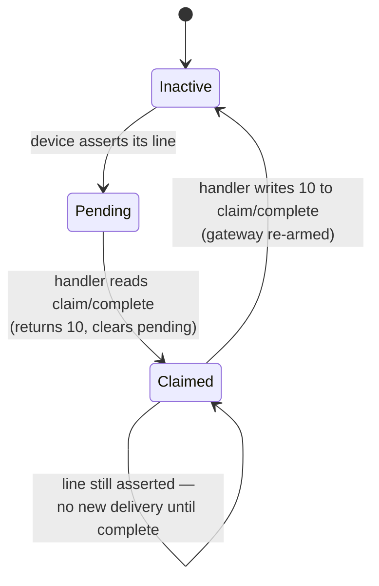

# Device Interrupts, the PLIC, and the Console

## Overview

Last session the timer fired and the kernel counted ticks — an interrupt that
originates *inside* the CPU. Today it comes from outside: you press a key, a UART
asserts a wire, and the byte crosses hardware you have not met yet — the
Platform-Level Interrupt Controller — before one line of your code runs. We
start by pricing polling against interrupts with real arithmetic, because the
answer is not "interrupts are always better": rv6 still polls to *transmit*,
deliberately. Then the PLIC as a four-register protocol — priority, enable,
threshold, claim/complete — and the sequence a handler must follow, including the
two opposite ways to get it wrong: an interrupt storm, and a device that goes
silent forever with no error message. Then the console: a ring buffer between a
handler and a reader, and the **line discipline** that turns bytes into lines. The
exercise is `15_console`, the last in Module 2. See the
[Memory Map guide](../guides/memory-map.md) for where the PLIC lives.

## Learning Objectives

- **Quantify** the cost of polling versus interrupting for a given device rate,
  and justify why rv6 polls on transmit and interrupts on receive.
- **Describe** the PLIC's four register families and compute the address of each
  for a given hart context.
- **Trace** the claim → service → complete sequence, and predict the distinct
  failure produced by omitting each step.
- **Explain** why an external interrupt cannot be dismissed by writing a CSR,
  unlike the forwarded timer tick.
- **Enumerate** the gates a keypress must pass to reach `console::intr`, and
  diagnose which is closed from an observed symptom.
- **Derive** the invariants of a single-producer/single-consumer ring buffer and
  say which fails on a second hart.
- **Distinguish** cooked from raw input, and defend echo, erase, and line
  delimiting as kernel services rather than terminal features.
- **Compare** rv6, xv6, and Linux on where the line discipline lives.

## Prerequisites

- Exercise `11_devices` — the NS16550A register map, `LSR.DR`, `LSR.THRE`, and
  the polled `uart::getc`/`uart::putc` you wrote.
- Exercises `13_traps` and `14_interrupts` — `stvec`, `kernelvec`, `kerneltrap`,
  the `scause` interrupt/exception split, `sie` and `sstatus.SIE`.
- Exercise `09_virtual_memory` and the [Sv39 Paging guide](../guides/sv39-paging.md)
  — why a device region must be mapped before the kernel can touch it.
- Exercise `07_spinlocks` — so you can appreciate a structure that needs no lock.
- The [Memory Map guide](../guides/memory-map.md) — the `virt` address table,
  including the PLIC block at `0x0c00_0000`.
- The [Unsafe Rust and no_std guide](../guides/rust-unsafe-nostd.md) —
  `read_volatile`/`write_volatile` and `addr_of!`.

---

## 1. Two Ways to Find Out Something Happened

There are exactly two. Either the CPU asks the device ("is there a byte yet?"),
or the device tells the CPU. That is the whole design space, and choosing between
them is a *quantitative* question.

### 1.1 What a polling loop actually costs

Your `uart::getc` (`uart.rs:53`) reads `LSR`, tests `DR`, and returns `None` if no
byte is waiting. Reading input by polling means calling it in a loop:

```rust
loop {
    if let Some(b) = uart::getc() { handle(b); }
}
```

Price it. A fast typist runs 90 words per minute — 9 bytes per second, one byte
every 110 ms. One trip around the loop is a few instructions plus one MMIO byte
load, and the load dominates: it leaves the core, crosses a peripheral bus, and
comes back. Call it 100 ns.

```text
  bytes to read:      9 per second
  time per byte:      ~110 ms
  poll iterations:    ~1,100,000 per byte received
  CPU consumed:       100% — the loop is the only thing running
```

A million MMIO reads to learn one byte, and nothing else runs while the loop
spins. The interrupt path costs the `kernelvec` prologue (sixteen stores,
`trap.rs:91`–`trap.rs:107`), the handler, three MMIO accesses, and sixteen loads —
round up hard to 1 µs per byte, or 9 µs per second: five orders of magnitude
cheaper. And the real win is not cycles but that during those 110 ms the CPU can
run another process or halt in `wfi` (`console.rs:52`). **Polling a keyboard is
unacceptable, and the reason is arithmetic, not aesthetics.**

### 1.2 So why does rv6 still poll to print?

`uart::putc` (`uart.rs:48`–`uart.rs:51`) spins on `tx_ready()` until `LSR.THRE`
is set — a polling loop, in the finished kernel, on purpose. Run the arithmetic
the other way: here the *kernel* is the producer and the device is the consumer.
At 115200 baud a character takes 87 µs to shift out, but the 16550's transmit FIFO
(enabled at `uart.rs:30`) absorbs sixteen bytes without waiting, and under QEMU the
backend swallows them instantly — so `THRE` is essentially always set and the first
test of the loop succeeds.

> Key distinction: poll when the expected wait is shorter than the cost of being
> told, and bounded; interrupt when the wait is unbounded, or set by a human, or
> long enough that the CPU has something better to do.

There is a sharper reason too. An interrupt-driven transmit path needs a queue, a
lock on it, and a "transmitter ready" handler — none of which works inside a panic
handler with interrupts off and locks in unknown states. xv6 makes the tradeoff
explicit: `uart.c` has a 32-byte interrupt-driven transmit buffer *and* a polled
`uartputc_sync` that `printf` uses so a panic can still get its message out. rv6
keeps only the synchronous one. Printing is the last thing you want to lose.

### 1.3 The modern inversion

The tradeoff flips again at the top of the scale. A 10 Gbit/s NIC receiving
minimum-size frames delivers 14.88 million packets per second — 67 ns each. An
interrupt costs more than that, so an interrupt per packet is not merely wasteful
but impossible: the machine enters **receive livelock**, spending all its time in
interrupt entry and delivering nothing (Mogul and Ramakrishnan, 1996). Linux's
answer is NAPI: the first packet interrupts, the driver disables that interrupt
and polls until the ring drains, then re-enables.

```text
   device rate           interrupt per event   polling
   -----------------------------------------------------------
   9 bytes/s (you)       0.0009% CPU           100% CPU     <- interrupt
   115200 baud TX        needs queue + lock    first test hits   <- poll
   14.88 Mpps NIC        livelock              saturates    <- poll (NAPI)
```

Both extremes poll. The middle — a keyboard, a disk, most of your kernel —
interrupts.

---

## 2. The PLIC

The timer of exercise `14_interrupts` was easy to route because it had nowhere to
go: the CLINT is *core-local*, one timer per hart, wired into `mip.MTIP`. Devices
are not. A board has a UART, virtio slots, an RTC, PCIe — dozens of lines and, on
a bigger machine, several harts that could take them. Something must arbitrate: on
RISC-V, the **Platform-Level Interrupt Controller**, descendant of the 8259A PIC
in the original IBM PC and of every APIC and GIC since.

### 2.1 Sources, contexts, and the two questions

The PLIC answers two questions: *which* pending interrupt is most urgent, and
*who* handles it.

- A **source** is a numbered device line, 1 through 1023 (0 means "none"). On
  QEMU's `virt` machine the UART is source 10 — `plic.rs:14`.
- A **context** is a (hart, privilege mode) pair. On `virt`, hart *i* owns context
  `2i` for machine mode and `2i+1` for supervisor mode. rv6 is single-hart and
  runs in S-mode, so every register it touches belongs to **context 1**.

Every source has one global priority; every context has its own enable bitmap,
threshold, and claim/complete register — which is what lets a 64-core machine give
the network card to core 3 and the disk to core 7.

```text
  PLIC base = 0x0c00_0000              offset                what rv6 writes
  ---------------------------------------------------------------------------
  priority[src]         base + 4*src              +0x000028   1     (plic.rs:24)
  pending[src/32]       base + 0x1000 + ...       (read-only, rv6 never reads it)
  enable[ctx][src/32]   base + 0x2000 + 0x80*ctx  +0x002080   1<<10 (plic.rs:26)
  threshold[ctx]        base + 0x200000 + 0x1000*ctx  +0x201000   0 (plic.rs:28)
  claim/complete[ctx]   base + 0x200004 + 0x1000*ctx  +0x201004     (plic.rs:19)
```

`plic.rs:17`–`plic.rs:19` hardcode the context-1 offsets — honest for a
single-hart kernel, and the first thing a multi-hart port generalizes. `PLIC_SIZE`
is 4 MiB (`memlayout.rs:27`), the highest address above is `0x0c20_1004`, and
`vm.rs:138` maps the region `R|W` so the kernel can reach it with paging on.

### 2.2 Four registers, four different jobs

Three of them look like on/off switches. They are not.

| Register | Whose | Question it answers | rv6's value |
|---|---|---|---|
| `priority[src]` | the source's, globally | How urgent is this device? `0` = never interrupt. | `1` (`plic.rs:24`) |
| `enable[ctx]` | this context's | May this context *see* this source at all? | bit 10 set (`plic.rs:26`) |
| `threshold[ctx]` | this context's | How urgent must an interrupt be to reach me right now? | `0` (`plic.rs:28`) |
| `claim/complete[ctx]` | this context's | Read: which source fired? Write: I am done. | (`plic.rs:32`, `plic.rs:37`) |

Delivery requires *all* of `priority[src] > 0`, `enable[ctx][src] == 1`, and
`priority[src] > threshold[ctx]`. Threshold is the runtime masking knob — raise it
and this context goes deaf without disturbing anyone else's configuration.
Priority is the arbitration knob: with several sources pending the PLIC takes the
highest and breaks ties by *lowest source number*, so device numbering is not
cosmetic. And priority 0 is not the same as a cleared enable bit: zero silences
the source for every context on the machine, a cleared enable bit for just one.

### 2.3 Claim, service, complete

A source moves through four states, and the handler drives the transitions:



The handler is `console::intr` (`console.rs:68`–`console.rs:81`), nine lines long
because a device interrupt handler should be:

```rust
pub fn intr() {
    let irq = plic::claim();                 // console.rs:70 — which device?
    if irq == plic::UART0_IRQ {              // console.rs:71
        while let Some(b) = uart::getc() {   // console.rs:73 — drain the FIFO
            push(b);                         // console.rs:74 — into the ring
        }
    }
    if irq != 0 {                            // console.rs:78
        plic::complete(irq);                 // console.rs:79 — release the gateway
    }
}
```

Three steps, three obligations, and skipping one breaks the kernel in a
*different* way each time:

| Omission | What happens | How it looks |
|---|---|---|
| Never read `RBR` | `DR` stays set, the line stays asserted, the PLIC re-raises the instant you complete | **Interrupt storm.** `sret` traps again at once; the kernel hangs at 100% CPU. |
| Never `complete` | The PLIC keeps the source *claimed* and never delivers it again | **Silent death.** First keypress works, later ones vanish. No panic; ticks continue. |
| `complete` before draining | The line is still asserted when the gateway re-arms, so a redundant interrupt fires | Works, at double the rate. Correct by luck. |
| `if let` instead of `while let` | One byte per interrupt, but `DR` is still set, so another arrives at once | Works — *because the line is level-triggered*. Loses bytes on an edge-triggered device. |

The first two rows are the lesson: both produce a dead console, one burns all the
CPU and one burns none.

> Key distinction: the forwarded timer tick is dismissed by clearing `sip.SSIP`
> (`trap.rs:62`–`trap.rs:63`). A device interrupt has no such escape. `sip.SEIP`
> is read-only to supervisor software — it is a wire from the PLIC, and the only
> way to make it go low is to satisfy the PLIC.

Note the `irq != 0` guard (`console.rs:78`): `claim` returns 0 when nothing is
pending, which really happens, so a handler must survive being called for no
reason.

---

## 3. Nine Gates Between a Keypress and Your Code

Nothing here is automatic. A byte passes nine independent enables across four
files and two privilege modes, and if any one is off the symptom is identical: you
type and nothing happens.


Gates 1–4 are the device and the controller: the UART must be told to raise a line
at all (`uart::init` clears `IER` at `uart.rs:28` for the polled era;
`enable_rx_interrupt` sets it at `uart.rs:37`), and the PLIC must forward it.
Gates 5–8 are the CPU: delegate external interrupts, enable the supervisor
external source, turn the global switch on, point `stvec` somewhere useful. Gate 9
is paging — easy to forget, and the one gate with a *different* symptom, since an
unmapped PLIC makes `plic::claim`'s `read_volatile` take a load page fault rather
than return zero. `console::init` (`console.rs:58`–`console.rs:64`) closes gates
1, 2, 3, 4, and 6 in five lines; `trap::intr_on` (`trap.rs:39`) closes 7;
`main.rs:119`–`main.rs:120` calls them in that order.

---

## 4. The Console: A Ring Between Two Worlds

### 4.1 Top half, bottom half

`console::intr` does not parse, echo, or block. It moves bytes and gets out. This
is the **top-half / bottom-half** split every real driver uses: code running with a
trap in progress does the minimum the hardware requires, and the rest runs later at
normal priority, where it can be preempted and may sleep. Linux formalizes it as
hardirq handlers versus softirqs; rv6's version is that `intr` pushes and the shell
pops.

The reason is latency. While `kerneltrap` runs, `sstatus.SIE` is clear — the
hardware cleared it on entry — so every other device waits. A handler that parsed
a command line would add milliseconds to everything else's worst case.

### 4.2 The ring buffer

Between the halves sit 256 bytes and two counters (`console.rs:13`–`console.rs:15`):

```rust
static mut BUF: [u8; BUF_LEN] = [0; BUF_LEN];
static mut HEAD: usize = 0; // next index the consumer will read
static mut TAIL: usize = 0; // next index the producer will write
```

`HEAD` and `TAIL` are *monotonically increasing counters*, not array offsets;
`% BUF_LEN` turns them into offsets at the point of use (`console.rs:23`,
`console.rs:38`). Hence the fullness test `tail.wrapping_sub(head) < BUF_LEN`
(`console.rs:22`): counting rather than positioning removes the classic ambiguity
where a full ring and an empty ring both satisfy `head == tail`. The invariants:

- `TAIL - HEAD` is the number of bytes waiting, always in `0..=BUF_LEN`.
- `HEAD == TAIL` means empty, and is the only empty condition (`console.rs:35`).
- Only `push` writes `TAIL` and `BUF`; only `try_getc` writes `HEAD`.

```text
BUF_LEN shown as 4 for the trace (the real one is 256, console.rs:8)

  action        BUF                HEAD  TAIL   note
  ------------------------------------------------------------------
  start         [ .  .  .  . ]      0     0     empty
  push 'a'      [ a  .  .  . ]      0     1
  push 'b'      [ a  b  .  . ]      0     2
  push 'c'      [ a  b  c  . ]      0     3
  push 'd'      [ a  b  c  d ]      0     4     full: 4-0 == BUF_LEN
  push 'e'      [ a  b  c  d ]      0     4     DROPPED (console.rs:22)
  getc -> 'a'   [ a  b  c  d ]      1     4
  getc -> 'b'   [ a  b  c  d ]      2     4
  push 'f'      [ f  b  c  d ]      2     5     4 % 4 == 0, wraps
  getc -> 'c'   ...                 3     5
  getc -> 'd'   ...                 4     5
  getc -> 'f'   ...                 5     5     empty again
```

On overflow `push` drops the newest byte (`console.rs:22`): blocking inside a
handler is not available, and overwriting the oldest would corrupt a line the
reader is halfway through. A real tty does the same.

**Why there is no lock.** One producer, one consumer, one hart. The consumer's
only write is `HEAD`, after copying the byte out; the producer's only write is
`TAIL`, after storing the byte. Each side reads a counter the other owns, and a
stale read errs safely: a consumer reading an old `TAIL` concludes "empty" and
waits, a producer reading an old `HEAD` may drop a byte it could have kept.

Airtight on one hart, and it collapses on two: the memory model no longer
guarantees the byte store is visible before the `TAIL` store, and a handler on
hart 1 can run *concurrently* with a reader on hart 0 rather than interleaved with
it. xv6, being multi-hart, guards its console buffer with a spinlock. Noticing
which assumptions kernel code stands on is most of what reading it *is*.

### 4.3 Blocking, and why `wfi` is not a busy-wait

`getc` (`console.rs:47`–`console.rs:54`) looks like the loop section 1 condemned:

```rust
pub fn getc() -> u8 {
    loop {
        if let Some(b) = try_getc() { return b; }
        unsafe { asm!("wfi") };
    }
}
```

The difference is `wfi` — *wait for interrupt*. It halts the hart until an
interrupt is pending; the core stops fetching and a real chip drops into a
low-power state. The loop makes one pass per interrupt, not a million per second,
so an idle prompt costs nothing. Once processes exist this is where `getc` would
call `sleep` instead, as xv6's `consoleread` does. And note the trap that
`syscall.rs:480`–`syscall.rs:488` documents: with interrupts disabled, `wfi` halts
a hart nothing will wake, which looks like a deadlock rather than a missing bit.

---

## 5. The Line Discipline

The console delivers bytes. A shell wants *lines*. Everything in between has a
name.

### 5.1 The terminal is a dumb pipe

The most useful thing to know about terminals: your emulator does not echo what
you type. It sends the byte and displays what comes back — two independent
journeys, and the loop closes inside the kernel. One command proves it:

```bash
stty -echo      # now type: nothing appears, though the shell still runs
stty echo       # back to normal
```

Nothing about the terminal changed; the kernel's tty settings did. Over ssh the
round trip runs to the remote host and back, which is why typing feels sluggish on
a bad link even though the characters are drawn two feet away. **Cooked input is a
kernel service, not a terminal feature.**

### 5.2 The four jobs

A line discipline does four things, and rv6's REPL (`shell.rs:341`–`shell.rs:372`)
does all four in twenty lines:

```text
  you type:   l   s   DEL   a   Enter(0x0d)

  echo      → "l"  "s"  "\x08 \x08"  "a"  "\n"      (shell.rs:352, 360, 367)
  erase     → line.pop() removes the 's'            (shell.rs:359)
  translate → 0x0d and 0x0a both mean "end of line" (shell.rs:351)
  delimit   → the line is released to exec()        (shell.rs:353)

  what the reader gets:  "la"
```

**Echo** (`shell.rs:367`): `console::getc` prints nothing, so every character on
your screen while typing was put there by an explicit `out.puts` — which is why a
password prompt is impossible in rv6 today.

**Erase** costs three bytes: `"\x08 \x08"` (`shell.rs:360`) — backspace, space,
backspace. A terminal's backspace only moves the cursor left, so you move left,
overwrite with a space (moving right again), and move left once more.
`shell.rs:357` accepts both `0x7f` (DEL) and `0x08` (BS), because ASCII says one
thing and terminal manufacturers never agreed.

**Translate.** Your Enter key sends `\r`, carriage return — `0x0d`, not `0x0a`.
That split is a fossil of the mechanical teletype, where returning the carriage and
advancing the paper were two physical motions, each taking real milliseconds.
Serial terminals inherited the convention, so the kernel translates
(`shell.rs:351`). Unix hid this so well that most programmers meet it only when a
file crosses to Windows.

**Delimit.** `read` on a cooked terminal returns when a *line* arrives, not when a
byte does. That one decision is why `wc` and `grep` and your Module 1 commands
could be written the way they were.

### 5.3 Cooked and raw

The Unix name for full service is **canonical**, historically "cooked"; its
opposite is **raw**. Canonical mode buffers a line, handles erase (`VERASE`) and
kill-line (`VKILL`), echoes as it goes, turns `^C` into SIGINT and `^D` into
end-of-file, and returns from `read` only at a newline. A program wanting
keystrokes as they happen — `vi`, `less`, a game — clears `ICANON` and `ECHO`
through `termios` and takes on all four jobs itself.

| Job | Canonical (cooked) | Raw |
|---|---|---|
| echo | kernel (`ECHO`) | program |
| erase / kill | kernel (`VERASE`, `VKILL`) | program |
| `read` returns | at a newline | as soon as one byte exists |
| `^C`, `^D` | signal / EOF (`ISIG`) | ordinary bytes `0x03`, `0x04` |
| `\r` → `\n` | kernel (`ICRNL`) | untouched |

rv6 sits in a third place: its console driver is raw and its *shell* implements a
small canonical mode on top. So `^C` does nothing — `shell.rs:370`'s catch-all
drops every byte that is not printable, backspace, or newline — and Up sends
`ESC [ A`, which nothing reassembles.

### 5.4 Where the line discipline lives

| System | Location | Notes |
|---|---|---|
| rv6 | `shell.rs:349`–`shell.rs:371` | in the reader; no kernel tty layer at all |
| xv6 | `console.c`, `consoleintr` | in the *interrupt handler*: echo, `^H`/DEL, `^U`, and a third index `cons.e` marking the un-committed edit region |
| Linux | `drivers/tty/n_tty.c` | a pluggable line discipline — N_TTY is only the default; others exist for PPP, SLIP, Bluetooth |

xv6's is the classical Unix choice: because the discipline lives in the handler,
its ring holds *edited* text and `read` returns a whole line, so every program gets
cooked input free. rv6's ring holds raw bytes, so cooked input exists only for
whoever implements it — and when Module 3 gives you `read(0, ...)` as a system call
(`syscall.rs:489`), it returns one byte and the user-mode shell redoes echo and
erase itself.

---

## 6. The Whole Path, End to End

```mermaid
sequenceDiagram
    autonumber
    participant You as You / terminal
    participant U as UART 16550<br/>0x1000_0000
    participant P as PLIC<br/>0x0c00_0000
    participant C as CPU / kernelvec
    participant I as console::intr
    participant R as ring buffer
    participant S as shell (getc)

    S->>C: wfi — halted, buffer empty (console.rs:52)
    You->>U: byte 0x6c ('l') arrives on RX
    U->>U: LSR.DR = 1, byte sits in RBR
    U->>P: assert IRQ 10 (IER bit 0 set, uart.rs:37)
    P->>P: priority 1 > threshold 0, enabled for ctx 1
    P->>C: sip.SEIP = 1 → supervisor external interrupt
    C->>C: trap: SIE cleared, scause = 0x8..9, jump to stvec
    C->>I: kerneltrap sees cause 9 (trap.rs:66-69)
    I->>P: claim() → 10 (console.rs:70)
    I->>U: read RBR → 0x6c; DR clears (console.rs:73)
    I->>R: push: BUF[TAIL%256], TAIL+=1 (console.rs:74)
    I->>P: complete(10) — gateway re-armed (console.rs:79)
    C->>C: kernelvec restores registers, sret
    C->>S: wfi returns, loop re-tests
    S->>R: try_getc() → Some(0x6c), HEAD+=1 (console.rs:38)
    S->>U: echo: putc('l') (shell.rs:367)
    U->>You: 'l' appears on screen
```

Sixteen steps, four kinds of state (device registers, PLIC registers, CSRs, RAM),
about a microsecond. Two details repay a second look: the echo at step 16 happens
in the *shell*, long after the interrupt returned, and step 9 is what silences the
interrupt — yet the byte is still in `RBR` at that instant, so without step 10 the
sequence repeats forever.

---

## 7. Module 2 Is Finished

`15_console` closes Module 2. For seven weeks the kernel was something you
*built*, one missing function at a time, each piece carrying one new idea: boot,
allocator, page tables, processes, context switch, scheduler, locks, filesystem,
devices, traps, interrupts, console. It manages its own memory, switches between
threads of control, and now responds to the outside world. That is a kernel.

From here you receive the finished Module 2 kernel and *extend* it — a different
skill, and the one you will actually use: nobody starts a kernel, and everybody
reads one. The next six exercises add layers on top (a shell, user mode, system
calls, `exec`, file descriptors, `fork` and `wait`), each fitting code into a
system it did not write. L20 covers the mechanics of that handoff.

The console is what makes the rest possible: every exercise from here is judged by
typing something and seeing what comes back. Until today, the kernel could only
talk. The exercise is **`15_console`** — one function, `console::intr`, in the
shape you have now seen three times. When it passes, run `cargo run` in `rv6/` and
type something.

---

## Key Concepts

| Concept | Definition | Example |
|---|---|---|
| Polling | Repeatedly reading a status register to learn whether a device is ready | `while !tx_ready() {}` (`uart.rs:49`) |
| Interrupt | An asynchronous hardware signal that diverts the CPU into a handler | UART RX raising IRQ 10 on a keypress |
| PLIC | Routes device interrupts to hart contexts | Base `0x0c00_0000` (`memlayout.rs:26`) |
| Source | A numbered device interrupt line, 1–1023; 0 means "none" | `UART0_IRQ = 10` (`plic.rs:14`) |
| Context | A (hart, privilege mode) pair with its own enable, threshold, and claim | Context 1 = hart 0 supervisor (`plic.rs:17`) |
| Threshold | Per-context minimum priority; anything at or below it is not delivered | `0` (`plic.rs:28`) |
| Claim | Reading the claim register: asks "which source?" and clears its pending bit | `plic::claim()` (`plic.rs:32`) |
| Complete | Writing the source number back; re-arms the gateway for that source | `plic::complete(irq)` (`plic.rs:37`) |
| Interrupt storm | An interrupt re-firing endlessly because its cause was never cleared | Completing without reading `RBR` |
| Ring buffer | Fixed array plus monotone head/tail counters, reused modulo its length | `console.rs:13`–`console.rs:15` |
| Line discipline | Turns raw bytes into edited lines: echo, erase, translate, delimit | `shell.rs:349`; Linux's `n_tty.c` |

---

## Practice Problems

### Problem 1: Compute the PLIC addresses for another hart

QEMU's `virt` machine gives hart *i* the contexts `2i` (machine mode) and `2i+1`
(supervisor mode). You are porting rv6 to hart 1 as well. Give the addresses of
hart 1's supervisor enable word, threshold, and claim/complete registers; say
which enable bit is IRQ 10 and which is IRQ 35; and say whether rv6's 4 MiB PLIC
mapping still covers them.

<details>
<summary>Click to reveal solution</summary>

Hart 1 supervisor mode is context `2*1 + 1 = 3`.

- enable base: `0x0c00_2000 + 0x80 * 3` = **`0x0c00_2180`**
- threshold: `0x0c20_0000 + 0x1000 * 3` = **`0x0c20_3000`**
- claim/complete: **`0x0c20_3004`**

Enable bits are packed 32 sources per word:

- IRQ 10 → word `10 / 32 = 0`, address `0x0c00_2180`, bit `10 % 32 = 10`.
- IRQ 35 → word `35 / 32 = 1`, address `0x0c00_2184`, bit `35 % 32 = 3`.

rv6 maps `0x0c00_0000`–`0x0c3f_ffff`, so `0x0c20_3004` is inside it. Even hart 7's
supervisor context (context 15, threshold `0x0c20_f000`) fits, so the mapping
already supports the eight harts `virt` allows. What is *not* general is
`plic.rs:17`–`plic.rs:19`, which hardcode context 1; a multi-hart port must
compute these from the hart id.
</details>

### Problem 2: Match the bug to the symptom

Four students broke `console::intr` differently. Match each to its symptom.

```rust
// (a)
let irq = plic::claim();
if irq == plic::UART0_IRQ { while let Some(b) = uart::getc() { push(b); } }
// ... no complete at all

// (b)
let irq = plic::claim();
if irq == plic::UART0_IRQ { if uart::rx_ready() { /* handled! */ } }
if irq != 0 { plic::complete(irq); }

// (c)
let irq = plic::claim();
if irq != 0 { plic::complete(irq); }
if irq == plic::UART0_IRQ { while let Some(b) = uart::getc() { push(b); } }

// (d)
let irq = plic::claim();
if irq == plic::UART0_IRQ { if let Some(b) = uart::getc() { push(b); } }
if irq != 0 { plic::complete(irq); }
```

Symptoms: (i) kernel wedges immediately, no output, 100% CPU; (ii) first keypress
works, all later input dead, kernel otherwise healthy; (iii) works, but takes
twice as many interrupts as necessary; (iv) works here, but would lose bytes on an
edge-triggered device.

<details>
<summary>Click to reveal solution</summary>

- **(a) → (ii).** The byte *is* read, so the line drops and there is no storm —
  but the PLIC still holds source 10 claimed by context 1, and a claimed source is
  never delivered to that context again. Ticks continue, so the kernel looks
  healthy. The nastiest of the four, because the failure is silence.
- **(b) → (i).** `rx_ready()` reads `LSR`, not `RBR`. `DR` stays set, the line
  stays asserted, and the moment `complete` re-arms the gateway it fires again.
- **(c) → (iii).** Completing first re-arms the gateway while `DR` is still set,
  queuing a redundant interrupt whose claim then finds nothing. Correct by luck.
- **(d) → (iv).** One byte per interrupt works because the 16550's request is
  *level*-triggered: with a second byte in the FIFO, `DR` stays set and the PLIC
  raises again after `complete`. On a device that pulses once per event, every
  byte after the first is lost.
</details>

### Problem 3: Diagnose from a symptom

rv6 boots. The banner prints, the prompt appears, `trap::ticks()` climbs steadily.
You type — nothing appears and nothing lands in the ring buffer. No panic, no
hang. Using the nine gates of section 3, name every gate this rules out and list
the ones still suspect.

<details>
<summary>Click to reveal solution</summary>

Ruled out:

- **Gates 7 and 8** (`sstatus.SIE`, `stvec`): ticks are being counted, which
  requires both.
- **Gate 9** (PLIC mapping): unmapped, `plic::claim` would take a load page fault,
  not return zero — you would see a fault, not silence.
- **Gate 5** (`mideleg`): `start.rs:40` sets bits 0–15 in one write, so if bit 9
  were missing bit 1 would be too and the timer would be dead as well.

Still suspect — all silent failures, which is why they are the usual culprits:

- **Gate 1**: `enable_rx_interrupt` (`uart.rs:37`) never called, so `IER` is still
  `0x00` from `uart::init` (`uart.rs:28`).
- **Gates 2–4**: `plic::init` (`plic.rs:22`) never called, so priority is 0 and
  the enable bit is clear.
- **Gate 6**: `sie.SEIE` not set (`console.rs:63`), so the hart ignores external
  interrupts specifically while still taking timer interrupts.

Gates 1, 2–4, and 6 are *all* set by `console::init`, so the likeliest single
cause is that `console::init` (`main.rs:119`) was never reached. Check that first:
a good bug hunt orders its hypotheses by how much they explain.
</details>

### Problem 4: Predict the screen and the buffer

Using rv6's REPL (`shell.rs:341`–`shell.rs:372`), a user types:

```text
'e'  'c'  'h'  'x'  0x7f  'o'  ' '  'h'  'i'  0x1b '[' 'A'  0x0d
```

(`0x7f` is DEL; `0x1b '[' 'A'` is the Up arrow; `0x0d` is Enter.) Write the exact
byte sequence rv6 transmits to the terminal, and the contents of `line` when
`sh.exec` is called.

<details>
<summary>Click to reveal solution</summary>

Transmitted:

```text
'e' 'c' 'h' 'x' 0x08 0x20 0x08 'o' ' ' 'h' 'i' '[' 'A' '\n'
```

`line` = `"echo hi[A"`.

Printable bytes are echoed at `shell.rs:367` and appended at `shell.rs:364`. DEL
matches `shell.rs:357`; `line.pop()` returns `Some('x')`, so the three-byte erase
goes out (`shell.rs:360`). Then the arrow: `0x1b` is not `is_ascii_graphic()`, so
`shell.rs:370` drops it silently — but `'['` and `'A'` *are* graphic, so they are
echoed and appended like any other character. `0x0d` matches `shell.rs:351`.

That is why arrow keys look broken in a naive REPL: the escape byte vanishes and
its parameters land in the command line as text. Handling them means recognizing
`ESC [` and consuming bytes until a final byte in `0x40`–`0x7e` — one more thing a
real line discipline owns.
</details>

### Problem 5: When does polling win again?

A NIC delivers 64-byte frames at line rate on 10 Gbit/s: 14.88 million per second.
Using the 1 µs per interrupt from section 1, compute the budget per frame and the
CPU load an interrupt-per-frame design demands, then name the two standard fixes
and say which Linux uses.

<details>
<summary>Click to reveal solution</summary>

Time per frame: `1 / 14.88e6` ≈ **67 ns**; cost per frame if each interrupts,
1 µs. Load = `1 µs / 67 ns` ≈ **15×** one core — fifteen cores doing nothing but
entering and leaving handlers, delivering zero frames. This is **receive
livelock**: as offered load rises, delivered throughput falls to zero, because
interrupt entry preempts the code that would drain the queue.

The two fixes:

1. **Interrupt coalescing** — the NIC waits for *k* frames or *t* microseconds
   before raising its line, amortizing one interrupt over many.
2. **Interrupt-then-poll** — the first frame interrupts, the driver *disables* that
   interrupt and polls the ring until empty, then re-enables. This is Linux's
   **NAPI**, adaptive for free: low rates get low latency, high rates get
   throughput.

Linux uses NAPI, usually with hardware coalescing underneath. DPDK never enables
the interrupt at all, burning a core on a poll loop — the design section 1.1
condemned for a keyboard, and the right one here. The device rate, not the
mechanism, decides.
</details>

---

## Further Reading

- [Memory Map guide](../guides/memory-map.md) — the `virt` address table and the
  PLIC block.
- [Sv39 Paging guide](../guides/sv39-paging.md) — why the PLIC needs an explicit
  `R|W` mapping (`vm.rs:138`) once the MMU is on.
- [rv6 Architecture guide](../guides/rv6-architecture.md) — where `plic.rs`,
  `console.rs`, and `uart.rs` sit.
- [QEMU and GDB guide](../guides/qemu-gdb.md) — breaking on `console::intr` and
  reading `sip`, `sie`, `scause` as an interrupt lands.
- [Shells, and the Module 2 → 3 Handoff](12-cs326-2026-11-10-shells-and-the-module-3-handoff.md)
  — the next session, built directly on `console::getc`.
- *The RISC-V Instruction Set Manual, Volume II: Privileged Architecture*, §4.1 —
  why `SEIP` is read-only to supervisor software.
- *RISC-V PLIC Specification* — the register layout in section 2.1, gateway
  behavior, and tie-breaking.
- xv6-riscv `kernel/console.c`, `kernel/uart.c`, `kernel/plic.c` — the same three
  files, at twice the size, with locks and `sleep`/`wakeup`.
- Mogul and Ramakrishnan, "Eliminating Receive Livelock in an Interrupt-Driven
  Kernel," *USENIX ATC*, 1996.
- `termios(3)` and `stty(1)` — `ICANON`, `ECHO`, `ISIG`, `ICRNL`, `VERASE`.

---

## Summary

1. **The polling-versus-interrupt choice is arithmetic.** At nine bytes per second
   a polling loop burns a million MMIO reads per byte and all of a core; an
   interrupt costs a microsecond. At 14.88 Mpps the comparison inverts.
2. **rv6 polls on transmit deliberately.** `uart::putc` (`uart.rs:49`) spins on
   `THRE` because the wait is short and bounded, and because an interrupt-driven
   printer cannot print from a panic handler.
3. **The PLIC is four register families, not one switch.** Priority is global per
   source, enable and threshold are per context, claim/complete is the handshake,
   and delivery needs all three conditions at once.
4. **Claim, service, complete — each omission fails differently.** Not reading
   `RBR` gives an interrupt storm; not completing gives a permanently dead device
   with no error at all; completing early merely wastes interrupts.
5. **An external interrupt cannot be dismissed with a CSR write.** `sip.SEIP` is a
   wire from the PLIC, read-only to S-mode, unlike the timer's `SSIP` that
   `trap.rs:63` clears.
6. **Nine independent gates stand between a keypress and `console::intr`**, and
   eight of them fail silently — which is why `console::init` never being called
   explains more symptoms than any other single cause.
7. **The ring buffer needs no lock because of three specific facts** — one
   producer, one consumer, one hart — and monotone counters make `TAIL - HEAD` an
   unambiguous length (`console.rs:22`). Add a hart and the argument, not just the
   code, has to change.
8. **Cooked input is a kernel service.** Echo, erase, `\r`→`\n` translation, and
   line delimiting are software decisions; the terminal is a dumb byte pipe. rv6
   puts them in the shell, xv6 in the handler, Linux in a pluggable line
   discipline — and `15_console` makes all of it reachable.
