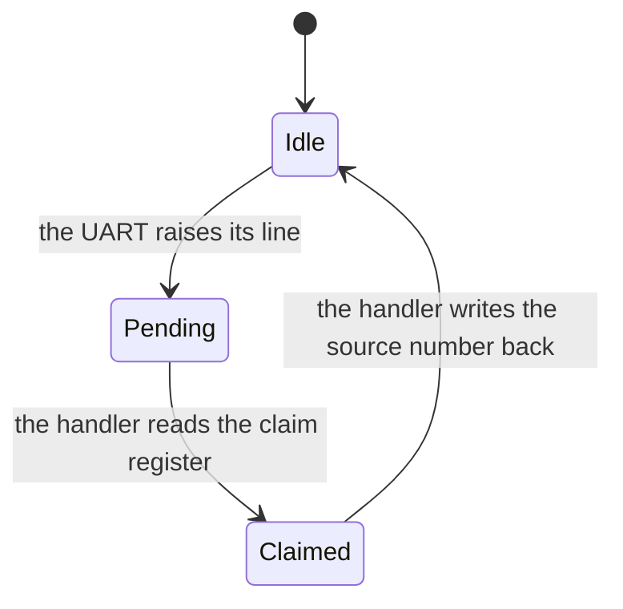
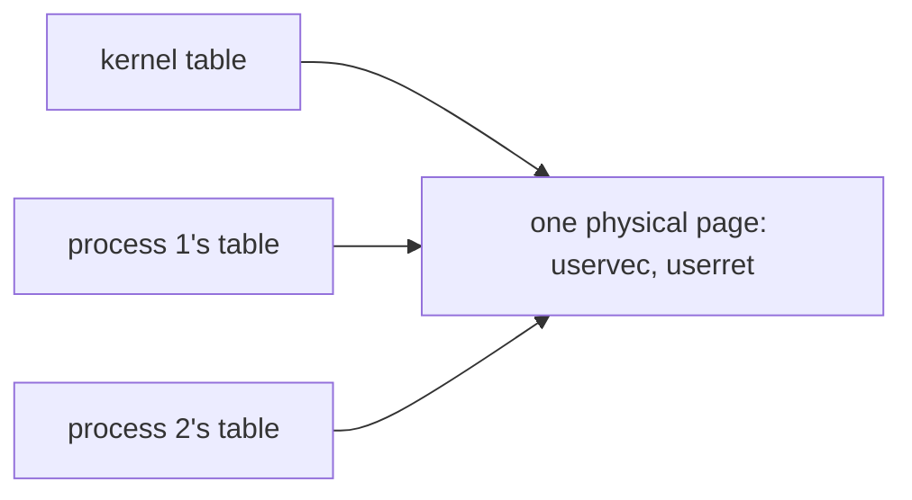
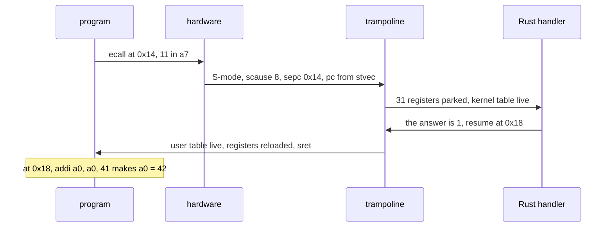

# Week 12 · The Console, the Shell, and User Mode

> **Thu Nov 12** `45k_console`, `46k_shell`, extra credit `47k_file_commands` · **Fri Nov 13** `48k_user_mode`
>
> Read **Essentials** before Tuesday: it is what Thursday and Friday assume.
> **Going deeper** is optional and is not on the exam.

[Slides](12-cs326-2026-11-10-console-shell-and-user-mode-slides.html){ .md-button }
[Thursday prep](../prep/12-cs326-2026-11-12-prep-console-and-shell.md){ .md-button }
[Friday prep](../prep/12-cs326-2026-11-13-prep-user-mode.md){ .md-button }

## This week { #this-week }

In `52k` the shell leaves the kernel and becomes an ordinary program: it reads
your keys through the console, and every request it makes crosses a wall into
the kernel. This week builds the console, the shell, and the wall.

On Thursday the kernel learns to hear a key, and you write the step that turns
a typed line into a command. On Friday rv6 runs its first program in user mode.
[Midterm 2](../assignments/midterm-2.md), Thursday Nov 19, covers `34k` through
`48k`; Practice Set 2 comes out Tue Nov 10, and Nov 17 is the review.

By Friday night rv6 boots to an `rv6$` prompt, and `run` starts a user program
that prints, asks for its pid, and exits with status 42.

---

## Essentials { #essentials }

### Thursday · `45k` The console { #thu-45k }

From `46k` on, every exercise ends at a prompt you type into.
`45k_console` lets the kernel hear a key without watching for one.

#### Interrupts, not polling { #45k-interrupts }

Until now, reading the UART has meant **polling**: check its status bit, and
if no byte waits, check again. A typist sends about ten bytes a second, and
polling spends the gaps asking. With **interrupt-driven** input the UART
announces each byte. Output stays polled: a byte leaves in microseconds.

A board has dozens of devices and a few harts, so a router sits between them:
the **PLIC**, the platform-level interrupt controller, decides which hart hears
which device. The UART is its **source** 10, and the PLIC's setup is given. The
interrupt arrives through week 11's trap path with `scause`
`0x8000_0000_0000_0009`: top bit set for an interrupt, cause 9, external.

#### Claim, service, complete { #45k-claim }

Every device handler makes three moves. **Claim**: ask the PLIC which source
fired; 0 means none, since a handler can run with nothing pending.
**Service**: make the device stop asking. **Complete**: write the source number
back, so the PLIC may deliver that source again.



A `Claimed` source delivers nothing more: skip the completion, and the first
key works while every later one vanishes, silently.

> **The one thing to get right:** the test says `[fail] the interrupt handler
> did not buffer the byte`, and live, the first key freezes the machine. The
> UART's line is **level-triggered**: it reports a state, "unread data", not
> an event. Complete while it still holds, and the PLIC hands you the same
> interrupt at once: an **interrupt storm**.

#### A ring between two worlds { #45k-ring }

The handler runs with interrupts off, so it only moves bytes into a buffer. The
code that wants input takes them later, at normal priority. The xv6 book calls
the reader the **top half** and the handler the **bottom half**.

The buffer is a **ring**, given: a fixed array plus two counters that only
grow, taken modulo the length. The handler, the only **producer**,
stores a byte, then advances `TAIL`; the reader, the only **consumer**, takes
one, then advances `HEAD`. Four slots here; rv6 has 256:

```text
                          slots 0 1 2 3   HEAD  TAIL
start                           . . . .    0     0
handler pushes e, c             e c . .    0     2
reader takes e                  e c . .    1     2
handler pushes h, o, !          ! c h o    1     5    slot 4 % 4 = 0, reused
handler pushes ?                ! c h o    1     5    5 - 1 = 4, full: dropped
reader takes c, h, o, !         ! c h o    5     5    HEAD == TAIL: empty
```

Read `TAIL - HEAD` as "bytes waiting", which tells full from empty. A full
ring drops the newest byte, because a handler cannot wait.

No lock guards it. Each side writes only its own counter, and a stale read errs
safely: the reader waits, or a byte is dropped. A lock that leaves interrupts
on, as [rv6's does](10-cs326-2026-10-27-locks-semaphores-and-the-mmu-on.md#37k-interrupts),
would hang the kernel: the handler interrupts the reader that holds it, then
spins forever. A reader with nothing to read runs `wfi` until the next
interrupt.

### Thursday · `46k` The kernel shell { #thu-46k }

The shell is born inside the kernel and leaves it in `52k`. `46k_shell` writes
the step that turns a typed line into a command.

#### A loop, and words { #46k-repl }

A shell is a **REPL**: read a line, evaluate it, print, loop. The given read
loop draws everything you see while typing, the prompt, each key and each
erase, then passes on the whole line at Enter. That makes it the **line
discipline** too: the console echoes nothing.

Evaluating starts by cutting the line into words, since `mkdir   docs` means
`mkdir docs`. Splitting a `&str` allocates nothing, because each word is a view
into the line:

```rust
let mut line = String::from("tune  440");
let last = line.split_whitespace().last().unwrap();       // "440"
let at = last.as_ptr() as usize - line.as_ptr() as usize; // 6
```

Read `at` as "the word starts 6 bytes into the line": nothing was copied. So
while a word is in use, `line.clear()` draws "cannot borrow `line` as mutable
because it is also borrowed as immutable". A line of only spaces has no words.

#### One match, and `&mut dyn Out` { #46k-dispatch }

Choosing a handler by name is **dispatch**, and Rust's tool for it is one
`match` on a `&str`. The same shape, for tempo names:

```rust
fn bpm(word: &str) -> Option<u32> {
    match word {
        "largo" => Some(50),
        "presto" => Some(180),
        _ => None,
    }
}
```

Read `_` as "any other word". Without it, rustc refuses: "non-exhaustive
patterns: `&_` not covered".

The four handlers, `pwd`, `ls`, `cd` and `mkdir`, are given and print through
`&mut dyn Out`, the trait object of `07r_traits`: the console under
`cargo run`, a buffer under test.

> **The one thing to get right:** every test passes; then you press Enter at an
> empty prompt, and QEMU exits with `OSLINGS:FAIL (panic)`. A blank line has no
> first word, and a `None` unwrapped is a panic, which in a kernel stops the
> machine.

> **Extra credit · `47k`** `47k_file_commands` teaches the shell `touch`, `cat`
> and `rm`, with `echo TEXT > FILE` and `rmdir` given as models. The idea: the
> `40k` filesystem reports facts, such as "no such name" or "already exists",
> and each command decides which facts are errors. Unix `rm` calls a missing
> name an error; `rm -f` calls the same fact success.
> { #ec-47k }

### Friday · `48k` User mode { #fri-48k }

From `49k` on, rv6 runs code it did not write and cannot trust.
`48k_user_mode` runs the first program behind a wall.

#### Why a wall, and what user mode may not do { #48k-wall }

The wall is two mechanisms you know, each closing the other's gap:

| Mechanism | What it restricts | Met in |
|---|---|---|
| Privilege levels | which instructions run | `43k` |
| Page tables | which addresses exist | `33k`, `39k` |

Neither suffices alone. Without paging, a plain `ld` reads the kernel;
without privilege, a program writes `satp` and brings its own table.

**User mode** (U) is the weakest level. There, touching a supervisor CSR, even
to read it, or running `sret` is an illegal instruction, `scause` 2; touching a
page without `PTE_U` is a page fault. rv6 answers either by ending the program,
and the kernel runs on.

Getting down is `43k`'s trick one level lower: `sret` goes to the mode
`sstatus.SPP` (bit 8) names, and 0 is U. Only a trap climbs back, through the
`stvec` the kernel set: an `ecall` the program asks for, or an interrupt or
fault it does not. For an `ecall` the program chooses when; for every trap
the kernel chooses where.

#### A private address space { #48k-address-space }

On Friday a process's own table goes into `satp` for the first time. Everything
it maps:

```text
page at         holds                           PTE_U  reached by
0x0000_0000     the program's code              set    the program
0x0000_1000     its stack; sp starts at 0x2000  set    the program
     ...        nothing mapped
0x3F_FFFF_E000  the trapframe                   clear  the kernel, mid-trap
0x3F_FFFF_F000  the trampoline                  clear  the kernel, both ways
```

Address 0 is just another page here: null is only a convention.

`PTE_U` is the wall. The two top pages lack it, so they are mapped yet out of
reach, and [W⊕X](07-cs326-2026-10-06-boot-physical-pages-and-sv39.md#exam-wx)
binds the program's pages as it binds the kernel's. The check also runs the
other way: rv6's kernel may not touch a U page, so it can never follow a user
pointer by accident.

#### The trapframe, and why not the user's stack { #48k-trapframe }

After an `ecall`, all 31 registers still hold the program's values, and it
expects them back, save the `a0` a call answers in. The kernel cannot push
them: `sp` is the program's choice, and pushing through it writes wherever the
program says.

Instead each process gets a **trapframe**, a page with a slot for every
register, after five that are not. Three are notes for the trip in, left each
time the kernel sends the process out: the kernel's `satp`, the top of this
process's **kernel stack**, and which Rust function takes over. The fourth
keeps the program's pc, copied from `sepc` at each trap and back before `sret`;
the fifth is unused.

`#[repr(C)]` fixes the offsets the assembly uses: `a0` at 112, `a7` at 168. A
[`35k` context](09-cs326-2026-10-13-processes-context-switch-and-scheduling.md#35k-context)
needs only 14 registers, since a call fills it; a trap lands anywhere.

#### The trampoline { #48k-trampoline }

Entering the kernel means putting the kernel's table in `satp`. The pc does not
change when `satp` does, so the next fetch goes through the table just
installed. If that table maps the pc elsewhere, or nowhere, the CPU runs off a
cliff.

So both tables must agree about one page, the **trampoline**: it holds the
switching code at one virtual address, `TRAMPOLINE`, in the kernel's table and
every process's:



Whichever table is live, the next fetch finds the same bytes. The page lacks U,
so user code gets there only by a trap, and a trap raises the privilege level
first.

Both halves are given. `stvec` points at `uservec` while user code runs;
`uservec` runs on every way in and `userret` on every way out, the first exit
included.

#### The system-call ABI { #48k-abi }

Printing means storing to the UART's registers, which no user table maps. So a
program makes a **system call**: a function call across the wall, with its own
register convention, the **ABI**:

| Register | Before `ecall` | After |
|---|---|---|
| `a7` | the call's number | unchanged |
| `a0`, `a1`, `a2` | the arguments | `a0` holds the result |

`ecall` traps with `scause` 8. Until the `sret`, the program's registers live
only in its trapframe, parked by `uservec` and reloaded by `userret`. rv6 uses
xv6's numbers: `exit` 2, `getpid` 11, `write` 16. The number comes from
untrusted code, so none may crash the kernel: "no such call" answers -1.

#### Done versus retry { #48k-retry }

A trap leaves the pc of the instruction that caused it in `sepc`, and `sret`
returns there. For an interrupt that is right, since that instruction never
ran. For a page fault it is right when the kernel can map the page, so the load
runs again; rv6 maps nothing on demand, so it ends the program instead.

For `ecall` it is wrong: the work is done, and an `sret` to the same spot asks
for it again, and again. So the kernel moves the saved pc past a completed
`ecall`, by 4: `ecall` has no compressed form. Step past a trap that did its
work; resume at one that reported a condition.

> **The one thing to get right:** the self-check says `the program ran, but its
> system calls were never answered`; under `cargo run`, `hello from user mode`
> appears once, and the `rv6$` prompt never returns. Each return landed on the
> same `ecall`: the finished `write` ran again with `a0` holding 21, its own
> result, not fd 1, so it printed nothing, again and again.

#### One program, end to end { #48k-round-trip }

Until `49k` brings a loader, the first program is a dozen hand-written
instructions, copied onto the code page. It makes three calls:

| Call | `a7` | Arguments | Comes back |
|---|---|---|---|
| `write` | 16 | 1, the message at `0x24`, 21 | 21, the bytes written |
| `getpid` | 11 | none | 1, the first pid |
| `exit` | 2 | the pid plus 41 | never |

The message's address, `0x24`, means something only in the program's table, so
the kernel never loads through it. The given `copyin` translates by hand, a
page at a time, asking `walkaddr`, and a page without U counts as no page: pass
the trapframe's address, and you get -1.

One `getpid` at the program's real addresses:



Read status 42 as a receipt for both crossings: the kernel's 1 came in, and
1 + 41 went back out as `exit`'s argument.

### For the exam { #exam }

*Not needed on Thursday or Friday. On Midterm 2.*

**The PLIC's four registers** · *Midterm 2.* Priority belongs to a source;
enable, threshold and claim belong to a **context**, one hart in one mode. rv6
uses context 1, hart 0 in S-mode. A source is delivered only if enabled and its
priority is strictly above the threshold. `PLIC` is `0x0c00_0000`:
{ #exam-plic }

```text
priority, source 10    PLIC + 4 × 10      0x0c00_0028   1; 0 means never
S-mode enable bits     PLIC + 0x2080      0x0c00_2080   bit 10: 0x400
S-mode threshold       PLIC + 0x20_1000   0x0c20_1000   0: accept priority 1 and up
claim / complete       PLIC + 0x20_1004   0x0c20_1004   read: which source; write: done
```

Claim and complete are one register: a read claims, and writing the same
number back completes.

**Two pages at the top** · *Midterm 2.* `TRAMPOLINE`, `0x3F_FFFF_F000`, is R X
without U, at the same virtual address in the kernel's table and every user
table, all onto one physical page. The fetch that fails without it is the one
right after the `satp` write. `TRAPFRAME`, one page lower, exists only in user
tables: R W without U, a different page per process.
{ #exam-top-pages }

**`sscratch`** · *Midterm 2.* At a trap from user mode, `uservec` needs a
register for the trapframe's address, and all 31 hold user values. While user
code runs, `sscratch` holds `TRAPFRAME`, and `uservec` opens with
`csrrw a0, sscratch, a0`: `a0` now points at the trapframe, and the user's `a0`
waits in the CSR. `userret` ends with the same swap before `sret`, restoring
`a0` and re-arming `sscratch` for the next trap.
{ #exam-sscratch }

---

## Going deeper { #deeper }

*Optional. Nothing here is needed on Thursday or Friday, and nothing here is on
the exam.*

### Polling by the numbers { #deeper-polling }

A typist at 90 words a minute sends a byte every 130 ms. A loop whose status
read takes 100 ns asks 1.3 million times per byte; an interrupt costs about a
microsecond. Output turns this around: at 115,200 baud a byte leaves in 87 µs,
and with a 16-byte FIFO the first status read nearly always succeeds. A
10 Gbit/s card can receive a frame every 67 ns, faster than one interrupt, so
Linux's NAPI takes one interrupt, then polls until the ring drains.

### Every gate between a key and your handler { #deeper-gates }

A key reaches the handler only through nine open gates, all given this week:

```text
1  UART          IER bit 0: interrupt when a byte arrives
2  PLIC          source 10's priority above 0
3  PLIC          source 10 enabled for context 1
4  PLIC          context 1's threshold below that priority
5  mideleg       bit 9, set in M-mode: external interrupts go to S-mode
6  sie           SEIE, bit 9: this hart takes external interrupts
7  sstatus       SIE: the global switch
8  stvec         aimed at the kernel's trap vector
9  page table    the PLIC's registers mapped, with the MMU on
```

Eight fail silently; an unmapped PLIC faults instead. If ticks count while keys
do nothing, 7 and 8 are open: suspect the console's setup, which opens 1–4
and 6.

### Who owns the backspace { #deeper-line-discipline }

Your terminal does not echo: it sends each byte and draws what comes back. Run
`stty -echo` in a Unix shell, and typing shows nothing, yet commands still run.
Unix keeps the line discipline in the kernel's tty layer, whose **canonical**
("cooked") mode echoes, erases, and returns from `read` at a newline; `vi`
switches to **raw** mode and does it all itself. xv6 edits in its console
interrupt handler. rv6's shell does the work, so Ctrl-C does nothing and an
arrow leaves stray characters ([Problem 2](#problem-2)).

### Built-in or program { #deeper-builtins }

A Unix shell runs most commands as programs: it forks, the child `exec`s the
program, and the parent waits. rv6's kernel shell can do neither, so every
command is a **built-in**. On Unix some must be: a child gets a *copy* of the
current directory, so a `cd` program would change only its own. xv6's `sh.c` handles `cd` before it forks: "Chdir must be called by the parent,
not the child."

### Why the call is `unlink` { #deeper-unlink }

*For `47k`.* A name lives in a directory and the file in its inode, so removing
a name is not destroying a file. POSIX has no `delete`: `unlink` removes one
entry, and the file goes only when no name and no open reference is left. What
rv6 risks by keeping no link count is Midterm 2 material: see
[Week 11's For the exam](11-cs326-2026-11-03-filesystems-boot-order-and-traps.md#exam-links).

### The trampoline, rediscovered { #deeper-kpti }

For decades Linux mapped itself, supervisor-only, into every address space,
so a system call changed privilege but not tables. In 2018 Meltdown showed that
speculation could read such pages just because they were mapped. The fix,
**KPTI**, unmaps the kernel from user tables and switches `CR3`, x86's `satp`,
on every entry, from code mapped in both; Linux 4.15 called it the entry
trampoline.

### Why `copyin` refuses what the kernel could reach { #deeper-deputy }

Pass `TRAPFRAME` as `write`'s buffer, and a naive translation succeeds, since
the page is mapped in the user's table: the copy leaks the kernel's notes. A
privileged program tricked into using its authority for a caller who lacks it
is a **confused deputy** (Norm Hardy, 1988), and `walkaddr`'s U check is the
cure. Hardware adds a second lock: while
`sstatus.SUM` (bit 18) is clear, as rv6 leaves it, supervisor accesses to U
pages fault. x86 calls this SMAP; ARM calls it PAN.

### Practice problems { #problems }

#### Problem 1: The PLIC for a second hart { #problem-1 }

On QEMU's `virt`, hart *i* owns PLIC context 2*i* in M-mode and 2*i* + 1 in
S-mode. Context *c*'s enable words start at `PLIC + 0x2000 + 0x80 × c`, 32
sources a word; its threshold is at `PLIC + 0x20_0000 + 0x1000 × c`, with
claim/complete 4 bytes above. `PLIC` is `0x0c00_0000`.

(a) Give hart 1's S-mode enable, threshold and claim/complete addresses.

(b) Which word and bit enable source 35 there, and where is its priority?

(c) Hart 1's threshold is 1 and source 35's priority is 1. Is it delivered?

(d) Does rv6's 4 MiB PLIC mapping cover all of these?

<details markdown="1">
<summary>Click to reveal solution</summary>

**(a)** Hart 1 in S-mode is context 2 × 1 + 1 = 3:

```text
enable      0x0c00_2000 + 0x80 × 3     = 0x0c00_2180
threshold   0x0c20_0000 + 0x1000 × 3   = 0x0c20_3000
claim       0x0c20_3000 + 4            = 0x0c20_3004
```

Context 1 gives rv6's own `0x0c00_2080`, `0x0c20_1000` and `0x0c20_1004`.

**(b)** Word 35 / 32 = 1, at `0x0c00_2184`; bit 35 % 32 = 3, value `0x8`.
Priority belongs to the source: `0x0c00_0000 + 4 × 35` = `0x0c00_008C`.

**(c)** No: delivery needs a priority strictly above the threshold.

**(d)** Yes, it runs to `0x0c3F_FFFF`; only rv6's context-1 constants change.

</details>

#### Problem 2: Predict the screen and the line { #problem-2 }

At the `rv6$ ` prompt someone types these bytes, in hex where unprintable:

```text
c  d  SP  x  7F  d  c  1B  [  D  o  09  0D
```

`7F` is Backspace, `1B [ D` the Left arrow, `09` Tab, `0D` Enter. With the
given read loop: (a) which bytes does the shell echo? (b) What line reaches the
evaluate step, and what words? (c) The typist pressed Left to slip the `o` in
between `d` and `c`. Why did that fail?

<details markdown="1">
<summary>Click to reveal solution</summary>

**(a)** `c d SP x`, then `08 20 08` for the Backspace: back, blank, back. Then
`d c`. `1B` is unprintable, so it is dropped unechoed, but `[` and `D` echo
like letters; then `o`. Tab is dropped. Enter echoes `\n`. The screen shows
`rv6$ cd dc[Do`.

**(b)** `"cd dc[Do"`, two words: `cd` and `dc[Do`.

**(c)** This line discipline has no cursor: it appends and erases at the end
only. An arrow is a three-byte escape sequence, and a loop that knows nothing
of escapes drops the `ESC` and keeps its printable followers.

</details>

#### Problem 3: The two top pages { #problem-3 }

`TRAMPOLINE` is `MAXVA - PGSIZE`, with `MAXVA` = `1 << 38`; `TRAPFRAME` is one
page below.

(a) Give both addresses and their VPN[2], VPN[1], VPN[0].

(b) Encode the trampoline's leaf PTE, R X V, for physical page `0x87FF_D000`.

(c) How many level-0 tables of one user table hold both entries, and how does
the kernel's table differ?

(d) Why may neither leaf carry U?

<details markdown="1">
<summary>Click to reveal solution</summary>

**(a)** `MAXVA >> 30` is 256, so the page just below has VPN[2] 255, and each
lower index is all ones, 511:

```text
TRAMPOLINE   0x40_0000_0000 - 0x1000 = 0x3F_FFFF_F000    VPN 255, 511, 511
TRAPFRAME    one page lower          = 0x3F_FFFF_E000    VPN 255, 511, 510
```

**(b)** R + X + V = 2 + 8 + 1 = `0xB`:

```text
pa >> 12     0x8_7FFD
<< 10        0x21FF_F400
| 0xB        0x21FF_F40B
```

**(c)** One: equal VPN[2] and VPN[1] lead to one level-0 table, entries 511
and 510 side by side. The kernel's table has the same entry 511 and no 510; the
kernel reaches each trapframe at its physical address.

**(d)** With U on the trapframe, a program could rewrite the kernel's notes,
and its next trap would run S-mode code of its choosing. U would also break the
kernel's own path: S-mode never executes a U page, and with `sstatus.SUM` clear
it cannot load or store one, so `uservec` would fault at once.

</details>

#### Problem 4: Where does the program resume? { #problem-4 }

A program of your own:

```text
0x40:  li    a7, 11        2 bytes, compressed
0x42:  ecall               4 bytes
0x46:  ld    t0, 0(a0)     4 bytes
0x4a:  csrr  t1, sstatus   4 bytes
```

Give `scause`, `sepc` and the resume address when: (a) the `ecall` completes a
`getpid`; (b) the `ld` touches an unmapped page, which a demand-paging kernel
then maps; (c) rv6's timer tick arrives just before the `ld`; (d) the `csrr`
runs. (e) A kernel adds 4 to the saved pc after every trap. What changes?

<details markdown="1">
<summary>Click to reveal solution</summary>

| | `scause` | `sepc` | Resumes at |
|---|---|---|---|
| (a) | `8`, ecall from U-mode | `0x42` | `0x46`: the call is done |
| (b) | `13`, load page fault | `0x46` | `0x46`: the load runs again |
| (c) | `0x8000_0000_0000_0001`, the forwarded tick | `0x46` | `0x46`: the `ld` never ran |
| (d) | `2`, illegal instruction | `0x4a` | nowhere: rv6 ends the program |

**(e)** (a) and (d) stay the same. (b) skips the load, so `t0` is stale and
the program runs on with wrong data. (c) is worse: an unrelated interrupt
deletes one of its instructions at a random moment.

</details>

---

## Key terms { #terms }

| Term | Meaning | Where you use it |
|---|---|---|
| PLIC | Routes device interrupts to a hart; the UART is source 10 | `45k`, Midterm 2 |
| Interrupt storm | A level-triggered line that re-fires while its cause remains | `45k` |
| Ring buffer | An array and two growing counters; one producer, one consumer | `45k`, `46k` |
| REPL | Read, evaluate, print, loop: the shape of every shell | `46k`, `52k` |
| Line discipline | Echo, erase and end of line: bytes into lines | `46k`, `52k` |
| User mode | The weakest privilege level; it reaches the kernel only by a trap | `48k` onward |
| `PTE_U` | The PTE bit that lets user mode touch a page | `48k`, `49k` |
| Trapframe | The page where a user trap parks 31 registers | `48k`, `51k` |
| Trampoline | One page at the same virtual address in every table | `48k`, Midterm 2 |
| System-call ABI | Number in `a7`, arguments in `a0`–`a2`, result in `a0` | `48k`–`52k` |

## Further reading { #reading }

- [rv6 Architecture: Path 2, a device interrupt](../guides/rv6-architecture.md#path-2-an-s-mode-device-interrupt),
  [Path 3, the syscall round trip](../guides/rv6-architecture.md#path-3-the-user-syscall-round-trip),
  [Two shells](../guides/rv6-architecture.md#two-shells) and
  [the system call table](../guides/rv6-architecture.md#the-system-call-table).
  Its user address space is the finished kernel's, from `49k` on.
- [Sv39 Paging: the trampoline](../guides/sv39-paging.md#5-the-trampoline-0x3f_ffff_f000)
  and the [Cheatsheet](../guides/cheatsheet.md#plic-device-interrupt-routing).
- [Practice Set 2](../assignments/practice-set-02.md), Parts D and E, and
  [Exam Prep](../guides/exam-prep.md).
- Week 7's [top pages](07-cs326-2026-10-06-boot-physical-pages-and-sv39.md#exam-maxva).
- [The xv6 book](https://pdos.csail.mit.edu/6.828/2023/xv6/book-riscv-rev3.pdf),
  chapters 4 and 5: traps, system calls, and device drivers.
- [*Operating Systems: Three Easy Pieces*](https://pages.cs.wisc.edu/~remzi/OSTEP/),
  chapters 6 and 36: limited direct execution, and I/O devices.
- The RISC-V privileged manual on `sstatus`, `sscratch` and `stvec`, and the
  RISC-V PLIC specification.
