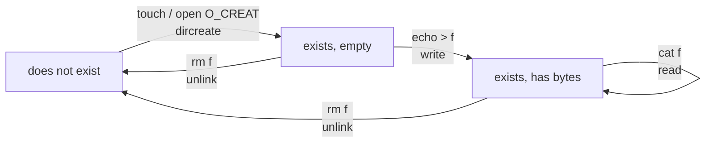
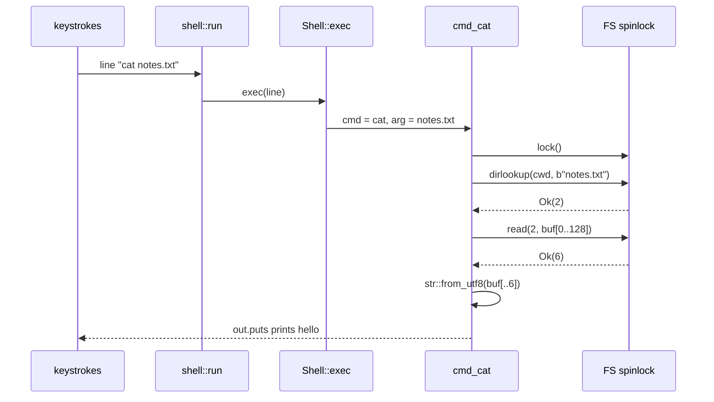

# File Commands over a Filesystem API

## Overview

Last session gave rv6 a shell that moves around a namespace: `pwd`, `ls`, `cd`,
`mkdir`. Today it learns to work on the things inside it. Creation, writing,
reading, and removal are the four verbs of the file life cycle, and in rv6 each
is three or four lines over the filesystem you wrote in exercise
`10_filesystem`. That thinness is the lesson: a good API makes its clients
boring. But the boring code hides four decisions that took Unix a decade to
settle, and those are the session — why removing a *name* is not the same as
removing a *file*, why `rmdir` refuses to recurse, what happens to a program
still reading a file whose last name just vanished, and why `.` and `..` are
entries on disk rather than syntax. We close with an inventory of what rv6's
in-memory filesystem does *not* do — no persistence, no journal, no buffer cache.
Concept behind exercise `17_file_commands`; see the
[rv6 Architecture guide](../guides/rv6-architecture.md).

## Learning Objectives

- **Decompose** `touch`, `cat`, `echo >`, `rm`, and `rmdir` into the exact
  sequence of filesystem calls each performs.
- **Distinguish** a name, a directory entry, an inode number, and an inode, and
  say which of the four each call consumes or produces.
- **Explain** why the POSIX call is `unlink` and not `delete`, and derive hard
  links from that naming.
- **Justify** rv6 freeing an inode inside `unlink`, and name the two counters a
  real kernel keeps instead.
- **Predict** what an open file descriptor sees after its directory entry is
  removed, in rv6 and in Linux.
- **Contrast** `>` truncation with `>>` append at the level of `open` flags, and
  explain why append must be atomic in the kernel.
- **Argue** why `rmdir` refuses a non-empty directory rather than recursing.
- **Enumerate** what a buffer cache, a journal, and a disk driver each add, and
  the failure each prevents.

## Prerequisites

- Exercise `10_filesystem` — inodes, directory entries, `dirlookup`,
  `dircreate`, `read`, `write`, and `Result`-based error handling.
- Exercise `16_shell` and L20 *Shells, and the Module 2 → 3 handoff* — the REPL,
  `exec` dispatch, and the current-directory stack.
- L17 *Filesystems, Devices, and the Boot Sequence* — where `FS` is initialized.
- [L06 Traits and the `ulib` Façade](03-cs326-2026-09-10-traits-generics-and-the-ulib-facade.md)
  — the `Out` trait these commands write through.
- Exercise `07_spinlocks` — every command here runs holding one lock, and where
  it is taken and dropped matters.
- The [ulib and Commands guide](../guides/ulib-and-commands.md) — your Module 1
  `cat` was this command against a different back end.

---

## 1. The Life Cycle of a File

Every file that has ever existed passed through the same four states, and Unix
gave each transition exactly one system call.



Notice what is *not* a state: "open". Opening changes nothing about the file; it
creates a per-process handle with a different lifetime. One of today's design
questions is what happens when those two lifetimes disagree.

Reading is a self-loop. `cat` is the only one of the five commands that cannot
change the filesystem, which is why its handler alone takes `&self` rather than
`&mut self` (`shell.rs:141`). Rust enforces a property of the *filesystem
semantics* through the type system, for free.

### Each command is a recipe, and each recipe is short

The whole of `cmd_touch`, minus its empty-argument guard
(`shell.rs:131`–`shell.rs:137`):

```rust
let dir = self.cwd();
let mut fsg = FS.lock();
match fsg.dircreate(dir, name.as_bytes(), InodeKind::File) {
    Ok(_) => {}
    Err(FsError::AlreadyExists) => {} // already there: fine
    Err(_) => out.puts("touch: cannot create file\n"),
}
```

Three lines of substance. `mkdir` is the identical call with `InodeKind::Dir`
(`shell.rs:119`); `rm` is a lookup, a type check, and an `unlink`
(`shell.rs:170`–`shell.rs:181`); `rmdir` adds two checks
(`shell.rs:192`–`shell.rs:207`).

When client code is this thin, the API underneath is carrying the design. An
API whose clients are full of loops and special cases has pushed its complexity
outward onto every caller, and there will be many callers. Judge a systems
interface by how boring its users look.

> Key distinction: `touch` treating `AlreadyExists` as success is *policy*, not
> mechanism. `dircreate` reports the fact; the command decides it is
> uninteresting. Real `touch(1)` also updates the modification timestamp, which
> rv6 inodes do not have (`fs.rs:49`–`fs.rs:55`).

---

## 2. Names Are Not Files

The most important idea in this lecture: rv6, like Unix, stores a file's
*identity* and its *name* in two different places.

```text
  directory inode 1  ("/")          inode table
                                    +------+------+------+--------------+
  +-----------------+------+        | inum | kind | size |   contents   |
  | name            | inum |        +------+------+------+--------------+
  +-----------------+------+        |  1   | Dir  |  -   | entries[16]  |
  | "notes.txt"     |  2   |------->|  2   | File |  6   | "hello\n"    |
  | "docs"          |  3   |------->|  3   | Dir  |  -   | entries[16]  |
  | (free slot)     |  -   |        |  4   | Free |  -   |              |
  | ... 16 slots    |      |        +------+------+------+--------------+
  +-----------------+------+

  the NAME lives here               EVERYTHING ELSE lives here
  (<= 14 bytes) + an inum           (kind, size, and the actual bytes)
```

The inode holds kind, size, and data (`fs.rs:49`–`fs.rs:55`); the name appears
nowhere in it. The name lives only in the `DirEnt` of the directory pointing at
it (`fs.rs:30`–`fs.rs:36`), and `dirlookup` converts one to the other by linear
scan (`fs.rs:113`–`fs.rs:118`). That separation buys three things:

1. **Renaming is cheap.** Changing a name touches sixteen bytes in one
   directory; the file's bytes never move. Hence `mv` within a filesystem is
   instantaneous, and across filesystems it is a copy.
2. **The same file can have several names.** Nothing says a given `inum` may
   appear in only one entry. Two entries pointing at inode 2 are two equally
   real names for one file — a **hard link**.
3. **Lookup is a directory's job.** A file does not know where it lives, so a
   directory can be reorganized without consulting its files.

### The 14-byte name is a fossil

`NAMELEN` is 14 (`fs.rs:7`), and that number is not arbitrary. Seventh Edition
Unix defined a directory entry as exactly sixteen bytes — a two-byte inode number
plus a fourteen-character name — so a directory was literally an array of 16-byte
records you could `read()` like any other file. xv6 keeps `DIRSIZ = 14` and rv6
inherits it. Real filesystems abandoned fixed-length entries in the 1980s: BSD's
FFS introduced variable-length entries, and ext4 and XFS use hashed B-trees so a
million-entry directory does not cost a million comparisons per lookup. rv6's
`dirlookup` is O(entries) with a 16-entry cap (`fs.rs:6`).

### `rm` is `unlink`, and the name is the whole argument

`cmd_rm` (`shell.rs:163`–`shell.rs:182`) calls `dirlookup` for an `inum`, uses
that `inum` only to ask `is_dir`, and then calls `unlink(dir, name)` — passing
the *name* again. `unlink` re-scans the directory for the same entry
(`fs.rs:194`–`fs.rs:201`).

Two scans where one would do is a small inefficiency, and a faithful model of the
real interface: POSIX has no call that removes a file by inode number, at any
privilege level. The namespace works only through names, because the name is
where permission to remove lives — you need write permission on the *directory*,
not on the file.

---

## 3. Why the Call Is Called `unlink`

There is no `delete` in POSIX. There is `unlink(2)`, and the name is a promise.

`unlink(path)` removes one directory entry — that is all it is defined to do. The
file is destroyed as a *consequence*, when and only when two independent counters
both reach zero:

| Counter | What it counts | Lives where |
|---|---|---|
| `nlink` | directory entries pointing at this inode | on disk, in the inode |
| ref / `i_count` | open file descriptors and in-kernel references | in memory only |

Storage is reclaimed when `nlink == 0` **and** the reference count is zero. xv6
implements exactly this: `sys_unlink` decrements `ip->nlink` and writes the inode
back; `iput` frees the data blocks only if `nlink == 0` with no references left.

### rv6 collapses both counters into "always one"

rv6's `unlink` does something much simpler (`fs.rs:190`–`fs.rs:203`):

```rust
if e.used && e.len == name.len() && &e.name[..e.len] == name {
    self.inodes[e.inum] = Inode::new(); // free the inode (kind = Free)
    self.inodes[dir].entries[i].used = false; // free the directory slot
    return Ok(());
}
```

It frees the inode unconditionally, in the same breath as the entry. With no
`nlink` field, rv6 assumes every inode has exactly one name and zero open
references — assumptions enforced only by the absence of the features that would
break them. There is no `link` command, and until exercise `20_file_descriptors`
nothing holds a reference to an inode across a command.

> Key distinction: by real-Unix standards rv6's `unlink` is misnamed — it does
> what `unlink` *plus* `iput` do together. The name matches the API you will meet
> later, not the current implementation.

### What hard links actually give you

Once names and files are separate, `link(old, new)` is two lines: add an entry
pointing at the existing inum, and increment `nlink`. The uses are unglamorous
and everywhere:

- **Atomic replace.** Before `rename(2)`, swapping a file atomically meant
  `link(tmp, target)` — which fails if `target` exists — then `unlink(tmp)`.
- **Deduplicated trees.** `cp -al` costs directory entries, not bytes; backup
  tools and package managers are built on this.

Directories are the exception: POSIX forbids hard links to directories (only the
kernel may create the `.` and `..` ones). The reason is graph-theoretic. If
directories could be multiply linked the namespace would become a cyclic graph —
`find` would loop forever, and reference counting could never reclaim a cycle.
Forbidding them keeps the directory structure a tree, with files as the only
shared nodes.

---

## 4. Reading and Writing: `cat`, `>`, and `>>`

### `cat` is lookup, read, decode, print



Three details repay attention.

**The buffer is the size of the largest possible file.** `cmd_cat` declares
`[0u8; fs::FILESIZE]` (`shell.rs:151`) — 128 bytes on the kernel stack, which
works only because `FILESIZE` is a compile-time cap (`fs.rs:8`). A real `cat`
loops on a fixed buffer until `read` returns zero: hence `read_at`, which returns
`Ok(0)` at end of file (`fs.rs:231`, `fs.rs:239`).

**`read` returns a count, and the count is the truth.** `n` is
`min(size, buf.len())` (`fs.rs:104`); the buffer's *length* tells you nothing.
Every buffer-overrun CVE in C I/O trusted the buffer instead of the count.

**Bytes are not text.** Turning `[u8]` into something printable requires
`core::str::from_utf8`, a `Result` because most byte sequences are not valid
UTF-8 (`shell.rs:154`). Unix filesystems store byte strings and impose no
encoding — which is why `cat` on a JPEG garbles your terminal rather than
erroring.

### `>` truncates, and it truncates *early*

`cmd_echo` (`shell.rs:212`–`shell.rs:249`) splits the line on `>`, finds or
creates the target, and calls `write`. Truncation is invisible because it is
built into `write` (`fs.rs:163`–`fs.rs:164`):

```rust
self.inodes[inum].data[..data.len()].copy_from_slice(data);
self.inodes[inum].size = data.len();
```

The new size *replaces* the old one, so whatever the file held beyond the new
length is unreachable: `read` is bounded by `size`. rv6's whole-file `write` is a
truncating write by construction.

On a real system the truncation is a separate, earlier event. `echo hi > f`
expands to `open("f", O_WRONLY|O_CREAT|O_TRUNC, 0666)`, and the shell performs
that `open` **before it forks the command** — the mechanism behind one of the
oldest Unix foot-guns:

```bash
sort file.txt > file.txt    # file.txt is now empty
```

The redirection truncated `file.txt` to zero length before `sort` ever opened it
for reading. No amount of cleverness in `sort` can recover the data, because it
was gone before `sort` started. `>>` — `O_APPEND` instead of `O_TRUNC` — is safe
here for the same reason it is safe everywhere.

### `>>` is not "seek to the end, then write"

rv6 has no `>>`, but it has the primitives you would build it from: `size(inum)`
(`fs.rs:223`) and `write_at` (`fs.rs:249`), which grows the file if the write
runs past the end (`fs.rs:259`–`fs.rs:261`). Append is
`write_at(inum, size(inum), text)`.

That is correct in rv6 only because a command holds the `FS` lock for its whole
duration, so nothing runs between the `size` and the `write_at`. It is *wrong* as
a general design. With two processes appending to one log:

```text
  A: off = size(f)   -> 100
  B: off = size(f)   -> 100
  B: write_at(f, 100, "line from B\n")
  A: write_at(f, 100, "line from A\n")     <-- B's line is overwritten
```

This is why `O_APPEND` is an *open flag* rather than a userspace idiom: the
kernel must compute the offset and perform the write as one indivisible
operation. Every process that has ever written to a shared log file depends on
that guarantee. It is also why `O_APPEND` over NFS is unreliable — atomicity has
to be enforced where the file lives, and NFS clients cannot do it.

---

## 5. Removal: `rmdir`, and the Open-File Problem

### `rmdir` refuses; it does not recurse

`cmd_rmdir` checks three things before calling `unlink`
(`shell.rs:192`–`shell.rs:207`): the name exists, the target is a directory, and
`dir_is_empty` (`fs.rs:207`). A non-empty directory gets
`rmdir: directory not empty`. `rmdir(2)` behaves identically, returning
`ENOTEMPTY`.

Students reliably ask why the kernel does not just recurse. Four answers:

1. **Atomicity has to mean something.** A system call either happens or does
   not. A recursive delete of ten thousand files cannot be atomic in any useful
   sense; `rmdir` on an empty directory removes one entry, and that *can* be.
2. **Recursion in the kernel is unbounded.** Depth is attacker-controlled and a
   kernel stack is one or two pages, so a recursive in-kernel delete is a stack
   overflow waiting for a malicious `mkdir -p a/a/a/.../a`.
3. **Mechanism, not policy.** Should recursive delete follow symlinks? Cross
   mount points? Stop at the first permission error, or prompt? Those are user
   decisions, and `rm -rf` answers them with flags — it is a *userspace* loop
   over `openat`/`readdir`/`unlinkat` with `AT_REMOVEDIR` for directories.
4. **It makes the destructive case explicit.** `rmdir` cannot destroy data you
   did not know about.

> Key distinction: `dir_is_empty` in rv6 means "no used entries at all"
> (`fs.rs:211`); in xv6 and Linux it means "no entries other than `.` and `..`",
> which is why xv6's `isdirempty` starts its scan at offset
> `2 * sizeof(struct dirent)`. Section 6 explains the difference.

### What happens to an open file whose name is removed

rv6 gets this one wrong on purpose, so you can see what the right answer costs.

In Linux, `unlink` on a file some process still has open removes the name
immediately — `ls` stops showing it, a new file may take the name — but the
*data stays alive* until the last descriptor closes. Three familiar consequences
fall out of that one rule:

- **The private temp-file idiom.** `open` a file, `unlink` it at once, keep the
  descriptor: storage no other process can name, reclaimed when you exit even on
  a crash. Linux later gave this a first-class form, `O_TMPFILE`.
- **`df` and `du` disagreeing.** A deleted-but-open log file consumes disk no
  path can reach. `du` walks names and sees nothing; `df` asks the allocator and
  sees gigabytes. `lsof +L1` lists exactly these.
- **Safe live upgrades.** Replacing a running binary's file is safe: the process
  keeps executing the old image, still referencing the old inode.

Now rv6. `unlink` sets `self.inodes[e.inum] = Inode::new()` (`fs.rs:197`),
marking the inode `Free`, and `alloc` takes the first free slot scanning up from
`ROOT` (`fs.rs:87`–`fs.rs:92`). Put those next to the file descriptor table
arriving in exercise `20_file_descriptors`, where a `File` stores a bare `inum`
and an offset:

```text
  fd 3 = File { inum: 5, off: 0 }        program has /log open

  shell: rm log        -> inodes[5] = Free      fd 3 now points at a free inode
  shell: touch other   -> alloc picks 5 again   fd 3 now points at SOMEONE ELSE

  program: read(3, buf) -> returns bytes of "other", silently
```

The first `read` after the `rm` returns `Err(NotFound)` (`fs.rs:100`), which is
survivable. The read after the *reallocation* is the real bug: it succeeds and
returns the wrong file's data with no error anywhere. That is what `nlink` plus a
reference count exists to prevent — and with permissions it would be a
privilege-escalation vector.

Fixing it in rv6 is about fifteen lines: add `refs: usize` to `Inode`, bump it on
open and drop it on close, and have `unlink` free the inode only when
`refs == 0`, otherwise marking it "pending free" so `alloc` skips it. That is
what every Unix has done since 1973.

---

## 6. `.` and `..` Are Entries, Not Syntax

rv6 handles `..` in the shell (`shell.rs:94`–`shell.rs:96`):

```rust
".." => { self.stack.pop(); }
```

The current directory is a `Vec<(String, usize)>` (`shell.rs:24`) and `cd ..`
pops it. There is no `..` anywhere in `fs.rs`: rv6's parent link exists only in
the shell's memory, and `cwd()` (`shell.rs:33`) reads the top of that stack.

Unix does the opposite. When `mkdir` creates a directory the kernel writes two
real entries into it: `.` pointing at the new directory's own inum, and `..`
pointing at the parent's. They are indistinguishable from any other entry —
`ls -ai` shows their inode numbers, they occupy slots, and a fresh directory
therefore has `nlink == 2` (its name in the parent plus its own `.`), while the
parent's `nlink` rises by one for the new `..`.

Why pay for real entries when a shell-side stack is free?

**Path resolution needs no special case.** Kernel name lookup is one loop: split
the path on `/`, and call `dirlookup` for each component. If `..` is an ordinary
entry that loop resolves `../../x` with no branch for it at all. Making `..`
syntax would require the parser to know the tree's shape — precisely the
knowledge it does not have.

**It works from anywhere.** `open("../config")` is meaningful inside a program
that never had a shell and has no idea where it is. rv6's approach works only
because the shell is the sole path walker.

**The root's `..` points at the root.** That makes `cd /../../..` terminate at
`/` with no special case, and it makes `chroot` work: inside a chroot the
confined root's `..` points at itself, so a confined process cannot walk out.

**Mount points need it.** With a filesystem mounted on `/mnt`, `..` from the
mounted root must lead back to `/`, which is a *different* filesystem with a
different inode table. Linux's VFS intercepts this in `follow_dotdot` — which
you can do to a lookup and cannot do to syntax.

> Key distinction: because `..` is a real link, `cd ..` is ambiguous when
> symlinks are involved. If `/a/b` is a symlink to `/x/y`, the *lexical* parent is
> `/a` and the *physical* parent is `/x`. Bash keeps a logical cwd string and
> defaults to lexical (`cd -L`); `cd -P` and every kernel call use physical. rv6
> has no symlinks, so its stack agrees with both.

---

## 7. What rv6's Filesystem Does Not Do

`FS` is a `SpinLock<FileSystem>` in static memory (`fs.rs:277`) holding 64 inodes
of 128 data bytes and 16 entries each (`fs.rs:5`–`fs.rs:9`), and every access is
an array index. Three whole subsystems are absent, and each absence is worth
naming.

```text
   Linux                    xv6                     rv6
   ----------------------   ---------------------   ---------------------
   syscalls                 syscalls                shell command handler
   VFS + dentry cache       namei / path walk       (shell's cwd stack)
   ext4 / xfs / btrfs       fs.c inodes+dirents     fs.rs inodes+dirents
   journal (jbd2)           log.c transactions      -- nothing --
   page cache               bio.c buffer cache      -- nothing --
   block layer + elevator   virtio_disk.c           -- nothing --
   the disk                 the disk                a static array in RAM
```

**No persistence.** Reset QEMU and every file is gone: the inode table is
`.bss`, and `init` zeroes all 64 inodes and marks `ROOT` a directory
(`fs.rs:79`–`fs.rs:84`). Persistence means adding the bottom three rows — a block
device driver, a superblock describing where the inode table and free bitmaps
live, and a serialization of `Inode` into fixed-size disk records. Note what
changes about the *interface*: nothing. That is the payoff of drawing the API
boundary in the right place.

**No buffer cache.** rv6 reads inode 2 by indexing an array — one load. On a
disk you must read the 1024-byte block containing inode 2, and doing that once
per lookup is fatal. A buffer cache holds recently used blocks in RAM; xv6's
`bio.c` keeps 30 on an LRU list with `bread`/`bwrite`/`brelse` and a sleep-lock
per buffer. Linux generalizes this into the page cache — why reading a file twice
is fast, and why `free` reports most of your RAM as "buff/cache". The cache is
also why `fsync(2)` exists: a successful `write` may exist only in RAM.

**No journal.** rv6's `unlink` performs two mutations — free the inode, clear the
entry (`fs.rs:197`–`fs.rs:198`) — and nothing can interrupt them, because they
are two stores under a spinlock on one hart. On a disk they are two *different
block writes*, and a power failure between them leaves the filesystem
inconsistent in one of two ways depending on the order chosen: entry gone but
inode still allocated (a leaked inode, invisible and unreclaimable), or inode
freed with the entry still pointing at it (a dangling entry that names whatever
is allocated next — corruption). Historically the answer was to pick the leak and
run `fsck` for an hour after every crash. A journal makes the pair atomic: log
the intended writes, commit the log record, then perform them; on reboot, replay
any committed record. xv6's `log.c` wraps every filesystem system call in
`begin_op`/`end_op`. ext4 offers three strengths — `journal` (data and metadata),
`ordered` (metadata, data forced out first; the default), and `writeback`
(metadata only, fastest, and capable of exposing stale blocks after a crash).

**Also missing:** permissions, timestamps, symbolic links, a path parser, files
larger than 128 bytes, and any concurrency finer than one global lock. Real
filesystems use per-inode locks because one lock serializes everything — and
`cmd_cat` holds `FS` across its `out.puts` (`shell.rs:143`, `shell.rs:156`), so
printing a file blocks the whole filesystem for the length of a UART transfer.

---

## Key Concepts

| Concept | Definition | Example |
|---|---|---|
| Inode | The record of one file or directory: kind, size, contents. Holds no name. | `fs.rs:49`–`fs.rs:55`; 64 per `FileSystem` |
| Inode number (`inum`) | Index into the inode table; the file's identity. | `dirlookup` returns one; `read` consumes one |
| Directory entry | A (name → inum) pair stored inside a directory inode. | `DirEnt { name, len, inum, used }`, `fs.rs:30` |
| Hard link | A second directory entry pointing at an existing inode. | `ln a b`; impossible in rv6, which has no `nlink` |
| `unlink` | Remove one entry; free the file only if nothing else refers to it. | `fs.rs:190`; rv6 always frees, Unix checks `nlink` |
| Link count (`nlink`) | Names pointing at an inode; stored in the inode, on disk. | A fresh directory has 2: its name and its `.` |
| Reference count | Open descriptors referring to an inode; in memory only. | Keeps a deleted-but-open file's data alive |
| Truncating write | A write that sets size to exactly the bytes written. | `fs.rs:164`; `>` redirection, `O_TRUNC` |
| Append | A write at the current end, computed atomically by the kernel. | `>>`, `O_APPEND`; `write_at(i, size(i), ..)` |
| `dir_is_empty` | No entries at all in rv6; none besides `.` and `..` in Unix. | `fs.rs:207`; xv6's `isdirempty` skips two |
| Buffer cache | In-RAM copies of recent disk blocks, so a lookup is not a disk read. | xv6 `bio.c` (30 buffers); Linux page cache |
| Journal | An on-disk log making a multi-block update atomic across a crash. | xv6 `log.c`; ext4 `data=ordered` |

---

## Practice Problems

### Problem 1: Order the calls

A user types these five lines in a fresh kernel:

```text
touch a
echo hi > a
touch a
cat a
rm a
```

List every `FileSystem` method each line invokes, in order, and give inode 2's
final state. Then say what changes if line 3 is `echo > a` instead.

<details>
<summary>Click to reveal solution</summary>

```text
touch a       dircreate(1, "a", File)         -> Ok(2)     inode 2: File, size 0
echo hi > a   dirlookup(1, "a")               -> Ok(2)
              write(2, "hi\n")                -> Ok(3)     inode 2: size 3, "hi\n"
touch a       dircreate(1, "a", File)         -> Err(AlreadyExists)
                (dircreate calls dirlookup internally first, fs.rs:126)
              handler swallows the error (shell.rs:135)     no change
cat a         dirlookup(1, "a")               -> Ok(2)
              read(2, &mut buf)               -> Ok(3)      prints "hi\n"
rm a          dirlookup(1, "a")               -> Ok(2)
              is_dir(2)                       -> false
              unlink(1, "a")   (rescans)      -> Ok(())     inode 2: Free
```

Final state of inode 2: `Free`, size 0, data zeroed (`unlink` assigns a fresh
`Inode::new()`, `fs.rs:197`).

With `echo > a` on line 3, `cmd_echo` gets an empty text half and writes a single
newline (`shell.rs:228`–`shell.rs:229`), so size becomes 1 and `cat a` prints a
blank line. `touch` never modifies contents; `echo >` always does.

</details>

### Problem 2: The reallocation hazard

rv6 has just booted. Trace the inode numbers through this sequence.

```text
mkdir docs
touch docs/notes    # assume it lands inside docs
touch scratch
rm scratch
mkdir tmp
```

Which inum does `tmp` get, and why? Now suppose a program held
`File { inum: <scratch's inum>, off: 0 }` across the last two lines. What does
`read` return after each?

<details>
<summary>Click to reveal solution</summary>

`init` marks `ROOT` (inode 1) a directory and leaves the rest `Free`
(`fs.rs:79`–`fs.rs:84`). Inode 0 is never allocated: `alloc` starts its scan at
`ROOT` (`fs.rs:87`), and inode 1 is already taken.

```text
mkdir docs        alloc -> 2
touch docs/notes  alloc -> 3
touch scratch     alloc -> 4
rm scratch        inodes[4] = Free
mkdir tmp         alloc scans 1,2,3 (taken), finds 4 free  -> tmp is inode 4
```

`tmp` gets **inum 4** — the number `scratch` just gave up. `alloc` is first-fit
from the bottom, so freed numbers are reused immediately.

The descriptor holding `inum: 4`:

- **After `rm scratch`**, `read(4, ..)` hits `InodeKind::Free` and returns
  `Err(FsError::NotFound)` (`fs.rs:100`). Detectable, survivable.
- **After `mkdir tmp`**, inode 4 is a `Dir`, so `read` returns
  `Err(FsError::IsADirectory)` (`fs.rs:101`) — still an error, by luck. Make that
  line `touch other` and the read **succeeds**, returning `other`'s bytes with no
  error at all.

That silent case is the whole argument for reference counts: Linux would have
decremented `nlink` to 0, seen a nonzero open count, and deferred freeing the
inode, so inum 4 could not be reallocated while the descriptor lived.

</details>

### Problem 3: Predict the exact output

Given a fresh rv6, predict every line the shell prints, in order. Errors count.

```text
mkdir box
cd box
touch item
cd ..
rmdir box
rm box
cat box
ls
```

<details>
<summary>Click to reveal solution</summary>

```text
rmdir: directory not empty
rm: is a directory
cat: is a directory
box/
```

Line by line:

Lines 1–4 are silent: handlers print only on error
(`shell.rs:119`–`shell.rs:121`), and `cd` merely pushes and pops the stack.

5. `rmdir box` — `dirlookup` succeeds and `is_dir` is true, but `dir_is_empty` is
   false because `item` occupies an entry (`shell.rs:204`).
6. `rm box` — `is_dir(inum)` is true, so `rm` refuses directories
   (`shell.rs:178`).
7. `cat box` — `read` returns `Err(FsError::IsADirectory)` (`fs.rs:101`), caught
   by the handler's catch-all arm (`shell.rs:158`).
8. `ls` — `for_each_entry` prints `box` plus a `/` because its kind is `Dir`
   (`shell.rs:84`–`shell.rs:86`). `item` never appears: `ls` lists only the
   current directory, and we are back at the root.

</details>

### Problem 4: Stale bytes

The offset-based API from exercise `20_file_descriptors` adds `truncate`
(`fs.rs:266`) and `write_at` (`fs.rs:249`). For a file at inode 2:

```rust
fsg.write(2, b"secret\n")?;   // size = 7
fsg.truncate(2)?;             // size = 0
fsg.write_at(2, 4, b"ok")?;   // size = ?
let n = fsg.read(2, &mut buf)?;
```

What is in `buf[..n]`? Explain what the filesystem did wrong, and name the
real-world class of bug.

<details>
<summary>Click to reveal solution</summary>

`buf[..6]` is `b"secrok"`, and `n == 6`.

- `write` copies `"secret\n"` into `data[0..7]`, `size = 7`
  (`fs.rs:163`–`fs.rs:164`).
- `truncate` sets `size = 0` and **nothing else** (`fs.rs:272`); the bytes are
  still in `data`.
- `write_at(2, 4, b"ok")` copies into `data[4..6]` and, because `4 + 2 > 0`, sets
  `size = 6` (`fs.rs:258`–`fs.rs:261`). It never touches `data[0..4]`.
- `read` returns `min(size, buf.len()) = 6` bytes: old `"secr"` plus `"ok"`.

A file was extended over a region that was never written, and that region
exposed previously stored data. Real filesystems must make such a **hole** read
as zeros — that is the definition of a sparse file — and must never expose the
prior contents of freshly allocated blocks. The class of bug is
**uninitialized-data disclosure**, historically a serious kernel vulnerability:
allocate a block, extend a file over it, read back another user's deleted data.
The rv6 fix is two lines — zero `data[..old_size]` in `truncate`, or zero
`data[size..off]` in `write_at` when `off > size`.

</details>

### Problem 5: Where the lock is held

`cmd_cat` takes the `FS` lock at `shell.rs:143` and holds it until the handler
returns — including across `out.puts` at `shell.rs:155`, which for the
interactive shell reaches `uart::puts`.

(a) What change to rv6 turns this into a deadlock?
(b) What change turns it into a correctness bug even without a deadlock?
(c) Why does `cmd_cd` call `drop(fsg)` before pushing onto the stack
(`shell.rs:102`)?

<details>
<summary>Click to reveal solution</summary>

**(a) Deadlock.** Any path from `uart::puts` back into `FS` closes the cycle:
the UART write blocks on a transmit interrupt whose handler — same hart, spinlock
held — touches `FS`; or console output is redirected to a file, so `puts` becomes
a filesystem write. A spinlock is not reentrant, so the second `FS.lock()` spins
forever. The rule: **never call out of your subsystem while holding its lock.**

**(b) Correctness without deadlock.** With more than one runnable process,
holding a global lock across a slow device transfer serializes every filesystem
operation behind one `cat` — a latency bug. The *correctness* bug appears if the
lock is dropped mid-command: `cmd_rm` would then have a TOCTOU window between
`dirlookup` and `unlink` in which another process could remove and recreate the
name, so `rm` would unlink a different file than the one it type-checked. Today
the guard spans both (`shell.rs:169`–`shell.rs:181`).

**(c) `cmd_cd`.** `push` may allocate, and the kernel heap has its own lock.
Taking the heap lock while holding the filesystem lock establishes an ordering;
any path taking them in the opposite order is a classic lock-order inversion.
Dropping `fsg` first removes the possibility.

</details>

### Problem 6: Design `>>`

Add append redirection to rv6's `echo`. Give (a) the exact `FileSystem` calls,
in order, for `echo more >> log` where `log` holds `"first\n"`; (b) what happens
if `log` does not exist; and (c) in one sentence, why your implementation would
be unsafe if rv6 ran shell commands concurrently.

<details>
<summary>Click to reveal solution</summary>

**(a)** Match `>>` *before* `>` — otherwise `split_once('>')` matches the first
`>` of `>>` and leaves a stray `>` on the front of the filename. Then:

```rust
let inum = match fsg.dirlookup(dir, file.as_bytes()) {
    Ok(i) => i,
    Err(_) => fsg.dircreate(dir, file.as_bytes(), InodeKind::File)?,
};
let off = fsg.size(inum);                    // fs.rs:223  -> 6
fsg.write_at(inum, off, contents.as_bytes()) // fs.rs:249  -> writes at 6
```

`write_at` copies into `data[6..11]` and sets `size = 11` because
`6 + 5 > 6` (`fs.rs:259`). `cat log` then prints `first\nmore\n`.

**(b)** Identically to `>`: create it. `>>` on a missing file must succeed with
an empty starting file — `O_WRONLY | O_CREAT | O_APPEND`, no `O_TRUNC`. That flag
is the only syscall-level difference between `>` and `>>`.

**(c)** Because `size` and `write_at` are two calls, two concurrent appenders can
read the same offset and the second write overwrites the first; append must be a
single atomic kernel operation, which is why POSIX makes it an `open` flag rather
than something userspace assembles.

</details>

---

## Further Reading

- [rv6 Architecture](../guides/rv6-architecture.md) — where `fs.rs` sits relative
  to the shell, the console, and the process table.
- [ulib and Commands](../guides/ulib-and-commands.md) — your Module 1 `cat` and
  `echo`, which will be re-targeted onto this filesystem in exercise
  `22_userland`.
- [Rust for Systems](../guides/rust-for-systems.md) — `Result`, `match`, `?`, and
  why `&self` versus `&mut self` on a handler is a semantic claim.
- Exercise `10_filesystem` and `20_file_descriptors` READMEs.
- Ritchie and Thompson, *The UNIX Time-Sharing System*, CACM 1974 — section 3
  introduces the name/inode split and "link" in its original sense.
- xv6 book, chapter 8 (*File system*) — read `fs.c` (`dirlink`, `isdirempty`,
  `sys_unlink`), `bio.c`, and `log.c` beside `fs.rs` to see which 900 lines rv6
  leaves out.
- `man 2 unlink`, `man 2 rmdir`, `man 2 open` — the ERRORS sections *are* the
  specification.
- McKusick et al., *A Fast File System for UNIX*, 1984 — variable-length
  directory entries and the end of the 14-character name.

---

## Summary

1. **The file life cycle is four verbs, each one filesystem call.** `dircreate`
   makes a file, `write` fills it, `read` empties it into a buffer, `unlink`
   removes its name. Every command in exercise `17_file_commands` is a
   two-to-four line composition of those.

2. **Thin clients mean a good API.** `cmd_touch` is three lines. If your handlers
   were full of loops and retries, the design error would be in `fs.rs`.

3. **Names and files live in different places.** The inode holds kind, size, and
   bytes; the directory entry holds the name and an inum (`fs.rs:30`,
   `fs.rs:49`). Cheap renames and multiple names both follow from that split.

4. **`unlink` removes a name, not a file.** A real kernel destroys the file only
   when `nlink` and the open-reference count both hit zero. rv6 collapses both
   into "always one" and frees the inode immediately (`fs.rs:197`) — which is why
   it can have no hard links, and why a stale `inum` in a descriptor can silently
   name a different file after reallocation.

5. **`>` truncates and `>>` appends; the difference is one `open` flag.**
   Truncation happens at `open` time, before the command runs — hence `sort f > f`
   destroying `f`. Append must be atomic inside the kernel, or concurrent writers
   overwrite each other.

6. **`rmdir` refuses rather than recurses** because a system call should be
   atomic, kernel recursion depth is attacker-controlled, and what recursion
   should do about symlinks and mount points is policy. `rm -rf` is a userspace
   loop over the same two primitives.

7. **`.` and `..` are ordinary entries in Unix, and syntax in rv6.** Real entries
   let one path-resolution loop handle `..` with no special case, make `chroot`
   and mount points work, and are why a fresh directory has `nlink == 2`. rv6's
   shell-side stack works only because the shell is the sole path walker.

8. **rv6's filesystem is missing three whole layers, deliberately.** No disk
   driver (nothing survives reset), no buffer cache (an inode lookup is an array
   index, not a block read), and no journal (a crash between `unlink`'s two
   stores would leave a leaked inode or a dangling entry). Adding all three
   changes the storage and none of the interface — the strongest evidence that
   the API boundary is in the right place.
