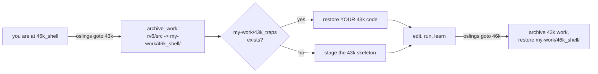
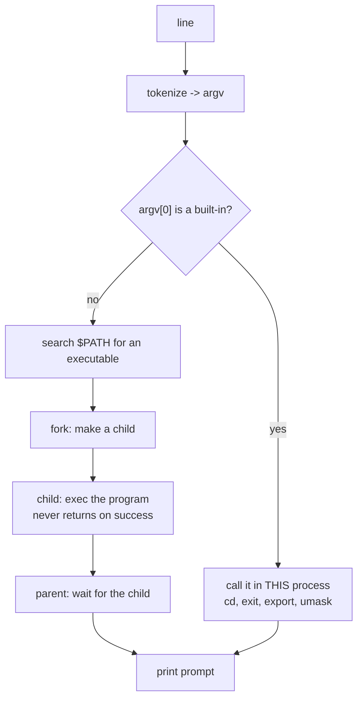
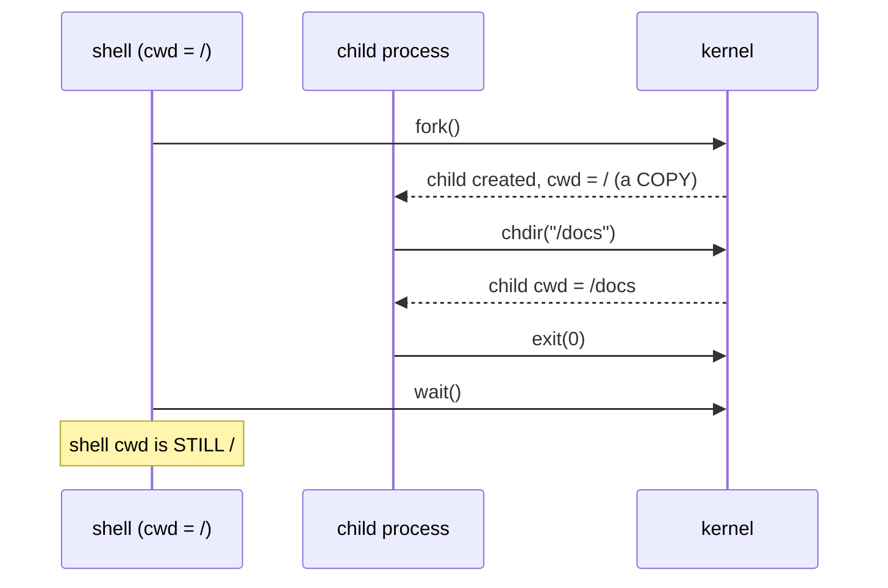

# Shells, and the Reference Kernel

## Overview

The first thing to say out loud is what is in your tree. The kernel you pulled
this morning is the **reference** kernel — boot, allocator, page tables,
processes, scheduler, locks, filesystem, traps, interrupts, console — all
present, all working, and not necessarily the code you typed. That is how
OSlings has staged every kernel exercise since `30k`: each one starts from the
reference version of everything before it, and your own code is archived and
one command away. What you build on top of that finished kernel is a **shell**: a loop that reads a
line, decides which command it names, runs it, prints, and repeats. That really
is all a shell is. We take the loop apart — where the bytes come from, how a
line becomes tokens without allocating, why dispatch belongs in a table, why the
current directory is *process* state and not shell state — and then name the
design smell we are deliberately shipping, and the exercise that fixes it. The
exercise is `46k_shell`, today (Thursday, November 12) right after `45k_console`;
`47k_file_commands`, released the same day, is extra credit. The map is the
[rv6 Architecture guide](../guides/rv6-architecture.md).

## Learning Objectives

- **Explain** the OSlings staging model and state exactly what is preserved when
  an exercise is left unfinished.
- **Distinguish** building a kernel from extending one, and describe what
  changes about how you read unfamiliar code.
- **Trace** a keystroke from the UART through the PLIC, the trap handler, and
  the console ring buffer to the shell's line buffer.
- **Describe** tokenization as producing borrowed views into a buffer, and
  contrast it with C's destructive `strtok`.
- **Justify** a dispatch table over a chain of `if`s, and predict what the
  compiler does with a `match` on `&str`.
- **Argue** from first principles why `cd` must be a shell built-in, using the
  `fork`/`exec` model and per-process cwd state.
- **Enumerate** the privileges rv6's kernel shell holds and name the exercises
  that take each one away.
- **Compare** the rv6 kernel shell, the rv6 user shell, xv6's `sh`, and bash on
  parsing power, privilege, and failure containment.

## Prerequisites

- Exercise `45k_console` (this session's first exercise) and L19 *Device Interrupts, the PLIC, and the Console* —
  interrupt-driven input and the byte ring buffer the shell reads from.
- Exercise `40k_filesystem` and L17 *Filesystems, Devices, and the Boot Sequence*
  — inodes, inode numbers, directory entries, `dirlookup`.
- Exercise `38k_semaphores` — the kernel heap, which is why `Vec` and `String`
  exist inside the kernel at all.
- Exercise `07r_traits` and L06 *Traits and the ulib façade* — trait objects and
  `&mut dyn Trait`, which is how the shell's output is redirected.
- The [Using OSlings guide](../guides/oslings-usage.md), sections on `my-work/`
  and `goto` — the mechanic described in section 1.
- The [rv6 Architecture guide](../guides/rv6-architecture.md), "Two shells" —
  the destination we are aiming at over the next six exercises.

---

## 1. The Reference Kernel

### 1.1 What is actually in your tree

Exercise `46k_shell` stages twenty files into `rv6/src`. Seventeen of them —
`entry.rs`, `start.rs`, `uart.rs`, `memlayout.rs`, `kalloc.rs`, `vm.rs`,
`param.rs`, `proc.rs`, `swtch.rs`, `sched.rs`, `spinlock.rs`, `semaphore.rs`,
`kheap.rs`, `trap.rs`, `plic.rs`, `console.rs`, `testdev.rs` — are
**byte-identical** to the exercise-15 reference solution. `fs.rs` is the
exercise-10 filesystem plus two helpers the shell needs, `is_dir` (`fs.rs:169`)
and `for_each_entry` (`fs.rs:175`). `main.rs` gains a test harness. `shell.rs`
is new, and it is the **only file in the exercise carrying an `IMPLEMENT`
marker**.

So: the kernel underneath your shell is the reference kernel. If your
`36k_scheduling` round-robin never went green, the scheduler in your tree today
is the one that does.

### 1.2 The mechanic, stated honestly

This is not a punishment and it is not a reset. It is how the course has worked
from the first exercise, in both directions:

- Every exercise's skeleton contains the reference version of everything before
  it: exercise 37k's has reference `36k` code, exercise 46k's has reference `45k`
  code. That is what keeps the sequence moving: every exercise starts from a
  kernel that works.
- Before *any* staging directory is overwritten, `archive_work` (`model.rs:712`)
  copies the whole directory, every file including scratch modules you added,
  into `my-work/<exercise>/`.
- On arrival, `stage_exercise` (`model.rs:740`) restores from `my-work/<target>/`
  when it exists and falls back to the skeleton only when it does not.

Which means `oslings goto 43k` drops you back into `43k_traps` with your own
half-finished trap handler exactly as you left it, and `oslings goto 46k` brings
you straight back here with today's work intact. Jump around freely; nothing you
typed is lost.



Two caveats. `my-work/<ex>/` is a **single snapshot per exercise**, overwritten
by the next archive of it — a resume point, not a history. And `oslings reset`
deliberately stages the pristine skeleton rather than your archive. Git is the
durable record: `oslings submit` at the end of every session, red or green.

### 1.3 From building to extending

Here is the part that actually changes today. Until now the job was: *this
subsystem does not exist; write it.* From here the job is: *this kernel exists;
add a capability to it without breaking anything.*

That is what almost all real kernel work is; nobody who lands a patch in Linux,
well past thirty million lines, wrote its scheduler. The skill being trained
from here is reading for **interfaces**, not implementations. Opening `fs.rs`
today, you are not asked how `dircreate` finds a free directory slot — you are
asked three questions:

1. **What does it promise?** `dirlookup(dir, name)` returns `Ok(inum)` or
   `Err(FsError)` (`fs.rs:109`).
2. **What does it require?** Names are raw bytes, so every call site ends in
   `.as_bytes()`; the filesystem lives behind one lock, `FS` (`fs.rs:277`).
3. **What invariant must I not break?** Do not hold that guard longer than the
   work needs, and do not call back into the filesystem while holding it.

> Key distinction: reading to *reimplement* means following every branch.
> Reading to *extend* means finding the smallest set of promises you can build
> on and refusing to depend on anything else. The second skill is the one that
> scales past a toy.

### 1.4 The rest of the map

| Exercise | What it adds | The wall |
|---|---|---|
| `46k_shell` | a REPL and four commands, in the kernel | none yet |
| `47k_file_commands` | `touch`, `cat`, `rm`, `rmdir`, `echo >` | none yet |
| `48k_user_mode` | U-mode, `PTE_U`, trampoline, trapframe, the first `ecall` | **built here** |
| `49k_exec` | loading a program image into a fresh address space, argv | behind it |
| `50k_file_descriptors` | a per-process fd table; `write(1, ...)` means something | behind it |
| `51k_fork_wait` | making a process and reaping it | behind it |
| `52k_userland` | the shell moves into user mode; your Module 1 commands ship | behind it |

Today's shell is on the wrong side of that wall. Section 6 is about why, and
about the fact that we are doing it on purpose.

---

## 2. A Shell Is a Loop

### 2.1 Four steps and nothing else

A shell is a **REPL**: read, evaluate, print, loop. rv6's is `run`
(`shell.rs:343`), about thirty lines:

```text
print "rv6$ "
loop {
    c = getc()                      # READ  (one byte, blocking)
    if c is Enter:
        exec(line)                  # EVALUATE + PRINT
        line.clear()
        print "rv6$ "               # LOOP
    else if c is Backspace: erase one character
    else if c is printable: line.push(c); echo it
    else: drop it
}
```

Note the signature: `pub fn run() -> !`. It never returns, because it is the
last thing `kmain` does (`main.rs:123`). On Unix an exiting login shell hands
control back to `init`; here there is no `init`, so leaving the loop would fall
off the end of the kernel. The type says so.

The word "shell" is Louis Pouzin's, from his early-1960s work on RUNCOM for
CTSS and then on the Multics command language: the replaceable outer layer
wrapped around the resident supervisor. Ken Thompson's shell in First Edition
Unix (1971) fit that loop into a few hundred lines and already had `<` and `>`;
pipes arrived in 1973 at Doug McIlroy's insistence; Stephen Bourne's shell
(Seventh Edition, 1979) added the grammar we still write; `csh`, `ksh`, `bash`
(1989), and `zsh` followed. Every one of them is still that loop. What differs
is only how hard the "evaluate" step works.

### 2.2 Where the bytes come from

`getc` (`console.rs:47`) is the entire read step, and underneath it are
exercises 41k, 43k, 44k, and 45k arriving at once.

```text
  you press 'k'
        |
        v
  +-----------+   raises IRQ 10   +--------+   S-mode external   +-----------+
  |  UART 16550| ---------------->|  PLIC  | ------------------->| kerneltrap|
  +-----------+                   +--------+   (scause = 9)      +-----------+
                                                                       |
                                        console::intr (console.rs:68)  |
                                        claim -> drain -> complete     v
                                                              +-----------------+
                                                              | ring buffer     |
                                                              | BUF[256]        |
                                                              | HEAD ... TAIL   |
                                                              +-----------------+
                                                                       ^
   shell::run  ->  console::getc (console.rs:47)                       |
                     loop { try_getc()? ; wfi }  --- pops one byte ----+
```

Three details that matter more than they look:

- **The interrupt handler does almost nothing.** `console::intr` claims the IRQ,
  drains the UART's bytes into the ring with `push` (`console.rs:18`), and
  completes. It does not tokenize, dispatch, or print. All the thinking happens
  in the shell, at normal priority, where it can be preempted — the top-half /
  bottom-half split every device driver uses.
- **The ring needs no lock.** One producer, one consumer, separate `HEAD` and
  `TAIL` counters (`console.rs:14`–`console.rs:15`). That argument is airtight on
  one hart and collapses on two, which is the kind of assumption you now have to
  notice when reading kernel code.
- **`wfi` is not a busy-wait.** When the buffer is empty the loop halts the CPU
  until an interrupt arrives (`console.rs:52`), so an idle prompt burns no
  cycles.

### 2.3 Line discipline: who owns the backspace?

Type `dox`, backspace, `cs`, Enter. Something must remember the partial line,
remove a character from it, make that character disappear from the screen, and
decide that Enter ends the line. That bundle has a name: the **line
discipline**.

On Unix it lives in the kernel's tty layer, in *canonical mode*: the driver
buffers a line, handles erase and kill, echoes, and returns from `read` only at
a newline. A program wanting raw keystrokes — `vi`, `less`, a game — clears
`ICANON` and `ECHO` through `termios` and owns all four jobs itself.

rv6 has no tty layer, so the shell *is* the line discipline (`shell.rs:349`–
`shell.rs:371`). Three consequences you can read straight off the code:

- **The shell echoes.** `console::getc` returns a byte and prints nothing; the
  echo is `out.puts` inside `run` (`shell.rs:366`). Which is why a password
  prompt is impossible today: nothing can ask for a byte without showing it.
- **Erasing takes three bytes.** `"\x08 \x08"` (`shell.rs:359`) — backspace,
  space, backspace. A terminal's backspace only moves the cursor left; you must
  overwrite the character with a space and move left again.
- **Anything not printable is silently dropped.** The filter is
  `c.is_ascii_graphic() || c == b' '` (`shell.rs:363`) with a catch-all `_ => {}`
  (`shell.rs:370`). Press Tab or Ctrl-C and nothing happens at all — no echo, no
  beep, no entry in the line.

---

## 3. Tokenizing a Line Without Allocating

### 3.1 Words, not characters

The evaluate step starts by cutting the line into words:

```rust
let mut words = line.split_whitespace();
let cmd = match words.next() {
    Some(c) => c,
    None => return,          // a blank line: do nothing
};
let arg = words.next().unwrap_or("");
```

That is `shell.rs:40`–`shell.rs:45`, and the interesting property is what it
does **not** do. `split_whitespace` allocates nothing and copies nothing. Each
item it yields is a `&str` — a (pointer, length) pair aimed *into the line
buffer that is already there*.

```text
line: String   "mkdir   docs\0..."
                ^^^^^     ^^^^
                |         |
        cmd ----+         |    cmd  = &line[0..5]    len 5
        arg --------------+    arg  = &line[8..12]   len 4

        no allocation, no copy, no NUL bytes written
```

In a kernel that is not a micro-optimization. This heap hands out *one whole
4 KiB page per allocation* (`kheap.rs:26`–`kheap.rs:30`), and it can fail. A
parser that allocates per token can fail on a long command line — a spectacular
failure mode for the one piece of code the user talks to.

> Key distinction: a token here is a **view**, not a string. It borrows the
> line. Nothing owns it, nothing frees it, and it stops being valid the moment
> the line changes. The borrow checker enforces exactly that: `line.clear()`
> happens *after* `exec` returns (`shell.rs:354`–`shell.rs:355`), and it could
> not be moved earlier even by accident.

### 3.2 The other way to do it

C's `strtok` solves the same problem destructively: it writes a `\0` over each
separator and returns a pointer to each word. The input is modified, the
separators are gone, and it keeps its position in a static variable, so two
callers cannot tokenize at once.

rv6's *user-mode* shell works exactly that way, being hand-written assembly with
no library at all (`exec.rs:389`–`exec.rs:421`): scan forward, store each word's
address into an `argv` array, store a zero byte over each space. The two
techniques are one idea with the length kept in different places — Rust in the
slice, C in a terminator — and everything else follows from that: whether the
input survives, whether a word may contain a NUL, whether the code is
reentrant.

### 3.3 Where rv6's parser stops

| Feature | rv6 kernel shell | rv6 user `sh` | xv6 `sh` | bash |
|---|---|---|---|---|
| split on whitespace | yes | yes | yes | yes |
| quoting `'` `"` | no | no | no | yes |
| backslash escapes | no | no | no | yes |
| globbing `*` | no | no | no | yes |
| variables, `$?` | no | no | no | yes |
| redirection `>` `<` | one special case | no | yes | yes |
| pipelines `\|` | no | no | yes | yes |
| background `&`, job control | no | no | `&` only | yes |
| scripts, functions, control flow | no | no | no | yes |

`echo "hello world"` on rv6 writes the quote characters out literally, because
nothing looks at them. That is not a bug; it is the scope line, and knowing
exactly where it is drawn is more useful than pretending it is elsewhere.

What quoting is *for* explains the whole Bourne grammar. A shell is a
**text-to-argv transformer**: it turns a line of characters into an array of
strings to hand a program, and every feature above is a rule about that
transformation — quoting says "these spaces are not separators", globbing says
"this word expands to many", `$VAR` says "substitute before splitting". Seen
that way the grammar is short:

```text
list     := pipeline (( ';' | '&' | '&&' | '||' ) pipeline)*
pipeline := command ('|' command)*
command  := word+ redirect*
redirect := ('<' | '>' | '>>') word
word     := chars | '\''...'\'' | '"'..."'"' | $VAR | glob
```

xv6's `sh.c` implements the middle three lines in about 400 lines of C: a
recursive-descent parser building a tree of `execcmd` / `pipecmd` / `redircmd` /
`listcmd` nodes, and a `runcmd` that walks it. That is the honest minimum for a
shell with pipes.

### 3.4 Why `echo >` has to cheat

Exercise 47k adds `echo TEXT > FILE`, and its handler is instructive: `cmd_echo`
(`shell.rs:212`) ignores the token iterator entirely and re-parses the **raw
line**:

```rust
let rest = line.strip_prefix("echo").unwrap_or(line).trim_start();
match rest.split_once('>') {
    None => { out.puts(rest); out.puts("\n"); }
    Some((text, file)) => { /* write text.trim() + '\n' into file.trim() */ }
}
```

Why can it not use the words? Because `split_whitespace` already destroyed the
information a redirect needs: where each word ended, whether `>` was attached to
a neighboring word, and where the text stops and the target begins. Words are
a lossy representation of a command line.

Hence the two phases every real shell has: a tokenizer emitting *typed* tokens
— `WORD`, `IO_NUMBER`, `>`, `|`, `;` — and a parser turning them into a tree.
rv6 skips the tree because with a dozen commands and one redirect it can. When
file descriptors arrive in exercise 50k and redirection becomes general, the
tokenizer is where the change lands.

---

## 4. Dispatch: The Command Table

### 4.1 Why a table, not a chain of `if`s

Once you have the command word, you have to decide what to run. rv6 does it with
one `match` (`shell.rs:47`–`shell.rs:63`):

```rust
match cmd {
    "pwd"   => self.cmd_pwd(out),
    "ls"    => self.cmd_ls(out),
    "cd"    => self.cmd_cd(arg, out),
    "mkdir" => self.cmd_mkdir(arg, out),
    // ... touch, cat, rm, rmdir, echo, run, progs
    _ => { out.puts(cmd); out.puts(": command not found\n"); }
}
```

You could write the same behavior as eleven `if cmd == "..." { ... } else if`
clauses. The reason not to is not performance; it is four structural properties.

- **One point of truth.** Every command name in the language sits in one
  fifteen-line block, so "what can this shell do?" is one screen, and adding a
  command touches exactly two places.
- **A uniform handler signature.** Every arm calls something shaped
  `fn(&mut self, arg, &mut dyn Out)`. That regularity is what later lets the
  table become *data* — an array of `(name, function pointer)` — which is how
  real dispatch tables, including rv6's syscall table (`syscall.rs:35`), work.
- **Exhaustiveness.** `match` on `&str` forces the `_` arm, so "command not
  found" exists in exactly one place (`shell.rs:59`) and cannot be forgotten.
- **Separation of concerns.** `exec` decides *which*; the handler decides *how*.
  Dispatch is testable without testing any command.

On cost: a `match` on string literals does **not** compile to a jump table —
you cannot index memory with a string. LLVM emits a decision tree, typically
switching on length first and then `memcmp`-ing the candidates of that length; a
handful of comparisons. Notice what that implies, though: the table is *compiled
in*. A shell resolving `ls` against a `$PATH` of thousands of executables cannot
work that way, which is why bash keeps a hash table of resolved command paths
(the `hash` builtin prints it) and why a cold lookup is a directory search.

### 4.2 Built-in, or program?

A Unix shell's dispatch has one branch rv6's does not have yet:



Everything in today's shell takes the left branch, because rv6 has no way to
start a process at all. That changes in stages: exercise 49k adds
`run PROGRAM [args...]` (`shell.rs:256`), which looks a name up in a compiled-in
program table (`exec.rs:574`), builds a process, runs it, and reports how it
ended (`shell.rs:288`–`shell.rs:297`). Exercise 52k adds the user-mode `sh`
(`exec.rs:354`), which has exactly **one** built-in — `exit` (`exec.rs:433`) —
and runs everything else with `fork` (`exec.rs:438`), `exec` (`exec.rs:443`),
and `wait` (`exec.rs:455`).

Why is `ls` a program on Unix and a built-in here? Because Unix can afford it:
process creation is cheap and the isolation is worth paying for. A buggy `ls` on
Unix dies alone; a buggy `cmd_ls` here takes the kernel with it.

### 4.3 The `Out` trait: where the output goes

Commands never call `uart::puts` directly. They write to an `Out`
(`shell.rs:17`):

```rust
pub trait Out {
    fn puts(&mut self, s: &str);
}
```

Two implementations exist. `ConsoleOut` (`shell.rs:334`) forwards to the UART;
the harness supplies a `BufOut` that appends into a 512-byte array so a test can
read back what was printed (exercise 46k's `main.rs:111`–`main.rs:139`). Same
commands, two destinations — which is how `oslings run 46k_shell` checks a shell
with no terminal attached.

Handlers take `&mut dyn Out`: a trait object, one code path for both sinks. In a
`no_std` kernel that is a real choice — a generic `<O: Out>` would monomorphise
every handler twice and grow the image, while `dyn` costs one vtable pointer and
no allocation.

> Key distinction: this is the same idea as file descriptor 1. Unix programs do
> not know where their output goes; they write to fd 1 and the shell decides
> whether that is a terminal, a file, or a pipe. `Out` is a two-line,
> kernel-sized version of that indirection — and in exercise 50k it is replaced
> by the real thing.

---

## 5. The Current Directory Is Process State

### 5.1 Two places you could keep a cwd

rv6 keeps it in the shell:

```rust
pub struct Shell {
    stack: Vec<(String, usize)>,   // (name, inode number) from the root down
}
```

`shell.rs:23`. `cwd()` (`shell.rs:33`) returns the inum on top of that stack, or
`fs::ROOT` when it is empty; `cmd_pwd` (`shell.rs:66`) reconstructs the path by
walking it; `cd name` pushes (`shell.rs:103`), `cd ..` pops (`shell.rs:94`), and
`cd /` or bare `cd` clears it (`shell.rs:93`).

Unix keeps it in the kernel, **per process**. In xv6, `struct proc` has a
`struct inode *cwd`. In Linux, `task_struct` points at a `struct fs_struct`
holding the process's root and pwd as `struct path` values (a mount plus a
dentry), refcounted and optionally shared between threads via `CLONE_FS`.

| | rv6 today | Unix |
|---|---|---|
| Stored in | the shell's own `Vec` | the process control block |
| Known to the kernel | no | yes |
| Inherited by `fork` | n/a | yes (a copy, not a share) |
| Survives `exec` | n/a | yes |
| Changed by | `cd` mutating a `Vec` | the `chdir` system call |
| Relative paths resolved by | the shell, before each call | the kernel, on every `open` |

The real answer is "in the kernel" because path resolution happens in the
kernel, on every `open`. If cwd lived in the shell, the kernel could not resolve
`notes.txt` at all, every process would carry its own copy of the prefixing
logic, and two processes could disagree about where "here" is.

### 5.2 Why `cd` cannot be an ordinary program

Now the classic result, which follows in three lines from the model above.



A shell runs a program by forking a child and letting the child become that
program. The child gets a *copy* of the cwd, not a share. A hypothetical
`/bin/cd` would therefore change its own directory and immediately die, leaving
the shell exactly where it started. `cd` must run **in the shell's own
process**: a built-in by necessity, not for speed. (`/usr/bin/cd` exists on some
systems only because POSIX requires every standard utility to be findable in the
filesystem; it does nothing useful.) xv6's `sh.c` checks for `cd` *before* it
forks, with the comment "Chdir must be called by the parent, not the child."

That gives a rule predicting the built-in list of any shell: **anything that
must mutate the shell's own process state must be a built-in** — `cd` (cwd),
`exit` (the process), `export` and `set` (environment), `umask`, `ulimit`,
`exec`, `read`. Everything else *may* be a built-in for speed (bash's `echo`,
`test`, `printf`, `[`) but exists as a real program too.

### 5.3 An inode number is not a handle

rv6 caches `(name, inum)` pairs at `cd` time. Three consequences, all
examinable:

- **`pwd` reports remembered names, not current truth.** It prints strings
  captured at `cd` time (`shell.rs:69`–`shell.rs:73`). Real `getcwd(3)` instead
  walks *upward* from the cwd inode through `..` entries, and fails with
  `ENOENT` if the directory was deleted underneath you.
- **rv6 cannot walk upward at all.** Its directories hold only entries you
  created — no `.` or `..` (`for_each_entry`, `fs.rs:175`, lists exactly what
  `dircreate` put there). So `cd ..` is a `Vec::pop` (`shell.rs:94`), not a
  lookup; the shell's stack is the only record of the parent chain, and popping
  at the root is a silent no-op.
- **An inum is an index, not a reference.** Nothing stops `rm`/`rmdir` (exercise
  47k) from freeing an inode the shell is standing in; the shell keeps using the
  number, which now names whatever the next `dircreate` allocates. In Unix a cwd
  is a *reference*: the directory may be unlinked while you are in it and the
  inode survives until the last reference goes. That reference counting is why
  deleting an open file works on Unix.

> Key distinction: an inode number is an index into a table; an inode reference
> is a claim on an object. rv6 stores indices, so it has no way to say "this is
> still mine."

### 5.4 rv6 stops short, on purpose

Look at the system call table (`syscall.rs:21`–`syscall.rs:29`): `fork`, `exit`,
`wait`, `read`, `exec`, `getpid`, `open`, `write`, `close`. There is **no
`chdir`**. So the user-mode shell of exercise 52k has no `cd` at all, and every
path it hands to `open` resolves from the root.

That is a clean extension if you want one: add a `cwd: usize` field to `Proc`,
copy it in `fork`, preserve it across `exec`, add `SYS_CHDIR`, and make path
resolution start there instead of at `fs::ROOT`. See
[Extra Credit](../assignments/extra-credit.md).

---

## 6. The Design Smell: A Shell With Kernel Powers

### 6.1 Name it precisely

`shell.rs` is compiled into the kernel and runs in supervisor mode; `cmd_ls`
calls `FS.lock()` and reaches into the inode table directly (`shell.rs:79`).
Nothing checks anything, because at S-mode there is nothing to check *against*.
Today's shell can:

- read and write **any** page the kernel page table maps — after exercise 39k,
  essentially all of RAM, including every process's memory;
- write any CSR: disable interrupts, replace `stvec`, change `satp`;
- touch every device register, including the one that halts QEMU;
- corrupt the free list, the process table, or the filesystem with one wrong
  index;
- take a spinlock and never give it back.

That last one is not hypothetical. `cmd_ls` holds the filesystem lock for the
whole listing and prints from inside the callback (`shell.rs:79`–`shell.rs:88`),
and `puts` is a UART busy-wait. `SpinLock::lock` (`spinlock.rs:22`) is a plain
compare-exchange loop: not reentrant, and — unlike xv6's `acquire`, which calls
`push_off` — it does not disable interrupts. Both are bugs waiting for a second
hart or a re-entrant caller (Problem 5).

### 6.2 What that costs

| Property | Kernel shell (today) | User shell (exercise 52k) |
|---|---|---|
| A bad index | panics the kernel; QEMU exits | faults the process; prompt returns |
| Blast radius | the whole machine | one address space |
| Replaceable | rebuild the kernel | it is a file; run another one |
| Runs untrusted code | never | that is the entire point |
| Interface to the OS | direct function calls | nine system calls |

The last row is the deep one. Kernel code calling kernel code owes nobody a
definition: the "interface" is whatever happens to be `pub`, and it can change
every commit. Putting the shell on the far side of a wall forces the kernel to
state what a caller may ask for, in which registers, with what error codes —
that is, to have an **ABI**. The wall is not only protection; it is what makes
the interface real.

### 6.3 The exercises that fix it, by number

Say it exactly, because this is the answer to "so why are we writing it this
way?":

- **`48k_user_mode` builds the wall.** Drop to U-mode by clearing `sstatus.SPP`
  and executing `sret`; give the process its own page table with `PTE_U` on user
  pages (that single bit *is* the wall); map a trampoline at the same virtual
  address in both address spaces so `satp` can change mid-instruction-stream;
  park 31 registers in a trapframe; take the first `ecall`. After 18 there is
  somewhere to stand that is not inside the kernel.
- **`49k_exec`** loads a program image into a fresh address space, pushes `argv`
  onto its stack, and puts `run` at the `rv6$` prompt.
- **`50k_file_descriptors`** gives each process a small-integer table, so
  `write(1, buf, n)` means something — the honest version of `Out`.
- **`51k_fork_wait`** lets a process make another one and reap it.
- **`52k_userland` moves the shell across.** `sh` (`exec.rs:354`) is a user
  program with no privileges: it prompts with `$ ` rather than `rv6$ `, reads
  keystrokes with `read(0, ...)` (`exec.rs:369`), tokenizes in place, and runs a
  command with `fork` + `exec` + `wait` (`exec.rs:437`–`exec.rs:458`). If it
  dereferences a bad pointer it dies alone; the kernel prints that the program
  faulted and gives you back the prompt.

So: why write a privileged shell at all? Because you cannot write the
unprivileged one yet. `exec` needs an address space, `fork` needs a process
table and a scheduler, `read` and `write` need file descriptors, and all of them
need a trap path from U-mode. The kernel shell is the scaffolding that keeps rv6
usable *while* those are built — and it survives to the end as a debugging
console, since `run sh` at the `rv6$` prompt is how the user shell is launched
(`main.rs:123`).

### 6.4 Why Unix drew the line here

The historical contrast is not "shell versus no shell" — every system had a
command interpreter. It is whether that interpreter is *privileged* and *fixed*.
CP/M and MS-DOS ran `COMMAND.COM` with the same unlimited access as everything
else, because the hardware offered no alternative, and a bad command routinely
took the machine down. Ritchie and Thompson's 1974 CACM paper makes the opposite
claim explicitly, and it is where this course is headed: the shell is an
ordinary, unprivileged user program with no special status.

The consequences all follow. Because the shell is just a program you can replace
it per user (`chsh`), nest it, script it, pipe into it, debug it, and kill it.
Because it is unprivileged, permission checks belong to the kernel — the shell
*asks*, the kernel *decides* — which is why `chmod` and setuid are enforced
below the shell and cannot be argued out of by a clever command line.

That is what rv6 acquires in exercise 52k. Today's shell is the before-picture:
write it, use it, and notice what it can do that it should not.

---

## Key Concepts

| Concept | Definition | Example |
|---|---|---|
| REPL | Read–evaluate–print loop; the entire structure of a shell | `run` (`shell.rs:343`): prompt, `getc`, `exec`, repeat |
| Line discipline | The layer that buffers a line, handles erase, echoes, and ends on newline | rv6 puts it in the shell (`shell.rs:349`–`shell.rs:371`); Unix puts it in the tty driver |
| Canonical mode | tty mode where `read` returns whole lines and the kernel handles erase | Turned off via `termios` `ICANON` by `vi` and `less` |
| Token | A word produced by the tokenizer; in Rust a borrowed `&str` view | `split_whitespace` (`shell.rs:40`) allocates nothing |
| Dispatch table | One structure mapping command names to handlers | `match cmd { ... }` (`shell.rs:47`–`shell.rs:63`) |
| Built-in | A command that must run inside the shell's own process | `cd`, `exit`; rv6's user `sh` has only `exit` (`exec.rs:433`) |
| External command | A command run as a separate process | `fork` + `exec` + `wait` (`exec.rs:437`–`exec.rs:458`) |
| Current working directory | Per-process state that relative path resolution starts from | rv6: `Shell.stack` (`shell.rs:23`); Unix: `p->cwd` / `fs_struct` |
| Inode number | An index into the inode table naming a file or directory | `cwd()` returns one, or `fs::ROOT` (`shell.rs:33`, `fs.rs:9`) |
| `Out` trait | Indirection between a command and its output destination | `ConsoleOut` (`shell.rs:334`) vs the harness's `BufOut` |
| Kernel shell | rv6's S-mode shell, prompt `rv6$`, calls the filesystem directly | `shell.rs:343`, started by `kmain` (`main.rs:123`) |
| User shell | rv6's U-mode shell, prompt `$`, reaches the kernel only by `ecall` | `exec.rs:354`, started by typing `run sh` |

---

## Practice Problems

### Problem 1: Trace the read loop

At the `rv6$ ` prompt a user types the following byte sequence (values in hex
where they are not printable):

```text
m  k  d  i  r  SP  d  o  x  7F  c  09  s  0D
```

`7F` is DEL (the terminal's backspace), `09` is Tab, `0D` is carriage return.
Using `run` (`shell.rs:343`–`shell.rs:371`), give (a) the exact byte stream the
shell echoes, and (b) the exact string passed to `Shell::exec`.

<details>
<summary>Click to reveal solution</summary>

**(a) Echoed bytes.** Graphic characters and spaces echo as themselves
(`shell.rs:363`–`shell.rs:369`), so `mkdir dox` goes out first. `7F` hits the
backspace arm (`shell.rs:357`): `line.pop()` returns `Some('x')`, so the shell
emits `08 20 08`. Then `c` echoes. Tab (`09`) is neither `is_ascii_graphic()`
nor `b' '`, so it falls into the catch-all `_ => {}` (`shell.rs:370`) and is
discarded with no echo and no effect on the line. Then `s` echoes, and `0D` hits
the Enter arm (`shell.rs:351`), which echoes `"\n"` first.

Full stream: `mkdir dox`, then `08 20 08`, then `cs`, then `\n`, and after
`exec` returns, the next prompt `rv6$ `.

**(b) The line.** `x` was popped, and Tab never entered the buffer, so `exec`
receives exactly `"mkdir docs"`.

The trap is the Tab: no visible feedback at all. The same filter explains why
an up-arrow (`1B 5B 41`) appends the literal text `[A` to your line — `ESC` is
dropped, but `[` and `A` are both graphic.
</details>

### Problem 2: Predict the output

Starting from a freshly booted rv6 (empty root directory), the harness drives
`Shell::exec` with this script. Give every line of output, in order.

```text
mkdir docs
cd docs
mkdir notes
cd ..
cd ..
cd notes
pwd
mkdir
cd docs
cd docs
pwd
ls
```

<details>
<summary>Click to reveal solution</summary>

```text
cd: no such directory
/
mkdir: missing operand
cd: no such directory
/docs
notes/
```

The four steps that produce nothing are as important as the ones that print.
`mkdir docs`, `cd docs`, and `mkdir notes` are all silent successes — note that
`notes` lands inside `docs`, because the cwd is the top of the stack
(`shell.rs:33`). The first `cd ..` pops back to the root. The **second `cd ..`
is a silent no-op**: `Vec::pop` on an empty stack returns `None` and is ignored
(`shell.rs:94`–`shell.rs:96`), so you cannot go above the root.

Then: `cd notes` fails because `notes` is inside `docs`, not in the root; `pwd`
on an empty stack prints `/`; bare `mkdir` gets `arg == ""` from
`unwrap_or("")` (`shell.rs:45`) and trips the guard at `shell.rs:113`; the first
`cd docs` succeeds and the second fails (no `docs` inside `docs`); `pwd` prints
`/docs`; and `ls` prints `notes` followed by `/` because the entry is a
directory (`shell.rs:84`–`shell.rs:87`).
</details>

### Problem 3: Tokens versus the raw line

With the exercise-17 shell, a user types:

```text
echo   "hello   world"   >   out.txt
cat out.txt
```

(a) How many items does `line.split_whitespace()` yield for the first line, and
what are they? (b) What exactly does `cat out.txt` print? (c) Explain why (a)
and (b) are unrelated.

<details>
<summary>Click to reveal solution</summary>

**(a) Five items:** `echo`, `"hello`, `world"`, `>`, `out.txt`.
`split_whitespace` collapses runs of spaces and knows nothing about quotes, so
the quoted phrase is split into two tokens with the quote characters attached.

**(b)** `cat out.txt` prints `"hello   world"` — quotes included, interior
spacing preserved. `cmd_echo` (`shell.rs:212`) never looks at the tokens: it
takes the raw line, strips the literal prefix `"echo"`, `trim_start`s, and
splits **once** on `>`, then trims both halves and appends `'\n'`. The three
interior spaces sit inside the trimmed region, so they survive.

**(c)** `exec` uses the token list only to pick the *handler*, then hands that
handler the original line. The token stream is lossy — it cannot say where the
redirect sat relative to the text — which is exactly why real shells emit typed
tokens and parse a tree instead of splitting on whitespace.

Follow-up: what does `echo a>b` do? `split_once('>')` finds the operator with no
surrounding spaces, so it writes `a` into file `b` — accidentally more
POSIX-like than the whitespace splitter would have been.
</details>

### Problem 4: `cd` as a program

Assume exercise 52k plus a new `SYS_CHDIR` system call, and a user program
`cdprog` that calls `chdir(argv[1])` and then `exit(0)`. At the user shell's
`$ ` prompt someone types:

```text
cdprog /docs
cat notes.txt
```

where `/docs/notes.txt` exists and `/notes.txt` does not. What happens, and what
is the minimal change that makes `cd` work?

<details>
<summary>Click to reveal solution</summary>

`cat notes.txt` fails: no such file.

The user shell runs a command by forking (`exec.rs:438`) and having the **child**
exec the program (`exec.rs:443`) while the parent waits (`exec.rs:455`). `fork`
gives the child a *copy* of the parent's process state, including whatever cwd
field we just added. `cdprog` therefore changes the child's cwd to `/docs`, then
exits; the child is reaped and its state is freed. The shell's own cwd was never
touched, so the next command resolves `notes.txt` from the root.

**Minimal change:** the shell must recognize `cd` *before* the fork and call
`chdir` in its own process — that is, `cd` must be a built-in, exactly like the
existing `exit` built-in (`exec.rs:433`), which is checked before the fork for
the same reason. xv6 says so in a comment: "Chdir must be called by the parent,
not the child."

**Not an implementation accident:** any command that must mutate the shell's
own process state cannot be delegated to a child. The exception proving the rule
is threads — Linux threads created with `CLONE_FS` *share* one `fs_struct`, so a
sibling's `chdir` is visible. Sharing, not copying, is what would make an
external `cd` work, and sharing cwd between a shell and every program it runs
would be a disaster for every other reason.
</details>

### Problem 5: Find the deadlock

Someone proposes adding output redirection to the kernel shell by writing a new
`Out` implementation:

```rust
struct FileOut { inum: usize, buf: [u8; fs::FILESIZE], len: usize }

impl Out for FileOut {
    fn puts(&mut self, s: &str) {
        let mut fsg = FS.lock();               // write straight through
        let _ = fsg.write(self.inum, s.as_bytes());
    }
}
```

They then run `ls > listing.txt`. What happens, and why? Name the invariant that
was broken and give two fixes.

<details>
<summary>Click to reveal solution</summary>

**It hangs the machine.** `cmd_ls` (`shell.rs:77`) takes the filesystem lock and
then calls `for_each_entry` with a closure that calls `out.puts(...)` — *while
the guard is still alive* (`shell.rs:79`–`shell.rs:88`). `FileOut::puts` calls
`FS.lock()` again on the same hart.

`SpinLock::lock` (`spinlock.rs:22`–`spinlock.rs:31`) is a `compare_exchange`
loop with no owner tracking: **not reentrant**. The second acquisition spins
forever waiting for a lock only the spinning code could release, and nothing
else on this hart runs, so the prompt never returns. (It does not disable
interrupts the way xv6's `acquire`/`push_off` does either, so the same bug class
can be triggered by an interrupt handler taking a lock the interrupted code
holds.)

**Broken invariant:** *do not call unknown code — in particular a callback or a
trait object — while holding a lock.* `&mut dyn Out` is unknown code by
construction: the whole point of the trait is that `cmd_ls` does not know what
`puts` does.

**Two fixes.** (1) *Collect, then print:* under the lock copy the names into a
local `Vec<String>`, drop the guard, then print — `cmd_cd` already does a
smaller version of this, dropping `fsg` at `shell.rs:102` before pushing.
(2) *Buffer in the sink:* let `FileOut::puts` append into its own `buf` and do
the single filesystem `write` in a `flush` called after `cmd_ls` returns.

A third, tempting, wrong answer is "make the lock reentrant." Recursive locks
hide exactly this reasoning error: they let you re-enter a critical section whose
invariants are, at that moment, only half restored.
</details>

### Problem 6: Order the steps and label the mode

Below are eight events that occur when someone types `echo hi` at the exercise-22
**user** shell's `$ ` prompt. Put them in order, and label each as running in
U-mode or S-mode.

```text
A. sys_exec builds a new address space and repoints the trapframe
B. the shell writes "$ " with a write(1, ...) ecall
C. the parent shell calls wait() and blocks
D. the child calls exec("echo", argv)
E. uservec saves 31 registers into the trapframe
F. the shell splits the line into an argv array
G. the shell calls fork()
H. "hi" appears on the terminal
```

<details>
<summary>Click to reveal solution</summary>

Order: **B, F, G, D, E, A, H, C** — with one honest caveat about C, below.

| Step | Event | Mode |
|---|---|---|
| 1 | **B** shell writes the prompt (`exec.rs:361`–`exec.rs:365`) | starts U, traps to S for the `ecall` |
| 2 | **F** tokenize the line in place (`exec.rs:389`–`exec.rs:421`) | U — pure computation, no kernel involved |
| 3 | **G** `fork()` (`exec.rs:438`) | U issues it; S performs it |
| 4 | **D** the child calls `exec` (`exec.rs:443`) | U issues it |
| 5 | **E** `uservec` parks the child's registers in its trapframe | S (on the trampoline page) |
| 6 | **A** `sys_exec` replaces the address space | S |
| 7 | **H** the new program writes `hi` | U issues `write`, S performs it |
| 8 | **C** the parent's `wait` returns | S completes it, U resumes |

Two things this ordering is meant to make you notice.

**E always sits between "user issues" and "kernel performs."** Each of B, D, G,
H is a two-part event: the instruction executes in U-mode, and the work happens
in S-mode after a trap has saved the registers. Nothing crosses that line
without going through the trampoline.

**The caveat on C.** The parent *calls* `wait` right after `fork` returns,
before the child necessarily reaches `exec`; only the *return* of `wait` is
pinned to the child's exit. Ordering two processes' steps against each other is
well defined only where they synchronize — the first thing that becomes true the
moment you have more than one process.

**Bonus:** where in this list would `cd` appear? Nowhere — it would be handled
entirely before step G, in the shell's own process, or it would not work at all.
</details>

---

## Further Reading

- The `46k_shell` exercise README — the `Out` trait, the given command handlers,
  and the one function you write. Read it before you start coding.
- [rv6 Architecture](../guides/rv6-architecture.md), "Two shells" and "The
  program table" — the kernel shell and the user shell side by side, with the
  full list of user programs.
- [Using OSlings](../guides/oslings-usage.md), "`my-work/` versus
  `submissions/`" and "`goto` is lossless in both directions" — the mechanic in
  section 1, in detail.
- [Key Concepts](../guides/key-concepts.md) and
  [Exam Prep](../guides/exam-prep.md) — the vocabulary in the table above is
  examinable on Midterm 2.
- [ulib and Commands](../guides/ulib-and-commands.md) — where your Module 1
  `echo`, `cat`, `wc`, `head`, and `grep` end up in exercise 53k.
- Cox, Kaashoek, Morris, *xv6: a simple, Unix-like teaching operating system*,
  chapter 1 and `user/sh.c` — a 400-line shell with pipes, redirection, and a
  real recursive-descent parser. The single best thing to read alongside today.
- Ritchie and Thompson, "The UNIX Time-Sharing System," *CACM* 17(7), 1974 — the
  section on the Shell is where "the shell is an ordinary program" is argued.
- IEEE Std 1003.1, "Shell Command Language" — the Bourne grammar as a normative
  specification; skim the tokenization rules to see how much rv6 skips.
- Linux `fs/namei.c` and `include/linux/fs_struct.h` — where a real cwd lives
  and how path resolution starts from it.

---

## Summary

1. **Your tree holds the reference kernel, and that is the design.**
   Seventeen of exercise 46k's twenty files are byte-identical to the `45k_console`
   reference solution, and `shell.rs` is the only file with an `IMPLEMENT`
   marker. Every exercise stages from the reference version of what came before.

2. **Nothing you wrote is gone.** `archive_work` (`model.rs:712`) copies your
   whole staging directory to `my-work/<exercise>/` before any overwrite, and
   `stage_exercise` (`model.rs:740`) restores it on the way back. `oslings goto
   43k` returns you to your own trap handler; `oslings goto 46k` returns you here.

3. **The job changes from building to extending.** Read for interfaces — what a
   module promises, what it requires, what invariant it protects — rather than
   for implementations. That is what almost all real kernel work looks like.

4. **A shell is a loop, and that is the whole idea.** Read a line, decide which
   command it names, run it, print, repeat (`shell.rs:343`). Shells from
   Thompson's to zsh differ only in how hard the evaluate step works.

5. **Tokenizing borrows; it does not allocate.** `split_whitespace`
   (`shell.rs:40`) yields `&str` views into the line buffer — no copies, no
   failure mode, and a borrow checker that forces `line.clear()` after `exec`
   returns. C's `strtok` gets there by destroying the input, which is what rv6's
   assembly user shell does (`exec.rs:389`).

6. **Dispatch belongs in a table.** One `match` (`shell.rs:47`) gives a single
   point of truth, a uniform handler signature, a forced catch-all arm, and a
   clean split between "which command" and "how it works" — plus room for the
   second branch every real shell has: built-in, or fork-exec-wait a program.

7. **The current directory is per-process kernel state, which is why `cd` is a
   built-in.** A child gets a copy of the cwd, so a `cd` program would change
   its own directory and die. rv6 keeps the cwd in the shell instead
   (`shell.rs:23`), caches inode *numbers* rather than references, and has no
   `chdir` system call at all (`syscall.rs:21`–`syscall.rs:29`).

8. **This shell has powers no shell should have, and we know which exercise
   takes them away.** It runs in S-mode, calls `FS.lock()` directly, and can
   corrupt any memory in the machine. Exercise `48k_user_mode` builds the wall —
   U-mode, `PTE_U`, trampoline, trapframe — and exercise `52k_userland` moves the
   shell behind it (`exec.rs:354`), where a bug kills only the program.
