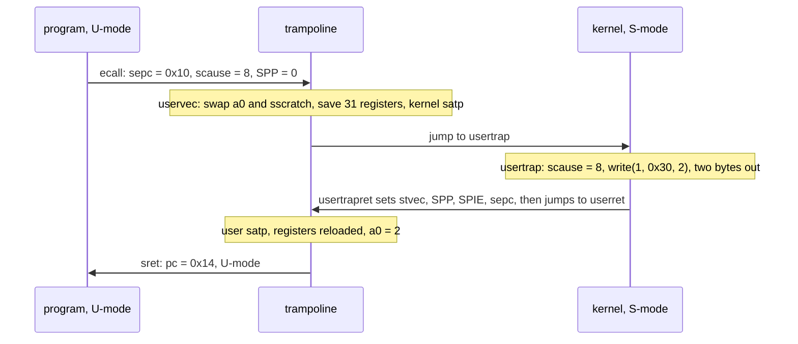
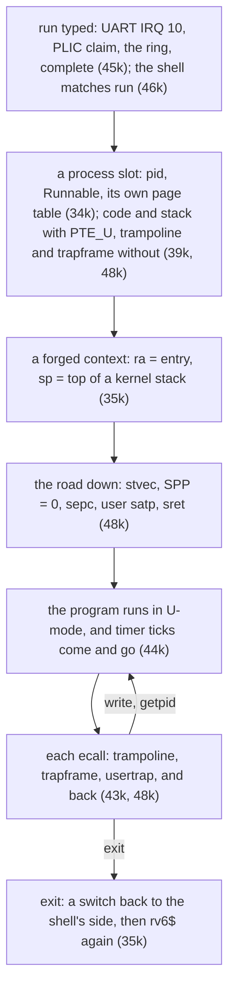

# Week 13 · Midterm 2 Review

> **Tue Nov 17** this review · **Thu Nov 19** Midterm 2, in class · **Fri Nov 20** no session
>
> No exercises this week. [Practice Set 2](../assignments/practice-set-02.md)
> says this lecture doubles as the review: attempt the set first, and bring the
> problems you got wrong. Read **The review** before Tuesday.
> **Going deeper** is optional: more problems in the exam's shapes.

[Slides](13-cs326-2026-11-17-midterm-2-review-slides.html){ .md-button }
[Midterm 2](../assignments/midterm-2.md){ .md-button }
[Practice Set 2](../assignments/practice-set-02.md){ .md-button }
[Exam prep](../guides/exam-prep.md){ .md-button }

## This week { #this-week }

Thursday asks for the kernel you built from `34k` to `48k`, on paper.

Midterm 2 is Thu Nov 19, in class, for the full period: pencil and paper,
closed book, and one reference, the [Cheatsheet](../guides/cheatsheet.md),
printed and annotated. No devices, not even a calculator. It is worth 15% of the
grade.

The scope is `34k`–`48k`. Practice Set 2's solutions post today. By Thursday
you can answer all five question shapes on material you have not seen.

---

## The review { #review }

### Scope, and where it lives { #scope }

Every line of the [Midterm 2 scope](../assignments/midterm-2.md#scope) has a home
on a weekly page. Reread the section, not the page.

| Scope line | Where it lives |
|---|---|
| Context switching: which registers and why, `#[repr(C)]`, the double switch | Week 9: [`35k`](09-cs326-2026-10-13-processes-context-switch-and-scheduling.md#fri-35k), [the double switch](09-cs326-2026-10-13-processes-context-switch-and-scheduling.md#36k-double-switch) |
| Scheduling: mechanism and policy, round robin, the survey and its terms | Week 9: [`36k`](09-cs326-2026-10-13-processes-context-switch-and-scheduling.md#fri-36k), [the vocabulary](09-cs326-2026-10-13-processes-context-switch-and-scheduling.md#exam-terms), [the survey](09-cs326-2026-10-13-processes-context-switch-and-scheduling.md#exam-survey) |
| Concurrency: races, atomicity, TAS and CAS, `Acquire`/`Release`, the guard, `Send`/`Sync`, deadlock and lock order, interrupts off | Week 10: [`37k`](10-cs326-2026-10-27-locks-semaphores-and-the-mmu-on.md#thu-37k), [TAS and CAS](10-cs326-2026-10-27-locks-semaphores-and-the-mmu-on.md#exam-tas), [deadlock and lock order](10-cs326-2026-10-27-locks-semaphores-and-the-mmu-on.md#exam-deadlock) |
| Semaphores: P and V, the lost wakeup, bounded buffers | Week 10: [permits](10-cs326-2026-10-27-locks-semaphores-and-the-mmu-on.md#38k-permits), [the lost wakeup](10-cs326-2026-10-27-locks-semaphores-and-the-mmu-on.md#exam-lost-wakeup), [bounded buffers](10-cs326-2026-10-27-locks-semaphores-and-the-mmu-on.md#exam-bounded) |
| The kernel heap: `#[global_allocator]`, what `Box`/`Vec`/`Arc` cost | Week 10: [the heap](10-cs326-2026-10-27-locks-semaphores-and-the-mmu-on.md#38k-heap) |
| The MMU on: the bootstrap paradox, identity mapping, `satp`, `sfence.vma`, the TLB | Week 10: [`39k`](10-cs326-2026-10-27-locks-semaphores-and-the-mmu-on.md#fri-39k); [the kernel's map](../guides/memory-map.md#the-kernels-virtual-address-space) |
| Filesystems: inodes vs directories, where the name lives, path resolution | Week 11: [`40k`](11-cs326-2026-11-03-filesystems-boot-order-and-traps.md#thu-40k) |
| Devices: registers, status flags, polling, `volatile` | Week 11: [devices](11-cs326-2026-11-03-filesystems-boot-order-and-traps.md#exam-devices) |
| Boot order as a dependency graph | Week 11: [`42k`](11-cs326-2026-11-03-filesystems-boot-order-and-traps.md#fri-42k) |
| Traps: M/S/U, exceptions vs interrupts, the M→S handoff and its six CSRs, `stvec`/`sepc`/`scause`/`sstatus`/`stval`, `sret` | Week 11: [`43k`](11-cs326-2026-11-03-filesystems-boot-order-and-traps.md#fri-43k), [the handoff](11-cs326-2026-11-03-filesystems-boot-order-and-traps.md#exam-handoff), [`stval`](11-cs326-2026-11-03-filesystems-boot-order-and-traps.md#exam-stval) |
| The timer: the CLINT, and why preemption needs a timer | Week 11: [`44k`](11-cs326-2026-11-03-filesystems-boot-order-and-traps.md#fri-44k) |
| Device interrupts: the PLIC's four-register protocol, the console ring | Week 12: [`45k`](12-cs326-2026-11-10-console-shell-and-user-mode.md#thu-45k), [the four registers](12-cs326-2026-11-10-console-shell-and-user-mode.md#exam-plic) |
| The shell as a REPL, and its command table | Week 12: [`46k`](12-cs326-2026-11-10-console-shell-and-user-mode.md#thu-46k) |
| User mode: privilege levels, the trampoline at one address in both tables, the trapframe, `ecall` | Week 12: [`48k`](12-cs326-2026-11-10-console-shell-and-user-mode.md#fri-48k), [the top two pages](12-cs326-2026-11-10-console-shell-and-user-mode.md#exam-top-pages), [`sscratch`](12-cs326-2026-11-10-console-shell-and-user-mode.md#exam-sscratch) |

Midterm 1 returns as building blocks: the
[Sv39 walk](07-cs326-2026-10-06-boot-physical-pages-and-sv39.md#33k-walk) and the
[caller/callee split](06-cs326-2026-09-29-below-rust-assembly-unsafe-and-no-std.md#20a-saved).

### The five question shapes { #shapes }

[Exam prep](../guides/exam-prep.md) works the first three shapes on rv6 itself.
Here each shape gets one worked answer, on made-up material or numbers; Shape 5
uses rv6's own trap path. A full answer names the register or structure, gives its value, and says what
forces it.

#### Shape 1: Trace the registers { #shape-registers }

A trace question freezes the CPU at chosen moments and asks what each register
holds. For a switch, one fact carries it: the `ret` goes wherever the loads said.

Use week 9's [`Pause` and `trade`](09-cs326-2026-10-13-processes-context-switch-and-scheduling.md#35k-offsets):
`sp` at 0, `s1` at 8, `ra` at 16. Process A runs with `sp = 0x8031_0FA0` and
`s1 = 7`, and its yield function calls `trade(&A, &H)`, where H is the hub. H's
`Pause` holds `0x8020_0F40`, 3 and `0x8000_1A20`. B last yielded through the
same yield function, so its `Pause` holds `0x8032_0F70`, 11 and `0x8000_4418`.

```text
moment                    ra            sp            s1   saved
A calls trade(&A, &H)     0x8000_4418   0x8031_0FA0   7
after the saves           (no register changes)            A: 0x8031_0FA0, 7, 0x8000_4418
after the loads           0x8000_1A20   0x8020_0F40   3
ret: into the hub, on its stack. The hub picks B and sets s1 = 4.
H calls trade(&H, &B)     0x8000_1A20   0x8020_0F40   4    H: 0x8020_0F40, 4, 0x8000_1A20
after the loads           0x8000_4418   0x8032_0F70   11
ret: into the yield function again, now on B's stack
```

The hub calls `trade` from one call site, so its `ra` repeats every lap. Read
the last row as the trick: A and B resume at one address, and only `sp` and the
`s` registers tell them apart.

> **The common slip:** "the `ret` returns to the code that just called `trade`".
> It returns to the `ra` just loaded, which belongs to the *other* context.

#### Shape 2: Decode the bits { #shape-bits }

A decode question hands you raw hex: cut out the fields, then say what they
mean. A user program dies; the kernel reports the trap and the process's own
table:

```text
scause      0x0000_0000_0000_000F
stval       0x0000_0000_0000_0040
user satp   0x8000_0000_0008_7342
leaf PTE for virtual page 0:   0x21CD_141B
```

By hand:

```text
scause  top bit 0: an exception.  Code 0xF = 15: a store page fault
stval   the faulting address: 0x40, page 0, offset 0x040
satp    MODE = bits 63:60 = 8: Sv39.  PPN = low 44 bits = 0x8_7342
        root table at 0x8_7342 << 12 = 0x8734_2000
PTE     low 10 bits = 0x41B & 0x3FF = 0x01B = 0b00_0001_1011: V R X U, no W
        PPN = 0x21CD_141B >> 10 = 0x8_7345      (x4 = 0x8734_506C; zero the 06C)
        frame 0x8734_5000, so the store aimed at 0x8734_5040
```

The verdict: the program stored into its own code page. `U` is set, so the page
is the program's; the missing bit is `W`. A fault leaves `sepc` at the store.
A fault a kernel can repair, such as a copy-on-write store, reruns with no +4;
a store into code never is, so rv6 ends the process.

> **The common slip:** taking the frame as `pte >> 12`. The PPN starts at bit 10,
> so that shift divides the frame number by four.

#### Shape 3: Order the steps { #shape-order }

An ordering question scrambles a sequence and asks for the order, the reason
for each position, and which steps could swap. One timer tick, scrambled:

```text
(a) the S-mode handler clears the pending software-interrupt bit
(b) mtime reaches mtimecmp0
(c) the M-mode vector moves mtimecmp0 one interval later
(d) mret returns to the interrupted code, in S- or U-mode
(e) sret resumes at sepc
(f) the CPU traps into S-mode with scause = 0x8000_0000_0000_0001
(g) the M-mode vector sets sip.SSIP
(h) the CPU traps into M-mode at mtvec
```

| # | Step | What forces its place |
|---|---|---|
| 1 | (b) | The CLINT compares, and raises a machine-mode interrupt |
| 2 | (h) | That interrupt cannot be delegated, so it lands at `mtvec` from S- or U-mode, even with `sstatus.SIE` clear |
| 3 | (c) | Before `mret`, or the interrupt is still pending and traps straight back |
| 4 | (g) | Before `mret`: the forwarding, a software interrupt with a timer's meaning |
| 5 | (d) | The only way back down, to `mepc` |
| 6 | (f) | Once its gates open: `sie.SSIE`, and `sstatus.SIE` if the CPU was in S-mode |
| 7 | (a) | Before `sret`: while `sip.SSIP` reads 1, the tick is taken again at once |
| 8 | (e) | No +4: the interrupt came *before* that instruction ran |

Steps (c) and (g) can swap: each only needs to precede `mret`.

> **The common slip:** a bare list of letters. Each position needs its reason.

#### Shape 4: Find the race { #shape-race }

A race question gives two sequences and asks for an interleaving that breaks an
invariant, then for what makes it safe. A race lives in a window: between a
read and the write that depends on it, or between two writes that must look
like one.

A bank keeps two accounts, X and Y, that must always sum to 100. A transfer is
two stores, and an audit is two loads:

```text
transfer:  X = X - 10;  Y = Y + 10
audit:     total = X + Y
```

Read the invariant as "whenever anyone looks, X + Y = 100". Starting from 50
and 50, two harts break it without ever writing the same word at once:

```text
hart A: transfer        hart B: audit            X    Y
X = 50 - 10                                      40   50
                        reads X = 40, Y = 50     40   50
Y = 50 + 10                                      40   60
the audit reports 90: money vanished, for a moment
```

The fix is one lock around both stores *and* both loads: lock only the
transfer, and the audit still looks between the stores.
No one-word atomic helps either: the invariant spans two words.

One hart races too, if a timer handler runs the audit between the stores. A
spinlock turns that into a deadlock: the handler spins on a lock only the
interrupted transfer can release. So a lock a handler takes is held only with
interrupts off.

> **The common slip:** an interleaving that breaks nothing. Name the invariant
> first, then find the schedule that breaks it.

#### Shape 5: Trace the trap { #shape-trap }

A trap question starts at an `ecall` or an interrupt and asks what the hardware
and the software do at each step, naming the CSR involved.

Take `write(1, "hi", 2)` from a program of your own. Its `ecall` sits at `0x10`,
and `"hi"` at `0x30` on its code page, which the user's table maps to frame
`0x8765_3000`. Before the `ecall`: `a7 = 16`, `a0 = 1`, `a1 = 0x30`, `a2 = 2`.

1. **`ecall`, in hardware.** `sepc` ← `0x10`, `scause` ← 8, `sstatus.SPP` ← 0
   (from U-mode), `SPIE` ← `SIE`, `SIE` ← 0. The mode becomes S, and `pc` ←
   `stvec`: the trampoline's `uservec`. `satp` still holds the user's table.
2. **`uservec`.** Swapping `a0` with `sscratch` leaves `TRAPFRAME`
   (`0x3F_FFFF_E000`) in `a0` and the user's 1 in `sscratch`. All 31 user
   registers go into the trapframe (`a0` at 112, `a7` at 168). It loads the
   kernel stack top, the handler's address and the kernel's `satp`, then writes
   `satp` between two `sfence.vma`. The next fetch still finds the trampoline.
3. **`usertrap`.** It aims `stvec` at the kernel's own vector and reads
   `scause` = 8: an `ecall` from U-mode, so a system call. `sepc`, still
   `0x10`, is kept in the trapframe.
4. **The call.** The request is `write` (16) on descriptor 1, for 2 bytes at
   `0x30`, as the program set it up. `copyin` translates `0x30` through the
   *user's* table, refusing any page without `PTE_U`, and finds `0x8765_3030`.
   Two bytes reach the UART, and the call's result is 2.
5. **`usertrapret`.** It aims `stvec` back at `uservec` and refreshes the three
   notes that step 2 loads. It sets `SPP` = 0 and `SPIE` = 1, puts `0x14` in
   `sepc`, and jumps to `userret` at its trampoline address with the user's
   `satp`.
6. **`userret`, then `sret`.** It installs the user's table, reloads the
   registers, and ends with the swap that leaves 2 in `a0` and `TRAPFRAME` in
   `sscratch`. `sret` sets `pc` ← `sepc`, the mode ← U, and `SIE` ← `SPIE`.

The program resumes at `0x14` with 2 in `a0`, past the 4-byte `ecall`, because
the call is finished
([done versus retry](12-cs326-2026-11-10-console-shell-and-user-mode.md#48k-retry)).



A timer tick from U-mode takes the same road with Shape 3's cause, `scause` =
`0x8000_0000_0000_0001`. The handler clears the pending bit instead of making a
call, and the saved PC stays put: that instruction never ran.

> **The common slip:** forgetting that `satp` still holds the user's table when
> `uservec` starts, which is why both tables map that page at one address.

### One spine, `34k` to `48k` { #spine }

Type `run` at a `48k` prompt, and almost every exercise since `34k`
takes a turn:



Underneath: boot order (`42k`), the MMU on every address (`39k`), the shell's
`Vec` on the heap (`38k`), and the filesystem's spinlock (`37k`, `40k`). Round
robin (`36k`) waits in the wings: `48k` runs one program at a time.

### Practice Set 2: what to redo { #ps2 }

Redo the bold problems on paper, with a timer, before rereading the solutions.
Do the others if their "redo it if" fits you.

| Problem | Shape | Redo it if | Review |
|---|---|---|---|
| **1** A yield | trace | your `ret` returned into `proc_yield` | [Shape 1](#shape-registers) |
| 2 Fourteen registers | explain | you cannot say why `ra` is saved | [week 9](09-cs326-2026-10-13-processes-context-switch-and-scheduling.md#35k-context) |
| 3 Round robin | trace | your average turnaround is not 10 | [Problem 2](#problem-2) |
| **4** The lock that is not a lock | race | the interleaving took more than four lines | [Shape 4](#shape-race) |
| 5 Two deadlocks | explain | "interrupts off" had no reason | [Shape 4](#shape-race), [lock order](10-cs326-2026-10-27-locks-semaphores-and-the-mmu-on.md#exam-deadlock) |
| **6** Semaphores | trace | your trace broke `empty + full == N` | [week 10](10-cs326-2026-10-27-locks-semaphores-and-the-mmu-on.md#exam-bounded) |
| 7 A `satp` | decode | you forgot the `>> 12` | [Shape 2](#shape-bits) |
| **8** A full Sv39 walk | decode | anything went wrong; allow twenty minutes | [week 7](07-cs326-2026-10-06-boot-physical-pages-and-sv39.md#33k-walk) |
| 9 Turning it on | explain | you did not get 66 pages | [week 10](10-cs326-2026-10-27-locks-semaphores-and-the-mmu-on.md#exam-megapages) |
| **10** What just happened? | decode | you added 4 for an interrupt | [week 12](12-cs326-2026-11-10-console-shell-and-user-mode.md#48k-retry) |
| 11 Handoff and handshake | order | you cannot name the six jobs | [week 11](11-cs326-2026-11-03-filesystems-boot-order-and-traps.md#exam-handoff), [week 12](12-cs326-2026-11-10-console-shell-and-user-mode.md#exam-plic) |
| 12 `unlink` | trace | the new file got inode 7 | [week 11](11-cs326-2026-11-03-filesystems-boot-order-and-traps.md#thu-40k), [links](11-cs326-2026-11-03-filesystems-boot-order-and-traps.md#exam-links) |
| **13** The trampoline | explain | you cannot name the instruction that fails | [week 12](12-cs326-2026-11-10-console-shell-and-user-mode.md#exam-top-pages) |

Problem 13 and the Cheatsheet use the `49k` layout, with the stack page at
`0x1_0000`. In `48k` it sits at `0x1000`, and `sp` starts at `0x2000`.

### Not on this exam { #not-on-exam }

- `exec`, file descriptors, `fork` and `wait`: these belong to the final.
- Pipes: on no exam.
- Extra-credit exercises (`41k`, `47k`) are optional: the device and filesystem
  ideas in scope are on the week 11 page.
- Tool details: flags, `cargo`, QEMU command lines, exact Rust signatures
  ([what is not examinable](../guides/exam-prep.md#what-is-not-examinable)).

---

## Going deeper { #deeper }

*Optional. Nothing here is new material.*

### Practice problems { #problems }

#### Problem 1: The wakeup that got away { #problem-1 }

A clerk waits for mail, and a carrier delivers it:

```text
clerk:    if the box is empty: sleep on the box
          take a letter
carrier:  put a letter in the box
          wake everyone asleep on the box
```

(a) Give an interleaving in which the clerk sleeps forever beside a letter.
(b) What makes it safe?

<details markdown="1">
<summary>Click to reveal solution</summary>

**(a)**

```text
clerk                      carrier                    box
sees: empty                                           empty
                           puts a letter              1 letter
                           wakes the sleepers: none   1 letter
sleeps on the box                                     1 letter, forever
```

The wakeup went out before anyone slept, and nothing sends another: the **lost
wakeup**.

**(b)** Make "check, then sleep" one step as far as the carrier can tell. Both
sides take the box's lock, and the clerk releases it only as part of falling
asleep, so the put-and-wake cannot land in between. xv6's `sleep` takes the lock
as an argument for exactly this reason. On waking, the clerk rechecks the box
in a `while`: another clerk may have emptied it.

</details>

#### Problem 2: The survey, by the numbers { #problem-2 }

Jobs A, B, C and D arrive at 0, 1, 2 and 3, needing 5, 3, 1 and 2 ticks. For
FCFS, non-preemptive SJF, and round robin with a quantum of 2, give the schedule
and the average turnaround and response. A job arriving as a quantum ends queues
ahead of the job just preempted. Which policy beats all three on turnaround, and
what does it risk?

<details markdown="1">
<summary>Click to reveal solution</summary>

| Policy | Schedule | Turnaround | Response |
|---|---|---|---|
| FCFS | A 0–5, B 5–8, C 8–9, D 9–11 | (5 + 7 + 7 + 8) / 4 = 6.75 | (0 + 4 + 6 + 6) / 4 = 4 |
| SJF | A 0–5, C 5–6, D 6–8, B 8–11 | (5 + 10 + 4 + 5) / 4 = 6 | (0 + 7 + 3 + 3) / 4 = 3.25 |
| RR, 2 | A 0–2, B 2–4, C 4–5, A 5–7, D 7–9, B 9–10, A 10–11 | (11 + 9 + 3 + 6) / 4 = 7.25 | (0 + 1 + 2 + 4) / 4 = 1.75 |

At time 0 SJF has only A, which then runs to the end. Round robin wins response
and loses turnaround.

Shortest remaining time first preempts for a shorter arrival: A 0–1, B 1–2,
C 2–3, B 3–5, D 5–7, A 7–11, ties to the earlier arrival. Its turnaround is
(11 + 4 + 1 + 4) / 4 = 5. It risks starvation: a stream of short jobs keeps A
waiting without bound.

</details>

#### Problem 3: What one address space costs { #problem-3 }

A `48k` process maps four pages: code at 0, its stack at `0x1000`, `TRAPFRAME`
and `TRAMPOLINE`. (a) Give each one's VPN[2], VPN[1] and VPN[0]. (b) How many page-table pages does the table need?
(c) Counting its kernel stack, how many pages does the process own? (d) Which
entries carry `PTE_U`?

<details markdown="1">
<summary>Click to reveal solution</summary>

**(a)**

```text
                          VPN[2]   VPN[1]   VPN[0]
code        0x0000_0000     0        0        0
stack       0x0000_1000     0        0        1
TRAPFRAME   0x3F_FFFF_E000  255      511      510
TRAMPOLINE  0x3F_FFFF_F000  255      511      511
```

For `TRAPFRAME`, `>> 30` gives `0xFF`, and the next two nine-bit fields are
`0x1FF` and `0x1FE`.

**(b)** Five: the root, then a middle and a leaf table under `root[0]`, and
another pair under `root[255]`.

**(c)** Nine pages, 36 KiB: five of tables, plus code, stack, trapframe and
kernel stack. The trampoline's one frame is shared by every table, so no
process owns it.

**(d)** Only the code and stack leaves. The trapframe and trampoline leaves lack
`U`, and interior entries never carry it: on a non-leaf entry the bit is
reserved and must be zero.

</details>

---

## Key terms { #terms }

| Term | Meaning | Where you use it |
|---|---|---|
| Double switch | Process to scheduler to process, never process to process | `36k`, Shape 1 |
| Race | An interleaving that breaks an invariant | `37k`, Shape 4 |
| Lost wakeup | A wakeup sent before its sleeper sleeps | `38k`, Problem 1 |
| `satp` | MODE in bits 63:60, the root table's PPN in bits 43:0 | `39k`, Shape 2 |
| `scause` | Top bit: interrupt or exception; low bits: which one | `43k`–`45k`, Shape 2 |
| `sepc` | Where the trap struck; advanced only when the trap did its job | `43k`, `48k` |
| Trampoline | One page of trap code at the same address in every table | `48k`, Shape 5 |
| Trapframe | A process's page for its 31 user registers and the kernel's notes | `48k`, Shape 5 |

## Further reading { #reading }

- [Midterm 2](../assignments/midterm-2.md): the scope, format, and how to
  prepare.
- [Exam Prep](../guides/exam-prep.md): shapes 1–3 worked on rv6 itself.
- [rv6 Architecture: the three trap paths](../guides/rv6-architecture.md#the-three-trap-paths)
  and [the boot sequence](../guides/rv6-architecture.md#the-boot-sequence).
- [Sv39 Paging: five worked translations](../guides/sv39-paging.md#five-worked-translations).
- [The xv6 book](https://pdos.csail.mit.edu/6.828/2023/xv6/book-riscv-rev3.pdf),
  chapters 3 to 8: page tables, traps, interrupts and devices, locking,
  scheduling, and the file system.
