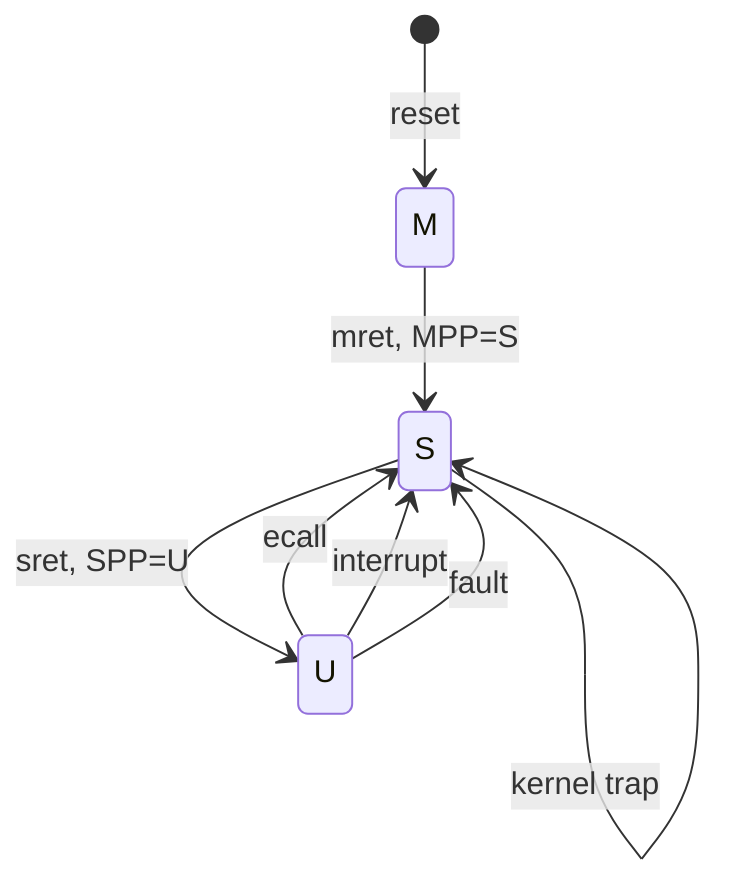
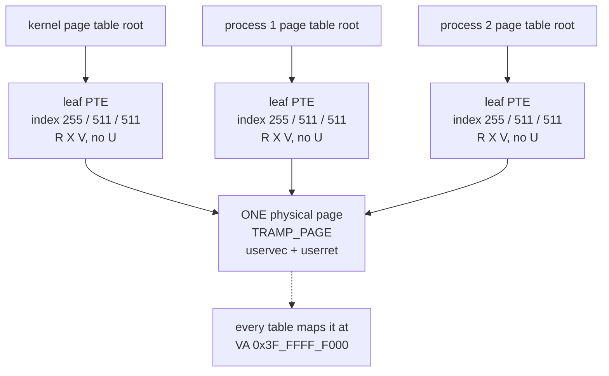
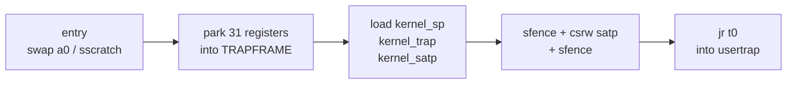

# User Mode I: The Wall, the Trampoline, and the Trapframe

## Overview

Every line of rv6 you have written so far ran with total power over the machine.
The shell, the filesystem, the drivers, the scheduler — all kernel code, and
kernel code can read any address, write any CSR, and halt the hart. That is
tolerable while you write all the code. An operating system exists to run *other
people's* programs, and those crash, scribble, and loop. This session builds the
wall that makes running them safe: **user mode**, the CPU's weakest privilege
level, plus a **per-process page table** in which the kernel is not addressable
at all. Then the two structures that make crossing the wall possible — the
**trampoline**, one page mapped at the same virtual address in every address
space so `satp` can change without the CPU losing its footing, and the
**trapframe**, the parking lot for 31 user registers that `sscratch` bootstraps
access to. This is the concept behind exercise `18_user_mode`; the system-call
ABI on top of it is L23. See the
[Sv39 paging guide](../guides/sv39-paging.md) for the page-table mechanics
assumed throughout.

## Learning Objectives

- **Explain** why privilege levels alone do not isolate a process, and what the
  page table adds.
- **Enumerate** what user mode forbids, and name the trap each violation raises.
- **Describe** the contents of an rv6 user address space and the role of `PTE_U`
  in both directions.
- **State** the trampoline problem precisely: why the instruction after
  `csrw satp` is the one that kills you.
- **Justify** mapping one page at an identical virtual address in every page
  table, and explain why that page is mapped without `PTE_U`.
- **Trace** `uservec` instruction by instruction, naming the contents of `a0`
  and `sscratch` at every step.
- **Derive** why the kernel cannot push user registers onto a stack on entry,
  and what `sscratch` solves.
- **Compare** rv6's trampoline with Linux's flat kernel mapping before and after
  the 2018 KPTI patches.

## Prerequisites

- L12 *Virtual Memory I* and the
  [Sv39 paging guide](../guides/sv39-paging.md) — three-level walks, PTE flags,
  `satp`, `sfence.vma`. This lecture is unreadable without them.
- L18 *Traps, Privilege Modes, and Interrupts* and exercise `13_traps` — `stvec`,
  `sepc`, `scause`, `sstatus`, and the `mret` that dropped M → S.
- L13 *Processes and the PCB* and exercise `04_processes` — `Proc`, the fixed
  `PROCS` table, and the per-process page table you have been allocating since
  then but never used.
- L14 *The Context Switch* and exercise `05_context_switch` — `swtch`, which
  rv6 reuses to enter and leave a running user program.
- The [RISC-V guide](../guides/riscv.md) for the register file, and
  [Unsafe Rust and no_std](../guides/rust-unsafe-nostd.md) for `global_asm!`
  and raw pointers.

---

## 1. Why a Wall

An OS makes a promise: *run this program, and if it misbehaves only the program
dies*. That is not achievable in software. If a program can execute any
instruction the kernel can, it can rewrite the kernel; if it can name any
address the kernel can, it can read the kernel's secrets and forge its data
structures. The promise is enforceable only if the hardware refuses on the
kernel's behalf, every cycle, at no cost.

Two hardware mechanisms do that, and you have already built both halves.

| Mechanism | What it restricts | Where you met it |
|---|---|---|
| Privilege levels | Which *instructions* are legal | exercise `13_traps` |
| The MMU + page tables | Which *addresses* exist at all | exercises `03_paging`, `09_virtual_memory` |

Neither suffices alone. Privilege levels without paging leave a program able to
read the kernel's data with an ordinary `ld` — no privileged instruction needed.
Paging without privilege levels leaves it able to `csrw satp` and install a page
table of its own, which is the same as owning the machine. Isolation is the
*conjunction*: a weak privilege level, plus an address space with no kernel in
it.

This is old. Multics (1965) generalized it to eight nested rings; the Intel
80286 shipped four, of which every mainstream OS used two, because the middle
rings cost complexity and bought nothing. ARM calls them exception levels,
EL0–EL3. RISC-V, with forty years of hindsight, ships three — machine (M),
supervisor (S), and user (U) — plus an optional hypervisor extension for the
case that really needed a fourth. Today you meet the last one.

> Historical note: the two-ring convention is not laziness. Rings model a
> *linear* order of trust, and real systems have needed a *lattice* — mutually
> untrusting peers — which rings cannot express. Modern systems get that from
> separate address spaces instead, which is the mechanism in section 3.

---

## 2. The Third Privilege Level

In exercise `13_traps` your kernel dropped from M-mode to S-mode with an `mret`,
after setting `mstatus.MPP` to say where it was going. Dropping to user mode is
the same move one level down: clear `sstatus.SPP` (bit 8) to 0, put the target
address in `sepc`, and execute `sret`. rv6 does exactly this in `usertrapret`
(`usermode.rs:455`, `usermode.rs:459`).

What changes when `SPP` is 0 and `sret` retires:

| U-mode may not | Result if it tries |
|---|---|
| Execute `csrr`/`csrw` on any supervisor CSR | Illegal instruction, `scause = 2` |
| Execute `sret`, `sfence.vma`, `wfi` | Illegal instruction, `scause = 2` |
| Touch a page whose PTE lacks `PTE_U` | Page fault, `scause = 12`, `13`, or `15` |
| Touch an unmapped address | Page fault, same causes |

Notice what is *not* on the list: arithmetic, loads, stores, branches, and jumps
are all legal. User mode is not a sandbox that inspects the program. It is a set
of hardware refusals that cost zero cycles when the program behaves.

The CSR ban is total, including reads: a program cannot read `sstatus` to learn
what mode it is in, `satp` to find its page table, or `stvec` to find the
kernel's entry point. The wall is opaque from the far side — which is why
`getpid()` must be a system call. A process's own identity is a fact only the
kernel holds.



There are exactly two doors from U back to S, and the program only controls one
of them. It can *ask* — `ecall`, which raises `scause = 8`, "environment call
from U-mode" — or the hardware can force the issue with an interrupt or a fault.
Both arrive at the address in `stvec`, which user code cannot read, let alone
write. The kernel therefore decides where every entry lands; the program only
decides *when*.

> Key distinction: `ecall` is not a jump and not a call. It is a synchronous
> exception. Nothing about it is special-cased in hardware beyond the cause
> code — the same vector, the same `sepc`, the same `sstatus` bookkeeping as a
> page fault. A system call is a fault the program raises on purpose.

---

## 3. The Private Address Space

Privilege alone still leaves the kernel readable, so each process gets its own
page table. You have been allocating one per process since exercise
`04_processes` (`proc.rs:116`); this is the exercise where `satp` finally points
at it.

The layout in `memlayout.rs:29-75` is deliberately spartan:

```text
 kernel page table                      a user page table
 (satp while in the kernel)             (satp while this process runs)

 0x40_0000_0000  MAXVA ────────────────────────────────────────────
 0x3F_FFFF_F000  TRAMPOLINE  R X       0x3F_FFFF_F000  TRAMPOLINE  R X
                 (no U)                                (no U)  ← same page
 0x3F_FFFF_E000  (unmapped)            0x3F_FFFF_E000  TRAPFRAME   R W
                                                       (no U)  ← this process
        ...                                   ...
 0x8800_0000  PHYSTOP
 0x8000_0000  KERNBASE  R W X                 (nothing at all up here)
 0x0C00_0000  PLIC      R W
 0x1000_0000  UART0     R W                0x0001_1000  ← initial sp
 0x0010_0000  TEST      R W                0x0001_0000  stack page  R W U
                                                 ...    (guard gap, unmapped)
 0x0000_0000  (unmapped)                   0x0000_0000  program image R X U
```

Three things deserve attention.

**`PTE_U` is the wall** (`vm.rs:17-23`). One bit in each leaf PTE decides whether
user mode may touch that page. The kernel's own mappings — the UART, the PLIC,
all 128 MiB of RAM at `KERNBASE` — are simply absent from the user's table, but
the two entries that *are* present (trampoline and trapframe) sit inside the
user's address space with `PTE_U` clear (`proc.rs:164-165`). They are visible to
the MMU and invisible to the program.

The bit works in the other direction too, which surprises people. When
`sstatus.SUM` is 0 — rv6 leaves it 0 — *supervisor* mode may not load or store
through a `PTE_U` page either. That is not an accident of the encoding; it is a
deliberate guard against the kernel dereferencing a user pointer by mistake,
which is the single most productive bug class in OS history. It is also why
`walkaddr` (`vm.rs:252-261`) exists: the kernel translates user addresses *by
hand*, through the user's page table, and refuses anything without `PTE_U`
(`vm.rs:257`). We will use it in L23.

**Address 0 is an ordinary address.** In a fresh, private address space nothing
is sacred about zero, and it is where xv6 loads programs. Hosted Unix leaves the
first page unmapped so null-pointer dereferences fault; rv6 gets that luxury in
exercise `19_exec`, not here.

**`MAXVA` is `1 << 38`, not `1 << 39`** (`memlayout.rs:49`). Sv39 gives 39 bits,
but bits 63:39 of any valid virtual address must all equal bit 38 — the
sign-extension rule. Stopping one bit short means rv6 never has to think about
it. The trampoline at `MAXVA - PGSIZE` is therefore the highest page that is
unambiguously "positive", and it lands at page-table indices (255, 511, 511).

> Comparison: Linux does the opposite. The kernel lives in the high half of
> *every* address space, mapped with the supervisor-only bit, so entering the
> kernel historically required no page-table switch at all — just a privilege
> change. That was faster and simpler, and it survived until January 2018, when
> Meltdown proved that speculative execution could leak the contents of
> supervisor-only pages that were merely *mapped*. The fix, KPTI, unmaps the
> kernel from user page tables and switches `CR3` on entry — and the entry code
> that performs the switch must live at an address mapped in both tables. Linux
> calls that page the **entry trampoline**. It is the design you are about to
> build, arrived at from the opposite direction and twenty years later.

---

## 4. The Trampoline Problem

Here is the puzzle at the center of this material. Take it slowly; it is the
one idea in the course that cannot be understood by analogy.

Entering the kernel from user mode means changing `satp`, because the user's
page table does not map the kernel. But `satp` is not data — it is the map by
which *every* address is interpreted, including the address the CPU is about to
fetch the next instruction from. Consider three consecutive instructions in some
hypothetical entry routine at virtual address `0x8000_5000`:

```text
 va 0x8000_5000:  ld   t1, 0(a0)      # t1 = kernel satp value
 va 0x8000_5004:  csrw satp, t1       # <- the world changes HERE
 va 0x8000_5008:  jr   t0             # <- fetched through the NEW table
```

The `csrw` at `...5004` retires. The MMU is now consulting a different tree.
The CPU increments the PC to `...5008` and issues an instruction fetch — and
that fetch is translated by the *new* table. If the new table maps `0x8000_5008`
to a different physical page, the CPU executes whatever bytes happen to live
there. If it maps nothing there, the CPU takes an instruction page fault whose
handler is reached through `stvec`, at an address that may itself now be
unmapped, and the hart wedges. The switch cannot be "undone" by the next
instruction, because there is no next instruction you can trust.

> Key distinction: this is not a TLB problem. `sfence.vma` fixes stale
> *translations*; it does not help when the translation is fresh, correct, and
> points somewhere else. The problem is that the code doing the switching has
> moved under its own feet.

### The resolution

State the requirement exactly: **the instructions that write `satp` must live at
a virtual address that means the same thing in both the old table and the new
one.** If the very page holding the switching code is mapped at the same VA, to
the same physical page, in both tables, then the fetch at `...5008` resolves to
the same bytes before and after. The switch becomes invisible to the fetch
stream.

That page is the **trampoline**. rv6 puts it at `TRAMPOLINE`, the top page of
every address space (`memlayout.rs:53`), and maps it into the kernel table at
boot (`vm.rs:169`) and into every process's table at creation
(`proc.rs:164`).



Every table, one page. The virtual address is a constant of the design, not a
per-process value, which is why `userret` can materialize the trapframe address
with a bare `li` (`usermode.rs:144`) — `TRAPFRAME` is likewise the same VA
everywhere.

### Three consequences worth stating

**The trampoline gets its own physical page, copied at boot.** The assembly is
linked into the kernel image alongside everything else, so its physical page is
shared with unrelated kernel code. Mapping *that* page at `TRAMPOLINE` would
expose whatever else is on it. So `kvmmake` allocates a fresh page, copies the
bytes from `trampoline` to `trampoline_end` onto it, and maps the copy
(`vm.rs:158-172`). The `fence.i` at `vm.rs:168` matters: the kernel just wrote
*instructions* through the data path, and RISC-V does not promise the
instruction fetch path sees them without it.

**It is mapped without `PTE_U`, even in the user's table** (`vm.rs:169`,
`proc.rs:164`). The trampoline is kernel code that happens to be addressable in
the user's address space. If the user could execute it, it could jump to the
middle of `userret`, past the `csrw satp`, and reload registers of its choosing
— or simply read the kernel's `satp` value out of the trapframe. Without
`PTE_U`, the only way to land on that page is a trap, and a trap has already
raised privilege to S before the first byte is fetched. The page is
simultaneously *in* the address space and *unreachable from* it.

**`sfence.vma` brackets every `satp` write** (`usermode.rs:133-135`,
`usermode.rs:140-142`). The fence before flushes stale entries from the table
you are leaving; the fence after guarantees the MMU consults the new one. QEMU
often forgives their absence; hardware with a real TLB does not, and the failure
is intermittent, which is worse.

> Design note: an alternative exists — map the kernel's text into the user table
> as well, so no switch is needed on entry. That flat mapping is what Meltdown
> charged Linux for: mapped means speculatively reachable, and reachable means
> leakable. One page without `PTE_U` is a much smaller thing to defend.

---

## 5. The Trapframe

The `ecall` retires. The CPU is in S-mode at `stvec`, and every general-purpose
register still holds the *user program's* value. The kernel cannot execute one
line of Rust without destroying them, and it must hand all 31 back, bit-exact,
when the program resumes.

### Why not a stack?

A kernel trap solves this by pushing. Look at `kernelvec` (`trap.rs:90-107`): it
does `addi sp, sp, -128` and stores sixteen registers. That works because a
kernel trap interrupts *kernel* code, so `sp` already points at a valid kernel
stack.

From user mode, neither half of that sentence holds:

1. `sp` holds a *user* value. The program chose it. It may point at its code
   page, at an unmapped address, or — this is the interesting one — at the
   trapframe. Pushing through it would be the kernel writing wherever the
   program said to.
2. Even a good `sp` points into the *user's* address space, and `satp` still
   holds the user's page table. There is no valid kernel stack pointer in any
   register at the moment `uservec` begins.

So rv6 gives each process a dedicated page — the **trapframe** — and each
process a separate **kernel stack** (`proc.rs:117-118`). The trapframe is mapped
at `TRAPFRAME` in that process's page table, `R|W` and no `U` (`proc.rs:165`).
It is a fixed-layout structure (`usermode.rs:33-71`), `#[repr(C)]` so that the
field offsets in the Rust struct and the byte offsets in the assembly are the
same numbers:

```text
 offset  field          who writes it
 ------  ------------   ---------------------------------------
      0  kernel_satp    usertrapret, before leaving  (usermode.rs:449)
      8  kernel_sp      usertrapret                  (usermode.rs:450)
     16  kernel_trap    usertrapret: address of usertrap  (:451)
     24  epc            usertrap on entry; +4 for ecall   (:397, :401)
     32  kernel_hartid  unused here; keeps the xv6 layout
     40  ra   48  sp   56  gp   64  tp
     72  t0  ...  112  a0  ...  168  a7  ...  280  t6
```

Offsets 40 through 280 are the 31 registers. Offsets 0 through 32 are *notes the
kernel leaves for itself* — the three values `uservec` needs before it can run
any Rust, deposited on the way out by `usertrapret` so they are waiting on the
way in.

> Key distinction: a trapframe is not a context. `Context` (exercise
> `05_context_switch`) holds 14 callee-saved registers, because `swtch` is an
> ordinary function call and the ABI already spilled the rest. A trapframe holds
> 31, because a trap is *not* a function call — it can strike between any two
> instructions, and the ABI has promised nothing about that moment.

### The chicken and the egg: `sscratch`

`uservec` needs a register to hold the trapframe's address so it can start
storing. But to get an address into a register it must first destroy a register,
and every register holds user state that is not yet saved anywhere.

The escape is `sscratch`, a supervisor CSR that exists for exactly this and
nothing else, and the instruction `csrrw`, which **swaps** a register with a CSR
in one atomic step. If `sscratch` holds `TRAPFRAME` when the trap arrives, then

```asm
csrrw a0, sscratch, a0
```

leaves `a0 = TRAPFRAME` and `sscratch = the user's a0`. Nothing was lost: the
user's `a0` is parked in a CSR that user mode cannot read, and the kernel has
the one pointer it needs. One instruction, zero memory accesses, no stack.

Who arms `sscratch` the first time? `userret` does, on its way out
(`usermode.rs:180`): its last act before `sret` is another `csrrw a0, sscratch,
a0`, which restores the user's `a0` *and* leaves `TRAPFRAME` in `sscratch`,
ready for the next trap. The exit path arms the entry path. Since a process can
only reach user mode through `userret`, the invariant "`sscratch` holds
`TRAPFRAME` whenever U-mode code is running" holds from the very first
instruction the program ever executes.

---

## 6. `uservec`, Line by Line

`stvec` points here while user code runs (`usermode.rs:443-445`). Read
`usermode.rs:92-137` alongside this. Four phases:



**Phase 1 — get a pointer (`usermode.rs:94`).**

```asm
csrrw a0, sscratch, a0      # a0 = TRAPFRAME, sscratch = user a0
```

The state of the machine right now: privilege is S, `satp` is still the *user's*
page table, `sepc` holds the user PC, `scause` holds the reason, and 30 of 31
registers still hold user values. The trapframe is reachable because it is
mapped in the user's table.

**Phase 2 — park everything (`usermode.rs:96-127`).** Thirty `sd` instructions
at fixed offsets from `a0`, `a0` itself skipped. Then the tail:

```asm
csrr t0, sscratch           # t0 = the user's a0
sd   t0, 112(a0)            # park it at offset 112
```

`t0` was already saved at offset 72, so it is free to clobber — which is why
these two lines come last. `sp` is saved at offset 48 like any other register:
the kernel will not use the user's stack, but it must give it back.

**Phase 3 — pick up the kernel's notes (`usermode.rs:129-131`).**

```asm
ld sp, 8(a0)                # kernel_sp: this process's kernel stack top
ld t0, 16(a0)               # kernel_trap: the address of usertrap()
ld t1, 0(a0)                # kernel_satp
```

All three were written by `usertrapret` before the last `sret`
(`usermode.rs:449-451`). The trick is worth naming: **the kernel cannot look
anything up on entry, so it leaves itself a note on exit.** The process's own
trapframe is the only memory reachable at this instant, so everything needed is
already in it. Note the ordering — `sp` now holds a kernel address that is
unmapped in the table currently installed, so `uservec` loads it but must not
touch it.

**Phase 4 — cross (`usermode.rs:133-137`).**

```asm
sfence.vma zero, zero
csrw satp, t1               # the world changes
sfence.vma zero, zero
jr t0                       # into usertrap(), never returns here
```

The `csrw` at `usermode.rs:134` is the instruction that made this whole page
necessary. The `jr` at line 137 is fetched through the *new* table and lands
correctly, because we are standing on the trampoline; `t0` and `sp` now hold
kernel addresses that finally mean something. The next thing that runs is Rust:
`usertrap` (`usermode.rs:385`), on the process's own kernel stack, with all 31
user registers safely in memory.

---

## 7. The Road Back

`usertrapret` (`usermode.rs:440-466`) is the mirror image, and it runs in the
kernel with full addressability, so it does its work in Rust:

1. Point `stvec` back at the trampoline's `uservec`, computed as
   `TRAMPOLINE + (uservec - trampoline)` (`usermode.rs:443-445`) — the offset
   within the page is the same wherever the page is mapped. Symmetrically,
   `usertrap` aims `stvec` at `kernelvec` on entry (`usermode.rs:387`): a trap
   taken *in the kernel* must not go through `uservec`.
2. Write the three notes into the trapframe for next time (`usermode.rs:449-451`).
3. Clear `sstatus.SPP` so `sret` goes to U-mode, set `SPIE` so interrupts are
   enabled once there (`usermode.rs:455-456`).
4. Set `sepc` from the trapframe's saved `epc` (`usermode.rs:459`).
5. Compute the user's `satp` value (`usermode.rs:461`) and call `userret` at its
   trampoline address, passing that value in `a0` (`usermode.rs:463-466`).

`userret` (`usermode.rs:139-181`) then switches `satp` to the user table
(line 141) — legal, because it stands on the trampoline — materializes
`TRAPFRAME` with `li a0, {trapframe}` (line 144), stashes the user's `a0` in
`sscratch` (lines 146-147), reloads the other 30 registers, and finishes with
the swap that both restores `a0` and re-arms `sscratch` (line 180) before
`sret`.

There is exactly one way out of the kernel. Every return to user mode — first
entry, a system-call return, a timer-interrupt return, the child's first breath
after `fork` — goes through `usertrapret` and then `userret`. That
single path is why the `sscratch` invariant holds, and why `21_fork_wait` gets a
working child by copying the parent's trapframe and zeroing one field.

> Where this goes next: L23 picks up at `usertrap`, where `scause == 8` means a
> system call — the a7/a0-a2 ABI, the `epc += 4` that steps over the `ecall`,
> `dispatch`, and `copyin`.

---

## Key Concepts

| Concept | Definition | Example |
|---|---|---|
| User mode (U) | The weakest RISC-V privilege level: no CSR access, no privileged instructions, no non-`PTE_U` pages | Entered by `sret` with `sstatus.SPP = 0` (`usermode.rs:455`) |
| `PTE_U` | Leaf-PTE bit permitting user-mode access; with `SUM = 0` it also *bars* kernel access | `PTE_U = 1 << 4` (`vm.rs:23`) |
| Per-process page table | The address space a process sees; the kernel is simply absent from it | `(*p).pagetable`, allocated in `allocproc` (`proc.rs:116`) |
| `MAXVA` | One past the highest VA rv6 uses; `1 << 38`, one bit short of Sv39's 39 | `memlayout.rs:49` |
| `TRAMPOLINE` | The top page of every address space, holding `uservec`/`userret` | `0x3F_FFFF_F000` (`memlayout.rs:53`) |
| Trampoline page | One physical page mapped at the same VA in every table, so `satp` can change mid-stream | Copied and mapped in `kvmmake` (`vm.rs:158-172`) |
| `TRAPFRAME` | The page below the trampoline; this process's register parking lot | `0x3F_FFFF_E000` (`memlayout.rs:57`) |
| Trapframe | 31 saved user registers plus four notes the kernel leaves itself | `struct Trapframe`, `#[repr(C)]` (`usermode.rs:33-71`) |
| `sscratch` | A supervisor CSR holding `TRAPFRAME` while user code runs; bootstraps register access | `csrrw a0, sscratch, a0` (`usermode.rs:94`) |
| Kernel stack (`kstack`) | A per-process page the kernel runs on after a trap, never the user's `sp` | Loaded as `kernel_sp` (`usermode.rs:129`) |
| `uservec` / `userret` | The two halves of the trampoline: in from U, out to U | `usermode.rs:93`, `usermode.rs:139` |
| `sfence.vma` | Flushes stale address translations; brackets every `satp` write | `usermode.rs:133-135` |

---

## Practice Problems

### Problem 1: Decode the trampoline's page-table indices

`TRAMPOLINE = 0x3F_FFFF_F000` and `TRAPFRAME = 0x3F_FFFF_E000`. Give the L2, L1,
and L0 indices for both. Then encode the leaf PTE that maps `TRAMPOLINE` to
physical page `0x8020_1000` with the permissions rv6 actually uses.

<details>
<summary>Click to reveal solution</summary>

`px(level, va) = (va >> (12 + level * 9)) & 0x1ff` (`vm.rs:44-46`).

`TRAMPOLINE = 2^38 - 4096`:

- L2 = `va >> 30 & 0x1ff`: `2^38 / 2^30 = 256`, minus a partial page → 255.
- L1 = `va >> 21 & 0x1ff`: `(2^38 - 2^12) >> 21 = 131071 = 0x1FFFF`; `& 0x1ff` = 511.
- L0 = `va >> 12 & 0x1ff`: `0x3FF_FFFF & 0x1ff` = 511.

So **(255, 511, 511)**. `TRAPFRAME` is one page lower, so only L0 changes:
**(255, 511, 510)**. They share both upper-level page-table pages — the walk
allocates two interior tables and both entries land in the same L0 table.

The PTE (`vm.rs:30-32`): `((pa >> 12) << 10) | flags`. `0x8020_1000 >> 12 =
0x80201`, `<< 10 = 0x2008_0400`. Flags for the trampoline are `PTE_R | PTE_X |
PTE_V` = `2 | 8 | 1` = `0xB` — deliberately **no** `PTE_U` and no `PTE_W`.
Result: **`0x2008_040B`**.
</details>

### Problem 2: The instruction after `csrw satp`

A student decides the trampoline is overengineering and moves the `satp` switch
into an ordinary kernel function at virtual address `0x8000_9040`:

```asm
0x8000_9040:  ld   t1, 0(a0)
0x8000_9044:  csrw satp, t1        # t1 = the kernel's satp
0x8000_9048:  jr   t0
```

The user page table maps only pages at VAs 0, 0x1_0000, 0x3F_FFFF_E000, and
0x3F_FFFF_F000. This routine is reached from user mode via `stvec`. Predict, in
order, exactly what the hardware does starting at `0x8000_9040`.

<details>
<summary>Click to reveal solution</summary>

It never reaches `0x8000_9040`. The trap itself sets `pc = stvec = 0x8000_9040`
while `satp` still holds the *user* table, and `0x8000_9040` is not mapped
there. The very first instruction fetch takes an **instruction page fault**,
`scause = 12`, `stval = 0x8000_9040`.

That fault is delivered to `stvec` — which is `0x8000_9040`. Fetch, fault,
deliver, fetch, fault: the hart loops on the same exception forever, and no
handler ever runs.

If you *reach* the routine — say the first two instructions happen to be mapped
in the user table — the failure moves one instruction later: `csrw` retires,
then the fetch of `0x8000_9048` is translated by the new table, so the CPU
either executes unrelated bytes or double-faults as above. The switch is safe
only if the *fetch address* is invariant across it.
</details>

### Problem 3: Trace `uservec`

A user program executes `ecall` with `a0 = 1`, `a1 = 0x0000_0028`, `a2 = 21`,
`a7 = 16`, `sp = 0x0001_1000`. Fill in `a0`, `sscratch`, and `satp` immediately
before each of these points in `usermode.rs`: (a) line 94, (b) line 96, (c) line
127, (d) line 137. Then: what breaks if line 94 is replaced with
`csrr a0, sscratch`?

<details>
<summary>Click to reveal solution</summary>

| Point | `a0` | `sscratch` | `satp` |
|---|---|---|---|
| (a) before line 94 | 1 (user value) | `0x3F_FFFF_E000` | user table |
| (b) before line 96 | `0x3F_FFFF_E000` | 1 | user table |
| (c) before line 127 | `0x3F_FFFF_E000` | 1 | user table |
| (d) before line 137 | `0x3F_FFFF_E000` | 1 | **kernel table** |

`a0` stays at `TRAPFRAME` for the whole routine — it is the base register for
all 30 stores. `satp` changes only at line 134.

With `csrr a0, sscratch`, the read succeeds and `a0` becomes `TRAPFRAME`, but
the user's `a0` — the value `1` — is **overwritten and gone**. Nothing else
holds it, so offset 112 gets garbage and the program resumes with a corrupted
`a0`. For this program the corruption is invisible (it overwrites `a0` with the
syscall return anyway), which is worse: the bug ships. The `csrrw` swap is
required precisely because it saves and loads in the same instruction.
</details>

### Problem 4: `PTE_U` in both directions

Two independent one-bit mistakes. For each, state the exact symptom and the
`scause` value.

**(a)** `proc_pagetable` maps the trampoline with `PTE_R | PTE_X | PTE_U`.
**(b)** The program's code page is mapped with `PTE_R | PTE_X` and no `PTE_U`.

<details>
<summary>Click to reveal solution</summary>

**(a)** Everything works — and that is the problem: no test fails. But the
program can now jump into the middle of `userret` at `TRAMPOLINE + offset`.
The privileged `csrw satp` there would still fault (`scause = 2`), so the prize
is reconnaissance rather than takeover: it can read the kernel's entry code, and
if the trapframe were ever mapped `PTE_U` too it could read `kernel_satp` and
`kernel_sp` and forge a trapframe. No kernel structure is ever `PTE_U`, and it
has to be a *rule* precisely because violating it is silent.

**(b)** The program never executes an instruction. `sret` retires, the CPU is in
U-mode with `pc = 0`, and the very first fetch hits a PTE without `PTE_U`:
**instruction page fault, `scause = 12`, `stval = 0`**. rv6's `usertrap` takes
the `else` branch (`usermode.rs:428-433`), records `FAULTED`, and kills the
process. This is the most common failure in exercise `18_user_mode` and the
error message names the address: `0`.
</details>

### Problem 5: Why not the user's stack?

Suppose `uservec` were written to push the 31 registers onto the user's stack
instead of into a trapframe:

```asm
addi sp, sp, -256
sd   ra, 0(sp)
...
```

Construct a user program that turns this into arbitrary kernel memory
corruption, and explain what the second mechanism (`satp`) contributes.

<details>
<summary>Click to reveal solution</summary>

Set `sp = TRAPFRAME + 256` and `ecall`. The kernel, in S-mode with the user's
table still installed, writes 256 bytes wherever the program pointed — over its
own trapframe, or over a shared page, or over any interior page-table page that
was ever mapped `PTE_U`.

The `satp` half limits today's damage: while `uservec` runs only the user's own
pages are addressable, so a hostile `sp` vandalizes memory the process already
owns. But the kernel is *executing a store whose address it did not choose*,
which is the definition of losing control — and the moment `satp` becomes the
kernel's, one instruction later, that same stale `sp` reaches everything. The
fixed-address trapframe removes the program from the decision: `TRAPFRAME` is a
constant it cannot influence.
</details>

### Problem 6: Order the steps, and find the bootstrap

Put these in the order they execute for a process's *very first* entry into user
mode, and identify which step establishes the `sscratch` invariant:

A. `csrw satp, a0` in `userret`
B. `mappages(pt, TRAMPOLINE, ...)` in `proc_pagetable`
C. `csrrw a0, sscratch, a0` at the end of `userret`
D. `sret`
E. `(*tf).kernel_satp = ...` in `usertrapret`
F. `ptr::copy_nonoverlapping(src, tramp, len)` in `kvmmake`
G. `csrw stvec, tramp_uservec` in `usertrapret`

<details>
<summary>Click to reveal solution</summary>

**F → B → G → E → A → C → D.**

- **F** (`vm.rs:167`) happens once at boot, when `kvmmake` copies the trampoline
  onto its own page.
- **B** (`proc.rs:164`) happens when the process is created, mapping that same
  physical page into the new table.
- **G** (`usermode.rs:445`) and **E** (`usermode.rs:449`) run in `usertrapret`:
  aim `stvec` at `uservec`, then leave the notes.
- **A** (`usermode.rs:141`) is the first instruction group of `userret`,
  standing on the trampoline.
- **C** (`usermode.rs:180`) is the last instruction before `sret`.
- **D** (`usermode.rs:181`) enters U-mode.

**C establishes the invariant.** At that moment `a0` holds `TRAPFRAME` (put
there by `li` at line 144) and `sscratch` holds the user's `a0`; the swap
exchanges them, leaving `sscratch = TRAPFRAME` for a trap that has not happened
yet. Because `userret` is the *only* road into user mode, `sscratch` is correct
before the program's first instruction — no separate initialization exists
anywhere in rv6, and none is needed.
</details>

---

## Further Reading

- [Sv39 Paging](../guides/sv39-paging.md) — the three-level walk, PTE flag
  encoding, and `satp` fields this lecture assumes throughout.
- [RISC-V Guide](../guides/riscv.md) — the register file, CSR instructions
  (`csrr`, `csrw`, `csrrw`), and the calling convention.
- [Memory Map](../guides/memory-map.md) — the QEMU `virt` physical layout the
  kernel page table mirrors.
- [rv6 Architecture](../guides/rv6-architecture.md) — where `usermode.rs`,
  `vm.rs`, and `proc.rs` sit in the whole.
- [Exam Prep](../guides/exam-prep.md) — Midterm 2 covers this material directly.
- *xv6: a simple, Unix-like teaching operating system*, chapter 4 ("Traps and
  system calls"). rv6's trampoline is xv6's, nearly instruction for instruction.
- *The RISC-V Instruction Set Manual, Volume II: Privileged Architecture*,
  sections on `sstatus`, `sscratch`, `stvec`, and Sv39. The `SUM` bit is worth
  reading in the original.
- The Linux kernel's `arch/x86/entry/entry_64.S` entry-trampoline code — the
  same idea, retrofitted after Meltdown onto a system that had gone twenty-five
  years without needing it.

---

## Summary

1. **Isolation is a conjunction, not a single feature.** Privilege levels
   restrict which instructions are legal; page tables restrict which addresses
   exist. Either one alone leaves the kernel wide open.

2. **User mode is defined by refusals.** No CSR access at all, no privileged
   instructions, and no page whose PTE lacks `PTE_U`. Ordinary computation is
   untouched and costs nothing.

3. **`PTE_U` is the wall, and it cuts both ways.** With `sstatus.SUM = 0` the
   kernel may not dereference user pages either, which is why the kernel
   translates user addresses by hand through `walkaddr` (`vm.rs:252-261`).

4. **Every process gets its own page table, and the kernel is not in it.** Only
   two kernel pages are mapped — the trampoline and this process's trapframe —
   both without `PTE_U` (`proc.rs:164-165`).

5. **The trampoline exists because of the instruction *after* `csrw satp`.**
   That fetch is translated by the new table. Code that switches `satp` must
   live at a VA that means the same thing in both tables, or there is no next
   instruction.

6. **One physical page, one virtual address, every table.** `kvmmake` copies the
   trampoline onto a private page (`vm.rs:158-172`); every page table maps it at
   `TRAMPOLINE` with `R|X` and no `U`, so only a trap can land there.

7. **The trapframe exists because there is no usable stack on entry.** `sp`
   holds a user value in a user address space; `kernelvec` can push and
   `uservec` cannot. Each process gets a fixed-address trapframe and a separate
   kernel stack.

8. **`sscratch` breaks the chicken-and-egg, and `userret` arms it.** One
   `csrrw a0, sscratch, a0` (`usermode.rs:94`) trades a user register for the
   trapframe pointer with nothing lost; the identical swap at
   `usermode.rs:180` re-arms it on the way out, which is why the invariant holds
   from the program's first instruction.
