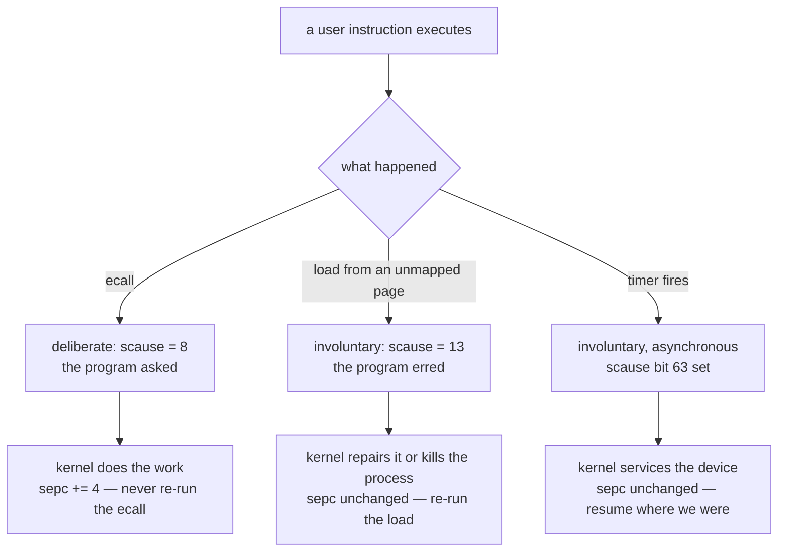

# User Mode II: System Calls

## Overview

Last session built the wall: a separate address space, the `PTE_U` bit, the
trampoline, the trapframe. A wall with no door is a prison, and a program that
cannot print is useless. This session builds the door. A **system call** is a
function call whose callee lives on the other side of a privilege boundary, and
almost everything interesting follows from that one sentence: arguments go in
registers because there is no shared stack; the callee is named by a number
because there is no shared symbol table; the return restores a privilege level,
not just a program counter; and — the part that takes half this lecture — the
callee cannot trust a single bit that arrived from the caller, pointers least of
all. We cover `ecall` as a *deliberate* trap, the `a7`/`a0`-`a2`/`a0` ABI, the
dispatch table, the `sepc += 4` that separates "done" from "retry",
`copyin`/`copyout`, and the return path through `sret`. This is the rest of the
concept behind exercise `48k_user_mode`, which you wrote last Friday, and the
last material on Midterm 2, this Thursday; see also the
[RISC-V guide](../guides/riscv.md) and the
[Sv39 paging guide](../guides/sv39-paging.md).

## Learning Objectives

- **Distinguish** a deliberate trap (`ecall`) from an involuntary one (a page
  fault, a timer interrupt), and state what the kernel does differently for each.
- **Describe** the rv6 system-call ABI — number in `a7`, arguments in
  `a0`–`a2`, return value in `a0` — and trace where each of those values
  physically lives at every moment of the call.
- **Justify** dispatching on a small integer through a table rather than on a
  name, a string, or a function pointer.
- **Explain** why `sepc += 4` belongs on the `ecall` path and must *not* appear
  on the page-fault path, and predict the exact behavior when it is omitted.
- **Enumerate** the three independent reasons a kernel may not dereference a
  user-supplied pointer, and give a concrete rv6 address that demonstrates each.
- **Trace** `copyin` page by page over a buffer that straddles a page boundary,
  naming the physical addresses it touches.
- **Apply** the rule "never trust a number that crossed the boundary" to file
  descriptors, lengths, and system-call numbers.
- **Order** the steps of `usertrapret`/`userret` and explain why the last two
  instructions must execute on the trampoline page.

## Prerequisites

- L22 *User Mode I* and exercise `48k_user_mode` — the trampoline, the
  trapframe, `PTE_U`, and the drop into U-mode with `sret`.
- L18 *Traps, Privilege Modes, and Interrupts* — `stvec`, `scause`, `sepc`,
  `sstatus`, and rv6's `kerneltrap`.
- Exercise `33k_paging` / `39k_virtual_memory` and the
  [Sv39 paging guide](../guides/sv39-paging.md) — `walk`, PTE flags, and what a
  page table actually is.
- L08 *RISC-V Registers and the Calling Convention*, plus the
  [RISC-V guide](../guides/riscv.md) — argument registers and the ABI.
- The [memory map guide](../guides/memory-map.md) — where the UART, the PLIC,
  and RAM live in physical address space. Section 5 depends on it.
- The [Unsafe Rust and no_std guide](../guides/rust-unsafe-nostd.md) — raw
  pointers and `copy_nonoverlapping`, which is what `copyin` is built from.

---

## 1. Two Kinds of Trap

A trap is any event that yanks the CPU out of its instruction stream and into
the kernel's trap vector. rv6 has been taking traps since exercise 43k; what is
new is that they now arrive from *user mode*, and that one of them is on
purpose.

### The taxonomy



The hardware makes no distinction between these three. All of them save `pc`
into `sepc`, write a cause code into `scause`, record the old privilege level in
`sstatus.SPP`, disable interrupts, and jump to `stvec`. The *interpretation* is
entirely the kernel's, and it hinges on one question: **when this trap is over,
should the interrupted instruction run again?**

| `scause` | Meaning | Re-run the instruction? |
|---|---|---|
| `8` | Environment call from U-mode | **No** — the call has been performed |
| `9` | Environment call from S-mode | No |
| `12` | Instruction page fault | Yes, after mapping the page |
| `13` | Load page fault | Yes |
| `15` | Store/AMO page fault | Yes |
| `2` | Illegal instruction | Never resumes — kill the process |
| `3` | Breakpoint | No — step over it (`trap.rs:75`–`77`) |
| bit 63 set | Interrupt, not exception | Yes — nothing was wrong with it |

A page fault is a statement about the *machine*: this address is not usable,
do something about it. An `ecall` is a statement about the *program*: I would
like this done, and my registers say what. A complaint versus a request. rv6
handles them a few lines apart in `usertrap` — `usermode.rs:399` for the
`ecall`, `usermode.rs:428`–`433` for everything else, which kills the process —
and the difference between the branches is one line, `usermode.rs:401`.

> Key distinction: `ecall` is the *only* instruction whose entire purpose is to
> trap. It computes nothing, touches no memory, and has no operands. Its one
> effect is to raise an exception. Every other trap is a side effect of an
> instruction that was trying to do something else.

### Why an instruction, and not a call

Why not just `call kernel_write`? Three structural reasons.

A plain `jal` does not change the privilege level: jumping into kernel code with
user privilege is no better than staying in user mode, and the first CSR access
would fault. Privilege escalation must be a hardware transition, and the hardware
offers it at exactly one address — `stvec`.

The kernel's addresses are not in the user's address space, so there is no symbol
to link against. That is deliberate: the kernel can be recompiled, relocated, and
rearranged without touching a single user binary.

And entry must be *controlled*. If user code could jump anywhere in the kernel it
could land in the middle of a function, past the argument checks, with registers
of its choosing. Funneling every entry through one address — one place where the
kernel's assumptions are re-established from scratch — is what makes the boundary
auditable.

Every architecture spells this differently. PDP-11 Unix used `trap`, with the
call number in the instruction word itself. Early x86 Linux used `int 0x80`, a
software interrupt costing several hundred cycles — which is why Intel added
`sysenter` and AMD added `syscall` in the late 1990s. ARM uses `svc`. RISC-V
uses `ecall` for both U-to-S and S-to-M calls; the destination is implied by
where you already are.

---

## 2. The Convention Across the Wall

System calls have a calling convention for the same reason ordinary calls do,
with one extra constraint: **nothing on the stack can participate**. The kernel
is about to abandon the user's stack pointer entirely — it does not trust it and
cannot reach it without translation — so every value the kernel needs must be in
a register when `ecall` executes.

rv6 uses xv6's convention, which is RISC-V Linux's convention:

| Register | Before `ecall` | After the kernel returns |
|---|---|---|
| `a7` | the system-call **number** | unchanged |
| `a0` | first argument | the **return value** |
| `a1` | second argument | unchanged |
| `a2` | third argument | unchanged |

The choice of `a7` for the number rather than `a0` is not arbitrary. The
ordinary RISC-V ABI already puts the first argument in `a0`, the second in `a1`,
and so on. Putting the call number at the far end of the argument registers
means the kernel-side ABI and the user-side C ABI *agree on the arguments*: a
libc wrapper for `write(fd, buf, len)` finds its three arguments already in the
right registers, loads a constant into `a7`, and executes `ecall`.

Here is exercise 48k's first user program doing exactly that by hand
(`usermode.rs:249`–`262` in the exercise-18 tree):

```asm
    la   a1, user_msg           # a1 = buffer address (user virtual!)
    li   a2, 21                 # a2 = length
    li   a0, 1                  # a0 = fd 1, the console
    li   a7, 16                 # a7 = SYS_WRITE
    ecall                       # trap
```

### Where the arguments actually are

At the instant `ecall` executes, the arguments are in registers, and one
instruction later the kernel is running and about to use those same registers
for its own purposes. So `uservec` — the trampoline half that runs first —
spills all 31 general-purpose registers into the process's trapframe page before
a single line of Rust executes (`usermode.rs:96`–`127`).

By the time `usertrap` reads an argument it is not reading a register at all.
It is reading a field of a struct:

```text
  user mode                 trapframe page              kernel Rust
  ---------                 --------------              -----------
  a7 = 16     --uservec-->  tf.a7  (offset 168)  --->  dispatch(num, ...)
  a0 = 1      --uservec-->  tf.a0  (offset 112)  --->        a0
  a1 = 0x28   --uservec-->  tf.a1  (offset 120)  --->        a1
  a2 = 2      --uservec-->  tf.a2  (offset 128)  --->        a2

                            tf.a0  <---------------  return value
  a0 = 2      <--userret--  tf.a0
```

The struct is `Trapframe` (`usermode.rs:33`–`71`); the offsets in its comments
are the load/store displacements in the trampoline assembly, which is why the
field order is frozen. The read-out is four lines (`usermode.rs:402`–`407`), the
write-back one (`usermode.rs:408`):

```rust
let ret = crate::syscall::dispatch(
    (*tf).a7 as usize,
    (*tf).a0 as usize,
    (*tf).a1 as usize,
    (*tf).a2 as usize,
);
(*tf).a0 = ret as u64;
```

Writing the result into `tf.a0` is the entire return-value mechanism. Much
later `userret` reloads every register from this page, and because one field
changed, the program wakes up with a different `a0`. The value "returned" from
the kernel spent its whole life as a `u64` in a page of RAM.

### Return values and the -1 convention

rv6's `dispatch` returns an `isize` and every handler returns `-1` on failure —
xv6's convention. Linux packs more into the same register: a return in the range
`-4095..=-1` is an error whose negation is the `errno`; libc notices, stores it
in the thread-local `errno`, and returns `-1` to the caller. One register, two
conventions, stacked. A system call cannot return a `Result` because the
boundary transports exactly 64 bits; every richer convention is an encoding
squeezed into that one word.

---

## 3. Dispatch: A Table Indexed by a Number

The kernel now has a number in hand and needs to run the right handler. rv6's
answer is `syscall.rs:33`–`46`:

```rust
pub fn dispatch(num: usize, a0: usize, a1: usize, a2: usize) -> isize {
    match num {
        SYS_FORK => sys_fork(),
        SYS_EXIT => sys_exit(a0 as isize),
        // ...
        SYS_WRITE => sys_write(a0, a1, a2),
        _ => -1,
    }
}
```

Three design decisions are hiding in those fourteen lines.

**The interface is a number, not a name.** A number needs no symbol table, no
string comparison, no relocation, and no agreement about encoding; it fits in a
register and is bounds-checked in one instruction. Most importantly it is
*stable*: `16` means `write` across rebuilds, versions, and whole
reimplementations. Linus Torvalds's "we do not break userspace" rule is enforced
at exactly this table — Linux has never reused a number, which is why i386 still
carries `oldolduname` (59) as a live entry.

**The table is indexed, not searched.** rv6 writes a `match`, which the compiler
turns into a jump table or a short comparison chain. xv6 is more literal:
`static uint64 (*syscalls[])(void)`, called as `syscalls[num]()` after a bounds
check. Linux does the same at industrial scale — `sys_call_table`, indexed by
the number in `rax` (x86-64) or `a7` (riscv64), guarded against `NR_syscalls`.
Dispatch is O(1) however many calls exist, which matters when the count is 350+.

**The default arm returns, it does not panic.** `_ => -1` at `syscall.rs:44` is
a security property, not politeness: the number in `a7` is chosen entirely by the
user program. If an unrecognized number could panic, index out of bounds, or jump
through an uninitialized slot, any program could halt the machine with two
instructions. The rule *a user program must never be able to crash the kernel
with a bad argument* has its first application right here.

> Key distinction: the number is an index into a table the kernel owns; it is
> **not** a function pointer. If the ABI passed a pointer, the user would be
> choosing which kernel code runs, which is the whole game lost in one move.
> The indirection through a number is what keeps the choice of callee inside the
> kernel.

### The numbers themselves

rv6 uses xv6's numbers verbatim, which is why they have gaps
(`syscall.rs:21`–`29`):

| # | rv6 | # | rv6 |
|---|---|---|---|
| 1 | `fork` | 11 | `getpid` |
| 2 | `exit` | 15 | `open` |
| 3 | `wait` | 16 | `write` |
| 5 | `read` | 21 | `close` |
| 7 | `exec` | | |

The missing numbers are xv6 calls rv6 does not implement — 4 is `pipe`, 6
`kill`, 8 `fstat`, 10 `dup`, 13 `sleep`. Keeping the holes rather than
renumbering means every later exercise adds a call without disturbing anything.

None of these match Linux. On `riscv64` Linux — the modern
architecture-independent numbering from `asm-generic/unistd.h` — `read` is 63,
`write` is 64, `exit` is 93, and there is no `open` at all, only `openat` at 56.
The numbers are an ABI, and the ABI is per-kernel: an rv6 binary and a Linux
binary both execute `ecall` and mean entirely different things by it.

---

## 4. `sepc += 4`, and the Difference Between Done and Retry

When any trap fires, the hardware writes into `sepc` the address of the
instruction that caused it — **not** the following one. For a page fault that is
exactly right: the kernel maps the missing page, `sret` returns to the same load,
and this time it succeeds. Retrying is the point. For `ecall`, retrying is a
disaster: the call has already been performed by the time the kernel returns.

```text
  without the +4:                        with the +4:

  0x14:  li   a7, 16                     0x14:  li   a7, 16
  0x18:  ecall      <--+                 0x18:  ecall
  0x1c:  li   a7, 11   |                 0x1c:  li   a7, 11   <-- resumes here
  ...                  |                 ...
         sepc = 0x18 --+  forever               sepc = 0x18 + 4 = 0x1c
```

The symptom is a program that prints its message over and over and never reaches
its second system call. It is not a hang: the kernel is doing useful work tens of
thousands of times a second for a program making no progress. rv6 fixes it in one
line, at `usermode.rs:401`:

```rust
(*tf).epc += 4;
```

Note *where* it is written. The kernel does not modify the `sepc` CSR here; it
modifies the saved copy in the trapframe, which `usertrapret` installs into
`sepc` much later (`usermode.rs:459`). Every trap saves `sepc` into `tf.epc`
first (`usermode.rs:396`–`397`), and everything after works on that copy —
which matters because the process may be descheduled and resumed several times
in between, overwriting the CSR, while the trapframe field survives.

Why 4 and never 2? RISC-V's compressed extension gives many instructions 2-byte
forms, and rv6 targets `riscv64gc`. But `ecall` has no compressed encoding: it
is always 32 bits, so `+= 4` is always right. `trap.rs:75`–`77` does the same
for `ebreak`, also never compressed.

> Key distinction: advance `sepc` when the trap **completed** the work
> (`ecall`, `ebreak`, an emulated instruction). Leave `sepc` alone when the trap
> reported a **condition** that the kernel is about to remove (a page fault) or
> that was never the instruction's fault at all (an interrupt). Getting this
> backwards on a page fault silently skips an instruction; getting it backwards
> on `ecall` produces an infinite loop.

Real kernels have a third case. When a signal interrupts a blocked system call,
Linux returns `-ERESTARTSYS` internally and rewinds the user program counter by
the width of the `syscall` instruction so the call re-executes after the handler
returns: `sepc -= 4`, deliberately — the mirror image of the line you write in
exercise 48k.

---

## 5. The Security Boundary

Everything so far has been plumbing. This section is the idea.

`sys_write(fd, buf, len)` receives `buf`: a 64-bit number the user program chose,
which is supposedly a pointer to bytes the kernel needs. The tempting code is one
line:

```rust
let bytes = core::slice::from_raw_parts(buf as *const u8, len); // CATASTROPHE
```

That line is wrong three separate times, and the three are independent: remove
any two and the third still sinks you.

### Reason 1: the number means something else here

A virtual address has no meaning without a page table. The user's `buf = 0x28`
was translated through the *user's* table; the kernel is running with `satp`
pointing at the *kernel's* (`uservec` switched it at `usermode.rs:134`). The
same 64-bit number now names a completely different byte of physical memory —
or none. rv6's kernel table, built by `kvmmake` (`vm.rs:125`–`174`), maps:

```text
  user's view                        the kernel's view of the SAME number
  ---------------------------        ------------------------------------
  0x0000_0028   program code         unmapped (page 0 is not in kvmmake)
  0x0001_0000   the stack page       unmapped
  0x0010_0000   (unmapped)           TEST_FINISHER — the QEMU power-off register
  0x0C00_2080   (unmapped)           a live PLIC control register
  0x1000_0000   (unmapped)           the UART transmit register
  0x8004_1000   (unmapped)           kernel code and data, identity mapped
```

Read that table twice. Passing `buf = 0x100000` to a kernel that dereferences
raw pointers does not read the program's memory; it reads the machine's power-off
register. `0x1000_0000` pokes the serial port. Anything above `0x8000_0000` reads
the kernel image. None of these is a bug in the user program — the numbers are
legal user addresses. The bug is the kernel's, for assuming a number carries its
address space with it.

### Reason 2: the kernel has permission and the user does not

Suppose the kernel *did* have the user's mappings available. Reason 1 goes away
and reason 2 walks in: supervisor mode outranks every check that stops the user
program.

Consider `buf = 0x3F_FFFF_E000` — `TRAPFRAME`. That page *is* mapped in the
user's table (`proc.rs:165`), so a naive translation succeeds. But it is mapped
**without `PTE_U`**, precisely so user code cannot touch it. A user program that
loads from it faults; a kernel that copies from it on the user's behalf hands
the program its own saved registers, `kernel_satp` and the address of `usertrap`
included — the kernel's page-table root and a kernel code address, gift-wrapped.
One page higher is `TRAMPOLINE`, the kernel's code.

This is the **confused deputy**: a privileged agent tricked into misusing its
authority for a caller who lacks it. Norm Hardy named it in 1988, describing a
compiler induced to overwrite its own billing file; four decades on it is still
the shape of most kernel vulnerabilities.

Hardware eventually grew an interlock for it. RISC-V has the **SUM** bit
(`sstatus` bit 18, "permit Supervisor User Memory access"): when it is clear,
supervisor-mode loads and stores to `PTE_U` pages *fault*, even though
supervisor mode otherwise outranks the check. x86 calls this SMAP, ARM calls it
PAN, and matching bits (SMEP, PXN) forbid the kernel to *execute* user pages.
rv6 never sets SUM, so hardware backs the software discipline.

### Reason 3: a fault in the kernel is not survivable

The quietest reason. Suppose `buf` is simply not mapped — null, stale, or past
the end of the program's memory. In user mode that is a page fault, and rv6
handles it gracefully: `usertrap`'s final `else` records the cause and ends the
process (`usermode.rs:428`–`433`). One program dies; the machine lives.

Take the same fault in kernel mode. It goes to `kernelvec` and `kerneltrap`
(`trap.rs:46`), which handles interrupts and `scause == 3` and falls off the end
of the function for anything else (`trap.rs:73`–`80`). The assembly restores
registers and executes `sret`, returning to `sepc` — the faulting instruction —
which faults again, immediately, forever. A user pointer of `0` has hung the
whole kernel, and there is no process to kill, because the faulting code *is*
the kernel.

This is why kernels that *do* dereference user pointers directly — Linux's
`get_user`/`put_user` fast paths — register those instructions in an **exception
table**: when a fault's `pc` appears in it, the handler does not panic, it
rewrites the return address to an error path. An enormous amount of machinery
whose only purpose is to make one load survivable. rv6 takes the simpler road.

### The answer: translate in software

`copyin` and `copyout` do in software what the hardware would have done: walk
the *user's* page table, apply the checks the hardware would have applied, and
copy through the resulting physical address — which the kernel can reach because
RAM is identity-mapped. The checks live in `walkaddr` (`vm.rs:252`–`261`):

```rust
pub unsafe fn walkaddr(table: *mut Pte, va: usize) -> usize {
    if va >= crate::memlayout::MAXVA {
        return 0;
    }
    let pte = walk(table, va, false);
    if pte.is_null() || !(*pte).is_valid() || (*pte).flags() & PTE_U == 0 {
        return 0;
    }
    (*pte).pa()
}
```

Four rejections, each closing one of the holes above. The `MAXVA` test rejects
addresses too large for Sv39 before `walk` can index off the end of a page-table
page. `pte.is_null()` catches a missing upper level — `walk` is called with
`alloc = false`, so absence is a refusal, not an allocation. `is_valid()` catches
an unmapped leaf. And `flags() & PTE_U == 0` is reason 2 in software: **a page
the user cannot reach itself, the kernel will not reach on its behalf.** That
one conjunct is why `buf = TRAPFRAME` returns an error instead of a register
dump.

With translation available, the copy is a loop over pages (`vm.rs:291`–`309`):

```rust
while copied < dst.len() {
    let va0 = pgrounddown(srcva);       // the page this address lives on
    let pa0 = walkaddr(table, va0);     // where that page really is
    if pa0 == 0 { return Err(()); }
    let off = srcva - va0;
    let mut n = PGSIZE - off;           // bytes left on this page
    if n > dst.len() - copied { n = dst.len() - copied; }
    ptr::copy_nonoverlapping((pa0 + off) as *const u8, dst.as_mut_ptr().add(copied), n);
    copied += n;
    srcva = va0 + PGSIZE;
}
```

The loop is per-page for a reason that is easy to state and easy to forget:
**contiguous in virtual address space does not mean contiguous in physical
memory.** A 100-byte buffer at user address `0x0FC0` is the last 64 bytes of one
physical page and the first 36 of another, and `kalloc` handed those two pages
out at unrelated times.

```text
  user VA:   0x0FC0 ..... 0x0FFF | 0x1000 ................. 0x1023
             \_ 64 bytes _/        \______ 36 bytes ______/
                  |                          |
  walkaddr(0x0000) -> 0x8721_2000     walkaddr(0x1000) -> 0x8704_9000
                  |                          |
  phys:      0x8721_2FC0 .. 0x8721_2FFF | 0x8704_9000 .. 0x8704_9023

  two iterations, two walks, two copies, one apparently simple buffer
```

`copyout` (`vm.rs:268`–`286`) is the same loop reversed; `copyinstr`
(`vm.rs:317`–`342`) is the same loop for a value whose length the kernel does not
know in advance — a path string — copying byte by byte, watching for the NUL, and
giving up rather than running past the destination.

### Never trust a number that crossed the boundary

Pointers are the dramatic case, but the rule is general: **every value that
crossed the wall is adversarial input, pointer or not.**

- **The call number.** Bounded by `_ => -1` at `syscall.rs:44`.
- **The file descriptor.** `getfile` (`syscall.rs:312`–`322`) tests
  `fd >= NOFILE` *before* indexing `(*p).ofile[fd]`, and then tests that the
  slot is actually open. Rust's bounds check would catch the first, but as a
  panic — which in a `no_std` kernel is a halt. A user-triggerable panic is a
  denial-of-service, so the check comes first and returns `-1`.
- **The length.** `sys_write` never allocates a buffer of the user's size. It
  declares a fixed 64-byte kernel buffer and loops (`syscall.rs:528`–`537`), so
  `len = 0xFFFF_FFFF` costs time, not memory. A kernel stack in rv6 is one 4 KiB
  page; a user-controlled stack allocation is a stack overflow waiting to be
  requested.
- **The access mode.** `sys_write` rejects a descriptor that is not `writable`
  (`syscall.rs:522`) even though the same process opened it — the check belongs
  at use, not only at open.

And one rv6 avoids by construction but you should know: **time of check to time
of use**. On a multi-core kernel another thread of the same process can change
the memory a pointer names *between* validation and use. That is why the
discipline is "translate and copy" rather than "validate, then dereference":
`copyin` produces a private kernel copy no user thread can modify afterwards.
rv6 runs on one hart, so the window does not exist — but the habit is the point.

---

## 6. The Return Path

The way back is `usertrapret` (`usermode.rs:440`–`467`), which prepares, and
`userret` (`usermode.rs:139`–`181`), which executes. The split is not stylistic:
everything doable in Rust is done in Rust, and what is left is the handful of
instructions that cannot survive being on an ordinary page.

| Step | Code | Why here, why now |
|---|---|---|
| 1. Point `stvec` back at `uservec` | `usermode.rs:443`–`445` | While kernel code ran, `stvec` pointed at `kernelvec` (set at `usermode.rs:387`). The next trap will come from user mode and must land on the trampoline. |
| 2. Refill `kernel_satp`, `kernel_sp`, `kernel_trap` | `usermode.rs:447`–`451` | Notes the *next* `uservec` will read to get back into the kernel. They are re-written every time because the process may have been rescheduled. |
| 3. `sstatus.SPP = 0` | `usermode.rs:455` | `sret` returns to the mode named by `SPP`. Leave it at 1 and you return to supervisor mode running user code — total privilege escalation. |
| 4. `sstatus.SPIE = 1` | `usermode.rs:456` | `sret` copies `SPIE` into `SIE`, so the program runs with interrupts on and the timer can preempt it. |
| 5. `sepc = tf.epc` | `usermode.rs:459` | The resume address, `+ 4` past the `ecall`. |
| 6. Compute the user `satp` | `usermode.rs:461` | Mode bits plus the page-table root; not installed yet. |
| 7. Jump to `userret` on the trampoline | `usermode.rs:463`–`466` | A `transmute` to a function pointer at `TRAMPOLINE + offset`, passing `satp` in `a0`. |
| 8. `csrw satp` + `sfence.vma` | `usermode.rs:140`–`142` | The address space changes underfoot. Only code on the doubly-mapped trampoline survives it. |
| 9. Reload 31 registers from `TRAPFRAME` | `usermode.rs:146`–`178` | Including the modified `a0` — the return value. |
| 10. `sret` | `usermode.rs:181` | `pc = sepc`, mode = `SPP`, `SIE = SPIE`. |

Two details in that sequence repay a second look.

**Step 7 into 8 is why the trampoline exists.** Step 8 changes `satp`, and the
instruction *after* it is fetched through the new table. At an ordinary kernel
address — unmapped in the user's table — the CPU would fetch garbage or fault
with no reachable vector. The trampoline is mapped at the identical virtual
address `TRAMPOLINE` in the kernel table (`vm.rs:169`) and in every user table
(`proc.rs:164`), so the program counter's meaning does not change when
everything else's does.

**Step 9 has an ordering puzzle.** `userret` needs a pointer to the trapframe to
reload registers, but it is about to overwrite every register, including the one
holding that pointer. The fix is `li a0, TRAPFRAME` (`usermode.rs:144`): the
trapframe's *virtual* address is a compile-time constant, identical in every
process, so it can be materialized from nothing. The last instruction before
`sret` is then `csrrw a0, sscratch, a0` (`usermode.rs:180`), which restores the
user's `a0` from `sscratch` and leaves `TRAPFRAME` in `sscratch` — where
`uservec` finds it on the next trap (`usermode.rs:94`).

---

## 7. One Full Round Trip

`write(1, "hi", 2)`, end to end, on a process whose code page sits at physical
`0x8721_2000`.

```mermaid
sequenceDiagram
    autonumber
    participant U as user program
    participant HW as hardware
    participant V as uservec
    participant K as usertrap / dispatch
    participant R as usertrapret / userret

    U->>HW: ecall, with a7=16 a0=1 a1=0x28 a2=2
    HW->>HW: sepc=0x18, scause=8, SPP=1, SIE=0
    HW->>V: pc = stvec = TRAMPOLINE
    V->>V: swap a0 with sscratch, park 31 regs in TRAPFRAME
    V->>V: sp = kernel_sp, satp = kernel_satp, sfence
    V->>K: jr kernel_trap
    K->>K: stvec = kernelvec; tf.epc = sepc = 0x18
    K->>K: scause is 8, so tf.epc = 0x1c
    K->>K: dispatch 16, 1, 0x28, 2
    K->>K: getfile 1 gives the console, writable
    K->>K: copyin walks user table: 0x28 becomes 0x8721_2028
    K->>K: 2 bytes into a kernel buffer, then uart putc h, i
    K->>K: tf.a0 = 2
    K->>R: usertrapret
    R->>R: stvec = uservec, SPP = 0, SPIE = 1, sepc = 0x1c
    R->>R: jump to userret on the trampoline, satp = user table
    R->>R: reload 31 regs from TRAPFRAME, a0 is now 2
    R->>U: sret
    U->>U: resumes at 0x1c with a0 = 2
```

### What that cost

Count the work: one trap, 31 stores, four `sfence.vma` (each a TLB flush), a
Rust dispatch, a three-level page-table walk *per page* of the buffer, a two-byte
copy, 31 loads, and an `sret` — for two bytes of output. On real hardware a Linux
system call is 50–200 ns of pure overhead, and worse since 2018: the Meltdown
mitigation (KPTI) unmaps the kernel from the user page table, adding two more
page-table switches per call.

Which is why the modern answer to "make I/O faster" is almost never "make the
trap faster" and almost always "**take fewer traps**". libc's buffered I/O turns
a thousand `putchar` calls into one `write`. Linux's **vDSO** maps real kernel
code into every process so `gettimeofday` traps not at all. `io_uring` replaces
the trap with two shared-memory rings, so a thousand I/O requests can cost one
system call — or, with a polling kernel thread, zero.

---

## Key Concepts

| Concept | Definition | Example |
|---|---|---|
| System call | A request from user mode for a service only the kernel can perform, made by trapping deliberately | `write(1, buf, 2)` |
| `ecall` | The RISC-V instruction whose only effect is to raise an environment-call exception | `scause = 8` from U-mode |
| System-call ABI | The register contract for crossing the boundary | number in `a7`, args `a0`–`a2`, result in `a0` |
| Trapframe | The per-process page where all 31 user registers are parked on every trap | `tf.a7` at offset 168, `usermode.rs:56` |
| Dispatch table | A kernel-owned mapping from call number to handler, indexed not searched | `syscall.rs:33`–`46` |
| `sepc` advance | Adding the instruction width to the saved PC so a completed trap does not re-run | `(*tf).epc += 4`, `usermode.rs:401` |
| `PTE_U` | The page-table bit that says "user mode may touch this page" | `vm.rs:23`; trampoline and trapframe lack it |
| `walkaddr` | Software translation of a user VA to a PA, with the checks that make it safe | `vm.rs:252`–`261` |
| `copyin` / `copyout` | Page-at-a-time copy across address spaces using the user's page table | `vm.rs:291`, `vm.rs:268` |
| Confused deputy | A privileged agent tricked into using its authority for a caller who lacks it | `write(1, TRAPFRAME, 288)` |
| SUM bit | `sstatus` bit that, when clear, forbids supervisor access to `PTE_U` pages | RISC-V's SMAP/PAN |
| `usertrapret` / `userret` | The prepare-then-execute return path ending in `sret` | `usermode.rs:440`, `usermode.rs:139` |

---

## Practice Problems

### Problem 1: Classify the trap

For each of the following register states captured on entry to a trap from user
mode, name the event, say whether `sepc` should be advanced before returning,
and say which branch of `usertrap` handles it in rv6.

```text
(a) scause = 0x0000000000000008   sepc = 0x0000000000000018
(b) scause = 0x000000000000000D   sepc = 0x0000000000000064   stval = 0x9000
(c) scause = 0x8000000000000001   sepc = 0x000000000000002C
(d) scause = 0x0000000000000002   sepc = 0x0000000000001004
```

<details>
<summary>Click to reveal solution</summary>

**(a)** `scause = 8`: environment call from U-mode, a system call. **Advance**
`sepc` by 4 — the call has been performed, and re-running it would repeat it
forever. The `if scause == 8` branch, `usermode.rs:399`.

**(b)** `scause = 13`: load page fault, with `stval = 0x9000` the untranslatable
address. With demand paging you would map the page and **not** advance `sepc`, so
the load retries. rv6 has no demand paging, so this falls into the final `else`
at `usermode.rs:428` and kills the process.

**(c)** Bit 63 set means *interrupt*, not exception; low bits say cause 1, a
supervisor software interrupt — rv6's forwarded timer tick. **Do not advance**
`sepc`; the interrupted instruction never ran. Handled at
`usermode.rs:409`–`427`, which clears the pending bit in `sip`.

**(d)** `scause = 2`: illegal instruction, most likely a CSR read, which U-mode
may not do. Advancing `sepc` is meaningless — the process is not resuming.

The pattern to memorize: bit 63 distinguishes interrupt from exception; among
exceptions, only the deliberate ones (8, 3) advance `sepc`.

</details>

### Problem 2: The missing line

A student's `usertrap` omits `(*tf).epc += 4`. They run exercise 48k's user
program:

```asm
    li a0, 1 ; la a1, msg ; li a2, 21 ; li a7, 16 ; ecall   # write
    li a7, 11 ; ecall                                       # getpid
    addi a0, a0, 41 ; li a7, 2 ; ecall                      # exit
```

(a) Exactly what appears on the console? (b) Does the machine hang, spin, or
panic? (c) A second student instead writes `+= 8`. What happens?

<details>
<summary>Click to reveal solution</summary>

**(a)** `hello from user mode` printed endlessly, with no newline problems and
no other output — the program never reaches the `getpid` at the second `ecall`.
Each round trip re-executes the same `ecall` with `a7` still 16, `a0` still 1,
`a1` still the message address and `a2` still 21, because `userret` faithfully
restores every register to its pre-trap value.

**(b)** Neither a hang nor a panic: a **livelock**. The kernel runs correctly
and at full speed, forever. Under the OSlings harness the user-tick watchdog does
not fire — the process traps constantly rather than spinning in user mode — so it
is the wall-clock deadline (`SCHED_TIMEOUT_TICKS`, `usermode.rs:221`) that
eventually reports `TimedOut`. Recognize the repeated line on sight.

**(c)** `+= 8` skips one instruction after each `ecall`. Execution resumes at
`li a7, 11`'s *successor* — the second `ecall` — with `a7` still 16, so the
message prints twice. Every syscall silently eats the instruction that was to set
up the next one. The resume address is data the kernel computes on the user's
behalf, and arithmetic errors in it are detected by nothing.

</details>

### Problem 3: Three hostile pointers

A user program on rv6 executes three system calls in turn. Its code page is
mapped at user VA `0x0`, its stack page at `0x1_0000`; `TRAPFRAME` is
`0x3F_FFFF_E000`. For each, say what `sys_write` returns and *which line* of
which function rejects it.

```text
(i)   write(1, 0x3FFFFFE000, 32)
(ii)  write(1, 0x80200000, 32)
(iii) write(1, 0x4000000000, 32)
```

<details>
<summary>Click to reveal solution</summary>

All three return **-1**, and all three are stopped inside `walkaddr`
(`vm.rs:252`–`261`), which `copyin` calls once per page.

**(i)** `TRAPFRAME`. The address *is* mapped in the user's table — that is how
`uservec` reaches it — so `walk` succeeds and the PTE is valid. The rejection is
the third conjunct at `vm.rs:257`, `flags() & PTE_U == 0`: `proc_pagetable` maps
it `PTE_R | PTE_W` only (`proc.rs:165`). The important case, because two of the
four checks passed; without the `PTE_U` test the kernel would have handed the
program `kernel_satp` and the address of `usertrap`.

**(ii)** A kernel address, below `MAXVA` (`1 << 38` = `0x40_0000_0000`), so the
first test passes — but nothing in the *user's* table maps it; the kernel's
identity mapping lives in a different tree. `walk` returns null or an invalid
PTE, and `vm.rs:257` rejects it. The address would be perfectly readable if
dereferenced raw: the protection comes entirely from consulting the right table.

**(iii)** Exactly `MAXVA`. Rejected by the first test, `vm.rs:253`, before `walk`
runs at all — `walk` indexes page-table pages with 9-bit slices of the address,
and an out-of-range VA would produce a nonsense index the kernel then
dereferences.

Follow-up: `write(1, 0x0FF0, 32)`. The first 16 bytes are on the mapped code
page and copy fine; the next 16 are on unmapped page `0x1000`, so the *second*
loop iteration fails and `sys_write` returns -1 — after 16 bytes have already
landed in the kernel buffer. Partial work before an error is normal here.

</details>

### Problem 4: Trace `copyin` across a page boundary

The kernel calls `vm::copyin(pt, &mut dst[..100], 0x0FC0)` where `dst` is a
100-byte kernel buffer. The user page table contains:

| user VA page | physical page |
|---|---|
| `0x0000` | `0x8721_2000` |
| `0x1000` | `0x8704_9000` |
| `0x2000` | not mapped |

How many loop iterations run, and what are the source physical address and byte
count of each `copy_nonoverlapping`?

<details>
<summary>Click to reveal solution</summary>

**Two** iterations.

*Iteration 1.* `srcva = 0x0FC0`. `va0 = pgrounddown(0x0FC0) = 0x0000`.
`walkaddr` returns `0x8721_2000`. `off = 0x0FC0 - 0x0 = 0xFC0 = 4032`.
`n = PGSIZE - off = 4096 - 4032 = 64`. Since `64 < 100 - 0`, `n` stays 64. Copy
64 bytes from `0x8721_2000 + 0xFC0 = 0x8721_2FC0`. Then `copied = 64` and
`srcva = 0x0000 + 0x1000 = 0x1000`.

*Iteration 2.* `va0 = 0x1000`, `walkaddr` returns `0x8704_9000`, `off = 0`,
`n` starts at 4096 but `dst.len() - copied = 36`, so `n = 36`. Copy 36 bytes from
`0x8704_9000`; `copied = 100` and the loop ends.

`srcva` is set to `va0 + PGSIZE`, not `srcva + n`, which is why `off` is zero
from the second iteration on. And the two physical addresses are about 1.8 MiB
apart: a single `copy_nonoverlapping` of 100 bytes from `0x8721_2FC0` would have
read 36 bytes belonging to another process.

</details>

### Problem 5: Reorder the return path

A student rewrites `usertrapret` so that it installs the user page table itself,
in Rust, just before jumping to the trampoline:

```rust
asm!("csrw sepc, {}", in(reg) (*tf).epc as usize);
let user_satp = vm::make_satp((*p).pagetable);
asm!("sfence.vma zero, zero");
asm!("csrw satp, {}", in(reg) user_satp);     // <-- moved here
asm!("sfence.vma zero, zero");
let f: extern "C" fn(usize) -> ! = core::mem::transmute(tramp_userret);
f(user_satp)
```

What happens, and at exactly which instruction?

<details>
<summary>Click to reveal solution</summary>

The kernel dies at the instruction *immediately after* `csrw satp`.

`usertrapret` is ordinary kernel code living somewhere in the kernel image, at a
virtual address around `0x8000_xxxx`, mapped by `kvmmake`'s identity mapping of
`KERNBASE..PHYSTOP` (`vm.rs:141`–`149`). The user page table does not map that
range at all — a user table has the program's pages, the stack page, the
trampoline, and the trapframe, and nothing else.

The `csrw satp` retires. The CPU then fetches the next instruction from `pc`,
still around `0x8000_xxxx`, now translated through the user table — where it is
unmapped. That is an instruction page fault (`scause = 12`) in supervisor mode.
It vectors through `stvec`, which this code has already aimed at `uservec`, so we
land on the trampoline with `SPP = 1`, `uservec` wrecks the trapframe, and the
kernel stack pointer it loads belongs to a trap that never came from user mode.
The QEMU symptom is a reset loop.

The kernel stack is broken too: even if the fetch had worked, `sp` still points
into the kernel's stack page, likewise unmapped, so the next `sd` would fault.

This is the whole justification for the trampoline in one experiment. Only code
whose *own* address means the same thing before and after the `satp` write can
survive the write, and the trampoline is the one page mapped at the same VA in
both tables (`vm.rs:169`, `proc.rs:164`).

</details>

### Problem 6: Follow one value

`write(1, buf, 2)` where `buf = 0x28`. Name the physical storage location of the
value `2` (the length argument) at each of these five moments, and the value in
the user's `a0` register at each.

```text
(1) the instruction before ecall
(2) inside dispatch, in the kernel
(3) inside copyin's call to copy_nonoverlapping
(4) the instruction after sret
(5) after the following li a7, 11
```

<details>
<summary>Click to reveal solution</summary>

**(1)** The `2` is in the CPU register `a2`; `a0` holds `1` (the fd). Neither is
in memory. The values exist only in the register file.

**(2)** The `2` is in the trapframe page in RAM, at `TRAPFRAME + 128`
(`usermode.rs:51`), *and* in a kernel register as `dispatch`'s third parameter —
`uservec` stored it, `usertrap` loaded it back (`usermode.rs:406`). `a0` in the
user's saved state is still `1`, at `TRAPFRAME + 112`; the CPU's live `a0` is
now the kernel's first argument to `dispatch`.

**(3)** The `2` is `copyin`'s `n` local, in a register or spilled to the kernel
stack — one page from `kalloc`, `(*p).kstack`. The *user's* `a0` is untouched,
still `1` in the trapframe. The buffer bytes are read from wherever `walkaddr`
resolved `0x28` and written into `sys_write`'s 64-byte kernel buffer
(`syscall.rs:528`).

**(4)** `a2` still holds `2` — the kernel never changed `tf.a2`, and `userret`
reloaded it (`usermode.rs:159`). `a0` now holds `2` as well, but for an entirely
different reason: it is the *return value*, written by `(*tf).a0 = ret as u64`
at `usermode.rs:408` and reloaded by the final `csrrw a0, sscratch, a0` at
`usermode.rs:180`. Two registers with the same value and no relationship.

**(5)** Unchanged — `li a7, 11` touches only `a7`, so `a0` is still `2`. That
is harmless because `getpid` takes no arguments and the kernel overwrites `a0`
with the pid on return. Had it taken one, the program would have had to reload
`a0` itself: user code sets up its own arguments on every call.

</details>

---

## Further Reading

- [RISC-V guide](../guides/riscv.md) — the argument registers, `ecall`, and the
  privileged CSRs (`scause`, `sepc`, `sstatus`, `stvec`, `sscratch`).
- [Sv39 paging guide](../guides/sv39-paging.md) — `walk`, PTE flags, and why
  `walkaddr` is a software MMU.
- [Memory map guide](../guides/memory-map.md) — the physical addresses in
  section 5's table: UART, PLIC, test finisher, RAM.
- [rv6 Architecture](../guides/rv6-architecture.md) — where `syscall.rs`,
  `usermode.rs`, and `vm.rs` sit relative to each other.
- [Unsafe Rust and no_std guide](../guides/rust-unsafe-nostd.md) —
  `copy_nonoverlapping`, raw pointer arithmetic, and `transmute`.
- [Cheatsheet](../guides/cheatsheet.md) — the `scause` codes and the trapframe
  offsets, for the exam.
- *xv6: a simple, Unix-like teaching operating system*, chapter 4 ("Traps and
  system calls") — rv6's `usertrap`, `copyin`, and dispatch table are this
  chapter, in Rust.
- *The RISC-V Instruction Set Manual, Volume II: Privileged Architecture*,
  §4.1.1 (`sstatus`, including SUM and MXR) and §10 (Sv39).
- Norm Hardy, "The Confused Deputy" (*ACM SIGOPS OSR*, 1988) — four pages, and
  the origin of the argument in section 5.2.
- "Anatomy of a system call", LWN.net (David Drysdale, 2014), parts 1 and 2 —
  how Linux gets from `syscall` to `sys_write`, including the exception table.
- Lipp et al., "Meltdown: Reading Kernel Memory from User Space" (USENIX
  Security 2018) — why the kernel is no longer mapped into your address space.

---

## Summary

1. **A system call is a function call across a privilege boundary.** Everything
   unusual about its convention — registers only, a number instead of a name, a
   return that restores a privilege level — follows from the fact that the two
   sides share no stack, no symbols, and no trust.
2. **`ecall` is the only deliberate trap.** It computes nothing; its sole effect
   is to raise `scause = 8` and vector to `stvec`. Page faults and interrupts
   use the identical hardware mechanism and mean the opposite thing.
3. **The ABI is `a7` for the number, `a0`–`a2` for arguments, `a0` for the
   result.** Putting the number last keeps the argument registers exactly where
   the ordinary C calling convention already placed them.
4. **The arguments live in the trapframe, not in registers.** `uservec` spills
   all 31 registers before any Rust runs; `usertrap` reads fields of a struct;
   writing `tf.a0` *is* the return-value mechanism.
5. **Dispatch is a table indexed by a small integer the kernel owns.** O(1),
   bounds-checked, stable across kernel versions, and — critically — the unknown
   case returns `-1` rather than panicking, because the number is chosen by the
   adversary.
6. **`sepc += 4` marks the call as completed.** Advance the saved PC for traps
   whose work is done; leave it alone for faults you are about to repair and for
   interrupts. Omitting it produces an infinite, fully functional loop.
7. **The kernel may never dereference a user pointer, for three independent
   reasons.** It means something else in the kernel's page table; the kernel
   outranks the permission checks that protect kernel pages, making it a
   confused deputy; and an unmapped address faults in supervisor mode, where
   rv6 has nowhere to go but a reset loop.
8. **`copyin`/`copyout` are a software MMU with a security policy.**
   `walkaddr` translates through the *user's* page table and refuses anything
   above `MAXVA`, unmapped, or lacking `PTE_U`; the copy proceeds one page at a
   time because contiguous virtual addresses are not contiguous physical ones.
   The same suspicion applies to every other number that crossed the wall.
