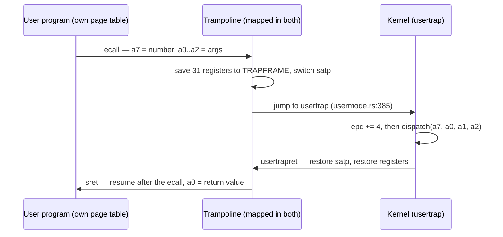
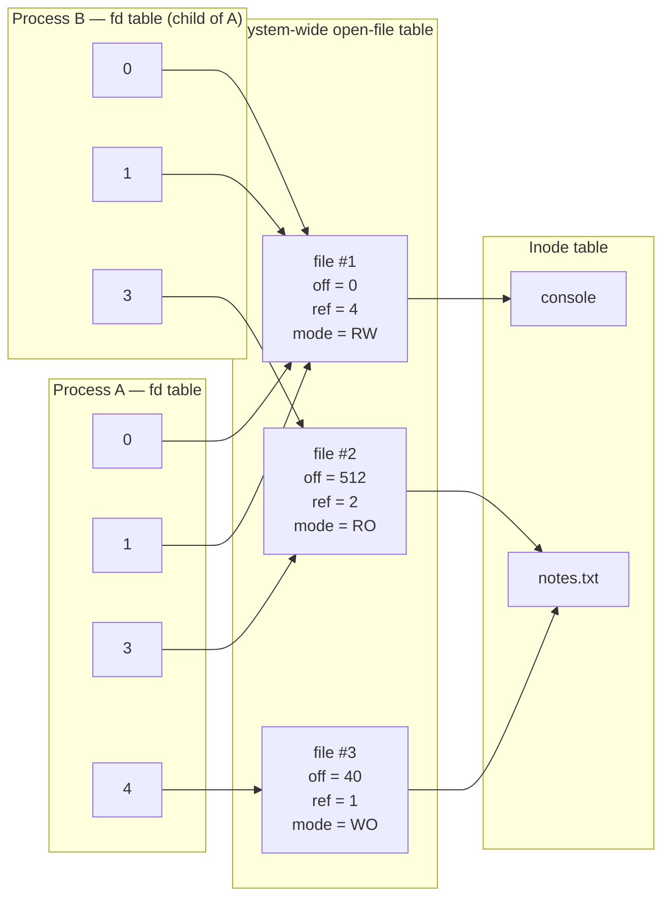
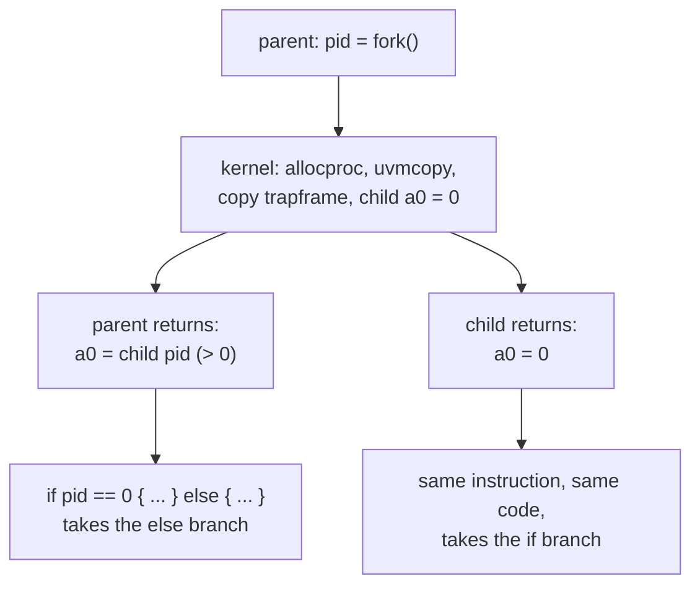
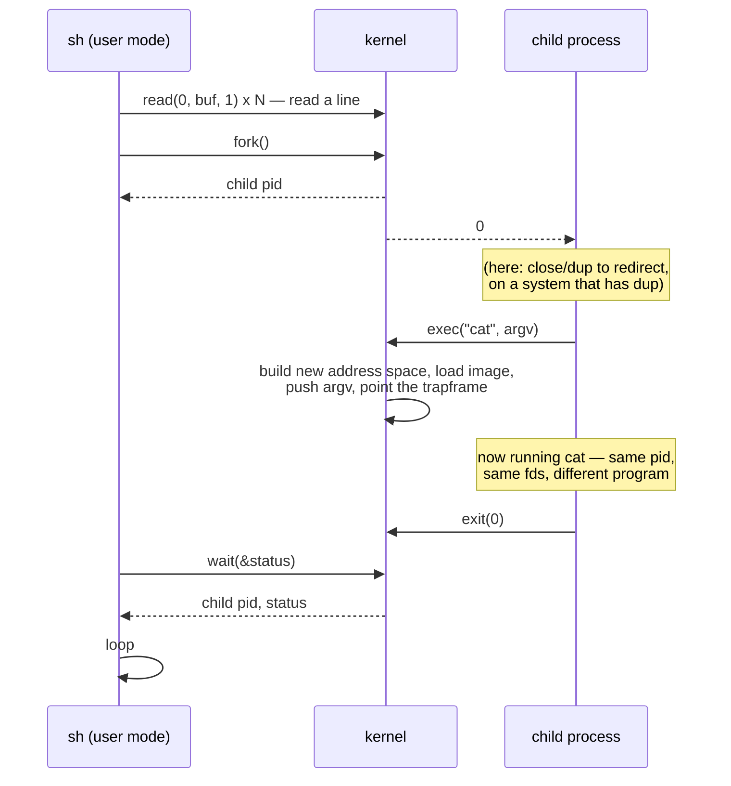

# `exec`, File Descriptors, and `fork`

## Overview

You left for Thanksgiving with a kernel that can drop into user mode, take an
`ecall`, and run exactly one program hard-coded onto one page. This session adds
three of the four calls that turn that kernel into a Unix. **`exec`** builds a
fresh address space, loads a named program into it at any size, lays `argv` out
on the new stack in the layout the C convention expects, and points the trapframe
at the entry instruction. **File descriptors** turn open things into small
integers a user program cannot forge — indexed through a per-process table into
a system-wide one, which is where the read/write offset actually lives.
**`fork`** duplicates the calling process so completely that the only difference
between the two survivors is the value the call returns. The fourth call,
`wait`, arrives Friday with `21_fork_wait`. This is the concept behind exercises
`19_exec` and `20_file_descriptors`; see the
[rv6 Architecture guide](../guides/rv6-architecture.md) for where the pieces sit.

## Learning Objectives

- **Explain** why `exec` replaces the calling process instead of creating a new
  one, and what the gap between `fork` and `exec` buys that a single spawn call
  cannot.
- **Draw** the `argv` layout `exec` builds on a fresh user stack, and compute
  the exact addresses and alignment for a given command line.
- **Trace** the four products of `exec` — page table, image, stack, entry
  register state — and identify which one each line of the reference kernel
  produces.
- **Describe** a file descriptor as an unforgeable capability, and name every
  check the kernel makes before honouring one.
- **Distinguish** the per-process file table from the system-wide open-file
  table, and predict what happens to the offset after `fork`, `dup`, and `close`
  under each design.
- **Justify** reference counting on open files, and state precisely when a file
  is really closed.
- **Explain** why `fork` returns twice with different values, and why that one
  difference is the entire API.
- **Compare** rv6's eager `fork` with copy-on-write, `vfork`, and `posix_spawn`,
  and state what each trades away.

## Prerequisites

- L22 *User Mode I* and L23 *User Mode II*, plus exercise `18_user_mode` — the
  trampoline, the trapframe, `usertrap`, and the `ecall` round trip.
- Exercise `03_paging` and the [Sv39 Paging guide](../guides/sv39-paging.md) —
  `walk`, `mappages`, and what `PTE_U` means.
- L13 *Processes and the PCB* and L14 *The Context Switch and the Scheduler* —
  `Proc`, `allocproc`, forged contexts, and the scheduler hub.
- Exercise `10_filesystem` and `17_file_commands` — inodes, `dirlookup`, and the
  offset-free `read(inum, buf)` the shell has been using.
- L08 and the [RISC-V guide](../guides/riscv.md) — the argument registers
  `a0`–`a7` and the 16-byte stack alignment rule.

---

## 1. Putting the Machine Back Together

Before adding anything, reassemble what you have. rv6 boots, manages physical
pages, builds Sv39 page tables, keeps a process table, switches contexts, takes
traps and interrupts, has a filesystem and a console, and can enter user mode and
service a system call. That last capability is what everything today rests on, so
re-run it in your head:



Three facts from that path do all the work today. First, the trapframe
(`usermode.rs:34`) is a *complete, writable description of where a process will
resume*: change `epc` and it resumes elsewhere; change `sp` and it resumes on
another stack; change `a0` and the syscall it is returning from appears to have
returned something different. Second, the kernel reaches user memory only
through `copyin`/`copyout` (`vm.rs:268`, `vm.rs:291`), which walk the *user's*
page table and refuse any page without `PTE_U` (`vm.rs:257`). Third, a process
that has never run can still be scheduled, because `ready` (`usermode.rs:245`)
forges a context whose return address is `forkret` (`usermode.rs:356`), which
dives straight into `usertrapret` — a return from a trap that never happened.

What is missing is *plurality*: one program, no arguments, no files, no second
process. Today's three calls fix that, and they are the canonical Unix answers,
essentially unchanged since 1973.

---

## 2. `exec`: Building a World

### Why replace instead of create

`exec` is strange the first time you meet it: a call that, when it succeeds,
never returns. Its C prototype claims to return `int`, and that return is only
meaningful on failure — hence the idiom `execv(...); perror("exec");`, where the
error handling needs no `if`.

The strangeness is deliberate. Unix splits "start a program" in two: **`fork`**
creates a process, **`exec`** replaces the program running inside one. The gap
between them is the point. In that gap the child is an ordinary process, running
the parent's code with the parent's privileges, free to call anything — and every
arrangement it makes is inherited by the program `exec` loads afterwards.
Redirect standard output, close descriptors the new program must not have, change
directory, drop privileges, set resource limits. None of it requires `exec` to
know anything about it.

The alternative is a single "spawn" call told everything up front — and the
systems that took it (`posix_spawn`, Windows `CreateProcess`) both ended up
carrying a list of "things to arrange before the program starts" as parameters.
Thursday's lecture makes that counting argument in full; today, take the
factoring itself as the point.

> Key distinction: `fork` answers "who runs it", `exec` answers "what runs", and
> because they are separate the answer to "in what environment" is ordinary code
> written between them rather than parameters enumerated in advance by whoever
> designed the spawn call.

### Four things `exec` must produce

Strip away the file formats and `exec` produces four things:

| Product | What it means | In the reference kernel |
|---|---|---|
| A fresh address space | A new root page table with the trampoline and this process's trapframe mapped, and nothing else | `exec.rs:648`–`exec.rs:682` |
| The loaded image | The program's bytes at `USER_CODE`, mapped `R+X+U`, however many pages that takes | `vm::load_segment` (`vm.rs:196`) |
| A stack | One writable, user-accessible page at a known address | `vm::map_user_stack` (`vm.rs:239`) |
| Entry register state | `epc`, `sp`, `a0`, `a1` written into the trapframe | `exec.rs:703`–`exec.rs:706` |

Everything else — pid, kernel stack, parent, open files — is untouched. That
last one is not an oversight: descriptors survive `exec` by *never being
mentioned* during it. Look at `exec_into` (`exec.rs:753`–`exec.rs:763`) and
notice `ofile` appears nowhere. Real Unix offers an opt-out, the `FD_CLOEXEC`
flag, precisely because the default is inherit.

### The world it builds

```text
   virtual address                                       permissions
   0x3F_FFFF_F000  TRAMPOLINE   uservec / userret         R X       (no U!)
   0x3F_FFFF_E000  TRAPFRAME    31 saved registers        R W       (no U!)
                   ...  unmapped ...
   0x0001_1000     <- initial sp, top of the stack page
   0x0001_0000     stack page   argv strings + array      R W U
                   ...  unmapped guard gap ...
   0x0000_2000     image page 2 (if the program is big)   R X U
   0x0000_1000     image page 1                           R X U
   0x0000_0000     image page 0  <- epc starts here       R X U
```

Two choices there are worth naming. The stack sits at a *fixed* address,
`USER_STACK = MAX_PROG_PAGES * PGSIZE` (`memlayout.rs:72`), above the largest
image the loader accepts, so everything between a small program and its stack
stays unmapped and a runaway pointer faults instead of scribbling on the stack.
And the trampoline and trapframe are mapped *without* `PTE_U`: the program cannot
read the registers about to be loaded back into the CPU, which is what makes the
user/kernel wall hold.

`load_segment` (`vm.rs:196`) is a loop over pages: allocate, zero, copy the
chunk, map `PTE_R | PTE_X | PTE_U`. The zeroing at `vm.rs:220` matters more than
it looks. In a real format the last page is partly file and partly nothing — ELF
program headers carry both `p_filesz` and `p_memsz`, and the difference is
`.bss`. A loader that copies `p_filesz` bytes and forgets to zero the rest ships
a program whose globals hold whatever the page's previous owner left behind. rv6
has no `.bss` and zeroes anyway, which gives the same guarantee for the tail of a
partial page.

The `fence.i` at the end (`vm.rs:232`) is a hardware fact, not a formality: you
just wrote *instructions* through the data path, and RISC-V does not promise the
instruction fetch stream sees your stores. x86 does, which is why the line has
no x86 equivalent and why people who learned there forget it. Every RISC-V
loader and JIT needs it.

### `argv` on the stack

Here is the part worth drawing. A program receives its arguments in `a0` and
`a1` — `argc` and `argv` — because that is exactly what a call to
`int main(int argc, char **argv)` looks like under the RISC-V calling convention.
But `argv` is a *pointer to an array of pointers to strings*, and all of it must
live in memory the program can read; kernel addresses are unreachable from user
mode. So `exec` writes the strings and the array into the new address space with
`copyout` before the program ever runs.

`push_argv` (`exec.rs:781`) builds it downward from `USER_STACK_TOP`. For
`run echo hello world` the result is:

```text
  0x11000  ---- top of the stack page ----
  0x10FFC       (4 bytes lost to alignment)
  0x10FF8  "echo\0"                    <- uargv[0]
  0x10FF6       (2 bytes lost)
  0x10FF0  "hello\0"                   <- uargv[1]
  0x10FEE       (2 bytes lost)
  0x10FE8  "world\0"                   <- uargv[2]
  0x10FE0       (8 bytes lost to 16-byte alignment)
  0x10FD8  0x0000_0000_0000_0000       <- argv[3] = NULL terminator
  0x10FD0  0x0000_0000_0001_0FE8       <- argv[2] -> "world"
  0x10FC8  0x0000_0000_0001_0FF0       <- argv[1] -> "hello"
  0x10FC0  0x0000_0000_0001_0FF8       <- argv[0] -> "echo"
           ^
           sp on entry, and a1 = argv = 0x10FC0.  a0 = argc = 3.
```

Five things in that picture are examinable:

1. **Strings first, array second.** The array needs the strings' addresses, and
   those are known only once they are placed. Push order follows data dependency.
2. **Every stored pointer is a user virtual address.** The kernel wrote them from
   a kernel buffer through `copyout` (`exec.rs:812`, `exec.rs:830`), but the
   *values* are addresses in the program's own world.
3. **`argv[argc]` is NULL** (`exec.rs:817`). C carries no array lengths, so the
   list ends with a sentinel — which is why `argv` can be walked by counting to
   `argc` *or* by scanning for NULL, and why both idioms appear in real code.
4. **Alignment is required, not tidy.** Strings land on 8-byte boundaries
   (`exec.rs:805`); the pointer array, and therefore the entry `sp`, on 16
   (`exec.rs:822`), because the RISC-V ABI demands a 16-byte-aligned `sp` at
   every procedure entry. Break it and most code still works — until something
   spills a 16-byte-aligned value and faults far from the bug.
5. **The gaps are real.** Rounding wastes 4, 2, 2, and 8 bytes here. The stack is
   one page, `MAXARG`/`MAXARGLEN` (`exec.rs:612`) bound the total, and
   `push_argv` checks against `USER_STACK` on every push rather than running off
   the page.

Real systems push more. After `argv` comes `envp`, another NULL-terminated
pointer array; on Linux, after that, the **ELF auxiliary vector** — key/value
pairs naming the program headers, the entry point, sixteen random bytes for stack
canaries (`AT_RANDOM`), and the vDSO — all read by the dynamic linker before
`main` runs. rv6 stops at `argv`; the shape is identical.

> Key distinction: `argv[0]` is a *convention*, not a fact the kernel enforces.
> Nothing checks that it matches the program that was loaded. `busybox` uses
> `argv[0]` to decide which of its hundred applets to be; login shells are given
> `-sh`; and process-title spoofing is exactly this convention being abused.

### Pointing the trapframe at a program that never called anything

The last step is four assignments (`exec.rs:703`–`exec.rs:706`): `epc` to
`USER_CODE`, `sp` to what `push_argv` returned, `a0` to `argc`, `a1` to `argv`.
Then `ready` (`usermode.rs:245`) makes the process schedulable, and the first
`swtch` into it lands at `forkret`, which calls `usertrapret`, which loads all
31 registers and `sret`s.

Nothing there is a "jump to the program". The kernel never transfers control to
user code directly; it *manufactures a return*, filling in the paperwork for a
trap that never occurred and then running the return path. Same trick as the
forged context in L14, one level up: the scheduler forges a kernel context so
`ret` becomes a call, and `exec` forges a trapframe so `sret` becomes a launch.

### Failure atomicity: build first, destroy second

`exec` has one ordering constraint, easy to state and easy to get wrong: a
failed `exec` must leave the caller running. `exec_into` (`exec.rs:753`) builds
the entire new address space and only then swaps the pointer and frees the old
one (`exec.rs:756`–`exec.rs:762`). If the build fails — no such program, out of
memory, arguments too long — `?` bails out with the old address space untouched
and the call returns `-1`.

Two subtleties. Freeing the old address space from inside a system call is safe
*because the kernel runs on the kernel page table* — you are not standing on the
ground you are freeing (`exec.rs:744`). And in real Unix the constraint is harder
than it looks: past the "point of no return" the old program is gone, so a late
failure cannot be reported to anybody. Linux marks that boundary explicitly
(`flush_old_exec`) and kills the process for any error after it, which forces
every resource `exec` needs to be committed before that line.

---

## 3. File Descriptors: Small Integers with Authority

### The fd as an unforgeable capability

A file descriptor is a small non-negative integer — that is the entire
representation. It is cheap to pass in a register, cheap to inherit, and
*meaningless outside the process that holds it*.

Think of it as a **capability**: an unforgeable token that names a resource and
confers the right to use it. Unforgeable is a strong claim about a plain integer,
so be precise about why it holds. The number is not an address, not an inode
number, not anything the user can compute; it is an index into a table the kernel
owns and the user cannot see, and every use is revalidated:

- `getfile` (`syscall.rs:312`) rejects `fd >= NOFILE`, so a wild integer indexes
  nothing, and rejects a slot whose `kind` is `FileKind::None`, so an fd never
  opened (or already closed) is not a descriptor.
- `sys_read` (`syscall.rs:472`) requires `f.readable` and `sys_write`
  (`syscall.rs:521`) requires `f.writable`: access mode is rechecked on every
  call, not just at `open`.
- The buffer pointer is validated separately by `walkaddr`'s `PTE_U` test
  (`vm.rs:257`), so a valid fd cannot be used to write into the kernel.

A process that writes `7` into `a0` and calls `read` gets `-1` unless the kernel
put something in slot 7. Authority is *granted* — by `open`, or by inheritance —
never manufactured. Contrast **ambient authority**: pass a pathname and let the
kernel re-derive permission from your identity, so any process can name any
file. Unix has both, and the difference explains much of its security history.
Path-based access is where TOCTOU races live — check the name, then open it, and
the name meant something else in between — while descriptor-based access is why
`openat`, Capsicum, and Linux's `pidfd` family exist, each replacing "name it
again" with "hold a handle to it".

> Key distinction: unforgeable does not mean untransferable. Descriptors move
> across `fork`, survive `exec`, and on real Unix travel over a socket with
> `SCM_RIGHTS`. Every transfer goes through the kernel, which is exactly what
> keeps the token unforgeable.

### Two tables, and where the offset lives

The classic Unix design has *three* levels:



Read the middle table carefully. An entry there is an **open file description**:
offset, access mode, status flags, reference count, and a pointer to the inode.
The fd table is per-process and holds only *pointers* into it; the inode table is
per-file and holds the metadata and block map.

The offset lives in the middle table, and that placement has visible
consequences:

- **Two independent `open`s of one file get two descriptions**, so two offsets;
  reading in one does not move the other.
- **`dup(fd)` copies the fd-table pointer, not the description**, so both share
  one offset. `dup2` is how redirection is implemented.
- **`fork` copies the fd table**, so parent and child *share* offsets — which is
  why `(echo a; echo b) > f` produces two lines instead of one overwriting the
  other.

If the offset lived in the per-process table, every one of those would break
quietly, in ways that surface only under concurrency.

### What rv6 collapses, and what it costs

rv6 has two levels, not three. `File` (`file.rs:40`) is a small `Copy` struct —
`kind`, `inum`, `off`, `readable`, `writable` — stored **by value** in the
per-process `ofile` array (`proc.rs:39`). There is no system-wide open-file table
at all; the middle level is folded into the first.

That is a legitimate simplification, and it is worth naming exactly what it
costs:

| | rv6 | xv6 / Linux |
|---|---|---|
| fd table entry | a `File` by value (`proc.rs:39`) | a pointer to a shared description |
| Where `off` lives | per process (`file.rs:45`) | in the shared description |
| `fork` | copies the `File`s (`syscall.rs:107`) — offsets diverge | copies pointers — offsets are shared |
| `dup` | not implemented | duplicates the pointer, shares the offset |
| `close` | zeroes the slot (`syscall.rs:573`) | drops a reference; releases at zero |
| Allocation | lowest free slot (`syscall.rs:295`) | lowest free slot (POSIX requires it) |

The cost is real: with per-process offsets, a forked child writing to an
inherited descriptor overwrites the parent's bytes instead of appending after
them. rv6 never notices, because nothing here forks and then writes to a shared
file — but you should be able to state the bug, because it is the clearest
demonstration of *why* the middle table exists.

One property rv6 inherits for free: `fdalloc` (`syscall.rs:295`) scans from zero
and returns the first free slot. "Lowest available descriptor" is not a
performance choice but a guarantee POSIX mandates, because `close(1)` followed by
`open("out", O_WRONLY)` is how redirection has been implemented since 1973 — the
second call is handed 1 precisely because 1 is now the lowest free slot, and the
program that `exec` loads next writes to fd 1 as it always did. Thursday's
lecture builds pipes and redirection on top of exactly that.

### Reference counting, and when a file is really closed

Once several descriptors can point at one description, and several descriptions
at one inode, "closing" stops being a single event. xv6's `filedup` bumps
`f->ref` and `fileclose` releases the inode only at zero; Linux does the same
with `f_count`. Two consequences are worth memorising:

- A file is *really* closed when its **last** descriptor closes, not its first.
- `unlink` removes a **name**, not a file. With a descriptor still open the data
  survives with no path pointing at it, and the disk space returns only at the
  last close — which is why deleting a log a running server holds open frees
  nothing (`lsof +L1` finds them), and why the standard temp-file trick is
  create, open, unlink, and keep the descriptor.

rv6's `sys_close` (`syscall.rs:567`) just writes `File::none()` into the slot and
`freeproc` (`proc.rs:140`) clears the table wholesale. With no sharing there is
nothing to count — but add `dup`, or share descriptions across `fork`, and the
counter has to arrive in the same commit.

### 0, 1, 2 — a convention, not a rule

Every rv6 process starts with three descriptors open on the console
(`proc.rs:128`–`proc.rs:130`): 0 for input, 1 for output, 2 for errors. Nothing
in the kernel treats those numbers specially — there is no `if fd == 1` anywhere,
and `sys_write` looks up slot 1 exactly as it looks up slot 7. They are the
standard streams only because every program agrees they are.

Two consequences. Standard error is separate from standard output so error text
survives redirection of the data stream: `cmd > out.txt` moves fd 1 and leaves
fd 2 on the terminal. And a program that closes fd 1 and opens something else
has *redirected itself*, with nobody's cooperation. The convention is powerful
precisely because it is only a convention.

### What "everything is a file" buys

Look at `sys_read` (`syscall.rs:468`) and `sys_write` (`syscall.rs:517`). Both
look up the `File`, then branch on `file.kind`: console bytes go to the UART,
inode bytes through `read_at`/`write_at` (`fs.rs:231`, `fs.rs:249`) at the
descriptor's offset. The branch lives in the kernel. **The caller never
branches.** `cat` (`exec.rs:188`) reads an fd and writes fd 1 without knowing one
is a file and the other a UART, and the same binary would work over a pipe or a
socket.

That is the whole content of "everything is a file": one interface — open, read,
write, close, with a cursor — over things whose implementations share almost
nothing. It is why pipelines compose, why redirection is uniform, and why a
program written in 1975 still works on a device invented last year.

The seams are visible too. Not every operation is a read or a write, so Unix
grew `ioctl`, an escape hatch that admits the abstraction is incomplete; seeking
is meaningless on a console or a pipe; "block until ready" is not expressive
enough for a program watching several sources, hence `select`/`poll`/`epoll`.
Plan 9 pushed the idea harder and made the network and window system real file
trees, while Linux drifted away and then partly back — `signalfd`, `timerfd`,
`eventfd`, `pidfd`, `memfd` — on the principle that anything wanting to compose
with `epoll` had better be a descriptor.

---

## 4. `fork`: The Call That Returns Twice

### The mechanism, and the one line that matters

`fork` creates a near-exact copy of the calling process, and both copies return
from it. Mechanically it is nothing new: allocate a `Proc`, add the trampoline
and trapframe mappings, copy the parent's user pages with `uvmcopy`
(`vm.rs:383`), copy the trapframe, inherit the file table, record the parent, mark
it runnable (`syscall.rs:92`–`syscall.rs:112`).

The line that makes it work is `syscall.rs:105`:

```rust
*(*child).trapframe = core::ptr::read((*parent).trapframe);
(*(*child).trapframe).a0 = 0; // the child's fork() returns 0
```

Copying the trapframe copies the child's *entire resumption point* — program
counter, stack pointer, all 31 registers. The child does not start at the
beginning of the program; it starts exactly where the parent is, mid-system-call,
and returns from it.

A subtle ordering fact is buried there. `usertrap` advances `epc` past the
`ecall` at `usermode.rs:401`, **before** calling `dispatch`, so the trapframe
`sys_fork` copies already points at the instruction *after* the `ecall`. Do the
increment after dispatch instead and the child resumes *on* the `ecall` and forks
again, and again — a fork bomb caused by four bytes of arithmetic in the wrong
order.

### Copied, shared, or new



Be precise about the categories, because "the child is a copy" hides the
interesting distinctions:

| Aspect | rv6 | Unix |
|---|---|---|
| Address space contents | **copied** eagerly, page by page (`vm.rs:403`) | logically copied; physically copy-on-write |
| File descriptor table | **copied** by value (`syscall.rs:107`) | table copied; the open file *descriptions* are **shared** |
| Working directory | none yet (all paths resolve in `ROOT`) | copied — the child gets its own pointer to the same directory |
| Kernel stack, trapframe page | **new**, from `allocproc` (`proc.rs:117`) | new |
| pid, parent | **new** (`proc.rs:111`, `syscall.rs:108`) | new |
| Pending signals, timers, locks | n/a | not inherited |

"Copied" versus "shared" is the axis that matters. Memory is copied, so a child
scribbling on a global does not affect the parent; open file descriptions are
shared, so a child reading an inherited descriptor moves the parent's cursor.
Each would be wrong in the other's place — shared memory would destroy `fork` as
an isolation boundary, copied offsets would break every shell redirection.

### Why the return value is the whole API

Two processes come out of `fork` running identical code at an identical
instruction with identical memory. They must be distinguishable or the call is
useless, and every scrap of difference has to be carried in something they do
not share — which leaves the register the call returns in.

So: parent gets the child's pid, child gets 0. That is close to forced. The
parent needs the pid anyway, to `wait`; the child needs *some* value, and 0 is
available because it is never a valid pid. One register, two facts, no extra
call. The alternatives — compare `getpid()` against a remembered value, or write
a flag to memory both can see — need either a second syscall or memory that is
no longer shared. The whole API is a value that differs; everything else follows
from what "copy a process" has to mean.

### The cost of a copy, and the escapes from it

`uvmcopy` copies every user page eagerly. For rv6's one- and two-page programs
that is nothing; for a process with a gigabyte mapped it is a catastrophe, and
almost always wasted, because the usual next call is `exec`, which throws it all
away. Three responses, in historical order:

1. **`vfork`** (BSD, 1979): copy nothing. The child *borrows* the parent's
   address space while the parent is suspended, until the child `exec`s or exits.
   Fast, and a loaded gun — the child must not modify anything, or even return
   from the function that called `vfork`.
2. **Copy-on-write** (System V, then everyone): map every page into both address
   spaces read-only, share the frames, count references, and copy a page only
   when someone writes and takes a protection fault. `fork` becomes O(page-table
   entries) instead of O(memory), and `fork`+`exec` copies almost nothing. This
   is what keeps `fork` viable, and it is the page-fault machinery applied.
3. **`posix_spawn`**: skip the round trip, for systems where `fork` is expensive
   (huge address spaces, many threads) or impossible (no MMU).

`fork` also fits badly with threads: only the calling thread exists in the child,
so a mutex another thread held stays locked forever in the copy — hence the rule
that only async-signal-safe calls are legal between `fork` and `exec`. Thursday
weighs the full case against `fork`; implement it first, so you know what you are
being asked to give up.

---

## 5. The Three Together: How a Shell Runs a Command



rv6's user-mode shell (`exec.rs:354`) is exactly this loop in about a hundred
instructions: prompt, read characters from fd 0 until newline, split the line
into an `argv` array on its own stack, `fork` (`exec.rs:439`), then `exec` in the
child (`exec.rs:444`) while the parent `wait`s (`exec.rs:454`). If `exec` returns
at all the command did not exist, so the child prints `exec: not found` and
exits — the failure case is the only one in which the instructions after that
`ecall` are ever reached. That shell is unprivileged: user mode, its own page
table, nothing but system calls. It is exercise `22_userland`, and the piece it
still needs — `exec` as a system call rather than something only the kernel's
`run` command can do — is Thursday.

Notice what each call contributes. `fork` supplies a second process to sacrifice,
so the shell survives whatever the command does, and the gap after it is where
redirection is arranged. `exec` replaces that copy with the requested program,
keeping the descriptors set up for it. `wait` turns the child's exit status back
into a value the shell can branch on. Remove any one and the shell stops being
expressible.

---

## Key Concepts

| Concept | Definition | Example |
|---|---|---|
| `exec` | Replace the calling process's program, keeping its identity | `exec_into` swaps the page table, keeps pid and `ofile` (`exec.rs:753`) |
| `argv` layout | Strings high, NULL-terminated pointer array below, `sp` at the array | `push_argv` (`exec.rs:781`); `a0 = argc`, `a1 = argv` |
| Entry state | The four trapframe fields that define where a program starts | `epc`, `sp`, `a0`, `a1` (`exec.rs:703`–`exec.rs:706`) |
| Failure atomicity | A failed `exec` must leave the caller running | Build new, then free old (`exec.rs:754`–`exec.rs:762`) |
| File descriptor | A small integer indexing a per-process table of open things | fd 3 is `(*p).ofile[3]` (`proc.rs:39`) |
| Capability | An unforgeable token that names a resource and grants use of it | `getfile` rejects out-of-range and closed slots (`syscall.rs:312`) |
| Open file description | The shared object holding offset, mode, and refcount | Where `off` lives in Unix; folded into `File` in rv6 (`file.rs:45`) |
| Offset | The cursor a descriptor remembers between reads | `(*p).ofile[fd].off += n` (`syscall.rs:505`) |
| Reference count | How many descriptors name one description | xv6's `f->ref`; rv6 has none — `close` just zeroes the slot (`syscall.rs:573`) |
| Standard streams | fds 0/1/2 open on the console by convention | `allocproc` (`proc.rs:128`–`proc.rs:130`) |
| `fork` | Duplicate the caller; parent gets the child's pid, child gets 0 | Trapframe copy then `a0 = 0` (`syscall.rs:105`–`syscall.rs:106`) |
| Copy-on-write | Share frames read-only; copy on the first write fault | Not in rv6 — `uvmcopy` copies eagerly (`vm.rs:403`) |

---

## Practice Problems

### Problem 1: Build the argv block

A user types `run cat notes.txt`; `USER_STACK_TOP` is `0x11000`. Using
`push_argv`'s rules — for each string subtract `len+1` then round *down* to a
multiple of 8; for the array subtract `(argc+1)*8` then round down to 16 —
compute (a) `argc`, (b) the user address of each argument string, (c) `a1` on
entry, (d) the eight bytes at `0x10FD8`, and (e) how many bytes of the page are
wasted to alignment.

<details>
<summary>Click to reveal solution</summary>

(a) `argc = 2`. `argv[0]` is the program name `cat`, added by `exec` itself
(`exec.rs:786`), plus the one argument `notes.txt`.

(b) `"cat\0"` is 4 bytes: `0x11000 - 4 = 0x10FFC`, rounded down to 8 gives
**`0x10FF8`**. `"notes.txt\0"` is 10 bytes: `0x10FF8 - 10 = 0x10FEE`, rounded
down to 8 gives **`0x10FE8`**.

(c) The array holds `argc + 1 = 3` pointers = 24 bytes. `0x10FE8 - 24 =
0x10FD0`, which is already 16-byte aligned, so `a1 = sp = ` **`0x10FD0`**.

(d) `0x10FD8` is `argv[1]`, which points at `"notes.txt"`: the eight bytes are
`0x0000_0000_0001_0FE8`, little-endian `e8 0f 01 00 00 00 00 00`.

(e) `"cat\0"` occupies `0x10FF8`–`0x10FFB`, so 4 bytes at the top are unused.
`"notes.txt\0"` occupies `0x10FE8`–`0x10FF1`, so `0x10FF2`–`0x10FF7` — 6 bytes —
are unused. The array lands with no rounding loss. **10 bytes** wasted.

</details>

### Problem 2: Walk the file tables

Process P opens `log` as fd 3 and reads 100 bytes, then calls `fork`. The child
reads 50 bytes from fd 3 and calls `close(3)`. Finally the parent reads 10 bytes
from fd 3.

(a) Under rv6's design, what offset does the parent's last read start at, and
what does the child's `close` affect? (b) Under the classic Unix design, what
offset does the parent's last read start at? (c) Which answer does
`(echo a; echo b) > f` depend on, and why?

<details>
<summary>Click to reveal solution</summary>

(a) **100.** rv6 stores the `File` by value in `ofile` (`proc.rs:39`) and
`sys_fork` copies the whole array (`syscall.rs:107`), so the child got its own
`off = 100` and advanced only its copy to 150. The child's `close` writes
`File::none()` into the child's slot 3 (`syscall.rs:573`) and nothing else — no
reference count exists, and the parent's slot is untouched.

(b) **150.** The fd tables are separate but both point at one open file
description, which holds the offset. The child's read moved the shared cursor.
The child's `close` drops the description's refcount from 2 to 1, so the
description — and the offset — survive for the parent.

(c) It depends on **(b)**. The shell forks a child per `echo`, both inheriting
the descriptor opened on `f`. With a shared description, the second `echo` starts
where the first stopped and you get two lines. With rv6's per-process offsets,
both would start at 0 and the second would overwrite the first.

</details>

### Problem 3: Decode the flags, then find the symptom

A program calls `open("out", 0x601)`.

(a) Which flags is `0x601`, from `file.rs:81`–`file.rs:89`? (b) What `readable`
and `writable` does `sys_open` compute (`syscall.rs:390`–`syscall.rs:391`)? (c) A
classmate's `sys_read` copies the right bytes out to the user but never executes
`(*p).ofile[fd].off += n`. Describe exactly what `run cat notes.txt` does, and
why the exercise harness reports a timeout rather than wrong output.

<details>
<summary>Click to reveal solution</summary>

(a) `0x601 = 0x400 | 0x200 | 0x001` = `O_TRUNC | O_CREATE | O_WRONLY`: create it
if missing, empty it if it exists, open it for writing.

(b) `writable = true` (the `O_WRONLY` bit is set). `readable = false`, because
the test is `flags & O_WRONLY == 0`. A later `read` on this fd is rejected by
`sys_read`'s `Some(f) if f.readable` guard (`syscall.rs:472`) and returns `-1`.

(c) The cursor never moves, so every `read_at` starts at offset 0 and returns the
same 64 bytes. `cat`'s loop (`exec.rs:201`) ends on `read <= 0`, which now never
happens, so it writes the first chunk forever. The harness sees a program that
neither exits nor faults and its watchdog (`usermode.rs:221`) fires. Wrong output
would mean the program finished; a hang means it never will.

</details>

### Problem 4: Predict the output

This program runs on rv6's cooperative scheduler, which never preempts:

```text
    write(1, "A", 1)
    pid = fork()
    if pid == 0 { write(1, "B", 1); exit(0) }
    write(1, "C", 1)
    wait(&status)
    write(1, "D", 1)
    exit(0)
```

(a) Exactly what is printed? (b) How many times does each `write` *instruction*
execute? (c) On Linux, with preemption and buffered stdio, what other outputs
become possible, and what does that say about the C library?

<details>
<summary>Click to reveal solution</summary>

(a) **`ACBD`**. `A` prints once, before the fork. The parent returns from `fork`
first — it is the running process, the child is merely Runnable — prints `C`,
calls `wait`, finds no zombie, and yields (`usermode.rs:363`). The scheduler picks
the child, which prints `B` and exits; the parent resumes, reaps, prints `D`.

(b) Once each. `A` runs before the fork; only the child reaches `B`; only the
parent reaches `C` and `D`. The *instructions* exist in both address spaces, but
the branch on `a0` sends each process down one path.

(c) With preemption the child may run before the parent's `C`, giving `ABCD` —
the order of `B` versus `C` is a genuine race. And if stdio is buffering rather
than writing straight through, output accumulated *before* the fork is
duplicated, because the buffer is part of the copied address space: `printf("A")`
into a pipe can yield `AACBD`. That is a library artifact, not a kernel one —
`fork` faithfully copies memory the library was using to postpone a `write`.

</details>

### Problem 5: Order the steps

Here are seven things `exec` does, shuffled:

```text
  1. free the old page table
  2. copy the argument strings and pointer array into the new stack page
  3. allocate and zero a fresh root page table
  4. map the trampoline and this process's trapframe into it
  5. set epc / sp / a0 / a1 in the trapframe
  6. install the new page table pointer in the Proc
  7. load the program image, page by page
```

(a) Give a correct order. (b) Name one pair whose swap is *fatal*, and say what
breaks. (c) Why is it safe for step 1 to run inside the system call at all, given
that the process is in the middle of executing?

<details>
<summary>Click to reveal solution</summary>

(a) 3, 4, 7, 2 — the stack must be mapped before step 2 can `copyout` into it —
then 6, 5, 1. That is `build_addrspace` (`exec.rs:648`) followed by `exec_into`
(`exec.rs:754`–`exec.rs:762`).

(b) Moving **1 before 6** (or before 3) is the fatal one: free the old address
space and *then* fail while building the new one, and the process has no memory
and no program to return to. A failed `exec` must leave the caller running, which
forces "build entirely, then swap, then free". Putting **2 before 4 or 7** is
louder and safer — `copyout` walks the page table and returns `Err` on an
unmapped stack, so exec fails cleanly.

(c) Because a system call runs on the *kernel* page table. The instructions
executing, and the stack they run on, live in kernel memory step 1 does not
touch; `free_user_pagetable` (`vm.rs:350`) frees only `PTE_U` leaves and the
page-table pages (`exec.rs:744`). Running on the user's page table, this step
would pull the ground out from under itself — the same argument that gives the
scheduler its own stack in L14.

</details>

### Problem 6: Try to forge authority

A hostile user program makes three calls in a row:

```text
    read(9,   0x1000, 64)          /* it never opened fd 9 */
    read(1,   0x1000, 64)          /* fd 1 is the console, opened by the kernel */
    read(0,   0x3FFFFFE000, 64)    /* the TRAPFRAME address */
```

For each, name the check that stops it — or explain why it succeeds — and cite
the line.

<details>
<summary>Click to reveal solution</summary>

**`read(9, ...)`** — stopped by `getfile` (`syscall.rs:312`). `9 < NOFILE`, so
the range check passes, but slot 9 has `kind == FileKind::None`, so `getfile`
returns `None` and `sys_read` returns `-1` (`syscall.rs:472`). The integer 9 is
not a capability; the table is what makes some integers mean something.

**`read(1, ...)`** — **succeeds**, and correctly so. `allocproc` opened fd 1 on
the console (`proc.rs:129`) with `readable: true` (`file.rs:65`), so this is
authority the kernel granted; it blocks until a key is pressed. Expecting it to
fail confuses the convention (fd 1 is for output) with the mechanism (fd 1 is a
read-write console descriptor).

**`read(0, 0x3FFFFFE000, 64)`** — the fd is valid, so the check that stops it is
on the *pointer*. `copyout` (`vm.rs:268`) calls `walkaddr`, which requires a valid
PTE **with** `PTE_U` (`vm.rs:257`); the trapframe is mapped `PTE_R | PTE_W`
without it (`exec.rs:682`), so `walkaddr` returns 0 and the call returns `-1`.
Two independent checks, because descriptor and address grant two independent
kinds of authority.

</details>

---

## Further Reading

- Exercise `19_exec` — `load_segment`, `build_process`, and `push_argv`; the
  payoff is `run echo hello world`.
- Exercise `20_file_descriptors` — `fdalloc`, `sys_open`, `sys_read`, and the
  offset that makes a descriptor stateful.
- Exercise `21_fork_wait` — Friday: `fork`, `wait`, zombies, and the scheduler
  from `06_scheduling` finally driving real user processes.
- [rv6 Architecture](../guides/rv6-architecture.md) — how `exec.rs`, `vm.rs`,
  `file.rs`, `syscall.rs`, and `usermode.rs` fit together.
- [Sv39 Paging](../guides/sv39-paging.md) — `PTE_U`, `walkaddr`, and why the
  trapframe is unreachable from user mode.
- [Exam Prep](../guides/exam-prep.md) — the argv arithmetic and the fd-table walk
  are both exam-shaped.
- Cox, Kaashoek, Morris, *xv6: a simple, Unix-like teaching operating system*,
  chapters 1 and 8 — read `exec.c` next to `exec.rs`, and `file.c` for the
  reference-counted open-file table rv6 leaves out.
- Ritchie and Thompson, *The UNIX Time-Sharing System*, CACM 1974 — sections 3
  and 6, where descriptors and `fork`/`exec` are introduced in their original
  words.
- Baumann, Appavoo, Krieger, Roscoe, *A `fork()` in the Road*, HotOS 2019 — the
  case that `fork` is a historical accident. Read it after you implement it.
- *System V Application Binary Interface* and the RISC-V psABI — the normative
  description of the initial process stack: `argc`, `argv`, `envp`, and the
  auxiliary vector.
- Linux `fs/exec.c` (`do_execveat_common`, `flush_old_exec`) and
  `include/linux/fdtable.h` — the industrial versions of both halves of this
  lecture.

---

## Summary

1. **`exec` replaces, `fork` creates, and the gap between them is the design.**
   With creation and loading as separate calls, everything about the environment
   a program inherits is arranged by ordinary system calls in between, instead of
   being enumerated in advance by a spawn API.

2. **`exec` produces four things.** A fresh page table with the trampoline and
   trapframe, the image loaded page by page, a stack, and four trapframe fields —
   `epc`, `sp`, `a0`, `a1` (`exec.rs:703`–`exec.rs:706`). Everything else about
   the process is deliberately untouched.

3. **`argv` is a layout, not a data structure.** Strings at the top of the new
   stack, a NULL-terminated array of user virtual addresses below them, `sp` and
   `a1` both pointing at that array, 16-byte aligned (`exec.rs:781`). Kernel and
   C convention must agree because no hardware enforces it.

4. **A failed `exec` must leave the caller running.** Build the new address space
   first, swap the pointer, then free the old (`exec.rs:754`–`exec.rs:762`) — and
   freeing user memory mid-syscall is safe only because the kernel runs on its
   own page table.

5. **A file descriptor is an unforgeable capability.** A small integer meaning
   nothing outside the process holding it, revalidated on every use — range,
   open, access mode (`syscall.rs:312`, `syscall.rs:472`) — with the buffer
   pointer checked separately by `PTE_U` (`vm.rs:257`). Authority is granted or
   inherited, never manufactured.

6. **The offset lives in the shared open-file description, not the fd table.**
   That placement is what makes `dup` share a cursor and inherited descriptors
   append instead of overwrite. rv6 folds the two tables into one (`file.rs:45`,
   `proc.rs:39`) and gives up exactly that behaviour — and with no sharing there
   is nothing to reference count, which is why its `close` is one assignment
   (`syscall.rs:573`).

7. **fds 0, 1, 2 are a convention the kernel does not enforce.** `allocproc`
   opens them on the console (`proc.rs:128`); nothing else treats them specially.
   Redirection is just arranging the table before the program starts, and it
   works because "lowest free descriptor" is a guarantee.

8. **`fork` returns twice, and the difference is the entire API.** Copying the
   trapframe copies the resumption point; the child's `a0 = 0`
   (`syscall.rs:106`) is the one distinguishing fact two otherwise identical
   processes have. Memory copied, descriptions shared, pid and parent new — and
   rv6 copies eagerly where real kernels use copy-on-write.
