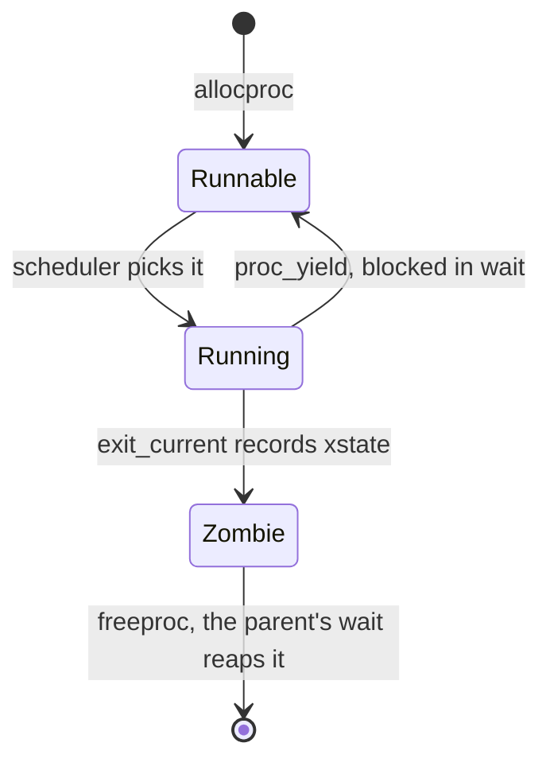
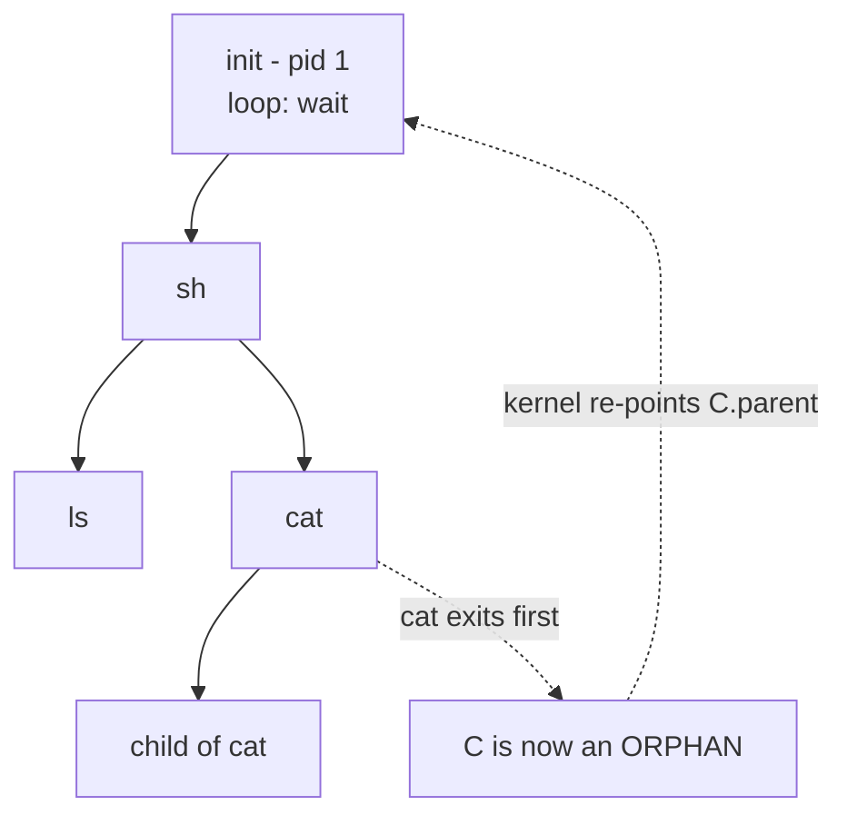
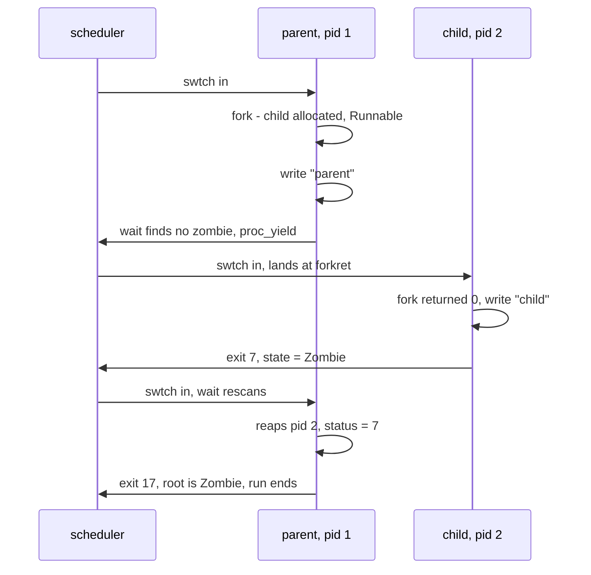
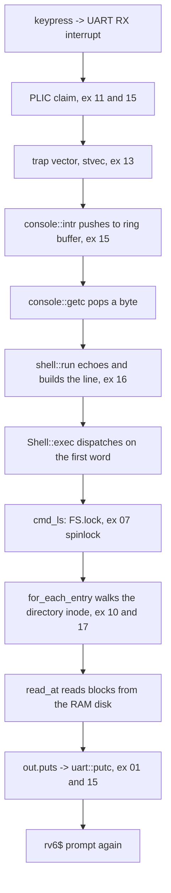

# exec as a System Call, and Userland

## Overview

This is the session where the kernel becomes a Unix. Three system calls finish
the job: `exit` parks a finished process as a **zombie** so its status can
outlive it, `wait` reaps that zombie and hands the status to the parent, and
`exec` throws away a process's memory and replaces it with a different program.
With `fork` from Tuesday's lecture, that trio is the complete Unix answer to "run a
program," and it is enough to lift the shell out of the kernel entirely. Along
the way the round-robin policy written back in exercise `36k_scheduling` finally
schedules two genuinely independent processes instead of one. The central
argument of the lecture is not mechanical but design-level: **why** Unix splits
process creation into `fork` and `exec` rather than offering one `spawn`, what
that split buys, what it costs, and what `posix_spawn` and Windows'
`CreateProcess` gave up by taking the other road. We close by tracing `rv6$ ls`
through every layer built this term. Concept behind Friday, December 4's
exercises — `51k_fork_wait`, `52k_userland`, and `53k_ship_your_commands` —
plus the extra-credit `54k_elf_loader`; see also [rv6 Architecture](../guides/rv6-architecture.md).

## Learning Objectives

- **Explain** why a finished process must linger as a zombie, and precisely
  what state a zombie still owns.
- **Trace** a `fork` / `wait` / `exit` interleaving through the round-robin
  scheduler, naming the process state at every switch.
- **Describe** the process tree, orphaning, and reparenting to `init`, and
  identify what rv6 does instead.
- **Argue** why Unix splits process creation into `fork` + `exec`, using
  redirection and pipes as the load-bearing examples.
- **Compare** `fork`+`exec` with `posix_spawn` and `CreateProcess`, stating
  what each approach cannot express.
- **Derive** why `exec` does not return on success, and why a *failed* `exec`
  must leave the caller perfectly intact.
- **Distinguish** what `exec` replaces from what it deliberately preserves,
  and connect each to a line of `exec.rs`.
- **Walk** a shell command end to end across every rv6 layer, from UART
  interrupt to filesystem block to console byte.

## Prerequisites

- The `fork` half of L24 (exercise `51k_fork_wait` is Friday) — `allocproc`,
  `uvmcopy`, and the child whose `a0` is zero.
- Exercises `49k_exec` and `50k_file_descriptors` (today) — `load_segment`, `push_argv`,
  the per-process `ofile` table.
- Exercise `48k_user_mode` and the trap lecture — the trampoline, the trapframe,
  `usertrap` / `usertrapret`.
- Exercises `35k_context_switch` and `36k_scheduling` — `swtch` and
  `RoundRobin::pick_next`, both of which finally get a real workload today.
- The [Sv39 Paging](../guides/sv39-paging.md) and
  [Memory Map](../guides/memory-map.md) guides — `exec` is an address-space
  swap, so page tables are the whole story.
- The [Unsafe Rust and no_std](../guides/rust-unsafe-nostd.md) guide — the
  process table is raw pointers all the way down.

---

## 1. Ending a Process: exit, and Why a Corpse Has a Job

A process that calls `exit(7)` is done computing. The naive kernel frees its
pages, clears its slot, and moves on. That kernel is wrong, for one reason:

> **Key idea:** the exit status is a message addressed to *another* process, and
> the sender has just died. Somebody has to hold the message until it is read.

Deleting the process the instant it stops running would destroy that value
before anybody could look at it. So Unix keeps a husk: the process stops
running for good, but its table slot lingers, holding the **pid** it was known
by and the **exit status** it left. That husk is a **zombie** — not slang, but
the state name in every Unix kernel, printed by `ps` as `Z` beside
`<defunct>`.

In rv6 this is `exit_current` (`usermode.rs`), and it is three lines of
real work:

```rust
pub unsafe fn exit_current(status: isize) -> ! {
    let p = CURPROC;
    (*p).xstate = status;                // the message
    (*p).state = ProcState::Zombie;      // the husk
    swtch::swtch(ptr::addr_of_mut!((*p).context), ptr::addr_of_mut!(SCHED_CTX));
    unreachable!() // the scheduler never swtch-es back into a Zombie
}
```

`xstate` is the PCB field added for exactly this purpose (`Proc` in `proc.rs`), and
the `unreachable!()` is load-bearing: the policy only picks `Runnable` slots
(`sched.rs`), so a `Zombie` is unreachable by construction.

### What a zombie still owns



rv6 keeps everything until `freeproc` (`proc.rs`): the trapframe page, the
kernel stack page, the whole user page table. Linux is stingier — it tears the
address space down at exit and keeps only a few hundred bytes of `task_struct`
holding the pid, the status, and accounting totals. The principle is the same
either way: *the identity and the result survive; the memory need not.*

### The status word is smaller than you think

rv6 stores a full `isize` in `xstate` and copies four bytes out to the user as
an `i32` (`syscall.rs`). POSIX is far more cramped: `wait` returns a single
`int` that packs *several* answers at once.

| Bits of the Linux status word | Meaning | Accessor |
|---|---|---|
| 15..8 | the low 8 bits of `exit(status)` | `WEXITSTATUS` |
| 7 | core dumped | `WCOREDUMP` |
| 6..0 | terminating signal, or 0 for a normal exit | `WTERMSIG` |
| special value `0x7f` in 6..0 | stopped, not dead | `WIFSTOPPED` |

That packing is why `exit(256)` on Linux reaches the parent as status `0`, and
why shell exit codes stay in 0..125. rv6 has no signals and no job control, so
it can afford an honest 32-bit field — but a textbook's status word is eight
bits wide, not thirty-two.

---

## 2. wait: Reaping, Blocking, and the Two Ways to Fail

`wait(&status)` is the collector. `sys_wait` (`syscall.rs`) is a scan
wrapped in a retry loop, and its shape encodes three distinct outcomes:

1. **A zombie child exists.** Copy its status out with `vm::copyout`, call
   `proc::freeproc` on it — that is the *reap* — and return its pid.
2. **No children at all.** `proc::has_children` (`proc.rs`) says no, so
   return −1. POSIX spells this `ECHILD`.
3. **Children exist, but none has finished.** Give up the CPU with
   `usermode::proc_yield` (`syscall.rs`) and scan again when the scheduler
   picks us back up.

Case 3 is where `wait` earns the word "blocks" — but note what rv6 does *not*
do: it never sleeps on a wait channel. It marks itself `Runnable`, rejoins the
rotation, and rescans the whole table each time it is picked. That is a
**poll**: correct on a cooperative single-hart kernel, and wasteful, since the
parent burns a scheduler round per failed attempt.

> **Compare with xv6 and Linux:** xv6's `wait` sleeps on the parent's own
> address as a wait channel and `exit` calls `wakeup(p->parent)`, so the parent
> is never scheduled with nothing to collect; Linux queues it on a wait queue
> and delivers `SIGCHLD`. Both replace "look again later" with "someone will
> tell me" — and the semaphores from exercise `38k` are the tool for doing the
> same in rv6.

### Reaping is what frees the slot

`freeproc` (`proc.rs`) returns the trapframe, the kernel stack, and the
user page table, then clears `pid`, `parent`, and `xstate` and sets the state
back to `Unused`. Until that call the slot is spent — which is why a parent
that forks in a loop and never waits exhausts `NPROC` while doing no work at
all, the same mechanism that makes a fork bomb effective where the finite
resource is `pid_max`.

It is also why `wait` returns *which* child it reaped: with three children, the
pid is the parent's only handle on whose status just arrived. POSIX later added
`waitpid`, `wait4`, and `waitid`, but the primitive underneath is unchanged —
find a zombie of mine, take its result, delete it.

---

## 3. The Process Tree, init, and Reparenting

`fork` stamps one field into the child: `(*child).parent = parent`
(`sys_fork()` in `syscall.rs`). That single pointer is the entire process tree. Each
process has exactly one parent and any number of children, so the "graph" of
processes is a tree rooted at whatever the kernel started first.

Why a tree and not an arbitrary graph? Because `wait` needs a unique collector.
If two processes could both claim a child, the exit status would need a
delivery policy, and the pid could be freed by one collector while the other
still held it. One parent, one reaper, no ambiguity.



### Orphans

A child can outlive its parent, and then its eventual exit status has no
addressee. Unix's answer is **reparenting**: when a process exits, the kernel
re-points each of its children's `parent` fields at pid 1. Since `init`'s main
loop is nothing but `while (1) wait(0);`, every orphan is eventually reaped by
somebody. Linux generalizes this with `PR_SET_CHILD_SUBREAPER`, letting a
service manager volunteer as the target for its own subtree.

The **double fork** exploits this deliberately: to launch a daemon without
keeping it as your child, fork, have the child fork again and exit immediately,
and reap the middle process. The grandchild is instantly orphaned, reparented
to init, and now nobody's problem.

### What rv6 does instead

rv6 has no `init` and does no reparenting. Instead, `usermode::run` drives the
scheduler only until the *root* process becomes a zombie, and then
`cleanup_except` (`usermode.rs`) frees every other live process outright:

```rust
unsafe fn cleanup_except(root: *mut Proc) {
    for i in 0..crate::param::NPROC {
        let q = proc::proc_at(i);
        if q != root && (*q).state != ProcState::Unused {
            proc::freeproc(q);
        }
    }
}
```

That is a legitimate policy for a bounded run — the whole tree dies with the
command you typed — and it sidesteps a real hazard. `wait` compares parents by
**pointer** (`sys_wait()` in `syscall.rs`), and slots are recycled: if a parent's slot were
freed while an orphan still pointed at it, the next `allocproc` to claim that
slot would silently adopt a child it never forked. rv6 avoids this by nulling
`parent` in `freeproc` (`proc.rs`) and by never letting a tree outlive its
root. Real kernels solve it with reference-counted task structures and pids
that are looked up rather than pointed at.

> **Key distinction:** a **zombie** has exited and is waiting to be reaped; an
> **orphan** is still running but has lost its parent. A process can be both,
> in that order, which is exactly the case reparenting exists to handle.

---

## 4. Two Processes, Really: the Scheduler Wakes Up

Exercises 48k through 50k ran exactly one user process at a time: `run` switched
into it, its `exit` switched straight back, and there was no scheduling
decision to make — so the policy written in exercise `36k` sat unused for six
weeks. `fork` changes that in one instruction: after `sys_fork` returns there
are two `Runnable` processes and a genuine choice.

The loop that makes it is `scheduler` (`usermode.rs`). Each pass snapshots
every slot's state, hands the array to `RoundRobin::pick_next` (`sched.rs`),
marks the winner `Running`, sets `CURPROC`, and `swtch`-es into it; control
returns to the next line when that process yields or exits.

The policy itself is unchanged from exercise 36k — a rotation cursor and a
scan:

```rust
fn pick_next(&mut self, states: &[ProcState]) -> Option<usize> {
    let n = states.len();
    (0..n)
        .map(|off| (self.next + off) % n)
        .find(|&i| states[i] == ProcState::Runnable)
        .map(|i| { self.next = (i + 1) % n; i })
}
```

Because the cursor advances past the process it just picked, no runnable
process is skipped twice in a row — the no-starvation invariant, finally
load-bearing rather than theoretical.

### Where a forked child actually starts

A child never "returns from `fork`" in the kernel. `ready` (`usermode.rs`)
gives it a context whose return address is `forkret` and whose stack pointer is
the top of its own kernel stack page, so the first `swtch` into the child
*returns into* `forkret` (`usermode.rs`), which calls `usertrapret`, which
restores the trapframe `fork` copied from the parent — with `a0` overwritten to
0 (`sys_fork()` in `syscall.rs`). The child resumes at the instruction after the parent's
`ecall`, on the parent's saved stack pointer, with one register different. That
is the whole of "fork returns twice."

Here is `run forktest` (`exec.rs`), scheduled:



Two details are worth staring at. First, "parent" prints before "child" even
though the child was created first: the parent keeps the CPU until it blocks,
because rv6 is **cooperative**. The timer from exercise `44k` still ticks and is
still forwarded to user mode (`run()` in `usermode.rs`), but its handler only clears
the pending bit (`usertrap()` in `usermode.rs`) — turning that tick into a `proc_yield` is
all preemption would take, and rv6 deliberately stops one line short. Second,
the parent exits 17, not 7, because `forktest` adds 10 to what `wait` gave it:
a status of 17 proves the fork, the schedule, the child's exit, and the
`copyout` of the status word all worked.

---

## 5. Why fork + exec, and Not spawn

Every student meeting `fork` asks the same reasonable question: creating a copy
of yourself only to immediately obliterate it is absurd; why not one call,
`spawn("ls", argv)`? This deserves a real argument, not an appeal to tradition.

### The argument: the window

Between `fork` and `exec` the child is a **complete process running ordinary
code**, and it is *the child's own code*, executing with the child's identity.
Whatever a process is allowed to do to itself, it may now do to the
soon-to-be-new-program — using the system calls that already exist, with no new
API at all.

That window is what makes shell redirection expressible. `ls > out.txt` is not
a feature of `exec`; nothing in `exec` knows about files. It is four ordinary
calls made by the child before it stops being the shell:

```text
   pid = fork()
        |
        +-- child:  close(1)                 # give up the console
        |           open("out.txt", O_CREATE|O_WRONLY)   -> returns fd 1
        |           exec("ls", argv)          # ls writes to fd 1 as always
        |
        +-- parent: wait(&status)             # the shell's own fd 1 untouched
```

The trick is that `fdalloc` (`syscall.rs`) returns the **lowest free**
descriptor. Close 1, and the next `open` is handed 1. `ls` is written to print
on fd 1 and never learns anything changed. Everything needed for this already
exists in your kernel: the fd table from exercise `50k`, and the two lines that
make it survive the transition —

- `fork` copies the table wholesale: `(*child).ofile = (*parent).ofile;`
  (`sys_open()` in `syscall.rs`), so the child inherits every open file;
- `exec_into` (`exec.rs`) replaces the page table, the stack, and the
  program counter — and **never touches `ofile`**.

Read that second point again: `exec` preserves descriptors *by doing nothing*.
Redirection is not a feature anyone implemented — it is what happens when
process creation and program loading are separate and the fd table belongs to
the process rather than the program. Pipes follow immediately: create a pipe in
the parent, fork twice, and each child wires one end onto fd 0 or fd 1 before
exec'ing. `A | B | C` is not three kernel special cases; it is the same six
lines, three times.

### The counting argument

Now try to fold that into a single `spawn`. The child window is used for more
than redirection:

| Adjustment made between fork and exec | What `spawn` would need |
|---|---|
| Redirect stdin/stdout/stderr | a descriptor-mapping parameter |
| Set up pipe ends, close the others | a list of fd actions |
| `chdir` to a working directory | a directory parameter |
| Drop privilege with `setuid`/`setgid` | credential parameters |
| Reset signal handlers, set the signal mask | a signal-disposition parameter |
| New process group or session | a job-control parameter |
| Resource limits, scheduling class, priority | more parameters |
| Namespaces, cgroups, capabilities (Linux) | many more, and growing |

Each row is a parameter that `spawn` must define, standardize, and never be
able to remove. The `fork` window needs **zero** parameters, because it is not
an API at all — it is a place to run code. Any adjustment invented in the
future is automatically supported, which is why a 1970s interface still expresses
Linux namespaces without a redesign.

### The other road, and what it gave up

Two major systems chose otherwise, both for good reasons.

**`posix_spawn`** (POSIX 2001) exists because `fork` needs an MMU, which locked
Unix semantics out of small embedded systems. Its signature confesses the
counting argument above: besides path, argv, and envp it takes a
`posix_spawn_file_actions_t`, built up by `addopen` / `adddup2` / `addclose`,
and a `posix_spawnattr_t` carrying signal masks, process group, and scheduling
policy. That is a small interpreted language for "things you would have done in
the window" — and it can only express what its designers enumerated. Nothing in
it runs *your* code.

**Windows `CreateProcess`** never had `fork` in its API at all. It takes ten
parameters plus a `STARTUPINFO` holding `hStdInput`, `hStdOutput`, `hStdError`,
and inheritance flags — the same list in a different shape. Anything not on the
list requires creating the process `CREATE_SUSPENDED` and meddling with it from
outside. (The NT kernel itself *can* fork; `NtCreateProcess` was used by the
POSIX subsystem and by WSL 1. It is Win32, not the kernel, that forbids it.)

What they gained is speed and simplicity: `spawn` never builds an address space
it is about to discard, never needs copy-on-write, and behaves sanely in a
multithreaded program.

### What fork costs

The honest case against `fork` is strong enough that it has been made in
print — see "A fork() in the road" (Baumann et al., HotOS 2019):

- **It is expensive.** Even with copy-on-write, forking a large process copies
  page tables and then takes a storm of COW faults, all to discard the result
  microseconds later. `vfork` was invented in 4.0BSD purely to dodge this, at
  the price of terrifying semantics.
- **It does not compose with threads.** `fork` duplicates only the calling
  thread while copying every lock in whatever state it was in, so between
  `fork` and `exec` you are limited to async-signal-safe calls — a rule almost
  nobody follows correctly.
- **It bakes an implementation into an interface.** "Copy my address space"
  forces every future OS feature — file locks, timers, mappings, namespaces —
  to answer "what does fork do to this?"

rv6 takes the classic road because it is the road that explains Unix;
production systems increasingly call `posix_spawn` for the common case and
reserve `fork` for the window they actually need.

> **Historical note:** Ritchie's *The Evolution of the Unix Time-Sharing
> System* records that `fork` on the PDP-7 was about 27 lines of assembly — it
> wrote the parent's image to disk and let the child run in the one memory
> image the machine had. The split was cheap to implement first and discovered
> to be powerful second. Sometimes elegance is what an accident looks like
> after fifty years of people finding uses for it.

---

## 6. exec: Swapping an Address Space Under a Running Program

`exec` is the other half. `fork` answers "make another process"; `exec` answers
"become a different program." It keeps the process and replaces the program.

### What is replaced, and what survives

| Survives `exec` | Replaced by `exec` |
|---|---|
| pid, parent pointer | user page table (`(*p).pagetable`) |
| open file table `ofile` | program image, all code and data |
| kernel stack page | user stack, and everything on it |
| trapframe **page** (same physical page) | trapframe **contents**: `epc`, `sp`, `a0`, `a1` |
| process-table slot and scheduler state | argv, argc |

In rv6 this is six lines (`exec.rs`):

```rust
pub unsafe fn exec_into(p: *mut Proc, name: &str, args: &[&str]) -> Result<usize, ExecError> {
    let built = build_addrspace((*p).trapframe as usize, name, args)?;
    let old = (*p).pagetable;
    (*p).pagetable = built.pagetable;
    let tf = (*p).trapframe;
    (*tf).epc = USER_CODE as u64;
    (*tf).sp = built.sp as u64;
    (*tf).a0 = built.argc as u64;
    (*tf).a1 = built.argv as u64;
    vm::free_user_pagetable(old);
    Ok(built.argc)
}
```

```text
     BEFORE                                AFTER
  Proc slot #3                          Proc slot #3        (same slot!)
  ├── pid        = 2      ───────────►  ├── pid        = 2
  ├── parent     = &sh    ───────────►  ├── parent     = &sh
  ├── ofile[0..3]= console ──────────►  ├── ofile[0..3]= console
  ├── kstack     = 0x8021_a000 ──────►  ├── kstack     = 0x8021_a000
  ├── trapframe  = 0x8021_b000 ──────►  ├── trapframe  = 0x8021_b000  (page kept)
  └── pagetable  ──► [ sh image  ]  X   └── pagetable  ──► [ hello image ]
                     [ sh stack  ]  X                      [ new stack   ]
                     [ trampoline]                         [ trampoline  ]
                     [ trapframe ]  ───── same phys page ─►[ trapframe   ]
                          (freed)
```

### Order matters, because failure must be harmless

`exec` is **atomic with respect to failure**: if the program does not exist,
the caller must still be running its own code afterward, memory intact, ready
to print an error. That dictates the ordering above. `build_addrspace`
(`Built` in `exec.rs`) constructs the *entire* new address space first — page table,
image, stack, argv — and frees its own half-built work on any error
(`exec.rs`), so the `?` on line one bails out before a byte of the old
process has been disturbed. Build, then swap, then free.

Invert any two of those steps and you get a specific bug. Free the old page
table first, and a failing `exec` leaves a process with no memory to return to.
Install the new page table before repointing the trapframe, and the process
resumes at the *old* program's `epc` inside the *new* program's memory.

### Why freeing the running program's memory is safe

How can you free the memory of a running process? Because it is not running.
The CPU is executing kernel code, and `uservec` switched `satp` to the kernel
page table on the way in (`usermode.rs`); the user page table is, at this
instant, just a data structure the kernel owns. The trampoline is shared by
every address space and the trapframe page belongs to the `Proc` rather than to
the page table, so `free_user_pagetable` takes only the user's own pages.

That is also why `build_addrspace` is handed `(*p).trapframe` (`exec_into()` in `exec.rs`)
instead of allocating a fresh page: the new address space must map the *same*
physical trapframe at the *same* virtual address (`exec.rs`), because the
trampoline will look for the saved kernel `satp` and `sp` there on the way out.

### exec does not return — and the return value proves it

On success there is no instruction to return to; the memory holding it was just
freed. What actually happens is subtler, and is a favorite exam question.

`usertrap` advances `epc` past the `ecall`, calls `dispatch`, and stores the
handler's return value into the trapframe's `a0` (`usermode.rs`). But
`exec_into` has already set `epc`, `sp`, `a0`, and `a1` for the *new* program,
so that final store lands on a trapframe describing `hello`, not the caller.
This is why `sys_exec` returns **argc** rather than 0: the value written over
`a0` must be the argc the new program expects there. `a1` — the argv pointer —
is never touched by `usertrap` and survives.

On failure nothing was swapped, `epc` still points just past the caller's
`ecall`, and `-1` lands in `a0` like any other failed system call. That is
exactly what `execfail` (`exec.rs`) proves: it execs `"nosuchprog"` and
carries on to `exit(7)`.

### What argv really is

`push_argv` (`exec.rs`) builds the argument vector inside the *new* address
space, before that address space belongs to anybody, using `vm::copyout`:

```text
  0x1_1000  USER_STACK_TOP ──►┌───────────────────────┐ high
                              │ "hello\0"             │   argument strings,
                              │ "world\0"             │   pushed first
                              │ "echo\0"              │
                              ├───────────────────────┤
                              │ NULL                  │
                              │ ptr to "world"        │   argv[]: an array of
                              │ ptr to "hello"        │   USER virtual addresses
                     sp ─────►│ ptr to "echo"         │   a1 = argv = sp
  0x1_0000  USER_STACK ──────►└───────────────────────┘ low
```

Every pointer in that array is a *user* virtual address, meaningful only inside
the page table being built. `argv` is not a magic kernel object; it is bytes on
a stack arranged by convention, and `a0`/`a1` announce the convention. The
16-byte alignment (`push_argv()` in `exec.rs`) is the RISC-V ABI's rule, not decoration.

> **Compare with Linux:** `execve` does all of this and then some — it parses
> ELF program headers instead of copying a flat image, builds an auxiliary
> vector beside argv and envp, applies setuid bits, resets signal handlers, and
> closes descriptors marked `FD_CLOEXEC`. That last one proves the rule: `exec`
> preserves descriptors by default, so anything you *don't* want inherited must
> be explicitly flagged.

---

## 7. The Shell Is Just a Program

With `exec` reachable through `ecall`, the shell can leave the kernel. `sh`
(`exec.rs`) is a program in the same table as `hello` and `echo`, loaded
the same way, and its main loop is what every shell has done since 1971:

```text
  loop {
      write(1, "$ ", 2)                    // prompt
      read(0, buf, 1) until newline        // a line
      split into words -> argv             // parse
      if argv[0] == "exit" { exit(0) }     // a builtin
      pid = fork()                         // a child
      if pid == 0 { exec(argv[0], argv); write("not found"); exit(1) }
      wait(0)                              // collect
  }
```

Now audit its privileges. It returns to user mode with `SPP = 0`
(`usertrapret()` in `usermode.rs`); its page table maps its image and stack with `PTE_U` and
the trampoline and trapframe *without* it, so a load from either faults. It
cannot call `FS.lock()` or `kalloc`, cannot read another process's memory,
cannot see the process table. Everything it does goes through `ecall` and the
nine numbers in `SYS_FORK` (`syscall.rs`). The thing you have typed into all semester
turns out to be nothing special: an unprivileged program in a loop.

That also explains why `cd` is a **builtin** in every shell you have used. `cd`
changes the shell's own working directory; run as a child, it would `chdir`,
exec, exit, and leave the parent exactly where it was. Builtins are not an
optimization — they are the commands whose entire effect is on the shell
process itself, which is why `exit` is one too (`exec.rs`).

### One wrinkle: a blocking read needs interrupts back

The user shell's `read` blocks on a keypress that arrives as a UART interrupt —
but entering the kernel through a trap leaves supervisor interrupts disabled,
so a naive blocking read waits forever for an event that can never be
delivered. `sys_read` turns interrupts back on for that one call
(`syscall.rs`), not for every system call, so deeper chains like `exec`
keep running on a quiet 4 KiB kernel stack. Enabling interrupts is a decision
about which stack you are willing to nest a handler on.

### The payoff walk: `rv6$ ls`, end to end

Every layer built this term participates in one three-character command.



Underneath sits the boot path from exercises `31k`, `32k`, `33k`, and `42k`
(`main.rs`): `entry.s` and `start.rs` dropping from machine to supervisor
mode, `kalloc::init` building the free list, `kvmmake` and `kvminithart`
installing the kernel page table in `satp`, `proc::init` zeroing the process
table, and `fs::FS.lock().init()` creating the root directory. No layer knows
another's internals, and every one is code you wrote.

Then type `run sh`, and at the `$ ` prompt type `hello`. The same walk happens
again, plus a second half that only exists as of today:

```text
  sh (user) ─ecall a7=1──► sys_fork ─► allocproc, uvmcopy, child a0=0
  sh (user) ─ecall a7=7──► sys_exec ─► copyinstr path, fetch_argv,
                                       exec_into: build + swap + free
  child resumes at USER_CODE as `hello`, prints, ecall a7=2 ─► Zombie
  sh (user) ─ecall a7=3──► sys_wait ─► reaps the zombie, returns its pid
  sh writes "$ " again
```

Six switches between user and kernel mode, two address spaces created and one
destroyed, one context switch each way through the scheduler — for one word
typed at a prompt. That is a Unix.

### What is still missing

Honesty about the gap is part of the payoff. `ls` cannot yet be a user program
in rv6, because the kernel exposes no `chdir`, `mkdir`, or `readdir` system
call — a user-mode `ls` would have nothing to call. That is the real cost of
having a userland: every capability the kernel keeps to itself must be
re-exposed deliberately, one system call at a time. Also absent: `pipe` and
`dup`, signals, copy-on-write, ELF loading, preemption, and more than one hart.
Each is an afternoon's work on top of what you now have.

---

## Key Concepts

| Concept | Definition | Example |
|---|---|---|
| Zombie | A process that has exited but whose slot still holds its pid and exit status, awaiting collection | `exit_current` sets `state = Zombie`, `xstate = 7` (`usermode.rs`) |
| Reaping | Reading a zombie's status and freeing its slot for reuse | `sys_wait` calls `proc::freeproc(q)` and returns the pid (`syscall.rs`) |
| Orphan | A live process whose parent has already exited | A grandchild after the deliberate double fork |
| Reparenting | Re-pointing an orphan's parent field at `init` so someone will reap it | Linux pid 1; rv6 uses `cleanup_except` instead (`usermode.rs`) |
| Process tree | The parent-pointer forest rooted at the first process | `(*child).parent = parent` (`syscall.rs`) |
| Cooperative scheduling | Switching only when a process yields or exits, never by force | `proc_yield` in blocked `wait`; the timer tick is ignored (`usermode.rs`) |
| The fork/exec window | The interval where the child runs its own code before becoming a new program | `close(1); open("out.txt", ...); exec(...)` |
| Descriptor inheritance | Open files survive both `fork` and `exec` unless closed | `(*child).ofile = (*parent).ofile` (`syscall.rs`); `exec_into` never touches `ofile` |
| Address-space swap | Replacing a process's page table while keeping the process | `exec_into` installs `built.pagetable`, frees `old` (`exec.rs`) |
| Failure atomicity | A failed operation leaves the caller exactly as it was | `build_addrspace(...)?` runs before any destruction (`exec.rs`) |
| argv | An array of user virtual addresses on the new user stack, plus `a0`/`a1` | Built by `push_argv` with `copyout` (`exec.rs`) |
| Builtin | A command whose effect is on the shell process itself, so it cannot be a child | `cd`, `exit` (`exec.rs`) |

---

## Practice Problems

### Problem 1: Order the steps

`forks2` (`exec.rs`) forks child A which exits 3, then forks child B which
exits 4, then calls `wait` twice and exits with the sum. Assume the rv6
cooperative scheduler and round robin from slot 0. Give the order in which the
three processes run, and the parent's final exit status. Then state what would
change if rv6 preempted on every timer tick.

<details>
<summary>Click to reveal solution</summary>

The parent keeps the CPU until it blocks, because nothing preempts it:

1. Parent forks A and B — both `Runnable` — then calls `wait`. No zombie
   exists and `has_children` is true, so it calls `proc_yield` and re-enters
   the rotation as `Runnable`.
2. The scheduler picks A, which resumes at `forkret` with `fork` returning 0
   and immediately `exit(3)`s, becoming a zombie.
3. The scheduler picks B, which `exit(4)`s and becomes a zombie.
4. The parent runs again; its scan finds the zombie at the lower slot index — A
   — copies status 3 out, and reaps it. Sum = 3.
5. The second `wait` finds B; sum = 3 + 4 = 7.
6. Parent `exit(7)`; the root is a zombie, so `run` returns `Exited(7)`.

Final status: **7**. Step 4's ordering is a table-scan artifact, not a
guarantee — `wait` promises *a* child, never a particular one, which is exactly
why the program sums statuses instead of assuming an order.

With preemption, A and B could run before the parent reaches its `wait`, so the
parent might find a zombie on its first scan and never yield. The interleaving
changes; the exit status does not.
</details>

### Problem 2: Walk the fd table

A child of the rv6 shell runs, in order:
`close(1)`, `open("out.txt", O_CREATE|O_WRONLY)`, `exec("echo", ["echo","hi"])`.
Give the contents of `ofile[0..3]` after each call, state which fd `open`
returns and why, and say where `hi` ends up. Then explain why `exec` does not
undo any of it.

<details>
<summary>Click to reveal solution</summary>

After `fork`, the child's table is a copy of the shell's:
`ofile[0] = Console, ofile[1] = Console, ofile[2] = Console`.

`close(1)` sets `ofile[1] = File::none()` (`syscall.rs`), so `kind` becomes
`FileKind::None`. Table: `[Console, None, Console]`.

`open` builds a `File { kind: Inode, inum, off: 0, ... }` and hands it to
`fdalloc` (`syscall.rs`), which scans from index 0 for the first slot whose
`kind` is `None`. Slot 0 is `Console`, slot 1 is free — so `open` **returns 1**.
Table: `[Console, Inode(out.txt), Console]`.

`exec_into` (`exec.rs`) replaces `pagetable`, `epc`, `sp`, `a0`, and `a1`
and never mentions `ofile`, so the table survives verbatim. `echo` writes to fd
1 as always; `sys_write` finds `FileKind::Inode` and appends through
`FS.write_at` (`syscall.rs`). `hi` lands in **out.txt**, and the shell's own
fd 1 — different process, different table — is untouched.

That is redirection, built entirely from the "lowest free descriptor" rule and
two calls that already existed. `dup2` exists in real Unix to do the same
without leaving fd 1 briefly closed.
</details>

### Problem 3: Find the bug

A student reorders `exec_into`:

```rust
let old = (*p).pagetable;
vm::free_user_pagetable(old);                       // moved up
let built = build_addrspace((*p).trapframe as usize, name, args)?;
(*p).pagetable = built.pagetable;
// ... set epc / sp / a0 / a1 ...
```

`run exectest` still passes. `run execfail` hangs or faults. Explain both
observations precisely, and name the property that was broken.

<details>
<summary>Click to reveal solution</summary>

`exectest` execs `echo`, which exists. `build_addrspace` succeeds, the new page
table is installed, and the process resumes in the new program. Nothing ever
reads the freed old address space, so the bug is invisible.

`execfail` execs `"nosuchprog"`. `lookup` returns `None`, `build_addrspace`
returns `Err(NotFound)` (`Built` in `exec.rs`), and `?` propagates out of `exec_into`
— but the old page table has *already been freed*. `sys_exec` returns −1, and
`usertrapret` builds a `satp` from `(*p).pagetable`, which now names a page on
the free list that may already have been handed out again. The `sret` lands in
user mode with a recycled address space: an instruction page fault, a store
fault, or execution of whatever bytes now occupy that page.

The broken property is **failure atomicity**: `exec` must destroy nothing until
it is certain to succeed. Build, swap, free — which is also why
`build_addrspace` cleans up after itself (`exec.rs`).
</details>

### Problem 4: Where does the status go?

`sys_wait` copies the child's status out with

```rust
let st = (*q).xstate as i32;
let _ = vm::copyout((*p).pagetable, status_addr, &st.to_le_bytes());
```

(a) Why `copyout` rather than a plain pointer write? (b) The child exited with
status 7; give the four bytes written, in address order. (c) Why is the result
of `copyout` discarded, and is that defensible? (d) On Linux, `forktest` exits
with `7 + 10`; what would `wait` report if the child had called `exit(300)`?

<details>
<summary>Click to reveal solution</summary>

(a) `status_addr` is a **user** virtual address and the kernel is running on
the kernel page table, so dereferencing it would fault or scribble on a kernel
structure. `copyout` (`vm.rs`) walks the *process's* page table to
translate the address, and fails cleanly if the page is unmapped — the kernel's
defense against a wild user pointer.

(b) RISC-V is little-endian, and `to_le_bytes()` makes that explicit:
`07 00 00 00`.

(c) It means "if the parent gave me a bad pointer, reap the child anyway."
Defensible — the child is dead and its slot must not leak because of the
parent's mistake — but a production kernel returns `-EFAULT` *before* reaping
so the caller can retry. A deliberate simplification, not an oversight.

(d) Linux packs the exit code into bits 15..8, so only the low 8 bits survive:
`300 & 0xff` = 44, and `WEXITSTATUS` reports **44**. rv6's 32-bit `xstate`
would report 300.
</details>

### Problem 5: Trace the trap

A user program executes `ecall` with `a7 = 7`, `a0` = address of `"hello"`,
`a1` = address of its argv array. List, in order, every point at which the
active page table changes, and state what value ends up in the user's `a0` and
`epc` registers when `sret` finally executes. Assume the exec succeeds and
`hello` takes one argument.

<details>
<summary>Click to reveal solution</summary>

Page-table changes:

1. `uservec` (`usermode.rs`) loads `kernel_satp` from the trapframe and
   writes it to `satp`, bracketed by `sfence.vma`. **User → kernel table.**
2. Everything in between — `usertrap`, `dispatch`, `sys_exec`, `copyinstr`,
   `fetch_argv`, `exec_into`, `build_addrspace`, `push_argv` — runs on the
   kernel table. `copyinstr` and `copyout` reach user memory by *walking* the
   user page table in software (`vm.rs`), never by switching
   to it. That is why those functions exist.
3. `usertrapret` computes `vm::make_satp((*p).pagetable)` — now the **new**
   table — and `userret` writes it to `satp` (`usermode.rs`).
   **Kernel → new user table.**

At `sret`:

- `epc`: set to `sepc + 4` by `usertrap`, then overwritten by `exec_into` with
  `USER_CODE` = `0x0` (`memlayout.rs`).
- `a0`: `exec_into` set argc; `usertrap` then stored `dispatch`'s return value
  (`usermode.rs`), which `sys_exec` also makes argc (`syscall.rs`).
  With one argument plus argv[0], `a0 = 2`.
- `a1` is untouched by `usertrap` and holds the argv address `push_argv` chose.
- `sp` is `built.sp`, at the argv array near `USER_STACK_TOP`.

Two page-table switches, and a return to somewhere the caller never asked to
go.
</details>

### Problem 6: Design argument

A colleague proposes replacing rv6's `fork` + `exec` with a single
`spawn(path, argv, stdin_fd, stdout_fd)` system call, arguing it is simpler,
faster, and covers redirection. Give the strongest version of their case, then
the strongest rebuttal, and finally state one thing rv6 specifically would gain
and one it would lose.

<details>
<summary>Click to reveal solution</summary>

**Their case.** `fork` builds an address space that `exec` immediately
destroys — and rv6's `uvmcopy` (`vm.rs`) copies every user page byte for
byte, with no copy-on-write, so `fork`+`exec` costs literally twice the page
allocations of a `spawn`. It also needs an MMU and is nonsense in a threaded
program. Two descriptor parameters cover the overwhelmingly common case, which
is exactly the reasoning behind `posix_spawn` and `CreateProcess`.

**The rebuttal.** Those two parameters cover *today's* common case. Tomorrow
you want stderr, a pipe with several ends, a working directory, dropped
privilege, a signal mask — each a new parameter that can never be removed, in a
call growing toward Windows' ten arguments plus a struct. The `fork` window
needs none of them, because it is not an interface: it is a place where the
child runs ordinary code with its own identity, using calls that already exist.
And `spawn` cannot express an adjustment its designers did not anticipate,
which is what has kept a 1970s interface viable through namespaces and cgroups.

**For rv6 specifically.** It would gain real speed: no `uvmcopy`, no second
address space, no swap dance, and no copy-on-write to miss. It would lose the
shell — the user-mode `sh` (`exec.rs`) is `fork` + `exec` + `wait` in
exactly the classic shape, and the moment you want `cmd > file` or `a | b`
without new kernel parameters, you need the window back.

Production systems reached the defensible compromise: keep `fork` for the cases
that need the window, offer `posix_spawn` for the ones that do not.
</details>

---

## Further Reading

- [rv6 Architecture](../guides/rv6-architecture.md) — where `exec.rs`,
  `syscall.rs`, `proc.rs`, and `usermode.rs` sit relative to one another.
- [Memory Map](../guides/memory-map.md) — `USER_CODE`, `USER_STACK`,
  `TRAPFRAME`, and `TRAMPOLINE`, the four addresses `exec` depends on.
- [Sv39 Paging](../guides/sv39-paging.md) — what `free_user_pagetable` and
  `uvmcopy` are actually walking.
- [RISC-V guide](../guides/riscv.md) — the `a0`/`a1`/`a7` system-call
  convention and the stack alignment rule `push_argv` obeys.
- [Unsafe Rust and no_std](../guides/rust-unsafe-nostd.md) — raw pointers,
  `static mut`, and why `ARGV_STORE` is a static rather than a local.
- [ulib and Commands](../guides/ulib-and-commands.md) — the Module 1 commands
  you are about to port onto your own kernel.
- [Exam Prep](../guides/exam-prep.md) and the
  [Cheatsheet](../guides/cheatsheet.md).
- *xv6: a simple, Unix-like teaching operating system*, chapters 1 and 4 — the
  model for rv6, including the `sleep`/`wakeup` that rv6's polling `wait`
  omits.
- D. M. Ritchie, *The Evolution of the Unix Time-Sharing System* (1979) — the
  PDP-7 `fork`, and how the split came about.
- A. Baumann, J. Appavoo, O. Krieger, T. Roscoe, *A fork() in the road*,
  HotOS 2019 — the modern case against `fork`, worth reading precisely because
  it disagrees with the design you just built.
- POSIX `posix_spawn(3)` and Microsoft's `CreateProcess` documentation — read
  the parameter lists beside section 5's table.
- Linux `fork(2)`, `execve(2)`, `wait(2)`, `clone3(2)` — the same four ideas
  with forty years of accumulated flags.

---

## Summary

1. **A zombie exists because an exit status must outlive its process.** `exit`
   produces a value for another process to read, so the kernel keeps the pid
   and the status alive after the computation stops (`exit_current()` in `usermode.rs`).
2. **`wait` has exactly three outcomes: reap, block, or `ECHILD`.** rv6's
   version scans the table, and when nothing has finished it yields and rescans
   — correct, and a good argument for the sleep/wakeup mechanism it lacks
   (`sys_wait()` in `syscall.rs`).
3. **One parent pointer makes the process tree.** It gives every process a
   unique collector; real Unix hands orphans to `init`, while rv6 tears each
   run's tree down with `cleanup_except` (`usermode.rs`).
4. **The round-robin policy from exercise 36k finally has a real workload.**
   `fork` creates genuinely independent runnable processes, and the rotation
   cursor is what keeps neither from starving (`RoundRobin::pick_next()` in `sched.rs`).
5. **The `fork`/`exec` split exists to create a window.** In it the child runs
   its own code as a complete process, so redirection, pipes, `chdir`, and
   privilege dropping need no new API — only calls the kernel already has.
6. **`posix_spawn` and `CreateProcess` took the other road and paid for it in
   parameters.** They are faster and MMU-free, but they can only express the
   adjustments their designers enumerated, and no others, ever.
7. **`exec` swaps an address space and keeps the process.** pid, parent,
   kernel stack, trapframe page, and — crucially — the fd table all survive,
   which is why `exec` preserves redirection by doing nothing (`exec_into()` in `exec.rs`).
8. **The shell is an ordinary unprivileged program.** `sh` runs with `SPP = 0`
   and reaches the kernel only through nine system-call numbers; the thing you
   have typed into all semester turns out to be a loop around `fork`, `exec`,
   and `wait` (`exec.rs`).
