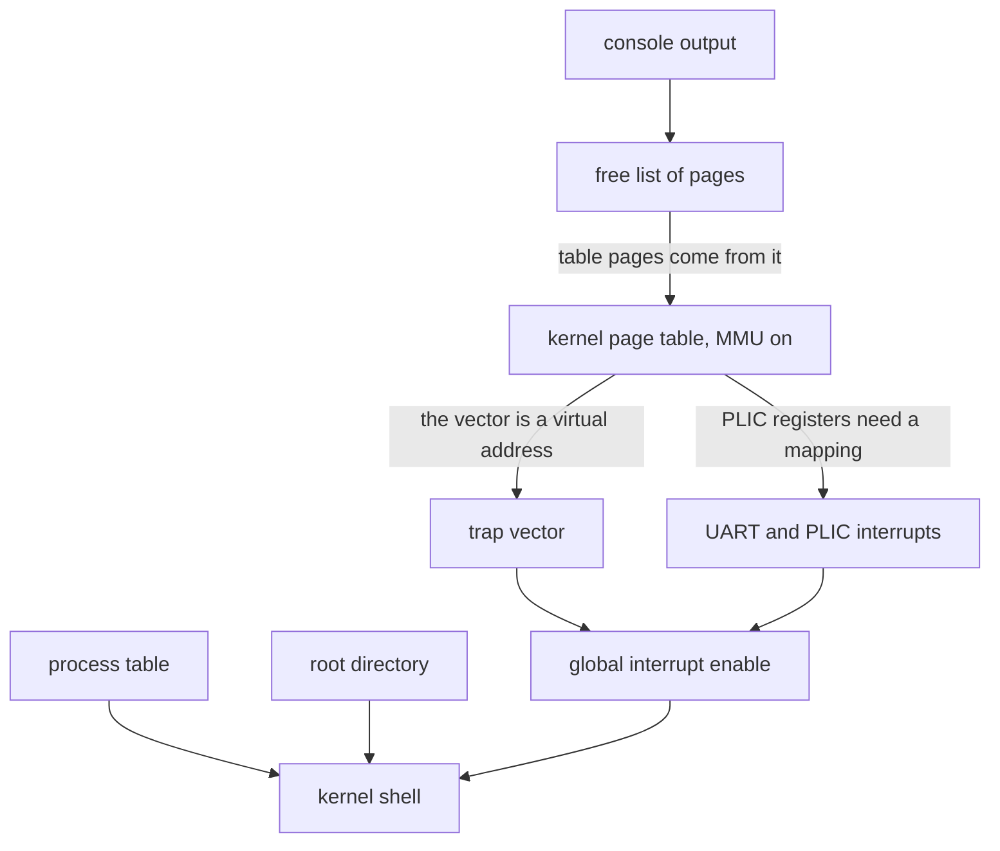

# Week 16 · Final Review and Beyond

> **Tue Dec 8** is the [final exam](../assignments/final.md), in class, in the
> regular Tuesday slot. There is no lecture that day.
>
> This page is optional reading. Its review points back into the week 15 pages,
> where the new exam material lives. **Pipes**, at the end, is not on the exam.

[Final exam](../assignments/final.md){ .md-button }
[Practice Set 3](../assignments/practice-set-03.md){ .md-button }
[Exam prep](../guides/exam-prep.md){ .md-button }

## What the final asks { #final }

The final is closed book, on paper, with the printed
[Cheatsheet](../guides/cheatsheet.md) as your one reference.

It is cumulative, weighted toward `49k`–`53k`. Everything from both midterms
may appear as a building block, as
[Practice Set 3 Part E](../assignments/practice-set-03.md#part-e-cumulative-retrieval-modules-1-and-2)
shows. The bulk is five topics, each mapped to its week 15 section
[below](#topics).

One long question follows a single operation through every layer, naming at
each step the component that acts, the CSR or structure involved, and what the
alternative would have cost.

[Practice Set 3](../assignments/practice-set-03.md), out Friday, December 4,
is the review. Work it on paper before its solutions go up on Monday.

---

## The long question, rehearsed { #long-question }

Say each walk out loud until you stop stalling. Week 15 tells one for
`$ mycat notes.txt`
[layer by layer](15-cs326-2026-12-01-fork-wait-and-the-user-shell.md#53k-layers).

### From power-on to `rv6$` { #power-on }

The machine-mode leg is short; each step is forced by the next:

| What happens | Why | Exercise |
|---|---|---|
| QEMU's reset code jumps to `0x8000_0000` | `-bios none`: the kernel is the firmware | `31k` |
| `_entry` points `sp` at the top of a 16 KiB stack | no Rust runs without a stack | `31k` |
| `start` sets `mstatus.MPP` and `mepc`, delegates traps, opens PMP, arms the timer | only machine mode can; `mret` reads MPP and `mepc` to decide where to land | `43k`, `44k` |
| `mret` into `kmain` | the only way down is a fake trap return | `43k` |

In supervisor mode, read the bring-up as a
[graph](11-cs326-2026-11-03-filesystems-boot-order-and-traps.md#42k-graph), not
a list. An arrow from A to B means A must be up before B:



One constraint has teeth: the page table must map the kernel at identical
addresses before `satp` is written, because the next instruction is fetched
through it.

The shell prints `rv6$` and waits in `wfi`. Ten times a second (1,000,000
ticks of a 10 MHz clock) the timer wakes the hart, finds the ring empty, and
`wfi` runs again.

### A keypress through `rv6$ ls` { #keypress }

At the kernel prompt `ls` is a builtin that "exits" by returning to the
shell's loop: the shortest complete path. The final's past form adds `fork` and
`exec`, the `$` half [below](#user-shell). Trace the `l`, then Enter:

| Layer | What happens | CSR or structure |
|---|---|---|
| UART | receives `l`, raises line 10 | data-ready bit |
| PLIC | source 10 is enabled, and its priority 1 beats threshold 0 | priority, enable, threshold |
| Hart | `sie.SEIE` and `sstatus.SIE` let it in: save the pc and cause, disable interrupts, jump | `sepc`, `scause`, `stvec` |
| Vector | `kernelvec` saves the caller-saved registers | kernel stack |
| Dispatch | top bit set, code 9: the console | `scause` |
| Console | claim 10, queue the byte, complete 10 ([week 12](12-cs326-2026-11-10-console-shell-and-user-mode.md#45k-claim)) | PLIC, 256-byte ring |
| Return | `sret` restores the enable and the pc | `sstatus.SPIE` |
| Shell | leaves `wfi`, pops `l`, echoes it; on Enter, splits the line and matches `ls` | ring, one `match` |
| Filesystem | takes the one lock, walks the current directory | `SpinLock`, name → inode |
| UART | each byte waits for transmit-empty; then `rv6$` again | status register |

What the alternatives cost:

- **Polling** keeps the hart spinning; `wfi` halts it until an interrupt
  arrives.
- **Skipping the PLIC complete** gives you one keystroke, ever.
- **A lock in the handler** deadlocks one hart, since the interrupted code may
  hold it. The ring needs none: one producer, one consumer.
- **Interrupts before the vector** send the first tick wherever reset left
  `stvec`.

### A command at the `$` prompt: the second half { #user-shell }

Type `run sh` and the prompt becomes `$`: an unprivileged shell, so `echo hi`
crosses the wall at every step.
[Practice Set 3, Problem 13](../assignments/practice-set-03.md#problem-13-echo-hi-end-to-end-trace-it)
walks it in full.

| Step | What happens | CSR or structure |
|---|---|---|
| `read` | `ecall`, cause 8; the trampoline saves 31 registers and switches `satp` | trapframe |
| Wait | the console read turns interrupts back on and idles in `wfi` | `sstatus.SIE` |
| Keypress | the path above, in the kernel; the byte is copied out | `stvec` = `kernelvec` |
| Return | the kernel moved the saved `sepc` past the 4-byte `ecall` and put the result in the saved `a0`; `sret` | `sepc` |
| Line | one `read` per key; on Enter, `sh` splits `echo hi` into `argv` | user memory |
| `fork` | the child gets copies of every user page, the saved registers and the file table, plus a fresh pid and page table; only its return value differs: 0 | PCB, page table |
| `wait` | no child has exited, so the parent yields, still `Runnable` | `Context` |
| Child | round robin picks it; `forkret` returns it to user mode after the `ecall` | trapframe |
| `exec` | copies the arguments in, builds the whole new address space, only then drops the old | page tables, `PTE_U` |
| Start | `sret` to address 0 with `a0` = argc, `a1` = argv; the new `satp` loads between two fences | `satp` |
| `write` | fd 1 is the console, inherited by `fork`, kept by `exec` | file table |
| `exit` | records the status, becomes a `Zombie`, switches away | PCB state |
| Reap | `wait` finds the zombie, frees its slot, returns its pid; `$` again | process table |

What the alternatives cost:

- **Dropping the old space first** leaves a failed `exec` nothing to return to.
- **Freeing the child at `exit`** loses the status that `wait` reads.

---

## The five final topics { #topics }

| Topic | Where it lives | Say this |
|---|---|---|
| `exec` | [Nov 24: `49k`](15-cs326-2026-11-24-exec-and-file-descriptors.md#thu-49k) | A fresh address space: the image at 0, one stack page holding the strings and a NULL-terminated pointer array, and a trapframe with pc 0, `sp`, argc and argv |
| File descriptors | [Nov 24: `50k`](15-cs326-2026-11-24-exec-and-file-descriptors.md#thu-50k), [exam](15-cs326-2026-11-24-exec-and-file-descriptors.md#exam-two-tables) | A capability: an index into a per-process table (0, 1, 2 start on the console) pointing into a system-wide one that holds the offset and a count |
| `fork`, `exit`, `wait` | [Dec 1: `51k`](15-cs326-2026-12-01-fork-wait-and-the-user-shell.md#fri-51k), [orphans](15-cs326-2026-12-01-fork-wait-and-the-user-shell.md#exam-init) | Parent and child resume from one `ecall` with different saved `a0`s; a dead child stays a zombie until `wait` reaps it; an orphan passes to `init` |
| `fork` + `exec` | [Dec 1: exam](15-cs326-2026-12-01-fork-wait-and-the-user-shell.md#exam-two-calls) | Between the calls a child rearranges its descriptors, so `exec` needs no redirection parameter |
| Userland | [Dec 1: `52k`](15-cs326-2026-12-01-fork-wait-and-the-user-shell.md#52k-shell), [`init`](15-cs326-2026-12-01-fork-wait-and-the-user-shell.md#exam-init), [unprivileged](15-cs326-2026-12-01-fork-wait-and-the-user-shell.md#exam-shell) | `init` is pid 1, reaper of orphans (rv6 has none); the shell reaches the kernel only through `ecall` |

---

## Beyond rv6 { #beyond }

*Not new exam material: background for the long question's last clause, what an
alternative costs.*

### What rv6 does not do { #limits }

**No disk.** The filesystem is one static `FileSystem` (`fs.rs`): 64 inodes of
at most 128 bytes, gone at power-off. A disk brings **crash consistency**: one
update is several writes, and power can fail between them. xv6 uses a
write-ahead log.

**No demand paging.** `load_segment()` (`vm.rs`) copies the whole image up
front. A page fault already arrives as cause 12, 13 or 15, with the address in
`stval`. Demand paging would map the page and return to the *same* `sepc`: a
fault is resumed, never stepped past.

**No copy-on-write.** `uvmcopy()` (`vm.rs`) copies every page, and the child
usually calls `exec` at once. With copy-on-write, both map the pages read-only
and a store fault makes the private copy.

**One hart.** QEMU runs `-smp 1`, and `CURPROC` (`usermode.rs`) is one static,
so the locks are never contended.

Smaller gaps: `sleep`/`wakeup`, preemption, signals, `dup`, directory calls,
users, and `init` (the kernel frees whatever the process you `run` leaves
behind). Pipes too, in their own section [below](#pipes), not on the exam.

### rv6 and Linux { #linux }

| Mechanism | rv6 | Linux on RISC-V |
|---|---|---|
| Boot | `mret` from `start` | OpenSBI stays in machine mode and `mret`s into Linux |
| PCB | 64 fixed `Proc` slots | a `task_struct` per thread |
| Open files | each process's 16 slots hold copies | per-process pointers to shared, counted open files |
| Scheduling | cooperative round robin | preemptive EEVDF, per-CPU run queues |
| System calls | `a7`; `write` is 16 | the same registers; `write` is 64 |

---

## Pipes (not on the exam) { #pipes }

*Not on the exam: pipes are never lectured, and
[`55k_pipes`](../assignments/extra-credit.md#55k) is design-only extra credit.
Read on because pipes tie `fork`, `dup` and `exec` together.*

### A bounded buffer with two ends { #pipes-buffer }

A **pipe** is a byte stream the kernel holds, with a read end and a write end,
each a file descriptor. It has no name in the filesystem. To rv6 it would be one more `FileKind` (`file.rs`)
variant, and no caller of `read` would change. But its buffer must be shared,
and rv6 copies each open file into every process, so pipes would also force the
[two-table design](15-cs326-2026-11-24-exec-and-file-descriptors.md#exam-two-tables).

The buffer is a ring with two **monotonic** counters, totals that only grow:

```text
  data: [u8; 512]      byte number i lives at data[i % 512]
  empty:  nread == nwrite          full:  nwrite - nread == 512
```

Two wrapped indices cannot tell empty from full; totals can, and their
difference is the count, as in week 12's
[console ring](12-cs326-2026-11-10-console-shell-and-user-mode.md#45k-ring).

### Blocking, and when `read` returns 0 { #pipes-eof }

| Call | Buffer | Other end | Result |
|---|---|---|---|
| `read` | has bytes | either | what is there, up to the request |
| `read` | empty | a writer | blocks |
| `read` | empty | no writer | 0: end of file |
| `write` | room | a reader | copies what fits, wakes a reader, blocks for the rest; returns the full count |
| `write` | full | a reader | blocks |
| `write` | any | no reader | fails: `SIGPIPE`, or -1 in xv6 |

So `read` returns 0 only when the buffer is empty **and** no writer remains.
Treat empty as EOF and a fast reader quits at the first gap. Treat a closed
writer as EOF and buffered bytes vanish.

"No writer remains" is a reference count. Every `fork` copies both ends and
every `dup` adds a name, so EOF waits for the last write descriptor anywhere.
xv6 blocks with `sleep(chan, lock)`: the caller holds the lock across its
check, and `sleep` lets go only once the caller is asleep, so no `wakeup` slips
in between. That race, week 10's
[lost wakeup](10-cs326-2026-10-27-locks-semaphores-and-the-mmu-on.md#exam-lost-wakeup),
would leave the reader asleep forever.

### `a | b` without a kernel feature { #pipes-shell }

The kernel supplies `pipe`, `dup` and `close`; the shell does the rest. `dup`
returns the **lowest free** descriptor, so you aim it by vacating a slot:

```text
  p = pipe()                                   // p[0] reads, p[1] writes
  left child:   close(1); dup(p[1]); close(p[0]); close(p[1]); exec(a)
  right child:  close(0); dup(p[0]); close(p[0]); close(p[1]); exec(b)
  shell:        close(p[0]); close(p[1]); wait(); wait()
```

Read `close(1); dup(p[1])` as "stdout is now the pipe". `exec` keeps the
descriptor table, so neither program can tell. Forget the shell's
`close(p[1])` and `b` never sees EOF. The rule: **every process closes every
pipe end it will not use.**

### Practice problems { #problems }

#### Problem 1: Trace the ring { #problem-1 }

A writer and a reader share a fresh pipe with an 8-byte buffer. Give `nread`,
`nwrite` and the result of each step. At which index does `!` land?

```text
  1  write("pipes", 5)      5  read(buf, 16)
  2  read(buf, 2)           6  the writer closes
  3  write("rule!", 5)      7  read(buf, 16)
  4  write("x", 1)          8  read(buf, 16)
```

<details markdown="1">
<summary>Click to reveal solution</summary>

| Step | Why | `nread` | `nwrite` | Result |
|---|---|---|---|---|
| 1 | room 8 | 0 | 5 | 5 |
| 2 | 5 available | 2 | 5 | 2: `pi` |
| 3 | room 8 − 3 = 5 | 2 | 10 | 5 |
| 4 | room 0: full | 2 | 10 | blocks |
| 5 | 8 available | 10 | 10 | 8: `pesrule!` |
| 4, done | the writer wakes | 10 | 11 | 1 |
| 6 | no writer now | 10 | 11 | |
| 7 | 1 available | 11 | 11 | 1: `x` |
| 8 | empty, no writer | 11 | 11 | 0: EOF |

`!` is byte number 9, at index 9 % 8 = 1: step 3 wraps. Step 7 is the lesson.
The writer is gone, yet `read` returns a byte, because EOF also needs an empty
buffer.

</details>

#### Problem 2: Find the hang { #problem-2 }

A shell builds `ls | wc` with `p[0]` = fd 3 and `p[1]` = fd 4. `ls` finishes,
but `wc` never prints. Which process holds the descriptor that prevents EOF?

```text
  left child:   close(1); dup(4); close(3); close(4); exec(ls)
  right child:  close(0); dup(3); close(3); exec(wc)
  shell:        close(3); close(4); wait(); wait()
```

<details markdown="1">
<summary>Click to reveal solution</summary>

`wc` itself. It inherited fd 4 and never closed it, so once `ls` exits and
the shell closes its copy, `wc` holds the last write descriptor. It drains the
buffer and blocks forever; so does the shell, in `wait`.

`exec` kept fd 4 open, and nothing in `wc` knows it exists. The fix is
`close(4)` before `exec`.

</details>

---

## Further reading { #reading }

- [rv6 Architecture](../guides/rv6-architecture.md): the
  [boot sequence](../guides/rv6-architecture.md#the-boot-sequence), the
  [three trap paths](../guides/rv6-architecture.md#the-three-trap-paths) and the
  [two shells](../guides/rv6-architecture.md#two-shells).
- [Exam Prep](../guides/exam-prep.md#how-to-prepare) and
  [Key Concepts](../guides/key-concepts.md).
- [The xv6 book](https://pdos.csail.mit.edu/6.828/2023/xv6/book-riscv-rev3.pdf),
  chapter 7: `sleep` and `wakeup`.
- For [Pipes](#pipes), which is not on the exam: chapter 1 of the xv6 book, and
  Linux `pipe(7)` for buffer sizes and `PIPE_BUF`.
