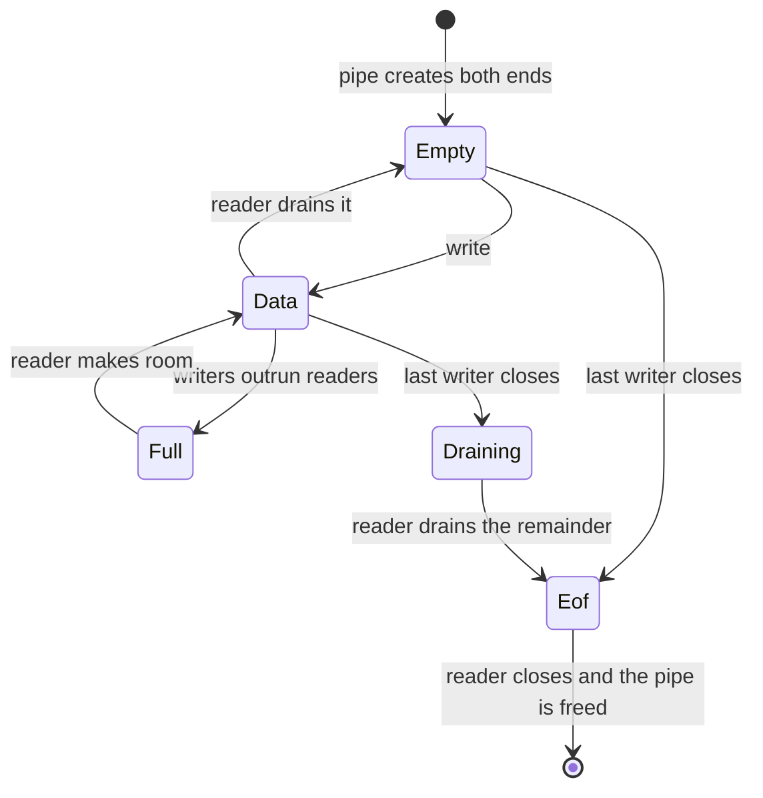
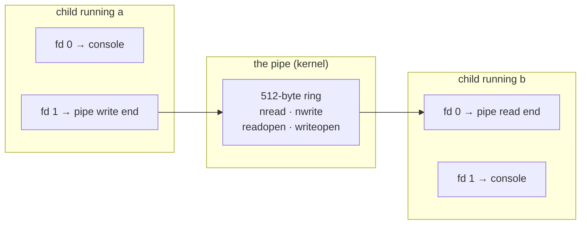
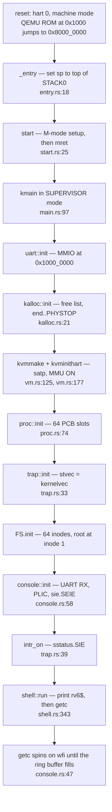

# Pipes, the Payoff, and Final Review

## Overview

The last session, in three parts. **Pipes**: a bounded ring buffer with a
reader end and a writer end, each named by a file descriptor. The buffer is
tiny and uninteresting; the semantics are the whole subject, and one rule —
when `read` returns 0 — is the most reliably mis-implemented detail in Unix.
Once the buffer exists, `a | b` needs no new kernel feature at all: fork twice,
`dup` the two ends onto stdin and stdout, exec both children. **The payoff**:
the `wc` and `grep` you wrote in week 3, recompiled as `no_std` for RISC-V and
running on the kernel you built, from source files that never contained a
target-specific line. A working `grep` is 2,854 bytes against a 64 KiB budget.
**Final review**: one annotated walk from power-on to the `rv6$` prompt naming
every mechanism as it appears, a table mapping each rv6 mechanism to its Linux
counterpart, an honest list of what rv6 does not do, and the precise scope of
the final. Concept behind `22_userland` and the
[extra-credit set](../assignments/extra-credit.md).

## Learning Objectives

- **Describe** a pipe as a bounded ring buffer behind two file descriptors, and
  say what each cursor and each open-flag means.
- **State** the blocking rules for pipe `read` and `write`, and **derive** the
  end-of-file rule from them rather than memorising it.
- **Explain** why a pipe fd must be closed in every process that does not use
  it, and **predict** the exact failure when it is not.
- **Construct** `a | b` from `pipe`, `fork`, `dup`, `close`, and `exec` alone,
  naming the fd table of every process at every step.
- **Compare** this design with xv6's `pipe.c` and Linux's pipefs, including
  `SIGPIPE`, `PIPE_BUF`, and the 64 KiB default buffer.
- **Explain** how one unmodified command source compiles for both a laptop and
  a bare-metal RISC-V kernel, and what the `ulib` façade is doing.
- **Walk** rv6 from the first instruction after reset to a blocked `getc` at
  the shell prompt, naming the mechanism at every step.
- **Map** each rv6 mechanism onto its Linux counterpart, and **state** what rv6
  omits and what each omission would cost to fix.

## Prerequisites

- Exercises `20_file_descriptors` and `21_fork_wait` — the `ofile` table, the
  console at fds 0/1/2, and the call that returns twice.
- Exercise `22_userland` and last session — `exec_into`, and the shell as an
  ordinary unprivileged program.
- Exercises `07_spinlocks` and `08_semaphores` — a pipe is shared mutable state
  touched by two processes, which is what those exercises were for.
- Exercises `01_boot`, `02_physical_memory`, `03_paging`, and `12_boot_to_life`
  — section 4 walks all of them in order.
- The [rv6 Architecture](../guides/rv6-architecture.md) and
  [Memory Map](../guides/memory-map.md) guides.
- The [ulib and Commands](../guides/ulib-and-commands.md) guide — the five
  Module 1 commands that section 3 puts on your kernel.

---

## 1. A Pipe Is a Bounded Buffer With Two Names

A pipe is a kernel-resident byte stream with a reader end and a writer end.
Bytes written at one end come out at the other, in order, once. There is no
record structure, no message boundary, no seeking, and no name in the
filesystem — a pipe exists only as long as some process holds a descriptor for
it. (The named variant, a **FIFO**, is the same object with a filesystem entry
so unrelated processes can find it; `mkfifo` makes one.)

Two things make it worth building. First, it is the first object in this course
that two processes **share without sharing memory**. `fork` gives a child a
*copy* of the parent's address space; a pipe gives two processes a channel the
kernel owns and both can name. Second, it costs almost nothing to add, because
the file descriptor layer already exists. `FileKind` (`file.rs:23`) is an enum
with `Console` and `Inode`; a pipe is a third variant. `sys_read` and
`sys_write` (`syscall.rs:468`, `syscall.rs:517`) already dispatch on it. The
program's side of the interface does not change by one byte.

> Key idea: "everything is a file" is not a slogan about files. It is the claim
> that one small interface — read, write, close, with an integer as the handle —
> is enough to name a console, a disk file, a network connection, and a channel
> between two processes. The proof is that adding pipes changes no caller.

### The ring buffer

```text
        struct Pipe                                PIPESIZE = 512
  +-----------------------------------------------------------------+
  |  data: [u8; 512]                                                |
  |                                                                 |
  |     |<-- already consumed -->|<-- readable -->|<--- free --->|   |
  |     0                      nread           nwrite          ...  |
  |                                                                 |
  |  nread     : total bytes ever read from this pipe  (monotonic)  |
  |  nwrite    : total bytes ever written to it        (monotonic)  |
  |  readopen  : is at least one reader end still open?             |
  |  writeopen : is at least one writer end still open?             |
  +-----------------------------------------------------------------+

  available = nwrite - nread              invariant: 0 <= this <= 512
  byte i lives at data[i % 512]
  empty  <=>  nread == nwrite
  full   <=>  nwrite - nread == 512
```

The cursors are **monotonic totals**, not wrapped indices, and the reason is a
classic. With two wrapped indices, `head == tail` means both "empty" and
"full" — indistinguishable — so a wrapped design must waste one slot or carry a
separate count. Monotonic counters plus modulo indexing distinguish the two
cases for free, and the difference `nwrite - nread` *is* the count. The cost is
that the counters eventually overflow; at 64 bits and one gigabyte per second
that is about 580 years, so xv6 and rv6 both take the deal.

The buffer is deliberately small. 512 bytes is xv6's `PIPESIZE`; a plausible
rv6 choice is the same, since a fixed `[u8; 512]` in a `SpinLock`-protected
table needs no allocator, exactly like `PROCS` (`proc.rs:65`). Linux uses 16
pages — 64 KiB — per pipe by default, adjustable with `fcntl(F_SETPIPE_SZ)` up
to `/proc/sys/fs/pipe-max-size`. Bigger buffers mean fewer blocking round trips
and more memory pinned per pipe; the number is a throughput/footprint knob, not
a correctness one.

### Blocking: the whole semantics in six rows

| Call | Buffer | Other end | What happens |
|---|---|---|---|
| `read` | has bytes | either | copy out `min(n, available)`, advance `nread`, **return that count** |
| `read` | empty | a writer is open | **block** until data arrives or the last writer closes |
| `read` | empty | no writer open | **return 0** — end of file |
| `write` | has room | a reader is open | copy in as much as fits, advance `nwrite`, wake a reader |
| `write` | full | a reader is open | **block** until a reader drains it |
| `write` | any | no reader open | **error**: `SIGPIPE`/`EPIPE` on Unix, `-1` in rv6 |

> Key distinction: a `read` that returns fewer bytes than you asked for is
> completely normal and is **not** end of file. It means "this is what was here
> when I looked." Only a return of **0** means end of file. Every correct
> pipe-reading loop is `while n = read(...) > 0`, never `if n < len { done }`.

### The end-of-file rule, which everyone gets wrong

```text
    read returns 0   <=>   nread == nwrite   AND   writeopen == false
                           ^^^^^^^^^^^^^^^         ^^^^^^^^^^^^^^^^^^
                           the buffer is empty     no writer can ever
                                                   put anything in it
```

Both halves are load-bearing, and dropping either one produces a bug that is
easy to write and hard to read:

| Wrong rule | What breaks | Symptom |
|---|---|---|
| empty ⇒ EOF | a reader that outruns a slow writer sees EOF at the first gap | `cat big.txt \| wc -l` prints a number that changes each run, often 0 |
| last writer closed ⇒ EOF | bytes still sitting in the buffer are discarded | `echo hi \| cat` prints nothing at all |
| neither (block forever) | EOF never happens | `wc` hangs after the input ends |

"The last writer" is the other half of the trap, and it is a **reference
counting** problem. Every `fork` duplicates the process's whole fd table, and
every `dup` adds another descriptor; each one is another way to write to the
pipe. `writeopen` may only become false when the *count* of open write
descriptors reaches zero, not when some particular `close` happens. This is why
section 2's construction closes six descriptors for a two-stage pipeline: each
unclosed one is a reference that keeps EOF from ever arriving.



### Where "block" comes from in rv6

rv6 has no `sleep`/`wakeup`. It has `proc_yield` (`usermode.rs:363`) and a
round-robin policy (`sched.rs:20`), so blocking is a polling loop: take the
lock, test the condition, release the lock, `proc_yield`, repeat. That is
exactly the shape of `sys_wait` (`syscall.rs:141`), and on a single hart it is
correct — just wasteful, since a blocked reader is `Runnable` and burns a
timeslice each rotation.

xv6 does better with `sleep(chan, lock)` / `wakeup(chan)`, where the "channel"
is nothing but an address used as a token — typically `&pipe->nread`. The
subtlety worth carrying away is why `sleep` takes the lock as an argument:

```text
    BROKEN                                  Process A            Process B
      lock(); if empty { unlock(); sleep(); }
                                      A: sees empty
                                      A: unlock()
                                                          B: write, wakeup()
                                      A: sleep()   <-- sleeps forever
```

The wakeup lands in the window between "unlock" and "sleep" and is lost. The
fix is to make releasing the lock and going to sleep a single step from the
waker's point of view, which is why `sleep` must be handed the lock rather than
being called after it is dropped. Every condition-variable API in existence —
`pthread_cond_wait`, Rust's `Condvar::wait`, Linux's `wait_event` — has the same
signature for the same reason.

---

## 2. `a | b` Falls Out of Machinery You Already Have

Here is the claim that makes this section worth a lecture: **the shell's `|`
operator is not a kernel feature.** The kernel supplies three primitives —
`pipe`, `dup`, `close` — none of which knows what a pipeline is. The shell
composes them with `fork` and `exec`, which it already had.

`dup(fd)` returns the **lowest-numbered free descriptor** referring to the same
open file. That "lowest-numbered" rule looks like an implementation detail; it
is in fact the entire mechanism, because it lets a program aim a descriptor by
first vacating the slot it wants:

```text
    close(1);          // fd 1 is now the lowest free descriptor
    dup(pipe_write);   // ...so the copy necessarily lands in fd 1
```

Two calls, and stdout is the pipe. Nothing in `a` knows or can find out. POSIX
later added `dup2(old, new)`, which names the target explicitly, because the
close-then-dup idiom is not atomic: in a threaded program another thread can
open a file in the gap and steal slot 1.

### The construction

```text
  shell:  p = pipe()                      p[0] = read end, p[1] = write end

          fork() -> left child
              close(1); dup(p[1])         stdout is now the pipe
              close(p[0]); close(p[1])    drop both originals
              exec("a")                   fds survive exec

          fork() -> right child
              close(0); dup(p[0])         stdin is now the pipe
              close(p[0]); close(p[1])    drop both originals
              exec("b")

          close(p[0]); close(p[1])        <-- THE PARENT MUST CLOSE TOO
          wait(); wait()
```

Six closes for one `|`. Every one of them is required, and the parent's two are
the ones people forget.



Notice what `exec` contributes: **nothing**. The child rearranges its own
descriptors *before* becoming `a`, and `exec` preserves the fd table because it
replaces only the address space (`exec.rs:753`). That is the payoff of the
`fork`/`exec` split argued last session, made concrete: redirection and
pipelines need no parameters on `exec`, because there is a whole process
in between where ordinary code can run.

### Why the parent must close, and what happens when it doesn't

Suppose the shell forgets `close(p[1])`. Then `a` finishes and closes its copy,
but the shell still holds a write descriptor, so the pipe's write reference
count never reaches zero, so `writeopen` stays true, so `b`'s `read` on the
empty buffer takes the *block* branch instead of the *EOF* branch. `b` waits
forever, the shell's first `wait` waits forever, and the terminal hangs.

The instructive part is where the symptom appears. Nothing is wrong with `b`;
nothing is wrong with the pipe code; the bug is a missing line in a process
that is not even involved in the data path. This is the canonical Unix
debugging story, and the rule that prevents it is one sentence:

> **Rule:** every process must close every pipe descriptor it is not going to
> use — including the shell, and including the end it handed to somebody else.

### Consequences you have been living with

- **`yes | head -1` terminates.** `head` prints one line and exits, closing the
  read end. `yes`'s next `write` finds no reader and takes the error row of the
  table — `SIGPIPE`, whose default action is to kill the process. Producer
  termination is not politeness; it is a signal you never see.
- **`echo hi | read x` leaves `x` unset** in a POSIX shell. Both sides of a
  pipeline are children, so the assignment happens in a process that
  immediately exits. Bash's `lastpipe` option exists to walk this back.
- **A pipeline's exit status is the last stage's**, which is why `false | true`
  succeeds, and why bash added `PIPESTATUS` and `set -o pipefail`.
- **Pipes deadlock in cycles.** If A writes 4 KB to B and then reads B's reply
  while B does the same, and the buffer is 512 bytes, both block in `write`
  with neither ever reaching its `read`. Bounded buffers make one-directional
  pipelines safe and bidirectional ones a design problem — which is why
  `popen(3)` is one-directional and why two-way plumbing means `socketpair` and
  `select`/`poll`.
- **Small writes are atomic; large ones are not.** POSIX guarantees that a
  write of at most `PIPE_BUF` bytes (4096 on Linux, 512 minimum by standard)
  into a pipe is not interleaved with another writer's. Beyond that, two
  processes writing to one pipe can shred each other's lines. Every log file
  written by several processes at once depends on this number.

Doug McIlroy proposed the idea in a 1964 memo — programs that "screw together
like garden hose" — and argued for it for nine years. Ken Thompson implemented
it in Version 3 Unix in 1973, reportedly in a single night, and the toolbox
philosophy that the rest of Unix is famous for was rewritten around it almost
immediately. The kernel mechanism is a couple of hundred lines. The idea is the
part that mattered.

---

## 3. The Payoff: Your Own Commands on Your Own Kernel

In week 3 you wrote `echo`, `cat`, `wc`, `head`, and `grep` against a façade
called `ulib` and ran them on your laptop under `cargo test`. At the time the
façade looked like ceremony. This is what it was for.

### One source, two machines

`ulib` has two backends chosen by the **target triple**, not a feature flag
(`ulib/src/lib.rs:19`):

```rust
#![cfg_attr(target_os = "none", no_std)]

#[cfg(not(target_os = "none"))] mod host;   // std: real files, process::exit
#[cfg(target_os = "none")]      mod rv6;    // ecall into YOUR kernel
```

Your command source contains **no `cfg` attribute at all** — one `cfg_attr`
line at the top and one `ulib::main!(run)`, both supplied by the macro. That is
the difference between a façade and a wrapper: the seam is at the bottom of the
program, so nothing above it has to know which world it is in. Selecting on
`target_os` rather than a cargo feature is deliberate; a feature can be set
wrongly and the failure mode is a wall of `no_std` link errors, whereas a
triple is derived from what you actually asked cargo to build.

One line in `grep.rs` is the whole demonstration:

```rust
ulib::write_all(STDOUT, line)?;
```

On your laptop that becomes `write(2)`. On `riscv64gc-unknown-none-elf` it
becomes three instructions (`ulib/src/sys/rv6.rs:21`):

```asm
li    a7, 16          # SYS_WRITE — the number from syscall.rs:28
                      # a0 = fd, a1 = buffer, a2 = length
ecall
```

and from there: the trampoline you wrote in `18_user_mode`, `usertrap`
(`usermode.rs:385`), `dispatch` (`syscall.rs:33`), `sys_write`
(`syscall.rs:517`), `getfile` (`syscall.rs:312`), and finally `uart::putc`
against the NS16550A at `0x1000_0000`. Every layer between the program and the
glass is yours.

### From your source to a page in your address space

```text
  commands/src/bin/grep.rs        (byte-identical to week 3)
        |
        |  cargo build --release --target riscv64gc-unknown-none-elf
        v
  grep                            ELF64, little-endian, e_machine = 243, ET_EXEC
        |
        |  flatten: keep PT_LOAD segments at their p_vaddr, zero-fill
        |           the p_memsz tail — rv6 has no ELF loader
        v
  rv6/src/userbin/grep.bin        2,854 bytes
        |
        |  include_bytes! from the generated userbin.rs
        v
  the kernel image                exec::lookup("mygrep") finds it
        |
        |  build_addrspace -> load_segment (vm.rs:196)
        v
  a fresh page table              image at USER_CODE = 0x0, R|X|U
                                  stack at USER_STACK = 0x1_0000, R|W|U
                                  sret; the CPU executes byte 0
```

Two consequences of "flat image, byte 0 is the entry point" are worth naming.
`ulib::main!` places `_start` in `.text.start` (`ulib/src/entry.rs:31`) and the
user linker script puts that section first, because a flat image has no
`e_entry` field to read — without that, the linker is free to order some other
function first and the program jumps into the middle of itself. And the image
pages are mapped `PTE_R | PTE_X | PTE_U` with **no** `PTE_W` (`vm.rs:228`),
which means a shipped command cannot have a mutable global at all: its buffers
live on the stack, which is the one `R|W|U` page. The address space is
accidentally W^X, and the reason is that a flat image has nowhere to put a
`.bss`. Teaching the kernel to read real ELF is exactly what fixes both, and is
exercise `23_elf_loader`.

### The numbers

| Command | Image | Pages `load_segment` allocates | Fraction of the 64 KiB budget |
|---|---|---|---|
| `echo` | 384 bytes | 1 | 0.6% |
| `cat` | 1,256 bytes | 1 | 1.9% |
| `wc` | 1,821 bytes | 1 | 2.8% |
| `head` | 2,713 bytes | 1 | 4.1% |
| `grep` | 2,854 bytes | 1 | 4.4% |

The budget is `MAX_PROG_PAGES = 16` pages (`memlayout.rs:65`), which is 64 KiB
— the window between `USER_CODE` at 0 and `USER_STACK` at `0x1_0000`. All five
commands together are 9,028 bytes: 14% of what a *single* program is allowed.

Sit with the `grep` line for a second. That is a real substring search over
arbitrary input, with argument parsing, file opening, line splitting across
buffer boundaries, and error reporting to stderr, in 2,854 bytes — on the order
of a thousand compressed RISC-V instructions plus its string literals. There is
no allocator, no standard library, no runtime, no dynamic linker, no unwinder,
and no `.bss`. For comparison, a "hello world" statically linked against glibc
is comfortably over half a megabyte; against musl, roughly 20 KB; and neither
of those is doing anything.

What removed the weight is not cleverness, it is absence: `#![no_std]` deletes
formatting machinery and the collection types, `panic = "abort"` with the
single panic handler in `ulib` (`ulib/src/sys/rv6.rs:66`) deletes unwinding,
and static linking to a flat image deletes relocation and the loader. The
lesson generalises past this course. Most of the size of ordinary software is
infrastructure that was linked in because it was easier to have it than to
decide you did not need it.

---

## 4. Final Review I: Power-On to a Prompt

One walk, in order, naming the mechanism at each step. If you can narrate this
out loud you can answer most of what the final asks.



| # | What happens | Mechanism being demonstrated | Where | Exercise |
|---|---|---|---|---|
| 0 | Reset; QEMU's ROM jumps to RAM base with `a0` = hartid, `a1` = device tree | There is no BIOS: the kernel *is* the firmware | `-bios none` | `01` |
| 1 | `_entry` sets `sp` to the top of a 16 KiB static array, calls `start` | Rust cannot run without a stack, and the linker script puts `.entry` first | `entry.rs:18`, `kernel.ld` | `01` |
| 2 | `start` sets `mstatus.MPP = S`, `mepc = kmain`, delegates traps, opens PMP, arms the CLINT timer, `mret` | **Dropping privilege by faking a trap return** — the only way down | `start.rs:25` | `13`, `14` |
| 3 | `uart::init` programs the NS16550A | Memory-mapped I/O: a device is a struct at a fixed address | `uart.rs`, `memlayout.rs:17` | `01`, `11` |
| 4 | `kalloc::init` links every 4 KiB page from `end` to `PHYSTOP` into a free list | The free list lives *in* the free pages: an allocator that needs no memory | `kalloc.rs:21` | `02` |
| 5 | `kvmmake` builds an Sv39 tree, copies the trampoline to its own page, maps it at `MAXVA - PGSIZE`; `kvminithart` writes `satp` and `sfence.vma` | **The MMU turns on between two instructions.** The identity map is what makes the next one fetchable | `vm.rs:125`, `vm.rs:177` | `03`, `09` |
| 6 | `proc::init` resets 64 PCB slots and `NEXTPID` | A fixed table, not a linked list: no allocator in the process layer | `proc.rs:74`, `param.rs` | `04` |
| 7 | `trap::init` writes `stvec` | One register decides where every supervisor trap lands | `trap.rs:33` | `13` |
| 8 | `FS.init` creates the root directory | 64 inodes, 128-byte files, all in RAM behind one `SpinLock` | `fs.rs:5`, `fs.rs:73` | `07`, `10` |
| 9 | `console::init` enables UART RX, configures the PLIC, sets `sie.SEIE` | Interrupt routing: device → PLIC → hart → `stvec` | `console.rs:58`, `plic.rs` | `15` |
| 10 | `intr_on` sets `sstatus.SIE` | The global enable, deliberately last: nothing may interrupt half-built state | `trap.rs:39` | `14` |
| 11 | `shell::run` prints `rv6$ ` and calls `getc`, which loops on `wfi` | Blocking, honestly implemented: halt the core until an interrupt | `shell.rs:343`, `console.rs:47` | `16` |
| 12 | You press a key: UART IRQ → PLIC claim → `kernelvec` → `kerneltrap` → `console::intr` pushes to the 256-byte ring → `plic::complete` | Producer/consumer across an interrupt boundary, no lock needed on one hart | `trap.rs:46`, `console.rs:68` | `15` |

From `rv6$` onward the story is the one told last session: `run sh` execs a
user-mode shell, which `fork`s, has the child `exec` your command, and `wait`s.
Six user↔kernel transitions, two address spaces built and one destroyed, per
word typed.

---

## 5. Final Review II: rv6 and Linux, Side by Side

Everything in the left column is something you wrote. The point of the right
column is that you now know what to *look for* — the names differ, the problems
do not.

| Mechanism | rv6 | Linux | Where to read it |
|---|---|---|---|
| First instruction | `_entry` at `0x8000_0000`, 16 KiB static stack | `_start` in RISC-V head code, then `start_kernel` | `arch/riscv/kernel/head.S`, `init/main.c` |
| Privilege drop | `mret` in `start.rs:54` | the same `mret`, executed by OpenSBI firmware | `arch/riscv/kernel/head.S` |
| Physical allocator | free list of 4 KiB pages | buddy allocator + SLUB for small objects | `mm/page_alloc.c`, `mm/slub.c` |
| Page tables | Sv39, three levels, `walk` + `mappages` | Sv39/Sv48/Sv57, five-level generic code | `arch/riscv/mm/`, `mm/memory.c` |
| Kernel mapping | all RAM identity-mapped R+W+X | direct map plus per-section permissions, KASLR, no W+X | `mm/init.c` |
| PCB | `Proc`, a fixed `[Proc; 64]` | `task_struct`, several kilobytes, one per **thread** | `include/linux/sched.h` |
| Context switch | `swtch`, 14 callee-saved registers | `__switch_to`, plus lazy FPU/vector state | `arch/riscv/kernel/entry.S` |
| Scheduler | round robin over the table (`sched.rs:20`) | EEVDF, per-CPU runqueues, load balancing, cgroups | `kernel/sched/fair.c` |
| Locking | `SpinLock<T>` over one `AtomicBool` | qspinlocks, mutexes, rwsems, seqlocks, RCU | `kernel/locking/` |
| Trap entry | trampoline page + per-process trapframe | trap vector saving `pt_regs` on the kernel stack | `arch/riscv/kernel/entry.S` |
| Syscall ABI | `ecall`, `a7` = number, `a0`–`a2` args, result in `a0` | identical ABI, roughly 350 numbers | `include/uapi/asm-generic/unistd.h` |
| fd table | `[File; 16]` stored **by value** (`proc.rs:39`) | `files_struct` → `struct file *`, refcounted and shared | `fs/file.c`, `fs/open.c` |
| What an fd names | `FileKind::{Console, Inode}` | `struct file_operations` — dozens of backends | `include/linux/fs.h` |
| `read` | `sys_read` (`syscall.rs:468`) | `ksys_read` → `vfs_read` → the file's `read_iter` | `fs/read_write.c` |
| Filesystem | 64 inodes, 128-byte files, RAM only | VFS over ext4/xfs/btrfs, page cache, journalling | `fs/` |
| Console | 256-byte ring, no line discipline | tty layer, termios, `n_tty` line discipline | `drivers/tty/n_tty.c` |
| Process creation | `fork` copies every page eagerly | `clone3` with copy-on-write; `fork` is one flag set | `kernel/fork.c` |
| Program loading | flat image copied to VA 0 | ELF parsing, `binfmt_elf`, `mmap`, dynamic linker | `fs/binfmt_elf.c` |
| Interrupts | PLIC claim/complete, one hart | irqchip drivers, threaded IRQs, per-CPU affinity | `drivers/irqchip/` |

Two functions transfer most directly. `ksys_read` in `fs/read_write.c` is
`sys_read` with reference counting and an iterator; `kernel_clone` in
`kernel/fork.c` is `sys_fork` with thirty years of flags. Open either one and
you will recognise the shape.

---

## 6. Final Review III: What rv6 Does Not Do

Being precise about the gap is part of understanding the thing. Four big
omissions, and what each would actually take.

**No disk.** The filesystem is a `static FileSystem` in RAM (`fs.rs:73`): 64
inodes, 128 bytes per file, gone at power off. Fixing it needs a virtio-blk
driver (about 150 lines of descriptor-ring MMIO), a buffer cache, and an
on-disk layout of superblock, inode table, and free bitmap. The hard part is
none of those — it is **crash consistency**. A write that updates an inode and
a data block is two writes, and the machine can die between them. xv6 answers
with `log.c`, a write-ahead log, and it is the most subtle file in that kernel.

**No demand paging.** `load_segment` (`vm.rs:196`) copies the entire image
eagerly before the program ever runs; no page is ever mapped absent and fetched
on use. The machinery is nearly there: a page fault already arrives as `scause`
12, 13, or 15 with the faulting address in `stval`. What is missing is the
policy — leave PTEs invalid, and in `usertrap` allocate a page, fill it from a
backing store, `sfence.vma`, and return to the *same* `sepc` so the faulting
instruction re-executes. That last detail is the whole trick: a page fault is a
trap you resume from rather than advance past, which is why `usertrap` adds 4
to `epc` for `ecall` (`usermode.rs:401`) and must not for a fault.

**No copy-on-write.** `uvmcopy` (`vm.rs:383`) duplicates every page of the
parent, and in the overwhelmingly common case the child immediately `exec`s and
throws all of it away. COW is: map both parent and child read-only, keep a
reference count per physical page, and on a store fault (`scause` 15) allocate
a private copy, decrement the count, restore `PTE_W`, retry. That is roughly
half a page of code and one new array, and it turns `fork` from O(address
space) into O(page table). It is also the single change that would most improve
rv6's numbers.

**No SMP.** One hart, assumed everywhere. `CURPROC` is a single `static mut`
(`usermode.rs:206`), there is one scheduler loop, and the `SpinLock` you wrote
is real but never contended. Going multi-core needs per-hart state reached
through `tp`, a scheduler context per hart, and inter-processor interrupts —
but the work that would take the longest is auditing every `static mut` in the
kernel, because single-hart code is permitted to be sloppy in ways SMP code
cannot be. Note which half is already sound: the *locks* are correct; the
*sharing discipline* around them is what has never been tested.

Shorter, and each roughly an afternoon: signals; `sleep`/`wakeup` instead of
polling; kernel preemption; `chdir`/`mkdir`/`readdir` system calls, whose
absence is exactly why `ls` cannot yet be a user program; ELF loading
(`23_elf_loader`); `pipe` and `dup` (design-only extra credit); users and permissions; a real
clock; and networking. None of them is mysterious now.

---

## 7. The Final Exam

**When:** December 11–17, in the registrar's assigned slot — check the official
schedule, not this page. **Format:** pencil and paper, closed book, one
permitted reference: the [Cheatsheet](../guides/cheatsheet.md), printed. No
devices. Worth 20% of the grade.

**Scope:** cumulative, weighted toward Module 3. Anything from either midterm
may appear as a building block, but no question rests only on old material. The
bulk of the exam is:

- `exec` and program loading — building an address space, copying the image,
  mapping a stack, pushing `argv`, pointing the trapframe at the entry point
- file descriptors — the fd as an unforgeable capability, the per-process table
  versus the system-wide open-file table, shared offsets, fds 0/1/2,
  reference counting
- `fork`, `exit`, `wait` — the call that returns twice, inherit versus copy,
  zombies and reaping, the process tree, reparenting
- `fork` + `exec` together — why the split exists and what it makes possible
- userland — `init` as pid 1, and what it means for the shell to be an ordinary
  unprivileged program
- pipes — the ring buffer, the blocking rules, the EOF rule, and the
  `fork`/`dup`/`exec` construction of `a | b`

On pipes specifically: they are examinable **exactly as this lecture presents
them** — semantics and construction. Pipes are extra credit and have no starter, so no question
depends on having implemented one.

Expect one long question that walks a single operation through every layer.
Past form: *trace `rv6$ ls` from the keypress that completes the line to the
moment `ls` exits*, naming at each step which component acts, which CSR or data
structure is involved, and what the alternative would have cost. Section 4 of
this page is the other half of that question, told from power-on. Prepare by
narrating both out loud. Then do
[Practice Set 3](../assignments/practice-set-03.md) on paper, and reread
[rv6 Architecture](../guides/rv6-architecture.md), which is the best single
revision document in the course.

---

## Key Concepts

| Concept | Definition | Example |
|---|---|---|
| Pipe | A bounded in-kernel byte stream with a reader end and a writer end, each named by an fd, and no filesystem name | `pipe()` returns `p[0]` read, `p[1]` write |
| Ring buffer | A fixed array indexed modulo its length, with monotonic total counters so empty and full are distinguishable | `data[i % 512]`, `available = nwrite - nread` |
| Pipe EOF rule | `read` returns 0 only when the buffer is empty **and** the last writer has closed | Buffer empty but `writeopen` true ⇒ block, not EOF |
| Short read | A `read` returning fewer bytes than requested; normal, and not EOF | `read(fd, buf, 16)` returns 8 with 8 bytes buffered |
| `dup` | Copy a descriptor into the lowest free slot, so `close(1); dup(w)` aims stdout | The one mechanism behind `>` and `\|` |
| `SIGPIPE` | The signal delivered when a process writes to a pipe with no reader; default action is death | `yes \| head -1` terminates because of it |
| `PIPE_BUF` | The largest write POSIX guarantees will not interleave with another writer's | 4096 on Linux; 512 is the standard's minimum |
| Lost wakeup | A `wakeup` that lands between "test the condition" and "sleep", so the sleeper never wakes | Why `sleep(chan, lock)` takes the lock |
| Façade | An interface whose implementation is chosen below the seam, so callers contain no conditionals | `ulib` picks `host`/`rv6` on `target_os = "none"` |
| Flat image | A program stored as raw bytes loaded at a fixed address, with entry = byte 0 and no `.bss` | `grep.bin`, 2,854 bytes, mapped at `USER_CODE` |
| Image budget | `MAX_PROG_PAGES` pages between `USER_CODE` and `USER_STACK` | 16 × 4 KiB = 64 KiB (`memlayout.rs:65`) |
| Copy-on-write | Sharing pages read-only after `fork` and copying only on a store fault | Absent in rv6; `uvmcopy` copies eagerly (`vm.rs:383`) |

---

## Practice Problems

### Problem 1: Find the hang

A shell builds `sort | uniq` like this:

```text
    p = pipe()
    if fork() == 0 { close(1); dup(p[1]); close(p[0]); close(p[1]); exec("sort") }
    if fork() == 0 { close(0); dup(p[0]); close(p[0]); close(p[1]); exec("uniq") }
    close(p[0])
    wait(); wait()
```

Input is piped in and the terminal hangs. Which line is missing, what is the
precise state of the pipe when the system stops, and in which process does the
symptom appear?

<details>
<summary>Click to reveal solution</summary>

The missing line is `close(p[1])` in the **parent**.

State when it stops: `sort` has read all its input, written its output, and
exited, closing its copy of the write end. `uniq` has consumed everything in
the buffer, so `nread == nwrite` — the pipe is empty. But the shell still holds
`p[1]`, so the pipe's write reference count is 1, not 0, and `writeopen`
remains true.

`uniq`'s `read` therefore takes the *block* branch of the table in section 1
instead of the *EOF* branch. It blocks forever. The shell's first `wait` blocks
forever waiting for a child that will never exit.

The symptom appears in `uniq` — a process that is behaving perfectly correctly
and contains no bug. This is what makes the error hard: the faulty line is in a
process that is not part of the data path at all. Note also that closing
`p[0]` in the parent (which the code does do) is not enough and not the
relevant half; it is the *write* end that gates EOF.
</details>

### Problem 2: Trace the ring buffer

A pipe with `PIPESIZE = 8`. Starting from a fresh pipe, give `nread`, `nwrite`,
and the return value after each step, and say which physical index holds the
byte `k`.

1. writer: `write("abcde", 5)`
2. reader: `read(buf, 3)`
3. writer: `write("fghijk", 6)`
4. reader: `read(buf, 16)`
5. reader: `read(buf, 16)`
6. writer closes its end
7. reader: `read(buf, 16)`

<details>
<summary>Click to reveal solution</summary>

| Step | Action | nread | nwrite | Returns |
|---|---|---|---|---|
| 0 | fresh pipe | 0 | 0 | — |
| 1 | write 5 (room = 8) | 0 | 5 | 5 |
| 2 | read 3 (available = 5) | 3 | 5 | 3 (`abc`) |
| 3 | write 6 (room = 8 − 2 = 6, exact fit) | 3 | 11 | 6 |
| 4 | read 16 (available = 8) | 11 | 11 | **8** (`defghijk`) |
| 5 | read 16, empty, `writeopen` still true | 11 | 11 | **blocks** |
| 6 | writer closes ⇒ `writeopen = false` | 11 | 11 | — |
| 7 | empty **and** no writer | 11 | 11 | **0** — EOF |

`k` is the byte at absolute offset 10, so it lives at `data[10 % 8] = data[2]`.
Step 3 is where the buffer wraps: `f g h i j k` land at indices 5, 6, 7, 0, 1,
2, overwriting the already-consumed `a b c`.

Step 4 is the teaching point: the reader asked for 16 and got 8. That is a
short read, not EOF; a loop that treats "fewer than requested" as "done" loses
everything the writer sends afterwards. Step 5 is why blocking exists, and
step 7 is why the EOF rule needs *both* clauses — at step 5 the buffer was
equally empty and the answer was different.
</details>

### Problem 3: Order the boot steps

Put these in the order `kmain` performs them, and then answer: which one *must*
precede `kvminithart`, and what happens if `intr_on` is moved to just after
`uart::init`?

```text
    A  trap::init            D  proc::init
    B  console::init         E  intr_on
    C  kalloc::init          F  kvminithart(kvmmake())
    G  uart::init            H  FS.lock().init()
```

<details>
<summary>Click to reveal solution</summary>

Order: **G, C, F, D, A, H, B, E** — `uart::init`, `kalloc::init`,
`kvminithart(kvmmake())`, `proc::init`, `trap::init`, `FS.init`,
`console::init`, `intr_on` (`main.rs:87`, `main.rs:116`).

**`kalloc::init` must precede `kvminithart`.** `kvmmake` builds the page table
by calling `kalloc` for the root, for every interior node the `walk` needs, and
for the trampoline's private page. With no free list there is no page table,
and the kernel faults the instant `satp` is written — or worse, writes a null
`satp` and keeps running with paging off, which fails much later and much more
confusingly.

Moving `intr_on` early is a real bug. It sets `sstatus.SIE` while `stvec` still
holds whatever reset left in it, and before `console::init` has configured the
PLIC. A timer interrupt fires within milliseconds and jumps to an address that
is not a trap handler. The general rule the boot order encodes: **enable
interrupts last**, because every earlier step is building the state a handler
would need.
</details>

### Problem 4: Size the address space

`grep.bin` is 2,854 bytes and `MAX_PROG_PAGES = 16`.

(a) How many pages does `load_segment` allocate, and what is in the tail of the
last one? (b) List every page mapped in the running `mygrep` process's page
table with its permissions. (c) A student adds `static mut COUNT: usize = 0;`
to `grep.rs` and increments it per matching line. The program now dies
immediately. Why?

<details>
<summary>Click to reveal solution</summary>

**(a)** `ceil(2854 / 4096) = 1` page. `load_segment` zeroes each page with
`write_bytes` *before* copying (`vm.rs:220`), so the trailing
`4096 − 2854 = 1,242` bytes are zeros, not garbage. That zeroing is deliberate:
a partial last page otherwise exposes whatever the previous owner of that
physical page left behind, which is both an information leak and a source of
irreproducible bugs.

**(b)** Four mappings:

| Virtual address | Contents | Flags |
|---|---|---|
| `0x0000_0000` | the image | `R X U` |
| `0x0001_0000` | one page of user stack, with `argv` at the top | `R W U` |
| `MAXVA − 2·PGSIZE` (`TRAPFRAME`) | this process's trapframe | `R W` — no `U` |
| `MAXVA − PGSIZE` (`TRAMPOLINE`) | `uservec`/`userret` | `R X` — no `U` |

**(c)** The image pages are mapped `PTE_R | PTE_X | PTE_U` with no `PTE_W`
(`vm.rs:228`). A `static mut` lands in the image, so the increment is a store
to a read-only page: `scause` 15, a store page fault. `usertrap` has no page
fault handler, so it takes the final `else` branch, records the fault, and
kills the process (`usermode.rs:430`).

This is a direct consequence of the flat image: with no ELF program headers
there are no per-segment permissions and no `.bss`, so there is nowhere to put
a mutable global. The fix is `23_elf_loader`. The workaround is what the
commands already do — keep state on the stack, which is the one writable page.
</details>

### Problem 5: The lost wakeup

Here is a proposed `sleep`/`wakeup` for pipes:

```rust
// reader
loop {
    let g = pipe.lock();
    if g.nread < g.nwrite { break; }
    drop(g);                    // release the lock
    sleep(&pipe.nread as *const _ as usize);
}
```

with `wakeup(chan)` marking every process sleeping on `chan` as `Runnable`.
Show an interleaving in which the reader sleeps forever, and state the change
that fixes it.

<details>
<summary>Click to reveal solution</summary>

```text
   Reader                                  Writer
   -----------------------------------     ------------------------------
   lock(); sees nread == nwrite
   drop(g)                                 -- lock is free now --
                                           lock(); copies bytes in
                                           nwrite += n
                                           wakeup(&pipe.nread)  <-- nobody
                                           drop(g)                 is asleep
   sleep(&pipe.nread)                      -- sleeps forever --
```

The wakeup lands in the window between releasing the lock and recording the
sleep. The reader is not yet marked `Sleeping`, so `wakeup` finds nothing to
wake; a moment later the reader marks itself `Sleeping` on a condition that has
already become true. The pipe has data and the reader will never look at it.

The fix is to make "release the lock" and "record that I am sleeping" atomic
with respect to the waker, which is why the call must be `sleep(chan, lock)` —
it marks the process `Sleeping` **first**, then releases the lock, then yields,
and reacquires the lock on return. Any `wakeup` that runs after the lock is
released necessarily sees the sleeper.

rv6 sidesteps the whole race by polling: it drops the lock, calls `proc_yield`
(`usermode.rs:363`), and rechecks. That cannot lose a wakeup because there is
no wakeup to lose — the cost is that a blocked process stays `Runnable` and
burns a timeslice on every rotation. Correct, and honest about being a
placeholder for the real mechanism.
</details>

### Problem 6: Walk the fd table

A shell runs `sort < in.txt | uniq -c > out.txt`. Give each of the three
processes' fd tables at the moment `exec` is called, assuming `open` returns
the lowest free descriptor and the pipe was created before either `fork`.

<details>
<summary>Click to reveal solution</summary>

The pipe is created first, so in the shell `p[0] = 3` and `p[1] = 4`.

**Left child (`sort`)**, at `exec`:

| fd | Refers to |
|---|---|
| 0 | `in.txt`, read-only — from `close(0); open("in.txt", O_RDONLY)`, which returns 0 because 0 is free |
| 1 | pipe write end — from `close(1); dup(4)` |
| 2 | console |

Descriptors 3 and 4 are closed before `exec`.

**Right child (`uniq -c`)**, at `exec`:

| fd | Refers to |
|---|---|
| 0 | pipe read end — from `close(0); dup(3)` |
| 1 | `out.txt`, write-only, created and truncated — from `close(1); open(...)` |
| 2 | console |

Again 3 and 4 are closed first.

**Shell**, after both forks: 0, 1, 2 on the console and **nothing else** — it
must close both 3 and 4. Keeping 4 hangs `uniq` (problem 1); keeping 3 is less
dramatic but still wrong, since the pipe object is never freed and `sort`'s
write would never see a reader-gone error if `uniq` died early.

Two things to notice. The redirection and the pipe use the *same* mechanism —
vacate the slot, then let `open` or `dup` fill the lowest free one — and both
happen in the child *before* `exec`, in the window that the `fork`/`exec` split
exists to create. And `exec` itself does nothing to the table: it swaps the
address space and leaves the descriptors exactly as the child arranged them.
</details>

---

## Further Reading

- [rv6 Architecture](../guides/rv6-architecture.md) — the file-by-file map;
  read it end to end as revision.
- [Key Concepts](../guides/key-concepts.md) — every term in the course,
  defined once, with a **Where** line for each.
- [Exam Prep](../guides/exam-prep.md) and the
  [Cheatsheet](../guides/cheatsheet.md) — the format, the question shapes, and
  the one page you may bring.
- [Final Exam](../assignments/final.md) and
  [Practice Set 3](../assignments/practice-set-03.md).
- [Extra Credit](../assignments/extra-credit.md) — pipes, `23_elf_loader`,
  and `25_ship_your_commands`.
- [ulib and Commands](../guides/ulib-and-commands.md) — the façade that made
  section 3 possible.
- [Memory Map](../guides/memory-map.md) and
  [Sv39 Paging](../guides/sv39-paging.md) — the addresses and the walk behind
  section 4.
- xv6 book, chapter 1 (pipes and the shell) and `pipe.c` — about 130 lines, and
  the direct model for section 1, including `sleep`/`wakeup`.
- D. M. Ritchie and K. Thompson, *The UNIX Time-Sharing System*, CACM 1974 —
  section 6.2 introduces pipes to the world in two paragraphs.
- M. D. McIlroy, *A Research UNIX Reader* (1986) — the 1964 "garden hose" memo
  and the nine-year argument that preceded Version 3.
- Linux `pipe(7)`, `pipe(2)`, `dup2(2)`, `splice(2)` — the buffer size,
  `PIPE_BUF` atomicity, and the zero-copy path rv6 does not have.
- R. Pike and B. Kernighan, *Program Design in the UNIX Environment* (1984) —
  why the toolbox works, argued from the pipeline outward.

---

## Summary

1. **A pipe is a bounded ring buffer with two file descriptors.** Monotonic
   `nread`/`nwrite` counters make empty and full distinguishable for free, and
   the difference between them *is* the byte count.
2. **The semantics live entirely in the blocking rules.** Read what is there;
   block when empty and a writer remains; error when writing with no reader.
   Six rows cover every case a pipe can be in.
3. **`read` returns 0 only when the buffer is empty AND the last writer has
   closed.** Dropping either clause gives a different, plausible, wrong pipe —
   one that reports EOF at the first gap, or one that discards buffered data.
4. **`a | b` is not a kernel feature.** The kernel supplies `pipe`, `dup`, and
   `close`; the shell composes them with `fork` and `exec`, in the window the
   `fork`/`exec` split exists to create.
5. **Every process must close every pipe fd it does not use.** The shell's two
   closes are the ones people forget, and the resulting hang shows up in an
   innocent process that is merely waiting for an EOF that can never arrive.
6. **The façade is why your week-3 source runs on your December kernel.**
   `ulib` selects its backend on the target triple, below the seam, so `grep.rs`
   contains no `cfg` and no target-specific line — and `ulib::write_all` becomes
   `li a7, 16; ecall` into a syscall table you wrote.
7. **A real `grep` fits in 2,854 bytes.** No allocator, no standard library, no
   runtime, no `.bss` — 4.4% of one program's 64 KiB budget. Most of the size
   of ordinary software is infrastructure nobody decided they needed.
8. **You can now narrate a computer from reset to a prompt.** Stack, privilege
   drop, free list, page table, PCB table, trap vector, filesystem, interrupt
   controller, `wfi` — and you can name what rv6 leaves out (disk, demand
   paging, copy-on-write, SMP) and roughly what each would cost.
